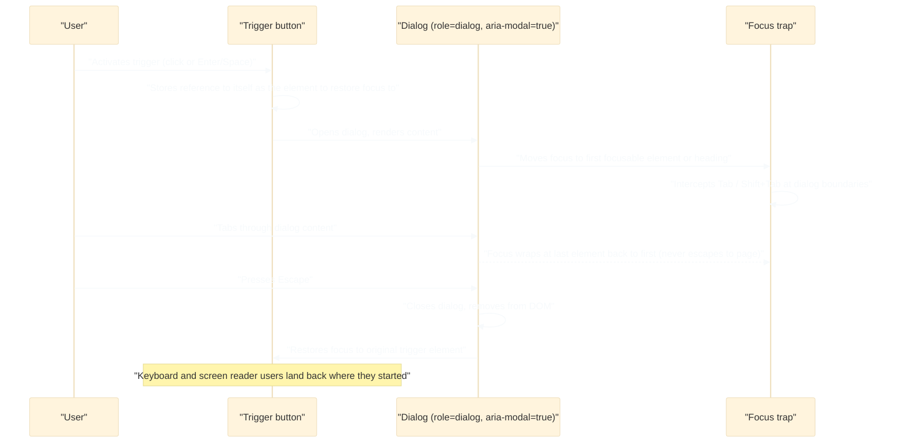
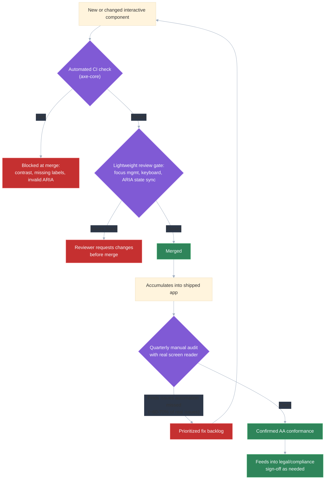

# Accessibility at scale: WCAG 2.1 AA, ARIA patterns, keyboard navigation

## 🎯 Executive Summary

Accessibility fails at scale for a predictable reason: it's treated as a per-component checklist item instead of a tested, audited engineering practice. A single team can hand-verify that its modal traps focus correctly; two hundred teams across a large org cannot, and the failures compound invisibly until a lawsuit, an audit, or a screen-reader user's bug report surfaces them. The technical content — WCAG success criteria, correct ARIA wiring, keyboard mechanics — is table stakes; the harder problem is building the organizational machinery (CI gates, audit cadence, review process) that keeps hundreds of components correct as the codebase keeps changing.

This is a must-know topic because interviewers treat accessibility the way they treat security: an unprompted signal of seniority, not something they expect to have to ask about. A Lead candidate who can implement a compliant modal from scratch *and* describe how to keep a whole org's components compliant over time is demonstrating exactly the systemic thinking the role requires — not "I remember to add `alt` text," but "I know automated tools catch roughly a third of real issues, so here's what covers the rest." This document goes deep on the WCAG/ARIA/keyboard mechanics and on scaling accessibility as an organizational discipline; for how accessibility should be architected *into* a shared component library specifically, see the "Accessibility as architecture, not a checklist" section of [`design-component-library.md`](design-component-library.md) — that's the design-system angle, this is the standards, patterns, and org-process angle.

## 🧠 Core Technical Deep Dive

### WCAG 2.1 AA: what the four principles actually require

WCAG is organized around four principles, commonly abbreviated POUR: Perceivable, Operable, Understandable, Robust. Each principle groups criteria around a different failure mode, and thinking in terms of the principle — not just the numbered criterion — is what lets you reason about a novel UI pattern the guidelines don't explicitly cover.

**Perceivable** means information can't depend on a single sense. A form field that's only marked invalid by turning its border red fails this for colorblind users; an autoplaying video with no captions fails it for deaf users. **Operable** means every interaction has a path that doesn't require a mouse or fine motor control — a custom dropdown that only opens on `mouseover` fails this outright. **Understandable** means behavior is predictable and errors are explained in text, not just color or an icon. **Robust** means the markup works correctly with assistive technology (AT), which in practice means correct semantic HTML or correct ARIA, parsed correctly by screen readers and other AT.

The three conformance levels (A, AA, AAA) aren't a difficulty slider so much as a legal and practical threshold: **AA is the level named in nearly every accessibility law and consent decree** (ADA-related settlements, Section 508 for U.S. federal contractors, EN 301 549 in the EU), so it's the de facto industry target. AAA includes criteria that are valuable but often impractical to guarantee site-wide (e.g., a 7:1 contrast ratio for all text), which is why almost no organization commits to it as a blanket standard.

| Success criterion | Level | Practical requirement |
|---|---|---|
| 1.4.3 Contrast (Minimum) | AA | 4.5:1 contrast for normal text; 3:1 for large text (18pt+/14pt bold) |
| 1.4.11 Non-text Contrast | AA | 3:1 contrast for UI components (button borders, input outlines) and graphical objects |
| 2.1.1 Keyboard | A | Every interactive element operable via keyboard alone, no mouse-only paths |
| 2.1.2 No Keyboard Trap | A | Focus must always be able to move away from any component using standard keys |
| 2.4.3 Focus Order | A | Tab order matches visual/logical reading order |
| 2.4.7 Focus Visible | AA | A visible focus indicator on every focusable element — never fully removed |
| 3.3.1 Error Identification | A | Errors described in text, not conveyed by color alone |
| 4.1.2 Name, Role, Value | A | Every custom UI component exposes an accessible name, role, and state to AT |
| 1.4.4 Resize Text | AA | Text remains usable at 200% browser zoom without loss of content/function |
| 1.4.10 Reflow | AA | Content reflows to a single column at 320px width without horizontal scrolling |

Two criteria come up disproportionately often in interviews and audits: 1.4.3 (contrast) because it's the easiest to test automatically and the easiest for a design team to accidentally violate, and 4.1.2 (name, role, value) because it's the criterion that ARIA exists specifically to satisfy for custom widgets.

> **Key takeaway:** "AA" isn't a vague aspiration — it's a specific, testable checklist, and knowing the concrete numbers (4.5:1, 3:1, 200% zoom) signals you've actually implemented against the spec rather than gestured at it.

### ARIA patterns: the first rule, and four patterns done correctly

The single most-overcorrected mistake in accessibility work is reaching for ARIA when native HTML already provides the semantics. A `<button>` gives you keyboard operability, focus, role, and state for free; a `
` requires you to manually re-implement all of it (Enter/Space activation, focus styling, the accessible name) and it's easy to miss one. The **first rule of ARIA** is: don't use ARIA if a native element does the job — ARIA is for filling gaps native HTML has no vocabulary for (custom widgets like comboboxes, tree views, tab panels), not a default choice.

**Modal / dialog.** A compliant dialog needs `role="dialog"` (or `alertdialog` for interruptive confirmations) and `aria-modal="true"` so AT knows content outside it is inert. On open, focus must move into the dialog — typically to its first focusable element or a heading — and stay trapped inside it via a focus trap that intercepts Tab/Shift+Tab at the dialog's boundaries. Escape must close it, and on close, focus must return to the element that opened it; skipping focus restoration is the single most common modal bug, since it leaves keyboard and screen reader users stranded at the top of the document.

**Combobox / autocomplete.** The input carries `role="combobox"`, `aria-expanded` (reflecting whether the suggestion list is open), and `aria-controls` pointing at the listbox's id. The open question is how the active suggestion is communicated: `aria-activedescendant` lets the input keep DOM focus while announcing which descendant option is "active" by id, while roving `tabindex` (moving `tabindex="0"` between options and calling `.focus()`) actually moves DOM focus into the list. `aria-activedescendant` is generally preferred for comboboxes specifically, since it keeps focus in the text input so typing keeps working while arrow keys move the "active" selection. Either way, the result count and top match should be announced via a polite live region as the user types, not left for the user to discover by scrolling.

**Accordion.** Each trigger is a real `<button>` with `aria-expanded` toggling true/false and `aria-controls` pointing at the id of the panel it reveals. The panel itself doesn't need much ARIA beyond a matching `id` — the trigger's `aria-expanded` state is what tells AT whether the content is currently visible, so it must be kept in sync with the actual DOM/visual state, not just set once on mount.

**Live regions.** `aria-live="polite"` queues an announcement until the screen reader is idle — correct for status updates like "3 results found" or "item added to cart." `aria-live="assertive"` interrupts whatever the screen reader is currently saying — reserve it for genuinely time-critical information like a session-expiry warning or a failed form submission, since overuse trains users to ignore interruptions. The token-by-token streaming case (piping AI-generated text directly into a live region produces an unlistenable word-by-word announcement) is a variant of this same debouncing problem, covered in depth in [`ai-integrated-ui-streaming.md`](ai-integrated-ui-streaming.md).

| Pattern | Key ARIA | Common bug |
|---|---|---|
| Dialog | `role="dialog"`, `aria-modal="true"` | No focus trap, or focus not restored on close |
| Combobox | `aria-expanded`, `aria-controls`, `aria-activedescendant` | Active option not announced, or DOM focus lost from input |
| Accordion | `aria-expanded` on trigger, `aria-controls` | `aria-expanded` not kept in sync with visual state |
| Live region | `aria-live="polite"`/`"assertive"` | Wrong urgency level, or updates too frequent to be intelligible |

> **Key takeaway:** ARIA patterns fail almost exclusively at the state-synchronization boundary — `aria-expanded` drifting from actual visibility, focus not landing or returning where expected — not from missing attributes on first render, which is why a code review that only checks initial markup misses most real bugs.

### Keyboard navigation mechanics

**Roving tabindex** solves the problem of composite widgets (tabs, toolbars, radio groups) needing exactly one Tab stop for the whole widget, with arrow keys moving *within* it. Only the currently-active item gets `tabindex="0"`; every other item in the widget gets `tabindex="-1"`, and arrow-key handlers move the `0` to the newly-focused item and call `.focus()` on it. Without this, a toolbar with ten buttons consumes ten Tab presses to get past, which is both slow and disorienting for keyboard users navigating a whole page.

**Focus on SPA route change** is a routinely missed case because nothing crashes when it's wrong — the bug is silent. When a client-side router swaps the page's content, the DOM node that previously had focus is often removed, and focus silently falls back to `<body>`, meaning a screen reader user gets no announcement that navigation happened at all and a keyboard user's next Tab press starts from the top of the page. The fix is deliberate: on route change, move focus to the new view's `<h1>` (with `tabindex="-1"` added so a non-interactive heading can still receive programmatic focus) so both the visual and the announced context update together.

**Visible focus indicators** must never be removed without a replacement — `outline: none` with nothing filling in for it is one of the most common and most damaging anti-patterns in production CSS, since it silently breaks keyboard operability for every visible-focus-dependent user while looking completely fine to a mouse user testing the page. `:focus-visible` is the correct tool for suppressing the indicator specifically on mouse clicks while keeping it for keyboard focus, rather than removing it unconditionally.

> **Key takeaway:** keyboard mechanics bugs are disproportionately *invisible* to the way most engineers test their own UI (with a mouse) — roving tabindex, route-change focus, and focus-visible all require someone to deliberately unplug the mouse to notice they're broken.

### Scaling accessibility across an organization

Automated tooling (axe-core, Lighthouse's a11y audit) is necessary but catches a minority of real issues — a commonly cited figure is that automated tools catch roughly **30-40% of WCAG violations**; the rest require human judgment (does this alt text actually convey the image's purpose, does this reading order make sense spoken aloud, is this error message actually understandable). Treating a clean axe-core run as "accessible" is a false sense of completeness that a Lead needs to explicitly correct for.

| Layer | What it catches | Cadence |
|---|---|---|
| Automated CI check (axe-core) | Contrast, missing labels, invalid ARIA, missing alt text | Every PR, as a merge gate |
| Lightweight component review gate | Focus management, keyboard operability, ARIA state sync | Every new/changed interactive component |
| Manual audit with real AT (a screen reader, not just automated tooling) | Reading order, announcement quality, workflow-level usability | Quarterly, or per major feature |
| Legal/compliance audit (often third-party) | Formal WCAG AA conformance sign-off | Annually, or ahead of a known risk event |

The organizational lever that matters most in practice is the second row: a lightweight review gate applied to every new component as it's built, rather than a periodic all-at-once compliance sweep across the whole app. A sweep finds a backlog of hundreds of issues that competes for priority against every other roadmap item and tends to lose; a per-component gate keeps the backlog from growing in the first place, which is a fundamentally cheaper problem.

The business case is concrete, not abstract: ADA Title III lawsuits against consumer-facing websites, Section 508 requirements for anything selling to U.S. federal agencies, and EN 301 549 in the EU are real, material legal exposure, not theoretical risk — this is worth naming explicitly when accessibility work needs to compete for prioritization against feature work, the same way [`tech-debt-management.md`](tech-debt-management.md) and [`influencing-upward.md`](influencing-upward.md) describe framing technical risk in terms a business stakeholder will act on.

> **Key takeaway:** accessibility "at scale" is an org-design problem — the technical patterns are learnable in an afternoon, but keeping hundreds of components correct over years requires automated gates, a real manual-audit cadence, and a review process that catches issues at the point of creation, not a periodic cleanup effort.

## 📊 Visual Architecture & Logic

### Diagram 1 — Modal dialog: focus lifecycle

### Diagram 2 — Scaling accessibility: from a single component to org-wide practice

## 🏢 Interview Context & FAANG Signals

Accessibility surfaces in three distinct interview formats, and Lead candidates are expected to handle all three without being prompted. In **system design rounds**, it's expected unprompted the same way security is — a design that never mentions keyboard operability or screen reader support for a user-facing feature reads as incomplete, not neutral. In **coding rounds**, "implement an accessible modal" or "build a combobox" is a common concrete prompt, and interviewers are specifically watching for focus trap/restoration and correct ARIA state, not just visual correctness. In **behavioral rounds**, candidates who've led accessibility work are asked how they scaled it past their own component.

**Lead signals interviewers listen for:**

- Naming the concrete AA numbers (4.5:1 contrast, keyboard operability, focus visible) rather than saying "we follow WCAG guidelines" vaguely.
- Citing the "first rule of ARIA" unprompted when discussing a custom widget — recognizing when native HTML would have been simpler and more robust.
- Describing accessibility as a *tested and audited* practice — CI gates, a manual audit cadence with real AT, a review gate on new components — not "I add alt text and aria-labels."
- Giving an honest caveat that automated tools catch a minority of real issues, rather than presenting a clean axe-core run as proof of compliance.
- Being able to connect accessibility risk to business terms (legal exposure under ADA/Section 508/EN 301 549) when the conversation turns to prioritization against feature work.

## ⚔️ Lead Level vs Senior Level

**Scenario: "How would you make sure our product is accessible?"**

A **Senior** response is technically sound at the component level: implement modals with focus traps, add proper ARIA to custom widgets, make sure color contrast passes, and run axe-core in CI to catch regressions.

A **Lead/Staff** response covers the same technical ground but is evaluated on additional dimensions:

- **Names the automated-tooling ceiling explicitly** — axe-core catches roughly a third of real issues — and proposes a manual audit with actual assistive technology to cover the rest, rather than treating a clean CI run as sufficient.
- **Proposes a review gate at the point of component creation**, not a periodic sweep, recognizing that a sweep produces a backlog that competes for priority and loses, while a gate keeps the backlog from forming.
- **Connects the work to legal/business risk in concrete terms** (ADA/Section 508/EN 301 549 exposure) when the conversation turns to prioritizing accessibility work against feature roadmap pressure.
- **Distinguishes org-wide scaling from single-component correctness**, explicitly separating "how do I build one accessible modal" from "how do I keep two hundred components accessible for years," and proposing different mechanisms for each.
- **Treats accessibility training and a lightweight internal audit cadence as part of the plan**, not just tooling — recognizing that engineers who've never used a screen reader systematically miss the same class of bugs.

The differentiator: a Senior answer produces an accessible feature; a Lead answer produces a system that keeps producing accessible features as the org and codebase keep growing, with honest acknowledgment of where automation stops helping.

## ⚠️ Common Pitfalls & Anti-Patterns

> ### ✕ Reaching for `role="button"` on a `
` instead of a `<button>`
> **Why it's wrong:** A native `<button>` provides keyboard operability, focus, accessible name, and role for free; a `div` with `role="button"` requires manually re-implementing Enter/Space activation, focus styling, and disabled state, and it's easy to miss one — violating the first rule of ARIA for no benefit.
> **✓ Correct Lead Approach:** Default to native interactive elements (`<button>`, `<a>`, `<input>`) and reach for ARIA roles only for widgets with no native HTML equivalent, like a combobox or a tree view.

> ### ✕ Removing focus outlines with `outline: none` and no replacement
> **Why it's wrong:** This is invisible to a mouse user testing their own UI but breaks keyboard operability for every keyboard and switch-device user, since they have no way to see which element is currently focused.
> **✓ Correct Lead Approach:** Use `:focus-visible` to suppress the default outline specifically on mouse interaction while keeping (or replacing with an equally visible custom style) the indicator for keyboard focus.

> ### ✕ Letting focus silently fall back to `<body>` on SPA route change
> **Why it's wrong:** When the router removes the previously-focused element, nothing crashes — the bug is silent, but a screen reader user gets no signal that navigation happened, and the next Tab press starts from the top of the page instead of the new content.
> **✓ Correct Lead Approach:** On every route change, deliberately move focus to the new view's heading (adding `tabindex="-1"` so it's programmatically focusable), so visual and assistive-technology context update together.

> ### ✕ Treating a clean axe-core CI run as proof the product is accessible
> **Why it's wrong:** Automated tools catch roughly 30-40% of real WCAG issues — they can't judge whether reading order makes sense spoken aloud, whether alt text actually conveys an image's purpose, or whether an error message is genuinely understandable.
> **✓ Correct Lead Approach:** Keep the automated CI gate as a floor, and pair it with a regular manual audit cadence using real assistive technology (a screen reader, not just a Lighthouse score) to catch what automation structurally can't.

> ### ✕ Running one all-at-once compliance sweep instead of a per-component review gate
> **Why it's wrong:** A periodic sweep surfaces a large backlog all at once, which then competes for priority against every other roadmap item and predictably loses, while new components keep shipping with the same class of bugs in the meantime.
> **✓ Correct Lead Approach:** Apply a lightweight accessibility review (focus management, keyboard operability, ARIA correctness) to every new or changed interactive component at merge time, so the backlog never has a chance to form.

## 🛠️ Practice Scenarios (5-10 Scenarios)

<strong>Scenario 1: Implementing an accessible modal from scratch</strong>

**Problem statement:** Implement a modal dialog component that meets WCAG 2.1 AA, given only a design mock and no existing accessible-modal library.

**Staff-Level Solution:**
Structurally: `role="dialog"`, `aria-modal="true"`, and an `aria-labelledby` pointing at the dialog's heading id so AT announces its purpose on open. On mount, store a reference to `document.activeElement` (the trigger) before moving focus into the dialog — typically to the heading or the first focusable control — and implement a focus trap that intercepts Tab/Shift+Tab at the dialog's first/last focusable elements so focus can never escape to the page behind it while open.

Escape must close the dialog, and on close, focus must be restored to the stored trigger reference — skipping this is the most common real-world bug and leaves keyboard/screen-reader users stranded. I'd also render the dialog through a portal at the DOM root and set `aria-hidden="true"` (or `inert`) on the rest of the page's content while open, so a screen reader in browse mode can't navigate into content that's visually and interactively unreachable.

<strong>Scenario 2: A combobox with broken screen-reader announcements</strong>

**Problem statement:** A search-as-you-type combobox works visually but a screen reader user reports it's unusable — they can't tell how many results exist or which one is currently highlighted.

**Staff-Level Solution:**
First check whether the result count and active option are exposed to AT at all — a purely visual highlight (a CSS background change on the hovered/arrow-selected `<li>`) with no corresponding `aria-activedescendant` update tells a screen reader nothing about which option is active. Fix by setting `aria-activedescendant` on the input to the id of the currently-active option as arrow keys move through the list, keeping DOM focus on the input itself so typing continues to work uninterrupted.

Second, add a polite live region (visually hidden, `aria-live="polite"`) that announces the result count as it changes — "5 results available" — so the user gets feedback without it interrupting their typing. I'd verify both fixes with an actual screen reader (VoiceOver or NVDA), not just by inspecting the ARIA attributes in devtools, since the practical announcement experience is what actually matters.

<strong>Scenario 3: Debugging a keyboard trap</strong>

**Problem statement:** QA reports that once a user tabs into a particular widget on the page, they can no longer tab out of it using the keyboard.

**Staff-Level Solution:**
This is a WCAG 2.1.2 (No Keyboard Trap) failure — almost always caused by a custom focus-trap implementation (built for a modal or a similar widget) that's either applied to a non-modal component by mistake, or has a bug in its boundary-detection logic that intercepts Tab even when the trap should be inactive. I'd reproduce it directly with keyboard-only navigation, then inspect whether a `keydown` handler is unconditionally calling `preventDefault()` on Tab regardless of the component's open/closed or modal/non-modal state.

The fix is scoping the trap correctly: it should only intercept Tab when the component is actually acting as a modal context (visible, `aria-modal="true"`), and should always provide an explicit exit — Escape, a close button, or simply falling out of the widget structurally when reaching its natural boundary in a non-modal case like a roving-tabindex toolbar. I'd add this as a regression test asserting that Tab from the widget's last element reaches the next focusable page element, not the trap's own first element, whenever the widget isn't in a genuinely modal state.

<strong>Scenario 4: Managing focus correctly on SPA route change</strong>

**Problem statement:** Users navigating a single-page app via the keyboard report that after clicking a nav link, they have no sense that the page changed — screen reader users get no announcement, and the next Tab press behaves unpredictably.

**Staff-Level Solution:**
The root cause is that the router swaps DOM content but never explicitly moves focus, so focus either stays on the (now stale or removed) previously-focused element or silently falls back to `<body>` — neither state gives AT anything to announce. Fix by wiring the router's navigation-complete event to programmatically focus the new view's `<h1>`, adding `tabindex="-1"` to make a non-interactive heading focusable without adding it to the natural Tab order.

I'd also update `document.title` on route change, since screen readers commonly announce the document title alongside a focus change and that's a large part of what communicates "you've navigated" to the user. For a fuller solution, I'd add a visually-hidden `aria-live="polite"` region announcing the new page's name explicitly, as a fallback for cases where heading-focus alone doesn't trigger a clean announcement in every screen reader/browser combination.

<strong>Scenario 5: Choosing `aria-live="polite"` vs `"assertive"` for a specific notification</strong>

**Problem statement:** The product wants three new notifications: "Item added to cart," "Your session will expire in 60 seconds," and "Payment failed — please try again." Assign the correct live-region urgency to each and justify it.

**Staff-Level Solution:**
"Item added to cart" is `aria-live="polite"` — useful confirmation, but not urgent enough to interrupt whatever the user is currently doing (like reading product details), so it should queue and announce once the screen reader is idle. "Payment failed" should also be `aria-live="assertive"`, since a failed payment is time-sensitive and actionable — the user needs to know immediately, even if it interrupts other announcements in progress, because silently failing to notice it could mean walking away thinking the purchase succeeded.

"Session expiring in 60 seconds" is the most debatable one, and I'd argue for `assertive` specifically because the cost of it being missed (an involuntary logout mid-task) is high and time-boxed, unlike the cart confirmation which has no real downside if the user notices it a moment late. As a general heuristic: default to `polite`, and only reach for `assertive` when the information is both time-critical and something the user needs to act on, since overusing assertive trains users to tune out interruptions.

<strong>Scenario 6: Auditing an existing app and prioritizing fixes with limited time</strong>

**Problem statement:** You're given two weeks to improve accessibility across an app that's never had a dedicated audit. There are likely dozens of issues. How do you prioritize?

**Staff-Level Solution:**
Run an automated scan (axe-core against every route) first as a fast triage pass to surface the high-volume, low-effort category — missing alt text, contrast failures, missing form labels — since these are typically the bulk of the raw issue count and the cheapest to fix. In parallel, do a manual pass with an actual screen reader through the two or three highest-traffic user flows (login, checkout, primary task), since automated tools structurally can't catch broken keyboard traps, illogical reading order, or unusable custom widgets, and those are the issues most likely to make the product genuinely unusable rather than merely non-compliant.

I'd prioritize by a combination of user impact and legal risk rather than raw issue count: a keyboard trap on the checkout flow blocks a transaction entirely and is both a UX and legal risk, while a slightly-off contrast ratio on a rarely-visited settings page is real but lower stakes. I'd close the two weeks with a written punch list of what's fixed, what's deferred and why, and a recommendation for the ongoing cadence (CI gate plus quarterly manual audit) so this doesn't become a one-time exercise that silently decays again.

<strong>Scenario 7: Defending accessibility budget to a skeptical PM</strong>

**Problem statement:** A PM pushes back on allocating a sprint to accessibility fixes, arguing "we have no evidence any of our users actually need this" and wants the engineers reassigned to a feature.

**Staff-Level Solution:**
"Absence of complaints isn't evidence of absence of need — users who can't operate a broken flow generally don't file a bug report explaining why, they just leave, so 'no evidence' likely means we're not measuring this, not that it isn't happening. Beyond usage, this carries real legal exposure: ADA Title III lawsuits against consumer-facing sites are common and costly, and if we sell to enterprise or government customers, Section 508 or EN 301 549 conformance is often a hard procurement requirement, not optional polish.

I'd propose framing this the same way we'd frame any other tech-debt risk: quantify what's broken (keyboard traps, unusable custom widgets on core flows), name the concrete risk (legal exposure, procurement blockers, unmeasured user drop-off), and scope a fix that's proportionate rather than open-ended — not a full audit-and-fix-everything sprint, but closing the highest-risk gaps on our highest-traffic flows. If after that the data shows genuinely no impact, that's a legitimate basis to deprioritize further work; right now we simply don't have the data to make that call safely."

<strong>Scenario 8: A color-contrast failure found late in a design review</strong>

**Problem statement:** A new feature is one sprint from shipping when a design review flags that its primary CTA button's text fails WCAG contrast (light gray text on a light blue background, measuring roughly 2.8:1 against the required 4.5:1). The visual design has already been approved by stakeholders and is used elsewhere in the mock.

**Staff-Level Solution:**
Treat this as a blocking, not optional, fix — 1.4.3 is an AA success criterion, not a nice-to-have, and shipping it knowingly non-compliant creates the exact legal/audit exposure discussed earlier for a component that's about to become widely deployed. I'd propose the smallest correction that preserves the design intent: darken the text color (or the background) until it clears 4.5:1, and check the result against the design system's existing token palette first, since the fix is very likely a one-line token swap rather than a bespoke color.

I'd also flag this as a process gap rather than a one-off bug: if this made it through design approval and code review before being caught in a late-stage review, the design system's own token definitions or a design-tool plugin (many Figma contrast plugins exist) should be catching this automatically before it ever reaches engineering. I'd request that fix alongside the immediate one, specifically so the same failure mode doesn't recur on the next feature that reuses this or a similar color pair.

