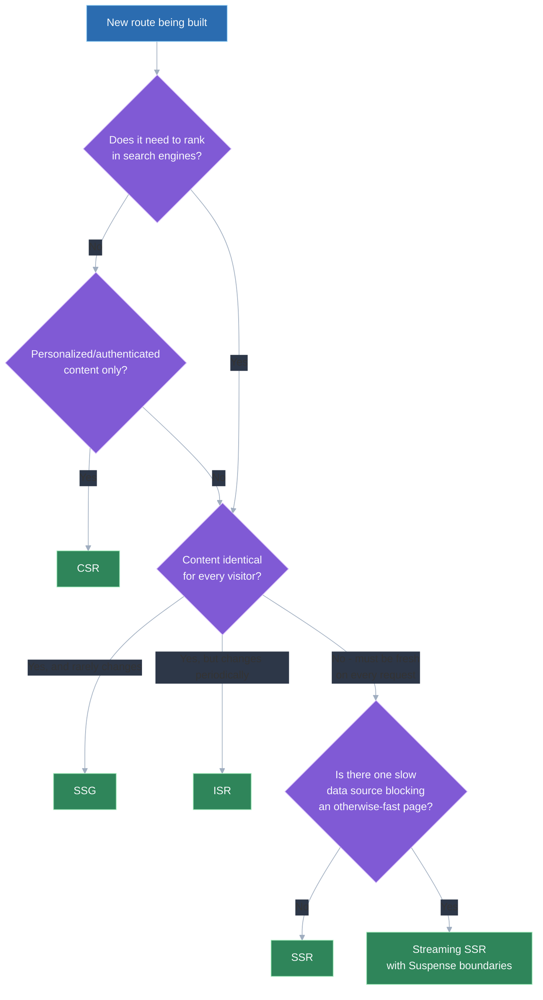
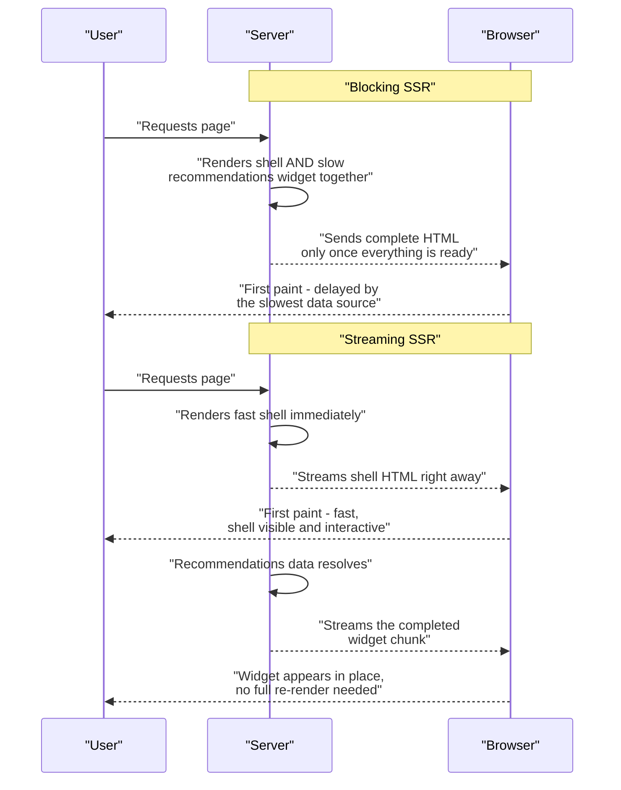

# Advanced rendering strategies: CSR vs SSR vs SSG vs ISR vs streaming SSR — trade-offs

## 🎯 Executive Summary

There is no single "correct" rendering strategy — CSR, SSG, SSR, ISR, and streaming SSR each sit at a different point on the freshness-vs-performance-vs-infrastructure-cost spectrum, and a real production app almost always mixes several of them across different routes rather than picking one globally. The question a Lead is actually being tested on isn't "which one is best," it's "given this specific route's freshness, personalization, and SEO requirements, which strategy fits, and what does that choice cost."

This is a must-know topic because rendering strategy sits directly upstream of Core Web Vitals, infrastructure spend, and SEO outcomes simultaneously — getting it wrong on a high-traffic route is expensive in all three dimensions at once. The deeper signal interviewers look for is per-route judgment: recognizing that a marketing homepage, a product page, and an authenticated dashboard in the same app have genuinely different requirements and shouldn't share a rendering strategy by default.

## 🧠 Core Technical Deep Dive

Five distinct strategies actually get used in production, differing in *when* rendering happens and *how fresh* the result is by the time a user sees it.

### 1. CSR (Client-Side Rendering)

**How it works:** the server sends a mostly-empty HTML shell; the browser downloads the JS bundle, executes it, fetches any data it needs, and renders everything client-side. Nothing meaningful is in the initial HTML response at all.

**Used for:** authenticated, highly interactive apps where SEO doesn't matter and every user sees genuinely personalized content anyway — dashboards, admin tools, internal apps.

**Drawbacks:**
- Slow time-to-meaningful-paint: the user sees a blank page or a spinner until JS downloads, parses, executes, and finishes its own data fetch — often a three-step waterfall (HTML → JS bundle → data fetch) before anything useful renders.
- Poor SEO by default — crawlers that don't execute JS see an empty shell, and even crawlers that do execute JS pay a real cost for it.
- Every additional KB of JS bundle directly extends the blank-screen window, so CSR apps are unusually sensitive to bundle size.

> **Key takeaway:** CSR trades away initial-paint speed and SEO entirely in exchange for the simplest infrastructure story — it's the right default only when neither of those trade-offs actually matters for the route in question.

### 2. SSG (Static Site Generation)

**How it works:** every page's HTML is fully rendered once, at build time, and served as a static file from a CDN — no server-side work happens per request at all.

**Used for:** content that's the same for every visitor and doesn't change on a per-request basis — marketing pages, documentation, blog posts.

**Drawbacks:**
- Content is only as fresh as the last build — a content change requires a full rebuild and redeploy to go live, which is a real problem for anything that updates more than occasionally.
- Build time scales with page count; a site with tens of thousands of pages can have build times that make this impractical without further tooling.
- Fundamentally incompatible with per-user personalization or authenticated content, since the same static HTML is served to everyone.

> **Key takeaway:** SSG gives the best possible performance (pure CDN-served static files, no server work per request) at the cost of freshness — it's the right choice specifically when content genuinely doesn't change per-request or per-user.

### 3. SSR (Server-Side Rendering, per request)

**How it works:** on every request, the server renders the full HTML fresh, sends it down complete, and the browser hydrates it into an interactive React (or equivalent) tree.

**Used for:** content that needs to be both fresh on every load *and* SEO-relevant or fast-to-first-paint — a product page with live inventory and pricing, a search-results page.

**Drawbacks:**
- Real server cost per request — every page view does actual rendering work on a server, which is a scaling and infrastructure cost CSR and SSG don't have.
- TTFB (time to first byte) is slower than a cached static response, because the server has to finish rendering before sending anything.
- Hydration mismatch risk: if the server-rendered HTML and the client's first render don't agree exactly, React throws hydration errors or silently produces incorrect output.

> **Key takeaway:** SSR buys freshness and SEO together, but pays for it with real per-request server cost and a slower TTFB than anything cache-served — it's the right tool specifically when both freshness and first-paint SEO genuinely matter for that route.

### 4. ISR (Incremental Static Regeneration)

**How it works:** pages are served from a static cache exactly like SSG, but each page carries a revalidation window — after that window expires, the *next* request triggers a background regeneration, and once it completes, subsequent requests get the updated static output. No full site rebuild is needed for one page to update.

**Used for:** content that changes, but not on every single request — a product catalog, news articles, a listing page that updates every few minutes rather than every second.

**Drawbacks:**
- The stale window is a real, observable behavior, not a theoretical edge case: a request arriving right before revalidation completes gets outdated content, and that's an accepted trade-off, not a bug.
- Cache invalidation across CDN edge nodes adds real operational complexity, especially for on-demand revalidation (triggering a specific page's update the moment its source data changes, rather than waiting for the time-based window).
- Still fundamentally a shared cache — it's the wrong tool the moment content needs to be different per authenticated user.

> **Key takeaway:** ISR is the practical middle ground between SSG's speed and SSR's freshness — it works precisely because most "dynamic" content doesn't actually need to be fresh on every single request, just fresh enough within a bounded staleness window.

### 5. Streaming SSR

**How it works:** instead of the server finishing the entire render before sending anything (blocking SSR's core limitation), the server starts streaming HTML in chunks as pieces become ready. React 18's Suspense boundaries mark which sections are allowed to arrive later — the fast "shell" (layout, navigation) streams immediately, while a boundary wrapping a slow, data-dependent section (say, a personalized recommendations widget) streams in once its data resolves, without blocking everything else. Selective hydration lets the browser hydrate and make interactive the parts that have already arrived, rather than waiting for the entire tree.

**Used for:** pages with a fast, mostly-static shell but one or two genuinely slow, data-heavy sections — getting SSR's freshness and SEO benefit without letting the single slowest data source block the entire response.

**Drawbacks:**
- Real structural complexity: where Suspense boundaries are placed determines what streams together, and getting this wrong reintroduces a waterfall (a boundary depending on another boundary's data can't resolve any faster than that dependency).
- Requires explicit loading/error states per boundary — every streamed section needs its own fallback UI story, not just one page-level spinner.
- Requires framework-level support for the streaming APIs (Next.js App Router, or equivalent) — this isn't a drop-in change to an existing blocking-SSR setup.

> **Key takeaway:** streaming SSR doesn't replace the SSR-vs-SSG-vs-ISR decision — it's an optimization *on top of* SSR that prevents one slow data source from blocking an entire otherwise-fast response.

### 6. Choosing per-route, not per-app

The five strategies above aren't mutually exclusive at the application level — a real production app (a Next.js app is the clearest example, since it supports all five natively per-route) typically mixes them: SSG for the marketing pages, ISR for the product catalog, SSR or streaming SSR for personalized/SEO-critical product pages, and CSR for the authenticated account dashboard behind login.

| Question about the route | Points toward |
|---|---|
| Does this need to rank in search engines? | SSG / SSR / ISR / streaming SSR (not plain CSR) |
| Is the content identical for every visitor? | SSG (or ISR if it still changes periodically) |
| Does it need to be fresh on literally every request? | SSR or streaming SSR |
| Does it change, but not every request — minutes-to-hours staleness is fine? | ISR |
| Is it authenticated/personalized with no SEO need? | CSR |
| Is there one slow data-dependent section blocking an otherwise-fast SSR page? | Streaming SSR |

> **Key takeaway:** the Lead-level answer to "which rendering strategy should we use" is almost never one strategy for the whole app — it's a per-route decision driven by that specific route's freshness, personalization, and SEO requirements.

## 📊 Visual Architecture & Logic

### Diagram 1 — Choosing a rendering strategy per route

### Diagram 2 — Blocking SSR vs streaming SSR, same page

## 🏢 Interview Context & FAANG Signals

This surfaces heavily in **frontend system design rounds** ("design the rendering architecture for an e-commerce site" almost always expects a per-route breakdown, not one global answer), **performance rounds** (diagnosing a slow TTFB or a poor Core Web Vitals score traced back to the wrong strategy for a given route), and **debugging rounds** (a hydration mismatch, a stale-content bug traced to ISR's revalidation window).

**Lead signals interviewers listen for:**

- Proposing a per-route strategy mix unprompted, rather than defaulting to "we'll use SSR/Next.js for everything."
- Correctly naming ISR's stale-window trade-off as an accepted, bounded behavior rather than a bug to be eliminated.
- Understanding streaming SSR as an optimization layered on SSR, not a sixth independent strategy competing with the other four.
- Connecting rendering strategy choice directly to Core Web Vitals (TTFB, LCP) and to SEO crawlability, not treating them as separate concerns.
- Naming the real infrastructure cost difference between SSR (per-request server work) and SSG/ISR (cache-served, minimal per-request cost).

## ⚔️ Lead Level vs Senior Level

A **Senior** response typically names the five strategies correctly and picks one reasonable option for the app as a whole: "I'd use SSR since we need SEO and the content is dynamic."

A **Staff/Lead** response breaks the app down by route first, and only then proposes a strategy per route — the marketing pages get SSG, the product catalog gets ISR with a sensible revalidation window, personalized product pages get streaming SSR so a slow recommendations widget doesn't block the fast, SEO-critical shell, and the authenticated account area gets CSR since it needs neither SEO nor a fast first paint before login. They can also name the operational cost each choice actually carries — ISR's cache-invalidation complexity, SSR's server-scaling cost, streaming SSR's Suspense-boundary design work — rather than treating the choice as free.

## ⚠️ Common Pitfalls & Anti-Patterns

> ### ✕ Picking one rendering strategy for the entire app
> **Why it's wrong:** Different routes have genuinely different freshness, personalization, and SEO requirements — forcing a marketing page and an authenticated dashboard through the same strategy either wastes server cost on content that could be static, or sacrifices freshness/SEO on content that needed it.
> **✓ Correct Lead Approach:** Default to a per-route decision, using the route's actual requirements (SEO need, personalization, freshness) to pick independently for each part of the app.

> ### ✕ Treating ISR's stale window as a bug to be engineered away
> **Why it's wrong:** Chasing zero staleness out of ISR either means shrinking the revalidation window until it's effectively SSR (losing the cost/performance benefit that made ISR attractive) or building unnecessary on-demand invalidation infrastructure for content that didn't actually need sub-minute freshness.
> **✓ Correct Lead Approach:** Set the revalidation window to match the content's actual real-world freshness requirement, and accept the bounded staleness as the deliberate trade-off ISR is designed around.

> ### ✕ Using CSR for SEO-relevant content and hoping crawlers handle it
> **Why it's wrong:** Even crawlers that execute JavaScript pay a real cost to do so and don't guarantee the same indexing outcome as server-rendered HTML — betting organic search traffic on best-effort JS-executing crawlers is a real, measurable risk, not a solved problem.
> **✓ Correct Lead Approach:** Any route that needs to rank in search results should use SSG, SSR, ISR, or streaming SSR — reserve CSR specifically for authenticated or otherwise non-indexed content.

> ### ✕ Adding Suspense boundaries without designing their loading/error states
> **Why it's wrong:** Streaming SSR's benefit depends on each boundary having a real fallback UI — skipping this either produces a page-level spinner that defeats the purpose of streaming, or an unhandled error in one boundary that breaks the whole page instead of failing gracefully in place.
> **✓ Correct Lead Approach:** Treat each Suspense boundary as needing its own explicit loading skeleton and error boundary, designed as part of the same work as adding the boundary itself.

> ### ✕ Ignoring hydration mismatch risk when mixing server and client rendering
> **Why it's wrong:** Anything that can differ between server and client render — `Date.now()`, `Math.random()`, browser-only APIs read during render, locale/timezone differences — produces a hydration mismatch that either throws a visible error or silently re-renders incorrect content on the client.
> **✓ Correct Lead Approach:** Keep server and client render output deterministic and identical; defer anything genuinely client-only (like reading `window`) to an effect that runs after hydration, not during the initial render.

## 🛠️ Practice Scenarios

### Scenario 1 — Designing the Rendering Architecture for an E-Commerce Site

Design the rendering strategy across a full e-commerce site: homepage, category listing pages, product detail pages, and the authenticated account/order-history area.

Staff-Level Solution

Break it down by route rather than picking one strategy site-wide. The homepage and marketing/campaign pages are SSG — identical for every visitor, rebuilt on content changes. Category listing pages are ISR with a revalidation window matched to how often inventory/pricing actually changes (minutes, not seconds), since serving a slightly-stale listing is an acceptable trade-off for the performance win.

Product detail pages need both SEO and near-real-time pricing/inventory accuracy, and typically have one slower section (personalized recommendations, reviews) — streaming SSR fits well here, with the core product info in the fast shell and the recommendations widget in its own Suspense boundary. The authenticated account/order-history area needs neither SEO nor a fast pre-login first paint, so CSR is the right, simplest choice there.

### Scenario 2 — Diagnosing a Slow Time-to-First-Byte on a Product Page

A product page's TTFB regressed after a migration to SSR, even though the page's content is genuinely correct and fresh.

Staff-Level Solution

Confirm first that the regression is actually TTFB and not a downstream metric — SSR moves rendering work onto the server, so a slow SSR TTFB usually traces to a slow data fetch or an expensive render happening synchronously before any bytes are sent, rather than a network issue.

If the page has one identifiably slow data dependency (a personalization API, a third-party call), the fix is very likely migrating to streaming SSR — wrap the slow section in a Suspense boundary so the fast parts of the page can stream immediately instead of the entire response waiting on the slowest dependency. If most of the content doesn't actually need per-request freshness, question whether SSR was the right choice at all versus ISR.

### Scenario 3 — Choosing Between ISR and SSR for a News Site

A news site's article pages need to be reasonably fresh (breaking news should appear quickly) but also get significant search traffic. Choose a rendering strategy and defend it.

Staff-Level Solution

ISR is the better default here over full SSR: most articles, once published, don't change on a per-request basis — they need to become visible quickly after publishing and then stay essentially static. Use on-demand revalidation triggered at publish time (rather than only a time-based window) so a new or edited article goes live immediately without waiting for a stale-time to expire, while still getting ISR's cache-served performance for the (much more common) case of an already-published article being read.

Reserve full SSR specifically for something like a live-updating breaking-news ticker or liveblog component, if one exists, since that genuinely needs per-request freshness that ISR's caching model can't provide.

### Scenario 4 — Debugging a Hydration Mismatch Error

Users report a console error and visibly flickering content on page load, specifically on a page that renders a "time since posted" (e.g., "5 minutes ago") string.

Staff-Level Solution

This is a textbook hydration mismatch: the server renders "5 minutes ago" based on the server's clock at render time, and by the time the client hydrates, even a few seconds later, `Date.now()`-derived output can differ — React detects the server and client output don't match and either warns/errors or reconciles by re-rendering client-side, causing the visible flicker.

Fix by deferring the relative-time calculation to run only after hydration (compute a static, deterministic value like the absolute timestamp during SSR, then compute and swap in the relative "5 minutes ago" string in a `useEffect` that runs client-side only) — this keeps server and client output identical during hydration itself, eliminating the mismatch.

### Scenario 5 — Migrating a CSR Dashboard to Improve SEO for a Subset of Pages

A fully CSR single-page app discovers that a handful of its pages (public profile pages) actually do need to be indexed by search engines, while the rest of the app remains authenticated and CSR-appropriate.

Staff-Level Solution

This doesn't require migrating the whole app — it's a strong case for a mixed strategy: keep the authenticated app CSR, and specifically move the public profile route(s) to SSR or SSG depending on how often profile content changes (SSG with periodic rebuilds if changes are infrequent; ISR if profiles update often enough that a rebuild-per-change is impractical).

Confirm the migrated routes don't accidentally inherit authenticated-only data-fetching patterns designed for CSR (like fetching everything client-side after mount) — the whole point of the migration is that the public route's content needs to be present in the initial server-rendered HTML for crawlers to see it.

### Scenario 6 — Justifying ISR's Cache Invalidation Complexity to a Skeptical Team

A team is hesitant to adopt ISR because of the operational complexity of cache invalidation across CDN edge nodes, and is considering just using plain SSR everywhere instead to sidestep the problem.

Staff-Level Solution

Acknowledge the complexity is real, but frame the trade-off honestly: plain SSR everywhere means paying real per-request server cost and slower TTFB on every single page view, indefinitely, in exchange for avoiding an invalidation mechanism that's largely a one-time setup cost. For high-traffic, infrequently-changing content, that ongoing SSR cost usually dwarfs the one-time complexity of setting up on-demand revalidation.

Propose starting with time-based revalidation only (no on-demand invalidation) for an initial rollout — it's much simpler to implement and reason about, and covers a large fraction of use cases; on-demand invalidation can be added later specifically for content where the time-based staleness window proves genuinely unacceptable.

### Scenario 7 — A Suspense Boundary Is Making Streaming SSR Slower, Not Faster

After adopting streaming SSR with Suspense boundaries, a page's perceived load time got worse, not better.

Staff-Level Solution

This is almost always a boundary-placement problem: if a Suspense boundary's data fetch doesn't start until the component actually renders (rather than being kicked off in parallel with the shell), the streaming benefit is lost — the page ends up with the same effective waterfall as blocking SSR, just wrapped in Suspense machinery that adds its own overhead.

Fix by starting the slow boundary's data fetch as early as possible, in parallel with the shell's render rather than after it, so the boundary is genuinely waiting on network time rather than waiting on its own turn to even begin fetching. Also verify boundaries aren't nested in a way that creates a dependency chain (boundary B needing boundary A's data) unless that dependency is actually real.

### Scenario 8 — Choosing a Strategy When Requirements Are Ambiguous

An interviewer describes a new route with deliberately incomplete requirements — "some kind of listing page, might need SEO eventually, content updates sometimes" — and asks for a rendering strategy decision.

Staff-Level Solution

Resist picking a strategy before asking the clarifying questions that actually determine it: does this need to be crawlable now or "eventually" (a real distinct requirement, not a hedge to ignore), how often does "sometimes" actually mean in concrete terms, and is content the same for every visitor or personalized.

If forced to decide under genuine ambiguity, default to the more conservative, easier-to-migrate-from option — ISR is a reasonable middle-ground starting point precisely because it's straightforward to tighten toward SSR (shrink the revalidation window) or loosen toward SSG (lengthen it) once real requirements are known, rather than committing to either extreme early. State this reasoning explicitly rather than silently picking one option — the reasoning under ambiguity is the actual signal being tested.

