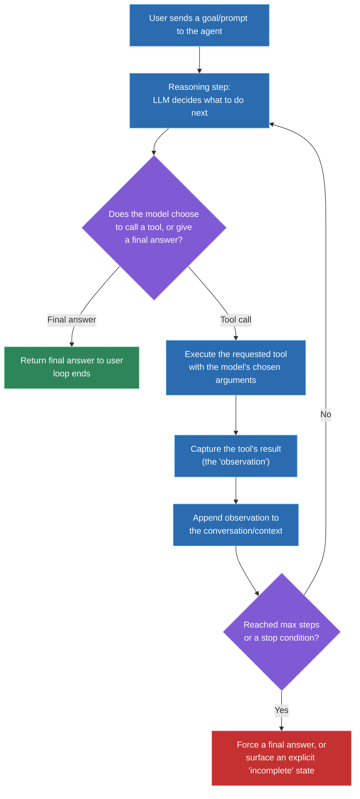
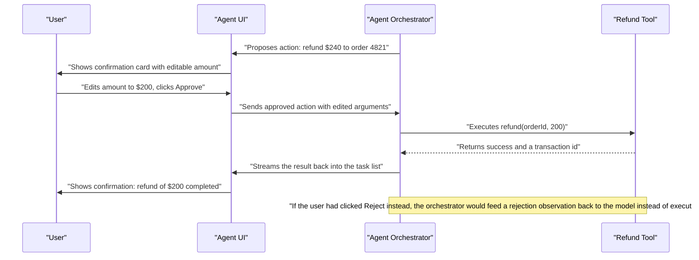

# Agentic UI patterns: visualizing tool calls, human-in-the-loop confirmation, multi-step task progress

## 🎯 Executive Summary

An "AI feature" and an "agent" are not the same thing, and the gap between them is exactly where most of the hard UI engineering lives. A chatbot wraps a single LLM call in a text box; an agent gives the model the ability to take actions — call tools, observe results, decide what to do next — in a loop, with real autonomy over multi-step plans. That loop needs to be made visible, interruptible, and safe, and building the UI for it is now squarely Frontend Lead territory, not something you can hand-wave as "backend's problem."

This is a must-know topic because the interview bar has shifted: it's no longer enough to know how to render a chat bubble. Leads are expected to understand the actual mechanics of a tool-calling loop well enough to design around its real failure modes — a stuck loop, an unconfirmed high-stakes action, an opaque multi-step task nobody can follow — and to be able to speak concretely about having built one, not just used one.

## 🧠 Core Technical Deep Dive

This is easiest to build up as one story — Meridian's team going from "we shipped a chatbot" to "we shipped an agent," and discovering exactly what that distinction demands from the UI at every step.

### Act 1 — The vocabulary problem that shows up in a hiring debrief

A candidate interview debrief stalls on one question: "have we actually built an agent?" Half the team says yes — Meridian Copilot calls a function to look up an order. The other half says no — it does exactly one lookup and stops; there's no loop, no autonomy, no multi-step plan. Both are right, because the team has been using "AI," "LLM," "agent," and "agentic AI" as interchangeable marketing words, and the interview question just exposed that nobody had actually defined them.

Sorting it out becomes the first real deliverable:

| Term | What it actually means | Autonomy |
|---|---|---|
| **LLM** | The model itself — takes text in, predicts the next tokens out. No memory, no actions, no loop on its own. | None |
| **AI feature / "chatbot"** | One (or a short fixed sequence of) LLM call wrapped in a UI — ask a question, get an answer. | None beyond the single call |
| **Agent** | An LLM given tools it can call, whose output (an observation) feeds back into another LLM call, repeating until the model decides it's done. | Decides *which* tool to call and *when* to stop, within a defined toolset |
| **Agentic AI / multi-agent system** | Multiple such loops coordinating — one agent planning, others executing specialized sub-tasks, potentially negotiating or handing off work between them. | Decides *how* to decompose a goal into sub-tasks, sometimes across multiple models |

Meridian Copilot's single order-lookup call is the second row, not the third — a real agent would look up the order, *decide from the result* whether it needs to also check a refund policy tool, *decide* whether a human needs to approve what it found, and only then produce a final answer. That distinction isn't pedantic — it's the entire reason the rest of this story exists, because a chatbot has no loop to visualize and a real agent has almost nothing *but* the loop to visualize.

> **Key takeaway:** "agent" specifically means a model that can choose actions and observe their results across more than one step — if there's no loop, there's no agent, no matter how good the single answer is.

### Act 2 — Building the actual loop, because you can't design its UI without one

Before touching the UI, the team builds the smallest real version of the mechanism, because the interview-relevant skill isn't "describe an agent," it's "have actually built the loop." The shape is the ReAct pattern — **Reason, Act, Observe**, repeated — and it's genuinely small:

```typescript
async function runAgentLoop(userGoal: string, tools: ToolDefinition[]) {
  const messages: Message[] = [{ role: 'user', content: userGoal }];

  for (let step = 0; step < MAX_STEPS; step++) {
    const response = await llm.chat({ messages, tools });

    if (response.type === 'final_answer') {
      return response.content;
    }

    // response.type === 'tool_call'
    const result = await executeTool(response.toolName, response.arguments);
    messages.push(
      { role: 'assistant', toolCall: response },
      { role: 'tool', toolName: response.toolName, content: result },
    );
  }

  return { status: 'incomplete', reason: 'max_steps_exceeded' };
}
```

Every line of that loop maps directly to something the UI has to represent. The model's decision to call a tool (versus answer) is a state the user should see, `executeTool` is a moment the user might need to approve *before* it runs, and the result pushed back as a `'tool'` message is an observation worth showing, not hidden as internal plumbing.

`MAX_STEPS` is a real, load-bearing safety limit, not defensive boilerplate. Without it, an agent stuck reasoning in circles on ambiguous input calls tools forever, burning inference cost with no forward progress and no way for the UI to know it should stop waiting.

> **Key takeaway:** the loop is small enough to build and understand completely, and every one of its four moments — reason, act, observe, repeat-or-stop — is a UI decision waiting to be designed, not an implementation detail to abstract away.

### Act 3 — What actually has to render at each turn of the loop

Shipping the UI on top of that loop is where "agentic UI" stops being an abstract phrase. The naive version shows a spinner until `runAgentLoop` resolves and then reveals the final answer — which throws away everything interesting and leaves the user staring at a black box for however many tool calls it takes to finish.

The real UI needs a distinct visual state for each loop phase: a "thinking" indicator while the model reasons, a visible tool-call card the moment `response.type === 'tool_call'` fires — naming the tool and its arguments, not just a generic spinner — and a rendered observation once the result comes back, before the loop continues to the next reasoning step. Stacked in order, this becomes a **task list**, not a single message: step 1 (looked up order 4821 — done), step 2 (checking refund eligibility — in progress), step 3 (pending). That list is what turns an opaque multi-step wait into something a user can actually follow and trust.

| Loop phase | UI representation | Why it matters |
|---|---|---|
| Reasoning | "Thinking…" indicator, optionally streaming the model's rationale | Distinguishes "working on it" from "stuck" |
| Tool call proposed | A card naming the tool and its arguments | The single most important trust signal — vague activity reads as untrustworthy |
| Tool executing | Per-step loading state within the task list, not a full-page spinner | Lets the user see progress instead of an undifferentiated wait |
| Observation returned | Rendered result, appended to the visible task list | Makes failures diagnosable — "it looked up the wrong order" is visible, not hidden |
| Loop continues or stops | Either the next step lights up, or a final answer / explicit incomplete state appears | Closes the loop visually the same way it closes logically |

> **Key takeaway:** rendering only the final answer is the single most common agentic-UI mistake — the loop's intermediate states are not implementation noise, they're the entire trust and debuggability story for both the end user and the engineer who has to fix it later.

### Act 4 — The incident that makes human-in-the-loop non-negotiable

Weeks later, a near-miss: during testing, the agent correctly diagnoses that a customer is owed a refund, correctly calls the refund tool — and would have executed a real $240 refund with no human ever seeing the amount, had the tool not been pointed at a sandbox account. The loop worked exactly as designed. That's precisely the problem: "worked as designed" and "safe to run unsupervised" are different bars, and nothing in Act 2's loop distinguishes a read-only lookup from an irreversible financial action.

The fix is a human-in-the-loop (HITL) gate inserted between "tool call proposed" and "tool executes," for any tool flagged as high-stakes: the UI shows the proposed action with its *editable* arguments — not just a "confirm?" button, but the actual amount, order id, and recipient, changeable before approval — and the tool only executes after explicit approval. A rejection doesn't just cancel silently; it feeds back into the loop as an observation ("user declined this action"), so the model can adapt — try a different amount, ask a clarifying question, or stop.

```typescript
if (tool.requiresConfirmation) {
  const decision = await ui.showConfirmation({
    toolName: response.toolName,
    arguments: response.arguments,  // rendered as editable fields
  });
  if (decision.approved) {
    result = await executeTool(response.toolName, decision.editedArguments);
  } else {
    result = { status: 'rejected', reason: decision.reason };
  }
}
```

A confirmation dialog that shows a vague "Approve this action?" without surfacing the actual arguments isn't a real safety gate — it's a rubber stamp with extra steps. That distinction is worth naming explicitly, because it's exactly the kind of pitfall that looks like a solved problem in a demo and isn't one in production.

Timeouts matter too: if nobody responds, the safe default is the action doesn't happen, with the agent surfacing that it's still waiting rather than silently proceeding after some delay.

> **Key takeaway:** human-in-the-loop isn't a generic "add a confirm dialog" pattern — it's specifically gating irreversible or high-stakes tool calls behind a review step where the human can see and edit the real arguments, with rejection routed back into the loop rather than just discarded.

### Act 5 — Where this connects to what's actually your job, and what isn't

Two more pieces round out the picture, and both are worth being precise about scope on. Retrieval-Augmented Generation (RAG) means fetching relevant documents before generation, so the model answers grounded in real content instead of only its training data. It shows up here specifically as a UI problem: whatever gets retrieved should be shown as a citation or source, not silently blended into the answer as if the model "just knew" it.

That citation requirement is partly about trust, but it's also a security boundary — a retrieved document is untrusted input that can carry a prompt-injection payload aimed at the agent's next tool call. The same defense-in-depth thinking from output-rendering security applies here, just one step earlier in the loop.

And the honest scope boundary: building the retrieval pipeline itself (chunking, embeddings, ranking) and the production agent orchestration platform is typically owned by ML/backend/platform teams, not a Frontend Lead's day-to-day. What *is* legitimately yours, and what credibly answers "have you built an agent" in an interview, is exactly Act 2's loop plus Acts 3 and 4's UI.

A small, real, end-to-end prototype demonstrating the reasoning/tool-call/observation cycle with proper HITL gating is a genuine, honest portfolio piece. Claiming ownership of a production multi-tenant agent platform you didn't build is not — a good interviewer will find the gap in the first follow-up question.

> **Key takeaway:** know RAG's UI implications (citations, treating retrieved content as untrusted) without overclaiming pipeline ownership, and be able to point at a small, real, self-built agent loop rather than a description of one — that combination is what actually reads as credible AI experience in an interview.

## 📊 Visual Architecture & Logic

### Diagram 1 — The reason/act/observe agent loop



### Diagram 2 — Human-in-the-loop confirmation before a high-stakes tool call



## 🏢 Interview Context & FAANG Signals

This surfaces in **system design rounds** (design the UI and orchestration for a multi-step agent, e.g., a support or research assistant), **coding rounds** (implement a tool-calling loop, or a human-in-the-loop confirmation step, from scratch), **debugging rounds** (diagnose a stuck or runaway agent loop), and increasingly in **portfolio/behavioral rounds** — "walk me through something agentic you've built" is now a common opener, and candidates who can only describe using an agent, not building one, are noticeably weaker.

**Lead signals interviewers listen for:**

- Precisely distinguishing an LLM call, an AI feature, an agent, and agentic AI/multi-agent systems, rather than using the terms interchangeably.
- Being able to sketch the reason/act/observe loop from memory and explain what a max-step limit protects against.
- Treating human-in-the-loop as gating specific high-stakes actions with editable, visible arguments — not a generic confirm-dialog reflex.
- Knowing that intermediate reasoning and tool-call visibility is a trust and debuggability requirement, not optional polish.
- Correctly scoping RAG's relevance to the UI (citations, untrusted-content handling) without overclaiming retrieval-pipeline ownership.
- Having a concrete, honestly-scoped example of something they personally built — a working prototype, not a description of a system someone else owns.

## ⚔️ Lead Level vs Senior Level

A **Senior** response typically implements the loop correctly and stops at functionality: "the model calls a tool, we run it, we feed the result back, and we show a spinner until it's done."

A **Staff/Lead** response treats the loop as only half the problem. What's the max-step and cost ceiling, and what does the user see when it's hit? Which tools are read-only versus irreversible, and does every irreversible one actually have a human-in-the-loop gate with real, editable arguments — not a rubber-stamp confirm button? Is the intermediate reasoning and each tool call visible enough that a confused user (or an on-call engineer debugging a bad outcome) can actually tell what happened, step by step? Is retrieved or tool-returned content being treated as untrusted input before it's rendered or fed back into the next reasoning step? And when asked "have you built this" in an interview, can they describe a real, working, honestly-scoped prototype rather than a system they've only read about or adjacent to.

## ⚠️ Common Pitfalls & Anti-Patterns

> ### ✕ Calling a single wrapped LLM call an "agent"
> **Why it's wrong:** Without a loop — reason, act, observe, repeat — there's no autonomy over multi-step decisions, and design conversations built on that false premise (like a stuck hiring debrief) waste real time debating the wrong problem.
> **✓ Correct Lead Approach:** Reserve "agent" for systems with an actual tool-call loop and a real stopping condition; call a single-call feature what it is — an AI feature, not an agent.

> ### ✕ Rendering only the final answer, hiding every intermediate step
> **Why it's wrong:** A multi-step task with no visible intermediate state is indistinguishable from a hung request, destroys user trust, and makes failures nearly impossible to diagnose after the fact.
> **✓ Correct Lead Approach:** Surface each loop phase — reasoning, proposed tool call with its real arguments, returned observation — as a visible, ordered task list, not a single opaque wait.

> ### ✕ No max-step limit or cost ceiling on the loop
> **Why it's wrong:** An agent that gets stuck reasoning in circles on ambiguous input will keep calling tools indefinitely, burning inference cost with no forward progress and no signal to the UI that it should give up.
> **✓ Correct Lead Approach:** Enforce a hard step limit (and ideally a cost/time budget) with an explicit "couldn't complete" UI state when it's hit, rather than letting the loop run unbounded.

> ### ✕ A confirmation dialog that doesn't show the real, editable arguments
> **Why it's wrong:** A vague "Approve this action?" button is a rubber stamp, not a safety gate — it satisfies the appearance of human-in-the-loop review without giving the human anything real to review or correct.
> **✓ Correct Lead Approach:** Show the actual tool arguments as editable fields before approval, and route a rejection back into the loop as an observation the model can react to, not a silent dead end.

> ### ✕ Feeding retrieved or tool-returned content back into the model without treating it as untrusted
> **Why it's wrong:** A document from RAG retrieval, or output from an external tool, can carry a prompt-injection payload aimed at manipulating the next reasoning step or triggering an unintended tool call — treating it as inherently safe just because it came from "your own" pipeline is the same category error as trusting unsanitized user input.
> **✓ Correct Lead Approach:** Treat every observation fed back into the loop as untrusted input, apply the same output-rendering and injection defenses used for any other externally-sourced content, and require human-in-the-loop review before that content can trigger a high-stakes action.

## 🛠️ Practice Scenarios

### Scenario 1 — Designing a Multi-Step Support Agent

Design the UI and orchestration for an agent that can look up an order, check refund eligibility, and execute a refund — a genuinely multi-step, mixed read/write task.

<details>
<summary>Staff-Level Solution</summary>

Model this explicitly as a reason/act/observe loop with three available tools: `lookupOrder` (read-only), `checkRefundEligibility` (read-only), `executeRefund` (irreversible, financial). Only the last tool gets a human-in-the-loop gate — gating the read-only lookups would just add friction with no safety benefit, which is its own mistake in the other direction.

Render the two lookups as they complete in a task list ("Looked up order 4821 — done," "Checked refund eligibility — eligible for $240"), then show the refund as a confirmation card with the amount as an editable field before it executes. On approval, execute and stream the result back into the same task list; on rejection, feed that back to the model as an observation so it can ask a clarifying question or stop, rather than silently failing.

</details>

### Scenario 2 — Explaining "Chatbot vs Agent" to a Skeptical Stakeholder

A PM insists the team has "already built an agent" because the product answers questions using an LLM. Explain the distinction in a way that's useful for planning, not just pedantic.

<details>
<summary>Staff-Level Solution</summary>

Frame it around what's actually buildable next, not terminology for its own sake: the current feature makes one LLM call and returns an answer — there's no mechanism for it to decide, on its own, that it needs to check something else before answering, or to take an action based on what it finds. That's a meaningful product ceiling, not just a technical footnote: today it can't say "let me check your order status first" and then act on the result within the same turn.

An agent adds exactly that — a loop where the model can choose to call a tool, see the result, and decide what to do next, potentially multiple times, before producing a final answer. The planning-relevant question isn't "are we technically an agent" — it's "do upcoming features need that multi-step decision-making capability," because that's what determines whether the team needs to build the loop, the tool-call UI, and the human-in-the-loop gates this document covers, or whether the current single-call architecture is already sufficient.

</details>

### Scenario 3 — Debugging a Stuck Agent Loop

An agent occasionally spins for 30+ seconds, repeatedly calling the same tool with slightly different arguments, never producing a final answer.

<details>
<summary>Staff-Level Solution</summary>

This is the runaway-loop failure mode directly: on ambiguous or malformed input, the model can conclude the same tool call (with minor argument variations) is worth retrying rather than recognizing it should stop and either answer with what it has or explicitly report failure. Check first whether a max-step limit exists at all — if it doesn't, that's the immediate fix, independent of root-causing the specific looping behavior.

Beyond the safety net, improve the tool's result format so a failure or empty result is unambiguous to the model (a clear `{ status: 'not_found' }` rather than an empty array it might interpret as "try slightly different arguments"), and add a repeated-identical-or-near-identical-call detector that short-circuits the loop with a "the same action was attempted repeatedly without success" observation, prompting the model to change strategy or stop rather than retry indefinitely.

</details>

### Scenario 4 — Designing Human-in-the-Loop for a High-Stakes Action

Design the confirmation UX for an agent that can send an email to a customer on the user's behalf — reversible in principle, but reputationally risky if wrong.

<details>
<summary>Staff-Level Solution</summary>

Show the full drafted email — recipient, subject, and body — as editable fields before send, not just a "send this email?" toggle; the entire value of human-in-the-loop is the human actually reviewing the real content, not rubber-stamping an abstraction of it. Default focus to the body text so editing feels like the primary action, not an afterthought buried behind a confirm button.

Set an explicit timeout behavior: if nobody responds within a reasonable window, the safe default is the email does not send, and the agent should surface that it's still waiting rather than silently proceeding later or silently giving up. On rejection or edit, feed the human's changes back to the model as context (not just "user changed something"), so if the agent needs to take a follow-up action based on the edited content, it's working from what was actually sent, not its original draft.

</details>

### Scenario 5 — Visualizing a Long-Running Multi-Step Research Task

Design the progress UI for an agent performing a "research and summarize" task that takes 30+ seconds across five or six tool calls.

<details>
<summary>Staff-Level Solution</summary>

Render a checklist-style task list established as early as possible — even an estimated or partially-known plan ("Searching for sources… Reading top 3 results… Synthesizing summary…") gives the user something concrete to track instead of an undifferentiated spinner for half a minute, which reads as broken well before 30 seconds elapses. Update each step's status (pending → in progress → done) as the loop's observations come back, rather than only revealing the plan retroactively once everything's finished.

If the model's exact sequence of steps isn't knowable in advance (a genuinely dynamic plan), show generic progress framed around what's happening now rather than a fixed checklist that would be misleading — "Currently: reading source 2 of 4" communicates real progress without falsely promising a fixed number of remaining steps. Either way, avoid a single top-level spinner as the sole UI for anything past a few seconds — it's the multi-step equivalent of hiding every intermediate render state from Act 3.

</details>

### Scenario 6 — Handling a Tool Failure Mid-Plan

One tool call in a five-step agent plan fails (a downstream API times out). Design how the orchestration and UI handle this.

<details>
<summary>Staff-Level Solution</summary>

Feed the failure back into the loop as an explicit observation (`{ status: 'error', reason: 'timeout' }`), not a thrown exception that kills the whole run — the model needs the chance to react, whether that's retrying, trying an alternate tool, or explicitly telling the user it couldn't complete that step. Silently swallowing the failure and continuing as if it succeeded is the worse alternative; the model would be reasoning from a false premise for every subsequent step.

In the UI, mark that specific step as failed in the task list rather than halting the whole display — a partial result with one clearly-failed step is far more useful and trustworthy than either a full rollback to a blank state or an undifferentiated generic error page. If the model can't recover, the final state should explicitly say which step failed and what was and wasn't completed, giving the user (and the on-call engineer, if this is being debugged later) an accurate picture rather than a vague failure.

</details>

### Scenario 7 — Defending Against a Prompt Injection in Retrieved Content

A RAG-retrieved document used to ground the agent's answer contains hidden text instructing the model to ignore its instructions and call a tool it shouldn't. Design the defense.

<details>
<summary>Staff-Level Solution</summary>

Treat every retrieved document as untrusted input the moment it enters the context — the same category as any other externally-sourced content — rather than implicitly trusted because it came from "our own" retrieval pipeline. Structurally separate retrieved content from instructions in the prompt (clearly delimited, explicitly labeled as reference material, not directives) so the model has a better chance of not treating embedded text as a command, though this alone isn't a complete defense against a sufficiently crafted payload.

The structural backstop is the same human-in-the-loop gate from Act 4: any tool call the model attempts as a result of processing retrieved content still goes through the same confirmation step as any other proposed action, especially for anything irreversible — so even if the injection successfully manipulates the model's reasoning, it can't successfully execute a high-stakes action without a human seeing and approving the specific action first. Log and alert on this pattern specifically (a tool call immediately following ingestion of new retrieved content, especially one outside the tools normally relevant to the user's actual question) as a detection signal worth building, not just a one-off incident response.

</details>

### Scenario 8 — Demonstrating Real Agent-Building Experience in an Interview

An interviewer asks you to "walk me through an agent you've built," and your day job has been UI architecture, not owning a production agent backend. How do you answer credibly?

<details>
<summary>Staff-Level Solution</summary>

Lead with something small, real, and honestly scoped rather than either overclaiming ownership of a production system or deflecting to "that's not really my area." A self-built prototype — the reason/act/observe loop from Act 2, wired to two or three real tools, with a working human-in-the-loop confirmation step for the risky one — is a completely legitimate answer, and describing it precisely (what the loop does, why the max-step limit exists, why one tool needed confirmation and the others didn't) demonstrates real understanding in a way that vague familiarity with a production system you didn't build never will.

Pair that with an honest statement of scope: production retrieval pipelines and agent orchestration platforms are typically owned by ML/backend/platform teams, and the credible claim is depth on the UI/UX and human-in-the-loop safety layer — which is a genuine, high-value specialization, not a lesser answer than claiming broader ownership you can't actually back up under follow-up questions. Interviewers testing for this signal are listening for exactly that kind of calibrated, specific honesty over an impressively vague generality.

</details>
