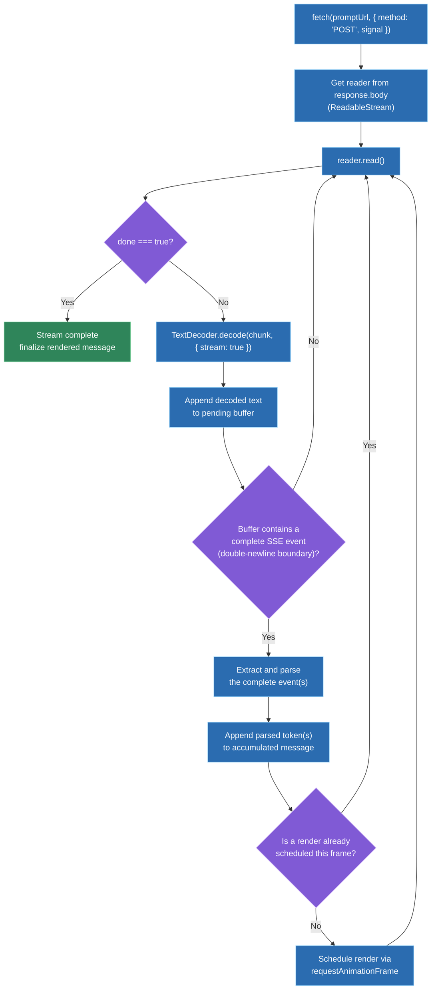
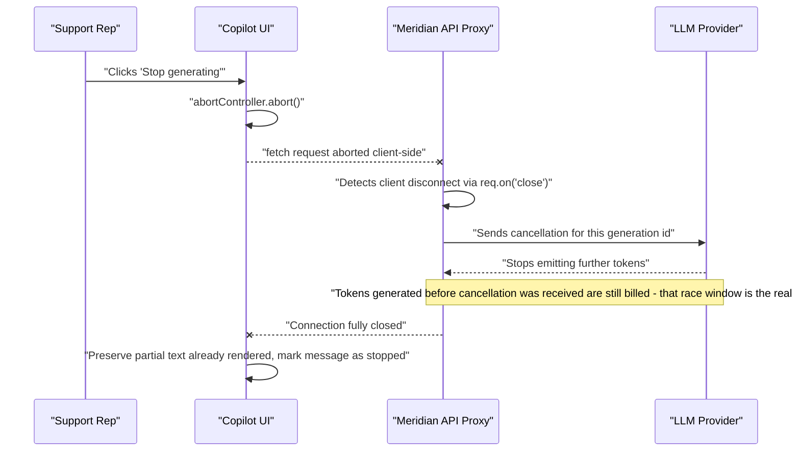

# Streaming AI/LLM responses in the UI: SSE/fetch streaming, token-by-token rendering, backpressure, cancellation

## 🎯 Executive Summary

LLM inference is autoregressive — the model produces one token at a time, each depending on the ones before it — which means the first token is often available in a few hundred milliseconds even when the full response takes eight seconds to finish generating. Streaming that first token to the UI the instant it exists, instead of buffering the entire response and rendering it in one shot, is the single biggest perceived-latency win available in AI-integrated frontend work, and it comes with a full set of genuinely hard engineering problems: transport choice, chunk-boundary parsing, render batching, backpressure, and cancellation that actually stops the bill from running.

This is a must-know topic for a Lead because it's the newest concrete interview surface in the FAANG loop, and it rewards exactly the kind of systems thinking a Lead is hired for: reasoning about network protocol trade-offs, memory behavior under a slow consumer, and — the detail almost everyone misses — that clicking "stop" in the UI doesn't automatically stop an LLM provider from generating (and billing for) tokens nobody is listening to anymore.

## 🧠 Core Technical Deep Dive

The mechanics click into place fastest as one story — a fictional team, Meridian, shipping an AI copilot for their support reps, hitting each of these problems in the order a real team actually would.

### Act 1 — Why the first version feels broken even though it works

The first version of Meridian Copilot does the obvious thing: `fetch` the prompt, `await response.json()`, render the full answer. It works, and it's the wrong experience — reps stare at a blank spinner for three to eight seconds per question, because that's how long the model actually takes to finish generating a full answer. The UI has no way to show any progress before then.

The fix isn't a network optimization, it's recognizing what's actually happening on the server: the model is autoregressive, generating token by token, each conditioned on every token before it. The server has the *first* token available almost immediately — typically a few hundred milliseconds, the "time to first token" — but the naive implementation buffers the entire response server-side and only sends it once generation finishes. Streaming means sending each token the moment the model produces it, so the UI can start rendering while generation is still running instead of waiting for it to finish.

> **Key takeaway:** streaming isn't primarily a network-efficiency technique here — it's closing the gap between when the server *has* data and when the client *shows* it, which is nearly the entire generation time in the naive version.

### Act 2 — Picking a transport, and why EventSource doesn't survive contact with a real prompt

Three transports are actually on the table, and the team writes up the comparison before building anything:

| Transport | Direction | Reconnection | Custom headers / POST body | Best fit |
|---|---|---|---|---|
| **`EventSource` (SSE)** | Server → client only | Automatic, built into the browser, with `Last-Event-ID` resumption | No — `EventSource` only supports GET, no custom headers | Simple server-push where auth is cookie-based and payload fits in a URL |
| **`fetch` + `ReadableStream`** | Server → client only | Manual — the team has to build it | Yes — full control of method, headers, and body | Anything needing `POST`, bearer-token auth, or a large request payload |
| **WebSocket** | Full duplex | Manual | Yes | True bidirectional push (live cursors, multiplayer) — not this problem |

`EventSource` looks like the obvious fit for "the server pushes tokens" until the actual requirements land: the prompt payload is too large and structured for a GET query string, and auth is a bearer token in an `Authorization` header, which `EventSource` has no way to set. That single constraint rules it out — not a performance concern, a hard API limitation.

WebSockets are ruled out for the opposite reason: the interaction is fundamentally one request producing one streamed response, never client-initiated mid-stream messages. A persistent full-duplex connection buys nothing here, and adds real infrastructure cost (sticky sessions, connection-state management) for a capability nobody uses.

Meridian settles on `fetch` with a `POST` body and a `ReadableStream` response, and accepts the trade-off going in: they get full control over headers and method, but automatic reconnection and resumption — which `EventSource` gives for free — now has to be built by hand.

> **Key takeaway:** the transport choice here is driven by auth and payload shape, not by streaming semantics — `EventSource` is genuinely simpler, but it's disqualified the moment the request needs a header `EventSource` can't set.

### Act 3 — What the read loop actually has to handle

Implementing the stream reveals three problems the happy-path tutorial code never mentions, all discovered because Meridian's QA process throws real, messy network conditions at it instead of a local loopback connection.

The first is byte-boundary corruption. Decoding each chunk with a fresh `TextDecoder` per chunk occasionally produces garbled characters — because a multi-byte UTF-8 character (an emoji, an accented character in a customer's name) can be split exactly at a chunk boundary, and decoding each half independently corrupts it. The fix is a single, reused `TextDecoder` instance called with `{ stream: true }`, which holds any incomplete trailing bytes and prepends them to the next chunk instead of decoding a broken half-character.

```typescript
const decoder = new TextDecoder();
const reader = response.body.getReader();
let buffer = '';

while (true) {
  const { done, value } = await reader.read();
  if (done) break;
  buffer += decoder.decode(value, { stream: true });
  // buffer may now contain zero, one, or several complete SSE events
  const events = extractCompleteEvents(buffer);
  buffer = events.remainder;
  for (const event of events.parsed) applyToken(event);
}
```

The second is event-boundary corruption, the same problem one layer up: a network chunk has no obligation to align with an SSE event boundary, so a single `read()` call might deliver half an event, three and a half events, or nothing parseable at all. The fix is the same shape as the byte-level one — accumulate into a string buffer, only extract and parse complete events (delimited by the double-newline SSE convention), and carry any trailing partial event forward to the next read.

The third is rendering. Naively calling `setState` (or re-rendering) on every single token works fine at a slow trickle, but a fast stream can deliver tokens faster than 60fps allows a render to complete. Repeatedly re-parsing accumulated markdown from scratch on every token compounds this — it's O(n) work per token, O(n²) over a long response. Meridian batches renders with `requestAnimationFrame`, accumulating incoming tokens and rendering at most once per frame rather than once per token.

Markdown parsing needs its own care on top of that. An unclosed code fence mid-stream, parsed naively, produces visibly broken or flashing HTML — so the renderer either buffers until a fence closes, or uses a parser designed to tolerate incomplete input.

> **Key takeaway:** the network layer, the parsing layer, and the render layer each have their own boundary-alignment problem — chunk boundaries don't align with UTF-8 character boundaries, don't align with SSE event boundaries, and full-speed token arrival doesn't align with the 60fps render budget. Each needs its own buffering strategy.

### Act 4 — Backpressure and the cancellation click that doesn't actually save any money

Backpressure sounds like it should be a client-overload problem, but a `ReadableStream` is pull-based, which changes the shape of the problem entirely: the underlying network source only delivers more data when the consumer calls `reader.read()` again. If Meridian's render loop is slow to loop back around and call `read()`, the browser itself throttles how fast it pulls further bytes off the connection — the slow consumer naturally propagates backpressure all the way back through the stream, with no unbounded buffer required on the client. This is the pull-based model doing exactly what it's designed to do; the risk case is a *hand-rolled* buffering layer sitting in front of it that queues unboundedly instead of respecting that signal.

Cancellation is where the story gets a real cost angle, and it's the detail that separates a working demo from a production feature. A rep clicks "Stop generating" mid-response; the UI calls `abortController.abort()`, the `fetch` promise rejects, and the connection closes from the client's side. That's necessary, but it's not sufficient — the LLM provider on the other end of Meridian's backend proxy has no idea the client walked away unless the *backend* explicitly detects the client disconnect and forwards a cancellation to the provider's own API. Without that second hop, generation — and billing for every token generated — continues on a response nobody will ever see.

```typescript
// Backend proxy: propagate client disconnect to the LLM provider
app.post('/api/copilot/stream', async (req, res) => {
  const providerStream = await llmProvider.createStream(req.body.prompt);

  req.on('close', () => {
    // Without this, the provider keeps generating (and billing) after
    // the client has already disconnected.
    providerStream.cancel();
  });

  for await (const token of providerStream) {
    if (res.writableEnded) break;
    res.write(formatSSE(token));
  }
  res.end();
});
```

There's a second race worth naming: a rep cancels one question and immediately asks another. If the first stream's read loop hasn't actually finished tearing down before the second one starts, both can interleave into the same message state. The fix is a generation-id guard — each new request gets an incrementing id, and a chunk is only applied to the UI if its generation id still matches the latest one the user actually asked for, discarding anything from a superseded stream.

> **Key takeaway:** `AbortController.abort()` stops the client from listening — it does not, by itself, stop the server from generating or the provider from billing. Real cancellation requires the backend to detect the disconnect and forward it, and that hop is exactly the part most implementations skip.

### Act 5 — What changes once this ships to every rep, not just a demo

At production scale, three more problems surface that a demo never hits. Network drops mid-stream happen constantly across a large rep population on inconsistent office and home networks — without a resumption strategy, a dropped connection means either a visibly truncated answer or a full retry that doubles the inference cost for that question. A resumable design keys each generation with an id the backend can look up and continue serving from, mirroring what `EventSource`'s `Last-Event-ID` gives for free — one more cost `fetch` + `ReadableStream` pays for the header/POST control it bought in Act 2.

Accessibility is the second gap, and it's easy to ship something that technically works and is completely unusable: piping streamed tokens directly into an `aria-live="polite"` region causes screen readers to announce every incoming word individually, which is noise, not speech. The fix is debouncing live-region updates — announce in sentence-sized chunks, or hold `aria-live` off during active streaming and offer an explicit "read full response" action once the message completes, giving screen reader users control instead of a firehose.

The third is observability, and it needs its own metrics vocabulary: HTTP 200 is not the same signal as "the stream actually completed successfully," since a connection can return 200 and still truncate mid-generation. Meridian tracks time-to-first-token (the actual perceived-latency number, not total request time), tokens-per-second once streaming starts, and stream-completion-rate as a metric distinct from HTTP success rate — without that distinction, a real-world failure mode (streams silently truncating for a subset of reps on a specific network) is invisible to standard request monitoring.

> **Key takeaway:** the things that don't show up in a demo — resumption after a drop, screen-reader usability, and a monitoring signal that isn't just HTTP status — are exactly the things a Lead is expected to have already thought about before this ships past a prototype.

## 📊 Visual Architecture & Logic

### Diagram 1 — The chunk read/decode/render loop



### Diagram 2 — Cancellation propagating to the LLM provider



## 🏢 Interview Context & FAANG Signals

This surfaces across **system design rounds** (design a streaming chat/copilot feature end to end), **coding rounds** (implement a `ReadableStream` reader loop with correct chunk buffering, or a cancellable streaming hook), **debugging rounds** (diagnose garbled characters, jank on fast streams, or a cost/billing anomaly traced back to uncancelled generations), and increasingly in **behavioral rounds** given how new and fast-moving this surface is ("tell me about a tricky bug you hit building an AI feature").

**Lead signals interviewers listen for:**

- Naming time-to-first-token as the actual UX metric, not "the request is faster."
- Correctly identifying that `EventSource`'s limitations (no POST, no custom headers) are what usually rule it out, not a vague "SSE isn't good enough" impression.
- Distinguishing the three separate boundary-alignment problems (byte, event, frame) rather than treating chunk parsing as a solved detail.
- Knowing, unprompted, that client-side cancellation doesn't stop server-side billing unless the backend explicitly forwards it — this is the single most reliable signal that a candidate has shipped this in production, not just read about it.
- Treating accessibility of live-streaming text as a first-class design constraint, not an afterthought.
- Proposing streaming-specific observability (TTFT, tokens/sec, stream-completion-rate) instead of assuming standard HTTP monitoring covers it.

## ⚔️ Lead Level vs Senior Level

A **Senior** response typically gets the core mechanism right and stops there: "I'd use `fetch` with a `ReadableStream`, read chunks in a loop, parse the SSE format, and append tokens to the message as they arrive."

A **Staff/Lead** response keeps going into the parts that only surface at production scale: what's the actual buffering strategy across chunk, UTF-8, and frame boundaries, and how is that tested against real flaky-network conditions rather than a local loopback? What happens to LLM billing when a user cancels — does the abort actually reach the provider, or does generation silently continue? What's the resumption story when a connection drops mid-stream for a rep on a bad network — retry from scratch at double cost, or resume from a generation id? Is the live-streaming text usable for a screen reader user, or does it fire an unlistenable stream of individual-word announcements? And is streaming even justified for this particular response — a short, deterministic classification result gains nothing from token-by-token rendering and just adds transport complexity for no UX benefit.

## ⚠️ Common Pitfalls & Anti-Patterns

> ### ✕ Buffering the full response server-side before sending anything
> **Why it's wrong:** This throws away the entire point of streaming — the model may have the first token ready in a few hundred milliseconds, but the client sees nothing until the whole generation finishes, which is exactly the naive-version experience streaming was supposed to fix.
> **✓ Correct Lead Approach:** Forward each token to the client the moment the model produces it, keeping the server a thin relay rather than an accumulator.

> ### ✕ Re-rendering (or re-parsing markdown) on every single token
> **Why it's wrong:** A fast stream can deliver tokens faster than the UI can paint at 60fps, and re-parsing the entire accumulated markdown from scratch on every token is O(n) per token — O(n²) over a long response — producing visible jank on exactly the responses where smoothness matters most.
> **✓ Correct Lead Approach:** Batch incoming tokens and render at most once per animation frame via `requestAnimationFrame`, and use a markdown rendering strategy that tolerates or buffers incomplete syntax instead of re-parsing everything from scratch each time.

> ### ✕ Treating `AbortController.abort()` as complete cancellation
> **Why it's wrong:** Aborting the client-side `fetch` stops the browser from listening, but the LLM provider has no way to know the client walked away unless the backend explicitly detects the disconnect and forwards a cancellation — otherwise generation, and billing for it, continues on a response nobody will ever see.
> **✓ Correct Lead Approach:** Wire the backend to detect client disconnect (`req.on('close')` or equivalent) and explicitly cancel the upstream provider call, treating cancellation as a two-hop operation, not a client-only one.

> ### ✕ Assuming a network chunk equals one complete SSE event or one complete character
> **Why it's wrong:** Chunk boundaries are a network-layer artifact with no relationship to SSE event boundaries or UTF-8 character boundaries — parsing each chunk in isolation intermittently corrupts multi-byte characters and drops or mis-parses events that happen to straddle a chunk split.
> **✓ Correct Lead Approach:** Decode with a single reused `TextDecoder` using `{ stream: true }`, and buffer text across reads, only extracting and parsing complete events while carrying any trailing partial event forward to the next chunk.

> ### ✕ Piping streamed tokens directly into an `aria-live` region
> **Why it's wrong:** A screen reader announces every update to a live region — streaming word by word produces a rapid-fire, unlistenable sequence of individual announcements instead of coherent speech.
> **✓ Correct Lead Approach:** Debounce live-region updates to sentence-sized chunks, or suppress live announcements during active streaming and provide an explicit "read response" action once the message completes.

## 🛠️ Practice Scenarios

### Scenario 1 — Designing the Streaming Architecture for a Support Copilot

Design the end-to-end streaming architecture for an AI copilot answering customer-support reps' questions, including transport choice and rendering strategy.

<details>
<summary>Staff-Level Solution</summary>

Rule out `EventSource` immediately on requirements grounds: prompts are large, structured payloads that need `POST`, and auth is a bearer token requiring a custom header — both outside `EventSource`'s capability. Use `fetch` with a `POST` body and consume `response.body` as a `ReadableStream`, accepting that reconnection/resumption now has to be built rather than inherited for free.

On the render side, accumulate incoming tokens into a buffer and flush to the UI at most once per animation frame via `requestAnimationFrame`, rather than on every token — this keeps the UI responsive on fast completions without adding artificial latency on slow ones. Parse markdown incrementally and tolerantly (buffer until a code fence closes, avoid re-parsing the entire accumulated text from scratch on every token) to avoid both visual flashing and O(n²) behavior on long responses. Design cancellation as two hops from the start — client abort plus backend-to-provider cancellation propagation — since retrofitting that after the fact usually means a billing/cost incident is what forces the fix.

</details>

### Scenario 2 — Debugging Garbled Characters Mid-Stream

Reps occasionally see garbled or mojibake characters appear mid-response, especially in customer names containing accented characters, but only on some responses, never consistently.

<details>
<summary>Staff-Level Solution</summary>

This is near-certainly a UTF-8 byte-boundary issue: a multi-byte character is being split exactly across two separate network chunks, and each chunk is being decoded independently, corrupting the character that spans the boundary. Confirm by checking whether a fresh `TextDecoder` instance is being created per chunk (wrong) versus one long-lived instance reused across the whole stream.

Fix by instantiating a single `TextDecoder` for the duration of the stream and calling `.decode(chunk, { stream: true })` on every chunk — the `stream: true` option is exactly what tells the decoder to hold back an incomplete trailing byte sequence and prepend it to the next chunk instead of decoding a broken half-character. This bug is inherently intermittent because it only manifests when a multi-byte character happens to land on a chunk boundary, which explains why it doesn't reproduce consistently in casual testing.

</details>

### Scenario 3 — Diagnosing Jank on Fast-Streaming Responses

Short, fast-generating responses cause visible UI jank and occasionally dropped frames, while longer, slower responses render smoothly.

<details>
<summary>Staff-Level Solution</summary>

Counterintuitively, fast streams are the harder case: a short response might deliver dozens of tokens within a handful of frames, and if the UI calls `setState`/re-renders on every single token, the render pipeline can't keep up with 60fps, causing exactly this jank. Confirm by checking whether render calls are gated to animation frames or fire unconditionally per token.

Fix by decoupling token arrival from render scheduling: accumulate tokens into a buffer as they arrive, and flush to the UI at most once per `requestAnimationFrame` callback, regardless of how many tokens arrived in that frame's window. Also check whether markdown is being fully re-parsed from the accumulated text on every token — that's O(n) work per token, so a fast 200-token response does meaningfully more total work than an equivalent slow one, which independently explains part of the jank on short, fast completions.

</details>

### Scenario 4 — Cancellation That Actually Reduces Cost

A "Stop generating" button correctly stops the UI from updating, but the team's LLM provider bill shows continued token generation for several seconds after users click stop, across many sessions.

<details>
<summary>Staff-Level Solution</summary>

This is the classic incomplete-cancellation gap: `AbortController.abort()` on the client stops the browser from listening, but says nothing to the backend or the LLM provider, so generation — and billing — continues on the server side for a response nobody will ever see. Confirm by checking whether the backend has any handler for client disconnect at all.

Fix by wiring the backend's request-close event (`req.on('close')` in Node, or the equivalent for the framework in use) to explicitly call the provider SDK's cancellation method for that in-flight generation. Accept that there's an inherent race window — tokens generated between the user's click and the cancellation reaching the provider are still billed — and treat minimizing that window (fast disconnect detection, not batching or debouncing the close handler) as the actual optimization target, rather than expecting it to reach zero.

</details>

### Scenario 5 — Designing Accessible Streaming Text

Design how streamed AI responses should be exposed to screen reader users, given that naively wiring the streaming text into an `aria-live` region makes it unusable.

<details>
<summary>Staff-Level Solution</summary>

Piping every token into `aria-live="polite"` causes the screen reader to announce each word individually as it arrives — technically compliant, practically unlistenable. Debounce live-region updates to something coherent, like flushing on sentence boundaries (period, question mark, newline) rather than on every token, so announcements read as speech rather than a word-by-word stutter.

An even more deliberate option: keep the live region silent during active streaming, and once the message completes, either announce it as a single chunk or surface an explicit "read response" affordance that puts the screen reader user in control of when the announcement happens — matching the sighted user's experience of watching the message settle before engaging with it, rather than forcing an interruption mid-generation.

</details>

### Scenario 6 — Handling a Mid-Stream Network Drop

A rep's connection drops partway through a streamed response. Design what the UI does, and what a full resumption strategy would require.

<details>
<summary>Staff-Level Solution</summary>

At minimum, the UI must not silently discard the partial content already rendered — treat the stream's failure as a distinct state from both "still streaming" and "complete," showing the partial answer with an inline "connection lost" affordance and a retry action, rather than replacing visible content with a generic error screen.

A full resumption strategy requires the backend to key each generation with a stable id and retain enough state (or replay capability against the provider) to continue serving from where the client left off, mirroring what `EventSource`'s `Last-Event-ID` mechanism provides automatically — this is exactly the capability traded away in Act 2 for `fetch`'s header/POST control, and building it is the fair cost of that choice. Absent that investment, the fallback is an explicit retry that regenerates the full response, which the UI should clearly communicate doubles the wait (and the inference cost) rather than silently retrying and confusing the user about why it's slower the second time.

</details>

### Scenario 7 — Observability for a Streaming AI Feature

Design the monitoring strategy for a production streaming AI feature, given that standard HTTP success-rate monitoring doesn't catch the failure modes specific to streaming.

<details>
<summary>Staff-Level Solution</summary>

Track time-to-first-token as the primary perceived-latency metric — it's the number that actually correlates with how "fast" the feature feels, and it's invisible to total-request-duration monitoring, which only reports once the stream fully completes. Track tokens-per-second once streaming begins, separately, since a slow TTFT and a slow overall generation rate are different problems with different root causes (queueing/cold-start latency versus raw inference throughput).

Critically, track stream-completion-rate as a metric independent from HTTP status — a connection can return 200 and still truncate mid-generation (a dropped connection, a provider-side timeout, a client navigating away), and none of that shows up as an HTTP error. Without this distinct signal, a real failure mode — streams silently truncating for a subset of users on a specific network condition or provider region — is completely invisible to standard request monitoring until someone notices the pattern manually.

</details>

### Scenario 8 — When Not to Stream

An interviewer asks: "When would you deliberately not stream an AI-generated response, even though the backend supports it?"

<details>
<summary>Staff-Level Solution</summary>

A short, low-latency, deterministic-feeling response — a one-word classification, a yes/no moderation decision, a single extracted field — gains nothing from token-by-token rendering, because there's no meaningful generation time for streaming to mask, and the added transport complexity (chunk buffering, boundary handling, cancellation propagation) is pure cost with no corresponding UX benefit. Rendering the whole result at once, the moment it's ready, is simpler to build, simpler to test, and indistinguishable in perceived speed from a streamed version when the total response time is already near-instant.

The judgment call mirrors Act 1's original motivation in reverse: stream when generation time is long enough that time-to-first-token meaningfully improves perceived latency over waiting for the full response. When it isn't — because the response is short, or because a deterministic backend call (not an LLM) can produce the full answer in one round trip anyway — reaching for streaming by default adds engineering surface area without a matching improvement in the experience it's meant to protect.

</details>
