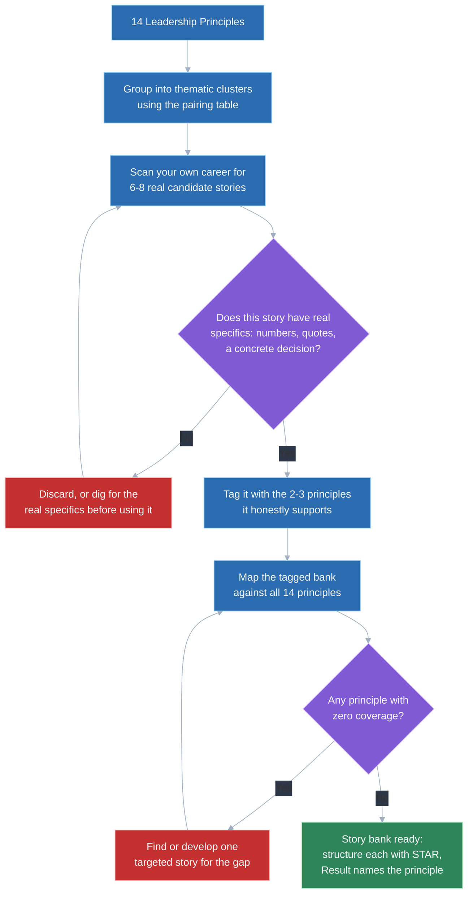
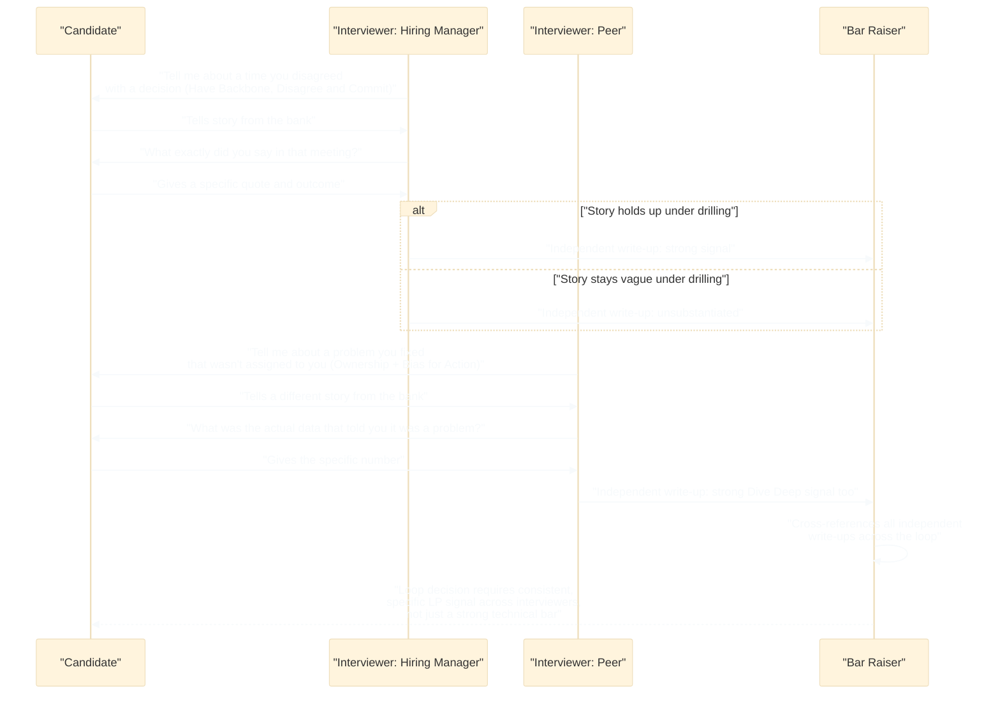

# Amazon Leadership Principles (all 14) with mapped stories

## 🎯 Executive Summary

At most FAANG companies, the behavioral round is one data point among several, and a strong technical performance can carry a weak one. At Amazon, that's not how the loop works — the 14 Leadership Principles (LPs) are graded as rigorously as the technical bar, each interviewer is assigned specific principles to probe independently, and their write-ups are cross-referenced by a Bar Raiser before a hire decision is made. A candidate can fail the entire loop on LP signal alone, even with a technically excellent performance.

That structural fact changes how much prep this deserves. Treating LPs as a warm-up question to improvise on the day is the single most common way strong engineers fail Amazon loops. This topic builds a repeatable system — a clustering framework, a compact story bank, and a stress-test for what actually survives follow-up questioning — so you walk in with pre-mapped, specific stories instead of fourteen answers you're inventing live.

## 🧠 Core Technical Deep Dive

### 1. Why Amazon's loop is structurally different

A typical FAANG behavioral round has one interviewer, one general "tell me about a challenge" slot, and a loose rubric. Amazon's loop assigns specific Leadership Principles to specific interviewers in advance, and each interviewer independently writes up whether the candidate demonstrated that principle with real evidence.

Those independent write-ups get reconciled by a Bar Raiser — an interviewer trained specifically to guard the LP bar across the whole loop, with veto power over a hire regardless of what the hiring manager wants. This means LP signal isn't averaged away by a strong technical showing elsewhere; a candidate who impresses on system design but gives thin, generic answers to two LP questions can still be a "no."

| What a typical FAANG behavioral round looks like | What Amazon's loop actually does |
|---|---|
| One interviewer, informal rubric, loosely scored | Every interviewer is assigned 2-3 specific principles to probe |
| Behavioral signal is one input among several | Behavioral (LP) signal is graded as rigorously as technical ability |
| A strong technical round can offset a weak behavioral one | A Bar Raiser can block a hire on LP signal alone, independent of technical scores |
| Interviewers compare notes loosely, if at all | Write-ups are independently submitted, then formally reconciled |

> **Key takeaway:** because LP signal is scored independently by multiple interviewers and can veto a hire on its own, this deserves the same structured, whiteboard-able prep as a system design round — not a "I'll just tell a good story" attitude.

### 2. All 14 principles, and the clustering framework that makes them manageable

Trying to write a unique story for each of the 14 principles is both impractical and produces stories that sound rehearsed. The fix is recognizing that most principles aren't independent — a single well-chosen story can honestly demonstrate 2-3 principles at once, because the underlying behaviors overlap. A story about spotting a scaling problem nobody assigned you to fix can simultaneously hit Ownership (you treated it as your problem), Bias for Action (you moved before waiting for permission), and Dive Deep (you went and found the root cause yourself).

The table below is the centerpiece of prep: it gives each principle a one-line practical definition, the real question an interviewer is using it to answer, and which other principles it's most commonly probed alongside.

| Principle | Core question it's really asking | Commonly paired with |
|---|---|---|
| **Customer Obsession** | Did the decision start from the customer's actual pain, not internal convenience? | Ownership, Invent and Simplify |
| **Ownership** | Did you treat a problem as yours even though nobody assigned it to you? | Bias for Action, Dive Deep |
| **Invent and Simplify** | Did you remove complexity rather than layer on a clever new one? | Customer Obsession, Think Big |
| **Are Right, A Lot** | Did your judgment call under uncertainty hold up, and did you actively seek disagreement before deciding? | Dive Deep, Have Backbone; Disagree and Commit |
| **Learn and Be Curious** | Did you go learn something outside your lane because the problem demanded it? | Are Right, A Lot; Dive Deep |
| **Hire and Develop the Best** | Did you raise the bar on a hire, a promotion, or a teammate's growth trajectory? | Insist on the Highest Standards |
| **Insist on the Highest Standards** | Did you refuse to accept "good enough" and fix a root cause instead of a symptom? | Hire and Develop the Best, Deliver Results |
| **Think Big** | Did you propose a solution bigger in scope than the ticket you were handed? | Invent and Simplify, Frugality |
| **Bias for Action** | Did you move on a reversible decision with incomplete information instead of waiting for certainty? | Ownership, Deliver Results |
| **Frugality** | Did you solve a real constraint with less, rather than asking for more? | Think Big, Bias for Action |
| **Earn Trust** | Did you say something uncomfortable and true, or own a mistake publicly? | Have Backbone; Disagree and Commit; Deliver Results |
| **Dive Deep** | Did you personally go find the root cause in the data instead of trusting a summary? | Ownership, Are Right, A Lot |
| **Have Backbone; Disagree and Commit** | Did you argue a position you believed in, then genuinely commit once overruled? | Are Right, A Lot; Earn Trust |
| **Deliver Results** | Did you hit the outcome despite a real obstacle, not just complete a task? | Bias for Action, Insist on the Highest Standards |

> **Key takeaway:** don't prep 14 principles as 14 independent questions — prep the clusters, since most interviewers are really asking a variant of 5-6 underlying questions, and a well-chosen story answers several at once.

### 3. Building a story bank: 6-8 stories, not 14

The efficient move is a story bank of roughly 6-8 real stories from your career, each pre-analyzed for the 2-3 principles it can *honestly* support — not a scramble to invent a fresh story per principle. Fourteen separate stories is both impractical to prepare and, under a good interviewer's follow-ups, starts to sound like a rehearsed script rather than real experience.

Build the bank by working backwards from your own career for moments that map onto the clusters from section 2: a time you fixed something outside your assigned scope, a time you disagreed with a decision and were overruled, a time you shipped under a hard constraint, a time you made a call on incomplete data that turned out right (or wrong, and what you learned). Each real moment usually supports a cluster, not a single principle.

| Story archetype to look for | Principles it typically supports |
|---|---|
| Found and fixed a problem nobody assigned to you | Ownership, Bias for Action, Dive Deep |
| Simplified or killed a feature/process customers didn't need | Customer Obsession, Invent and Simplify |
| Disagreed with a decision, was overruled, executed it fully anyway | Have Backbone; Disagree and Commit; Earn Trust |
| Made a high-stakes call with incomplete information | Are Right, A Lot; Bias for Action |
| Delivered under a hard resource or time constraint | Deliver Results, Frugality |
| Raised the hiring or performance bar on your team | Hire and Develop the Best, Insist on the Highest Standards |
| Proposed something bigger than what was asked | Think Big, Invent and Simplify |
| Learned an unfamiliar domain to unblock a decision | Learn and Be Curious, Dive Deep |

Once the bank is drafted, map it against all 14 principles and check for gaps — a bank that's strong on Ownership and Deliver Results but has nothing for Hire and Develop the Best or Frugality needs one more targeted story, not a forced retrofit of an existing one.

> **Key takeaway:** 6-8 well-analyzed real stories, each tagged with the 2-3 principles it honestly supports, cover the full set more reliably — and more authentically — than trying to manufacture 14 unique anecdotes.

### 4. The pair that trips up engineering leads: Have Backbone; Disagree and Commit

This is the principle candidates most often answer with a story that isn't actually about it. It has two halves, and both need to be present: arguing a position with real conviction when you disagree with a decision, *and* then genuinely committing to it — not quietly resisting, not saying yes and doing your own thing — once it's made.

The most common failure is a story that's just conflict: "I disagreed with my manager and we argued about it" describes a disagreement, not a demonstration of the principle, because it stops before the "commit" half. The second most common failure is the opposite — a story where the candidate folded immediately, which reads as an absence of backbone rather than its presence.

| What the story is actually about | What it's mistaken for |
|---|---|
| Arguing a position with data and conviction, being overruled, then executing the decided path fully and visibly | Just describing a disagreement or a conflict with no resolution |
| Committing genuinely — not sabotaging, not "I told you so"-ing later if it goes wrong | Being contrarian for its own sake, disagreeing without a substantive alternative |
| Escalating a concern through the right channel, once, with real conviction | Being a pushover who agreed just to avoid friction |
| A real decision changing (or not) as a result of the disagreement being heard | A story where nothing about the outcome depended on speaking up |

The strongest version of this story includes a moment where the decision genuinely could have gone either way, and the candidate can describe specifically what they said, what data they brought, and what changed (or didn't) in the room.

> **Key takeaway:** "Have Backbone; Disagree and Commit" is two actions, not one — a story that ends at the disagreement without a genuine commit isn't answering the question, no matter how compelling the conflict itself is.

### 5. How LP stories get stress-tested in the actual loop

Amazon interviewers are trained to drill into any story told, and this is where thin or exaggerated stories collapse. Expect specific, pointed follow-ups: "What exactly did you say in that meeting?", "What was the actual number?", "Who else was in the room, and what was their reaction?", "What would you do differently?"

These aren't gotcha questions — they're the actual signal-extraction mechanism. A story with real specificity (an actual metric, an actual quote, an actual name-redacted decision-maker) survives this easily because the details were simply lived, not constructed. A story that's vague, rounded-up, or borrowed from someone else's experience starts to contradict itself or dissolve into generalities under the second or third follow-up.

| Follow-up question | What it's really testing |
|---|---|
| "What exactly did you say?" | Whether the story is remembered detail-first or reconstructed generically after the fact |
| "What was the actual data/number?" | Whether the impact is real and specific, or an inflated round number |
| "What did the other person say back?" | Whether you can recall the interaction honestly, including the parts that didn't go your way |
| "What would you do differently?" | Genuine reflection vs. a scripted answer with no real self-assessment |
| "Who else was involved?" | Whether the story holds up as *your* contribution specifically, not a team's diffused effort retold in the first person |

> **Key takeaway:** honest, specific stories with real numbers and real friction beat impressive-sounding vague ones, precisely because specificity is the one thing that can't be faked under two or three rounds of drilling.

### 6. Mapping STAR to LP stories specifically

An LP story still needs full STAR structure (Situation, Task, Action, Result) — that mechanic doesn't change. What's different is the Result step: it needs to explicitly close the loop back to the principle being demonstrated, not just state an outcome and leave the interviewer to infer the connection.

| STAR component | Standard behavioral answer | LP-tagged answer |
|---|---|---|
| Situation | Sets context briefly | Same, but chosen because it's a genuine instance of the cluster (e.g. an unassigned problem, for Ownership) |
| Task | What needed to happen | Same |
| Action | What you specifically did | Emphasize the specific decision/behavior that *is* the principle — the moment you escalated, the moment you dove into the data yourself |
| Result | The outcome | Outcome **plus** an explicit line connecting it back to the principle — "that's the kind of ownership I mean when I say I'll fix something even if it's not formally mine" |

That last connective sentence is easy to skip and costs little to add, but it's what turns a good story into unambiguous LP signal instead of leaving the interviewer to guess which principle it was meant to demonstrate.

> **Key takeaway:** don't just tell a well-structured STAR story and hope the principle is obvious — land the Result by naming, in substance, why it demonstrates the specific principle being asked about.

## 📊 Visual Architecture & Logic

### Diagram 1 — Building the story bank from the 14 principles

### Diagram 2 — A realistic Amazon LP loop, interviewer by interviewer

## 🏢 Interview Context & FAANG Signals

The entire Amazon loop — phone screen, onsite, and the Bar Raiser round specifically — is built around the 14 principles, and LP-flavored questions ("tell me about a time you disagreed with your manager," "tell me about a customer-driven decision") are increasingly showing up at other FAANG companies too, even without the formal LP branding.

**Lead signals interviewers listen for:**

- Pre-mapped, principle-tagged stories delivered with specificity, not a story being invented live on the spot.
- A different story pulled for each cluster asked about, rather than reusing the same anecdote for every question that vaguely fits.
- Survives specific follow-up drilling — real numbers, real quotes, real names of what happened — without the story shifting or vagueness creeping in.
- A genuine "commit" in any disagreement story, not just an account of the disagreement itself.
- The Result explicitly tied back to the principle, not left for the interviewer to infer.
- Honest scope — owning what was personally done versus what a team did, especially at Lead level where diffusing credit onto "we" too broadly reads as an inability to point to individual leadership contribution.

## ⚔️ Lead Level vs Senior Level

A **Senior** response to an LP question usually tells a reasonable story, on topic, with a clear beginning and end — solid, but often generic enough that it could apply to several different principles interchangeably.

A **Staff/Lead** response is precise about *which* principle the story demonstrates and why, names the specific moment that *is* the principle (the exact sentence said in the disagreement, the exact data point that triggered diving in), and can immediately pivot to a different story if the interviewer probes a related-but-distinct principle in the same cluster — because the story bank was built and tagged in advance, not because they're improvising well under pressure. A Lead candidate also treats scope honestly: distinguishing what they personally drove from what a team accomplished collectively, since Leadership Principles are ultimately being scored as evidence of individual leadership behavior, not team output.

## ⚠️ Common Pitfalls & Anti-Patterns

> ### ✕ Preparing 14 separate stories, one per principle
> **Why it's wrong:** It's both impractical to hold in memory under interview pressure and produces answers that sound like a rehearsed script rather than lived experience — a good interviewer can tell when a story was manufactured to fit a label.
> **✓ Correct Lead Approach:** Build a 6-8 story bank using the clustering framework, where each story is honestly tagged with the 2-3 principles it actually supports.

> ### ✕ Telling a "Have Backbone; Disagree and Commit" story that's just conflict
> **Why it's wrong:** A story that ends at the disagreement, with no genuine commit afterward, only demonstrates half the principle — and a story where the candidate folded immediately demonstrates the opposite of backbone.
> **✓ Correct Lead Approach:** Choose a story where you argued a real position with conviction, were overruled or persuaded, and then genuinely executed the decided path — and say so explicitly.

> ### ✕ Answering with impressive-sounding but vague claims
> **Why it's wrong:** Amazon interviewers are trained to drill into specifics — "what exactly did you say," "what was the actual number" — and a story without real detail collapses or contradicts itself under two or three follow-ups.
> **✓ Correct Lead Approach:** Favor honest, specific stories with real numbers and real friction over polished-sounding ones with no verifiable detail.

> ### ✕ Treating LPs as a soft-skills warm-up instead of a scored bar
> **Why it's wrong:** Amazon's loop grades LP signal independently and as rigorously as the technical bar, with a Bar Raiser who can block a hire on LP signal alone — under-prepping this is not lower risk than under-prepping a system design round.
> **✓ Correct Lead Approach:** Prep LP stories with the same rigor and structure as any other interview loop component — a pre-built, principle-tagged story bank, not improvisation.

> ### ✕ Reusing the same story across multiple LP questions in one loop
> **Why it's wrong:** Interviewers' write-ups get reconciled by the Bar Raiser, and a candidate who answers every question with a variant of the same one anecdote reads as having a narrow range of leadership experience, even if the story is genuinely strong.
> **✓ Correct Lead Approach:** Draw from the full 6-8 story bank deliberately, picking a different story for each new cluster of principles probed, even when more than one story could technically fit.

## 🛠️ Practice Scenarios

### Scenario 1 — Customer Obsession + Invent and Simplify

An interviewer asks: "Tell me about a time you changed direction on a feature because of what you learned from customers."

Staff-Level Solution

**Situation/Task:** A team was midway through building an elaborate configuration UI for a feature, based on an internal assumption about what power users would want. **Action:** Before shipping, pull real usage/support data or run a handful of direct customer conversations, discover the actual friction is far simpler than the planned feature, and make the call to cut the complex UI in favor of a simplified default that solves the real problem. **Result:** Ship faster with less code, and the simpler version measurably reduces support tickets or increases adoption — closing the loop by naming it: "we started from what the customer actually needed instead of what we assumed, and simplified rather than adding".

This demonstrates **Customer Obsession** (the decision changed because of direct customer signal, not internal opinion) and **Invent and Simplify** (the resolution was removing complexity, not adding a cleverer version of it).

### Scenario 2 — Ownership + Bias for Action + Dive Deep

An interviewer asks: "Tell me about a time you found and fixed a problem that wasn't officially your responsibility."

Staff-Level Solution

**Situation/Task:** While working on an unrelated feature, notice a metric quietly degrading in a system owned by another team, with no open ticket or owner actively investigating. **Action:** Instead of flagging it and moving on, personally dig into the logs/data to find the root cause (Dive Deep), then move quickly to either fix it directly or drive the fix with the actual owning team, without waiting for a formal assignment (Bias for Action, Ownership). **Result:** State the concrete before/after metric, and close the loop: "nobody asked me to own this, but leaving it degrading wasn't an option — that's what ownership means to me beyond my formal scope."

This demonstrates the classic three-principle cluster: **Ownership**, **Bias for Action**, and **Dive Deep**, all from a single well-chosen incident.

### Scenario 3 — Think Big + Frugality

An interviewer asks: "Tell me about a time you proposed something bigger than what was originally asked, under real resource constraints."

Staff-Level Solution

**Situation/Task:** Asked to deliver a narrow, incremental fix, but recognize the underlying problem is bigger and a more ambitious solution would prevent it recurring across multiple teams. **Action:** Propose the bigger direction, but explicitly scope it to be achievable with existing headcount and no new budget — reusing existing infrastructure and cutting the ambitious idea down to something frugal rather than requesting more resources to match the bigger vision. **Result:** State the outcome as bigger in impact than the original ask, delivered within the original constraint, and land it: "I could have delivered the narrow fix asked for, but the bigger, resourceful version prevented the same problem for three other teams at no extra cost."

This demonstrates **Think Big** (proposing beyond the literal ask) paired with **Frugality** (achieving it without asking for more resources) — a cluster that's specifically compelling because most "think big" stories skip the constraint half.

### Scenario 4 — Are Right, A Lot + Learn and Be Curious

An interviewer asks: "Tell me about a high-stakes decision you made with incomplete information."

Staff-Level Solution

**Situation/Task:** Facing a decision (an architecture choice, a vendor pick, a launch/no-launch call) with a hard deadline and no clean data pointing to a single right answer. **Action:** Actively seek out people who'd disagree before deciding — not just people who'd confirm the instinct — and go learn an unfamiliar area (a new technology, a different team's constraints) specifically because the decision required it, rather than deciding from a comfortable but shallow understanding. **Result:** State what the decision was and how it held up over the following months, and be honest if part of it needed correcting later: "I sought out disagreement before I decided, and learned enough of an unfamiliar area to make the call responsibly rather than by instinct alone."

This demonstrates **Are Right, A Lot** (judgment under uncertainty, seeking disconfirming views) and **Learn and Be Curious** (going outside your existing knowledge because the decision demanded it).

### Scenario 5 — Have Backbone; Disagree and Commit + Earn Trust

An interviewer asks: "Tell me about a time you disagreed with a decision made above you."

Staff-Level Solution

**Situation/Task:** A senior stakeholder was pushing a direction (a timeline, an architecture, a scope cut) that real data suggested was risky. **Action:** Raise the concern directly and specifically — the actual data point, the actual risk — once, through the right channel, rather than complaining about it informally afterward. When overruled, genuinely commit: execute the decided direction fully and visibly, without quietly under-investing in it or saying "I told you so" if it later struggles. **Result:** Whatever the outcome, close the loop explicitly: "I made my case with real conviction, it was heard and weighed, and once decided I committed to it as if it had been my own call from the start."

This is the exact pair from section 4 — **Have Backbone; Disagree and Commit** for the argument-then-commit arc, and **Earn Trust** for having said the uncomfortable, candid thing directly instead of avoiding it.

### Scenario 6 — Hire and Develop the Best + Insist on the Highest Standards

An interviewer asks: "Tell me about a time you raised the bar on your team."

Staff-Level Solution

**Situation/Task:** A team's hiring bar, or its acceptance criteria for shipped work, had quietly drifted lower than it should be — a hiring loop passing borderline candidates, or a review process accepting "good enough" work. **Action:** Push back on a specific hire or a specific piece of work rather than letting it pass, articulate exactly why it didn't meet the bar, and pair that with something constructive — mentoring a promising engineer, rewriting the interview rubric, defining what "highest standards" concretely means for that team going forward. **Result:** Name a concrete before/after — a raised bar that stuck, a mentee who leveled up, a defect rate that dropped — and land it: "raising the bar wasn't a one-time veto, it was defining what the standard actually is so it holds without me personally re-litigating it every time."

This demonstrates **Hire and Develop the Best** (raising the bar on people specifically) alongside **Insist on the Highest Standards** (refusing "good enough" and fixing the actual root cause of the drift).

### Scenario 7 — Deliver Results under a highly constrained situation

An interviewer asks: "Tell me about a time you delivered results despite a serious obstacle."

Staff-Level Solution

**Situation/Task:** A commitment was at real risk — a key team member left mid-project, a dependency slipped, budget was cut mid-quarter — and the obvious response would have been to renegotiate the deadline or the scope down to nothing meaningful. **Action:** Identify the smallest set of key inputs that actually mattered for the outcome, cut everything else ruthlessly, and personally step in on the highest-leverage piece of work rather than delegating around the gap. **Result:** State the actual outcome delivered against the original commitment, with real numbers, and be honest about what was cut to get there: "we delivered the outcome that actually mattered by being ruthless about what wasn't essential, not by treating the original deadline as untouchable at all costs."

This demonstrates **Deliver Results** specifically under real constraint — the strongest version of this principle is never a story where nothing went wrong along the way.

### Scenario 8 — Same principle, second interviewer: proving the story bank has range

Two different interviewers, later in the same loop, both ask variants of "tell me about a time you took ownership of something." The story already told earlier in the day was the scaling-problem story from Scenario 2.

Staff-Level Solution

Recognize this as the same underlying cluster asked twice, and deliberately pull a *different* story from the bank rather than repeating the earlier one, even though it would technically still answer the question. Reusing the same anecdote across interviewers whose write-ups get reconciled by the Bar Raiser reads as a narrow range of leadership experience, even if the one story was strong.

Reach for a second, distinctly different Ownership-adjacent story from the bank — for example the Scenario 7 delivery-under-constraint story, reframed with the Result explicitly naming Ownership this time ("I could have renegotiated scope down, but I owned the original commitment and found a way to protect it"). This is exactly why the story bank needs 6-8 stories tagged across overlapping clusters rather than one story per principle: it gives enough range to answer the same underlying question twice, credibly, with two different pieces of real evidence.

