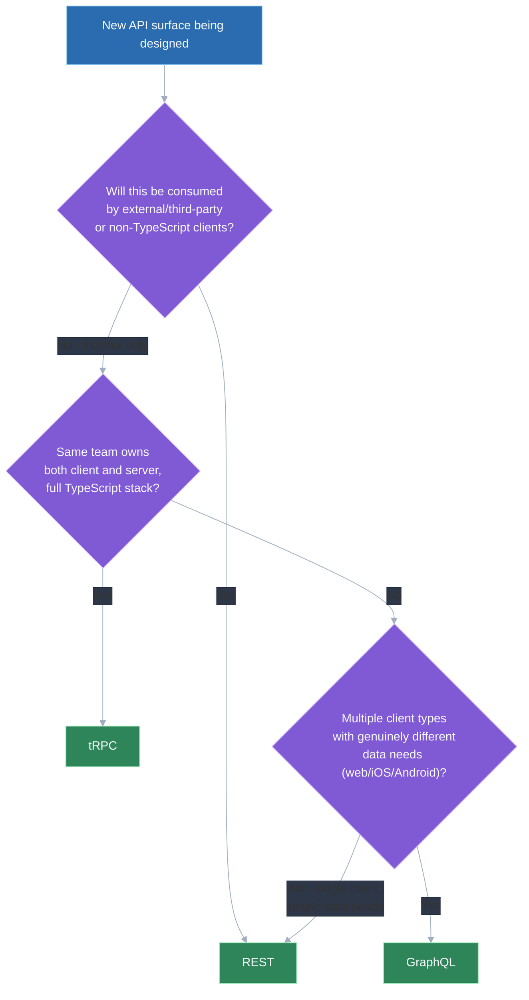
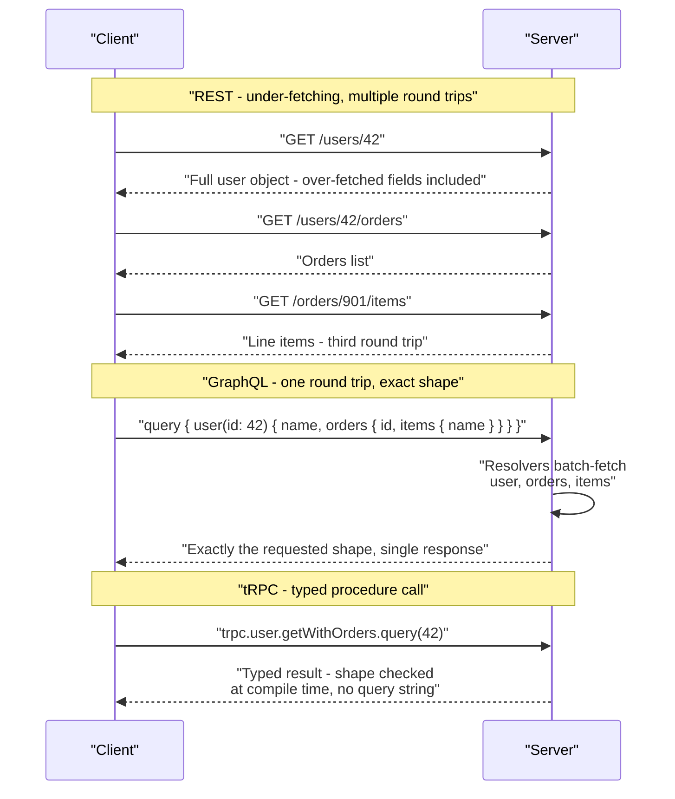

# API design: REST vs GraphQL vs tRPC — trade-offs

## 🎯 Executive Summary

There is no universally "best" API style — REST, GraphQL, and tRPC each optimize for a different combination of client-agnosticism, data-fetching flexibility, and developer velocity, and a mature product often runs more than one of them side by side rather than standardizing on a single choice. The question a Lead is actually being tested on isn't "which API style is objectively superior," it's "given this specific client landscape and team structure, which style's trade-offs are the ones we can actually live with."

This is a must-know topic because the API layer sits directly upstream of client performance (over-fetching, waterfalls), team velocity (type safety, codegen), and product surface area (who can consume this API, and how). Getting it wrong shows up as chronic over-fetching on mobile, a brittle public integration story, or a full-stack team paying REST's coordination tax for no real benefit. The deeper signal interviewers look for is naming the specific trade-off that matters for the actual client scenario, not asserting one technology is unconditionally better than the others.

## 🧠 Core Technical Deep Dive

Three distinct styles dominate production API design today, differing in *who defines the shape of a response* and *how tightly client and server are coupled*.

### REST

**How it works:** resources are modeled as URLs, and standard HTTP verbs (GET, POST, PUT, PATCH, DELETE) express the operation being performed on that resource — `GET /users/42`, `POST /users/42/orders`. The response shape for each endpoint is fixed by the server and documented (often via OpenAPI/Swagger) rather than chosen per-request by the client.

**Used for:** public and third-party-facing APIs, and anything that needs broad, client-agnostic compatibility — any HTTP client in any language can consume a REST API with no special tooling. It also gets standard HTTP caching essentially for free, since GET semantics, `ETag`, and `Cache-Control` headers are understood by browsers, CDNs, and proxies without any extra work.

**Drawbacks:**
- Over-fetching: a client that only needs a user's name still gets the full user object, because the response shape is fixed per endpoint, not per request.
- Under-fetching: assembling one screen's worth of data often requires multiple round trips (a user, then their orders, then each order's line items) — the classic N+1-from-the-client problem, since REST has no native way to express "give me this resource plus these related ones" in a single call.
- Versioning is awkward: a breaking change to a resource's shape typically means a new URL (`/v2/users`) or a version header, and both approaches require running old and new versions in parallel during migration.
- No built-in type safety between client and server — the contract lives in documentation or a separately maintained OpenAPI spec, and nothing stops the two from drifting apart silently.

> **Key takeaway:** REST trades data-fetching flexibility for maximum compatibility and free HTTP caching — it's the right default specifically when the API needs to serve arbitrary, unknown clients, not just the one frontend team building it.

### GraphQL

**How it works:** the server exposes a single endpoint and a typed schema; the client sends a query describing exactly the fields and relationships it needs, and resolvers on the server walk the schema to fulfill that specific shape in one round trip. Nothing is over-fetched or under-fetched by construction, because the client is the one specifying the shape.

**Used for:** products with complex or fast-evolving client data needs, especially when multiple client types (web, iOS, Android) each want a meaningfully different shape from the same underlying data — each client writes its own query rather than the server maintaining N bespoke endpoints for N clients.

**Drawbacks:**
- Standard HTTP caching mostly doesn't work: queries are typically sent as POST requests to a single endpoint, which defeats the URL-based caching that browsers, CDNs, and proxies rely on for REST. Real GraphQL caching requires its own layer — normalized client-side caches like Apollo or Relay, or a persisted-query/CDN strategy purpose-built for GraphQL.
- N+1 query problems don't disappear, they move to the server: a query that resolves a list of users and each user's posts can trigger one database query per user unless resolvers are explicitly batched, typically with a DataLoader-style pattern.
- Real operational and tooling learning curve: schema design, resolver performance tuning, and query complexity/depth limiting (to stop a client from requesting an intentionally or accidentally expensive nested query) are all work a REST API doesn't require.

> **Key takeaway:** GraphQL eliminates over- and under-fetching by letting the client define the response shape, but it moves real complexity — caching, N+1 batching, abuse prevention — onto the server team, and that complexity is the actual price of the flexibility.

### tRPC

**How it works:** server procedures are plain TypeScript functions, and the client calls them as if they were local function calls — end-to-end type inference flows directly from the server's procedure definitions into the client's autocomplete and compiler checks, with no schema file, no codegen step, and no separate query language to learn.

**Used for:** full-stack TypeScript monorepos where the same team (or org) controls both the client and the server, and the priority is developer velocity and compile-time type safety over broad client-agnostic compatibility.

**Drawbacks:**
- Fundamentally requires TypeScript on both ends — it's not usable for a public API that needs to be consumed by arbitrary clients or other languages, since the whole value proposition is TypeScript's compiler tying client and server together.
- Tighter coupling between client and server release cadence than REST or GraphQL typically require: because types are inferred directly from server code, a client and server that drift too far apart in a monorepo (or across repos without careful versioning) can break in ways a documented REST contract or a GraphQL schema wouldn't.
- Smaller ecosystem and less tooling maturity than REST or GraphQL — fewer third-party integrations, less prior art for large-scale operational patterns like query complexity limiting or federated schemas.

> **Key takeaway:** tRPC trades away client-agnosticism entirely in exchange for the best developer-velocity and type-safety story of the three — it's the right tool specifically inside a full-stack TypeScript team that owns both ends, and the wrong tool the moment an external or non-TypeScript client needs to be supported.

### Choosing per-context, not dogmatically

These three styles aren't mutually exclusive at the product level — a real system commonly runs more than one at once: a public-facing REST API for third-party integrations and partners, alongside an internal GraphQL or tRPC layer serving the company's own web and mobile clients. The decision echoes the same framing that applies to rendering strategy choices: pick per-context, not per-app.

| Dimension | REST | GraphQL | tRPC |
|---|---|---|---|
| Over/under-fetching | Both are common — fixed response shape per endpoint | Solved by construction — client specifies exact shape | Not applicable in the same sense — client calls typed procedures directly |
| HTTP caching | Native — GET, `ETag`, `Cache-Control` work out of the box | Mostly broken by default — needs its own caching layer (Apollo/Relay, persisted queries) | Similar to REST if built on HTTP GET, but typically bypassed in favor of type safety |
| Type safety client↔server | None built-in — relies on external docs/OpenAPI, can drift silently | Strong — enforced by the schema, but still a separate schema layer | Strongest — direct compiler-level inference, no schema/codegen step |
| Versioning approach | URL or header versioning (`/v2/...`), old/new run in parallel | Additive field evolution on one schema, deprecate rather than version | Tightly coupled to a shared codebase's release cadence, versioning is less of a first-class concept |
| Best-fit scenario | Public API, third-party integrations, unknown/arbitrary clients | Multi-client product (web + iOS + Android) with divergent data needs | Full-stack TypeScript monorepo, one team owns both ends |
| Learning curve / ops complexity | Low — well-understood, mature tooling | Higher — schema design, resolver batching, query complexity limiting | Low for the team, but requires full TypeScript buy-in on both ends |

> **Key takeaway:** the Lead-level answer to "which API style should we use" is rarely one style for the entire product — it's a per-context decision driven by who's consuming the API and what they actually need, mirroring the same "choose per-route, not per-app" judgment that applies to rendering strategy.

## 📊 Visual Architecture & Logic

### Diagram 1 — Choosing an API style per context

### Diagram 2 — Fetching a user's profile plus recent orders, three ways

## 🏢 Interview Context & FAANG Signals

This surfaces in **system design rounds** ("design the API layer for a new multi-client product" almost always expects a reasoned style choice, not a default), and in **architecture/technical-leadership discussions** (choosing or migrating an API style for a real team, often framed as "our team wants to move to GraphQL, what do you think").

**Lead signals interviewers listen for:**

- Naming the specific trade-off that matters for the actual client scenario described, rather than asserting REST/GraphQL/tRPC is unconditionally better.
- Recognizing that HTTP caching is REST's structural advantage and that GraphQL/tRPC give it up deliberately, not by oversight.
- Naming where complexity moves, not just what's gained — GraphQL's N+1 problem moving server-side, tRPC's coupling to a shared TypeScript codebase.
- Proposing a mixed strategy (public REST alongside an internal GraphQL or tRPC layer) when the scenario has both external and internal consumers, rather than forcing one style to serve both.
- Pushing back on adopting GraphQL "because it's modern" without connecting the choice to a concrete multi-client or over/under-fetching problem the team actually has.

## ⚔️ Lead Level vs Senior Level

A **Senior** response typically names the three styles correctly and picks one for the whole product: "I'd use GraphQL since it's more flexible than REST."

A **Staff/Lead** response starts from the client landscape — how many client types exist, whether any are external/third-party, whether the team is full-stack TypeScript — and derives the choice from that, often landing on a mix rather than one style. They can also name the operational cost each choice actually carries: GraphQL's resolver batching and query complexity limiting, REST's versioning coordination across old and new clients, tRPC's coupling to a shared codebase's release cadence — rather than treating any of the three as free.

## ⚠️ Common Pitfalls & Anti-Patterns

> ### ✕ Adopting GraphQL because it's "the modern choice," without a concrete over/under-fetching problem
> **Why it's wrong:** GraphQL's flexibility is a real trade for real server-side complexity — resolver batching, query complexity limiting, a bespoke caching layer — and paying that cost without an actual multi-client or fetching-shape problem to solve is pure overhead with no offsetting benefit.
> **✓ Correct Lead Approach:** Require a concrete driver — multiple client types with genuinely different data needs, or measurable chronic over/under-fetching in the current REST API — before proposing a GraphQL migration.

> ### ✕ Assuming GraphQL caches the way REST does
> **Why it's wrong:** GraphQL's single POST-based endpoint defeats standard HTTP/CDN caching by default; teams that migrate from REST and don't plan for this are often surprised when cache hit rates collapse and origin load spikes.
> **✓ Correct Lead Approach:** Design the caching strategy — normalized client-side cache (Apollo/Relay), persisted queries, or a purpose-built GraphQL CDN layer — as part of the migration plan, not as an afterthought once the regression is already in production.

> ### ✕ Ignoring N+1 resolver performance until it shows up in production
> **Why it's wrong:** A GraphQL query that looks simple to the client (a list of users and their posts) can trigger one database query per item if resolvers aren't batched, and this typically isn't visible until real traffic and real data volumes expose it.
> **✓ Correct Lead Approach:** Build batching (DataLoader or equivalent) into resolver design from the start for any relationship a client is likely to traverse, and load-test nested queries before shipping, not after a latency regression is reported.

> ### ✕ Choosing tRPC for an API that will eventually need external/public consumers
> **Why it's wrong:** tRPC's entire value proposition depends on both ends being TypeScript in the same coupled codebase; retrofitting a public, language-agnostic contract onto a tRPC-first API means essentially rebuilding a REST or GraphQL layer alongside it.
> **✓ Correct Lead Approach:** If a public or multi-language surface is even plausible in the near term, build that surface as REST or GraphQL from the start, and reserve tRPC specifically for internal, same-team, all-TypeScript communication.

> ### ✕ Treating API versioning as an REST-only afterthought
> **Why it's wrong:** Waiting until a breaking change is unavoidable to think about versioning forces a rushed choice (URL versioning vs. header versioning) under time pressure, and running old and new versions in parallel without a plan leads to indefinite dual-maintenance.
> **✓ Correct Lead Approach:** Decide the versioning scheme (URL-based is simplest to reason about and cache) and the deprecation/sunset process for old versions before the first breaking change is needed, not in reaction to it.

## 🛠️ Practice Scenarios

### Scenario 1 — Choosing an API Style for a New Multi-Client Product

A new product will ship with web, iOS, and Android clients from day one, each with somewhat different screens and data needs, all built by the same internal team.

Staff-Level Solution

This is close to GraphQL's ideal use case: three client types with genuinely different data-shape needs from the same underlying resources, all internal, so the caching and complexity trade-offs are worth taking on. Each client writes its own queries against a shared schema instead of the backend team maintaining bespoke endpoints per platform.

If the team is also full-stack TypeScript and doesn't have a strong immediate need for native mobile clients to share the exact same query layer, tRPC is worth considering for the web client specifically — but GraphQL's cross-platform, language-agnostic client support (Swift, Kotlin, web) makes it the safer default once iOS and Android are committed requirements, not just typescript web.

### Scenario 2 — Diagnosing Over-Fetching in an Existing REST API

A mobile client is downloading noticeably more data per screen than it displays, and the team is debating whether migrating to GraphQL is the fix.

Staff-Level Solution

Confirm the shape of the actual over-fetching first — is it one or two specific endpoints returning bloated objects, or a systemic problem across dozens of endpoints and multiple client types? A narrow problem is often solvable within REST itself: sparse fieldsets (`?fields=name,avatar`), a purpose-built lightweight endpoint for that one screen, or a BFF (backend-for-frontend) layer that reshapes responses per client.

Migrating to GraphQL is justified only if the over-fetching is broad and recurring across many screens and client types — otherwise it's disproportionate: adopting GraphQL's caching and resolver-complexity cost to fix what a smaller, targeted REST change would solve just as well.

### Scenario 3 — Solving a GraphQL N+1 Resolver Performance Problem

A GraphQL query that fetches a list of 50 users and each user's 3 most recent orders is taking several seconds and generating hundreds of database queries.

Staff-Level Solution

This is the canonical N+1 resolver problem: the `orders` resolver is almost certainly being called once per user instead of being batched, so 50 users produce roughly 50 separate database round trips instead of one.

Fix by introducing a DataLoader (or equivalent) in the `orders` resolver that collects all requested user IDs within a single tick and issues one batched query (`WHERE user_id IN (...)`) instead of N individual queries, then distributes results back to each resolver call. Verify the fix by checking the actual query count per request, not just wall-clock time, since caching effects can mask an unbatched resolver on a second run.

### Scenario 4 — tRPC for a New Full-Stack TypeScript Project vs REST for Its Future Public API

A startup is building its MVP as a full-stack TypeScript monorepo with one team, but plans to expose a public API to partners within the next year.

Staff-Level Solution

Use tRPC for the internal MVP now — it's the fastest path to a working product for a single TypeScript team, with compile-time type safety and no schema/codegen overhead slowing down early iteration. This is the right call precisely because the near-term consumer is only the team's own client.

Design the future public API as a separate REST surface when that need becomes concrete, rather than trying to retrofit tRPC into a public contract — tRPC's coupling to a shared TypeScript codebase makes it a poor fit for partners who won't share that codebase or language. Keep the internal tRPC layer and the future public REST layer as two independent surfaces, potentially both calling into the same underlying service logic.

### Scenario 5 — Designing REST API Versioning

A REST API needs a breaking change to its `/orders` resource (renaming and restructuring several fields), and existing mobile clients in the wild can't be forced to update immediately.

Staff-Level Solution

Introduce the change as a new version — `/v2/orders` (URL versioning) is usually the simplest and most cache-friendly approach, since it keeps `/v1/orders` and `/v2/orders` as fully independent, independently cacheable resources rather than requiring header-based content negotiation. Run both versions in parallel, with `/v1` implemented either natively or as a thin adapter translating to/from the new `/v2` internal model.

Set and communicate an explicit deprecation timeline for `/v1` (tied to app-store update cycles and telemetry showing `/v1` traffic dropping), rather than leaving it running indefinitely by default — indefinite dual-maintenance is the real cost of not planning the sunset up front.

### Scenario 6 — Handling GraphQL Query-Complexity Abuse

A GraphQL API is discovered to be vulnerable to a deeply nested query (users → friends → friends → friends...) that can be crafted to consume disproportionate server resources in a single request.

Staff-Level Solution

This is a query-complexity/depth problem inherent to GraphQL's flexibility — the same expressiveness that lets legitimate clients ask for exactly what they need also lets a malicious or careless client construct an expensive nested query the server didn't anticipate.

Mitigate with query depth limiting (reject queries beyond a reasonable nesting depth), query complexity scoring (assign a cost to each field/connection and reject queries above a budget), and per-client rate limiting tied to computed query cost rather than raw request count. Treat this as a required part of any production GraphQL deployment, not an optional hardening step added after an incident.

### Scenario 7 — Migrating Part of a REST API to GraphQL Incrementally

A large, established REST API needs to add GraphQL for a new mobile client's complex data needs, without a disruptive rewrite of the existing REST-backed web app.

Staff-Level Solution

Run GraphQL as an additive layer, not a replacement: stand up a GraphQL endpoint whose resolvers call into the same underlying services (or, initially, the existing REST endpoints themselves) rather than duplicating business logic. This lets the new mobile client adopt GraphQL immediately while the existing web app keeps using REST unchanged.

Migrate resolvers off of calling REST endpoints and onto calling services/data layers directly over time, as performance or resolver-batching needs justify it, rather than as a big-bang cutover. This keeps both APIs live indefinitely by design — the point isn't to eventually retire REST, it's to serve each client type with the interface suited to it.

### Scenario 8 — Explaining the Trade-offs to a Team Defaulting to GraphQL "Because It's Modern"

A team proposes migrating their REST API to GraphQL, and when asked why, the strongest reason given is that GraphQL is the more modern, popular choice.

Staff-Level Solution

Redirect the conversation from "which is more modern" to "what specific problem are we solving" — ask whether the team has multiple client types with divergent data needs, measurable chronic over/under-fetching, or another concrete pain point REST is actually causing today. Popularity isn't a technical requirement.

If a concrete problem does exist, walk through what GraphQL actually costs in return: a caching strategy has to be rebuilt from scratch, resolver batching has to be added to avoid N+1s, and query complexity limiting has to be designed before launch — none of that is free, and if the team can't name the problem they're solving, they likely haven't accounted for what they're taking on. If no concrete problem exists, recommend staying on REST and revisiting the decision when one does.

