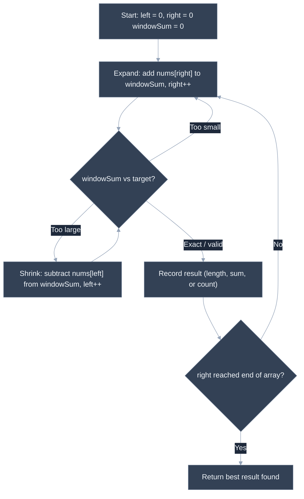
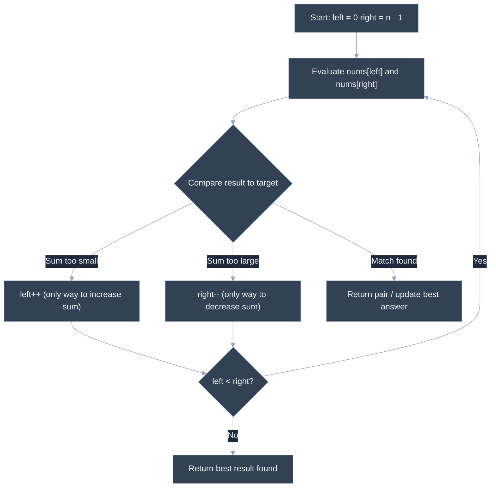

# Arrays and Strings: Sliding Window, Two Pointers, Prefix Sums

---

## 🎯 Executive Summary

Arrays and strings are the substrate almost every coding-round problem is built on, and three techniques — sliding window, two pointers, and prefix sums — account for a disproportionate share of the "medium" problems a Lead candidate is expected to solve cleanly, in one pass, while narrating the approach out loud. None of these are exotic: they're all ways of avoiding the naive O(n²) or O(n³) re-scan that a brute-force solution falls into, by exploiting structure in the problem (contiguity, sortedness, or cumulative totals) to do the work in a single linear pass.

What separates a Senior from a Lead here isn't knowing the techniques exist — most candidates who've prepped at all can name "sliding window" — it's **pattern recognition speed** and **precision under follow-up**. A Lead looks at a problem statement, identifies within seconds which of these three buckets (or none of them) it falls into, states the target complexity before writing a line of code, and can defend why a two-pointer approach requires a sorted array while a hash-map approach doesn't. Interviewers use these problems as a proxy for "how do you think about a new problem you haven't seen before," which is exactly the skill a Lead needs when scoping unfamiliar work for a team.

**Why this is a must-know for Leads:** these three patterns compose. Real interview problems often blend prefix sums with hash maps (subarray-sum problems), or two pointers with sliding-window shrinking (longest-substring problems). A Lead who has internalized the *recognition signals* for each pattern — not just memorized one canonical problem per pattern — can decompose a novel problem into the right combination instead of forcing it into whichever technique they happen to remember best.

---

## 📖 What Is It? (Plain-English Definition)

**In plain terms:** these are three different tricks for scanning an array or string exactly once (or close to it) instead of re-scanning it over and over for every possible starting point.

A **sliding window** is like looking at a sequence of houses through a physical window frame that you can slide down the street and stretch or shrink — instead of re-examining every possible group of houses from scratch, you keep a running "view" and adjust its edges incrementally as you move, reusing whatever's still inside the frame.

**Two pointers** is like two people walking toward each other from opposite ends of a hallway, each adjusting their pace based on what they see, until they meet or cross — useful whenever the array's order (usually because it's sorted) tells you something useful about which direction to move next.

A **prefix sum** is like keeping a running total as you walk down a receipt, so that later you can answer "what did I spend between line 3 and line 9" with one subtraction instead of re-adding every line again. Precomputing cumulative sums trades a bit of extra memory (or a first pass) for turning repeated range-sum questions into O(1) lookups.

All three share the same underlying goal: turn an operation that looks like it needs to check every pair, every subarray, or every range from scratch into something that reuses previously computed work.

---

## 🧠 Core Technical Deep Dive

### Pattern Recognition — How to Spot This Category of Problem

This is the single highest-leverage skill in this whole topic. Concrete tells, by pattern:

**Sliding window tells:**
- The problem asks about a **contiguous** subarray or substring — "subarray," "substring," "window," never "subsequence" (subsequence usually means non-contiguous, which is a different family, often DP).
- The ask is a superlative or threshold over that contiguous range: "longest," "shortest," "maximum sum," "minimum length," or "contains all characters of X."
- There's an implicit or explicit monotonic relationship: as the window grows, some property only increases (or only decreases), which is what makes a "shrink from the left when invalid" strategy correct instead of requiring you to re-check every window from scratch.
- Fixed-size variant: the problem gives you an explicit window size `k` up front ("subarray of size k") — this is the easier, fixed-window case with no shrinking logic needed at all.

**Two pointers tells:**
- The input is **sorted**, or can cheaply be sorted, and the problem asks about pairs or triplets with a target sum/difference/product.
- The problem describes two ends converging — "container," "trapping," "closest to," "opposite ends."
- In-place partitioning or rearrangement is required ("move all zeros to the end," "remove duplicates in place," "sort an array of 0s/1s/2s") — this is the "fast/slow pointer" or three-way-partition sub-variant.
- Palindrome checks — comparing from both ends inward is a two-pointer pattern in disguise.

**Prefix sum tells:**
- The phrase "subarray sum equals K" (or any variant of "how many subarrays sum to X") — this is close to a fingerprint for prefix-sum-plus-hash-map.
- Repeated range-sum queries against the **same, unchanging** array — "given Q queries, each asking for the sum between index i and j" — precompute once, answer each query in O(1) instead of re-summing per query.
- The array can contain **negative numbers**, which is the tell that rules out a plain sliding window for a "subarray sum" ask: sliding window's shrink-from-the-left logic depends on the window sum moving monotonically as you expand or shrink, which breaks the moment negative numbers are allowed. That's exactly when prefix sum + hash map takes over.

**The meta-skill:** say the recognition out loud in the interview. "This is asking for a contiguous subarray with a min-length constraint, and the array is all positive, so sliding window applies — if it allowed negatives, I'd reach for prefix sums instead." That sentence alone signals more seniority than a correct solution arrived at silently.

### Sliding Window — Fixed Size vs. Variable Size

**Fixed-size window** (window size `k` given): maintain a running sum, add the new element entering the window, subtract the element leaving it — O(1) update per step instead of re-summing `k` elements every time.

```javascript
function maxSumFixedWindow(nums, k) {
  let windowSum = 0;
  for (let i = 0; i < k; i++) windowSum += nums[i];
  let best = windowSum;
  for (let i = k; i < nums.length; i++) {
    windowSum += nums[i] - nums[i - k]; // slide: add new, drop old
    best = Math.max(best, windowSum);
  }
  return best;
}
```

**Variable-size window** (no fixed `k` — expand until invalid, then shrink): two pointers `left` and `right` define the window; `right` always advances, `left` only advances when the window becomes invalid relative to the constraint.

```javascript
function minSubArrayLen(target, nums) {
  let left = 0, sum = 0, best = Infinity;
  for (let right = 0; right < nums.length; right++) {
    sum += nums[right];
    while (sum >= target) {          // window is "valid" — try to shrink it
      best = Math.min(best, right - left + 1);
      sum -= nums[left];
      left++;
    }
  }
  return best === Infinity ? 0 : best;
}
```

The key invariant: `right` never moves backward, and `left` never moves backward either — each pointer traverses the array at most once, giving O(n) total work even though there's a nested-looking `while` inside a `for`.

### Two Pointers — Opposite Ends vs. Same Direction

**Opposite ends** (converging inward): used when the array is sorted and you're looking for a pair/triplet satisfying a sum condition, or maximizing/minimizing something bounded by both ends (like container area).

```javascript
function twoSumSorted(nums, target) {
  let left = 0, right = nums.length - 1;
  while (left < right) {
    const sum = nums[left] + nums[right];
    if (sum === target) return [left, right];
    if (sum < target) left++;   // sum too small — only increasing left can help
    else right--;               // sum too large — only decreasing right can help
  }
  return [-1, -1];
}
```

The correctness argument matters: because the array is sorted, if `nums[left] + nums[right]` is too small, incrementing `right` downward could never fix it (it can only shrink the sum further or stay the same) — `left` is the only pointer that can increase the sum. That asymmetric reasoning is exactly what a Lead should be able to articulate, not just "you move whichever pointer."

**Same direction (fast/slow):** used for in-place compaction — e.g., removing duplicates from a sorted array, or partitioning an array around a pivot value.

```javascript
function removeDuplicates(nums) {
  if (nums.length === 0) return 0;
  let slow = 0;
  for (let fast = 1; fast < nums.length; fast++) {
    if (nums[fast] !== nums[slow]) {
      slow++;
      nums[slow] = nums[fast];
    }
  }
  return slow + 1; // new length of the deduplicated prefix
}
```

### Prefix Sums — Precompute Once, Query in O(1)

A prefix-sum array `P` where `P[i]` = sum of `nums[0..i-1]` turns any range-sum query `sum(i, j)` into `P[j+1] - P[i]` — no re-scanning required, regardless of how many queries follow.

```javascript
function buildPrefixSums(nums) {
  const prefix = [0]; // prefix[0] = 0 (sum of zero elements) — sentinel simplifies range math
  for (const n of nums) prefix.push(prefix[prefix.length - 1] + n);
  return prefix;
}
// sum(i, j) inclusive === prefix[j + 1] - prefix[i]
```

The sentinel `prefix[0] = 0` is what makes "subarray starting at index 0" a clean case instead of a special-cased edge condition — this is the same trick that powers "subarray sum equals K": tracking how many times each running-sum value has been seen so far via a hash map, so that `runningSum - k` being a previously-seen prefix sum means a valid subarray ending here exists. This is the direct bridge to the hash-maps-and-sets topic — prefix sum supplies the *cumulative total*, and a hash map supplies the O(1) "have I seen this total minus k before" lookup that turns an O(n²) nested-loop search into O(n).

---

## 📊 Visual Architecture & Logic

### Diagram 1 — Sliding Window Mechanism



### Diagram 2 — Two-Pointer Convergence Logic



---

## 🏢 Interview Context & FAANG Signals

| Interview Stage | Format |
| --- | --- |
| Coding Round 1 | Live-coded sliding window or two-pointer problem, expected in under 20 minutes with a working, tested solution |
| Coding Round 2 (harder) | A prefix-sum or combined pattern (e.g., sliding window + hash map) problem, or a follow-up that changes constraints mid-interview ("now the array can have negatives") to see if the candidate updates their approach |
| Take-home / OA | Multiple problems from this family, auto-graded on both correctness and runtime against large inputs — brute-force solutions time out |

**Lead signals interviewers listen for:**

1. **Fast, stated pattern recognition** — naming the technique and *why* it applies (contiguous + superlative → sliding window; sorted + pair sum → two pointers) before writing code, not arriving at it by trial and error.
2. **Unprompted complexity statement** — stating time and space complexity as part of proposing the approach, not only when asked at the end.
3. **Trade-off discussion** — explicitly comparing the brute-force approach's complexity to the optimized one, and naming *why* the optimization is valid (e.g., "the window sum only needs to move by one element each step, so I don't need to re-sum").
4. **Edge-case handling before being asked** — empty input, `k` larger than the array, all-negative or all-identical elements, addressed proactively while walking through the approach, not discovered via a failing test the interviewer points out.
5. **Adapting to constraint changes gracefully** — when the interviewer perturbs the problem (adds negative numbers, removes the "sorted" guarantee), recognizing which technique breaks and which one to switch to, rather than patching the broken one awkwardly.

---

## ⚔️ Lead Level vs Senior Level

**Question:** "Given an array of integers, find the length of the shortest contiguous subarray whose sum is at least `target`. What's your approach?"

> **Senior Response:** "I'd check every possible subarray — for each starting index, extend the subarray until the sum hits the target, track the shortest one. That's O(n²) but it works."

This is correct and will eventually pass, but it's the brute-force answer with no attempt to improve it, and no complexity awareness volunteered.

> **Staff/Lead Response:** "Since we only care about contiguous subarrays and all we're tracking is a running sum, this is a variable-size sliding window: I expand `right` to grow the window and accumulate the sum, and whenever the sum meets or exceeds `target`, I try shrinking from `left` to find the minimal valid window before it stops being valid. Both pointers only move forward, so total work is O(n) instead of O(n²), and space is O(1) since I'm only tracking a running sum and the best length so far. The one thing that would break this approach is negative numbers in the array — then the window sum wouldn't shrink monotonically as I remove elements from the left, and I'd need to fall back to a prefix-sum-plus-sorted-structure approach instead. Since the problem doesn't mention negatives, I'll proceed with sliding window, but I'd confirm that constraint before committing."

The Lead response names the technique immediately, states both complexities unprompted, and proactively identifies the exact condition (negative numbers) that would invalidate the chosen approach — showing the boundary of when the technique applies, not just that it applies here.

---

## ⚠️ Common Pitfalls & Anti-Patterns

> ### ✕ Using Sliding Window on an Array That Can Contain Negative Numbers
>
> **Why it's wrong:** Sliding window's shrink-from-the-left logic assumes the window sum changes monotonically as elements are added or removed. With negative numbers present, removing an element from the left could *increase* the sum instead of decreasing it, breaking the "shrink while too large" invariant the whole technique depends on — the algorithm silently produces wrong answers instead of erroring.
>
> **✓ Correct Lead Approach:** Check the constraints for "can contain negative numbers" before reaching for sliding window on a subarray-sum problem. If negatives are allowed, switch to prefix sum + hash map, which has no monotonicity assumption.

---

> ### ✕ Off-by-One Errors in Window Boundaries
>
> **Why it's wrong:** Window length is `right - left + 1`, not `right - left` — forgetting the `+1` under-counts every window by one element, a bug that's easy to miss because it still produces a plausible-looking (just slightly wrong) answer rather than a crash.
>
> **✓ Correct Lead Approach:** Explicitly verify window-length arithmetic against a small hand-traced example (e.g., `left=1, right=3` should be a window of 3 elements: indices 1, 2, 3) before trusting the formula, and be consistent about whether the window is defined as inclusive or exclusive of `right` throughout the whole solution.

---

> ### ✕ Forgetting to Reset or Re-check the Sorted Precondition for Two Pointers
>
> **Why it's wrong:** The two-pointer opposite-ends technique's correctness argument ("moving `left` is the only way to increase the sum") depends entirely on the array being sorted. Applying it to unsorted input produces incorrect results without any obvious symptom — it just converges to the wrong answer silently.
>
> **✓ Correct Lead Approach:** If the input isn't already sorted but the problem doesn't otherwise depend on preserving original order (e.g., you only need indices into a *value*, not original positions), sort first and account for that O(n log n) cost explicitly in the complexity discussion — don't apply the pattern to unsorted data and hope.

---

> ### ✕ Treating Prefix-Sum Range Queries as "Just Loop and Sum Each Time"
>
> **Why it's wrong:** For a single range-sum query, direct summation is fine. But when the problem states or implies *repeated* queries against the same array, re-summing per query turns an O(n) preprocessing opportunity into O(n·Q) total work — this is exactly the shape interviewers use to test whether a candidate notices reusable structure across multiple queries.
>
> **✓ Correct Lead Approach:** Recognize "many queries, same underlying array" as the tell for precomputing a prefix-sum array once (O(n)), then answering every query in O(1) via subtraction — and state that trade-off (a bit of upfront work and O(n) extra space, in exchange for O(1) per query) explicitly.

---

> ### ✕ Not Handling the Empty-Subarray / Zero-Length Edge Case in "Subarray Sum" Problems
>
> **Why it's wrong:** Problems like "subarray sum equals K" have a subtle edge case at `k = 0` or when a prefix sum repeats exactly — failing to seed the hash map with `{0: 1}` (representing the empty prefix, sum zero, occurring once before any elements are processed) causes valid subarrays that start at index 0 to be missed entirely.
>
> **✓ Correct Lead Approach:** Always initialize the running-sum-to-count map with `{0: 1}` before the loop starts in prefix-sum-plus-hash-map problems, and trace through a small example where the target subarray starts at index 0 to confirm the seed value is actually needed and correctly handled.

---

## 🛠️ Practice Problems

### Problem 1: Maximum Sum Subarray of Size K

**Problem:**
```javascript
/**
 * Given an integer array `nums` and an integer `k`, find the maximum sum of
 * any contiguous subarray of exactly length `k`.
 * @param {number[]} nums
 * @param {number} k
 * @returns {number|null} the maximum sum, or null if no valid window exists
 */
function maxSumFixedWindow(nums, k) {
  // your implementation
}
```

Return `null` if `k` is larger than the array's length or `k <= 0`, since no valid window of that size exists.

**Examples:**
```
Input: nums = [2, 1, 5, 1, 3, 2], k = 3
Output: 9
Explanation: The subarray [5, 1, 3] has the maximum sum among all size-3 windows.
```
```
Input: nums = [-1, -2, -3, -4], k = 2
Output: -3
Explanation: All sums are negative; [-1, -2] is the least negative (largest) window sum.
```

**Edge cases to handle:**
- `k` larger than `nums.length` (no valid window — return `null`)
- Array containing negative numbers (the algorithm must not assume positivity)
- `k === 1` (every single element is its own window; answer is just the max element)

<details>
<summary>💡 Hint 1</summary>

Think about what you'd have to redo if you computed the sum of one window and then moved to the very next window one position over — how much of that sum is actually still relevant?

</details>

<details>
<summary>💡 Hint 2</summary>

You don't need to re-sum the whole window each time. A single running total, updated incrementally, is enough — this is the fixed-size sliding window technique.

</details>

<details>
<summary>💡 Hint 3</summary>

Sum the first `k` elements once to seed the window. Then, for each subsequent position, update the running sum by adding the element that just entered the window on the right and subtracting the element that just left on the left. Track the maximum running sum seen at each step.

</details>

<details>
<summary>✅ Reveal Solution</summary>

```javascript
function maxSumFixedWindow(nums, k) {
  if (k <= 0 || k > nums.length) return null;

  let windowSum = 0;
  for (let i = 0; i < k; i++) windowSum += nums[i];

  let best = windowSum;
  for (let i = k; i < nums.length; i++) {
    windowSum += nums[i] - nums[i - k]; // add entering element, drop leaving element
    best = Math.max(best, windowSum);
  }
  return best;
}
```

**Why it works:** the first loop seeds the window sum exactly once (the "expensive" O(k) work happens only here). Every subsequent step reuses that running total, adjusting it by exactly one addition and one subtraction rather than re-summing `k` elements — this is the incremental-update idea from Hint 3, applied directly.

**Time complexity:** O(n) — the initial sum is O(k), and each of the remaining `n - k` positions does O(1) work, so total work is linear in the array length.
**Space complexity:** O(1) — only a running sum and a best-so-far value are tracked, regardless of array size.

</details>

---

### Problem 2: Container With Most Water

**Problem:**
```javascript
/**
 * Given an array `height` where height[i] represents the height of a vertical
 * line at position i, find two lines that, together with the x-axis, form a
 * container holding the maximum amount of water. Return the maximum area.
 * @param {number[]} height
 * @returns {number} the maximum water area achievable
 */
function maxArea(height) {
  // your implementation
}
```

The area between two lines at indices `i` and `j` is `(j - i) * min(height[i], height[j])` — width times the shorter of the two walls (water can't rise above the shorter wall).

**Examples:**
```
Input: height = [1, 8, 6, 2, 5, 4, 8, 3, 7]
Output: 49
Explanation: Lines at index 1 (height 8) and index 8 (height 7) give width 7, height min(8,7)=7, area = 49.
```
```
Input: height = [1, 1]
Output: 1
Explanation: Only one pair available: width 1, height min(1,1)=1, area = 1.
```

**Edge cases to handle:**
- Array of length less than 2 (no valid container — define a sensible return, e.g. `0`)
- All bars the same height (widest possible pair always wins)
- A single very tall bar surrounded by short ones (the algorithm must not get "stuck" favoring the tall bar)

<details>
<summary>💡 Hint 1</summary>

Checking every pair of lines is O(n²). Since the container's width is maximized by starting at the two ends of the array, think about whether you actually need to check every pair, or whether some pairs can be ruled out early.

</details>

<details>
<summary>💡 Hint 2</summary>

Use two pointers starting at opposite ends of the array. At each step, the container's area is limited by the *shorter* of the two current lines — moving the taller line inward can only ever keep the width smaller with no chance of a taller limiting wall, so it can never improve the result.

</details>

<details>
<summary>💡 Hint 3</summary>

Start `left = 0` and `right = length - 1`. Compute the area at each step and track the maximum. Then always move the pointer pointing at the *shorter* line inward — moving the taller one can only decrease the width while keeping the same (or a smaller) limiting height, so it can never produce a better answer. Keep going until the pointers meet.

</details>

<details>
<summary>✅ Reveal Solution</summary>

```javascript
function maxArea(height) {
  if (height.length < 2) return 0;

  let left = 0, right = height.length - 1;
  let best = 0;

  while (left < right) {
    const width = right - left;
    const limitingHeight = Math.min(height[left], height[right]);
    best = Math.max(best, width * limitingHeight);

    if (height[left] < height[right]) {
      left++;
    } else {
      right--;
    }
  }
  return best;
}
```

**Why it works:** each step computes the area for the current pair, then discards the shorter line by moving its pointer inward — because that shorter line is the "bottleneck" for the current pair, keeping it and shrinking the width can never beat the current area, so it's safe to never revisit it. This greedy elimination is what shrinks the search from O(n²) pairs down to a single O(n) pass.

**Time complexity:** O(n) — each of `left` and `right` moves at most `n` times total, and the pointers only move toward each other, so the loop runs at most `n` iterations.
**Space complexity:** O(1) — only two pointers and a running best value are tracked.

</details>

---

### Problem 3: Subarray Sum Equals K

**Problem:**
```javascript
/**
 * Given an integer array `nums` and an integer `k`, return the total number
 * of contiguous subarrays whose elements sum to exactly `k`.
 * @param {number[]} nums
 * @param {number} k
 * @returns {number} count of subarrays summing to k
 */
function subarraySum(nums, k) {
  // your implementation
}
```

`nums` may contain negative numbers, zero, and duplicates — the answer counts every valid contiguous subarray, even overlapping ones.

**Examples:**
```
Input: nums = [1, 1, 1], k = 2
Output: 2
Explanation: The subarrays [1,1] (indices 0-1) and [1,1] (indices 1-2) both sum to 2.
```
```
Input: nums = [1, -1, 0], k = 0
Output: 3
Explanation: [1,-1], [1,-1,0], and [0] all sum to 0.
```

**Edge cases to handle:**
- Negative numbers present in the array (rules out a sliding-window approach entirely)
- `k === 0` (requires correctly seeding the "empty prefix" case)
- No valid subarray exists at all (should return `0`, not throw or return `-1`)

<details>
<summary>💡 Hint 1</summary>

Since the array can contain negative numbers, a sliding window won't work here — the window sum doesn't move monotonically. Think instead about what a *running total* up to each index tells you, and what you'd need to know about running totals you've already seen.

</details>

<details>
<summary>💡 Hint 2</summary>

If the running sum up to the current index is `S`, a subarray ending here sums to `k` exactly when some earlier running sum equals `S - k`. A hash map that counts how many times each running sum has occurred so far lets you answer "how many earlier prefixes equal `S - k`" in O(1).

</details>

<details>
<summary>💡 Hint 3</summary>

Walk the array once, maintaining a running sum. Before updating the map for the current running sum, check how many times `runningSum - k` has already occurred and add that count to your answer. Seed the map with `{0: 1}` before the loop starts, to correctly count subarrays that begin at index 0 (an empty prefix summing to 0 "occurs once" before any elements are processed).

</details>

<details>
<summary>✅ Reveal Solution</summary>

```javascript
function subarraySum(nums, k) {
  const prefixCount = new Map();
  prefixCount.set(0, 1); // empty prefix: sum 0, occurring once, before any elements

  let runningSum = 0;
  let count = 0;

  for (const num of nums) {
    runningSum += num;
    const needed = runningSum - k;
    if (prefixCount.has(needed)) {
      count += prefixCount.get(needed);
    }
    prefixCount.set(runningSum, (prefixCount.get(runningSum) || 0) + 1);
  }
  return count;
}
```

**Why it works:** this is the prefix-sum-plus-hash-map bridge described in the deep dive — `runningSum` is a live prefix sum, and the map tracks how many times each prefix-sum value has occurred. A subarray `(i, j]` sums to `k` exactly when `prefix[j] - prefix[i] === k`, i.e., `prefix[i] === prefix[j] - k`, which is precisely the `needed` lookup performed at each step before inserting the current sum.

**Time complexity:** O(n) — a single pass over the array, with O(1) average-case map lookups and insertions at each step.
**Space complexity:** O(n) — in the worst case (e.g., all distinct running sums), the map stores one entry per array position.

</details>

---

*Document version: September 2026 | Audience: Staff/Principal Frontend Engineer candidates | Topic ID: arrays-strings-patterns*
