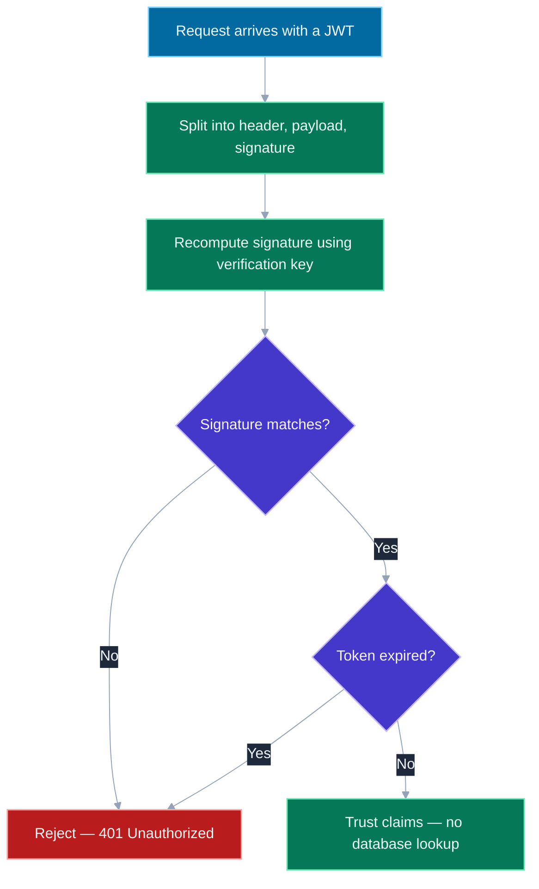
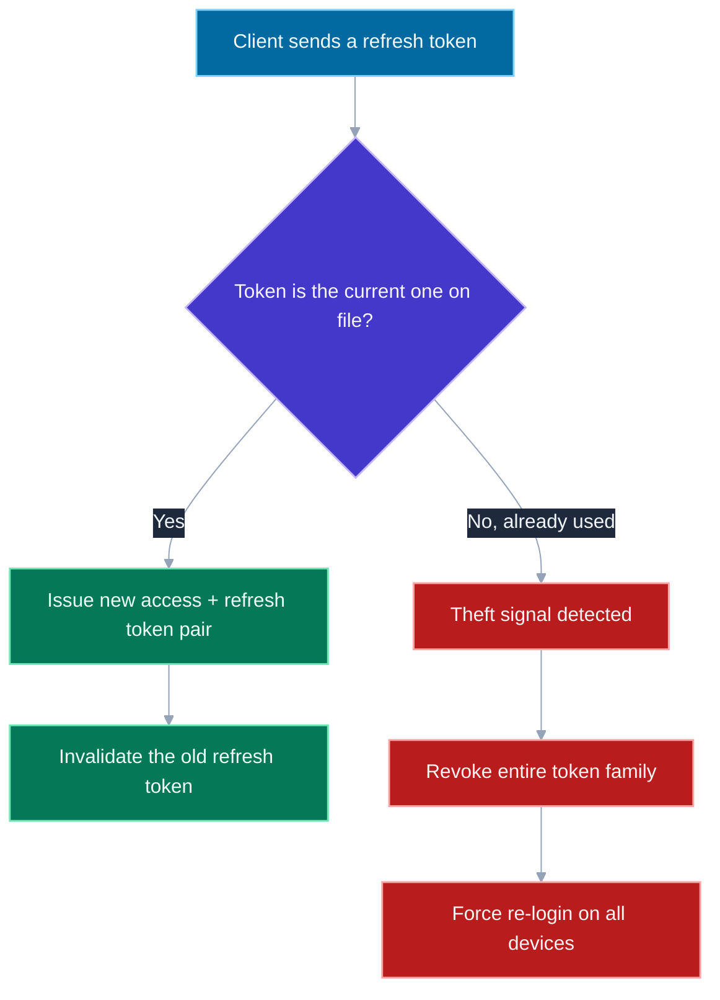

# Authentication: JWT vs Sessions, Refresh Tokens, and Where to Store Them

## 🎯 Executive Summary

Every auth system answers the same question differently: after a user logs in once, how does the server recognize them on every subsequent request without asking for a password again? Stateful sessions answer it by keeping a record server-side and handing the client a lookup key. JWTs answer it by putting the identity claims *inside* a signed token the server never has to store at all. Neither is "the modern one" or "the legacy one" — they're a genuine architectural trade-off between instant revocability and horizontal scalability, and picking between them (or combining both, which is what most real systems actually do) is a decision a Lead is expected to justify, not default into.

This is a must-know topic at Lead level because it sits at the intersection of three things interviewers specifically probe: whether a candidate understands JWTs are *signed, not encrypted* (this repo's [Encryption Fundamentals](/topic-detail.html?id=encryption-fundamentals) topic covers the signature mechanism this relies on), whether they can reason about the "stateless tokens can't be revoked early" problem and its standard mitigations, and whether they know client-side token storage is a genuine security decision with no perfect answer — only trade-offs against a specific threat model.

## 📖 What Is It? (Plain-English Definition)

**In plain terms:** authentication is how a server keeps recognizing you after you've logged in once, without making you re-enter your password on every single request. A session is the server keeping a little note that says "this ID belongs to this logged-in user" and handing you the ID to carry around. A JWT (JSON Web Token) is the opposite approach: instead of a note the server has to remember, the server hands you a tamper-proof card with your identity already printed on it — you show the card, the server checks the tamper-proof seal is intact, and never has to look anything up.

The tamper-proof part is the whole trick: a JWT's contents (who you are, what role you have) are plainly readable by anyone who has the token — they are not secret — but they're cryptographically *signed*, so nobody except the server (or whoever holds the signing key) can produce a card with different claims that still passes the seal check. That's what makes it trustworthy without a lookup: the server doesn't need to remember issuing it, it only needs to verify the signature is genuine.

---

## 🧠 Core Technical Deep Dive

### Stateful sessions: simple, revocable, requires shared storage

```
1. User logs in with credentials
2. Server creates a session record: { sessionId: "abc123", userId: 42, expiresAt: ... }
3. Server stores that record (in memory, Redis, or a DB)
4. Server sends sessionId to the client via a cookie
5. Every subsequent request: client sends the cookie, server looks up sessionId
```

The core property: the session record lives entirely server-side, and the client only ever holds an opaque lookup key. This makes revocation trivial — delete the session record, and that ID is instantly worthless, even if the cookie is still sitting in the client's browser. The cost: every request now requires a lookup against shared session storage, and that storage has to be reachable by every server instance handling requests (a plain in-memory session store breaks the moment you have more than one server, unless requests are "sticky" to the instance that created the session — itself a scaling constraint).

### JWTs: stateless, scalable, hard to revoke early

A JWT is three Base64URL-encoded segments joined by dots: `header.payload.signature`.

```javascript
// header (algorithm + token type)
{ "alg": "RS256", "typ": "JWT" }

// payload (claims — readable by anyone, NOT encrypted)
{ "userId": 42, "role": "admin", "exp": 1735689600 }

// signature = sign(base64(header) + "." + base64(payload), privateKey)
```

Any server holding the corresponding verification key can check the signature and trust the claims — with **zero database lookup**. This is the entire appeal for distributed systems: any service, anywhere, that has the public key (or shared secret) can independently verify a token belongs to a legitimate login, without a shared session store at all.

**HS256 vs RS256, and why the choice matters architecturally:**

| | Mechanism | Who can verify | Who can forge |
|---|---|---|---|
| **HS256** | HMAC with one shared secret | Anyone with the secret | Anyone with the secret (verifying and signing use the *same* key) |
| **RS256** | RSA key pair | Anyone with the public key | Only whoever holds the private key |

This directly mirrors [the symmetric/asymmetric split](/topic-detail.html?id=encryption-fundamentals): HS256 is fine when a single service both issues and verifies tokens, but the moment multiple independent services need to *verify* tokens without being trusted to *issue* them (a common microservices shape), RS256 is the only safe choice — distributing an HS256 secret to five services means any one of those five can now mint arbitrary admin tokens.

### The revocation problem, and how real systems patch around it

A JWT is valid until `exp`, full stop — there is no server-side record to delete, which is precisely the scalability win, and precisely the reason instant revocation ("log this user out everywhere, right now") isn't naturally possible. Standard mitigations, usually combined:

- **Short-lived access tokens** (minutes, not days) so a compromised token has a small blast-radius window regardless.
- **A refresh token** — long-lived, used only to mint new access tokens, checked against the one piece of state the system still keeps.
- **A denylist for extreme cases** (a compromised account, a forced logout) — reintroducing a small amount of server-side state specifically for the rare case where instant revocation is non-negotiable, rather than for every request.

### Refresh token rotation: detecting a stolen token, not just delaying the inevitable

```
1. Client authenticates → receives access token (15 min) + refresh token (30 days)
2. Access token expires → client sends refresh token to /refresh
3. Server issues a NEW access token AND a NEW refresh token
4. The OLD refresh token is immediately invalidated
```

The security property this buys: if an attacker steals a refresh token and uses it, and the legitimate client *later* tries to use the same (now-superseded) refresh token, the server sees a reused, already-invalidated token — a strong signal of theft — and can revoke the entire token family, forcing everyone (attacker included) to re-authenticate. Without rotation, a stolen refresh token is valid for its entire lifetime with no way to detect the theft at all.

### Where to store tokens client-side — a threat-model decision, not a default

This is exactly the storage trade-off already covered in depth in [CORS, Cookies, and Storage](/topic-detail.html?id=cors-storage-cookies) — applied specifically to auth tokens:

| Storage | XSS risk | CSRF risk | Survives refresh? |
|---|---|---|---|
| **In-memory (JS variable)** | Low — not readable by a *separate* injected script context the same way persistent storage is, though still exposed to XSS running in-page | None (never auto-sent) | No — lost on reload, needs a silent refresh flow |
| **`localStorage`** | High — any XSS payload reads it directly, no mitigation | None (never auto-sent) | Yes |
| **`httpOnly` cookie** | Low — JS cannot read it at all | Yes, unless mitigated with `SameSite` + CSRF token | Yes, automatically |

**The honest answer a Lead gives here:** there is no universally correct choice — an `httpOnly` cookie is the strongest option against token *theft* but reintroduces CSRF as a problem to solve explicitly; in-memory storage minimizes both risks but costs a more complex refresh-on-load flow. `localStorage` is the option to actively avoid for anything auth-related, specifically because it has no defense against the single most common web vulnerability class (XSS) at all.

---

## 📊 Visual Architecture & Logic

### Diagram 1: Verifying a JWT



### Diagram 2: Refresh Token Rotation Detecting Theft



---

## 🏢 Interview Context & FAANG Signals

| Interview Stage | Format |
|---|---|
| **System Design** | "Design auth for a multi-service API" — expects a stateful-vs-stateless trade-off discussion, not just "use JWT" |
| **Security Round** | Token storage placement, refresh rotation, and the revocation problem specifically |
| **Debugging Round** | "Users report they're still logged in after we 'logged them out everywhere'" — a revocation-model diagnosis |

**Lead signals interviewers listen for:**

1. **Naming the actual trade-off** — revocability vs. scalability — rather than treating JWT as a strictly superior replacement for sessions.
2. **Correctly explaining HS256 vs RS256's real architectural implication** — who can forge, not just "one is symmetric."
3. **Addressing the revocation problem directly**, with a named mitigation (short expiry + refresh, or a denylist), not glossing over it.
4. **Justifying a token storage choice from a threat model**, explicitly ruling out `localStorage` for anything sensitive.
5. **Knowing refresh rotation exists specifically to detect token theft**, not just to reduce access-token lifetime.

## ⚔️ Lead Level vs Senior Level

**Question:** "We're moving from a monolith to several microservices. Our current session-based auth requires every service to hit the shared Redis session store on every request. How would you rethink this?"

**Senior Response:**
> Switch to JWTs — then each service can just verify the token itself without hitting Redis.

Directionally right, but stops at the surface-level benefit without addressing what's given up.

---

**Staff/Lead Response:**
> JWTs solve the exact bottleneck we have — no shared-state lookup per request — but we'd be trading that for losing instant revocation, so I'd want to be deliberate about it, not just swap technologies. I'd use RS256 specifically, since multiple services need to verify tokens but only the auth service itself should be able to mint them — with HS256 we'd be handing every service the ability to forge tokens for any user.
>
> For revocation, I'd keep access tokens short-lived (a few minutes) with refresh tokens handling renewal, and add a lightweight denylist — just for the rare forced-logout/compromised-account case — so we're not reintroducing a lookup on every single request, only on the infrequent refresh call.
>
> I'd also want an explicit decision on where the access token lives client-side before we ship this, since that's a real threat-model question, not an implementation detail to leave to whoever writes the frontend code.

The Lead answer names exactly what's being traded away, picks the signing algorithm for the right architectural reason, and treats token storage as a decision requiring sign-off, not an afterthought.

## ⚠️ Common Pitfalls & Anti-Patterns

> ### ✕ Using HS256 Across Multiple Independent Services
> **Why it's wrong:** HS256 verification requires the same secret used to sign — distributing that secret to every service that needs to verify a token also hands every one of those services the ability to forge new, arbitrary tokens.
> **✓ Correct Lead Approach:** Use RS256 (or another asymmetric scheme) whenever more than one trust boundary needs to verify tokens issued by a single, more-trusted authority.

---

> ### ✕ Storing Auth Tokens in `localStorage` "For Simplicity"
> **Why it's wrong:** `localStorage` has zero defense against XSS — any successful script injection anywhere on the page can read the token directly, with no equivalent of `httpOnly` to block it.
> **✓ Correct Lead Approach:** Prefer an `httpOnly`, `Secure`, `SameSite`-scoped cookie, or in-memory storage with a silent-refresh flow, depending on the CSRF/UX trade-off that fits the app.

---

> ### ✕ Treating JWTs as a Drop-in Replacement With No Revocation Story
> **Why it's wrong:** Shipping stateless JWTs with no expiry strategy and no denylist means "log out everywhere" or "revoke a compromised account" simply cannot be done until every outstanding token naturally expires.
> **✓ Correct Lead Approach:** Pair short-lived access tokens with a refresh flow, and keep a minimal denylist for the genuinely urgent revocation cases — accepting a small amount of state back in exchange for a real revocation path.

---

> ### ✕ Refresh Tokens Without Rotation
> **Why it's wrong:** A single long-lived refresh token, reused indefinitely, gives an attacker who steals it a persistent, silent foothold — there's no mechanism to ever notice the theft happened.
> **✓ Correct Lead Approach:** Rotate refresh tokens on every use, and treat a reused (already-superseded) refresh token as a hard signal to revoke the entire token family.

---

> ### ✕ Putting Sensitive Data Directly in a JWT Payload
> **Why it's wrong:** JWT payloads are signed, not encrypted — anyone holding the token can decode and read every claim in plain text, whether or not they can forge a new one.
> **✓ Correct Lead Approach:** Keep payload claims to non-sensitive identifiers (user ID, role, expiry). Anything genuinely confidential belongs server-side, looked up by ID, not embedded in the token itself.

## 🛠️ Practice Scenarios

### Scenario 1: "Log Out Everywhere" Doesn't Work

**Problem:**
```javascript
function logoutEverywhere(userId) {
  // Currently a no-op comment: "JWTs are stateless, nothing to delete here"
  return { message: 'Logged out on all devices' };
}
```

A support ticket reports that after a user clicks "Log out everywhere" following a suspected account compromise, their stolen session keeps working on the attacker's device for hours afterward. Diagnose and fix.

<details>
<summary>Staff-Level Solution</summary>

**Root cause:** the system issues long-lived, stateless JWTs with no revocation mechanism at all — "logout everywhere" has nothing to actually invalidate, since the whole point of a stateless token is that the server never stores it.

**Fix — introduce a minimal denylist, scoped only to this rare case:**
```javascript
async function logoutEverywhere(userId) {
  const revokedAt = Date.now();
  await redis.set(`revoked:${userId}`, revokedAt, { EX: ACCESS_TOKEN_MAX_LIFETIME });
  return { message: 'Logged out on all devices' };
}

function verifyToken(token) {
  const claims = jwt.verify(token, publicKey);
  const revokedAt = redisSync.get(`revoked:${claims.userId}`);
  if (revokedAt && claims.iat * 1000 < revokedAt) throw new Error('Token revoked');
  return claims;
}
```

**Lead framing:** "This doesn't mean abandoning stateless JWTs — it means recognizing that 'fully stateless' and 'supports instant revocation' are fundamentally in tension, and a real product needs the revocation path for exactly this scenario. The fix reintroduces the smallest possible amount of state — one timestamp per user, checked only against tokens issued before it — rather than going back to a full session store."

</details>

---

### Scenario 2: Choosing Token Storage for a New SPA

**Problem:**
```javascript
// Two options under discussion for the new app's access token:
localStorage.setItem('accessToken', token);
// vs.
// Set-Cookie: accessToken=...; HttpOnly; Secure; SameSite=Strict
```

The team is debating these two approaches for a single-page app that also has a known third-party analytics script embedded on every page. Make the call.

<details>
<summary>Staff-Level Solution</summary>

**Decision: the `httpOnly` cookie.** The deciding factor is the third-party script already embedded on every page — it's an additional, standing XSS-adjacent risk surface (a compromised or malicious update to that script has direct JS execution on every page), and `localStorage` offers zero protection against exactly that scenario, handing the token straight to any code running on the page, first-party or not.

**Trade-off accepted:** `SameSite=Strict` on the cookie blocks CSRF for standard navigation, but any cross-site `fetch`/form submission to this API needs explicit handling — this is a known, addressable cost, versus the XSS exposure of `localStorage`, which has no equivalent mitigation at all.

**Lead framing:** "This wasn't a coin flip between two roughly-equal options — the presence of third-party script content is exactly the scenario `httpOnly` storage exists to defend against. If we genuinely had zero third-party scripts and a very locked-down CSP, in-memory storage would be worth reconsidering, but that's not the app we're building."

</details>
