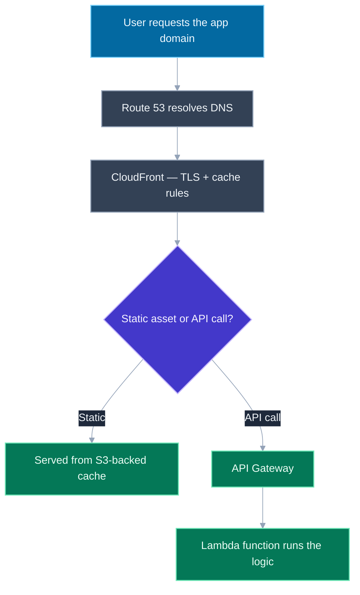
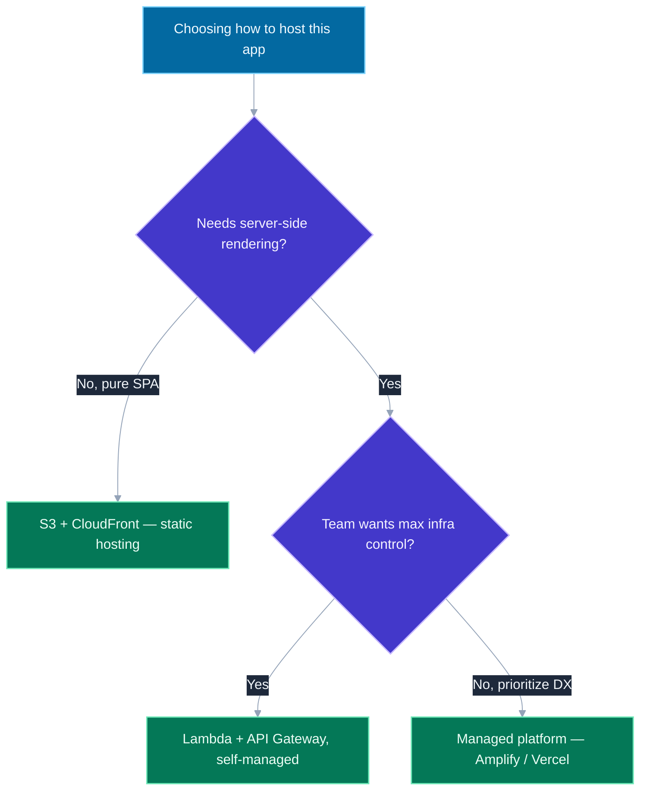

# AWS Fundamentals for Frontend Leads: S3, CloudFront, Lambda, and Hosting a SPA

## 🎯 Executive Summary

A frontend lead doesn't need AWS certification-level depth, but "how would you actually deploy and scale this" is a near-guaranteed follow-up to any frontend system design question, and answering it well requires knowing how a handful of AWS primitives map onto the app you already know how to build: a bucket that holds your built JS/CSS/HTML, a CDN that caches and serves it close to users, and a way to run backend logic without owning a server. Candidates who've only ever used a one-click platform (Vercel, Netlify) often can't explain what's actually happening underneath, which is precisely the gap this topic closes.

This is a must-know topic at Lead level because "static hosting," "CDN," and "serverless" are not abstract cloud buzzwords in this context — they're the direct infrastructure equivalent of decisions already covered elsewhere in this repo: cache-control strategy (see [Caching Strategies](/topic-detail.html?id=caching-strategies)) has to actually be configured *somewhere*, and that somewhere is CloudFront; TLS termination (see [Encryption Fundamentals](/topic-detail.html?id=encryption-fundamentals)) has to happen *somewhere*, and that's also CloudFront. A Lead is expected to connect frontend architecture decisions to where they physically live in a deployed system, not treat "infrastructure" as someone else's concern entirely.

## 📖 What Is It? (Plain-English Definition)

**In plain terms:** S3 is a place to put files — think of it as an infinitely large hard drive in the cloud with no ability to *run* anything, just store and serve raw files. CloudFront is a network of servers positioned physically close to users all over the world, which cache copies of your files so a user in Tokyo isn't fetching them from a server in Virginia every time. Lambda is a way to run a small piece of backend code on demand, without ever provisioning or managing an actual server — AWS runs it for you, for exactly as long as it takes, and charges only for that time.

A typical deployed single-page app strings these together: your built app (the output of `npm run build`) sits in an S3 bucket as plain files; CloudFront sits in front of that bucket, caching those files at edge locations worldwide and handling HTTPS; and any API calls the app makes go to a *different* path, routed to Lambda functions (via API Gateway) that actually run your backend logic. None of these three services do anything by themselves that a frontend engineer would recognize as novel — the skill being tested is knowing which piece does which job, and how they connect.

---

## 🧠 Core Technical Deep Dive

### S3: object storage, not a server

S3 (Simple Storage Service) stores objects (files) in buckets — it has no concept of "running" anything. Enabling "static website hosting" on a bucket lets it serve files over plain HTTP directly, but that mode has real, production-disqualifying limitations: no HTTPS on the bucket's own website endpoint, no custom response headers, and no fine-grained cache control. This is exactly why no serious production setup serves directly from an S3 website endpoint — S3 is the *storage* layer, not the *delivery* layer.

### CloudFront: the delivery layer — caching, edge locations, and TLS termination

CloudFront is AWS's CDN: it sits in front of an origin (an S3 bucket, or any HTTP server) and caches responses at edge locations distributed globally, so a user's request is served from the nearest edge rather than round-tripping to the origin every time. Two things make CloudFront the correct place to put a production frontend, not just a nice-to-have:

- **TLS termination happens here** — CloudFront holds the certificate and handles the HTTPS handshake described in [Encryption Fundamentals](/topic-detail.html?id=encryption-fundamentals), so the origin (S3) never needs to deal with certificates at all.
- **Cache behavior is configured here** — `Cache-Control` header strategy, which paths get cached for how long, and how a deploy triggers a cache invalidation for changed files, is a CloudFront-level configuration, not something S3 or the app itself controls. This is the exact same content-hashing-plus-`Cache-Control` strategy covered in [Caching Strategies](/topic-detail.html?id=caching-strategies) — CloudFront is simply *where* that strategy gets applied in an AWS deployment.

**Cache invalidation on deploy, concretely:** hashed asset filenames (`app.a3f8c1.js`) can be cached with a very long `max-age` forever, since a new deploy produces a new filename — no invalidation needed. `index.html` (never hashed, since it's the entry point) needs a short cache lifetime or an explicit CloudFront invalidation on every deploy, or users will keep loading a stale shell that references old, possibly-deleted hashed asset files.

### Lambda: running code without owning a server

A Lambda function is a unit of code AWS runs on demand and bills per invocation and duration — there's no server to patch, scale, or keep warm (though a genuinely cold, unused function does pay a one-time "cold start" latency cost on its first invocation in a while, a real, testable performance detail). For a frontend lead, Lambda shows up in three recognizable shapes:

1. **A backend-for-frontend / API layer** — Lambda functions behind API Gateway, handling the app's actual API calls, entirely separate from the static-asset path served by CloudFront/S3.
2. **Edge logic** — Lambda@Edge or CloudFront Functions running *at* the CDN edge, close to the user, for things like URL rewrites, A/B test bucketing, or an auth check before a request ever reaches the origin.
3. **Server-side rendering** — frameworks like Next.js, when deployed to AWS (directly or via tooling like SST/Serverless/Amplify), compile SSR routes into Lambda functions invoked per request, rather than a long-running Node process.

### A typical static SPA deployment, end to end

```
Route 53 (DNS)
      │
      ▼
CloudFront (CDN + TLS termination + cache rules)
      │
      ├── /                    → S3 bucket (static app shell: HTML/JS/CSS)
      └── /api/*               → API Gateway → Lambda (application backend)
```

Route 53 resolves the domain name to CloudFront; CloudFront serves static paths straight from its S3-backed cache, and routes API paths onward to a completely separate backend. This split — static assets served from a CDN cache, API calls hitting real compute — is the architectural shape almost every "how would you deploy this" follow-up is actually asking a candidate to draw.

### IAM: least privilege, not a checkbox

IAM (Identity and Access Management) governs what any given AWS resource is *allowed* to do. The principle that matters here: a Lambda function's IAM role should grant only the exact permissions it needs (e.g., read access to one specific S3 bucket) — never a broad, convenient policy like full S3 access "to save time." A Lead doesn't need to write IAM policy JSON from memory, but should recognize least-privilege as the default posture, and recognize an overly broad role as a real finding in an architecture review, not a style nitpick.

### Secrets never belong in the frontend bundle

Environment variables are fine for non-sensitive build-time config (an API base URL). Actual secrets — API keys, database credentials — belong in AWS Secrets Manager or Systems Manager Parameter Store, read by server-side code (Lambda, a backend service) at runtime. **Anything shipped inside a frontend bundle is public**, full stop, regardless of how it's stored server-side beforehand — a `.env` file with a "secret" key that ends up bundled into client JS via a build tool is not a secrets-management bug, it's a completely unprotected public value, and this is a real, recurring mistake worth naming explicitly.

### Managed platforms as the honest alternative

Vercel, Netlify, and AWS's own Amplify abstract most of the S3+CloudFront+Lambda stack behind a much simpler deploy experience (`git push`, done). The real trade-off: raw AWS gives more control and, at meaningful scale, lower cost — a managed platform trades some of that control and margin for materially faster developer experience and less operational ownership. Naming this as a genuine, situational trade-off — not "AWS is for grown-ups, platforms are for toy projects" — is itself a Lead-level signal.

---

## 📊 Visual Architecture & Logic

### Diagram 1: A Static SPA Deployment on AWS



### Diagram 2: Choosing a Hosting Approach



---

## 🏢 Interview Context & FAANG Signals

| Interview Stage | Format |
|---|---|
| **System Design follow-up** | "How would you deploy and scale this globally" after any frontend design question |
| **Architecture Discussion** | Justifying raw AWS vs. a managed platform for a specific team/product |
| **Debugging Round** | "Users report seeing a blank page right after a deploy" — a cache-invalidation/`index.html` diagnosis |

**Lead signals interviewers listen for:**

1. **Correctly separating storage (S3) from delivery (CloudFront)** — not treating them as interchangeable.
2. **Naming where TLS termination and cache-control policy actually live** in the stack, not just "the CDN handles it."
3. **Connecting Lambda's shapes to real frontend use cases** (API layer, edge logic, SSR) rather than describing it as generic "serverless magic."
4. **Treating secrets-in-the-bundle as a hard, non-negotiable rule**, not a best practice to weigh against convenience.
5. **Framing managed-platform-vs-raw-AWS as a genuine trade-off** (control/cost vs. developer experience), not a maturity judgment.

## ⚔️ Lead Level vs Senior Level

**Question:** "Right after every deploy, some users see a blank white screen for a few minutes before it resolves itself. What's going on, and how do you fix it?"

**Senior Response:**
> Probably a caching issue — tell users to hard refresh.

Identifies the general area but stops at a workaround instead of the mechanism.

---

**Staff/Lead Response:**
> This is almost certainly `index.html` being served stale from CloudFront's cache, still referencing the *previous* deploy's hashed JS/CSS filenames — which may have just been overwritten or deleted in S3 by the new deploy. The user's browser loads the old shell, tries to fetch assets that no longer exist at those paths, and fails until the cache naturally expires or self-heals.
>
> The fix is making sure `index.html` specifically has a short cache lifetime (or `no-cache` with revalidation) while the hashed asset files can stay cached indefinitely, and adding an explicit CloudFront invalidation for `index.html` as a required step in the deploy pipeline — not something we rely on happening eventually. I'd also want the deploy to not delete old hashed assets immediately, keeping the last one or two versions around briefly, so any client still holding a slightly-stale `index.html` during the propagation window doesn't 404 on its asset requests either.

The Lead answer names the exact mechanism (stale shell referencing since-removed assets), and proposes a structural pipeline fix rather than a user-facing workaround.

## ⚠️ Common Pitfalls & Anti-Patterns

> ### ✕ Serving Directly From an S3 Website Endpoint in Production
> **Why it's wrong:** No HTTPS on the bucket's native website endpoint, no custom headers, no fine-grained cache control — none of which are optional in a real production deployment.
> **✓ Correct Lead Approach:** Always front S3 with CloudFront (or an equivalent CDN); treat S3 as pure storage, never as the public-facing delivery layer.

---

> ### ✕ Caching `index.html` With the Same Long Lifetime as Hashed Assets
> **Why it's wrong:** Hashed asset filenames change on every deploy, so caching them forever is safe; `index.html` is the one file that must always reflect the *current* deploy's asset references — caching it long-lived means users get a stale shell pointing at deleted files.
> **✓ Correct Lead Approach:** Give `index.html` a short cache lifetime and invalidate it explicitly on every deploy; let hashed assets cache indefinitely.

---

> ### ✕ Baking Secrets Into the Frontend Bundle Via Environment Variables
> **Why it's wrong:** Anything referenced by client-side code and included in the build output ships to every user's browser in plain text — a build-time env var is not a secrets-management mechanism, regardless of how it's stored in CI.
> **✓ Correct Lead Approach:** Secrets stay server-side (Secrets Manager, Parameter Store), read only by backend code. Only genuinely public config belongs in a frontend build.

---

> ### ✕ Granting a Lambda Function Broad IAM Permissions "To Save Time"
> **Why it's wrong:** A function that only needs to read one S3 bucket, but is granted account-wide S3 access, dramatically increases the blast radius if that function is ever compromised or has a bug that exposes its execution context.
> **✓ Correct Lead Approach:** Scope every IAM role to the minimum permissions the function actually needs — least privilege as the default, not an audit finding to fix later.

---

> ### ✕ Assuming a Managed Platform (Vercel/Amplify) Is Strictly Worse Engineering
> **Why it's wrong:** Dismissing managed platforms as "not real infrastructure" ignores that they trade some cost/control for genuinely faster shipping — a real, situational trade-off, not an inferior shortcut.
> **✓ Correct Lead Approach:** Choose based on the team's actual constraints — scale, cost sensitivity, need for custom infra — rather than a blanket preference either direction.

## 🛠️ Practice Scenarios

### Scenario 1: The Blank Screen After Deploy

**Problem:**
```javascript
// deploy.js — current pipeline
async function deploy() {
  await syncBuildOutputToS3('./dist', 'my-app-bucket');
  console.log('Deploy complete.');
  // No CloudFront invalidation step
}
```

Users report intermittent blank screens for several minutes after every deploy. Diagnose and fix the pipeline.

<details>
<summary>Staff-Level Solution</summary>

**Root cause:** the deploy uploads new files to S3 but never invalidates CloudFront's cached copy of `index.html` — CloudFront keeps serving the previous deploy's shell (referencing now-deleted hashed asset filenames) until that cached response's TTL naturally expires.

**Fix:**
```javascript
async function deploy() {
  await syncBuildOutputToS3('./dist', 'my-app-bucket');
  await createCloudFrontInvalidation({
    distributionId: 'E1234EXAMPLE',
    paths: ['/index.html'], // hashed assets don't need invalidation - new filenames, new cache entries
  });
  console.log('Deploy complete.');
}
```

**Lead framing:** "The bug isn't in S3 or the build — it's a missing step in the deploy pipeline itself. `index.html` is the one file in this whole architecture that must be treated as always-fresh, and that has to be enforced by the pipeline, not left to a cache TTL to eventually sort out."

</details>

---

### Scenario 2: A Leaked API Key

**Problem:**
```javascript
// config.js, imported directly into client-side React code
export const STRIPE_SECRET_KEY = process.env.REACT_APP_STRIPE_SECRET_KEY;
```

A security scan flags that the Stripe *secret* key (not the publishable key) is visible in the production JS bundle. Explain how this happened and the fix.

<details>
<summary>Staff-Level Solution</summary>

**How it happened:** any environment variable prefixed for the build tool to expose to client code (here, `REACT_APP_*`) gets inlined directly into the compiled JS bundle at build time — it was never actually "secret" once referenced from frontend code, regardless of how carefully it was stored in CI/CD secrets before the build ran.

**Fix:** the secret key must never be referenced from frontend code at all. Move any operation requiring it (creating a payment intent, for example) to a backend endpoint (Lambda behind API Gateway), and have the frontend call that endpoint instead:
```javascript
// Frontend: no secret key anywhere in this code
async function createPaymentIntent(amount) {
  const res = await fetch('/api/create-payment-intent', {
    method: 'POST',
    body: JSON.stringify({ amount }),
  });
  return res.json();
}

// Lambda (server-side): the only place the secret key is ever read
const stripe = require('stripe')(process.env.STRIPE_SECRET_KEY);
exports.handler = async (event) => {
  const { amount } = JSON.parse(event.body);
  return stripe.paymentIntents.create({ amount, currency: 'usd' });
};
```

**Lead framing:** "This needs to be treated as an actual incident, not just a code fix — that key has been public since the first deploy that included it, so it needs to be rotated immediately, not just removed going forward. The structural fix is drawing a hard line: any operation needing a true secret happens server-side, full stop, and that boundary should be enforced by which repository/deploy target the code lives in, not by developer discipline alone."

</details>
