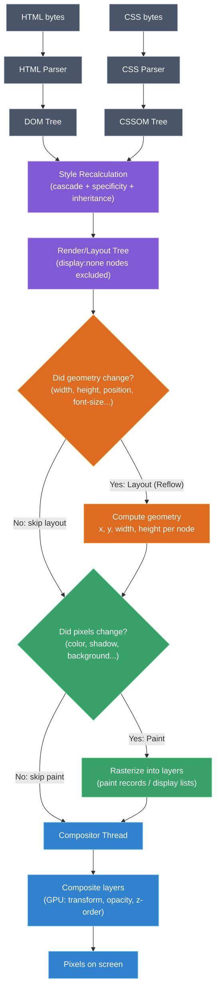
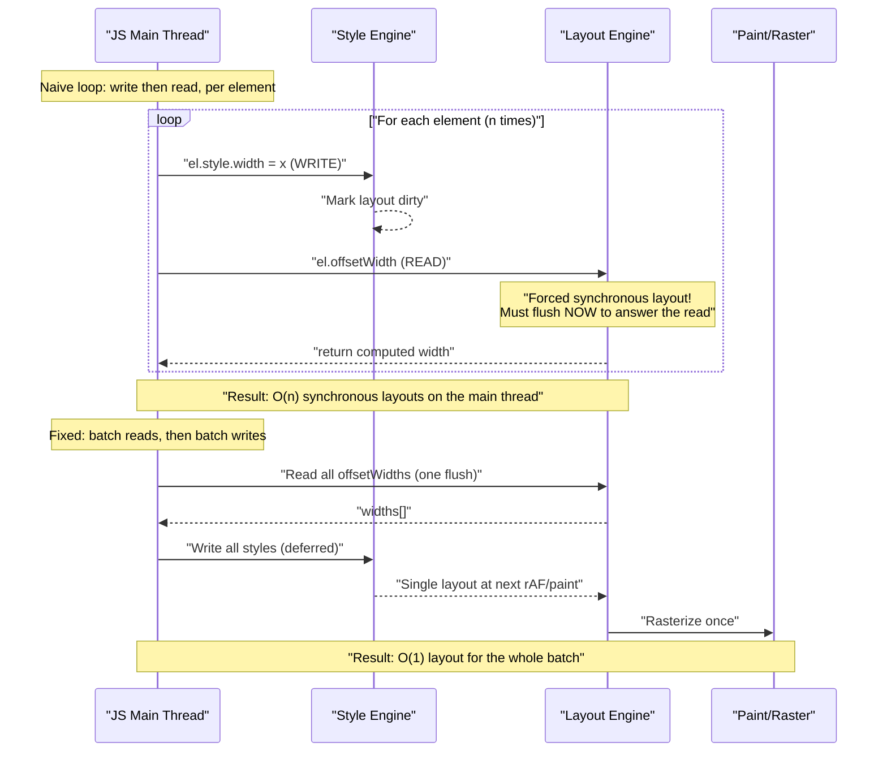

# Browser rendering pipeline (parse → style → layout → paint → composite)

## 🎯 Executive Summary

Every visible pixel a user sees is the output of a pipeline: HTML/CSS get **parsed** into trees, the trees are combined and **style** is resolved per node, geometry is computed in **layout**, pixels are **painted** into layers, and layers are **composited** onto the screen by the GPU. This isn't trivia — it's the causal model behind every performance number a Lead is expected to own: why a `box-shadow` animation drops frames, why `transform` doesn't, why `innerHTML` writes in a loop are catastrophic, why CLS happens, and why `will-change` is a scalpel, not a spray can.

At Staff/Lead level, the interview signal isn't "can you name the five stages" — any mid-level candidate can do that. The signal is: **can you reason backwards from a stage to the CSS/JS property that triggers it, and forwards from a property to its stage, fast enough to architect around it.** This shows up as "why is this animation janky," "how would you build a virtualized list that doesn't thrash layout," "design a component library API that makes layout thrashing hard to write by accident," and "how do you explain this regression to a team that doesn't know the rendering pipeline." A Lead is expected to turn this knowledge into team-wide guardrails (lint rules, `contain`, CSS containment, code review heuristics) — not just fix one bug.

## 🧠 Core Technical Deep Dive

### The five (really six) stages

1. **Parse** — HTML is tokenized and parsed into the **DOM tree**. CSS (inline, `<style>`, external) is parsed into the **CSSOM tree**. These happen concurrently where possible, but a `<script>` tag without `async`/`defer` blocks HTML parsing (the parser must run it in case it does `document.write`), and CSS blocks JS execution (because JS might query computed style, so CSSOM must be complete first). This is *why* render-blocking CSS in `<head>` and synchronous `<script>` tags are the two classic "first paint" killers.

2. **Style (Recalculate Style)** — DOM + CSSOM → **Render Tree** (Chromium calls it the "layout tree"). This is where the browser resolves the *computed style* for every node: cascading, inheritance, specificity, and the box's `display` value are all resolved here. Nodes with `display: none` are excluded entirely (they don't get layout or paint boxes at all — `visibility: hidden` nodes *do* get a box, just an invisible one; this distinction is a favorite trick question).

3. **Layout (Reflow)** — For every node in the render tree, the browser computes the exact **geometry**: x/y position and width/height, in device pixels, relative to the viewport. This is inherently a **tree-walk with dependencies** — a parent's width can depend on a child's intrinsic width (shrink-to-fit), and a child's width can depend on the parent's (percentage widths), so the layout algorithm is not a single pass; it's closer to a constraint solver bounded by the CSS box model rules. This is the single most expensive stage per node touched, because geometry changes **propagate**: resizing one flex item can shift every sibling and, in the worst case (a change near the document root, or one that alters scroll dimensions), the entire tree must be re-laid-out.

4. **Paint (Rasterize)** — Convert the geometry + styles into actual pixels: draw the background, borders, text, shadows, and box content into **layers** (bitmaps), a process called *rasterization*. Modern engines paint into multiple layers (see Compositing below) rather than a single canvas, and paint itself is broken into **paint records** (a display list of drawing commands) that can be replayed cheaply if nothing invalidates them.

5. **Composite** — Layers are combined into the final image by the **compositor thread**, using the GPU, honoring `z-index` stacking order, transforms, opacity, and clipping. This is the *only* stage that can skip Style, Layout, and Paint entirely if the change is expressible purely as a layer transform (translate/scale/rotate) or opacity change — this is why `transform` and `opacity` are the two CSS properties every performance-conscious team defaults to for animation.

6. **(Implicit) Layerization** — Technically part of the paint/composite boundary, but worth calling out separately: the browser decides which elements get **promoted to their own compositor layer** based on heuristics — `will-change`, `transform: translateZ(0)`, `<video>`/`<canvas>`, elements with active CSS animations on transform/opacity, and elements that need to overlap in a way that requires independent compositing (e.g. `position: fixed` scrolled content, elements with `z-index` stacking overlapping animated content). Each layer costs GPU memory (texture upload), so over-promoting ("layer explosion") is its own anti-pattern — Lead candidates who only know "transform is cheap" without knowing the layer-memory cost are giving a Senior answer, not a Lead one.

### The critical distinction: Layout vs Paint vs Composite-only

This is the single most important mental model to internalize, because it maps directly onto **which CSS properties cost what**:

| Change triggers | Example properties | Cost |
|---|---|---|
| **Layout + Paint + Composite** (the full pipeline, most expensive) | `width`, `height`, `top`/`left` (without transform), `font-size`, `padding`, adding/removing DOM nodes, `display` | Full tree geometry recompute → repaint affected layers → recomposite |
| **Paint + Composite only** (skips layout) | `background-color`, `color`, `box-shadow`, `border-radius`, `visibility` | Geometry unchanged, but pixels must be redrawn |
| **Composite only** (cheapest, GPU-only) | `transform`, `opacity` (when the element is already layer-promoted) | No CPU work at all past the first frame — GPU just re-blends existing textures |

This is *the* table a Staff engineer should be able to draw from memory and use to review a PR's animation code in seconds.

### Layout thrashing (forced synchronous layout)

The browser is lazy: it batches style/geometry mutations and defers layout until it's actually needed (next frame, or when JS reads a geometry-dependent property). **Reading** any of `offsetTop`, `offsetLeft`, `offsetWidth`, `offsetHeight`, `clientWidth`, `clientHeight`, `getComputedStyle()`, `getBoundingClientRect()`, or scroll/computed values **forces the browser to flush any pending layout synchronously** — right there, on the main thread, mid-script — because the browser can't answer "what is this element's width" without doing the work.

The classic performance bug is interleaving writes and reads in a loop:

```javascript
// Layout thrashing: forces N synchronous layouts
for (const el of elements) {
  el.style.width = el.offsetWidth + 10 + "px"; // WRITE then READ, every iteration
}
```

Each iteration writes a style (invalidating layout), then immediately reads a geometry property (forcing the browser to recompute layout *right now* to answer the read) — turning an O(1)-per-frame operation into O(n) synchronous layouts, each potentially touching the whole tree.

```javascript
// Fixed: batch all reads, then all writes
const widths = elements.map(el => el.offsetWidth); // all reads first (one layout flush)
elements.forEach((el, i) => { el.style.width = widths[i] + 10 + "px"; }); // all writes (deferred)
```

This is precisely the problem libraries like FastDOM (and React's batched DOM updates, and the browser's own rAF-timed style/layout step) exist to solve architecturally rather than relying on every engineer remembering to batch manually.

### CSS Containment and `content-visibility`

Modern browsers expose `contain: layout style paint` and `content-visibility: auto` specifically so a Lead can scope invalidation. `contain: layout` tells the engine "this subtree's layout doesn't affect anything outside it," letting the engine skip re-laying-out ancestors/siblings when something inside changes — this is how virtualization-adjacent techniques and componentized design systems keep large pages fast without JS-level virtualization for every list. `content-visibility: auto` goes further: off-screen subtrees skip layout, paint, *and* rendering hit-testing entirely until they're near the viewport, which is why it can turn a 10,000-node page from unusable to instant without a virtualized-list rewrite — this is a very strong "senior-vs-lead" signal, because it trades a one-line CSS change for what used to require a bespoke virtualization component.

## 📊 Visual Architecture & Logic

### Diagram 1 — The pipeline as a flow, with cost annotations



### Diagram 2 — Layout thrashing: architectural interaction between JS and the render pipeline



## 🏢 Interview Context & FAANG Signals

This topic surfaces in three loop stages: **system design** ("design a data grid / infinite feed / animation-heavy dashboard"), **coding/debugging rounds** ("here's a laggy component, fix it"), and **behavioral/technical leadership rounds** ("tell me about a performance regression you led the fix for"). Interviewers at this level are not testing recall of the five stages — they're testing whether you **reason from symptom to stage to root cause to systemic fix**.

Concrete Lead signals interviewers listen for:
- Immediately maps a reported symptom ("scrolling is janky," "typing lags," "layout shifts on load") to *which pipeline stage* is the likely culprit, without being told.
- Distinguishes "this animation is slow" (probably layout/paint being triggered) from "this animation is slow *and* memory is high" (probably layer explosion from over-using `will-change`).
- Proposes a **systemic** fix — a lint rule, a `contain` policy, a component API that makes the fast path the default — rather than only patching the one instance found.
- Knows the cost isn't just "layout is slow" but *when* it runs — main thread, blocking input — and connects it to INP/responsiveness metrics, not just FPS.
- Can explain trade-offs of `content-visibility`, virtualization, and CSS containment against each other, including their failure modes (e.g. `content-visibility: auto` breaking `Ctrl+F` find-in-page or `:focus` on off-screen elements unless `contain-intrinsic-size` is set correctly).

## ⚔️ Lead Level vs Senior Level

**Senior response** to "why is this list janky when I scroll":
> "Each row has a box-shadow and we're changing `top` in JS on scroll, which forces layout every frame. I'd switch to `transform: translateY()` instead of `top`, and move the box-shadow to a pseudo-element or a static layer so it's not repainted every frame."

This is correct and would pass most mid-level bars — it correctly identifies layout vs composite-only properties.

**Lead/Staff response** to the same question:
> "Same root cause — `top` forces layout, `box-shadow` forces paint, both on the main thread during scroll, which is why input (touch/wheel) feels laggy too, not just visually janky. I'd fix the immediate instance with `transform`, but the deeper problem is this component doesn't have a performance contract: nothing stops the next engineer from reintroducing a layout-triggering property in a hot animation path. I'd add `contain: layout style` on the row boundary so a future regression inside a row can't cascade to sibling layout, add a lint rule (or a Lighthouse CI budget) that flags animating non-composite properties, and if this is a long list, question whether we need DOM virtualization or `content-visibility: auto` at all — because at n>500 rows, we're paying render-tree costs the user's viewport doesn't need. I'd also want to know if this regressed recently — if it did, I want a bisect and a postmortem, not just a fix, because it means our review process let a layout-triggering property into a hot path."

The differentiator: Lead answers **treat the bug as a symptom of a missing system-level guardrail**, connect it to a measurable business/UX metric (INP, not just "smoothness"), and default to asking whether the *architecture* (virtualization, containment) is right before micro-optimizing the property.

## ⚠️ Common Pitfalls & Anti-Patterns

> ### ✕ Animating `top`/`left`/`width`/`height` instead of `transform`
> **Why it's wrong:** These properties force Layout on every animation frame — for a 60fps animation, that's a full geometry recompute 60 times a second, often for the entire affected subtree, not just the animated element. On low-end devices this alone can blow the 16.6ms frame budget before paint or composite even start.
> **✓ Correct Lead Approach:** Animate `transform: translate()/scale()/rotate()` and `opacity`. Both can be handled by the compositor thread alone once the element is layer-promoted, meaning the animation keeps running smoothly even if the main thread is busy with JS.

> ### ✕ Layout thrashing via interleaved reads/writes in loops
> **Why it's wrong:** Reading `offsetWidth`/`getBoundingClientRect()` etc. after a style write forces a synchronous layout flush. In a loop, this turns one deferred layout into N forced synchronous layouts, often the dominant cost in "why is this slow" profiles.
> **✓ Correct Lead Approach:** Batch all DOM reads before any DOM writes (manually, or via a scheduling abstraction like FastDOM). In frameworks, trust the framework's batching (React's commit phase) rather than reaching into the DOM directly inside render logic.

> ### ✕ Indiscriminate `will-change` ("just add it everywhere, it's faster")
> **Why it's wrong:** `will-change` (and `transform: translateZ(0)` hacks) force the browser to promote the element to its own compositor layer *permanently*, which allocates GPU texture memory. Overusing it on many elements ("layer explosion") can increase memory pressure and paradoxically *slow down* compositing, especially on memory-constrained mobile devices.
> **✓ Correct Lead Approach:** Apply `will-change` narrowly and temporarily — right before an animation starts, removed after it ends — or rely on the browser's own heuristics for elements with active CSS animations, which already get layer promotion automatically without the memory footprint being permanent.

> ### ✕ Treating `content-visibility: auto` as a drop-in performance switch with no side effects
> **Why it's wrong:** Off-screen `content-visibility: auto` subtrees skip layout/paint, but that also means `Ctrl+F` find-in-page, `element.focus()`, and accessibility tooling can silently fail to find/measure content that hasn't been rendered yet, unless `contain-intrinsic-size` is set to reserve space (otherwise you also get layout shift when the content pops in).
> **✓ Correct Lead Approach:** Pair `content-visibility: auto` with an explicit `contain-intrinsic-size` estimate, and test find-in-page/accessibility flows before shipping — treat it as a real architectural decision, not a free lunch.

> ### ✕ Bulk DOM mutation without batching (`innerHTML +=`, repeated `appendChild` in a loop with reads in between)
> **Why it's wrong:** Each mutation can invalidate style/layout, and `innerHTML +=` additionally re-parses the *entire* existing subtree, not just the new content, because it serializes to a string and re-parses everything.
> **✓ Correct Lead Approach:** Build a `DocumentFragment` (or use `insertAdjacentHTML`) and perform a single DOM mutation, so the browser does one style/layout/paint pass instead of one per mutation.

> ### ✕ Ignoring the difference between `visibility: hidden` and `display: none` in performance-sensitive code
> **Why it's wrong:** `display: none` removes the node from the render tree entirely (no layout, no paint box) — cheap to keep hidden, expensive to reveal (full layout the first time). `visibility: hidden` still gets a layout box (occupies space, gets geometry computed) but skips paint — different cost profile for toggling frequently (e.g., tooltips, hover states).
> **✓ Correct Lead Approach:** For frequently toggled UI (tooltips, dropdown menus), prefer `visibility` or `opacity` (layout stays stable, cheaper to toggle) over `display`, unless removing layout space is the actual intent.

## 🛠️ Practice Scenarios (5-10 Scenarios)

<details>
<summary>Scenario 1: The janky drag-and-drop</summary>

**Problem Statement:** Users report that dragging cards in a kanban board feels laggy on mid-range Android devices, though it's smooth on the engineer's MacBook. The drag handler updates `el.style.left` and `el.style.top` on every `pointermove` event.

**Staff-Level Solution:** The dev-machine/device gap is the first clue — high-end desktops can often absorb forced layout costs that phones can't, masking the bug in local testing. `left`/`top` force Layout on every pointermove, and pointermove can fire dozens of times per frame budget, so we're doing many synchronous layouts per frame. Fix: track drag offset in JS, apply via `transform: translate3d(x, y, 0)`, and promote the dragged element with `will-change: transform` only while dragging (removed on drag end to avoid permanent layer memory cost). Systemically: add a device-lab or throttled-CPU profile to CI performance testing, since desktop-only testing is what let this ship.
</details>

<details>
<summary>Scenario 2: CLS spike after a "harmless" copy change</summary>

**Problem Statement:** A copywriter changes a hero heading's text length. Suddenly, CLS on the page jumps from 0.02 to 0.18, and the team can't figure out why — no CSS or layout code changed.

**Staff-Level Solution:** The longer text wraps to an extra line, changing the heading's box height *after* async content (e.g., a lazy-loaded image or ad slot) below it has already been laid out — pushing that content down and firing a layout shift the moment fonts/images settle. This reveals a systemic gap: nothing constrains heading height, and below-the-fold elements aren't reserving space. Fix: set `min-height`/`aspect-ratio` on flexible-height regions near async content, or reserve space with `contain-intrinsic-size` if using `content-visibility`. Long-term, recommend a CLS budget check in the CMS/preview pipeline so copy changes get flagged before they ship, not after — this is a process fix, not just a CSS fix.
</details>

<details>
<summary>Scenario 3: The virtualized list that still lags</summary>

**Problem Statement:** A team already virtualizes a 5,000-row table (only ~30 DOM rows exist at once), but scrolling still stutters. Profiling shows most main-thread time in "Recalculate Style" and "Layout," not in JS.

**Staff-Level Solution:** Virtualization reduces DOM node *count*, but if each row recalculates style/layout because of complex selectors, deeply nested markup, or a shared ancestor whose layout isn't contained, the browser may still be doing more work than expected per scroll frame — e.g., a `box-shadow` or gradient border per row forcing paint of large areas, or the table container lacking `contain: layout style`, which lets each row's layout change potentially affect siblings/ancestors instead of being scoped. Fix: add `contain: layout style paint` on row boundaries, simplify per-row selectors, verify rows are composited independently (DevTools layers panel) rather than repainted as one giant surface. This is the "senior stops at virtualization, Lead knows virtualization doesn't remove the containment problem" distinction.
</details>

<details>
<summary>Scenario 4: `getBoundingClientRect()` inside a `MutationObserver` callback causing a freeze</summary>

**Problem Statement:** A design system's tooltip component measures its own position via `getBoundingClientRect()` inside a `MutationObserver` callback that fires on every DOM change anywhere in the app (observing `document.body` with `subtree: true`). On a busy page, the app periodically freezes for hundreds of milliseconds.

**Staff-Level Solution:** `MutationObserver` callbacks run as microtasks — batched per turn, but still on the main thread, before the next paint. Calling `getBoundingClientRect()` inside that callback forces a synchronous layout flush *for every batch of mutations anywhere in the app*, not just the tooltip's own subtree — because the observer is scoped too broadly (`document.body`, `subtree: true`), it's doing this on unrelated app activity. Fix: scope the observer narrowly to the tooltip's actual target and relevant `attributeFilter`, and defer the geometry read to the next `requestAnimationFrame` instead of doing it synchronously inside the microtask — decoupling "detect a DOM change" from "measure geometry," so measurement happens once per rendered frame instead of once per mutation batch.
</details>

<details>
<summary>Scenario 5: A CSS-only carousel that's surprisingly expensive</summary>

**Problem Statement:** A "lightweight, JS-free" CSS `scroll-snap` carousel with `box-shadow` and rounded corners on each slide is reported as janky during swipe on mobile, despite having zero JavaScript in the scroll path.

**Staff-Level Solution:** "No JS" doesn't mean "no pipeline cost." Scrolling still triggers paint for any slide entering/leaving the viewport if its visual effects (shadow, radius, blur) aren't isolated to their own composited layer — the browser may be repainting large rounded/shadowed areas every scroll frame. Fix: explicitly promote each slide to its own layer during the scroll gesture (`will-change: transform` toggled via a scroll-linked class, or use `overflow: hidden` containment plus `transform: translateZ(0)` sparingly), and verify with the DevTools "Paint flashing" overlay that scroll no longer repaints the whole carousel. This scenario tests whether the candidate assumes "no JS = no rendering cost," which is a common but incorrect Senior-level assumption.
</details>

<details>
<summary>Scenario 6: Login form input lag traced to a sibling component</summary>

**Problem Statement:** Typing in a password field feels laggy. The password field itself has no expensive logic. Profiling shows "Recalculate Style" spiking on every keystroke, scoped to an unrelated sidebar component.

**Staff-Level Solution:** Likely a shared, overly broad CSS selector or a CSS custom property (`--*` variable) updated on a common ancestor on every keystroke (e.g., a "form is dirty" indicator toggling a class on `<body>` or `<form>`), which invalidates style for the *entire* subtree under that ancestor, including the unrelated sidebar, because CSS custom properties inherit and force recomputation of everything depending on them. Fix: scope the state change to the smallest possible DOM node (the input itself or its direct wrapper), avoid mutating shared ancestors' classes/custom properties on high-frequency events, and use `contain: style` on the sidebar as a defensive boundary. This tests whether a candidate understands that Style Recalculation cost is about *cascade scope*, not just "how much CSS is there."
</details>

<details>
<summary>Scenario 7: Explaining a performance regression to a non-technical stakeholder</summary>

**Problem Statement:** After a redesign, a PM asks why the new page "feels slower" even though the Lighthouse score barely changed. You investigate and find the new design introduces frequent layout-triggering resize behavior from a responsive grid using JS-computed `width`/`height` instead of CSS `grid`/`flex`.

**Staff-Level Solution:** Lighthouse's lab score often doesn't capture responsiveness/jank the way real interaction does (Lighthouse's synthetic scroll/interaction is limited); this is a good moment to bring up field data (INP) vs lab data. Explain to the PM in outcome terms: "the page loads at the same speed, but scrolling and resizing feel sluggish because we're recalculating positions in JavaScript on every frame instead of letting the browser's native layout engine — which is more optimized for this — handle it." Propose replacing the JS-computed grid with native CSS Grid/Flexbox (offloading the geometry math to the browser's C++ layout engine instead of JS), and set up field monitoring (web-vitals INP) as the metric that would have caught this before Lighthouse-based CI gave a false pass. This scenario tests communication — translating a Layout-stage root cause into stakeholder language without dumbing down the actual fix.
</details>

<details>
<summary>Scenario 8: Third-party widget causing main-thread contention during checkout</summary>

**Problem Statement:** An embedded third-party chat widget causes the checkout page's "Place Order" button to feel unresponsive for ~300ms after page load, even though the button itself has a trivial click handler.

**Staff-Level Solution:** The third-party script likely runs a burst of DOM mutations/style changes on load (rendering its own widget), each contributing to Style/Layout/Paint work queued on the main thread; if the user clicks during that window, their input is queued behind that pipeline work, which is exactly what INP measures (processing delay). Fix: sandbox the third party in an `<iframe>` (isolates its style/layout recalculation from the host document's render tree entirely — iframes are separate rendering contexts) and/or delay its load until after the checkout button's hydration/interactivity is established. Escalate this as a policy issue: any third-party script embedded directly in a conversion-critical page should require an iframe or lazy-load justification in review — a Lead-level fix is procedural, not just technical.
</details>
