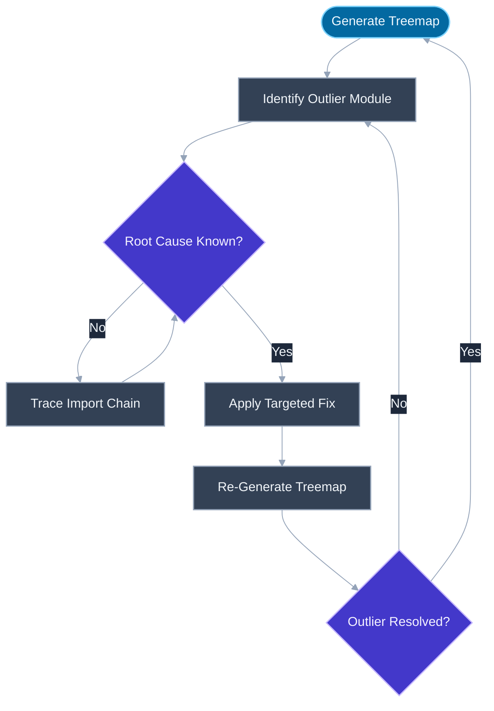
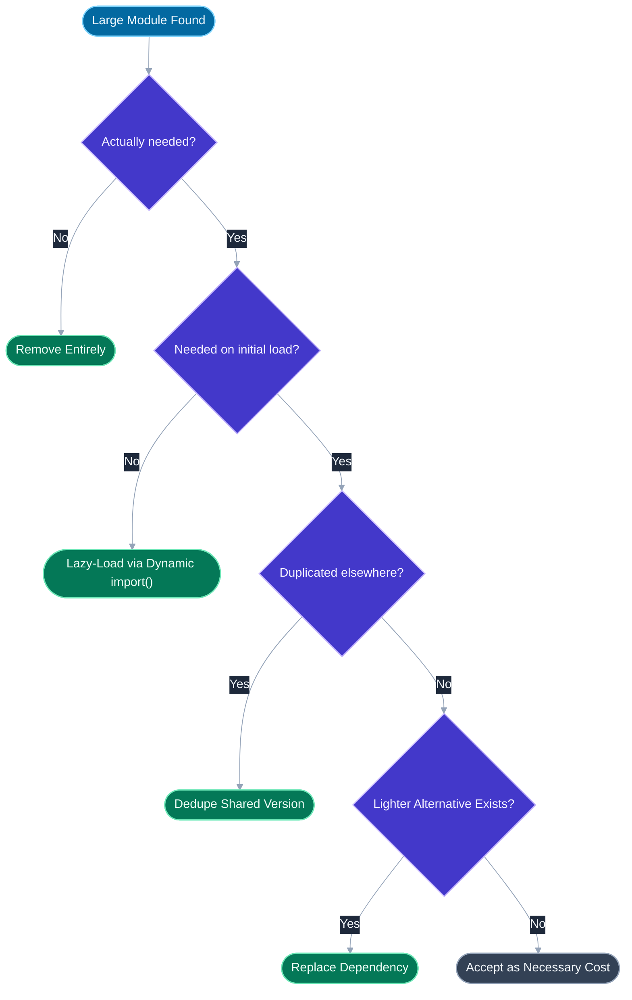

# Bundle Analysis: webpack-bundle-analyzer, Vite rollup-visualizer

## 🎯 Executive Summary

Bundle analysis is the practice of visualizing exactly what a build actually ships — which modules, at what size, nested inside which chunks — so that performance work starts from evidence instead of guesswork. The core tool is a treemap: a rectangle per module, sized by its contribution to the bundle, nested to reflect the dependency/chunk hierarchy. It answers the question every other performance technique assumes you've already answered: what, specifically, is in this bundle?

This is a must-know at Lead/Staff level because performance regressions in JavaScript payload are almost never intentional — nobody decides to ship a 300KB date library for one formatting call. They accumulate silently through transitive dependencies, duplicated package versions in a monorepo, a barrel import that pulled in more than intended, or a code-splitting boundary that quietly stopped working after a refactor. A Lead is expected to catch these not by reading every PR's `package.json` diff, but by treating bundle analysis as a routine, sometimes automated, diagnostic step — and by knowing what a given treemap shape is telling them.

It surfaces in interviews as both a tooling-knowledge check ("how would you find out why this bundle is 1MB?") and a broader signal about whether a candidate closes the loop — proposing a fix without re-analyzing to confirm it worked is exactly the gap that separates a plausible-sounding answer from a demonstrated one.

---

## 📖 What Is It? (Plain-English Definition)

**In plain terms:** bundle analysis means generating a visual map of everything inside your shipped JavaScript, sized by how many bytes each piece actually contributes, so you can see at a glance what's taking up space.

Think of it like getting an itemized receipt instead of just a total. Knowing your grocery bill was $140 tells you nothing about whether that's reasonable; seeing that $60 of it was a single specialty item tells you exactly where to look if you want to spend less. A bundle's total size is the final number on the receipt — a treemap is the itemization that makes the number actionable.

Without this itemization, "reduce bundle size" becomes a guessing game — removing a dependency that felt heavy but was actually 4KB, while a genuinely 200KB one sits untouched because nobody looked. The tools below generate that itemization for the two dominant build systems in the frontend ecosystem.

---

## 🧠 Core Technical Deep Dive

### Reading a treemap correctly

A treemap represents each module as a rectangle: **area encodes size**, and rectangles are **nested** to reflect which chunk or parent module contains them. A large rectangle nested deep inside a chunk you didn't expect it in is usually the single most useful signal the whole visualization provides.

Every serious treemap tool reports (at least) two different size numbers per module, and conflating them is a common mistake:

| Metric | What it measures | Why it matters |
|---|---|---|
| **Parsed size** | Size of the module's source before compression, roughly after minification | Correlates with parse/compile time the JS engine spends on the file |
| **Gzip (or Brotli) size** | Size actually transferred over the network after compression | Correlates with download time — the number users' network conditions actually feel |

A module can look enormous in parsed size but compress extremely well (highly repetitive generated code, like some CSS-in-JS output) or the reverse (already-compact binary-like data that barely compresses further). Reporting only one number, or not knowing which one a tool is showing by default, leads to wrong prioritization — see [Compression](/topic-detail.html?id=compression) for why compressed size is what actually reaches the browser.

> **Key takeaway:** always check both numbers before deciding a module is or isn't worth optimizing — a "huge" parsed-size module that gzips to almost nothing is a lower priority than a merely large one that barely compresses at all.

### webpack-bundle-analyzer

`webpack-bundle-analyzer` consumes a webpack build's `stats.json` output and renders it as an interactive, zoomable treemap in the browser. Typical setup:

```javascript
// webpack.config.js
const { BundleAnalyzerPlugin } = require('webpack-bundle-analyzer');

module.exports = {
  plugins: [
    new BundleAnalyzerPlugin({
      analyzerMode: 'static',
      openAnalyzer: false,
      reportFilename: 'bundle-report.html',
    }),
  ],
};
```

What it reliably reveals, beyond "this module is big":

- **Duplicate package versions** — the same library appearing as multiple rectangles under different `node_modules/.pnpm/` or nested `node_modules` paths, almost always a dependency-hoisting or monorepo version-mismatch issue where two packages depend on incompatible semver ranges of a shared dependency.
- **Unexpectedly large transitive dependencies** — a small direct dependency that itself depends on something heavy, invisible from `package.json` alone.
- **Whether code-splitting is actually working** — a healthy split shows several reasonably-sized, purpose-coherent chunks; a broken or misconfigured setup shows one dominant chunk with everything in it despite `React.lazy()` calls existing in the source (see [Code Splitting](/topic-detail.html?id=code-splitting)).

### Vite's rollup-plugin-visualizer

Vite uses Rollup for production builds, so the equivalent tool targets Rollup's output rather than webpack's stats format:

```javascript
// vite.config.js
import { visualizer } from 'rollup-plugin-visualizer';

export default {
  plugins: [
    visualizer({
      open: true,
      gzipSize: true,
      brotliSize: true,
    }),
  ],
};
```

Conceptually identical output to webpack-bundle-analyzer — a treemap with the same reading strategy — but generated from Rollup's module graph. The `gzipSize`/`brotliSize` options are worth enabling explicitly, since the default view can otherwise show only raw/parsed size.

### source-map-explorer: bundler-agnostic

`source-map-explorer` takes a different approach — it works on any already-built JS bundle plus its `.map` sourcemap file, regardless of which bundler produced it, by using the sourcemap to attribute bytes in the final output back to original source files:

```bash
npx source-map-explorer dist/main.js dist/main.js.map
```

This makes it the right tool when you don't control the build config directly (a third-party build pipeline, a legacy Grunt/Gulp setup, or simply wanting a second opinion independent of a specific bundler plugin), at the cost of requiring accurate sourcemaps to be generated in the first place.

### The iterative analyze → fix → re-verify workflow

Bundle analysis is not a one-time audit — it's a loop that should run every time a suspicious change lands:

1. **Analyze** — generate the treemap for the current build.
2. **Find an outlier** — a rectangle disproportionate to what you'd expect for that module's actual necessity.
3. **Decide a fix**, matched to *why* it's large:
   - Not needed at all → remove the dependency.
   - Needed, but not on initial load → lazy-load it behind a dynamic `import()`.
   - Needed, but a lighter alternative exists → replace it (e.g., a 100-language date library replaced with a purpose-built formatter for the two locales actually supported).
   - Present multiple times → dedupe the version mismatch causing duplication.
4. **Re-analyze** to confirm the fix actually reduced the shipped bytes — not just that the dependency "should" be smaller now.
5. **Repeat** — the next outlier is now visible once the previous one no longer dominates the treemap's scale.

> **Key takeaway:** step 4 is the one engineers skip under time pressure, and it's the one that catches a fix that didn't work as intended — a lazy-loaded module that got hoisted back into the main chunk by a shared-dependency rule, for instance, looks fixed in the source diff but isn't in the actual output.

### CI enforcement: turning detection into a gate

Manual analysis catches bloat only when someone remembers to look. Tools like **size-limit** and **bundlesize** turn bundle-size regression detection into an automated CI gate that fails a build outright if a named bundle exceeds a configured byte threshold:

```json
{
  "size-limit": [
    {
      "path": "dist/main.*.js",
      "limit": "150 KB"
    }
  ]
}
```

This converts bloat detection from "someone happens to notice a large diff in code review" — which scales poorly as team size grows and review attention is finite — into a hard, automatic gate that blocks the PR regardless of who's reviewing. Pairing per-route or per-chunk budgets (not just one global limit) catches regressions localized to a specific part of the app that a single aggregate number would dilute.

> **Key takeaway:** a bundle analyzer answers "what's in here right now"; a CI size budget answers "did this specific change make it worse" — a mature setup needs both, not one instead of the other.

---

## 📊 Visual Architecture & Logic

### Diagram 1 — The Analyze → Diagnose → Fix → Re-Verify Loop



### Diagram 2 — Given a Large Module, What's the Right Fix?



---

## 🏢 Interview Context & FAANG Signals

| Interview Stage | Format |
|---|---|
| **Performance Round** | "This bundle is 1MB — how would you figure out what's in it?" — tests whether tooling knowledge is concrete, not just "I'd optimize the code" |
| **Debugging Round** | Given a treemap screenshot with an obvious duplicated-package pattern, diagnose the cause |
| **System Design** | "Design the CI pipeline for a large frontend monorepo" — bundle-size budgets as part of the release gate |
| **Behavioral/Process Round** | "Tell me about a time you found and fixed a bundle-size regression" — tests whether the candidate closes the loop with re-verification |

**Lead signals interviewers listen for:**
1. Do you distinguish parsed size from compressed (gzip/Brotli) size, and know which one drives actual user-facing download time?
2. Can you name the specific tool for the build system in question (webpack-bundle-analyzer vs. rollup-plugin-visualizer vs. source-map-explorer) rather than a generic "I'd use a bundle analyzer"?
3. Do you diagnose *why* a module is large — duplicate version, unnecessary eager load, missing tree shaking — before proposing a fix, rather than jumping straight to "remove it"?
4. Do you close the loop by re-analyzing after a fix, rather than assuming a change worked because it should have?
5. Do you talk about CI-enforced size budgets as a way to prevent regressions structurally, not just fix them reactively when noticed?

---

## ⚔️ Lead Level vs Senior Level

**Question:** "Our production bundle grew by 150KB after last sprint and nobody flagged it in review. How do you approach this?"

> **Senior Response:**
> "I'd open the bundle analyzer, look for anything unusually big, and probably remove or lazy-load whatever stands out."

> **Staff/Lead Response:**
> "First I'd generate a treemap for both the current build and the commit before the growth, so I'm diffing two concrete snapshots instead of eyeballing one report and guessing what changed — that immediately narrows it to specific modules rather than the whole bundle.
>
> Once I've found the added weight, I'd figure out *why* it's there before deciding the fix — is it a genuinely new dependency, a duplicated version of an existing one caused by a mismatched semver range, or a barrel import that pulled in more than intended? Each of those has a different correct fix, and guessing wrong wastes a cycle.
>
> After fixing it, I'd re-run the analyzer to confirm the bytes are actually gone in the output, not just removed from the source in a way I expect to work. And since this regression went unnoticed for a full sprint, the process gap is the bigger problem than the 150KB itself — I'd add a CI size-budget check on the affected bundle so the next regression fails the build automatically instead of relying on someone noticing in review."

What separates them: the Senior response treats it as a one-off cleanup task; the Lead response diffs against a baseline to localize the cause precisely, matches the fix to the specific root cause, verifies the fix in the actual output, and treats the missed detection itself as a process gap worth closing.

---

## ⚠️ Common Pitfalls & Anti-Patterns

> ### ✕ Optimizing Based on Parsed Size Alone
> **Why it's wrong:** A module can look large in parsed/minified size but compress extremely well, making it a low-priority target, while a smaller-looking but poorly-compressing module costs more in actual transferred bytes. Prioritizing by the wrong number wastes effort on the wrong target.
> **✓ Correct Lead Approach:** Always check gzip or Brotli size (enable it explicitly in the analyzer config if it isn't the default view) before deciding a module is worth the engineering effort to address.

---

> ### ✕ Treating a Single Analysis as a One-Time Audit
> **Why it's wrong:** Bundle composition drifts continuously as dependencies get bumped and new imports get added by different engineers who each see only their own change in isolation. An analysis done once at project setup tells you nothing about the bundle's current state months later.
> **✓ Correct Lead Approach:** Re-run analysis on a regular cadence or after any dependency/import-structure change, and back it with an automated CI size-budget check so drift can't go unnoticed indefinitely.

---

> ### ✕ Applying a Fix Without Re-Verifying the Output
> **Why it's wrong:** A fix that looks correct in the source diff — lazy-loading a component, removing an import — doesn't guarantee the bytes actually left the shipped bundle; bundler chunking rules, shared-dependency extraction, or a missed second import site can silently undo the intended effect.
> **✓ Correct Lead Approach:** Re-generate the treemap after every fix and confirm the specific module's contribution actually dropped, before considering the issue closed.

---

> ### ✕ Ignoring Duplicate Package Versions as "Just How Monorepos Are"
> **Why it's wrong:** Multiple copies of the same library at different versions, visible as repeated rectangles in a treemap, usually means a real dependency-resolution problem (mismatched semver ranges, missing hoisting configuration) — not an unavoidable cost of using a monorepo — and it multiplies bundle size for every duplicated package.
> **✓ Correct Lead Approach:** Investigate the version mismatch causing duplication and resolve it via a shared dependency version, a resolutions/overrides field, or workspace hoisting configuration, rather than accepting duplication as inherent.

---

> ### ✕ Setting One Global Bundle-Size Budget for the Whole App
> **Why it's wrong:** A single aggregate size limit dilutes localized regressions — a 40KB increase in a rarely-used admin route chunk can hide comfortably under a generous total budget while still meaningfully hurting that route's own users.
> **✓ Correct Lead Approach:** Set per-route or per-chunk size budgets where practical, so a regression is caught at the granularity it actually occurs, not averaged away by unrelated chunks.

---

## 🛠️ Practice Scenarios

### Scenario 1: The Mystery 200KB

**Problem:**
```javascript
// package.json (relevant deps)
{
  "dependencies": {
    "date-fns": "^2.30.0",
    "moment": "^2.29.0"
  }
}

// utils/formatDate.js
import { format } from 'date-fns';
export const formatDate = (d) => format(d, 'PPP');

// legacy/reportGenerator.js
import moment from 'moment';
export const formatReportDate = (d) => moment(d).format('LL');
```
A bundle analyzer treemap shows both `date-fns` and `moment` present in the production bundle at full size, contributing roughly 200KB combined for what is ultimately just date formatting in two places. Diagnose and propose a fix.

<details>
<summary>Staff-Level Solution</summary>

Two separate date libraries are bundled simultaneously because two different files each independently chose one — `date-fns` in the newer utility, `moment` in an older, untouched module. Neither library is "duplicated" in the version-mismatch sense; this is worse in some respects, since it's two entirely different libraries doing overlapping work, both shipping to every user regardless of which code path they hit.

Fix: standardize on one library — `date-fns` is generally preferable going forward since it's tree-shakeable at the per-function level (each function is its own module, only the ones actually imported ship), while `moment` bundles as a single large, non-tree-shakeable object with all locale data included by default. Migrate `reportGenerator.js` off `moment` to the equivalent `date-fns` functions, remove the `moment` dependency entirely, then re-run the analyzer to confirm it's gone from the treemap rather than assuming the `package.json` removal was sufficient (a transitive dependency could still be pulling it in).

</details>

---

### Scenario 2: The Chunk That Didn't Split

**Problem:**
```javascript
// App.jsx
import { lazy, Suspense } from 'react';
const AdminDashboard = lazy(() => import('./AdminDashboard'));

function App() {
  return (
    <Suspense fallback={<Spinner />}>
      <AdminDashboard />
    </Suspense>
  );
}

// AdminDashboard.jsx
import { ChartLibrary } from 'heavy-chart-lib';
export { ChartLibrary as sharedChart };
export default function AdminDashboard() { /* ... */ }
```
The team expected `AdminDashboard` and its 300KB charting dependency to live in a separate chunk, only fetched when an admin navigates there. The bundle analyzer shows `heavy-chart-lib` inside the main entry chunk instead. Diagnose.

<details>
<summary>Staff-Level Solution</summary>

`AdminDashboard.jsx` re-exports `ChartLibrary` as `sharedChart` alongside its default export. If any other module in the app — reached from the main entry point without going through the lazy boundary — imports `sharedChart` from this file, the bundler must include that file (and everything it imports, including `heavy-chart-lib`) in whatever chunk contains that other importer, in addition to (or instead of, depending on the bundler's deduplication behavior) the lazily-loaded chunk. The lazy `import()` on `AdminDashboard` alone doesn't guarantee isolation if the same file is reachable through a second, non-lazy path.

Fix: search the codebase for any import of `sharedChart` from `AdminDashboard.jsx` outside the lazy boundary and remove or relocate it — a file intended to be split shouldn't also export something consumed eagerly elsewhere. Re-analyze to confirm `heavy-chart-lib` now appears only in the `AdminDashboard` chunk, not the main entry chunk.

</details>

---

### Scenario 3: Passing Review, Failing in Production

**Problem:**
```javascript
// A PR adds this import to a frequently-used shared component:
import { debounce, cloneDeep, groupBy } from 'utils-kit';
```
Code review approves it — it's three small utility function imports, seemingly trivial. Two weeks later, a bundle-size CI check (recently added) starts failing on unrelated PRs that happen to touch files near this one, and nobody can figure out why those PRs are implicated. Diagnose.

<details>
<summary>Staff-Level Solution</summary>

The regression was introduced by the `utils-kit` import, but it surfaced as CI failures on later, unrelated PRs simply because those PRs happened to be the ones that pushed the cumulative bundle size over the configured threshold — the actual cause is two weeks stale by the time anyone investigates. If `utils-kit` is a CommonJS package, or an ESM package without proper `sideEffects` configuration and a barrel-style entry point, the three named imports may have pulled in the entire utility library rather than just the three functions used, and it went unnoticed in review because "three utility functions" reads as obviously small regardless of the actual import mechanics.

Fix: generate a treemap and confirm whether `utils-kit` is present in full or just the three functions; if it's the whole library, either import from specific submodule paths if the package supports it, or replace it with a smaller, single-purpose alternative for the three functions actually needed. Going forward, treat CI bundle-size failures as needing a bisect against recent merges (or a bot that reports size delta directly on the PR that caused it) rather than the PR that happened to cross the threshold — the failing PR and the causing PR are frequently different.

</details>
