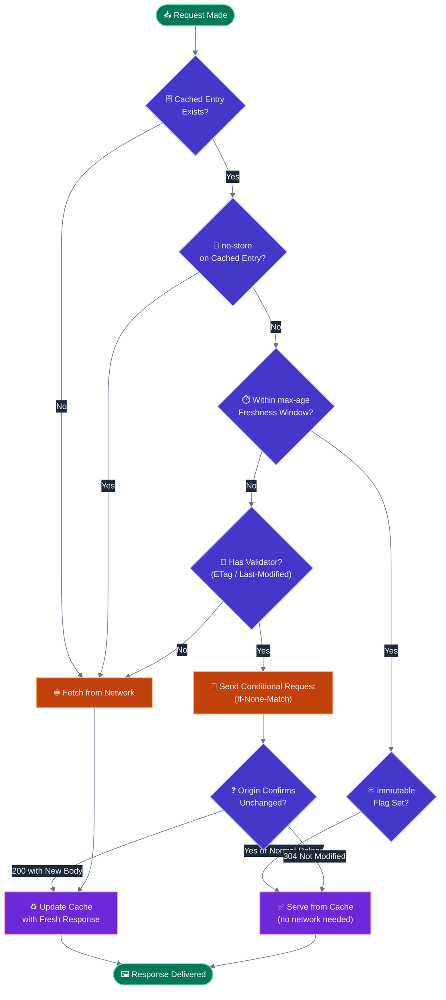
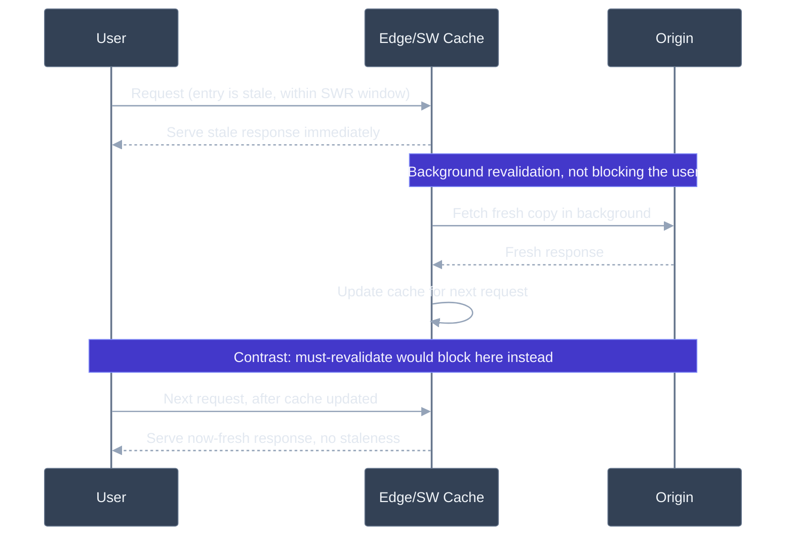

# Caching strategies: content hashing, cache-control headers, stale-while-revalidate

## 🎯 Executive Summary

Caching is the highest-leverage performance technique available — a cache hit is the only "optimization" that reduces a request's cost to effectively zero. But it's also one of the few areas where a single misconfigured header can silently serve stale content to every user for hours, or worse, leak one user's personalized data to another through a shared cache layer.

The core architectural pattern a Lead needs fluency in: content-hashed, immutable caching for static assets (cache forever, invalidate by changing the URL, not the content) paired with short-lived or revalidated caching for the HTML/API responses that reference them. Getting this pairing right is what makes frequent deploys safe; getting it wrong produces either stale-forever bugs or cache-defeating over-revalidation.

Why it's a must-know for Leads: caching decisions span multiple layers your team doesn't fully control end-to-end — browser HTTP cache, service worker cache, CDN edge, origin — and a Lead is expected to reason about invalidation propagation across all of them, not just set a `max-age` and move on. This is also one of the few performance topics with a genuine security dimension (caching authenticated responses at a shared layer), which is exactly the kind of cross-cutting concern interviewers probe for at Staff level.

---

## 🧠 Core Technical Deep Dive

### `Cache-Control` directives: the ones that get confused

| Directive | Meaning | Common misconception |
|---|---|---|
| `max-age=<seconds>` | Fresh for this long, no revalidation needed within window | — |
| `s-maxage=<seconds>` | Same as `max-age` but only for shared caches (CDN/proxy); overrides `max-age` for them | Teams forget it only applies to shared caches, not the browser |
| `no-cache` | **Can still be stored**, but must be revalidated with the origin before every use | The name strongly implies "don't cache" — it doesn't |
| `no-store` | Never persist the response anywhere, at any layer | Sometimes used interchangeably with `no-cache`, which is a materially different guarantee |
| `private` | Only the browser's own cache may store this; shared caches (CDN) must not | Critical for authenticated/personalized responses |
| `public` | Any cache, including shared/CDN caches, may store this | Dangerous default for anything personalized |
| `immutable` | This exact URL's content will never change; skip revalidation even on user-initiated reload | Only safe when the URL is content-hashed |
| `must-revalidate` | Once stale, must revalidate before use — no serving stale on revalidation failure | Different from `stale-while-revalidate`, which explicitly permits serving stale |

> **Key takeaway:** `no-cache` and `no-store` are the most consequential pair to get right — `no-cache` still stores the response (with mandatory revalidation), `no-store` doesn't store it at all. Confusing them either defeats a cache you wanted, or persists a response you explicitly didn't want retained.

### Content hashing: solving invalidation by avoiding it

The classic cache invalidation problem disappears for build-output assets because bundlers emit content-hashed filenames — `app.3f2a1c9.js` — where the hash is derived from the file's own contents. A code change produces a *different* filename, not a mutated version of the same URL.

This decouples cache lifetime from deploy frequency entirely: a content-hashed asset can be cached with `Cache-Control: public, max-age=31536000, immutable` — functionally forever — because the only way its content changes is for it to also change its URL, at which point it's simply a different, uncached resource.

```
Cache-Control: public, max-age=31536000, immutable
```

`immutable` specifically prevents the browser from even issuing a conditional revalidation request on a user-initiated reload (which `max-age` alone doesn't prevent) — since the browser already knows this exact URL's content can never change, a revalidation round-trip is pure waste.

> **Key takeaway:** `immutable` is only safe on content-hashed URLs — applying it to a mutable URL (e.g., `/app.js` without a hash) means users can get permanently stuck on stale content with no mechanism to recover short of a hard cache clear.

### The HTML/entry-point exception

The document that *references* your hashed asset filenames — typically `index.html` or a server-rendered page — is the one thing that must change on every deploy, since it's what points browsers at the new hashes. It needs the opposite caching policy: `no-cache` (or a very short `max-age`) so every navigation revalidates and picks up the latest set of asset references.

| Resource | Cache-Control | Why |
|---|---|---|
| Content-hashed JS/CSS/images | `public, max-age=31536000, immutable` | Content never changes without URL also changing |
| HTML entry point | `no-cache` (or `max-age=0, must-revalidate`) | Must always reflect the latest deploy's asset references |
| API responses (dynamic data) | Short `max-age` or `stale-while-revalidate`, `private` if personalized | Balances freshness against server load |

> **Key takeaway:** "cache the leaves forever, revalidate the root every time" is the pattern — get this pairing backwards (long-cached HTML, short-cached hashed assets) and you either strand users on old app shells or defeat the entire point of content hashing.

### Validators and conditional requests

When a cached response is stale (or marked `no-cache`), the browser doesn't necessarily re-download the full response — it can send a conditional request using a validator from the previous response: `If-None-Match` (paired with a prior `ETag`) or `If-Modified-Since` (paired with a prior `Last-Modified`). If the origin confirms nothing changed, it replies `304 Not Modified` with no body, and the browser reuses its cached copy — paying only a round-trip, not a full re-transfer.

> **Key takeaway:** `no-cache` isn't "always re-download" — paired with a validator, it's "always ask, often get a cheap 304."

### `stale-while-revalidate`: serve now, refresh in the background

```
Cache-Control: max-age=60, stale-while-revalidate=3600
```

This tells a cache: serve the response as fresh for 60 seconds; for the following hour beyond that, it's acceptable to serve the *stale* response immediately while asynchronously fetching a fresh one in the background to update the cache for the next request. This is a fundamentally different UX from `must-revalidate`, which blocks the current request on the network round-trip before serving anything.

The trade-off is explicit: users within the SWR window get a stale-but-instant response instead of a fresh-but-slower one. For content where a few minutes of staleness is imperceptible or harmless (a blog post, a product listing), this is close to a free performance win; for volatile data (real-time pricing, inventory counts), the SWR window needs to be tuned tightly or avoided.

> **Key takeaway:** SWR isn't "cache longer" — it's "decouple response latency from freshness," which is a different lever than `max-age` and needs a staleness-tolerance judgment call per resource type.

### Where SWR actually gets implemented

The `stale-while-revalidate` HTTP directive has historically had inconsistent browser support for navigation-level HTTP caching specifically, which is why the *pattern* is more reliably implemented one layer down — either at the CDN edge (Fastly, Cloudflare, Vercel all support SWR-style edge caching independent of browser header support) or via a Service Worker using an explicit strategy (Workbox's `StaleWhileRevalidate`).

| Layer | SWR reliability | Mechanism |
|---|---|---|
| Browser HTTP cache | Inconsistent across browsers/contexts | `Cache-Control: stale-while-revalidate` header |
| CDN edge | Reliable, widely supported | CDN-native stale-serving + background origin revalidation |
| Service Worker | Fully reliable, fully programmable | Explicit cache-then-network-update strategy in SW code |

> **Key takeaway:** if you need guaranteed SWR behavior across all browsers, implement it at the CDN or service-worker layer rather than depending solely on the HTTP header reaching every client's browser cache implementation.

### The multi-layer cache stack

A single request can pass through several independently-invalidated caches: browser HTTP cache → Service Worker cache (fully programmable via the Cache API) → CDN edge cache → origin-level cache (Redis, etc.) → database. Each layer has its own staleness tolerance and invalidation mechanism, and a Lead needs to reason about which layer *owns* a given caching decision — setting a header assumes control over layers you may not actually control (e.g., an intermediate corporate proxy ignoring `private`).

> **Key takeaway:** when debugging "why am I seeing stale content," check every layer in order, don't assume the browser HTTP cache is the culprit — CDN edge caches and service workers are equally, sometimes more, likely.

---

## 📊 Visual Architecture & Logic

### Diagram 1 — Cache Lookup and Revalidation Decision



### Diagram 2 — Stale-While-Revalidate vs. Must-Revalidate Timing



---

## 🏢 Interview Context & FAANG Signals

### Where This Appears

| Interview Stage | Format |
|---|---|
| **Technical Round** | "Design the caching headers for this app's static assets and HTML" |
| **System Design** | "Design a CDN caching strategy for a news site with breaking-news updates" |
| **Debugging Round** | "Users report seeing an old version of the site after we deployed a fix — why?" |
| **Security-Adjacent Round** | "We accidentally cached one user's account page and served it to another — walk me through the fix" |

### Lead Signals Interviewers Are Looking For

1. **`no-cache` vs `no-store` precision, stated correctly without hesitation** — this is the fastest way to lose credibility if gotten backwards.
2. **The content-hashing/HTML-revalidation pairing** — do you talk about both halves, or just the "cache forever" half?
3. **Multi-layer reasoning** — do you consider CDN and service worker caches, not just the HTTP `Cache-Control` header?
4. **`private`/`public` awareness as a security concern**, not just a performance knob.
5. **SWR implementation-layer nuance** — knowing the HTTP header's support gaps and where the pattern actually gets guaranteed.

---

## ⚔️ Lead Level vs Senior Level

### Scenario: "Users report seeing stale content for up to an hour after we publish updates. How do you fix it?"

**Senior Response:**
> "I'd lower the `max-age` on the affected responses so they expire faster and get refetched sooner."

Addresses the symptom directly but sacrifices the caching benefit broadly to fix what might be a narrower problem.

---

**Staff/Lead Response:**
> "Before touching `max-age`, I want to know which layer is actually holding the staleness — browser, CDN edge, or a service worker — because the fix is different for each, and blindly lowering `max-age` everywhere increases origin load for content that didn't need faster refresh.
>
> If it's CDN-layer staleness, I'd check whether we're using `stale-while-revalidate` with too generous a window for content that's actually time-sensitive, or whether we have a purge mechanism at all — a targeted CDN purge via surrogate keys on publish would give us instant invalidation without shortening the cache window for everything else. If it's a service worker, this smells like a stale-app-shell problem, which needs an explicit versioning and activation strategy, not a `Cache-Control` header change at all.
>
> My actual fix is likely 'add an explicit purge trigger on publish, tied to a cache tag scoped to that content' rather than a blanket TTL reduction — that gets us instant freshness on updates while keeping the cache window long for everything that hasn't changed."

The Lead answer diagnoses which layer owns the staleness before proposing a fix, and reaches for targeted invalidation (purge on publish) over a blunt, broadly-applied TTL reduction that sacrifices cache effectiveness for content unrelated to the reported bug.

---

## ⚠️ Common Pitfalls & Anti-Patterns

> ### ✕ Using `no-cache` When `no-store` Was Meant
> **Why it's wrong:** `no-cache` still persists the response in the cache — it just requires revalidation before reuse. For genuinely sensitive responses (e.g., anything containing tokens or one-time data) that should never be written to disk in any cache, `no-cache` doesn't provide that guarantee; only `no-store` does.
> **✓ Correct Lead Approach:** Default to `no-store` for anything that must never be persisted anywhere, and reserve `no-cache` for content that's fine to store but must always be freshness-checked before use.

---

> ### ✕ Applying `immutable`/Long `max-age` to a Non-Hashed URL
> **Why it's wrong:** If a URL's content can change without its URL changing (no content hash), a long `max-age` with `immutable` means users can get permanently stuck serving stale content from cache, with no browser-initiated mechanism to detect the change until the cache entry naturally expires — which, at a year-long `max-age`, is effectively never for that browser session.
> **✓ Correct Lead Approach:** Reserve aggressive, long-lived, immutable caching strictly for content-hashed URLs where a content change is guaranteed to produce a different URL. Anything else needs a much shorter `max-age` or revalidation-based strategy.

---

> ### ✕ Caching Personalized Responses as `public`
> **Why it's wrong:** A `public` `Cache-Control` value permits shared caches — CDN edges, corporate proxies — to store and serve the response to *other* users. If the response contains anything user-specific (account details, personalized pricing, auth-dependent content), this is a data leak, not just a staleness bug, and it can affect many users before it's noticed.
> **✓ Correct Lead Approach:** Any response whose content varies per authenticated user must be `private` (browser-only cache) or `no-store`, never `public`. Treat this as a security review item for any new authenticated endpoint, not just a performance decision.

---

> ### ✕ Missing or Incorrect `Vary` Header on Content-Negotiated Responses
> **Why it's wrong:** If a response varies by a request header (`Accept-Language`, `Accept-Encoding`, `Accept` for format negotiation) but the cache key doesn't account for that header via `Vary`, a shared cache can serve one user's negotiated variant (e.g., French-localized content) to a different user who requested a different variant (English) — a correctness bug that looks like random, hard-to-reproduce localization glitches.
> **✓ Correct Lead Approach:** Set `Vary` accurately for every header that changes the response body, and verify your CDN actually implements `Vary`-aware cache keys correctly — some CDNs have limitations on which headers they'll vary by, which may require encoding the variation into the URL instead (e.g., a locale path segment) for reliability.

---

> ### ✕ Relying Solely on the `stale-while-revalidate` HTTP Header for Cross-Browser Guarantees
> **Why it's wrong:** Browser support for the `stale-while-revalidate` `Cache-Control` directive on navigation-level HTTP caching has historically been inconsistent, meaning the exact "serve stale instantly, refresh in background" behavior you're expecting may silently fall back to standard revalidation behavior in some browsers, with no error or warning.
> **✓ Correct Lead Approach:** For guaranteed SWR behavior across all clients, implement it at a layer you fully control — CDN edge configuration or an explicit Service Worker strategy — rather than depending entirely on browser interpretation of the header.

---

## 🛠️ Practice Scenarios

---

### Scenario 1 — The `no-cache` Misunderstanding

**Problem:**
A payments API response containing sensitive session data is served with `Cache-Control: no-cache`, because an engineer believed this meant "do not cache this response." A security review later finds the response persisted in a shared corporate proxy's disk cache. Diagnose and fix.

<details>
<summary>Staff-Level Solution</summary>

**Root cause:** `no-cache` explicitly permits storage — it only mandates revalidation before reuse. The engineer's mental model ("no-cache = don't cache") is the single most common `Cache-Control` misconception, and it directly caused sensitive data to be persisted somewhere it shouldn't have been.

**Fix:** Change the directive to `no-store, private` for any response containing sensitive data that must never be persisted at any layer. Audit all sensitive endpoints for the same mistake — this is rarely an isolated occurrence once found once.

**Lead framing:** "I'd treat this as a signal to add a lint/CI check flagging `no-cache` on any endpoint tagged as handling sensitive data, defaulting sensitive endpoints to `no-store` unless explicitly overridden with justification — this class of bug is too easy to reintroduce to rely on code review catching it every time."

</details>

---

### Scenario 2 — The Immutable Bundle That Wasn't

**Problem:**
A team applies `Cache-Control: public, max-age=31536000, immutable` to their main JS bundle, but the bundle's filename doesn't include a content hash (`app.js`, not `app.[hash].js`) — it was configured before the hashing setup was added, and nobody updated the caching header when the hashing was later removed during a build tool migration. After a hotfix deploy, some users remain on the broken version for weeks. Diagnose and fix.

<details>
<summary>Staff-Level Solution</summary>

**Root cause:** `immutable` with a year-long `max-age` on a non-hashed URL means the browser will never even attempt to check for a new version within that window — the caching policy assumes a guarantee (content-hash-derived URL uniqueness) that no longer held after the build tool migration silently dropped hashing, but the caching header wasn't updated to match.

**Fix:** Immediately restore content hashing in the build output, and reduce the cache duration on any currently-non-hashed assets to something short (or `no-cache` with a validator) until hashing is confirmed working again. For affected users already stuck, a cache-busting query parameter change or a coordinated hard-cache-clear communication may be needed as a one-time remediation.

**Lead framing:** "This is a good argument for tying the two together at the infrastructure level rather than as two independently-maintained configurations — ideally the long-`immutable` caching header is only ever applied programmatically to filenames matching a hash pattern, so a build tool regression that drops hashing can't silently combine with a stale caching config to strand users."

</details>

---

### Scenario 3 — Stale Pricing During a Flash Sale

**Problem:**
```
Cache-Control: max-age=60, stale-while-revalidate=3600
```
This is applied to a product pricing API. During a flash sale with rapidly changing prices, some users report seeing outdated (higher) prices at checkout for up to an hour after a price drop. Diagnose and fix.

<details>
<summary>Staff-Level Solution</summary>

**Root cause:** The `stale-while-revalidate=3600` window means a cache entry can serve stale pricing for up to an hour past its 60-second freshness window before it's guaranteed to be refreshed — appropriate for content where staleness is harmless, actively harmful for time-sensitive pricing during a promotional event.

**Fix:** For genuinely volatile data like flash-sale pricing, either remove `stale-while-revalidate` in favor of a short `max-age` with `must-revalidate` (accepting the latency cost for guaranteed freshness), or trigger an explicit cache purge/invalidation at the moment prices change rather than relying on a passive TTL window at all.

**Lead framing:** "SWR's staleness tolerance has to be judged per resource, not applied as a blanket policy — I'd want pricing-critical endpoints on an explicit purge-on-change model rather than any time-based staleness window, since 'up to an hour of possible staleness' is never acceptable for something directly tied to a monetary transaction."

</details>

---

### Scenario 4 — Localized Content Served to the Wrong Language

**Problem:**
An API response varies by `Accept-Language`, but the CDN caches it without a `Vary: Accept-Language` header. Users report intermittently seeing the site in the wrong language, seemingly at random. Diagnose and fix.

<details>
<summary>Staff-Level Solution</summary>

**Root cause:** Without `Vary: Accept-Language`, the CDN treats the URL alone as the cache key. Whichever language variant was requested first for a given URL after a cache miss gets cached and served to *every* subsequent request for that URL, regardless of the requester's own `Accept-Language` — explaining the "random" pattern, which actually correlates with cache TTL expiry and whichever user's request happens to repopulate the cache.

**Fix:** Add `Vary: Accept-Language` so the CDN's cache key correctly includes the negotiated language. If the CDN has limitations on `Vary`-based cache-key granularity (some do, especially for high-cardinality header values), encode the locale into the URL path instead (`/en-us/product/123`) for more reliable cache-key correctness.

**Lead framing:** "This is functionally the same bug class as `Accept`-header format negotiation cache poisoning, just with a different header — I'd treat any content-negotiated response as needing an explicit cache-key audit as a standard part of the review, not something to discover from user reports."

</details>

---

### Scenario 5 — Authenticated Data Leaked via a Shared Edge Cache

**Problem:**
An account settings API response is cached at the CDN edge with `Cache-Control: public, max-age=300`. A user reports briefly seeing another user's account details. This is a security incident. Diagnose and fix immediately.

<details>
<summary>Staff-Level Solution</summary>

**Root cause:** `public` permits the CDN edge to cache and serve this authenticated, per-user response to *any* subsequent requester hitting the same URL (or same cache key) within the 5-minute window — since the endpoint's URL doesn't uniquely identify the user (likely relying on a cookie/auth header the CDN cache key doesn't account for), different users' requests collided on the same cached entry.

**Fix (immediate):** Purge the affected cache entries and change the directive to `private, no-store` (or at minimum `private, max-age=0, must-revalidate`) so the response is never eligible for shared-cache storage. Audit every authenticated endpoint for the same misconfiguration — this is very unlikely to be an isolated incident once one is found.

**Lead framing:** "This is a P0 incident requiring immediate purge and directive fix, but the actual Lead-level response is a systemic audit: any endpoint behind auth middleware should have `private`/`no-store` enforced by default at the framework or gateway level, not left to individual endpoint authors to remember — this exact bug is too costly to leave as a per-developer discipline problem."

</details>

---

### Scenario 6 — Users Stuck on an Old App Shell Forever

**Problem:**
A PWA uses a service worker with a cache-first strategy for the app shell. After a deploy with a critical bug fix, some users report the bug persists indefinitely, even after multiple hard refreshes. Diagnose and fix.

<details>
<summary>Staff-Level Solution</summary>

**Root cause:** A cache-first service worker strategy, combined with a service worker lifecycle that doesn't explicitly call `skipWaiting()` and `clients.claim()`, leaves the *old* service worker in control of the page until all its tabs are fully closed — a new service worker can be installed and waiting, but the user's currently-open tab keeps being served by the outdated cached shell indefinitely if they never fully close the browser.

**Fix:**
```javascript
// In the new service worker
self.addEventListener('install', (event) => {
  self.skipWaiting(); // Don't wait for old SW's clients to close
});
self.addEventListener('activate', (event) => {
  event.waitUntil(clients.claim()); // Take control of open tabs immediately
});
```
Pair this with a versioned cache name and explicit cleanup of old cache versions in the `activate` handler, so stale cached assets from the previous version are actively removed, not just superseded.

**Lead framing:** "Service worker lifecycle management is a common gap precisely because it works correctly in most manual testing — a developer refreshing their own tab during development doesn't hit the multi-tab, never-fully-closed scenario that real users do. I'd want `skipWaiting`/`clients.claim` as a required part of any service worker template, not something each team rediscovers after a support ticket."

</details>
