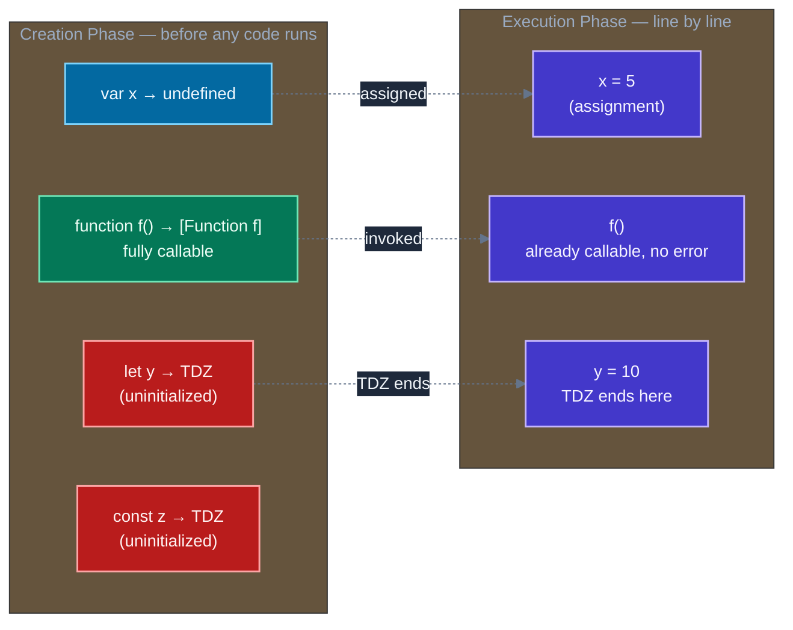
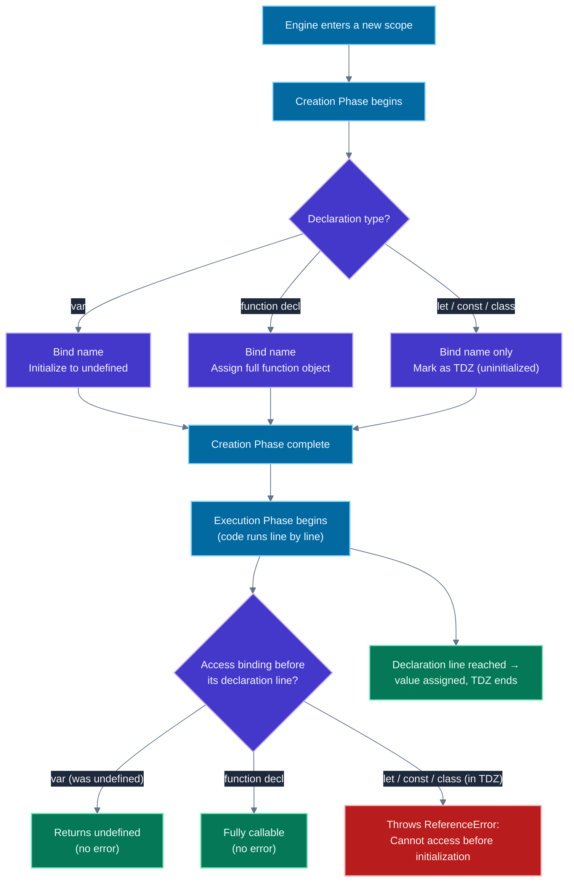
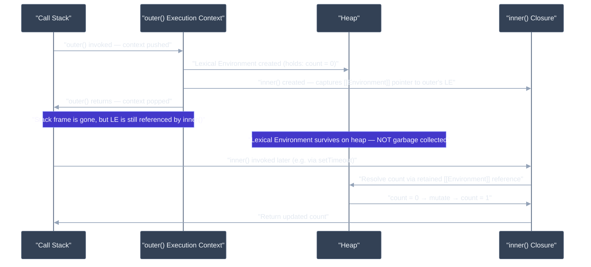

# Closures, scope, and hoisting

---

## 🎯 Executive Summary

Closures, scope, and hoisting are the mechanics underneath almost every JavaScript bug a Lead is asked to explain live: the stale-state hook, the loop that logs the same value five times, the "why does this throw before the line even runs" question. Interviewers treat this topic as "easy" on paper — it's usually classified as a fundamentals check — but at the Lead level it's actually a proxy question for something bigger: **do you understand what the engine is doing underneath your code, or do you just have the syntax memorized?**

A Senior candidate can define a closure ("a function that remembers its lexical scope"). A Lead candidate can explain **why** that's true at the engine level (heap-allocated `Context` objects, `[[Environment]]` internal slots), **when** it becomes a performance or memory liability (retained large objects, defeated stack-allocation optimizations, event-listener leaks in SPAs), and **how** it underpins patterns they use daily without necessarily naming them — React's `useState`, debounce/throttle, memoization, the module pattern.

Hoisting and the Temporal Dead Zone (TDZ) round this out: they're not "JavaScript moving your code around," they're the observable effect of a two-phase execution model (creation phase, then execution phase) that every JS engine implements. Misunderstanding this phase distinction is the single most common way engineers misdiagnose `ReferenceError`s and `undefined` bugs in code review.

**Why this is a must-know for Leads:** This topic is the foundation that closures-adjacent bugs (stale closures in `useEffect`, memory leaks from uncleaned listeners, race conditions in loops with async callbacks) all trace back to. A Lead who can trace a production bug to "this is a stale closure over `state` because the dependency array is wrong" — instead of just patching symptoms — is the signal interviewers are listening for.

---

## 🧠 Core Technical Deep Dive

### Execution contexts: the two-phase model

Every time JavaScript runs a function (or the global program, or `eval`), the engine creates an **Execution Context**. Each context is built in two distinct phases, and almost every "hoisting" confusion comes from not separating them:

1. **Creation phase** (a.k.a. "compile phase"): the engine scans the code *before running a single line*. It:
   - Creates the **Variable Environment** and **Lexical Environment** (per ECMA-262, these are Environment Records)
   - Registers every `var` declaration, initializing the binding to `undefined`
   - Registers every `function` declaration, binding the *entire function object* — fully usable immediately
   - Registers every `let`/`const`/`class` declaration, but leaves the binding **uninitialized** — this is the Temporal Dead Zone
   - Determines `this` binding and sets up the outer scope reference (the scope chain link)

2. **Execution phase**: the engine runs your code top to bottom, assigning values to the already-registered bindings as it reaches each line.

"Hoisting" is just the observable behavior of step 1 happening before step 2. Nothing physically moves — the binding was created in the creation phase; your code just runs against bindings that already exist.



### Hoisting behavior, precisely, by declaration type

| Declaration | Hoisted? | Initial value | Usable before the line executes? |
| --- | --- | --- | --- |
| `var x` | Yes, to function/global scope | `undefined` | Yes — reads as `undefined` |
| `function f() {}` | Yes, fully (name + body) | The function object | Yes — fully callable |
| `let x` | Binding hoisted, not initialized | TDZ (no value) | **No** — throws `ReferenceError` |
| `const x` | Binding hoisted, not initialized | TDZ (no value) | **No** — throws `ReferenceError` |
| `class X {}` | Binding hoisted, not initialized | TDZ (like `let`) | **No** — throws `ReferenceError` |
| `const f = () => {}` | Only the binding name (via `const` rules) | TDZ | **No** — the *variable* is hoisted, the *function value* is not assigned until the line runs |
| `import { x }` | Yes, hoisted to top of module | Binding live, module not yet evaluated | Depends — hoisted above other code, but the module's own top-level code still executes in order |

**The nuance that separates Lead from Senior:** the difference between "the binding is hoisted" and "the value is hoisted." A `function` declaration hoists both name and value. A `var` hoists only the name, initialized to `undefined`. A `let`/`const` hoists only the name, but leaves it **uninitialized** — and accessing an uninitialized binding is a hard error, not `undefined`. This is why `typeof` is unsafe on TDZ variables even though `typeof` is normally the "safe" way to probe undeclared variables:

```javascript
console.log(typeof undeclaredVar); // "undefined" — safe, no ReferenceError
console.log(typeof tdzVar);         // ReferenceError: Cannot access 'tdzVar' before initialization
let tdzVar = 5;
```

### Scope: lexical, not dynamic

JavaScript uses **lexical (static) scoping** — where a variable resolves is determined by *where it's written in the source*, not by *how the function was called*. Every function, when created, captures a reference to the Lexical Environment that was active at its definition site. That reference is stored in the function object's internal `[[Environment]]` slot (per spec) — this is the mechanism a closure actually *is*.

Scope chain resolution walks outward until it finds a binding or reaches the global scope:

```
function outer() {
  const a = 1;
  function middle() {
    const b = 2;
    function inner() {
      const c = 3;
      console.log(a, b, c); // resolves a → outer's LE, b → middle's LE, c → inner's LE
    }
    inner();
  }
  middle();
}
```

Each `console.log` variable lookup is a walk up the **scope chain** — a linked list of Environment Records, terminating at the global environment. This walk happens at *access time*, but which environments are linked together is determined lexically, at *definition time* — that's the "static" part of static scoping.

### What a closure actually is, at the engine level

A closure is not a special JS feature you opt into — it's the **default consequence** of lexical scoping combined with functions being first-class values. Every function is a closure over its defining scope; we just don't notice unless the function **outlives** that scope.

```javascript
function makeCounter() {
  let count = 0; // lives in makeCounter's Lexical Environment
  return function increment() {
    count += 1; // still resolves `count` via the scope chain
    return count;
  };
}

const counter = makeCounter(); // makeCounter's execution context is popped off the call stack...
counter(); // 1
counter(); // 2
```

Normally, when `makeCounter()` returns, its execution context would be popped off the call stack and its Lexical Environment would become eligible for garbage collection. But because `increment` retains a reference to that Lexical Environment via `[[Environment]]`, the environment **cannot be collected** — it's still reachable. The stack frame is gone; the *environment record* survives on the heap, referenced by the closure.

**V8-specific mechanics:** V8 represents these Lexical Environments as `Context` objects — heap-allocated, garbage-collected JS objects (not literal JS objects, but structurally similar internal objects). Critically, V8's optimizing compiler (TurboFan) can, via escape analysis, allocate a function's local variables **on the stack** instead of the heap *if it can prove nothing outlives the function* — a major performance win, since stack allocation is cheaper than heap allocation and doesn't add GC pressure. **The moment a closure captures a variable, V8 cannot make that guarantee, and must heap-allocate the Context.** This is a real, measurable performance cost of closures in hot paths — not a theoretical one.

### The classic `var`-in-a-loop bug, mechanically explained

```javascript
// The bug
for (var i = 0; i < 3; i++) {
  setTimeout(() => console.log(i), 0);
}
// Logs: 3, 3, 3

// The fix
for (let i = 0; i < 3; i++) {
  setTimeout(() => console.log(i), 0);
}
// Logs: 0, 1, 2
```

With `var`, there is **one binding** for `i` across the entire loop — it's function/global scoped, not block scoped. All three closures capture a reference to the *same* Environment Record slot, and by the time the callbacks run (after the loop finishes), `i` has already been incremented to `3`.

With `let`, the spec mandates that **each iteration of the loop gets a fresh Lexical Environment**, with `i` re-initialized by copying the value from the previous iteration's environment at the top of each pass. Each closure created inside the loop body captures a *different* Environment Record. This is not just "let is block scoped" — it's specifically "a `for` loop with `let` creates a new per-iteration binding," which is a slightly stronger and more specific guarantee than plain block scoping.

### Closures as the reason `useState` works

React's `useState` is closures in disguise, and this is a favorite Lead-level connective-tissue question:

```javascript
function Counter() {
  const [count, setCount] = useState(0);

  const handleClick = () => {
    // This closure captures `count` as it was during THIS render
    console.log('Current count:', count);
    setCount(count + 1);
  };

  return <button onClick={handleClick}>Click</button>;
}
```

Every render of `Counter` creates a **new** `handleClick` closure, capturing that render's `count` binding. This is exactly why "stale closure" bugs happen in `useEffect`/`useCallback` with missing dependencies — the closure was created during an earlier render and captured that render's now-outdated variable value; it isn't "seeing" a live/mutable reference to the latest state, because there isn't one — each render's closure is over a distinct, frozen binding.

### Memory implications: when closures leak

Closures retain their entire Lexical Environment, not just the variables you use. If a closure references *any* variable from an outer scope, the **whole Environment Record** stays alive — including large objects you never intended to keep around.

```javascript
function setupHandler(largeDataset) {
  const summary = summarize(largeDataset); // small
  // largeDataset itself is never referenced again below...
  return function onClick() {
    console.log(summary); // ...but if the engine can't prove that,
  };                        // largeDataset MAY still be retained by the closure's environment
}
```

Modern V8 does perform some dead-variable elimination in many cases (it doesn't always keep the whole environment alive if it can statically prove a variable is unused by any nested closure) — but this is an implementation detail you should not rely on. The Lead-level habit is to **not assume the engine will save you**: explicitly null out large references you don't need, or restructure so the closure only closes over what it needs.

The more common, more real leak: **long-lived closures attached to persistent objects** — event listeners on `window`/`document` that are never removed, closures stored in module-level caches, timers that are never cleared. Each keeps its entire captured scope alive for the life of the referencing object.

---

## 📊 Visual Architecture & Logic

### Diagram 1 — Hoisting & TDZ Resolution (Creation Phase → Execution Phase)



---

### Diagram 2 — Closure Creation and Scope Chain Retention Across the Call Stack



---

## 🏢 Interview Context & FAANG Signals

### Where this appears in the loop

- **Coding Round (very common):** "What does this code log?" trace-through questions involving `var` in loops, IIFEs, or TDZ traps. Also common: "implement a memoize/debounce/once function" — all closure-dependent.
- **Technical Deep Dive:** "Explain what a closure is and why `count` doesn't reset between calls" — expects engine-level reasoning, not just the textbook definition.
- **Debugging Round:** A broken `useEffect`/event-handler snippet exhibiting a stale-closure bug, expected to be diagnosed and fixed.
- **System Design (rarely, but happens):** Discussing memory implications of closures in long-lived SPA state (e.g., "our app leaks memory after 30 minutes of use — where would you look?").

### Lead signals interviewers are listening for

| Signal | What they want to hear |
| --- | --- |
| **Engine-level reasoning** | "The `[[Environment]]` slot keeps the Lexical Environment reachable, so it survives after the outer function's stack frame is popped" — not just "closures remember variables" |
| **Performance awareness** | Knowing closures can defeat V8's stack-allocation optimization (escape analysis) and force heap allocation, relevant in hot loops or render-critical code |
| **Connects to real bugs** | Ties closures directly to stale-state bugs in `useEffect`/`useCallback`, not just abstract trivia |
| **Memory ownership** | Identifies that closures retain their *entire* Lexical Environment, and proactively discusses cleanup (removing listeners, clearing timers, nulling large captured references) |
| **Precision on hoisting** | Distinguishes "binding hoisted" vs "value hoisted" cleanly across `var`/`let`/`const`/`function`/`class`, and explains TDZ as a *spec-mandated safety net*, not a JS quirk |

---

## ⚔️ Lead Level vs Senior Level

### Scenario: "What will this code log, and why?"

```javascript
for (var i = 0; i < 3; i++) {
  setTimeout(() => console.log(i), 100);
}
```

**Senior response:**

> "It logs `3, 3, 3` instead of `0, 1, 2` because `var` isn't block scoped, so all three `setTimeout` callbacks share the same `i`. You'd fix it by using `let` instead, which is block scoped."

This is correct and most candidates get this far. It doesn't explain *why* `let` fixes it beyond "it's block scoped," and doesn't connect to the underlying execution model.

**Staff/Lead response:**

> "This logs `3, 3, 3`. `var` is function-scoped, so there's exactly one binding for `i` for the entire loop, living in the enclosing function's (or global) Variable Environment. Each arrow function closes over that same binding by reference, not by value — so when the callbacks actually run, on the next macrotask after the loop has already completed all three iterations, they all read the same final value, `3`.
>
> Switching to `let` fixes it, but the *mechanism* matters: the spec doesn't just say `let` is block scoped — for `for` loops specifically, it mandates a **new Lexical Environment is created per iteration**, with the loop variable's value copied forward from the previous iteration at the top of each pass. So each `setTimeout` callback closes over a genuinely distinct binding.
>
> If I couldn't touch the loop variable declaration for some reason — legacy code constraint — I'd reach for an IIFE to manually create a new scope per iteration instead: `setTimeout(((i) => () => console.log(i))(i), 100)`. That's the pre-ES6 idiom for the same fix, and worth knowing because you'll still see it in older codebases.
>
> One more thing I'd flag: this pattern shows up identically in React — a `map()` over items building closures inside a loop, or a stale `count` in a `setInterval` inside `useEffect` with an empty dependency array. It's the same root cause: a closure capturing a binding that changes (or doesn't get recreated) independent of when the closure actually runs."

The key differences: **mechanistic explanation of per-iteration environments, the pre-ES6 IIFE alternative, and transferring the concept to a React-specific manifestation** — showing this isn't memorized trivia but a mental model applied across contexts.

---

## ⚠️ Common Pitfalls & Anti-Patterns

> ### ✕ Explaining Closures as "Functions That Remember Variables"
>
> **Why it's wrong:** This definition is technically true but shallow — it doesn't distinguish closures from ordinary scope lookups, and it can't answer the natural follow-up ("remember them *how*? Why doesn't the memory get freed?"). It signals memorized terminology rather than a working mental model.
>
> **✓ Correct Lead Approach:** Explain it as a consequence of lexical scoping plus first-class functions: a function retains a reference to its defining Lexical Environment via an internal `[[Environment]]` slot, and that environment is only interesting to call out as a "closure" when the function outlives the scope that created it, keeping that environment reachable (and un-garbage-collected) past when it would otherwise be freed.

---

> ### ✕ Treating Hoisting as "Code Gets Moved to the Top"
>
> **Why it's wrong:** This mental model breaks down immediately under follow-up questions — it can't explain why `let` throws a `ReferenceError` instead of returning `undefined` like a "hoisted" `var` would, and it implies a literal code transformation that doesn't happen.
>
> **✓ Correct Lead Approach:** Frame hoisting as the visible effect of the two-phase execution model — bindings are created during a creation phase, before any code runs, and different declaration types are initialized differently (`undefined` for `var`, the function object for `function`, "uninitialized"/TDZ for `let`/`const`/`class`). Nothing moves; the binding just already exists by the time execution starts.

---

> ### ✕ Using `var` for Loop Counters with Async Callbacks (Legacy Habit)
>
> **Why it's wrong:** Every closure created inside the loop body captures the *same* binding, not a per-iteration snapshot. Any deferred execution (timers, promises, event handlers registered in a loop) will observe the loop variable's *final* value, not the value at the time the closure was created — a classic source of "off by however many iterations" bugs.
>
> **✓ Correct Lead Approach:** Default to `let` for loop counters — it's not just style, it changes the actual binding semantics per iteration. If working in a codebase constrained to `var` (or needing a value frozen at closure-creation time for other reasons), wrap the closure creation in an IIFE that takes the current value as a parameter, forcing a new binding per invocation.

---

> ### ✕ Ignoring Closure-Retained Memory in Long-Lived Objects
>
> **Why it's wrong:** A closure attached to something long-lived — a `window` event listener, a module-level cache, an uncanceled `setInterval` — keeps its entire captured Lexical Environment alive for as long as that object exists. In a long-running SPA, this compounds: navigating away from a view without cleanup leaves every closure (and everything it closed over) retained, growing heap usage over the session.
>
> **✓ Correct Lead Approach:** Treat closures attached to app-lifetime objects as a resource that needs explicit teardown, the same way you'd treat a file handle or a subscription: remove event listeners in cleanup functions (`useEffect` return, `componentWillUnmount`), clear timers, and avoid capturing large objects in closures that outlive their useful data (capture only the derived value you need, not the whole source object).

---

> ### ✕ Assuming `typeof` Is Always a Safe Way to Check for a Variable
>
> **Why it's wrong:** `typeof undeclaredVar` safely returns `"undefined"` — but `typeof tdzVar` (where `tdzVar` is a `let`/`const` declared later in the same scope) throws a `ReferenceError`, because the binding exists but is in the Temporal Dead Zone. Engineers who learned "use `typeof` to safely probe for existence" from older `var`-only codebases carry this assumption into `let`/`const` code, where it silently becomes false.
>
> **✓ Correct Lead Approach:** Understand that TDZ safety only breaks down for bindings that exist in the current scope but haven't reached their declaration line yet — it's specifically about declaration order within a shared scope, not about "does this variable exist anywhere." In practice, this means keeping declarations near the top of their scope and not relying on `typeof` as a universal existence check once `let`/`const` are involved.

---

> ### ✕ Blindly Applying `useCallback`/`useMemo` Without Understanding the Closure They Capture
>
> **Why it's wrong:** Wrapping a function in `useCallback` with an incomplete or incorrect dependency array doesn't remove the closure problem — it *freezes* a stale closure in place across renders where the dependencies weren't listed, referencing outdated variable values indefinitely. This is often worse than not memoizing at all, since the bug becomes intermittent and dependent on which values happened to be "fresh" when the closure was first created.
>
> **✓ Correct Lead Approach:** Treat the dependency array as a direct declaration of "everything this closure reads from outer scope" — not a performance knob to tune independently. Use the ESLint `exhaustive-deps` rule as a hard gate, and when a dependency is deliberately omitted, require an explicit comment justifying why that variable is intentionally allowed to be stale (e.g., a ref, or a value known to be stable).

---

## 🛠️ Practice Scenarios

---

### Scenario 1 — The Classic Loop Trace

**Problem Statement:**
A candidate is shown this code and asked to predict the output, then explain the mechanism (not just "what," but "why"):

```javascript
const funcs = [];
for (var i = 0; i < 3; i++) {
  funcs.push(function () {
    return i;
  });
}
console.log(funcs.map(f => f()));
```

Then asked: "Now fix it three different ways."

<details>
<summary>Staff-Level Solution</summary>

**Output:** `[3, 3, 3]`. All three closures share the single `var i` binding from the enclosing scope; by the time any of the pushed functions run, the loop has already finished and `i` is `3`.

**Fix 1 — `let` (idiomatic, ES6+):**
```javascript
const funcs = [];
for (let i = 0; i < 3; i++) {
  funcs.push(function () {
    return i;
  });
}
// [0, 1, 2] — per-iteration Lexical Environment for `i`
```

**Fix 2 — IIFE to force a new binding (pre-ES6 idiom):**
```javascript
const funcs = [];
for (var i = 0; i < 3; i++) {
  funcs.push((function (capturedI) {
    return function () {
      return capturedI;
    };
  })(i));
}
// [0, 1, 2] — each IIFE invocation creates a fresh function-scoped `capturedI`
```

**Fix 3 — `Array.prototype.bind` to pre-bind the value as an argument:**
```javascript
const funcs = [];
for (var i = 0; i < 3; i++) {
  funcs.push(function (capturedI) {
    return capturedI;
  }.bind(null, i));
}
// [0, 1, 2] — `bind` partially applies `i`'s current value at call time
```

A Lead-level answer explains *why* each fix works structurally (new binding vs. new scope vs. value capture via partial application), not just that they all happen to produce the right output.

</details>

---

### Scenario 2 — Diagnosing a Stale Closure in Production React Code

**Problem Statement:**
A production bug report: a "Save" button in a form sometimes saves outdated data — specifically, whatever the form values were when the component *first* mounted, not the latest edits. Given this code, diagnose and fix it:

```javascript
function Form({ onSave }) {
  const [formData, setFormData] = useState({ name: '', email: '' });

  useEffect(() => {
    const interval = setInterval(() => {
      console.log('Auto-saving:', formData);
      onSave(formData);
    }, 30000);
    return () => clearInterval(interval);
  }, []); // empty dependency array

  return (/* form JSX */);
}
```

<details>
<summary>Staff-Level Solution</summary>

**Root cause:** The `useEffect` with an empty dependency array runs exactly once, on mount. The `setInterval` callback it creates is a closure that captured `formData` **as it was during the first render** — an empty `{ name: '', email: '' }`. Because the effect never re-runs (empty deps), that `setInterval` closure is never recreated, so it keeps calling `onSave` with the stale, mount-time `formData` forever, regardless of how many times the user updates the form.

**Fix option A — include `formData` in deps, recreate the interval each change:**
```javascript
useEffect(() => {
  const interval = setInterval(() => {
    onSave(formData);
  }, 30000);
  return () => clearInterval(interval);
}, [formData]); // interval recreated on every formData change — may be too frequent
```
This works but recreates the timer on every keystroke, which can be wasteful and reset the 30-second window each time.

**Fix option B — use a ref to always read the latest value without recreating the interval:**
```javascript
const formDataRef = useRef(formData);
useEffect(() => {
  formDataRef.current = formData;
}, [formData]);

useEffect(() => {
  const interval = setInterval(() => {
    onSave(formDataRef.current); // always reads the current ref value
  }, 30000);
  return () => clearInterval(interval);
}, []); // interval created once, ref always fresh
```
This is the more scalable fix for a fixed-cadence timer: the closure over `formDataRef` is stable (refs are mutable containers, not re-created per render), so the interval only needs to be set up once, while still reading current data on every tick.

A Lead-level answer names the trade-off explicitly — option A is simpler but couples timer lifecycle to data changes; option B decouples them via a ref, which is the idiomatic fix for "stable callback, fresh data" scenarios.

</details>

---

### Scenario 3 — TDZ Trap in Real Code Review

**Problem Statement:**
During code review, you see this snippet. A teammate says "this looks fine, `x` is used after it's declared." Is it fine? Walk through what actually happens.

```javascript
function process(flag) {
  if (flag) {
    console.log(x); // ???
    let x = 10;
  }
}
process(true);
```

<details>
<summary>Staff-Level Solution</summary>

It is **not** fine — this throws `ReferenceError: Cannot access 'x' before initialization`.

The reasoning: `let x` is scoped to the `if` block, and during the creation phase for that block, `x`'s binding is registered but left uninitialized — placed in the Temporal Dead Zone. The `console.log(x)` line executes *within that same block*, before the `let x = 10;` line has run, so it hits the TDZ and throws.

This is different from what would happen with `var`:
```javascript
function process(flag) {
  if (flag) {
    console.log(x); // undefined — no error
    var x = 10;
  }
}
```
Here, `var x` is hoisted to the *function* scope (not the `if` block), initialized to `undefined` during the creation phase, so referencing it early just yields `undefined` — silently wrong, but not a crash.

**The Lead-level point for code review:** this is exactly why the TDZ exists — it converts a silent "the value is `undefined`, unclear if that's a bug" situation (the `var` case) into a loud, immediate `ReferenceError` (the `let`/`const` case) that surfaces the ordering mistake at the earliest possible point, rather than letting it manifest as a confusing downstream `undefined` bug three function calls later.

</details>

---

### Scenario 4 — Memory Leak from an Uncleaned Closure

**Problem Statement:**
A single-page app's memory usage grows steadily the longer a user stays on a specific dashboard page, even though the page's visible content doesn't change. You suspect closures. Given this code, find the leak:

```javascript
function initDashboard(largeDataset) {
  function handleResize() {
    console.log('Dashboard resized, dataset size:', largeDataset.length);
  }
  window.addEventListener('resize', handleResize);
}

// Called every time the user navigates to the dashboard
initDashboard(fetchLargeDataset());
```

<details>
<summary>Staff-Level Solution</summary>

**The leak:** `handleResize` is a closure over `largeDataset` (referenced inside its body for the `.length` log). It's registered on `window`, a long-lived, app-wide object — `window` never gets garbage collected during the session. Every time `initDashboard` runs (on each dashboard navigation), a **new** `handleResize` closure is created and added as **another** listener, and the old one is never removed. Each of these retained closures keeps its own `largeDataset` reference alive, because the closure's Lexical Environment can't be collected while `window` still holds a live reference to the listener function.

Result: navigating to the dashboard N times leaves N copies of `largeDataset` (and any other captured variables) permanently retained in memory, none of them collectible, because `window` is reachable for the entire session.

**Fix:**
```javascript
function initDashboard(largeDataset) {
  function handleResize() {
    console.log('Dashboard resized, dataset size:', largeDataset.length);
  }
  window.addEventListener('resize', handleResize);

  return function cleanup() {
    window.removeEventListener('resize', handleResize);
  };
}

// Caller is responsible for invoking cleanup on unmount/navigation-away
const cleanup = initDashboard(fetchLargeDataset());
// later:
cleanup();
```

In a React context, this maps directly to returning a cleanup function from `useEffect`. The Lead-level framing: **any closure registered on an object that outlives the component/module that created it is a retained-memory liability until explicitly torn down** — this applies identically to event listeners, subscriptions, timers, and observer callbacks (`IntersectionObserver`, `MutationObserver`, etc.).

</details>

---

### Scenario 5 — Implement `once()` Using Closures

**Problem Statement:**
Implement a higher-order function `once(fn)` that returns a new function which calls `fn` on the first invocation only, caches the result, and returns the cached result on every subsequent call — without ever calling `fn` again.

<details>
<summary>Staff-Level Solution</summary>

```typescript
function once<T extends (...args: any[]) => any>(fn: T): T {
  let called = false;
  let result: ReturnType<T>;

  return function (this: unknown, ...args: Parameters<T>): ReturnType<T> {
    if (!called) {
      result = fn.apply(this, args);
      called = true;
      // Optional: release the reference to fn's captured scope if it's expensive
    }
    return result;
  } as T;
}

// Usage
const initialize = once(() => {
  console.log('Expensive setup running...');
  return { initialized: true };
});

initialize(); // logs "Expensive setup running...", returns { initialized: true }
initialize(); // no log, returns cached { initialized: true }
```

**Why this is the closure pattern in its purest form:** `called` and `result` live in the Lexical Environment created when `once()` is invoked. The returned function is the only thing with a reference to that environment, so `called` and `result` behave like true private instance state — inaccessible from outside, but persisted across calls to the returned function, for exactly as long as that function itself is reachable.

**Lead-level extension the interviewer is probing for:** ask about thread-safety implications (irrelevant in single-threaded JS, but worth naming explicitly why — no other execution can interleave between the `called` check and the `called = true` assignment, so there's no race condition here even without synchronization), and about memory: if `fn`'s closure captures something large and `once` is long-lived (e.g., a module-level singleton), that large capture is retained indefinitely once `called` is `true`, even though `fn` itself will never run again — worth nulling `fn`'s reference if that matters at scale.

</details>

---

### Scenario 6 — Module Pattern for Private State (Pre-`#private` Fields)

**Problem Statement:**
Before native private class fields (`#field`) existed, closures were the primary way to achieve real encapsulation in JavaScript. Implement a `createBankAccount(initialBalance)` factory that exposes `deposit`, `withdraw`, and `getBalance`, but makes the balance genuinely inaccessible from outside (not just conventionally hidden with an underscore prefix).

<details>
<summary>Staff-Level Solution</summary>

```javascript
function createBankAccount(initialBalance) {
  let balance = initialBalance; // private — lives only in this closure's environment

  function deposit(amount) {
    if (amount <= 0) throw new Error('Deposit must be positive');
    balance += amount;
    return balance;
  }

  function withdraw(amount) {
    if (amount > balance) throw new Error('Insufficient funds');
    balance -= amount;
    return balance;
  }

  function getBalance() {
    return balance;
  }

  return Object.freeze({ deposit, withdraw, getBalance });
  // Object.freeze prevents reassigning the exposed methods themselves —
  // it does NOT freeze `balance`, which was never exposed in the first place
}

const account = createBankAccount(100);
account.deposit(50);   // 150
account.withdraw(30);  // 120
account.balance;       // undefined — genuinely inaccessible, not just hidden by convention
```

**Why this is real encapsulation, unlike `this._balance`:** with a convention like `this._balance`, the property is still directly accessible (`account._balance = 999999` works fine, silently). With the closure pattern, `balance` never becomes a property of any object returned to the caller — it exists only in `createBankAccount`'s Lexical Environment, reachable exclusively through the three functions that were defined inside that same scope. There is no path from outside to reach it.

**Lead-level comparison point:** native `#private` fields (ES2022) now provide this more efficiently and with better tooling support (better V8 optimization, since the engine has a dedicated internal slot mechanism rather than relying on closure-based Context objects) — but understanding the module pattern is still relevant for reading legacy code, understanding why libraries built pre-2022 use factory functions heavily, and recognizing that "encapsulation via closures" is the same underlying idea IIFEs and the revealing module pattern were built on.

</details>

---

### Scenario 7 — Debounce Implementation and Its Closure-Retained Timer

**Problem Statement:**
Implement `debounce(fn, delay)`. Then explain: if this debounced function is attached to a component that unmounts while a debounce timer is still pending, what happens, and is it a problem?

<details>
<summary>Staff-Level Solution</summary>

```typescript
function debounce<T extends (...args: any[]) => void>(
  fn: T,
  delay: number
): (...args: Parameters<T>) => void {
  let timeoutId: ReturnType<typeof setTimeout> | undefined;

  return function (this: unknown, ...args: Parameters<T>) {
    clearTimeout(timeoutId);
    timeoutId = setTimeout(() => {
      fn.apply(this, args);
    }, delay);
  };
}

// Usage
const debouncedSearch = debounce((query: string) => {
  console.log('Searching for:', query);
}, 300);
```

`timeoutId` lives in the closure created by `debounce()`, shared across every call to the returned function — that's what allows `clearTimeout(timeoutId)` to correctly cancel the *previous* pending call on each new invocation. It's the same closure-over-mutable-state pattern as `once()`, just tracking a timer handle instead of a called/result pair.

**The unmount question — this is the real Lead-level probe:** if a component using `debouncedSearch` unmounts while a timer is pending, the `setTimeout` callback still fires 300ms later regardless — timers are not automatically tied to component lifecycle. The closure inside `setTimeout` still holds a reference to `fn` (which likely closes over component state, or calls `setState` on an unmounted component). This can cause:
- A "state update on an unmounted component" warning/error in React
- A closure over stale props/state from before unmount, doing something with data that's no longer valid
- In non-React contexts, simply wasted work, or worse, mutating something that assumed a live context

**Fix:** track and clear pending timers on cleanup, mirroring Scenario 4's pattern:
```javascript
useEffect(() => {
  return () => clearTimeout(timeoutId); // requires exposing timeoutId, e.g. via a ref-backed debounce
}, []);
```
Or, more robustly, implement `debounce` to expose a `.cancel()` method that clears the pending timer, and call that explicitly from the component's cleanup function — treating the debounce's internal timer, exactly like the earlier event-listener leak, as a resource with a lifecycle that must be explicitly terminated, not something that resolves itself.

</details>

---

*Document version: May 2026 | Audience: Staff/Principal Frontend Engineer candidates | Topic ID: closures-scope-hoisting*
