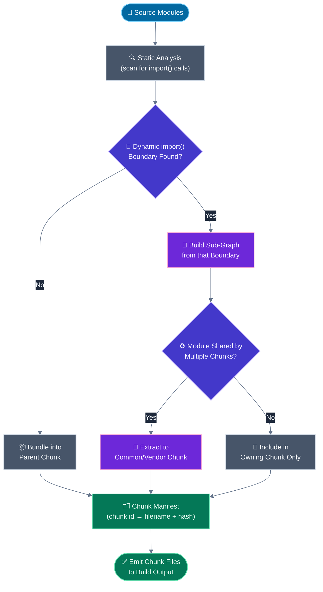
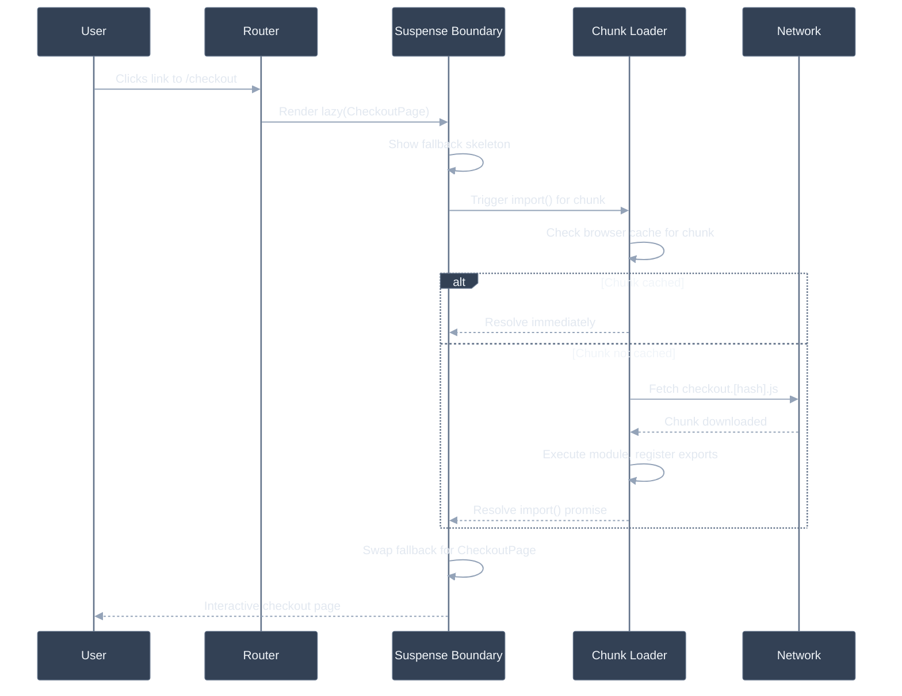

# Code splitting: dynamic import(), route-based, component-based

## 🎯 Executive Summary

Code splitting is the practice of partitioning your module graph into multiple output files ("chunks") so the browser downloads only the code a given page or interaction actually needs, deferring the rest until it's requested. The mechanism is a single ECMAScript-spec feature — dynamic `import()`, which returns a Promise — but the *strategy* of where you place those boundaries is where the engineering judgment lives.

This is not a bundler configuration detail; it's an architectural decision that directly determines your initial JS payload, and initial JS payload is the single biggest lever most teams have over TTI and INP on first load. A perfectly-written app with the wrong chunk boundaries still ships a slow first paint.

Why it's a must-know at Lead level: code-splitting strategy has to be decided at the framework/routing layer, applied consistently across a team, and revisited as the app grows — get the granularity wrong and you either ship a monolithic bundle (too coarse) or generate a request waterfall of tiny chunks that never actually parallelizes (too fine). A Lead is expected to own that granularity decision and know how to verify it's working, not just sprinkle `React.lazy()` around reactively.

---

## 🧠 Core Technical Deep Dive

### What dynamic `import()` actually does

`import()` is a runtime expression, not a static declaration — it returns a `Promise<ModuleNamespace>` and can appear anywhere a normal expression can (inside a conditional, an event handler, a `.then()` chain). Bundlers statically scan source code for `import()` call sites at build time, and each unique call site becomes a **chunk boundary**: everything reachable only through that import becomes a candidate for extraction into a separate output file.

This is distinct from a bare `import` statement, which is resolved and bundled at build time into whatever chunk contains the importing module — there's no runtime decision involved. Dynamic `import()` defers both the *fetch* and the *evaluation* of that module until the call actually executes.

> **Key takeaway:** code splitting isn't a separate feature bolted onto ES modules — it's what you get for free when you use the dynamic form of `import` instead of the static form, and the bundler does the rest.

### Three granularities, three different ROI profiles

| Granularity | Split boundary | Typical mechanism | When it pays off |
|---|---|---|---|
| **Route-based** | Per page/screen | Framework router (`React.lazy` + route config, Next.js automatic per-page chunks) | Almost always — matches the user's actual navigation model, highest ROI for the least effort |
| **Component-based** | Per heavy/rare UI piece | Manual `React.lazy(() => import('./Modal'))` | Rich editors, charting libs, modals, anything not needed on initial paint |
| **Library/vendor-based** | Per large dependency | Manual dynamic import of the library itself | A dependency only needed for one interaction (PDF export, a specific chart type) |

Route-based splitting is the default expectation in any modern framework and should almost never need justification. Component-based splitting requires judgment — the cost of an extra network round-trip and a loading state has to be worth the bytes saved on initial load, which usually means reserving it for genuinely heavy, conditionally-rendered UI.

> **Key takeaway:** default to route-based splitting everywhere; reach for component-based splitting only when a specific component's weight is measurably disproportionate to how often it's actually rendered.

### `React.lazy` + `Suspense`: the contract

```typescript
const HeavyEditor = React.lazy(() => import('./HeavyEditor'));

function Page() {
  return (
    <Suspense fallback={<EditorSkeleton />}>
      <HeavyEditor />
    </Suspense>
  );
}
```

`React.lazy` wraps the dynamic import in a component that "suspends" — internally, it throws the pending Promise, which the nearest `Suspense` boundary catches and uses to show the fallback until the Promise resolves. This means `Suspense` is not optional decoration; without it, a lazy component with an unresolved import throws an unhandled error.

Chunk fetches can fail — a flaky network, an ad blocker, or (very commonly) a stale deploy referencing a chunk hash that no longer exists on the CDN. A rejected `import()` Promise inside `React.lazy` needs an **Error Boundary** as well as a `Suspense` boundary; without one, a failed chunk load crashes the entire subtree instead of degrading gracefully.

> **Key takeaway:** every `React.lazy` boundary needs both a `Suspense` fallback (for the pending state) and an Error Boundary (for the rejected state) — teams that only add the first one discover the gap in production, during their next deploy.

### Chunk graph shape: the part that's easy to get wrong

The bundler doesn't just split at each `import()` site independently — it builds a full module dependency graph and partitions it, deduplicating modules shared across multiple dynamic entry points into their own common chunk (webpack's `splitChunks`, Rollup's automatic shared-chunk extraction). Get this wrong and the same large dependency ships duplicated inside every chunk that uses it.

| Problem | Symptom | Cause |
|---|---|---|
| Duplicated vendor code | Total transferred bytes across chunks exceeds the app's actual dependency size | Bundler not configured to extract shared modules into a common chunk |
| Request waterfall | A dynamically-imported module itself contains another `import()`, so chunk B can't be requested until chunk A has downloaded *and executed* enough to discover it | Nested dynamic imports without upfront awareness of the dependency |
| Excessive chunk count | Many tiny files, each paying full HTTP request overhead and compressing worse independently | Splitting at too fine a granularity (e.g., every small component individually) |

> **Key takeaway:** run a bundle analyzer periodically, not just once at initial setup — chunk graph shape degrades silently as new dynamic imports get added by different engineers who can't see the aggregate effect of their individual choice.

### Prefetch vs preload for split chunks

Both webpack (magic comments) and modern bundlers expose hints for *when* to fetch a chunk relative to its likely need, distinct from the `import()` call that determines *whether* it's split at all:

| Hint | Priority | Timing | Use case |
|---|---|---|---|
| `webpackPrefetch: true` | Low | Browser idle time | Routes/components likely needed *next*, not now (e.g., prefetch the checkout page while the user is browsing the cart) |
| `webpackPreload: true` | High, parallel with parent chunk | Immediately, alongside the current navigation | Resources *definitely* needed very soon within the current view |
| No hint | N/A | Only on actual `import()` call | Default — fetch on demand, no speculation |

Framework routers increasingly automate this: Next.js's `<Link>` prefetches the target route's chunk when it enters the viewport by default, turning route-based prefetching from a manual optimization into a framework default.

> **Key takeaway:** prefetching trades bandwidth for latency — it's a net win on fast/unmetered connections and a potential regression on mobile data, so framework-level defaults that prefetch aggressively deserve a second look for mobile-heavy products.

### The deploy problem: chunk load errors

A subtle production failure mode: a user loads your app shell (`index.html` + main bundle), you deploy a new version with different chunk hashes, and when the user later navigates to a route whose chunk wasn't yet loaded, the browser requests a chunk filename that no longer exists on your CDN — a 404 that surfaces as an unhandled `import()` rejection.

```typescript
const Page = React.lazy(() =>
  import('./Page').catch(() => {
    // Chunk 404 after a deploy — force a full reload to pick up the new app shell
    window.location.reload();
    return { default: () => null };
  })
);
```

> **Key takeaway:** chunk load failures are a normal, expected consequence of shipping frequently with content-hashed filenames — handle them explicitly (reload, retry with backoff, or a service-worker-managed manifest), don't treat them as a rare edge case.

---

## 📊 Visual Architecture & Logic

### Diagram 1 — Build-Time Chunk Graph Construction



### Diagram 2 — Runtime Chunk Loading on Navigation



---

## 🏢 Interview Context & FAANG Signals

### Where This Appears

| Interview Stage | Format |
|---|---|
| **Coding Round** | "Add code splitting to this route" — tests whether `Suspense`/error-boundary pairing is instinctive, not just `React.lazy` syntax |
| **Performance Round** | "Our main bundle is 1.2MB — walk me through your splitting strategy" |
| **System Design** | "Design the loading strategy for a component library consumed by five different product teams" |
| **Debugging Round** | "Users report a blank white screen after our last deploy, but only some users" — classic chunk-load-error scenario |

### Lead Signals Interviewers Are Looking For

1. **Granularity judgment** — do you reason about *when* component-based splitting is worth the round-trip cost, rather than applying it everywhere reflexively?
2. **Chunk graph awareness** — do you know to check for duplicated vendor code across chunks, not just whether splitting happened at all?
3. **Failure-mode ownership** — chunk load errors after deploys are a production-operations concern, not just a build concern; do you have a story for handling them?
4. **Prefetch trade-off articulation** — bandwidth vs. latency, and how that trade-off shifts for mobile-heavy vs. desktop-heavy products.
5. **Measurement discipline** — do you talk about verifying splitting worked (bundle analyzer, per-route budgets in CI) rather than assuming it did once configured?

---

## ⚔️ Lead Level vs Senior Level

### Scenario: "Our app's initial bundle is 900KB. How do you reduce it?"

**Senior Response:**
> "I'd add `React.lazy` to the routes that aren't the landing page, and maybe lazy-load any big third-party libraries like the chart library."

Correct direction, but treats it as a mechanical checklist rather than a strategy with verification.

---

**Staff/Lead Response:**
> "First I'd pull up a bundle analyzer to see what's actually in that 900KB — route-based splitting alone won't help if the bulk of it is in shared vendor code that every route needs regardless. If it's genuinely route-specific code sitting in the main bundle, route-based `React.lazy` is the highest-ROI first move, and I'd pair every boundary with both a `Suspense` fallback and an Error Boundary from the start, since chunk load failures after our next deploy are a certainty, not a hypothetical.
>
> After that, I'd look for component-level candidates — anything heavy that's conditionally rendered, like a rich text editor or a data export flow — but I'd be deliberate about it, because each new boundary is a network round-trip and a loading state UX cost, not a free win.
>
> Finally, I'd set a CI-enforced bundle-size budget per route so this doesn't silently regress as the team adds features — the fix without the guardrail just becomes next quarter's regression."

The Lead answer diagnoses before prescribing, treats error handling as part of the initial implementation rather than an afterthought, and closes the loop with a regression-prevention mechanism.

---

## ⚠️ Common Pitfalls & Anti-Patterns

> ### ✕ `React.lazy` Without an Error Boundary
> **Why it's wrong:** A chunk fetch can fail — network flakiness, ad blockers, or a stale deploy referencing a chunk hash removed from the CDN. Without an Error Boundary wrapping the `Suspense` boundary, a rejected `import()` promise crashes the entire subtree with an unhandled error, often surfacing as a blank white screen in production.
> **✓ Correct Lead Approach:** Pair every `React.lazy`/`Suspense` boundary with an Error Boundary that catches chunk load failures specifically, and give it a recovery action (reload, retry) rather than a generic "something went wrong" dead end.

---

> ### ✕ Splitting Every Small Component Individually
> **Why it's wrong:** Each dynamic import boundary becomes a separate network request and its own compression unit. Splitting dozens of small, frequently-used components individually generates request overhead and worse aggregate compression than bundling them together, actually increasing total transferred bytes and round-trip count versus one moderately-sized chunk.
> **✓ Correct Lead Approach:** Reserve component-level splitting for components that are both heavy *and* conditionally/rarely rendered. Group related small components into shared chunks rather than splitting each independently.

---

> ### ✕ Nested Dynamic Imports Creating a Waterfall
> **Why it's wrong:** If a dynamically-imported chunk itself contains another `import()` call, the second chunk can't be requested until the first chunk has downloaded and executed enough to reach that call — turning what could be a parallel fetch into a sequential one, silently adding latency that doesn't show up as an obviously "wrong" pattern in code review.
> **✓ Correct Lead Approach:** Flatten known-together dependencies into the same chunk where possible, or use prefetch hints to kick off the second chunk's fetch earlier than its natural discovery point.

---

> ### ✕ Ignoring Chunk Load Errors After Deployment
> **Why it's wrong:** Content-hashed filenames mean every deploy potentially invalidates chunk references held by users who already have the app shell loaded. Treating this as a rare edge case rather than a routine consequence of frequent deploys means it gets discovered by users, not by tests.
> **✓ Correct Lead Approach:** Explicitly catch `import()` rejections and force a full reload (or implement a retry-with-backoff), and consider a service-worker-managed manifest that detects a stale shell proactively.

---

> ### ✕ Prefetching Every Route by Default on Mobile
> **Why it's wrong:** Framework defaults like viewport-triggered route prefetching are tuned for the common case, but on metered or slow mobile connections, prefetching routes the user may never visit consumes bandwidth that competes with the current page's own resource loading, potentially regressing the metric it was meant to improve.
> **✓ Correct Lead Approach:** Scope aggressive prefetching to high-confidence next-navigation targets (an explicit "next step" in a flow), and consider disabling broad automatic prefetch on `save-data` connections or slow effective connection types, which most frameworks expose a hook for.

---

## 🛠️ Practice Scenarios

---

### Scenario 1 — The Waterfall Nobody Noticed

**Problem:**
```typescript
// FeatureFlagGate.tsx
const AdminPanel = React.lazy(() => import('./AdminPanel'));
// Inside AdminPanel.tsx:
const UserManagementTab = React.lazy(() => import('./UserManagementTab'));
```
Opening the admin panel takes 1.8s even though each individual chunk is small. Diagnose.

<details>
<summary>Staff-Level Solution</summary>

**Root cause:** `UserManagementTab`'s chunk can't be requested until `AdminPanel`'s chunk has downloaded and executed enough to reach the `React.lazy` call defining it — a sequential, two-round-trip waterfall instead of a single parallel fetch, even though nothing about the UI actually requires that ordering.

**Fix:** If `UserManagementTab` is very likely to be needed as soon as `AdminPanel` opens, hoist its lazy import to the same call site as `AdminPanel`'s so both fetches start together, or add a `webpackPrefetch` hint on the nested import so it starts speculatively before it's reached.

**Lead framing:** "Nested dynamic imports are one of the least visible performance bugs, because each individual `React.lazy()` call looks correct in isolation — the problem only shows up in a waterfall view of the network tab, which is exactly why I'd want this class of issue caught by an automated bundle/waterfall check in CI, not just code review."

</details>

---

### Scenario 2 — Aggressive Prefetch on Mobile

**Problem:**
A team notices mobile users on 3G/4G have worse LCP than expected, despite each individual page being well-optimized. The app uses a router that prefetches every visible link's route chunk on viewport entry. Diagnose and fix.

<details>
<summary>Staff-Level Solution</summary>

**Root cause:** With many links visible on a typical page (nav, footer, related content), viewport-triggered prefetching can kick off a dozen background chunk fetches competing for bandwidth with the current page's own critical resources — on a fast connection this is invisible, on a constrained mobile connection it directly delays the current page's LCP resource.

**Fix:** Use the `Network Information API` (`navigator.connection.saveData` / `effectiveType`) to scope prefetching to fast, non-metered connections, and disable or reduce it for `slow-2g`/`2g`/`save-data` conditions. Alternatively, limit prefetching to a small number of high-confidence links rather than everything in the viewport.

**Lead framing:** "This is a case where a framework default optimized for the median developer experience actively hurts a meaningful segment of real users. I'd want field data (CrUX or first-party RUM) segmented by connection type before assuming desktop-observed 'optimizations' translate to mobile."

</details>

---

### Scenario 3 — The Post-Deploy White Screen

**Problem:**
After every deploy, a small percentage of users report a blank white screen when navigating to a route they hadn't visited yet in their current session. It resolves if they hard-refresh. Diagnose and fix.

<details>
<summary>Staff-Level Solution</summary>

**Root cause:** Those users loaded the app shell before the deploy, referencing the previous build's chunk manifest. When they navigate to a not-yet-loaded route after the deploy, the browser requests a content-hashed chunk filename that no longer exists on the CDN (the old build's assets were replaced), the `import()` promise rejects, and without explicit handling, an unhandled rejection crashes the render.

**Fix:**
```typescript
const Page = React.lazy(() =>
  import('./Page').catch((err) => {
    console.error('Chunk load failed, likely a stale deploy:', err);
    window.location.reload();
    return { default: () => null };
  })
);
```
Wrap this in an Error Boundary as a second layer of defense for any failure mode the `.catch()` doesn't cover. Longer-term, consider keeping N previous builds' assets available on the CDN for a grace period, or using a service worker to detect and prompt for a fresh shell proactively.

**Lead framing:** "This is a predictable consequence of shipping frequently with immutable, hashed filenames — it's not a bug in the traditional sense, it's a gap in deploy-lifecycle handling. I'd treat 'graceful chunk-load-failure recovery' as a required part of the code-splitting implementation, not an optional hardening step added later."

</details>

---

### Scenario 4 — Duplicated Vendor Code

**Problem:**
A bundle analyzer shows a 180KB date-formatting library appearing in full inside three separate route chunks. Diagnose and fix.

<details>
<summary>Staff-Level Solution</summary>

**Root cause:** Each of the three routes imports the library independently, and the bundler's shared-chunk extraction either isn't configured or its heuristics (minimum chunk size, minimum share count) don't consider three occurrences worth extracting — so each chunk gets its own full copy instead of one shared vendor chunk all three depend on.

**Fix:** Configure the bundler's shared-chunk extraction explicitly (webpack's `splitChunks.cacheGroups`, or equivalent Rollup/Vite configuration) to force extraction of modules used by more than one dynamic entry point, rather than relying on default heuristics tuned for different codebases. Re-verify with the bundle analyzer that only one copy remains.

**Lead framing:** "Default bundler heuristics are a reasonable starting point but not a guarantee — I treat 'no unexpected duplication across chunks' as something to actively verify periodically, not something splitting configuration passively ensures forever as the app's import graph evolves."

</details>

---

### Scenario 5 — SSR and the Missing Flash

**Problem:**
```typescript
import dynamic from 'next/dynamic';
const RichEditor = dynamic(() => import('./RichEditor'));
```
On first load, users briefly see nothing where the editor should be, then it pops in — even though the rest of the page is server-rendered and appears instantly. Diagnose.

<details>
<summary>Staff-Level Solution</summary>

**Root cause:** By default, `next/dynamic` still server-renders the component's output into the initial HTML — but the client still has to download and execute the component's JS chunk before it's interactive, and if `RichEditor` has significant initialization work or the chunk is large, there's a visible gap between the server-rendered markup appearing and the client-side code taking over, especially if the SSR output and hydrated output differ in structure.

**Fix:** If the component is genuinely client-only (e.g., depends on `window` or a browser-only editor library), be explicit about it with `{ ssr: false }` and provide a sized loading placeholder so there's no layout shift — an explicit skeleton is a better experience than an ambiguous flash between two render passes:
```typescript
const RichEditor = dynamic(() => import('./RichEditor'), {
  ssr: false,
  loading: () => <EditorSkeleton />,
});
```

**Lead framing:** "The fix is straightforward, but the diagnostic step matters more — 'it flashes' could mean an SSR/CSR content mismatch, a missing loading state, or genuinely slow chunk execution, and those have different fixes. I'd confirm which one it is with the Performance panel before changing code."

</details>

---

### Scenario 6 — Over-Fragmented Design System

**Problem:**
A design system exports every component — including small ones like `Button` and `Badge` — behind individual `React.lazy()` boundaries "to be safe." Consuming apps report worse performance than before the library adopted code splitting. Diagnose and fix.

<details>
<summary>Staff-Level Solution</summary>

**Root cause:** Small, frequently-used components like `Button` are needed on nearly every page and are cheap in isolation — splitting them individually adds a network round-trip and a `Suspense` fallback flicker for something that would have cost near-zero bytes bundled normally, and it multiplies request count across a design system with dozens of small primitives.

**Fix:** Reserve `React.lazy` boundaries for the design system's genuinely heavy, infrequently-used pieces (a rich data table, a chart component, a rich text editor) and ship small, universally-used primitives in the main bundle without splitting. As a rule of thumb: if a component is used on more than roughly half of an app's routes, splitting it independently rarely pays for itself.

**Lead framing:** "This is the mirror image of under-splitting — teams sometimes over-correct once they learn code splitting exists and apply it uniformly. I'd push back on 'more splitting is more optimized' as a mental model; the actual goal is matching chunk boundaries to actual usage patterns, and for a design system that means auditing usage frequency, not app-consumption discretion."

</details>
