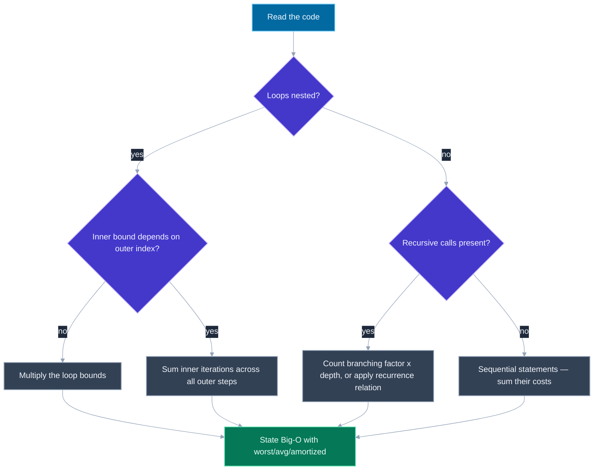
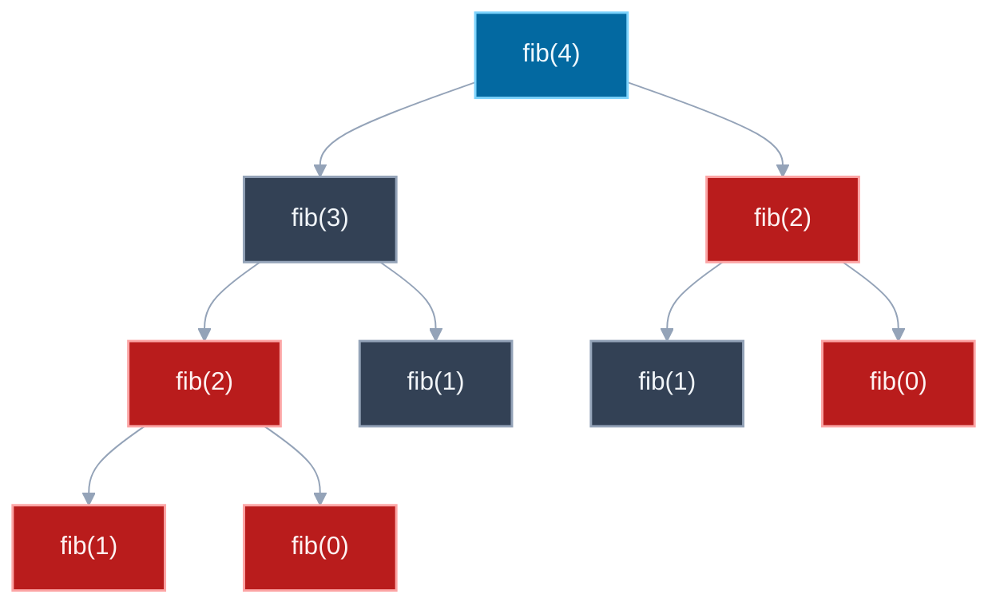

# Time and Space Complexity Analysis

---

## 🎯 Executive Summary

Big-O analysis is the language every other coding-round answer gets graded in — a working solution with an unstated or wrong complexity is treated as an incomplete answer at the Lead level, not a passing one. Interviewers don't just want the final notation; they want to see the derivation happen out loud, because the derivation is what proves the candidate actually understands the algorithm's mechanics rather than having pattern-matched to a memorized answer for a similar-looking problem.

The skill has three distinct parts that each fail in their own characteristic way if under-practiced: reading nested loops (and correctly handling the case where an inner loop's bound depends on the outer index, which is a frequent source of an incorrectly-guessed `O(n)` when the real answer is `O(n^2)`, or vice versa), reading recursive calls via branching factor and depth or the recurrence relation, and distinguishing worst-case from average-case from amortized complexity — a distinction that trips up candidates who've only ever been taught to state a single Big-O number per algorithm without qualification.

At the Lead level, this shows up constantly as a required addendum to every other coding answer ("what's the time and space complexity of what you just wrote, and why"), and occasionally as its own standalone question ("here's a snippet, what's its complexity"). It's also foundational to discussing trade-offs between competing approaches to the same problem — brute force vs. optimized, recursive vs. iterative, memoized vs. naive — since "which one is better" is meaningless without a precise complexity comparison backing it up.

---

## 📖 What Is It? (Plain-English Definition)

**In plain terms:** Big-O notation describes how the amount of work (time) or memory (space) an algorithm uses grows as the input size grows — not the exact number of operations, but the shape of the growth curve as that input gets arbitrarily large. Time complexity answers "how many more steps does this take if I double the input?" and space complexity answers the same question but for memory used.

A useful analogy: imagine paying for a mailing service that charges either a flat fee (O(1), constant — doesn't matter how many letters), a fee proportional to the number of letters (O(n), linear), or a fee proportional to every letter being compared against every other letter for duplicates (O(n²), quadratic — doubling the letters roughly quadruples the cost). Big-O is just naming which of these pricing shapes an algorithm follows, ignoring constant factors and lower-order terms, because those details wash out entirely once the input gets large enough.

The part that trips people up is that the same algorithm can have different complexities depending on which scenario you're describing: the worst possible input, the average input, or the complexity smoothed out ("amortized") over a whole sequence of operations rather than any single one in isolation. A single Big-O number without specifying which of these three it refers to is an incomplete answer.

With that framing established, here's how to actually read code and derive the right number, rather than guessing from a memorized table of "loops are O(n), nested loops are O(n²)."

---

## 🧠 Core Technical Deep Dive

### Pattern Recognition — How to Spot This Category of Problem

**Reading nested loops:**
- Two independent loops, each running the full range (`for i in 0..n: for j in 0..n`), multiply their bounds directly: `O(n) * O(n) = O(n²)`.
- **Watch for a dependent inner bound** — an inner loop whose range depends on the outer index (`for i in 0..n: for j in i..n`). Don't assume this is automatically `O(n)` just because the inner loop "shrinks." Sum the inner loop's iteration count across every outer iteration: `n + (n-1) + (n-2) + ... + 1 = n(n+1)/2`, which is still `O(n²)` — the constant factor of "roughly half" doesn't change the growth order. This triangular-number pattern is one of the most commonly mis-analyzed shapes in interviews.
- The opposite trap also exists: an inner loop that does `O(1)` amortized work *summed across all outer iterations* (not `O(1)` per outer iteration alone) can make an apparently-nested-loop algorithm actually `O(n)` overall — this shows up in two-pointer / sliding-window code where an inner pointer only ever moves forward across the entire outer loop, never resetting.

**Reading recursive calls:**
- Count the **branching factor** (how many recursive calls does each invocation make) and the **depth** (how many levels deep does the recursion go) — naive time complexity is roughly `branching_factor^depth` for a tree of calls that don't share subproblems (e.g., naive Fibonacci: branching factor 2, depth n, giving `O(2^n)`).
- For divide-and-conquer, use the **recurrence relation**: express the total work as `T(n) = (number of subproblems) * T(subproblem size) + (work done outside the recursive calls)`, then solve it. `T(n) = T(n/2) + O(1)` (binary search: one subproblem, half size, constant extra work) resolves to `O(log n)`. `T(n) = 2T(n/2) + O(n)` (merge sort: two subproblems, half size each, linear merge work) resolves to `O(n log n)`.
- If subproblems **overlap** (the same smaller input recomputed multiple times across different branches — the hallmark of a memoization opportunity), the naive branching-factor-to-the-depth estimate wildly overstates the true necessary work; memoizing collapses it to roughly the number of *distinct* subproblems.

**Worst-case vs. average-case vs. amortized — know which one you're stating:**
- **Worst-case**: the maximum possible cost over any input of size `n` (e.g., quicksort's `O(n²)` worst case on an already-sorted array with a naive pivot choice).
- **Average-case**: the expected cost over a distribution of typical inputs (e.g., quicksort's `O(n log n)` average case, since worst-case pivot selection is rare for random data).
- **Amortized**: the average cost *per operation*, over a sequence of operations, even when individual operations vary wildly — the classic example is a dynamic array's `push`: most pushes are `O(1)`, but occasionally one triggers an `O(n)` resize/copy; averaged over any sequence of `n` pushes, the total work is `O(n)`, so each push is `O(1)` amortized, even though no single push is guaranteed `O(1)` in isolation.

Stating the wrong one of these three — especially presenting a worst-case number as if it always happens, or an amortized number as if every single call is that cheap — is one of the fastest ways to lose credibility on a complexity answer at the Lead level.

### Reading sequential (non-nested, non-recursive) code

When statements run one after another rather than nested or recursively, their costs **add**, not multiply — and the sum is dominated by whichever term grows fastest as `n` increases, so lower-order terms and constants get dropped:

```javascript
function process(arr) {
  const sorted = [...arr].sort((a, b) => a - b); // O(n log n)
  let sum = 0;
  for (const x of arr) sum += x;                  // O(n)
  return { sorted, sum };
}
// Total: O(n log n) + O(n) = O(n log n) — the O(n) term is dominated and dropped
```

### The Master Theorem intuition, informally

For recurrences of the shape `T(n) = a*T(n/b) + O(n^d)` (`a` subproblems, each of size `n/b`, plus `O(n^d)` work combining them), compare `a` against `b^d`:
- If `a < b^d`: the combining work dominates, total is `O(n^d)`.
- If `a = b^d`: they balance, total is `O(n^d log n)` — this is merge sort's case (`a=2, b=2, d=1`, so `2 = 2^1`, giving `O(n log n)`).
- If `a > b^d`: the recursive branching dominates, total is `O(n^(log_b a))`.

This isn't something to derive from first principles live in every interview, but recognizing "this is a `T(n) = aT(n/b) + f(n)` shape, let me compare the branching against the work-per-level" is exactly the kind of precision that separates a stated-with-confidence answer from a guessed one.

---

## 📊 Visual Architecture & Logic

### Diagram 1 — How to Read a Code Snippet for Complexity



### Diagram 2 — Naive Fibonacci Call Tree for fib(4), Showing Redundant Work



---

## 🏢 Interview Context & FAANG Signals

| Interview Stage | Format |
| --- | --- |
| Coding Round (every round) | Required addendum to any solution — "what's the time and space complexity, and why" |
| Coding Round (standalone) | Given a code snippet, state its complexity directly, sometimes across several variants to compare |
| Technical Deep Dive | Comparing two or more approaches to the same problem primarily on complexity trade-offs |
| System Design (adjacent) | Justifying a data structure or algorithm choice at scale by its asymptotic behavior on large n |

**Lead signals interviewers listen for:**

1. States complexity unprompted, immediately after presenting a solution, without needing to be asked
2. Derives the answer rather than asserting it — shows the sum for a triangular-bound loop, the recurrence for divide-and-conquer, the branching-factor-times-depth for naive recursion
3. Explicitly names whether a stated complexity is worst-case, average-case, or amortized, rather than presenting one number as universally true
4. Accounts for recursive call-stack space in space-complexity answers, not just extra data structures allocated
5. Discusses complexity trade-offs between competing approaches (e.g., time-space trade-off of memoization) rather than treating complexity as a single fixed property of "the" solution

---

## ⚔️ Lead Level vs Senior Level

**Question:** "What's the time complexity of naive recursive Fibonacci, and how would you improve it?"

> **Senior Response:** "It's exponential — something like O(2^n) — because it keeps calling itself twice. To fix it, I'd add memoization so it doesn't repeat work, which makes it faster."
>
> This gets the right big-picture shape and the right general fix, but doesn't derive either number — "something like O(2^n)" and "faster" aren't precise enough to demonstrate real understanding versus a memorized fact.

> **Staff/Lead Response:** "Naive `fib(n)` makes two recursive calls per invocation, `fib(n-1)` and `fib(n-2)`, and the recursion goes `n` levels deep before hitting a base case — so the call tree has a branching factor of roughly 2 and depth `n`, giving `O(2^n)` time. Space is `O(n)`, not `O(2^n)` — even though the *tree* is exponential, only one root-to-leaf path is on the call stack at any given moment, so the stack depth is bounded by `n`.
>
> Memoizing collapses this because the naive tree massively recomputes the same subproblems — `fib(2)` alone gets recomputed multiple times even for `fib(4)`. With a cache keyed by `n`, each distinct subproblem from `0` to `n` is computed exactly once, each in `O(1)` work given its two already-cached dependencies, giving `O(n)` time. Space becomes `O(n)` for the cache, still `O(n)` for the call stack — same order, but now driven by the memo table rather than a coincidence of path depth. The trade-off is explicit: we're spending `O(n)` extra space to convert `O(2^n)` time into `O(n)` time, which is essentially always worth it once `n` is non-trivial."

What separates them: the Lead candidate derives both complexities from the actual branching/depth structure rather than citing them, explicitly separates the tree's total node count from the call stack's actual depth when discussing space, and frames the memoization improvement as a stated time-space trade-off rather than an unqualified "it's faster."

---

## ⚠️ Common Pitfalls & Anti-Patterns

> ### ✕ Assuming Every Nested Loop Is Automatically O(n²)
>
> **Why it's wrong:** A nested loop where the inner loop's range depends on the outer index (e.g., `for j in i..n`) is often mis-stated as `O(n)` because "the inner loop gets shorter" — but summing a shrinking range across all outer iterations (`n + (n-1) + ... + 1`) is still `n(n+1)/2`, which is `O(n²)`, just with roughly half the constant factor of a fully nested loop.
>
> **✓ Correct Lead Approach:** When the inner bound depends on the outer index, explicitly sum the inner iteration counts across all outer steps rather than eyeballing the shape — derive the triangular-number formula and simplify it to confirm the true order of growth.

---

> ### ✕ Stating a Single Big-O Number Without Specifying Worst/Average/Amortized
>
> **Why it's wrong:** Presenting quicksort as simply "O(n log n)" glosses over its O(n²) worst case; presenting dynamic array push as simply "O(n)" (thinking of the occasional resize) misses that it's O(1) amortized — either omission signals an incomplete mental model to an interviewer listening for precision.
>
> **✓ Correct Lead Approach:** Always qualify a stated complexity with which case it describes, and be ready to state the other cases too if asked — "O(n log n) average case, O(n²) worst case, because..." rather than a single bare number.

---

> ### ✕ Ignoring Call-Stack Depth in Space Complexity
>
> **Why it's wrong:** A recursive solution that allocates no extra arrays or objects is often claimed as "O(1) space," ignoring that the recursion itself consumes stack frames proportional to its depth — this is especially easy to miss for divide-and-conquer solutions that "feel" like they're not storing anything.
>
> **✓ Correct Lead Approach:** Always account for recursive call-stack depth as part of space complexity, in addition to any explicitly allocated data structures — for a recursion of depth `d`, that's at minimum `O(d)` space regardless of what else the algorithm does.

---

> ### ✕ Treating Memoized Recursion's Complexity as Obvious Without Deriving It
>
> **Why it's wrong:** Asserting "memoization makes it O(n)" without explaining *why* skips the actual reasoning an interviewer is listening for — the improvement comes specifically from collapsing repeated subproblems to a fixed number of distinct ones, not from some general "caching makes things faster" hand-wave.
>
> **✓ Correct Lead Approach:** Explicitly count the number of *distinct* subproblems (often directly tied to the input parameter's range, e.g. `0` to `n` for Fibonacci) and the work done per subproblem once its dependencies are cached, then multiply those two numbers to derive the complexity, rather than asserting the answer.

---

> ### ✕ Forgetting That Constants and Lower-Order Terms Are Dropped, But Only After Confirming They're Actually Lower-Order
>
> **Why it's wrong:** Candidates sometimes drop a term prematurely (e.g., simplifying `O(n + n log n)` to `O(n)` instead of `O(n log n)`, dropping the *larger* term by mistake) because they've over-learned "drop the small stuff" without checking which term actually dominates.
>
> **✓ Correct Lead Approach:** Before dropping any term, confirm which one actually grows faster as `n → ∞` — sum sequential costs first, then keep only the fastest-growing term, double-checking rather than pattern-matching from memory.

---

## 🛠️ Practice Problems

### Problem 1: Triangular Nested Loop

**Problem:**
```javascript
/**
 * Determine the time complexity of this function as a function of n.
 * @param {number} n
 * @returns {number} count of (i, j) pairs visited
 */
function countPairs(n) {
  let count = 0;
  for (let i = 0; i < n; i++) {
    for (let j = i; j < n; j++) {
      count++;
    }
  }
  return count;
}
```

The inner loop's starting point depends on the outer loop's current index — determine whether that dependency changes the overall growth order compared to two fully independent `0..n` loops.

**Examples:**
```
Input: n = 4
Output: count = 10
Explanation: inner loop runs 4, 3, 2, 1 times for i = 0, 1, 2, 3 respectively — 4+3+2+1 = 10.
```
```
Input: n = 100
Output: count = 5050
Explanation: sum of 100 + 99 + ... + 1 = 100*101/2 = 5050 — quadrupling n (from 100 to a hypothetical 400)
would roughly quadruple the count in ratio terms (to ~80200, matching n² growth, not linear growth).
```

**Edge cases to handle:**
- `n = 0` — the outer loop body never executes, `count` should be `0`
- `n = 1` — exactly one pair, `count` should be `1`
- Already-established input has no effect here (this function ignores actual data values and only depends on `n`) — worth explicitly noting that this snippet's complexity is data-independent, unlike, say, a sorting algorithm's

<details>
<summary>💡 Hint 1</summary>

Don't just eyeball this as "roughly O(n) because the inner loop shrinks." Try actually counting total iterations for a couple of small, concrete values of n and see what sequence of numbers you get.

</details>

<details>
<summary>💡 Hint 2</summary>

The total iteration count is a sum: for each outer index i (from 0 to n-1), the inner loop runs (n - i) times. Summing that across all i gives you a well-known series — the sum of the first n positive integers, just written in a different order.

</details>

<details>
<summary>💡 Hint 3</summary>

Write out the total as n + (n-1) + (n-2) + ... + 1 + 0, which is exactly the formula n(n+1)/2 (or equivalently n(n-1)/2 depending on exactly how you index it — the constant offset doesn't matter for Big-O). Expand that formula out — it has an n² term — and drop the lower-order n term and the constant factor of 1/2, since Big-O only cares about the dominant term as n grows large.

</details>

<details>
<summary>✅ Reveal Solution</summary>

```javascript
// Original snippet, reproduced for reference
function countPairs(n) {
  let count = 0;
  for (let i = 0; i < n; i++) {
    for (let j = i; j < n; j++) {
      count++;
    }
  }
  return count;
}
```

**Derivation:** For outer index `i`, the inner loop runs from `j = i` to `j = n - 1`, which is `n - i` iterations. Summing across all outer iterations:

```
total = sum for i = 0 to n-1 of (n - i)
      = n + (n-1) + (n-2) + ... + 1
      = n(n+1) / 2
      = (n² + n) / 2
```

Expanding gives an `n²` term and a lower-order `n` term, divided by the constant `2`. Big-O keeps only the dominant term and drops constants, so this is `O(n²)` — matching Hint 3's instruction to expand the formula and drop everything except the highest-order term. The concrete trace from the Examples confirms this: `n=4` gives `10 = 4*5/2`, and `n=100` gives `5050 = 100*101/2`, both matching the formula exactly.

**Time complexity:** O(n²) — despite the inner loop shrinking each pass, the sum of a linearly-shrinking sequence across n outer iterations is still quadratic in n, just with roughly half the constant factor of two fully independent n-length loops.
**Space complexity:** O(1) — only a single `count` variable and the loop indices are used, regardless of how large n grows.

</details>

---

### Problem 2: Naive vs. Memoized Fibonacci

**Problem:**
```javascript
/**
 * Determine the time complexity of BOTH implementations below, and explain
 * precisely why memoization changes the growth order.
 */
function fibNaive(n) {
  if (n <= 1) return n;
  return fibNaive(n - 1) + fibNaive(n - 2);
}

function fibMemo(n, cache = new Map()) {
  if (n <= 1) return n;
  if (cache.has(n)) return cache.get(n);
  const result = fibMemo(n - 1, cache) + fibMemo(n - 2, cache);
  cache.set(n, result);
  return result;
}
```

Both functions compute the same value for the same input — the question is purely about how the work required scales with `n`.

**Examples:**
```
Input: n = 5, using fibNaive
Output: 5 (the 5th Fibonacci number, 0-indexed: 0,1,1,2,3,5,...)
Explanation: fibNaive(5) makes a total of 15 calls in its recursion tree — small n, so the exponential blowup isn't yet dramatic.
```
```
Input: n = 40, comparing both
Output: same numeric result from both functions, but fibNaive(40) makes roughly 2^40 (over a trillion) calls
while fibMemo(40) makes only about 40 distinct computations — at this input size the naive version becomes
noticeably, sometimes unusably, slow, while the memoized version remains instant.
```

**Edge cases to handle:**
- `n = 0` or `n = 1` — both functions should return immediately via the base case, `0` and `1` respectively, without recursing
- A cache passed in already containing some pre-computed values — `fibMemo` should short-circuit and reuse them rather than recomputing
- Very large `n` (e.g., n = 50) with `fibNaive` — should be explicitly flagged as impractically slow, not just "slow," since this is the scenario that makes the complexity difference concretely visible rather than theoretical

<details>
<summary>💡 Hint 1</summary>

For the naive version, think about how many total function calls happen, not just how deep the recursion goes — draw out (or picture) the tree of calls for a small n like 4 or 5 and count how many nodes it has.

</details>

<details>
<summary>💡 Hint 2</summary>

For the naive version: each call spawns two more calls (until the base case), so this is a branching-factor-2, depth-n tree — the total node count is on the order of 2 raised to the depth. For the memoized version: think about how many *distinct* values of n ever actually get computed (as opposed to how many times fib is *called*), since the cache turns repeat calls into instant lookups.

</details>

<details>
<summary>💡 Hint 3</summary>

For naive: formalize it as a recurrence T(n) = T(n-1) + T(n-2) + O(1), and note that T(n-1) and T(n-2) are both roughly T(n) scaled down by a similar factor — this recurrence's solution grows like O(2^n) (more precisely bounded by the golden-ratio base, but O(2^n) is the standard interview-level answer). For memoized: there are exactly n+1 distinct subproblems (fib(0) through fib(n)), each computed exactly once, and each computation (given its two dependencies are already cached) does O(1) work — so total work is O(n) * O(1) = O(n). Also consider: what does the call stack depth look like for each version, independent of the total call count?

</details>

<details>
<summary>✅ Reveal Solution</summary>

```javascript
// Naive — reproduced for reference
function fibNaive(n) {
  if (n <= 1) return n;
  return fibNaive(n - 1) + fibNaive(n - 2);
}

// Memoized — reproduced for reference
function fibMemo(n, cache = new Map()) {
  if (n <= 1) return n;
  if (cache.has(n)) return cache.get(n);
  const result = fibMemo(n - 1, cache) + fibMemo(n - 2, cache);
  cache.set(n, result);
  return result;
}
```

**Derivation — naive:** Every call to `fibNaive(n)` (for `n > 1`) makes exactly two further recursive calls, `fibNaive(n-1)` and `fibNaive(n-2)`, and this continues until hitting the base case at `n <= 1`. This is a binary tree of calls with depth `n`, and a binary tree of depth `n` has on the order of `2^n` total nodes — matching Hint 3's recurrence `T(n) = T(n-1) + T(n-2) + O(1)`, whose solution is `O(2^n)` (technically bounded tighter by `O(φ^n)` where φ is the golden ratio, but `O(2^n)` is the standard, accepted interview-level bound). Crucially, no work is shared between branches — `fib(2)` gets fully recomputed from scratch every single time it's needed anywhere in the tree, which is exactly what makes this so wasteful.

**Derivation — memoized:** There are only `n + 1` distinct subproblems possible: `fib(0), fib(1), ..., fib(n)`. The cache guarantees each one is actually computed (the branch past the `cache.has(n)` check) exactly once; every other time it's requested, the `cache.has(n)` check returns instantly. Computing each subproblem, given that its two smaller dependencies are already cached, is `O(1)` work. Total: `(n+1)` subproblems `* O(1)` work each `= O(n)`.

**Time complexity:** fibNaive is O(2^n) — exponential branching with no shared work across the recursion tree, as derived above. fibMemo is O(n) — exactly n+1 distinct subproblems, each computed once in O(1) amortized work thanks to the cache.
**Space complexity:** fibNaive is O(n) — despite the exponential *tree size*, only one root-to-leaf path sits on the call stack at any instant, and that path has length n. fibMemo is also O(n) — O(n) for the cache holding n+1 entries, plus O(n) for the call stack depth (the same reasoning as the naive version's stack, since memoization doesn't change how deep any single call chain goes, only how many times each depth gets fully explored).

</details>

---

### Problem 3: Binary Search via Recurrence Relation

**Problem:**
```javascript
/**
 * Determine the time complexity of this recursive binary search by
 * deriving it from its recurrence relation, not by asserting the answer.
 * @param {number[]} sortedArr - array sorted in ascending order
 * @param {number} target
 * @param {number} lo
 * @param {number} hi
 * @returns {number} index of target, or -1 if not found
 */
function binarySearch(sortedArr, target, lo = 0, hi = sortedArr.length - 1) {
  if (lo > hi) return -1;
  const mid = Math.floor((lo + hi) / 2);
  if (sortedArr[mid] === target) return mid;
  if (sortedArr[mid] < target) return binarySearch(sortedArr, target, mid + 1, hi);
  return binarySearch(sortedArr, target, lo, mid - 1);
}
```

Each call does a constant amount of work (one comparison, one midpoint calculation) and then either stops or makes exactly one further recursive call on roughly half the remaining range.

**Examples:**
```
Input: sortedArr = [1,3,5,7,9,11,13], target = 13, lo=0, hi=6
Output: 6
Explanation: mid=3 (value 7) too small, search [4,6]; mid=5 (value 11) too small, search [6,6]; mid=6 (value 13) found.
Three calls total for an array of length 7 — roughly log2(7) ≈ 2.8, rounding up to 3.
```
```
Input: sortedArr = [2,4,6,8,10,12,14,16], target = 5, lo=0, hi=7
Output: -1
Explanation: target isn't present; the search range still halves each call until lo > hi, terminating in
about log2(8) = 3 calls even though nothing is found — the complexity doesn't depend on whether the target exists.
```

**Edge cases to handle:**
- Empty array (`sortedArr.length === 0`, so initial `hi = -1`) — `lo > hi` immediately, should return `-1` in a single call with no recursion
- Target smaller than every element or larger than every element — should still terminate correctly in the same O(log n) number of calls, converging to an empty range
- Array of length 1 — should resolve in exactly one call, either finding the sole element or returning -1

<details>
<summary>💡 Hint 1</summary>

Don't just recall "binary search is O(log n)" from memory — think about what fraction of the remaining search range survives from one recursive call to the next, and how many times you can cut a range of size n in half before it's empty.

</details>

<details>
<summary>💡 Hint 2</summary>

Express this as a recurrence relation: let T(n) be the time to search a range of size n. Each call does a constant amount of work, then recurses into a range of roughly half the size. Write that relationship as an equation in terms of T.

</details>

<details>
<summary>💡 Hint 3</summary>

The recurrence is T(n) = T(n/2) + O(1) — one subproblem, half the size, plus constant work per call. To solve it, count how many times you can divide n by 2 before reaching 1 (or 0): that's exactly log2(n) divisions. Since each "level" of the recursion does O(1) work and there are log2(n) levels, total work is O(1) * log2(n) = O(log n).

</details>

<details>
<summary>✅ Reveal Solution</summary>

```javascript
// Original snippet, reproduced for reference
function binarySearch(sortedArr, target, lo = 0, hi = sortedArr.length - 1) {
  if (lo > hi) return -1;
  const mid = Math.floor((lo + hi) / 2);
  if (sortedArr[mid] === target) return mid;
  if (sortedArr[mid] < target) return binarySearch(sortedArr, target, mid + 1, hi);
  return binarySearch(sortedArr, target, lo, mid - 1);
}
```

**Derivation:** Let `n` be the size of the current search range (`hi - lo + 1`). Each call does a fixed, constant amount of work — one midpoint calculation, one or two comparisons — and then makes exactly one recursive call on a range that's roughly half of `n` (either `[mid+1, hi]` or `[lo, mid-1]`). This gives the recurrence `T(n) = T(n/2) + O(1)`, exactly as identified in Hint 2.

Solving it by unrolling: `T(n) = T(n/2) + c = T(n/4) + 2c = T(n/8) + 3c = ... = T(n / 2^k) + k*c`. The recursion bottoms out when `n / 2^k` reaches a constant size (roughly 1), i.e., when `2^k = n`, i.e., `k = log2(n)`. Substituting back: `T(n) = T(1) + log2(n) * c = O(log n)`. This matches Hint 3's "count the halvings" framing exactly, and it's confirmed by the Examples: an array of length 7 or 8 resolves in about 3 calls, and `log2(7) ≈ 2.8` / `log2(8) = 3` — the call count tracks the logarithm, not the array length itself.

**Time complexity:** O(log n) — derived above via the recurrence T(n) = T(n/2) + O(1), which resolves to O(log n) since the search range is halved at each of O(log n) levels before terminating, doing O(1) work per level.
**Space complexity:** O(log n) — this is the recursive version, so the call stack grows by one frame per halving, and there are O(log n) halvings before the base case; note that an iterative version of the same algorithm would be O(1) space, since it wouldn't need a call stack at all — worth naming this trade-off explicitly if asked to compare the two forms.

</details>

---

*Document version: September 2026 | Audience: Staff/Principal Frontend Engineer candidates | Topic ID: complexity-analysis*
