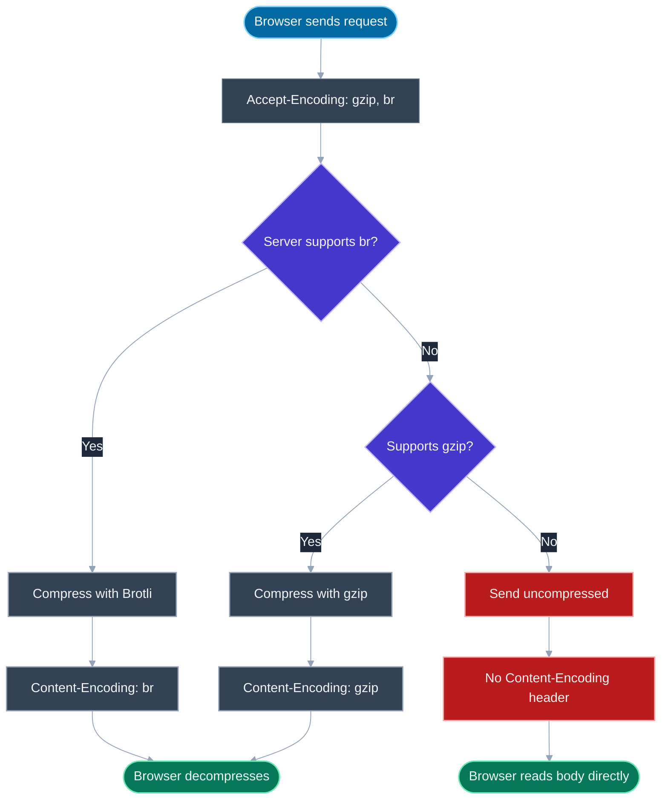
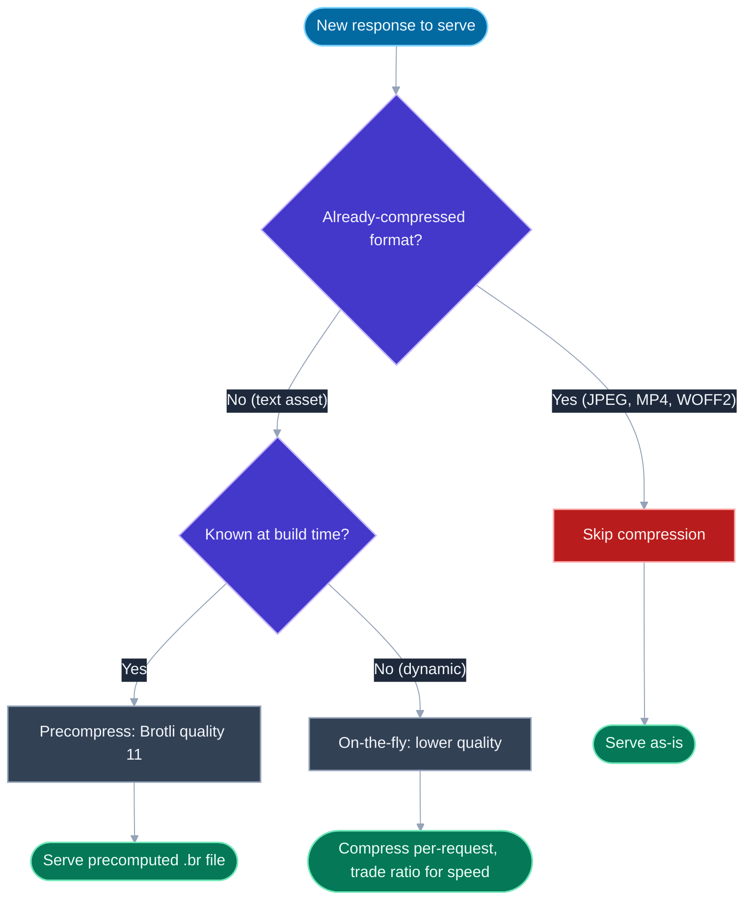

# Brotli vs Gzip Compression

## 🎯 Executive Summary

HTTP response compression is one of the cheapest performance wins available: the server compresses the response body before sending it, the browser decompresses it automatically, and the negotiation between the two happens through a single pair of headers. It's not a niche optimization — it's table stakes, and every text-based asset (HTML, CSS, JS, JSON, SVG) served uncompressed in production is a solved problem left unsolved.

At Lead/Staff level, the interesting part isn't "turn on gzip" — it's knowing there are two real algorithms in play (gzip and Brotli), that they trade off differently along compression ratio, CPU cost, and where that cost gets paid (build time vs. request time), and that misapplying either one (compressing already-compressed formats, or paying Brotli's slowest setting on every dynamic request) actively hurts. Interviewers use this topic as a quick calibration check: does the candidate know the mechanism (`Accept-Encoding`/`Content-Encoding` negotiation), the numbers (roughly what ratio to expect from each), and the operational trade-off (static precompression vs. dynamic on-the-fly), or do they just know "compression makes things smaller"?

It surfaces in performance-review rounds ("this endpoint's response is 300KB, what's the first thing you check"), infra/system-design rounds (CDN and origin configuration), and quick trivia checks (why compressing a JPEG does nothing). A Lead is expected to reason about this at the level of "what does our CDN do by default, and where would I look to confirm it," not just recite algorithm names.

---

## 📖 What Is It? (Plain-English Definition)

**In plain terms:** HTTP compression is the server squeezing a response down before sending it over the wire, and the browser unsquishing it back to the original bytes the instant it arrives — invisibly, with no code on either end doing anything special per request.

Think of it like vacuum-sealing clothes before putting them in a suitcase: the clothes take up far less space in transit, and you just unfold them the moment you unpack — nothing about the clothes themselves changed, only how compactly they traveled. The browser and server agree on which "vacuum bag" format to use (gzip or Brotli) through a short back-and-forth in the request/response headers, and from that point on it's fully automatic — no application code touches it.

Two things make this possible without either side having to guess: the browser tells the server up front which compression formats it's willing to accept, and the server's response says which one it actually used, so the browser knows exactly how to reverse it. That negotiation, and the two algorithms most commonly negotiated, are the substance of this topic.

---

## 🧠 Core Technical Deep Dive

### The negotiation mechanism: `Accept-Encoding` and `Content-Encoding`

Every browser request advertises which compression formats it can decode:

```
Accept-Encoding: gzip, deflate, br
```

The server picks one it supports (or none) and labels the response accordingly:

```
Content-Encoding: br
```

If the server doesn't support any of the offered encodings, or decides compression isn't worth it for this response, it simply omits `Content-Encoding` and sends the body uncompressed. This is a per-response negotiation — a CDN edge node can serve one client `br` and another client (an old browser without Brotli support) `gzip` for the exact same underlying asset, from the exact same cache tier, without the origin doing anything different.

> **Key takeaway:** compression is negotiated per-request via headers, not configured once and applied uniformly — the server must respect what the client says it can decode.

### gzip: the universal baseline

gzip is built on the DEFLATE algorithm (LZ77 dictionary matching + Huffman coding). It's supported by essentially every browser and HTTP client in existence, compresses and decompresses fast, and gets text assets down to roughly **25–35% of their original size** — a solid, unglamorous default.

### Brotli: smaller, at a compression-time cost

Brotli is a newer algorithm (`br`) that generally produces **15–25% smaller output than gzip** for text assets (JS, CSS, HTML) at comparable settings. Part of that gain comes from a static dictionary built into the algorithm itself, pre-populated with common strings, tokens, and patterns found in real web content (HTML tags, JS/CSS keywords, common phrases) — gzip has no such domain-specific dictionary, so Brotli starts with a head start gzip can't match.

The trade-off: at its highest quality setting, Brotli is noticeably slower to *compress* than gzip. Decompression speed, however, is comparable to gzip's — so there's effectively no extra cost on the client. This asymmetry is exactly why the static-vs-dynamic distinction below matters.

```
Original (JS bundle):     300 KB
gzip (level 6):           ~95 KB   (~32% of original)
Brotli (quality 11):      ~75 KB   (~25% of original, ~20% smaller than gzip)
```

### Static precompression vs. dynamic (on-the-fly) compression

For any asset that's known at build time and doesn't change per-request (a JS bundle, a CSS file, a static HTML page), the right move is **static precompression**: compress once, at Brotli's highest quality setting (quality 11), as a build step, and serve the precomputed `.br` file directly. The expensive compression cost is paid exactly once, at build time, never again — every subsequent request just streams the already-compressed bytes.

```bash
# Precompress at build time, highest quality
brotli --quality=11 --output=bundle.js.br bundle.js
gzip -9 -k bundle.js   # gzip fallback for clients without Brotli support
```

For content that genuinely can't be precomputed — a dynamically generated API response, a server-rendered HTML page with per-request data — compression has to happen **on the fly**, per request, which means paying the CPU cost in the request's critical path. The standard move here is to trade ratio for speed: use a much lower Brotli quality level (or fall back to gzip entirely), because spending the CPU time to hit Brotli quality 11 on every single request would add latency far worse than the extra few KB saved.

```javascript
// Express + compression middleware, tuned for dynamic responses
const compression = require('compression');
app.use(compression({
  level: 6,        // gzip: balanced, not maximum
  threshold: 1024,  // skip compressing tiny responses — not worth the CPU
}));
```

> **Key takeaway:** "static vs. dynamic" is really "who pays the compression cost, and when" — precompute at max quality when you can, degrade quality gracefully when you can't.

### What NOT to compress

Compression only helps when there's redundancy left to squeeze out. Formats that are already compressed (JPEG, PNG, MP4, WOFF2, already-gzipped `.gz` files) have had most of their redundancy removed by their own format's encoding — running gzip or Brotli over them again burns CPU for zero benefit, and can occasionally make the file slightly *larger* due to compression-format overhead.

```
# Wasteful: recompressing an already-compressed format
Content-Type: image/jpeg
Content-Encoding: gzip   # <- pointless, JPEG is already entropy-coded
```

A well-configured server or CDN should compress by content type — text-based MIME types (`text/*`, `application/json`, `application/javascript`, `image/svg+xml`) yes; binary media formats no.

> **Key takeaway:** compression eligibility should be driven by content type, not applied blanket to every response — compressing binary media is pure waste.

### CDN automation

In practice, most teams never hand-roll this negotiation — CDNs (Cloudflare, Fastly, CloudFront) automate it: they typically prefer `br` when the client supports it, fall back to `gzip` for clients that don't, and serve uncompressed only as a last resort. Knowing this is a Lead-level detail worth stating explicitly in an interview: the question isn't "do I need to implement compression negotiation," it's "do I know what my CDN already does by default, and how to verify it" (checking response headers in DevTools' Network tab is the fastest sanity check).

---

## 📊 Visual Architecture & Logic

### Diagram 1 — Accept-Encoding / Content-Encoding Negotiation



### Diagram 2 — Should This Asset Be Compressed, And How?



---

## 🏢 Interview Context & FAANG Signals

| Interview Stage | Format |
|---|---|
| **Trivia/Fundamentals Round** | "What's the difference between gzip and Brotli, and roughly how much smaller is Brotli?" |
| **Performance Round** | "This response is 300KB uncompressed — what headers do you check first, and what would you configure?" |
| **Code Review Round** | Reviewing a server/CDN config that compresses every response indiscriminately, including images |
| **System Design** | "Design static asset delivery for a high-traffic site" — precompression strategy, CDN encoding negotiation |

**Lead signals interviewers listen for:**
1. Do you know the negotiation is header-driven (`Accept-Encoding` → `Content-Encoding`), not something the client or server decides unilaterally?
2. Can you give rough, defensible numbers for gzip vs. Brotli ratios rather than just "Brotli is better"?
3. Do you distinguish static precompression (pay the cost once, at max quality) from dynamic on-the-fly compression (pay the cost per request, so quality must drop)?
4. Do you know to exclude already-compressed binary formats from compression, and why it's wasted CPU rather than merely "unnecessary"?
5. Do you know what your CDN does by default, and how to verify it via response headers, instead of assuming compression is "handled somewhere"?

---

## ⚔️ Lead Level vs Senior Level

**Question:** "Our API response times went up after we enabled Brotli compression on all endpoints. What happened?"

> **Senior Response:**
> "Brotli is slower than gzip, so maybe we should just turn it off, or switch back to gzip everywhere."

> **Staff/Lead Response:**
> "Brotli's slowness is almost entirely on the compression side, and it's heavily dependent on quality level — at quality 11 it's dramatically slower than gzip, but at a low quality level (4-5) it's comparable to gzip's cost while still beating gzip's ratio. If we turned on Brotli 'everywhere' without specifying a quality, a lot of libraries default to a high or maximum quality setting, which is fine for a build-time precompression step but disastrous applied per-request to dynamic API responses — we're paying max-quality compression cost synchronously in every request's critical path.
>
> The fix is to split the two cases: static assets (JS/CSS bundles) should be precompressed at quality 11 once at build time and served as static `.br` files, with zero per-request cost. Dynamic API responses should either use a low Brotli quality level tuned for speed, or fall back to gzip, which has a flatter cost curve. I'd also check whether these responses are worth compressing at all below some size threshold — compressing a 500-byte JSON response can cost more in CPU than it saves in transfer."

What separates them: the Senior response treats "Brotli" as a single monolithic cost and reaches for an all-or-nothing toggle; the Lead response separates the algorithm from its quality setting, matches the setting to whether the cost is paid once (build time) or repeatedly (request time), and adds a size-threshold consideration the question didn't even ask about.

---

## ⚠️ Common Pitfalls & Anti-Patterns

> ### ✕ Using Brotli Quality 11 for Dynamic, Per-Request Compression
> **Why it's wrong:** Quality 11 is tuned for maximum ratio at the cost of compression speed — fine when paid once at build time, but applied to every dynamic request it adds real latency to the critical path, often outweighing the bandwidth savings.
> **✓ Correct Lead Approach:** Reserve quality 11 for static precompression. For dynamic responses, use a low-to-mid Brotli quality level or fall back to gzip, trading ratio for speed deliberately.

---

> ### ✕ Compressing Already-Compressed Binary Formats
> **Why it's wrong:** JPEG, PNG, MP4, and WOFF2 already have most redundancy removed by their own encoding — running gzip or Brotli over them burns CPU for negligible or negative benefit (output can end up marginally larger due to format overhead).
> **✓ Correct Lead Approach:** Gate compression by content type — compress text-based MIME types, skip binary media formats entirely.

---

> ### ✕ Assuming the CDN "Just Handles" Compression Correctly
> **Why it's wrong:** Most CDNs do automate `br`/`gzip` negotiation well by default, but configurations can drift — a custom origin header, a misconfigured cache rule, or an older CDN tier can silently serve assets uncompressed without anyone noticing until a performance audit.
> **✓ Correct Lead Approach:** Periodically verify via response headers (`Content-Encoding` in DevTools' Network tab) that the expected encoding is actually being served, rather than assuming default behavior holds indefinitely.

---

> ### ✕ Compressing Responses Below a Reasonable Size Threshold
> **Why it's wrong:** For very small responses (a few hundred bytes), the CPU cost of compressing and the overhead of the compression format's own headers can exceed the bytes saved on the wire.
> **✓ Correct Lead Approach:** Set a minimum size threshold (commonly around 1KB) below which responses are sent uncompressed.

---

> ### ✕ Treating Gzip as Obsolete and Dropping It Entirely
> **Why it's wrong:** Not every client supports Brotli (older browsers, some non-browser HTTP clients, certain proxies), so serving only `br` with no fallback breaks compression — or the request entirely — for that traffic.
> **✓ Correct Lead Approach:** Always serve gzip as a fallback for clients whose `Accept-Encoding` doesn't include `br`, precomputing both `.br` and `.gz` for static assets where possible.

---

## 🛠️ Practice Scenarios

### Scenario 1: The Missing Header

**Problem:**
```
GET /app.bundle.js HTTP/1.1
Accept-Encoding: gzip, deflate, br
```
```
HTTP/1.1 200 OK
Content-Type: application/javascript
Content-Length: 412000
```
The response above has no `Content-Encoding` header despite the client offering `br` and `gzip`, and the bundle is served at its full 412KB. What's most likely misconfigured, and what would you check first?

<details>
<summary>Staff-Level Solution</summary>

The absence of `Content-Encoding` means the server chose not to compress this response at all — it's not a negotiation failure (the client clearly offered both `gzip` and `br`), it's a server/CDN configuration gap. The first things to check: whether compression is enabled for this content type at all (some configs whitelist only a subset of MIME types and `application/javascript` was missed or misspelled versus `text/javascript`), whether a reverse proxy or CDN rule in front of the origin is stripping or overriding `Content-Encoding`, and whether this route bypasses the CDN's static-asset caching tier entirely (e.g., served directly from an origin that never precompressed it). Confirm by curling the origin directly with `-H "Accept-Encoding: br"` and checking whether the origin itself compresses, to isolate origin misconfiguration from a CDN-layer issue.

</details>

---

### Scenario 2: The Slow Dynamic Endpoint

**Problem:**
```javascript
const compression = require('compression');
const zlib = require('zlib');

app.use(compression({
  brotli: {
    params: {
      [zlib.constants.BROTLI_PARAM_QUALITY]: 11
    }
  }
}));

app.get('/api/search', (req, res) => {
  res.json(runSearch(req.query.q)); // response size varies, 2KB-50KB
});
```
After deploying this, p95 latency on `/api/search` increased by 180ms. Diagnose and fix.

<details>
<summary>Staff-Level Solution</summary>

Quality 11 is Brotli's maximum compression setting — appropriate for a one-time build step where the cost is paid once, but here it's applied synchronously to every dynamic `/api/search` response, meaning the server pays max-quality compression cost inside the request's critical path on every single call. That's almost certainly the source of the added p95 latency, especially for the larger end of the 2KB-50KB response range.

Fix: drop the Brotli quality level dramatically for this dynamic route — something like quality 4-5 — which compresses close to gzip's speed while still beating gzip's ratio, or fall back to gzip entirely at a moderate level (`level: 6`) if simplicity is preferred. Also add a size threshold so the smallest responses (near the 2KB floor) skip compression altogether, since the fixed overhead of compression isn't worth it at that size. Re-measure p95 latency after the change to confirm the fix, rather than assuming the quality change alone is sufficient.

</details>

---

### Scenario 3: The Bloated Image CDN Bill

**Problem:**
```nginx
gzip on;
gzip_types *;
gzip_comp_level 6;
```
A CDN cost review shows CPU usage on the compression tier is unexpectedly high, and file-size audits show `.jpg` and `.mp4` assets being served with `Content-Encoding: gzip` at nearly the same size as the originals. What's wrong with this config, and how do you fix it?

<details>
<summary>Staff-Level Solution</summary>

`gzip_types *` compresses every MIME type indiscriminately, including already-compressed binary formats like JPEG and MP4. Those formats have had their redundancy squeezed out by their own encoding (DCT quantization for JPEG, motion compensation and entropy coding for MP4), so gzip finds almost nothing left to compress — the CPU cost of running the compressor is paid on every request for zero meaningful size reduction, and it can occasionally produce a marginally larger file due to gzip's own header/frame overhead.

Fix: scope `gzip_types` to an explicit list of compressible text-based MIME types only — `text/html text/css application/javascript application/json image/svg+xml` and similar — and leave binary media formats (`image/jpeg`, `image/png`, `video/mp4`) out entirely. Re-check the CDN's CPU usage and confirm via response headers that binary assets are no longer carrying a `Content-Encoding` header.

</details>
