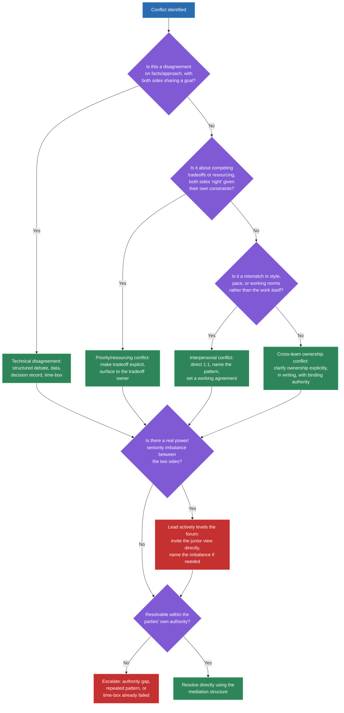
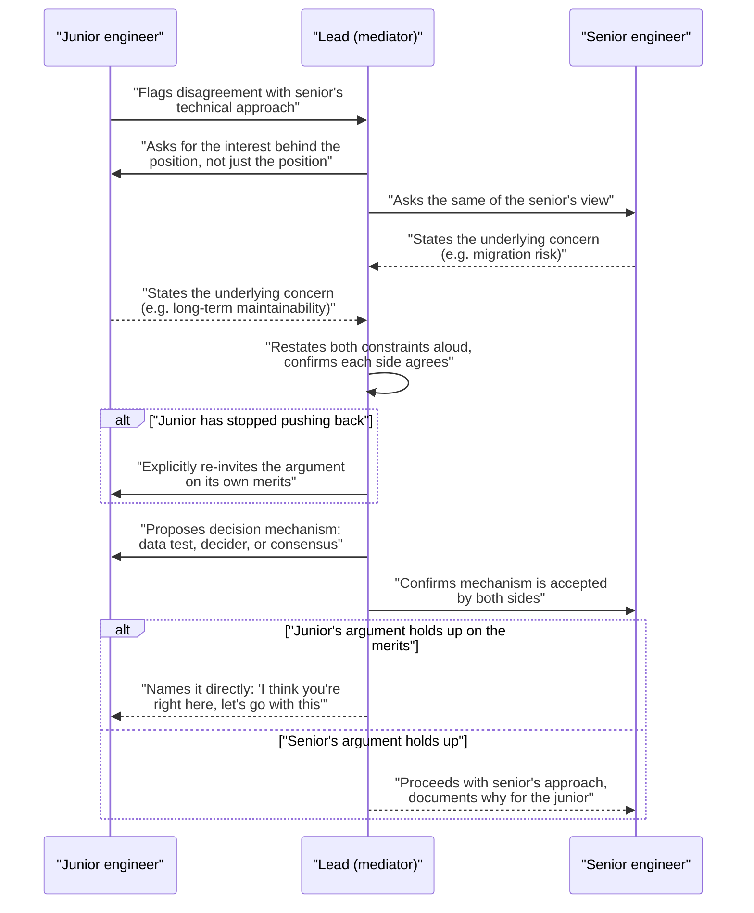

# Conflict resolution: peer, cross-functional, senior vs junior

## 🎯 Executive Summary

"Tell me about a conflict" is one of the most-asked behavioral questions in FAANG loops, and most candidates answer it as a single story with a single lesson: "I listened, we compromised, it worked out." That answer treats all conflict as one thing. It isn't — a technical disagreement between two Staff engineers, a PM cutting scope engineering thinks is unsafe, and two reports in open conflict with each other are three structurally different problems that call for three different moves.

The Lead-level signal isn't "can you resolve conflict" — most Senior engineers can do that in the easy cases. It's whether you diagnose *which kind* of conflict you're in before you pick a resolution approach, and whether you can act on a power-dynamic problem (two reports of unequal seniority, a senior stakeholder overruling a junior's correct call) rather than just observing it. This topic builds a framework for that diagnosis, plus a concrete in-the-room mediation structure.

## 🧠 Core Technical Deep Dive

### 1. Diagnose the conflict type before choosing a resolution approach

The single biggest mistake at this level is applying one generic "communication skills" playbook to every conflict. A disagreement over which caching strategy to use and a disagreement over whether a team owns a service boundary are not the same problem, and treating them the same way either wastes time (debating data when the real issue is who has authority to decide) or escalates unnecessarily (escalating something two engineers could resolve in twenty minutes with a shared doc).

| Conflict type | What it actually is | Resolution approach |
|---|---|---|
| **Technical disagreement** | Two people, same goal, different opinion on the best solution | Structured technical debate: bring data, write a decision record, time-box if consensus doesn't converge |
| **Priority / resourcing conflict** | Both sides are "right" given their own constraints — the disagreement is about tradeoffs, not facts | Make the tradeoff explicit and visible; surface it to whoever owns the tradeoff if it's above your authority |
| **Interpersonal / working-style conflict** | Not a disagreement about the work — a mismatch in communication style, pace, or working norms | Direct 1:1 conversation naming the pattern, not the specific incident; may need an explicit working agreement |
| **Cross-team ownership conflict** | Ambiguous or contested boundary over who owns a system, decision, or outcome | Clarify ownership explicitly, in writing, with the people who can actually make that call binding |

Most real conflicts are a blend, but there's usually a dominant type, and misdiagnosing it is what makes a resolution attempt fail. A "priority conflict" mistaken for a "technical disagreement" turns into an argument about facts when neither side actually disagrees on the facts — they disagree on what to sacrifice.

> **Key takeaway:** the first move in any conflict isn't proposing a solution — it's correctly naming which of these four types you're actually in, because the wrong resolution approach applied to the right conflict still fails.

### 2. Peer conflict: symmetric, direct, rarely needs escalation

Peer conflict — two Leads or Staff engineers disagreeing — is the easiest category precisely because the power dynamic is symmetric. Both sides can push back, neither is structurally disadvantaged, and that means the default move is to resolve it directly between the two of you, not route it through a manager.

The structure that works: state each position plainly, bring whatever data exists (benchmarks, prior incidents, a prototype), and write it down as a lightweight decision record even if the conversation stayed verbal. If the two of you genuinely can't converge after a real attempt, time-box it — pick a decider (often whoever owns the system long-term) rather than let the disagreement stall the work indefinitely.

> **Key takeaway:** peer conflict is the category where "resolve it yourselves first" is actually close to a safe default, because the power symmetry means escalating too early looks like an inability to work with peers, not a leadership failure.

### 3. Cross-functional conflict: translation, not assertion

Engineering-vs-product conflict over scope, timeline, or technical debt is rarely a case of one side being right and the other wrong — it's usually two groups optimizing different, both-legitimate objectives with different vocabularies. Product measures risk in missed dates and user impact; engineering measures risk in blast radius and long-term maintainability. Neither vocabulary is wrong, but talking past each other in them is what makes the conflict feel unresolvable.

The Lead's job here is translation, not winning the argument for engineering. That means converting "this will create tech debt" into "this increases the odds of a specific class of incident, with this rough likelihood and this blast radius" — something a PM can actually weigh against a date. It also means genuinely listening for what the deadline pressure is protecting, since it's rarely arbitrary.

| Vocabulary | Engineering says | Product hears | Better translation |
|---|---|---|---|
| Risk | "This will create tech debt" | Vague, hard to weigh | "This raises the chance of a P1 incident in this area, and the fix-later cost roughly doubles" |
| Time | "We need two more weeks" | Padding, foot-dragging | "Two more weeks buys us test coverage for the failure mode that caused last quarter's outage" |
| Priority | "This isn't the right thing to build" | Engineering overstepping | "Here's the tradeoff this choice makes, and who it affects — is that the tradeoff we want?" |

> **Key takeaway:** cross-functional conflict is solved by translating engineering concerns into terms the other function can actually weigh against their own constraints, not by asserting engineering's view more forcefully.

### 4. Senior-vs-junior conflict: the power dynamic makes "let them sort it out" unsafe

When two reports of unequal seniority are in conflict, the passive move — "work it out between yourselves" — is often the wrong one. A junior engineer disagreeing with a senior engineer isn't operating on a level playing field: there's a real asymmetry in credibility, confidence, and willingness to keep pushing back after being overruled once. If the junior engineer happens to be right, "let them sort it out" quietly favors whoever has more organizational weight, not whoever has the better argument.

The Lead's job in this situation is to actively create a fair forum rather than observe from the sidelines. That means explicitly inviting the junior engineer's reasoning into the room, asking direct questions that make their argument visible on its own merits, and being willing to name the power imbalance out loud if it's suppressing a legitimate disagreement.

| Signal the power dynamic is distorting the conflict | What to do about it |
|---|---|
| The junior engineer has stopped pushing back after one round | Explicitly ask for their view again, separately, and take it seriously on the merits |
| The senior engineer's confidence, not their argument, is winning the room | Ask the senior engineer to make the case in a way that would convince someone who disagrees |
| The junior engineer is right but deferring out of habit | Say so directly — "I think you're right here, let's go with your approach" — normalizing that seniority isn't the tiebreaker |

> **Key takeaway:** managing conflict between two reports of unequal seniority requires actively leveling the forum, not staying neutral — neutrality in an unequal fight isn't fair, it just preserves the existing power imbalance.

### 5. When to escalate vs. resolve directly

"Always try to resolve it yourself first" is not an absolute rule — it's a decent default that breaks in specific, nameable situations, and knowing when it breaks is the actual Staff-level judgment call.

| Escalate when | Resolve directly when |
|---|---|
| The conflict is about authority or ownership neither party can actually grant | Both parties have the standing to make the call themselves |
| A repeated pattern suggests a structural or personnel problem, not a one-off disagreement | It's a first occurrence, isolated to this decision |
| One side has structural power that's being used to suppress a legitimate concern (see section 4) | The power dynamic is roughly symmetric |
| The disagreement is blocking real progress and a time-box has already failed | There's still time to let a structured conversation work |
| The topic is above your remit (org design, headcount, compensation-adjacent) | It's a technical or process question within your actual authority |

Escalating too early reads as an inability to handle normal friction. Escalating too late — especially in the power-imbalance case from section 4 — reads as tolerating a pattern that's actively harming someone with less standing to fix it themselves. Both failure directions are real, which is exactly why this is a judgment call and not a fixed rule.

> **Key takeaway:** the decision to escalate should be driven by whether the conflict is actually resolvable at your level of authority and whether the power dynamic is fair — not by a blanket rule to always try direct resolution first or a reflex to escalate anything uncomfortable.

### 6. A mediation structure usable in the room

Most conflicts that go badly in a live conversation go badly because the group jumps straight to debating solutions before anyone has actually named the underlying interests, or agreed on how the decision will get made. A structure that holds up under pressure:

1. **Separate positions from interests.** A position is "we should use approach A." The interest underneath it might be "I'm worried about maintainability" or "I'm worried about missing the date." Get each side to state the interest, not just restate the position louder.
2. **Restate each side's actual constraint before proposing anything.** Say it back in your own words and confirm you got it right. This alone defuses a surprising amount of conflict, because most people are arguing to be heard, not just to win.
3. **Agree on the decision-making mechanism before debating the decision.** Is this a consensus call, a decider's call, a data-driven call once a specific test result comes in? Skipping this step means the group litigates the decision *and* the legitimacy of however it gets made, at the same time.
4. **Propose, don't declare.** Once the mechanism is agreed, put forward a resolution and check it against both stated interests — not just the one that's loudest in the room.

> **Key takeaway:** structured mediation works because it forces the group to agree on the *process* for deciding before anyone argues for a specific *outcome* — most conflicts that spiral do so because that ordering got skipped.

## 📊 Visual Architecture & Logic

### Diagram 1 — Diagnosing conflict type and routing to a resolution approach

### Diagram 2 — Mediating a senior-vs-junior conflict in the room

## 🏢 Interview Context & FAANG Signals

Conflict resolution is one of the most commonly asked behavioral prompts at every level — "tell me about a conflict with a peer," "tell me about a time you disagreed with a senior stakeholder," "tell me about conflict on your team." Every candidate has a story; the Lead-level bar is not having a story, it's demonstrating diagnosis before resolution.

**Lead signals interviewers listen for:**

- Naming *what kind* of conflict it was (technical / priority / interpersonal / ownership) before describing how it was resolved, rather than jumping straight to "and then we talked it out."
- A resolution approach that actually matches the diagnosis, not a generic "I listened and we compromised" applied regardless of conflict type.
- Evidence of translating across functions (engineering-to-product) rather than just asserting the engineering position more persuasively.
- Active intervention in a power-imbalanced conflict between reports, not passive observation or a hands-off "I let them work it out."
- A clear, reasoned answer for *why* they escalated or *why* they didn't — not a blanket rule applied without judgment.
- Willingness to describe a conflict where they were wrong and had to concede — this is a much stronger signal than a string of stories where they were always right.

## ⚔️ Lead Level vs Senior Level

A **Senior** response typically has one strong conflict story, usually a peer disagreement, resolved with something like "we talked it through, looked at the data, and agreed on an approach." That's a real answer, but it's the easiest category — symmetric power, direct resolution — and stopping there leaves the harder categories untested.

A **Staff/Lead** response can produce a different story for a different conflict type on request: a cross-functional scope fight where they had to translate rather than assert, a conflict between two reports where they had to actively intervene because of a power imbalance, a case where escalation was the right call and they can explain why. Critically, a Lead can also describe a conflict where *they* were wrong and had to concede — a Senior answer bank rarely includes this story, and its absence is itself a signal.

## ⚠️ Common Pitfalls & Anti-Patterns

> ### ✕ Answering every conflict question with the same "I listened and we compromised" story
> **Why it's wrong:** It signals one conflict-resolution mode, not a framework — and a good interviewer will immediately probe with "what if the other person outranked you" or "what if you were the one who was wrong," which this story usually can't survive.
> **✓ Correct Lead Approach:** Keep distinct stories ready for peer, cross-functional, and power-imbalanced conflict, and lead by naming which type it was before describing the resolution.

> ### ✕ Treating "resolve it yourself first" as an absolute rule
> **Why it's wrong:** Applied blindly, it means never escalating a power-imbalanced conflict where one side genuinely can't get a fair hearing on their own, or repeatedly re-litigating a conflict that's actually a structural/authority problem no direct conversation can fix.
> **✓ Correct Lead Approach:** Escalate when authority, a repeated pattern, or a real power imbalance is in play; resolve directly when the parties have symmetric standing and it's a first occurrence.

> ### ✕ Letting two reports of unequal seniority "sort it out between themselves"
> **Why it's wrong:** Passivity in an unequal conflict isn't neutral — it defaults to favoring whoever has more organizational weight or confidence, regardless of who has the better argument, and quietly teaches the junior engineer that pushing back doesn't work.
> **✓ Correct Lead Approach:** Actively create a fair forum: invite the junior engineer's reasoning explicitly, evaluate it on the merits, and name the power dynamic out loud if it's suppressing a legitimate disagreement.

> ### ✕ Winning a cross-functional argument by asserting engineering is right
> **Why it's wrong:** Product and design aren't wrong for optimizing dates and user impact — they're using a different, equally legitimate vocabulary, and "engineering knows best" reads as a Lead who can't operate outside their own function.
> **✓ Correct Lead Approach:** Translate the engineering concern into the other function's terms (likelihood and blast radius of a specific risk, not "tech debt" as an abstraction) so it can actually be weighed against their constraints.

> ### ✕ Debating the decision before agreeing on how the decision gets made
> **Why it's wrong:** Without an agreed decision mechanism, the group ends up litigating both the outcome and the legitimacy of the process simultaneously, which is what makes a conflict spiral instead of converge.
> **✓ Correct Lead Approach:** Explicitly agree on the mechanism first — consensus, a named decider, or a specific data test — before anyone argues for a particular resolution.

## 🛠️ Practice Scenarios

### Scenario 1 — A Peer Architecture Disagreement

Another Staff engineer wants to introduce a new state-management library for a service you jointly own; you think the existing pattern is sufficient and the migration cost isn't justified.

Staff-Level Solution

Diagnose this as a technical disagreement, not a priority or interpersonal conflict — you share the same goal (a maintainable service), you disagree on the approach. Bring the actual cost: estimate migration effort, list the specific pain points the new library would fix, and ask whether those pain points are real and frequent enough to justify the cost, or theoretical.

If the data doesn't settle it, propose a time-box: a small, scoped prototype on one module, reviewed against agreed criteria before deciding on the rest of the service. Write the outcome down as a short decision record either way, so the reasoning survives past this conversation and doesn't get re-litigated in six months.

### Scenario 2 — A PM Cutting Scope Engineering Thinks Is Unsafe

A PM wants to cut the error-handling and retry logic from a launch to hit a date; engineering believes this creates a real risk of data loss under failure conditions.

Staff-Level Solution

Recognize this as a priority/resourcing conflict wearing a technical-disagreement costume — the PM isn't wrong that the date matters, and engineering isn't wrong that the risk is real; the actual conflict is which one gets sacrificed. Translate the risk into the PM's vocabulary: not "this is unsafe" but "under this specific failure condition, X% of requests in this range would silently lose data, and the fix-after-launch cost is roughly Y."

Propose a smaller scope that keeps the failure mode covered — often a stripped-down retry for the highest-risk path only — rather than an all-or-nothing framing. If the PM still wants to ship without it after seeing the translated risk, put the tradeoff in writing and get explicit sign-off from whoever owns launch risk, so the decision is made by someone with the authority to accept it, not defaulted into by omission.

### Scenario 3 — Two Reports in Open Conflict

Two engineers on your team have an ongoing disagreement over ownership of a shared module that's started showing up as friction in stand-ups and PR reviews.

Staff-Level Solution

Don't let it keep surfacing indirectly through review comments — pull both into a direct conversation and diagnose the type first: this reads like a cross-team-ownership conflict (who owns what) tangled with an interpersonal pattern (friction has become the default mode of interaction). Separate the two: resolve ownership explicitly and in writing first, since ambiguity there is probably fueling the interpersonal friction.

Use the mediation structure — get each engineer's actual interest (one wants clean boundaries to avoid breaking their consumers, the other wants velocity to ship a dependent feature), restate both, and agree on a decision mechanism (in this case, likely your call as the owner of the team, since it's a structural question neither of them can resolve alone). Follow up after a few weeks to confirm the friction actually resolved, not just went quiet.

### Scenario 4 — A Senior Stakeholder Overruling a Technical Call

A senior stakeholder overrides a technical decision your team made, without engaging with the reasoning behind it, and the team is frustrated.

Staff-Level Solution

Before reacting, check whether this is actually a priority conflict (the stakeholder has context on constraints the team doesn't) or a genuine case of authority being used to shortcut a decision without engagement. Ask directly, in a 1:1: "help me understand what's driving this call" — framed as seeking the missing context, not as a challenge.

If there's real context the team was missing, bring it back and explain the reasoning, closing the loop so it doesn't read as a decision "handed down" for no reason. If there genuinely isn't good reasoning and it's a pattern, not a one-off, that's the escalate case from section 5 — raise it as a process concern (decisions overriding technical work should engage with the reasoning) rather than relitigating this one instance.

### Scenario 5 — A Cross-Team Ownership Dispute

Two teams both believe they own a shared API gateway, and a recent incident response was delayed because neither team was sure who was on the hook to respond.

Staff-Level Solution

This is squarely a cross-team ownership conflict, and the fix is not a conversation about who's "more right" — it's an explicit, written ownership decision made by someone with authority over both teams. Get both teams' actual constraints on the table first (one may be blocked from taking ownership due to headcount, the other may have historical context the incident response needed).

Propose a clear split — likely by component boundary or by responsibility type (build vs. on-call) rather than a vague joint-ownership arrangement, since joint ownership is what caused the original ambiguity. Document it somewhere durable (an ownership registry, a service catalog entry) so the next incident doesn't reopen the same question under pressure.

### Scenario 6 — A Conflict That Needs Escalation

You've tried twice to resolve a recurring disagreement between your team and another team over release cadence, and both attempts have stalled without resolution.

Staff-Level Solution

Recognize the escalate signal from section 5: a repeated pattern after a genuine direct attempt, not a first occurrence, and it's likely an authority question (whose release process takes precedence) that neither team can grant itself. Escalate to whoever has authority over both teams, framed factually — what was tried, what specifically stalled, and what decision is actually needed — not as a complaint about the other team.

Bring a proposed resolution, not just the problem, since escalating a fully open-ended question reads as offloading a decision you could have shaped. Make clear you attempted direct resolution first, so the escalation reads as good judgment about when direct resolution had run its course, not as a first resort.

### Scenario 7 — A Conflict Where the Lead Was Actually Wrong

You pushed hard for a specific technical approach in a disagreement with a peer; after implementation, it becomes clear their alternative would have avoided a problem you're now dealing with.

Staff-Level Solution

Concede clearly and early, without burying it in caveats — "you were right about this, here's specifically what I missed" is more credible and more useful to the relationship than a hedged half-acknowledgment. Identify the actual gap in your original reasoning (what data or context you didn't have, or discounted) so the concession is substantive, not just polite.

Use it as the trigger to actually change course, not just acknowledge the mistake while continuing the original approach — a concession without a resulting change in direction reads as conflict-avoidance, not real update. If this is a recurring pattern (you tend to underweight a certain kind of concern), name that to yourself and to trusted peers, since noticing your own bias is a stronger long-term signal than any single instance of being wrong.

### Scenario 8 — A Remote/Async Conflict Escalating Over Slack

A technical disagreement in a Slack thread has grown heated over several hours, with terse replies and visible frustration, before you notice it.

Staff-Level Solution

Recognize that async text is a bad medium for a conflict that's already escalated — tone is easy to misread, and rapid-fire replies remove the pause that in-person conversation naturally has. Interrupt the thread directly: post that you're pulling this into a quick call, not to shut down the disagreement but to give it a medium where it can actually resolve.

In the call, apply the mediation structure from section 6 starting with restating each side's position as you understand it from the thread, since a likely source of the heat is that neither side feels accurately heard in text. Afterward, post a short summary back in the thread — the diagnosis, the agreed resolution, and the decision mechanism used — so the rest of the channel sees it resolved, not just gone quiet.

