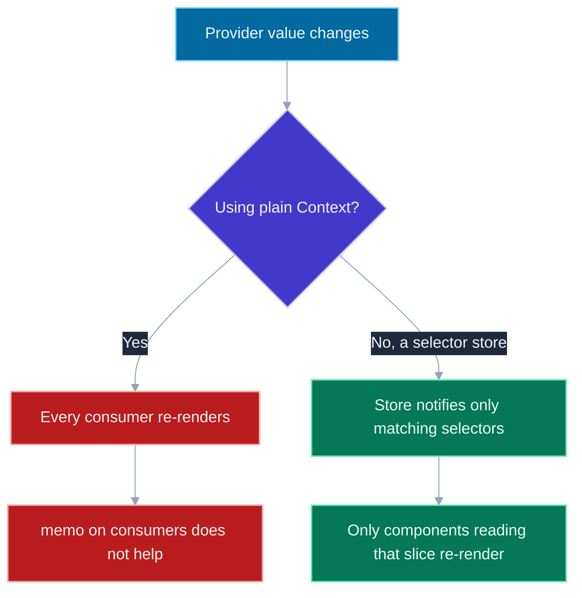
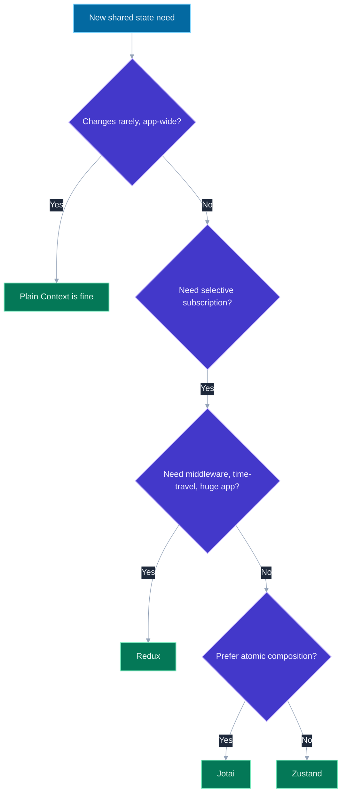

# Context API Pitfalls and Alternatives (Zustand, Jotai, Recoil)

## 🎯 Executive Summary

Context solves exactly one problem — avoiding prop drilling by letting a value skip past intermediate components that don't care about it — and it's routinely reached for as if it solved a second, much harder problem: state management. It doesn't. Context has no concept of subscribing to *part* of a value, no built-in devtools, no computed/derived state, and — the detail that produces real production performance bugs — **every consumer of a context re-renders whenever the Provider's value reference changes, full stop, regardless of `React.memo`.**

This is a must-know topic at Lead level because the decision "Context, or a real state library" is an architectural call with a real cost either way: reach for Context by default and a fast-changing value quietly turns every consumer into a re-render liability; reach for a state library by default and you've added a dependency, a learning curve, and indirection to a value three components deep in one small tree actually needed. Interviewers use this to test whether a candidate reasons about the *shape* of the state problem — how often it changes, how many components need it, whether they need all of it or just a slice — rather than reflexively defaulting to whatever they used at their last job.

## 📖 What Is It? (Plain-English Definition)

**In plain terms:** Context is React's built-in way to make a value available to every component in a subtree without manually passing it down as a prop through every layer in between. `useContext(MyContext)` reads whatever the nearest `<MyContext.Provider value={...}>` above it is currently providing.

The problem it solves is real and common: without it, a value needed by a deeply nested component has to be threaded through every component in between as a prop, even ones that have no use for it themselves — "prop drilling." Context lets you skip straight from the Provider to the consumer.

What Context does *not* give you, despite looking like it might: a way for a component to subscribe to just one field of that value and ignore the rest. Every consumer gets the whole value object, and React's only way of deciding "did this change" is comparing the *entire* value by reference — which is precisely why a Context holding both a fast-changing field and a slow-changing one drags every consumer along at the fast field's rate, a bug thoroughly demonstrated in this repo's [React DevTools Profiler resource](resources/react-devtools-profiler.html#context-scenario). Zustand, Jotai, and Recoil exist specifically to add that missing piece: selective subscription, so a component only re-renders when the specific slice it actually reads has changed.

---

## 🧠 Core Technical Deep Dive

### The mechanism, and the pitfall it creates

```javascript
const AppContext = createContext(null);

function App() {
  const [user, setUser] = useState(null);
  const [notifications, setNotifications] = useState([]);

  // New object every render - every consumer re-renders on every App render,
  // whether it reads `user`, `notifications`, or neither.
  const value = { user, setUser, notifications, setNotifications };

  return (
    <AppContext.Provider value={value}>
      <Sidebar />      {/* only reads `user` */}
      <Notifications /> {/* only reads `notifications` */}
    </AppContext.Provider>
  );
}
```

`Notifications` re-rendering every time `user` changes (and vice versa) isn't a bug in React — it's Context working exactly as designed. `React.memo` on `Sidebar`/`Notifications` doesn't help either, because context reads bypass the parent-prop comparison memo relies on entirely. The fix inside plain Context is always some version of *splitting the context* — `UserContext` and `NotificationsContext` as two separate contexts, so each consumer subscribes only to the one it needs — but that's manual, easy to forget as an app grows, and doesn't scale past a handful of independent concerns before you're maintaining a dozen tiny context files.

### What Context structurally cannot do, even split perfectly

Even a perfectly-split set of contexts can't express **derived state** ("give me `true` only when `cart.items.length > 0`, and only re-render when *that boolean* flips, not on every cart mutation") without hand-rolling `useMemo` and comparison logic yourself at every call site. It also has no equivalent of Redux's middleware (logging, persistence, undo/redo), no time-travel debugging, and no dedicated devtools extension — `useContext` shows up in the Components tab, but there's no Context-specific debugging tool the way Redux DevTools or Zustand's devtools middleware provide.

### Selector-based stores: the actual fix for selective subscription

**Zustand** keeps state in a store *outside* the React tree entirely — no Provider required — and components subscribe via a selector function:

```javascript
const useStore = create((set) => ({
  user: null,
  notifications: [],
  setUser: (user) => set({ user }),
}));

function Sidebar() {
  const user = useStore((state) => state.user); // only re-renders when `user` changes
  return <div>{user?.name}</div>;
}
```

The selector (`state => state.user`) is the mechanism Context has no equivalent for: Zustand compares the *selected slice*, not the whole store object, so `Sidebar` is entirely unaffected by `notifications` changing. This single property is why reaching for Zustand "fixes" the exact re-render problem splitting contexts manually was working around.

**Jotai** takes this further with an atomic model: instead of one big store object, state is composed of many small, independent `atom()` values, and a component subscribes only to the specific atoms it reads:

```javascript
const userAtom = atom(null);
const notificationsAtom = atom([]);

function Sidebar() {
  const user = useAtomValue(userAtom); // isolated from notificationsAtom entirely
  return <div>{user?.name}</div>;
}
```

Where Zustand's selector *filters* a shared object, Jotai's atoms are independent from the start — composition happens bottom-up (derived atoms built from other atoms) rather than top-down (one object, sliced after the fact).

**Recoil** pioneered this same atom-based model at Meta before Jotai existed, and adds selectors (derived, memoized state computed from atoms) and some experimental concurrent-mode integrations. It's mentioned here mainly because it still appears in older codebases and interview questions; Jotai has become the more actively maintained choice for new atomic-state work, with a smaller API surface and no separate selector concept to learn (derivation is just another atom).

**Redux** (the veteran of this list) uses a single global store, explicit dispatched actions, and reducers — `useSelector` provides the same fine-grained-subscription property as Zustand's selectors, and it remains the heaviest-weight but most tooling-rich option: real middleware, mature devtools with time-travel debugging, and the largest ecosystem of patterns for very large applications.

### When Context is still the right call

None of this makes Context wrong by default — it makes it situational. Context is a genuinely good fit for **values that change rarely and are needed broadly**: the current authenticated user, the active locale, a resolved theme. These change on login/logout, a language switch, or a theme toggle — infrequent, app-wide events where "every consumer re-renders" is a non-issue because it happens once in a while, not every keystroke. Reaching for a state library to hold a value that changes twice per session is adding a dependency to solve a problem that doesn't exist yet.

---

## 📊 Visual Architecture & Logic

### Diagram 1: Context's Broadcast Model vs. a Selector Store



### Diagram 2: Choosing an Approach



---

## 🏢 Interview Context & FAANG Signals

| Interview Stage | Format |
|---|---|
| **System Design** | "How would you share auth state across this app" — expects a shape-of-the-problem answer, not a reflexive library name |
| **Debugging Round** | A component re-rendering far more than expected, traced back to an unsplit, fast-changing context |
| **Architecture Discussion** | Justifying a state-management library choice for a specific app, not a general preference |

**Lead signals interviewers listen for:**

1. **Naming the real limitation precisely** — that Context lacks selective subscription, not a vague "Context is slow."
2. **Choosing based on change frequency and consumer count**, not familiarity or trend.
3. **Knowing `memo` doesn't help with context re-renders** — a frequent, revealing gap.
4. **Distinguishing the atomic model (Jotai/Recoil) from the selector-on-a-store model (Zustand/Redux)** as two different compositional philosophies, not interchangeable syntax for the same thing.

## ⚔️ Lead Level vs Senior Level

**Question:** "Our app-wide `AppContext` is causing half the UI to re-render on every keystroke in a search box whose value also lives there. How do you fix it?"

**Senior Response:**
> Wrap the components in `React.memo` so they don't re-render unnecessarily.

Doesn't work here, and reveals a gap in understanding why: context reads aren't blocked by memo.

---

**Staff/Lead Response:**
> `memo` won't help — any component reading this context re-renders on every value change regardless of its own props. The real issue is the search term (which changes on every keystroke) and slower-changing values like the current user are bundled into one context object, so every consumer pays for the keystroke rate.
>
> Splitting the search state into its own context fixes it structurally, but if we expect more fast-changing, independently-needed slices like this over time, I'd rather move to a selector-based store now — Zustand's a light enough addition that it doesn't need to be a big architectural debate, and it removes this whole category of bug going forward instead of us manually re-splitting contexts every time a new one shows up.

The Lead answer identifies the actual mechanism, fixes the immediate bug, and makes a forward-looking call about whether the underlying pattern is worth solving once, structurally.

## ⚠️ Common Pitfalls & Anti-Patterns

> ### ✕ One Giant Context for the Whole App's State
> **Why it's wrong:** Bundles unrelated concerns with wildly different change frequencies into one value object — any one field changing re-renders every consumer of the whole context.
> **✓ Correct Lead Approach:** Split by change frequency and concern, or move fast-changing/widely-consumed state to a selector-based store instead of managing an ever-growing set of split contexts by hand.

---

> ### ✕ Assuming `React.memo` Fixes Context Re-renders
> **Why it's wrong:** Context subscriptions bypass the prop-comparison mechanism memo relies on entirely — a memoized component still re-renders when a context it reads changes, regardless of its own props.
> **✓ Correct Lead Approach:** Fix the actual context shape (split it, or move to selective subscription) rather than adding memoization that can't address this cause.

---

> ### ✕ Reaching for Redux (or any library) for a Rarely-Changing, Narrowly-Needed Value
> **Why it's wrong:** Adds a dependency, boilerplate, and indirection to solve a re-render problem that a value like "current theme" never actually causes in the first place.
> **✓ Correct Lead Approach:** Match the tool to the actual change frequency and consumer count — plain Context remains the right, simplest choice for values like theme, locale, and the authenticated user object.

---

> ### ✕ Choosing a State Library by Familiarity Instead of Fit
> **Why it's wrong:** "We used Redux at my last job" isn't a reason if the app has no need for middleware, time-travel debugging, or a single global store — it's unnecessary weight for a problem a lighter selector store solves just as well.
> **✓ Correct Lead Approach:** Justify the choice from the app's actual requirements — number of independent state slices, need for devtools/middleware, team size and familiarity as a tiebreaker, not the primary reason.

## 🛠️ Practice Scenarios

### Scenario 1: The Slow Sidebar

**Problem:** A `Sidebar` component that only displays the current user's name re-renders on every keystroke in an unrelated search box. Both live under the same `AppContext`. Diagnose and propose two fixes at different levels of investment.

<details>
<summary>Staff-Level Solution</summary>

**Diagnosis:** `AppContext`'s value object bundles `searchTerm` (changes every keystroke) with `user` (changes rarely). Every keystroke recreates the Provider's value object, and `Sidebar` — subscribed to the same context, regardless of which fields it reads — re-renders every time.

**Cheap fix:** split into `SearchContext` and `UserContext`. `Sidebar` only subscribes to `UserContext`, which now only changes on login/logout.

**Structural fix (if this keeps happening across the app):** move to a selector-based store (Zustand or Jotai) so any future fast/slow state combination is handled by selective subscription automatically, rather than needing a manual context split every time.

**Lead framing:** "The cheap fix solves this one instance. The structural fix answers whether this is a one-off or a recurring shape of bug — if it's recurring, the real fix is removing the need to notice and split by hand at all."

</details>

---

### Scenario 2: Choosing Between Zustand and Jotai

**Problem:** A dashboard has a dozen independent widgets, each with its own local-ish state that occasionally needs to be read by a sibling widget or a summary bar. Which model fits better, and why?

<details>
<summary>Staff-Level Solution</summary>

**Jotai fits well here:** a dozen loosely-related, mostly-independent pieces of state map naturally onto a dozen small atoms, composed bottom-up — a summary bar can read exactly the two or three atoms it needs without any single "dashboard store" object growing to own all twelve widgets' state.

**Zustand would also work**, structured as one store with a selector per widget, but the atomic model maps more directly onto "independent widgets" as the starting mental model, whereas Zustand's single-store shape is a better fit when there's a more central, cohesive piece of app state (auth, a shopping cart) that many things read.

**Lead framing:** "This isn't a 'better' library question — it's whether the state naturally decomposes into independent units (favor atoms) or centers around one cohesive object most things touch (favor a single selector-based store)."

</details>
