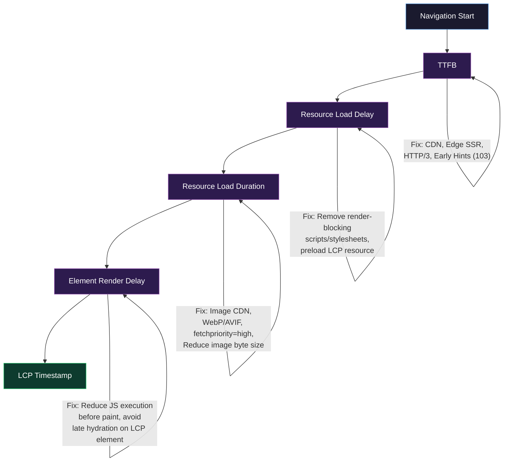
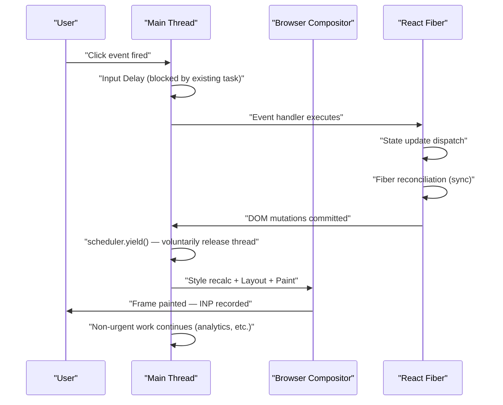
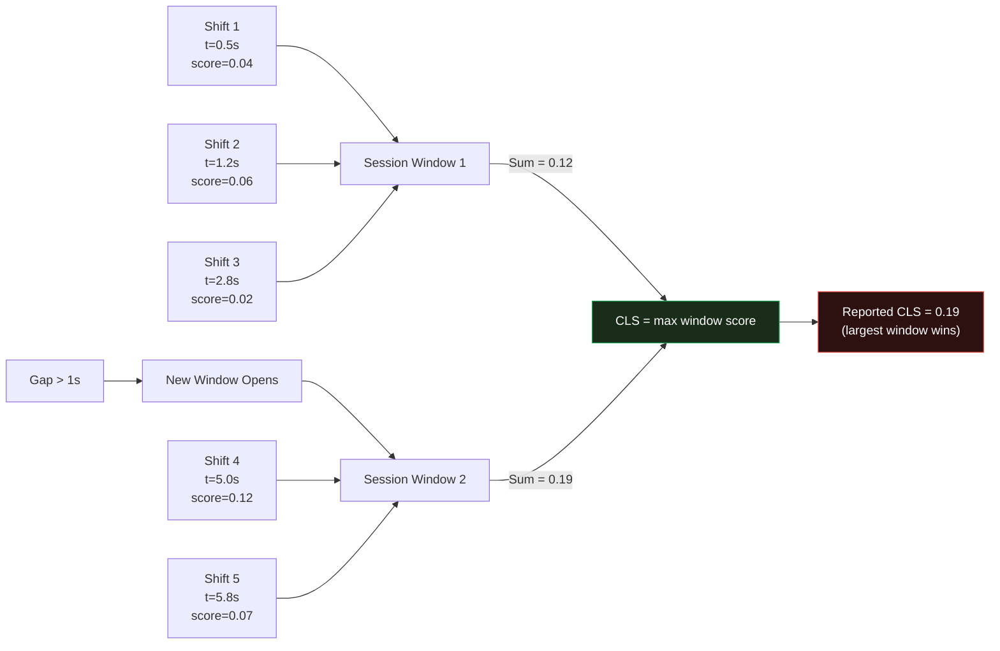

# Core Web Vitals: LCP, CLS, INP — Definitions, Thresholds, Improvements

---

## 🎯 Executive Summary

Core Web Vitals are Google's distillation of user-perceived performance into three measurable signals — and they directly influence Search ranking via the Page Experience signal. For a Frontend Lead, knowing the thresholds is table stakes. What FAANG interviewers are actually probing for: **can you own the performance budget end-to-end** — from architecture decisions that prevent regressions, to instrumentation that catches them in production, to cross-team communication that translates metric deltas into business outcomes?

The three signals measure distinct user experience dimensions:

| Metric | Measures | Good | Needs Improvement | Poor |
|--------|----------|------|-------------------|------|
| **LCP** (Largest Contentful Paint) | Perceived load speed | ≤ 2.5s | 2.5s – 4.0s | > 4.0s |
| **CLS** (Cumulative Layout Shift) | Visual stability | ≤ 0.1 | 0.1 – 0.25 | > 0.25 |
| **INP** (Interaction to Next Paint) | Runtime responsiveness | ≤ 200ms | 200ms – 500ms | > 500ms |

CWV is measured at the **75th percentile** of page loads across real users (field data via CrUX), not median, not p95. That threshold choice is intentional and architecturally significant — your optimization strategy must target the slow cohort, not average users.

**Why this is a must-know for Leads:** CWV failures are rarely caused by a single component. They're systemic — caused by architectural decisions around resource loading, render scheduling, third-party script governance, and framework hydration patterns. A Lead who can only recite definitions will be filtered out; one who maps CWV degradation to root causes in the rendering pipeline gets the offer.

---

## 🧠 Core Technical Deep Dive

### LCP — Largest Contentful Paint

#### What it actually measures

LCP tracks the render time of the **largest image or text block** visible in the viewport, relative to when the page navigation started. "Largest" is defined by reported size (rendered size, not intrinsic), clipped to the viewport. Element candidates: ``, `<image>` inside SVG, `<video>` (poster image), elements with `url()` background-image, and block-level text nodes.

LCP is **not** Time to First Byte. It is not First Contentful Paint. It is not the time your hero component mounts. These are common conflations that a Senior dev makes; a Lead understands the distinct causal chain from TTFB → FCP → LCP.

#### The causal chain

```
Navigation Start
    │
    ├─► DNS + TCP + TLS (network stack)
    │
    ├─► TTFB (first byte of HTML document)
    │
    ├─► HTML parse → discover LCP resource
    │        │
    │        └─► Is it in initial HTML? → fetch starts early
    │            Is it lazy-loaded? → fetch starts late (CWV disaster)
    │
    ├─► Resource fetch (blocked by: render-blocking resources, bandwidth, CDN proximity)
    │
    ├─► Decode + layout → element visible in viewport
    │
    └─► LCP timestamp recorded
```

#### Why LCP is hard to improve at scale

LCP has **four sub-parts** identified in the Web Vitals spec:

1. **Time to First Byte (TTFB)** — server/CDN latency
2. **Resource load delay** — time from TTFB to when the LCP resource starts fetching (blocked by render-blocking scripts/styles)
3. **Resource load duration** — actual fetch time of the LCP resource
4. **Element render delay** — time from resource loaded to paint (blocked by JS execution on main thread)

Each sub-part has a different owner (infra, HTML structure, CDN, JS architecture) and a different fix. A Lead maps the sub-part to the root cause; a Senior optimizes `loading="lazy"` removal and calls it done.

#### Preload vs Prefetch vs Early Hints

```html
<!-- Fetch LCP image at highest priority, before parser sees it -->
<link rel="preload" as="image" href="/hero.webp" fetchpriority="high">

<!-- HTTP 103 Early Hints — server sends before HTML is ready to stream -->
<!-- This fires before TTFB, the only mechanism that does -->
Link: </hero.webp>; rel=preload; as=image
```

`fetchpriority="high"` on the LCP `` element signals to the browser's preload scanner to elevate its network priority. Without it, the browser may fetch other subresources at equal or higher priority.

**Critical nuance:** `rel="preload"` without `fetchpriority="high"` is still subject to browser heuristics. On low-end devices, it can paradoxically delay LCP by consuming bandwidth that would've gone to the HTML document itself.

#### LCP and Server-Side Rendering

In SSR/SSG architectures (Next.js, Remix, Nuxt), LCP should be fast by default — but hydration can introduce element render delay (sub-part 4). If the LCP element is conditionally rendered by a client-side component that rehydrates late, the browser reports the pre-hydration placeholder as LCP, not the actual content. This creates a false-good LCP in lab tools and a false-bad experience in the field.

---

### CLS — Cumulative Layout Shift

#### What it actually measures

CLS is the **sum of all individual layout shift scores** throughout the entire page lifespan, where each shift score = `impact_fraction × distance_fraction`.

- `impact_fraction`: the viewport fraction affected by the shift
- `distance_fraction`: the maximum distance any element moved, as a fraction of viewport

Since 2021, Google uses a **session window** approach: shifts are grouped into windows of max 5 seconds with ≤1 second gaps, and only the largest window is reported. This prevents runaway CLS from infinitely-scrolling pages.

#### Common CLS sources and their precision fixes

**1. Images without explicit dimensions**

```html
<!-- Bad: browser allocates 0×0, reflows when image loads -->


<!-- Good: browser reserves correct space immediately -->

<!-- OR use aspect-ratio -->

```

**2. Dynamically injected content above existing content**

The most common offender is banner/toast/cookie-consent injection. The fix is **reserving space upfront** with a min-height skeleton or CSS containment, not deferring the injection.

**3. Web Fonts causing FOUT/FOIT**

```css
/* Bad: font swap causes CLS if fallback metrics differ significantly */
@font-face {
  font-family: 'Heading';
  src: url('/fonts/heading.woff2');
  font-display: swap; /* ← triggers CLS */
}

/* Better: use size-adjust + ascent-override to match fallback metrics */
@font-face {
  font-family: 'HeadingFallback';
  src: local('Arial');
  size-adjust: 105%;
  ascent-override: 90%;
  descent-override: 22%;
}
```

The **CSS Font Loading API** combined with `font-display: optional` is architecturally superior for above-the-fold content: if the font isn't cached, use the fallback. No swap, no shift.

**4. Animations that trigger layout**

Any CSS property that triggers layout recalculation causes potential CLS: `top`, `left`, `width`, `height`, `margin`, `padding`. Correct approach: animate only `transform` and `opacity`, which run on the compositor thread and don't affect layout.

```css
/* Bad: triggers layout, can cause CLS */
.modal { transition: top 0.3s ease; }

/* Good: compositor-only, zero CLS */
.modal { transition: transform 0.3s ease; transform: translateY(0); }
.modal.hidden { transform: translateY(-100%); }
```

---

### INP — Interaction to Next Paint

INP replaced FID (First Input Delay) as a Core Web Vital in March 2024. This is the metric most Senior devs are weakest on, and it's the one most relevant to complex SPAs.

#### What it actually measures

INP measures the **latency from user interaction to the next frame being painted**, across **all interactions** during the page lifecycle, reporting the worst one (with some outlier capping). An "interaction" is: click, keydown, keyup, pointerdown, pointerup, or any touch event. **Scroll and hover are excluded.**

FID only measured the delay before the first event handler ran. INP measures the full pipeline:

```
User Interaction
    │
    ├─► Input delay (main thread busy — longest task blocking)
    │
    ├─► Processing time (event handlers execute)
    │
    └─► Presentation delay (style + layout + paint + composite)
         │
         └─► Frame painted → INP timestamp
```

This is architecturally significant: **the browser cannot paint a new frame while the main thread is executing JavaScript**. Every synchronous operation in your event handler — Redux dispatch + reducer chain, React re-render, third-party analytics flush — adds to presentation delay.

#### The Scheduler API and `scheduler.yield()`

The modern fix for INP isn't just "break up long tasks." It's **yielding to the browser at the right moment in the event handler pipeline**.

```javascript
// Bad: single long task, browser cannot paint until this completes
button.addEventListener('click', async () => {
  const data = processLargeDataset(); // 80ms
  updateDOM(data);                    // 20ms
  sendAnalytics();                    // 30ms
  // Total: 130ms of main thread blocking → INP > 200ms
});

// Good: yield between phases, browser can paint after DOM update
button.addEventListener('click', async () => {
  const data = processLargeDataset(); // 80ms
  updateDOM(data);                    // 20ms
  
  // Yield here — browser sees DOM update, can paint the next frame
  await scheduler.yield(); // Chrome 115+, polyfill available
  
  sendAnalytics();          // Runs after next paint, invisible to user
});
```

`scheduler.yield()` is semantically stronger than `setTimeout(fn, 0)` or `queueMicrotask()` because it yields to the browser's task queue with higher priority than a macrotask but lower priority than user input — i.e., it won't starve interactions.

#### React and INP

React 18's concurrent rendering helps INP but does **not solve it automatically**. `startTransition` marks updates as non-urgent, allowing React to interrupt them for higher-priority renders. But:

- `startTransition` only defers React's rendering work, not the initial event handler execution
- Urgent state updates inside an event handler still block the frame
- Heavy reducers in `useReducer` or large Zustand selectors still run synchronously before any yield

```typescript
// INP trap: startTransition doesn't help with processing delay
const handleSearch = (e: React.ChangeEvent<HTMLInputElement>) => {
  const query = e.target.value;
  
  // This runs synchronously — contributes to input delay
  const filtered = hugeDataset.filter(item => item.name.includes(query));
  
  // startTransition only affects React's render scheduling, not the above
  startTransition(() => {
    setResults(filtered);
  });
};

// Better: move expensive work off the critical path
const handleSearch = (e: React.ChangeEvent<HTMLInputElement>) => {
  const query = e.target.value;
  setQuery(query); // Immediate, cheap
  debouncedFilter(query); // Deferred, expensive
};
```

#### Long Tasks and the Performance Observer API

```javascript
// Production instrumentation for INP
const observer = new PerformanceObserver((list) => {
  for (const entry of list.getEntries()) {
    if (entry.duration > 50) { // Long Task threshold
      console.warn('Long task detected:', {
        duration: entry.duration,
        startTime: entry.startTime,
        attribution: entry.attribution,
      });
      // Send to RUM/analytics
      analytics.track('long_task', {
        duration: entry.duration,
        url: window.location.href,
      });
    }
  }
});
observer.observe({ type: 'long-animation-frame', buffered: true });
// 'long-animation-frame' (LoAF) in Chrome 123+ is superior to 'longtask'
// It includes render + style/layout time, not just script execution
```

**Long Animation Frame (LoAF)** is the successor to Long Tasks API. It captures the full frame timeline including rendering work, providing attribution data that Long Tasks does not. Using LoAF in production RUM is a Lead-level signal.

---

### Measurement: Field Data vs Lab Data

This distinction matters enormously in FAANG interviews and is frequently fumbled.

| | Lab Data | Field Data (RUM) |
|---|---|---|
| Tools | Lighthouse, WebPageTest | CrUX, web-vitals.js |
| Conditions | Controlled, single user | Real users, all conditions |
| Use for | Debugging, regression testing | Reporting to Search, business decisions |
| LCP variance | Low | High (device, network, cache state) |
| CLS accuracy | Lower (misses post-load shifts) | Higher (full page lifecycle) |
| INP | Not available in Lighthouse | Available only in field |

**Critical gap:** Lighthouse cannot measure INP. Period. You need RUM. Google's `web-vitals` library is the standard:

```javascript
import { onLCP, onCLS, onINP } from 'web-vitals';

onINP((metric) => {
  // metric.rating: 'good' | 'needs-improvement' | 'poor'
  // metric.attribution.interactionTargetElement
  // metric.attribution.inputDelay
  // metric.attribution.processingDuration
  // metric.attribution.presentationDelay
  analytics.send('cwv', {
    name: metric.name,
    value: metric.value,
    rating: metric.rating,
    navigationType: metric.navigationType,
  });
}, { reportAllChanges: true }); // Report on every interaction, not just worst
```

---

## 📊 Visual Architecture & Logic

### Diagram 1 — LCP Sub-Part Decomposition and Fix Mapping



---

### Diagram 2 — INP Interaction Pipeline and Scheduler.yield() Intervention



---

### Diagram 3 — CLS Session Window Model



---

## 🏢 Interview Context & FAANG Signals

### Where CWV appears in the loop

- **Coding Round (rarely):** May include a broken React component with a CLS bug or an INP regression to diagnose
- **System Design:** "Design a performance monitoring system for a large e-commerce platform" — CWV instrumentation architecture is expected
- **Behavioral/Leadership:** "Tell me about a time you drove performance improvements across a team" — STAR format but they're listening for CWV fluency and cross-functional ownership
- **Technical Deep Dive (most common):** Direct interrogation — "Walk me through how you'd diagnose and fix a CLS regression on a product page"

### Lead signals interviewers are listening for

| Signal | What they want to hear |
|--------|----------------------|
| **Systems thinking** | "LCP degraded because our A/B testing framework injects above-the-fold variants synchronously" — tracing the metric to an architectural cause |
| **RUM ownership** | Knowing that Lighthouse cannot measure INP; having instrumented web-vitals.js in production |
| **Trade-off articulation** | "Preloading the LCP image improves LCP but can delay TTI by consuming bandwidth — here's how I'd measure the net effect" |
| **Cross-team influence** | "I worked with the platform team to implement 103 Early Hints, and with marketing to govern third-party script loading" |
| **Business framing** | Connecting CWV to conversion rates, bounce rates, Search ranking — not just abstract metric improvement |

---

## ⚔️ Lead Level vs Senior Level

### Scenario: "LCP on our product page is 4.2s at p75. How do you fix it?"

**Senior response:**
> "I'd run Lighthouse to identify the LCP element. If it's an image, I'd add `rel=preload`, convert it to WebP, and remove any `loading=lazy` attribute. I'd also check for render-blocking scripts and defer them."

This is correct, but it's a checklist. It doesn't demonstrate causal reasoning, measurement strategy, or organizational influence.

**Staff/Lead response:**
> "Before touching anything, I'd decompose the 4.2s into its four sub-parts using CrUX field data segmented by device class and connection type. p75 CWV is often dominated by mobile on 4G — desktop is probably fine. If most of the time is in resource load delay, render-blocking resources are the culprit, likely a synchronous analytics or A/B testing script. If it's in resource load duration, we have a CDN or image optimization problem.
>
> I'd then cross-reference with our A/B experiment surface area — a new experiment that injects above-the-fold content or adds a third-party dependency is the most common source of sudden LCP regressions.
>
> For structural fixes: 103 Early Hints if our CDN supports it, `fetchpriority=high` on the LCP image, and a performance budget enforced in CI via `bundlesize` or Lighthouse CI with a fail threshold at 3.5s — so we catch regressions before they ship. I'd also instrument sub-part attribution via the web-vitals library and send it to our RUM dashboard, so the next regression is self-diagnosing."

The key differences: **sub-part decomposition, field data segmentation, regression prevention infrastructure, and cross-team scope**.

---

## ⚠️ Common Pitfalls & Anti-Patterns

> ### ✕ Optimizing for Lab Data Only
> **Why it's wrong:** Lighthouse runs on a controlled machine with simulated throttling. INP is unmeasurable in Lighthouse. CLS often misses post-load shifts. A perfectly green Lighthouse score can coexist with failing field CWV. Teams that optimize for Lighthouse scores often ship regressions that only appear in production.
> **✓ Correct Lead Approach:** Treat Lighthouse as a regression detection tool in CI, not a production health signal. Instrument `web-vitals.js` in production, report to a RUM backend segmented by device type and connection class, and alert on p75 field degradation — not Lighthouse score drops.

---

> ### ✕ Blanket `loading="lazy"` on All Images
> **Why it's wrong:** `loading="lazy"` on the LCP image is one of the most common CWV killers. It instructs the browser to defer fetching until the image is near the viewport — but the LCP image *is* in the viewport. The browser preload scanner discovers it, sees lazy, and delays the fetch until layout is complete. This can add 500ms+ to LCP on cold loads.
> **✓ Correct Lead Approach:** Apply `loading="lazy"` only to images below the fold. Use `loading="eager"` (or omit entirely) for LCP candidates and any above-fold image. Pair with `fetchpriority="high"` on the confirmed LCP element. Enforce this via lint rules or automated image auditing in CI.

---

> ### ✕ Using `setTimeout(fn, 0)` to "Fix" INP
> **Why it's wrong:** `setTimeout(fn, 0)` is a macrotask with ~4ms minimum delay and no priority semantics. On a congested main thread, it can be delayed significantly. More critically, it moves the deferred work *after* a frame paint, but does nothing to split long tasks *within* the event handler pipeline — the presentation delay sub-part is unaffected.
> **✓ Correct Lead Approach:** Use `scheduler.yield()` (with polyfill: `new Promise(r => setTimeout(r, 0))` as fallback) at the specific yield point after DOM updates. Profile with Chrome DevTools' Performance tab to identify which sub-part of INP (input delay vs processing vs presentation) is the bottleneck before applying any fix.

---

> ### ✕ Attributing CLS Entirely to Frontend
> **Why it's wrong:** CLS is frequently caused by server-driven content changes — A/B test variant swaps, personalization injection, ad slot resizing, cookie banner initialization. Treating it as a pure frontend CSS problem misdiagnoses the root cause and results in surface-level fixes that don't survive the next marketing campaign.
> **✓ Correct Lead Approach:** Audit CLS sources by type. For server-driven content: require that all personalized or experimental content reserves its final layout space in the initial HTML, either as a skeleton or with explicit min-height. For ads: use fixed-size containers. Establish a governance process where marketing/growth changes require a CLS impact review before ship.

---

> ### ✕ Treating CWV as a One-Time Project
> **Why it's wrong:** CWV regressions are continuous. Every new A/B test, third-party script, feature launch, or image upload pipeline change is a potential regression vector. Fixing CWV once and declaring victory is not a Lead posture; it's a Senior task.
> **✓ Correct Lead Approach:** Build CWV into the SDLC: performance budgets in CI, Lighthouse CI gating on PRs, automated CrUX data pulls into dashboards, alert thresholds on p75 field metrics. Own the regression prevention process, not just the one-time fix.

---

> ### ✕ Preloading Everything "Just in Case"
> **Why it's wrong:** `rel=preload` consumes bandwidth immediately. Preloading multiple resources races for the same connection pool and can starve the LCP resource — particularly on mobile connections. Preload with no `fetchpriority` hint leaves priority resolution to browser heuristics, which may rank it lower than expected.
> **✓ Correct Lead Approach:** Preload only the confirmed LCP resource per page template type. Use `fetchpriority="high"` explicitly. Measure the effect with WebPageTest waterfall before and after to validate the resource ordering is as intended, not assumed.

---

## 🛠️ Practice Scenarios

---

### Scenario 1 — Sudden LCP Regression After Feature Launch

**Problem Statement:**
Your e-commerce platform's LCP at p75 jumped from 2.8s to 4.6s the week after launching a personalization feature that injects a "Recommended for You" hero banner above the fold for logged-in users. CrUX shows the regression only affects mobile Chrome, only for returning users. Diagnose and remediate.

<details>
<summary>Staff-Level Solution</summary>

The segmentation — returning users, mobile, Chrome — is the signal. Returning users have session state; the personalization service is being called client-side after hydration, injecting the banner asynchronously. This pushes the original LCP candidate (the product image) down the viewport, disqualifying it, and then the new banner becomes the LCP candidate but loads late.

**Diagnosis steps:**
1. Use the `PerformanceObserver` LCP entry to get `element` and `url` — confirm the LCP candidate changed post-launch
2. Check the waterfall for the recommendation API call timing relative to LCP
3. Measure LCP sub-part breakdown: the element render delay sub-part will be inflated

**Fix strategy:**
- Move personalization to SSR: render the banner server-side so it's in the initial HTML payload. If personalization latency is too high, use streaming SSR (React's `<Suspense>`) with a skeleton placeholder that reserves the exact final height — no layout shift, no LCP delay
- If client-side personalization is unavoidable, render a placeholder div with `min-height` equal to the banner height, and preload the banner image as soon as the API response arrives
- Add a performance guard in CI that runs Lighthouse against both logged-in and logged-out states using authenticated sessions

</details>

---

### Scenario 2 — CLS From Third-Party Ad Network

**Problem Statement:**
Marketing has integrated a new ad partner whose script injects a 250px banner into a slot between the hero section and main content after the page loads. CLS score is now 0.31. The contract with the ad partner doesn't permit removing their script. What do you do?

<details>
<summary>Staff-Level Solution</summary>

You can't eliminate the shift if the content is injected dynamically, but you can eliminate the *layout change* by ensuring the space is already reserved.

**Approach:**
1. **Static reservation:** Add a `min-height: 250px` container where the ad will be injected, immediately in the HTML. When the ad loads, it fills the reserved space — no elements shift.
2. **CSS containment:** Apply `contain: layout` to the ad container. This establishes a containment context so any internal shifts within the container don't propagate upward to affect CLS of the broader page.
3. **contractual SLA:** Work with the partner to require that their script declares a fixed height for the slot in advance. Many ad networks have this capability — it's a negotiation/procurement issue, not just a technical one. A Lead owns that conversation.
4. **Monitor with attribution:** Use the Layout Instability API to verify the specific elements causing shifts and confirm the fix works:
```javascript
const observer = new PerformanceObserver((list) => {
  for (const entry of list.getEntries()) {
    if (!entry.hadRecentInput) {
      console.log('CLS source:', entry.sources);
    }
  }
});
observer.observe({ type: 'layout-shift', buffered: true });
```

</details>

---

### Scenario 3 — INP Degradation in a Complex Data Table

**Problem Statement:**
A B2B dashboard has an interactive data table with 500+ rows, sorting, filtering, and inline editing. INP is consistently 600-800ms on clicks. The table uses React with `useReducer` for state. Improve INP to under 200ms without removing features.

<details>
<summary>Staff-Level Solution</summary>

With 600-800ms INP, the bottleneck is almost certainly in processing time + presentation delay — not input delay. The React reconciliation across 500 rows on every state change is the primary suspect.

**Step 1: Profile with LoAF attribution**
Identify whether the 600ms is in script execution (reducer + reconciliation) or style/layout (DOM update). These have different fixes.

**Step 2: Virtualization**
If not already virtualized, this is the first fix. React Window or TanStack Virtual renders only visible rows. Reduces reconciliation scope from 500 rows to ~20.

**Step 3: Transition non-urgent updates**
```typescript
const handleSort = (column: string) => {
  // Immediate: show loading indicator (urgent)
  setLoadingColumn(column);
  
  // Deferred: expensive sort + re-render (non-urgent)
  startTransition(() => {
    setSortConfig({ column, direction: getNextDirection(column) });
  });
};
```

**Step 4: Web Worker offload for sorting/filtering**
```typescript
// Move sort/filter computation off main thread entirely
const worker = new Worker(new URL('./tableWorker.ts', import.meta.url));

const handleFilter = (query: string) => {
  setFilterQuery(query); // Immediate UI feedback
  worker.postMessage({ type: 'FILTER', payload: { data: rawData, query } });
};

worker.onmessage = (e) => {
  startTransition(() => setFilteredData(e.data));
};
```

**Step 5: Yield between phases**
For inline editing saves, yield after DOM update before running validation + analytics:
```typescript
const handleCellSave = async (value: string) => {
  dispatch({ type: 'UPDATE_CELL', value });
  await scheduler.yield();
  await validateAndSync(value); // Runs after frame paint
};
```

</details>

---

### Scenario 4 — CWV in a Next.js App With Heavy A/B Testing

**Problem Statement:**
Your Next.js platform runs 40+ concurrent A/B experiments via a client-side SDK that injects variants after hydration. LCP and CLS are both failing. The experimentation team says migrating to server-side experiments would take 6 months. What do you do in the interim?

<details>
<summary>Staff-Level Solution</summary>

This is an organizational negotiation problem as much as a technical one. The 6-month estimate is likely inflated; challenge it.

**Immediate mitigations (< 2 weeks):**
1. **Identify CWV-critical experiment slots:** Not all 40 experiments affect the LCP element or above-fold layout. Audit which experiments modify elements that are LCP candidates or which insert content above fold. Migrate only those 5-10 experiments to server-side first.
2. **Anti-flicker suppression:** If the SDK hides content until variants load, that delay contributes to LCP. Replace global `visibility: hidden` anti-flicker with scoped per-experiment hiding.
3. **Lazy init for non-critical experiments:** Defer SDK initialization for experiments that only affect below-fold content until after LCP fires.

**Medium-term (2-4 weeks):**
Use Next.js Middleware for experiment assignment — it runs at the edge before the response is sent, enabling server-side variant delivery without a full 6-month backend migration:
```typescript
// middleware.ts
export function middleware(request: NextRequest) {
  const variant = getExperimentVariant(request.cookies.get('userId'));
  const response = NextResponse.next();
  response.cookies.set('exp_hero_variant', variant);
  return response;
}
```
The page then reads the cookie server-side in `getServerSideProps` or a Server Component and renders the correct variant in initial HTML. No client injection, no CWV impact.

**Organizational forcing function:** Present CWV impact as a Search ranking risk with estimated organic traffic loss. Connect to revenue. That reframes the 6-month estimate as a business risk, not a technical backlog item.

</details>

---

### Scenario 5 — Performance Budget Architecture for a Large Platform Team

**Problem Statement:**
You're leading a platform of 15 frontend engineers across 4 product squads. CWV is failing inconsistently across different product areas. How do you build a system that prevents regressions without becoming a bottleneck?

<details>
<summary>Staff-Level Solution</summary>

This is a systems/organizational design question. The answer is infrastructure + process, not manual review.

**Layer 1: CI enforcement**
- Lighthouse CI with per-route budgets checked on every PR against a production-like environment
- `bundlesize` or `size-limit` for JS bundle tracking with per-squad thresholds
- Fail builds on budget breaches; require explicit sign-off to override

**Layer 2: Production RUM dashboard**
- `web-vitals.js` instrumented per-route, per-device-class, per-connection-type
- Weekly automated CrUX data pull via the CrUX API into a shared dashboard
- PagerDuty/Slack alerts when any route's p75 field metric crosses threshold

**Layer 3: Attribution tooling**
- Custom LoAF attribution events sent to analytics so when INP regresses, the specific interaction and element is already tagged
- CLS source attribution via the Layout Instability API so regressions self-diagnose

**Layer 4: Squad autonomy with guardrails**
- Each squad owns their CWV budget — they're empowered to fix regressions without waiting for the platform team
- Platform team owns the infrastructure layer and sets the thresholds
- Monthly CWV review meeting where squads report on field data, not Lighthouse scores

**The Lead's role:** Not fixing every regression, but making regressions visible and painful quickly. The system should make a CWV regression feel like a failing test — something that blocks a deploy, not something discovered two weeks later in a quarterly report.

</details>

---

### Scenario 6 — Diagnosing INP on a Mobile Device You Can't Reproduce Locally

**Problem Statement:**
Field data shows INP > 500ms on mid-range Android devices (Moto G4 class) for a specific interaction on your checkout flow. You can't reproduce it on dev hardware. How do you diagnose and fix it without physical access to the device?

<details>
<summary>Staff-Level Solution</summary>

**Diagnosis without the device:**

1. **LoAF-based attribution in production RUM:** If you've instrumented `web-vitals.js` with `reportAllChanges: true` and the `attribution` build, the `metric.attribution` object on INP reports contain `interactionTargetElement`, `inputDelay`, `processingDuration`, and `presentationDelay`. This tells you *which phase* is slow without needing the device.

2. **Chrome DevTools CPU throttling:** 6x slowdown simulates Moto G4 class performance reasonably well. Use the Performance panel with throttling to profile the checkout interaction.

3. **Remote debugging via Chrome DevTools with an emulated device:** Not as accurate as a real device but sufficient for identifying long tasks.

4. **WebPageTest with real device lab:** WebPageTest provides real Android devices. Script the checkout interaction and get a full Performance trace.

**Common cause on mid-range devices:**
The checkout flow likely has a payment SDK (Stripe, Braintree) that initializes synchronously on interaction — a common pattern where `onClick` triggers iframe injection + SDK init + form validation simultaneously. On fast hardware this is 80ms; on Moto G4 it's 400ms+.

**Fix:** Pre-initialize the payment SDK on page load (or when the user reaches the cart), not on the checkout button click. Move the work out of the interaction critical path entirely.

</details>

---

### Scenario 7 — LCP Regression from a Design System Update

**Problem Statement:**
A design system upgrade changed the hero image component to support dynamic aspect ratios via container queries. After the upgrade, LCP regressed from 2.4s to 3.8s across all pages using the hero component. The design system team says the component API is unchanged. Root cause?

<details>
<summary>Staff-Level Solution</summary>

Container queries introduce a **style recalculation dependency** that wasn't present before. The browser cannot resolve a container query until the container's size is established, which requires a layout pass. If the hero image component uses a container query to set its `width` or `height`, the LCP image's dimensions are unknown until after initial layout, which delays resource fetch or prevents preload from working correctly.

**Diagnostic check:**
1. Inspect the component CSS for `@container` rules that affect image dimensions or `aspect-ratio`
2. Check whether the `<link rel=preload>` for the hero image still works correctly — if image dimensions changed, the preload hint may now fetch the wrong resource (different `srcset` candidate)
3. Check the resource waterfall: is the LCP image fetch starting later than before the upgrade?

**Root cause hypothesis:**
The container query on `aspect-ratio` prevents the browser from knowing the image's rendered height until after layout. This may be causing a reflow after initial paint (CLS) or, more likely, breaking the preload scanner's ability to determine the correct `srcset` candidate, causing a late resource switch.

**Fix:**
Explicitly declare `width` and `height` attributes on the `` element even when using container queries for visual layout. The attributes establish intrinsic dimensions for the preload scanner and layout algorithm independent of CSS. Alternatively, if the aspect ratio genuinely varies, move the aspect ratio computation server-side and render it as an inline style on the container.

</details>

---

*Document version: May 2026 | Audience: Staff/Principal Frontend Engineer candidates | Metrics based on Web Vitals spec as of INP GA (March 2024)*
