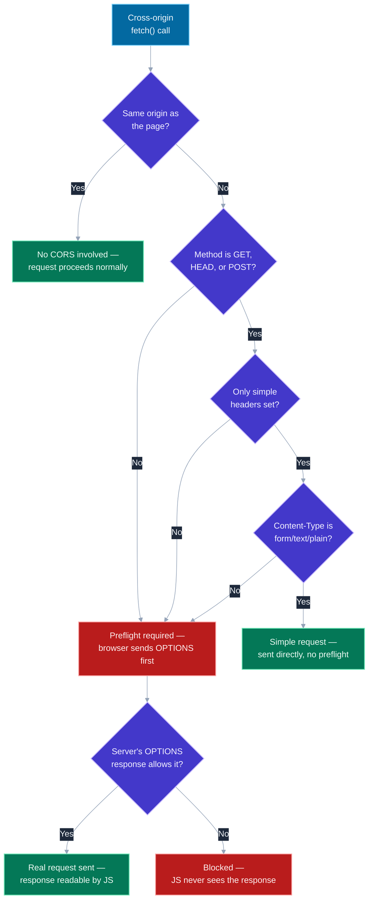
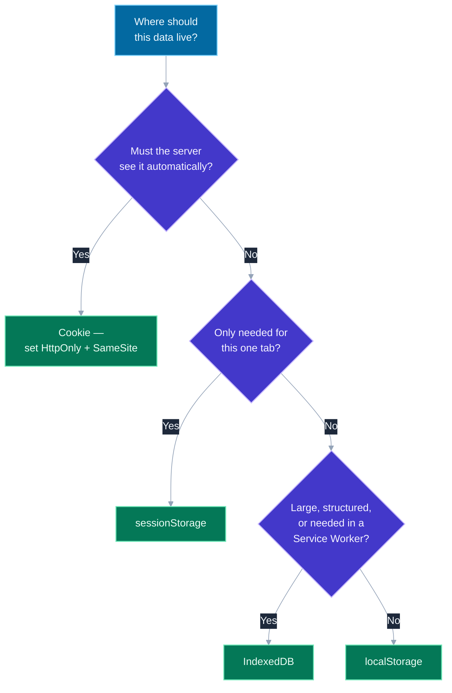

# CORS, Cookies, localStorage vs sessionStorage vs IndexedDB

## 🎯 Executive Summary

Every one of these topics is, underneath, the same question asked from a different angle: **what is the browser willing to let one origin do to another, and where is it safe to put data that a script might read?** CORS governs whether JavaScript on origin A can read a response from origin B. Cookies are the one storage mechanism the browser will automatically attach to outgoing requests on your behalf — which is exactly what makes them both essential for auth and the root cause of CSRF. And the client storage APIs (`localStorage`, `sessionStorage`, `IndexedDB`) differ less in "how much data" and more in *who can see it, how long it lives, and whether reading it can block the page*.

This is a must-know topic because it's where "the request failed" bugs live — a CORS error in the console, a cookie that mysteriously isn't being sent, a `localStorage` value that vanished — and because interviewers use it to check whether a candidate understands these as **browser-enforced trust boundaries**, not arbitrary configuration to satisfy. A Senior engineer can usually get a CORS error to go away. A Lead can explain *why* the browser blocked it, what security property that block was protecting, and whether the fix they're about to apply (`Access-Control-Allow-Origin: *`, disabling `SameSite`) reopens a hole that was closed on purpose.

## 📖 What Is It? (Plain-English Definition)

**In plain terms:** CORS is the browser's permission system for letting JavaScript from one website read a response from a different website. Cookies are a small, automatically-attached piece of data the browser sends with matching requests, mainly used to keep you "logged in." And `localStorage`/`sessionStorage`/`IndexedDB` are three different lockers the browser gives a website to store its own data on your device, distinguished mainly by how big they are, how long they last, and how the page is allowed to read from them.

Start with the browser's baseline rule, the **same-origin policy**: by default, a script running on `https://a.com` cannot read anything from `https://b.com` — no fetching its API responses, no reading its cookies, nothing. This rule exists to stop a malicious site from silently reading your bank's data using your logged-in session, just because both happen to be open in your browser at once. CORS is the *exception* mechanism: it lets `b.com` explicitly say, via response headers, "actually, `a.com` is allowed to read this" — nothing more.

Cookies work differently from every other storage mechanism here specifically because the browser attaches them to requests *automatically*, without any JavaScript needing to ask — that's the one property that makes them useful for authentication (the browser proves who you are on every request without your code doing anything) and the exact same property that makes CSRF possible (a *different* site can also trigger a request that carries your cookies along, whether you meant it to or not).

`localStorage`, `sessionStorage`, and `IndexedDB` are the three places actual application data (not automatically-sent, "please attach me to every request" data) lives on the client — and the difference between them is a set of concrete trade-offs, not just capacity, that's worth knowing before reaching for whichever one you've used before out of habit.

---

## 🧠 Core Technical Deep Dive

### Same-origin, same-site, and why the distinction matters

**Origin** = scheme + host + port, all three, exactly. `https://app.example.com:443` and `http://app.example.com` are different origins (scheme differs); `https://app.example.com` and `https://api.example.com` are different origins (host differs) — even though they're both clearly "the same company."

**Site** (relevant specifically to the `SameSite` cookie attribute) is coarser: it's the registrable domain, roughly "eTLD+1" — `app.example.com` and `api.example.com` are the *same site* even though they're different origins. This distinction is why a cookie set with `SameSite=Lax` can still be sent between your own subdomains, while CORS (which cares about full origin, not site) would still block a plain cross-origin `fetch` between those same two subdomains without explicit headers.

### CORS: simple requests vs. preflighted requests

Not every cross-origin request behaves the same way. A request qualifies as a **"simple request"** — sent directly, no advance permission check — only if it meets a narrow set of conditions: method is `GET`, `HEAD`, or `POST`; only a small allow-list of headers is set; and if `Content-Type` is present, it's one of `text/plain`, `multipart/form-data`, or `application/x-www-form-urlencoded`.

Anything outside that — a custom header like `Authorization` or `X-Requested-With`, a `PUT`/`DELETE`/`PATCH` method, a `Content-Type: application/json` — triggers a **preflight**: the browser sends an `OPTIONS` request *first*, asking permission, before it ever sends your actual request:

```
OPTIONS /api/orders HTTP/1.1
Origin: https://app.example.com
Access-Control-Request-Method: PUT
Access-Control-Request-Headers: content-type, authorization
```

The server has to answer that preflight explicitly:

```
Access-Control-Allow-Origin: https://app.example.com
Access-Control-Allow-Methods: GET, PUT, DELETE
Access-Control-Allow-Headers: content-type, authorization
Access-Control-Max-Age: 86400
```

`Access-Control-Max-Age` lets the browser cache that preflight's answer, so it doesn't repeat the `OPTIONS` round trip for every subsequent request within that window — a real, measurable latency win for APIs the frontend calls frequently.

**The detail that separates a working answer from a correct one:** the browser sends the preflight, checks the response headers itself, and *only then* decides whether to let your JavaScript's `.then()` see the real response — the "simple" (non-preflighted) actual request can, in some cases, still reach the server and execute even when CORS ultimately blocks the *page* from reading the result. CORS protects what client-side JavaScript is allowed to read; it was never a mechanism for stopping the request from arriving at the server in the first place, which is the single most common misunderstanding of what this header set actually does.

### Credentials: the header that has to match on both sides

By default, `fetch()` does not send cookies on a cross-origin request at all. Sending them requires opting in explicitly on both ends:

```javascript
fetch('https://api.example.com/me', { credentials: 'include' });
```

```
Access-Control-Allow-Origin: https://app.example.com   // must be an exact origin, NOT "*"
Access-Control-Allow-Credentials: true
```

The moment credentials are involved, `Access-Control-Allow-Origin: *` becomes invalid — the spec forbids the wildcard specifically here, because a wildcard-plus-credentials combination would mean "any site on the internet may read this response using the user's cookies," which is precisely the cross-site data leak the same-origin policy exists to prevent.

### Cookies: the attributes that actually control their behavior

| Attribute | What it does |
|---|---|
| `Domain` | Which host(s) the cookie is sent to. Omitted = current host only; set explicitly = that domain and all its subdomains. |
| `Path` | Restricts the cookie to requests under a given path. |
| `Expires` / `Max-Age` | Persistent (survives browser restart) vs. session cookie (deleted when the browser closes) if omitted. |
| `Secure` | Only sent over HTTPS. Should be on every auth cookie, no exceptions. |
| `HttpOnly` | Invisible to `document.cookie` — JavaScript cannot read or write it at all. The single most effective mitigation against an XSS payload stealing a session token. |
| `SameSite` | `Strict` (never sent cross-site, even on top-level navigation), `Lax` (sent on top-level navigation like clicking a link, blocked on cross-site `POST`/`fetch` — the default in modern browsers), `None` (sent cross-site always, but requires `Secure`). This is the primary structural defense against CSRF. |

### `localStorage` vs. `sessionStorage` vs. `IndexedDB`

| | `localStorage` | `sessionStorage` | `IndexedDB` |
|---|---|---|---|
| **Lifetime** | Persists until explicitly cleared | Cleared when the tab closes | Persists until explicitly cleared |
| **Scope** | Shared across all tabs, same origin | Isolated per tab (even same origin, same URL) | Shared across all tabs, same origin |
| **API** | Synchronous | Synchronous | Asynchronous (Promise/event-based) |
| **Data shape** | Strings only (`JSON.stringify`/`parse` yourself) | Strings only | Structured data — objects, Blobs, indexes, transactions |
| **Typical quota** | ~5–10MB (browser-dependent) | ~5–10MB | Hundreds of MB+, often a percentage of free disk |
| **Available in a Service Worker** | **No** | **No** | **Yes** |
| **Blocks the main thread on large reads/writes** | Yes — it's synchronous | Yes | No |

**Why this table matters more than "which has more space":** the synchronous nature of `localStorage` is the detail that actually bites in production — reading or writing a large value blocks the main thread, and doing it on every render or on a hot path is a real, measurable jank source, not a theoretical one. It's also the reason `localStorage` is unavailable inside a service worker at all: a service worker's entire execution model assumes it can be woken and killed on demand, and a blocking, synchronous storage API is fundamentally incompatible with that. Anything that needs to be readable from a service worker, needs to hold non-string data, or is large enough that synchronous access would be noticeable belongs in IndexedDB — full stop, not "whichever one I've used before."

### Why none of localStorage/sessionStorage is safe from XSS, and cookies only partially are

Any JavaScript running on the page — including an attacker's, injected via an XSS vulnerability — has full read/write access to `localStorage` and `sessionStorage`. There is no equivalent of `HttpOnly` for these APIs; if a token needs to be inaccessible to a successful XSS payload, it cannot live in either of them, no matter how it's encoded. An `HttpOnly` cookie is the one storage mechanism a same-page XSS payload genuinely cannot read directly — but it can still be *used*: the attacker's injected script can simply make requests from the victim's browser, and the browser will attach the cookie automatically, which is functionally a lot like CSRF launched from inside a successful XSS. `HttpOnly` blocks exfiltration of the raw token; it does not block the cookie from being used while the payload runs.

---

## 📊 Visual Architecture & Logic

### Diagram 1: Does This Cross-Origin Request Need a Preflight?



### Diagram 2: Choosing Where Client Data Lives



---

## 🏢 Interview Context & FAANG Signals

| Interview Stage | Format |
|---|---|
| **Debugging Round** | A pasted CORS console error — diagnose whether it's a missing header, a credentials mismatch, or the wildcard-plus-credentials conflict |
| **System Design** | Cross-subdomain auth, third-party widget embedding, or "why is our API blocked from this partner's site" |
| **Security Round** | CSRF mitigation design — almost always expects `SameSite` plus a token-based defense, not one alone |
| **Coding Round** | Implement a small storage layer, and justify the choice between the three client storage APIs |

**Lead signals interviewers listen for:**

1. **Correctly stating what CORS protects** — that it's the browser restricting what *JavaScript can read*, not a mechanism that stops a request from reaching the server, and not a substitute for server-side authorization.
2. **Naming the credentials + wildcard conflict specifically** — recognizing `Access-Control-Allow-Origin: *` with `Allow-Credentials: true` as an invalid, security-relevant combination, not just a syntax detail.
3. **Distinguishing origin from site** — knowing why `SameSite` cares about the registrable domain while CORS cares about full origin, and what that means for subdomain-heavy architectures.
4. **Choosing a storage mechanism from its actual constraints** — sync vs. async, per-tab vs. shared, service-worker availability — rather than defaulting to `localStorage` out of habit.
5. **Explaining `HttpOnly`'s real guarantee** — that it blocks a script from reading the cookie's value, not that it makes the cookie immune to being used by a CSRF or XSS-launched request.

## ⚔️ Lead Level vs Senior Level

**Question:** "Our API calls from the new marketing subdomain are failing with a CORS error. How do you fix it?"

**Senior Response:**
> Add `Access-Control-Allow-Origin: *` to the API responses so it stops blocking the request.

Makes the error go away, but doesn't consider what that wildcard actually opens up, especially if the API is also used with cookies elsewhere.

---

**Staff/Lead Response:**
> First I'd check whether this call needs credentials — if it does, `*` is invalid anyway and the browser will still block it, so the fix has to be an explicit allow-list of origins, not a wildcard. If it doesn't need credentials, a wildcard is *possible* but I'd still scope it to specific known origins rather than open the API to every site on the internet by default, since that's a decision that outlives this one bug.
>
> I'd also check whether this is a preflighted request — if the marketing team's call sends a custom header or a non-form `Content-Type`, we need to make sure the `OPTIONS` response explicitly allows that method and header, not just the actual request.
>
> Long-term, I'd rather this be driven by an explicit allow-list config the platform team owns, so "can subdomain X call this API" is a reviewed decision, not something added ad hoc every time a new team hits the same error.

The Lead answer treats the fix as a security decision with a blast radius, not a console-error dismissal.

## ⚠️ Common Pitfalls & Anti-Patterns

> ### ✕ `Access-Control-Allow-Origin: *` on an Authenticated Endpoint
> **Why it's wrong:** The wildcard is invalid alongside `Access-Control-Allow-Credentials: true` by spec, but a common mistake is having `*` on an endpoint that doesn't send `Allow-Credentials` yet is still auth-gated by some *other* mechanism (an API key in a header) — the wildcard means literally any site's JavaScript can read the response if it can supply that key, which is rarely the intended exposure.
> **✓ Correct Lead Approach:** Treat `*` as reserved for genuinely public, unauthenticated responses only. Anything gated by identity gets an explicit origin allow-list.

---

> ### ✕ Storing an Auth Token in `localStorage` "For Convenience"
> **Why it's wrong:** Any successful XSS payload has full read access to `localStorage`, with no equivalent of `HttpOnly` to block it — a stored token is a stored credential, fully exposed the moment any script injection succeeds anywhere on the page.
> **✓ Correct Lead Approach:** Prefer an `HttpOnly`, `Secure`, `SameSite`-scoped cookie for session tokens. If a token must be reachable by JavaScript (e.g., for a `Authorization` header pattern), treat that as a deliberate trade-off against XSS risk, not a default choice.

---

> ### ✕ Disabling `SameSite` to "Fix" a Broken Cross-Site Request
> **Why it's wrong:** Setting `SameSite=None` to make a cookie work across sites removes the primary structural CSRF defense modern browsers ship by default — often done under time pressure without adding a replacement mitigation (a CSRF token, origin header validation).
> **✓ Correct Lead Approach:** If cross-site cookie delivery is genuinely required, pair `SameSite=None; Secure` with an explicit CSRF token check server-side — never ship the loosened cookie alone.

---

> ### ✕ Reaching for `localStorage` for a Large or Frequently-Updated Blob
> **Why it's wrong:** `localStorage` is synchronous — reading or writing a large value blocks the main thread, and doing so on a hot path (every keystroke, every render) is measurable jank, not a theoretical concern.
> **✓ Correct Lead Approach:** Use IndexedDB for anything large, frequently updated, or structured. Reserve `localStorage` for small, infrequently-touched values (a theme preference, a feature flag).

---

> ### ✕ Assuming a CORS Error Means the Server Was Never Called
> **Why it's wrong:** For a simple (non-preflighted) request, the browser can send the actual request to the server and only block the *page* from reading the response — a CORS error in the console does not necessarily mean the server-side handler never ran, which matters a great deal if that handler had a side effect (a write, a charge, an email).
> **✓ Correct Lead Approach:** Never assume "the browser blocked it" means "nothing happened server-side." Verify from server-side logs when the request in question has side effects.

## 🛠️ Practice Scenarios

### Scenario 1: The Silent Cookie

**Problem:** A team sets a session cookie from `api.example.com` and expects it to be sent on requests from `app.example.com` (a different subdomain of the same company). It isn't being sent. Diagnose.

<details>
<summary>Staff-Level Solution</summary>

**Likely causes, in order of likelihood:**
1. The cookie's `Domain` attribute wasn't set to `.example.com` — without it, a cookie set by `api.example.com` defaults to that exact host only, and won't be sent to `app.example.com` regardless of how closely related the two subdomains are.
2. The request is cross-origin (different subdomain) and either doesn't use `credentials: 'include'`, or the server's CORS response doesn't include `Access-Control-Allow-Credentials: true` with an explicit (non-wildcard) `Access-Control-Allow-Origin`.
3. `SameSite=Strict` would block it on some navigation patterns even with the `Domain` fixed, though `Lax` (the modern default) typically wouldn't for a same-site subdomain relationship.

**Lead framing:** "This is really two separate mechanisms that both have to agree: the cookie's own `Domain` scoping decides whether the browser is even willing to attach it to a request for that host, and CORS's credentials handshake decides whether a cross-origin `fetch` is allowed to trigger that attachment and then read the result. Fixing one without the other leaves the bug half-solved."

</details>

---

### Scenario 2: Choosing Storage for an Offline Draft Editor

**Problem:** A rich-text editor needs to autosave drafts locally so a user doesn't lose work on a flaky connection. Drafts can be a few hundred KB with embedded image data. Justify a storage choice.

<details>
<summary>Staff-Level Solution</summary>

**Not `localStorage`:** synchronous access to a few-hundred-KB string on every autosave tick would be a real, felt performance cost, and embedded binary image data would need to be base64-encoded first, bloating it further and making every read/write more expensive.

**Not `sessionStorage`:** loses the draft the moment the tab closes, which defeats the actual goal (surviving an accidental close, not just a flaky connection within one session).

**IndexedDB:** asynchronous (won't block typing), supports storing `Blob`s directly (no base64 tax on image data), has a much larger practical quota, and persists across tabs and restarts — the correct fit on every axis that matters here.

**Lead framing:** "The size alone would push this toward IndexedDB, but even at a smaller size, 'must not block the UI while typing' rules out both Web Storage APIs on its own — this is a case where the async/sync distinction matters more than the capacity numbers."

</details>

---

### Scenario 3: A Partner Integration Needs Cross-Origin Reads

**Problem:** A partner's site needs to call your public product-catalog API (no auth) from their own frontend. Design the CORS policy.

<details>
<summary>Staff-Level Solution</summary>

**Approach:** since the endpoint is genuinely public and unauthenticated, `Access-Control-Allow-Origin: *` is a legitimate, low-risk choice here — there's no credential or session data being exposed, so a wildcard doesn't leak anything a request without any origin at all couldn't already read directly.

**What would change the answer:** the moment this endpoint needs to reflect per-user data (personalized pricing, an account-specific catalog view) or needs a cookie/session, the wildcard becomes wrong immediately, and the design needs to shift to an explicit origin allow-list plus `Access-Control-Allow-Credentials`.

**Lead framing:** "The right CORS policy isn't a fixed 'always restrict' or 'always allow' rule — it's derived from whether the response varies by identity. A public catalog is fine wide open; anything gated by who's asking needs to name exactly who's allowed to ask, explicitly."

</details>
