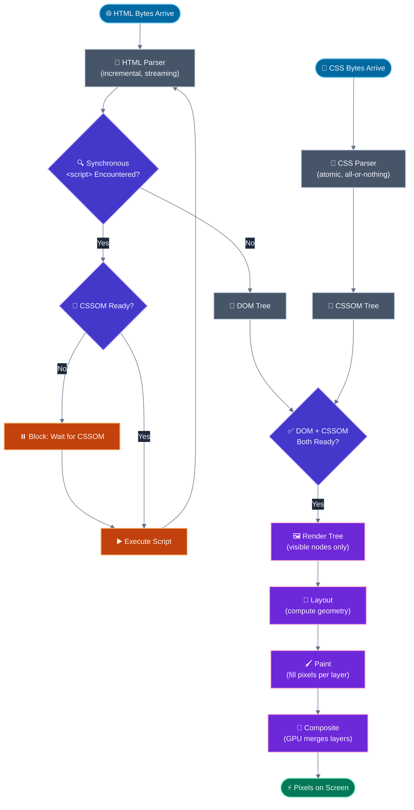

# Critical rendering path optimisation

## 🎯 Executive Summary

The critical rendering path (CRP) is the sequence of steps the browser must complete — parsing bytes into a DOM, building a CSSOM, merging them into a render tree, computing layout, painting pixels, and compositing layers — before anything appears on screen. Every millisecond your team spends debating "should this be `async` or `defer`" or "should we inline this CSS" is, whether they realize it or not, an argument about where in this pipeline a resource sits.

The reason this is foundational rather than a checklist item: FCP and LCP are *literally* defined by when the CRP first produces pixels for the largest/first content. You cannot reason about Core Web Vitals, hydration cost, or perceived load speed without a correct mental model of this pipeline — it's the substrate everything else sits on.

Why it's a must-know at Lead level: CRP optimization decisions (critical CSS extraction, resource hint strategy, script loading order) have architecture-wide blast radius — get the strategy wrong once at the build-tooling or template level, and every page inherits the regression. A Lead is expected to own that strategy, not just fix one slow page.

---

## 🧠 Core Technical Deep Dive

### The pipeline, stage by stage

| Stage | Input | Output | Blocking behavior |
|---|---|---|---|
| **HTML Parsing** | Bytes from network | DOM tree | Streaming/incremental — browser parses and appends nodes as bytes arrive |
| **CSS Parsing** | CSS bytes | CSSOM tree | Render-blocking — no partial CSSOM is ever exposed to rendering |
| **Render Tree** | DOM + CSSOM | Visual node tree | Waits on both DOM (at least the visible portion) and CSSOM |
| **Layout (Reflow)** | Render tree | Geometry (position, size per node) | Synchronous, can be forced early by JS reading geometry |
| **Paint** | Layout geometry | Pixels per layer | Runs on main thread by default |
| **Composite** | Painted layers | Final frame | Runs on the compositor thread — the only stage that can skip the rest |

> **Key takeaway:** CSSOM construction is all-or-nothing and render-blocking by design — the browser will not risk painting with an incomplete stylesheet and having to visibly re-paint once the rest arrives.

### Why CSS blocks rendering but HTML doesn't

The HTML parser is incremental: it appends DOM nodes as bytes stream in, so the browser can start building structure immediately, even from a partial response. CSS parsing has no equivalent incremental contract — a rule later in the file can override one earlier in it (specificity and cascade order matter), so the browser can't safely apply "some" of a stylesheet without risking incorrect, flickering intermediate states.

This asymmetry is why `<link rel="stylesheet">` in `<head>` is render-blocking by default, while a streaming HTML response can produce visible content incrementally as it arrives — the mental model of "HTML is fast, CSS is slow" isn't about file size, it's about the incremental-vs-atomic nature of each parser's contract.

> **Key takeaway:** treat every render-blocking stylesheet as a tax on FCP proportional to its full download-plus-parse time, not its size relative to the page — a tiny stylesheet on a slow connection still blocks exactly as hard as a large one on a fast connection.

### Script execution: the parser-blocking default

A synchronous `<script>` encountered mid-document pauses HTML parsing entirely, because the script might call `document.write()` or otherwise mutate the DOM the parser hasn't finished building yet — the spec has to assume the worst case. Critically, that same script also blocks on CSSOM: if a stylesheet is still loading when the parser hits a synchronous script, the script's execution waits for CSSOM completion too, because the script might query computed styles.

| Loading strategy | Parser blocked? | Execution timing | Use case |
|---|---|---|---|
| `<script src="...">` (default) | Yes | Immediately, blocking parse | Avoid for anything non-critical |
| `<script async src="...">` | No | As soon as it downloads, out of order | Independent scripts (analytics, ads) |
| `<script defer src="...">` | No | After parsing completes, in document order | Most application scripts |
| `<script type="module">` | No | Deferred by default (like `defer`) | ESM-based apps |

> **Key takeaway:** `defer` gets you both non-blocking parsing *and* predictable document-order execution — it's the correct default for application code; reach for `async` only when execution order genuinely doesn't matter.

### The preload scanner: parsing ahead of parsing

Browsers run a secondary, speculative "preload scanner" alongside the main HTML parser. It scans raw markup ahead of the parser's current position — even past a blocking script — looking for resources to start fetching early: `<link>`, ``, `<script src>`. This is why moving a script tag lower in the document doesn't fully hide it from early discovery; the preload scanner will often have already kicked off its fetch before the parser physically reaches it.

What the preload scanner *cannot* see: resources discovered only via JavaScript execution (a client-side router lazily importing a chunk, a `fetch()` call inside a component). This is the core justification for `<link rel="preload">` on critical JS-discovered resources — it gives the preload scanner a static hint for something it would otherwise only find after JS runs.

> **Key takeaway:** the preload scanner optimizes *discovery* time, not *execution* time — reordering script tags changes when code runs, not necessarily when the browser starts fetching it.

### Layout thrashing and forced synchronous layout

Reading a layout-dependent property (`offsetHeight`, `getBoundingClientRect()`, `getComputedStyle()`) after writing a layout-affecting property (`style.width`, appending a node) forces the browser to synchronously recompute layout early, instead of batching it for the next frame. Doing this in a loop — read, write, read, write — is "layout thrashing," and it's one of the most common causes of jank that doesn't show up in a naive code review.

```javascript
// Bad: forces layout recalculation on every iteration
boxes.forEach(box => {
  const height = box.offsetHeight;      // read — forces layout if dirty
  box.style.height = `${height + 10}px`; // write — invalidates layout
});

// Good: batch all reads, then all writes
const heights = boxes.map(box => box.offsetHeight); // all reads first
boxes.forEach((box, i) => { box.style.height = `${heights[i] + 10}px`; }); // all writes after
```

> **Key takeaway:** the fix is almost always "separate your reads from your writes" — batch measurement, then batch mutation, never interleave them in a loop.

### Composite-only properties: the escape hatch

`transform` and `opacity` changes can skip layout and paint entirely and run purely on the compositor thread, because they don't affect any other element's geometry and can be applied as a GPU transform on an already-painted layer. This is why animating `transform: translateX()` is dramatically cheaper than animating `left`, even though they can look visually identical — one triggers layout on every frame, the other triggers none.

> **Key takeaway:** for any animation, ask "does this need to move a box in a way that would push its siblings?" — if not, express it as `transform`/`opacity`, not layout-affecting properties.

---

## 📊 Visual Architecture & Logic

### Diagram 1 — The Critical Rendering Path Pipeline



### Diagram 2 — Resource Discovery and First Paint Timeline

```mermaid
%%{init: {"theme": "base", "themeVariables": {"background":"transparent","actorBkg":"#334155","actorBorder":"#64748b","actorTextColor":"#f1f5f9","actorLineColor":"#64748b","signalColor":"#94a3b8","signalTextColor":"#e2e8f0","noteBkgColor":"#4338ca","noteBorderColor":"#818cf8","noteTextColor":"#f5f3ff","activationBkgColor":"#475569","activationBorderColor":"#94a3b8","fontFamily":"\"Plus Jakarta Sans\", sans-serif","fontSize":"14px"}}}%%
sequenceDiagram
    participant Browser as Main Parser
    participant Scanner as Preload Scanner
    participant Network
    participant Render as Render Pipeline

    Browser->>Network: Request index.html
    Network-->>Browser: Stream HTML bytes

    Browser->>Scanner: Hand off raw markup ahead of parse position
    Scanner->>Network: Fetch CSS, fonts, hero image in parallel

    Note over Browser: Parser reaches blocking &lt;script&gt;
    Browser->>Network: Wait for CSSOM completion
    Network-->>Browser: CSSOM ready
    Browser->>Browser: Execute script, resume parsing

    Network-->>Render: CSS fully downloaded and parsed
    Browser->>Render: DOM ready for visible content

    Render->>Render: Build render tree, layout, paint, composite
    Render-->>Browser: First Contentful Paint fires
```

---

## 🏢 Interview Context & FAANG Signals

### Where This Appears

| Interview Stage | Format |
|---|---|
| **Phone Screen** | "What happens between typing a URL and seeing content?" — a classic filter question that still trips up people who only know it at a surface level |
| **Technical Deep Dive** | "Why does a `<script>` tag block rendering, and does moving it to the bottom of `<body>` fully solve that?" |
| **Performance Round** | "We inlined our CSS and FCP got worse — why?" (over-inlining bloats initial HTML transfer size) |
| **System Design** | "Design the loading strategy for a marketing page vs. a logged-in dashboard" — expects different CRP strategies per page type |

### Lead Signals Interviewers Are Looking For

1. **Precision about *why*, not just *what*** — knowing CSS is render-blocking is Senior; explaining the atomic-cascade reason it must be is Lead.
2. **Connecting CRP mechanics to Core Web Vitals numbers** — can you trace a specific FCP/LCP regression back to a specific pipeline stage?
3. **Preload scanner awareness** — do you know the difference between "the browser knows about this resource" and "this code has executed"?
4. **Trade-off articulation on critical CSS** — inlining isn't free; it grows initial HTML payload and can't be cached separately from the document.
5. **Compositor-thread fluency** — connecting `transform`/`opacity` to jank-free animation, not as trivia but as a design constraint you apply proactively.

---

## ⚔️ Lead Level vs Senior Level

### Scenario: "Our landing page has a 2.8s FCP. Where do you start?"

**Senior Response:**
> "I'd check the Network tab for render-blocking resources, probably minify the CSS, and add `defer` to any scripts that don't have it."

Correct first moves, but reactive and generic — doesn't establish a diagnostic sequence or connect findings to root cause.

---

**Staff/Lead Response:**
> "I'd start by pulling up the Performance panel's timeline and identifying which stage is actually the bottleneck — is the 2.8s dominated by network wait for CSS, by JS execution blocking the parser, or by layout/paint work after content is available? Those have completely different fixes, and guessing wastes a diagnostic cycle.
>
> If it's CSS-bound, I'm looking at whether the full stylesheet is render-blocking when only a fraction of it — the above-the-fold rules — is actually needed for FCP. That's a critical-CSS extraction candidate, but I'd weigh it against the added HTML payload and the loss of separate stylesheet caching; if the page is revisited often, that trade-off might not be worth it.
>
> If it's script-bound, I'm auditing for synchronous scripts sitting in `<head>` without `defer`, and checking whether any of them are doing DOM queries that force CSSOM completion before they even need to. If it's post-content layout/paint cost, I'm looking for layout thrashing or oversized paint areas, not blocking resources at all.
>
> The point is: FCP is downstream of four or five structurally different problems that all present as 'slow.' A Lead's job is picking the right lever on the first try, not iterating through a generic checklist."

The Lead answer establishes a diagnostic branching structure before proposing fixes, and explicitly weighs the trade-off of the most obvious fix (critical CSS inlining) rather than reflexively recommending it.

---

## ⚠️ Common Pitfalls & Anti-Patterns

> ### ✕ Inlining the Entire Stylesheet as "Critical CSS"
> **Why it's wrong:** Teams often over-extract "critical" CSS until it's most of the stylesheet, believing more inlining is strictly better. This bloats the initial HTML response (which can't be cached independently and must be re-downloaded on every navigation) and can push back the point where the HTML parser finishes, ironically delaying FCP instead of improving it.
> **✓ Correct Lead Approach:** Extract only the CSS needed for the above-the-fold viewport on the primary page templates, keep it genuinely minimal (a few KB, not tens of KB), and load the rest asynchronously via a preload-and-swap pattern (`<link rel="preload" as="style" onload="this.rel='stylesheet'">`).

---

> ### ✕ Assuming Script Position Alone Controls Fetch Timing
> **Why it's wrong:** Moving a `<script>` tag to the bottom of `<body>` is often treated as sufficient optimization, but the preload scanner may have already discovered and started fetching it regardless of position — the position change affects *execution* timing, not necessarily *fetch* timing, and teams sometimes claim a fix worked when what actually improved was execution order, not network waterfall shape.
> **✓ Correct Lead Approach:** Use `defer` (or `async` where order doesn't matter) explicitly rather than relying on DOM position as an implicit signal — it decouples the intent (non-blocking parse, ordered execution) from a fragile positional convention.

---

> ### ✕ Reading Layout Properties Inside a Loop That Also Writes
> **Why it's wrong:** Alternating `element.offsetHeight` reads with `element.style.x =` writes across a collection forces a full synchronous layout recalculation on every iteration instead of once per frame — "layout thrashing" — and can turn an O(1)-per-frame operation into an O(n) main-thread stall proportional to collection size.
> **✓ Correct Lead Approach:** Batch all reads into one pass (store results in an array), then batch all writes into a second pass. For repeated measurement/mutation cycles, consider `ResizeObserver` instead of manual polling.

---

> ### ✕ Animating `top`/`left`/`width` Instead of `transform`
> **Why it's wrong:** Any animation of a layout-affecting property re-triggers layout and paint on every single frame of the animation — at 60fps, that's layout recalculation roughly every 16ms for the animation's duration, a common source of visible jank that profiles as "long frames" rather than one obvious slow function.
> **✓ Correct Lead Approach:** Express movement as `transform: translate()`/`scale()` and visibility as `opacity`, both of which the browser can animate purely on the compositor thread, skipping layout and paint entirely.

---

> ### ✕ Treating `async` as a Safe Default for Application Scripts
> **Why it's wrong:** `async` scripts execute as soon as they finish downloading, in arbitrary order relative to each other and relative to DOM parsing completion — for application code with dependencies on load order or on a fully-parsed DOM, this introduces non-deterministic bugs that only appear under specific network timing conditions, making them hard to reproduce.
> **✓ Correct Lead Approach:** Use `defer` for application/framework code that needs document-order execution and a complete DOM; reserve `async` for genuinely independent scripts like analytics or ad tags that don't interact with the rest of the page.

---

## 🛠️ Practice Scenarios

---

### Scenario 1 — The Inlining That Backfired

**Problem:**
A team inlines their entire 45KB stylesheet into every HTML document to "eliminate the render-blocking CSS request." FCP gets *worse* on repeat visits. Explain why.

<details>
<summary>Staff-Level Solution</summary>

**Root cause:** An external stylesheet is cached by the browser independently of the HTML document — on a repeat visit, the CSS request is often a cache hit costing near-zero time, while the HTML itself is typically not cached (or cached briefly) since it's dynamic. By inlining 45KB into the HTML, every single page navigation now re-downloads that CSS as part of the document, even though it was previously free after the first visit.

**Fix:** Extract only genuinely above-the-fold critical CSS (typically a few KB) to inline, and keep the bulk of the stylesheet external and cacheable, loaded via the preload-and-swap pattern so it doesn't block first paint but also isn't re-transferred on every navigation.

**Lead framing:** "This is a case where the first-visit optimization and the repeat-visit optimization pull in opposite directions, and the team optimized for the wrong one. For most products, repeat visits dominate total traffic — I'd want real analytics on new-vs-returning visitor split before deciding how aggressively to inline."

</details>

---

### Scenario 2 — The Font That Blocked Everything

**Problem:**
```html
<style>
  @font-face {
    font-family: 'Brand';
    src: url('/fonts/brand.woff2') format('woff2');
  }
  body { font-family: 'Brand', sans-serif; }
</style>
```
The page shows a blank white screen for 1.5s longer than expected, even though the HTML and base CSS are small and fast. Diagnose.

<details>
<summary>Staff-Level Solution</summary>

**Root cause:** By default, most browsers block text rendering (not just the font swap, the *paint* of any text using that font-family) until the font file downloads or a timeout (historically ~3s, the "invisible text" period, aka FOIT) — even though `@font-face` itself isn't part of the classic CRP stages, its default blocking behavior for text painting has the same practical effect as a render-blocking resource.

**Fix:** Add `font-display: swap` (or `optional` for above-the-fold text where a layout shift on swap is unacceptable) to the `@font-face` rule, so the browser paints text immediately with a fallback font and swaps in the webfont when it arrives, rather than blocking paint entirely.

**Lead framing:** "Font blocking is a good example of a CRP-adjacent cost that doesn't show up if you're only thinking about the six textbook stages — the actual user-facing pipeline includes font loading behavior, and `font-display` is exactly the kind of lever that's invisible until you've been burned by it once."

</details>

---

### Scenario 3 — The Preload That Didn't Help

**Problem:**
A team adds `<link rel="preload" as="script" href="/app.js">` to speed up their main bundle, but Lighthouse shows no FCP/LCP improvement. Why might preload have had no effect here?

<details>
<summary>Staff-Level Solution</summary>

**Root cause:** The preload scanner likely already discovered `/app.js` from its regular `<script>` tag in the document before the explicit `preload` hint would have made any difference — preload's value is highest for resources the preload scanner *can't* see on its own (JS-discovered chunks, resources referenced only inside CSS like background images, fonts referenced via `@font-face` that aren't used until later). Preloading a resource the scanner would find anyway adds priority-queue overhead without changing effective fetch start time.

**Fix:** Audit which resources are genuinely invisible to the static parser — dynamically imported route chunks, fonts used by a component that mounts after JS runs — and reserve `preload` for those. For a top-level `<script>` tag already in the initial HTML, preload is rarely the lever that moves the needle.

**Lead framing:** "Preload is one of the most over-applied resource hints because it's easy to add and hard to verify the counterfactual. I'd always check the waterfall to confirm the fetch actually started earlier because of the hint, not just add it reflexively."

</details>

---

### Scenario 4 — Layout Thrashing in a List Component

**Problem:**
```javascript
function equalizeRowHeights(rows) {
  rows.forEach(row => {
    row.style.height = 'auto';
    const naturalHeight = row.scrollHeight;
    row.style.height = `${naturalHeight}px`;
  });
}
```
With 200 rows, this function takes 400ms+ and visibly freezes the page. Diagnose and fix.

<details>
<summary>Staff-Level Solution</summary>

**Root cause:** Every iteration writes (`style.height = 'auto'`), then immediately reads (`scrollHeight`), then writes again — three layout-affecting operations interleaved per row, each read forcing a synchronous layout recalculation of the (now-dirty) tree. Across 200 rows, that's up to 400 forced synchronous layouts instead of one.

**Fix:**
```javascript
function equalizeRowHeights(rows) {
  // Reset phase (all writes)
  rows.forEach(row => { row.style.height = 'auto'; });

  // Measure phase (all reads, layout computed once, then cached)
  const heights = rows.map(row => row.scrollHeight);

  // Apply phase (all writes)
  rows.forEach((row, i) => { row.style.height = `${heights[i]}px`; });
}
```
This reduces the operation to two forced layouts total (one at the start of the measure phase) instead of up to 400.

**Lead framing:** "This pattern shows up constantly in list/table components that need natural-height measurement, and it's a good code-review flag — any `forEach` that both reads and writes layout-dependent properties in the same iteration is worth a second look."

</details>

---

### Scenario 5 — The Animation That Dropped Frames Only on Low-End Devices

**Problem:**
A slide-in notification animates `left: 0` to `left: -320px` via a CSS transition. It's smooth on the team's dev machines but janky on mid-range Android devices in the field. Diagnose and fix.

<details>
<summary>Staff-Level Solution</summary>

**Root cause:** Animating `left` triggers layout and paint on every animation frame, because the browser has to recompute the geometry of the element (and potentially its siblings, if they're affected by its position) at each step. High-end dev machines have enough main-thread and GPU headroom to absorb this; low-end Android devices, with weaker CPUs and more main-thread contention, drop frames because layout recalculation can't keep pace with the 60fps budget.

**Fix:**
```css
/* Before: triggers layout every frame */
.notification { transition: left 0.3s ease; left: 0; }
.notification.hidden { left: -320px; }

/* After: compositor-only, no layout/paint per frame */
.notification { transition: transform 0.3s ease; transform: translateX(0); }
.notification.hidden { transform: translateX(-320px); }
```

**Lead framing:** "This is exactly why I profile on representative low-end hardware, not just dev machines — main-thread and GPU headroom differences mean the same animation can be free on one device and janky on another, and the fix (compositor-only properties) is the same regardless of device, so it's worth doing by default rather than only after a field complaint."

</details>

---

### Scenario 6 — Render-Blocking Third-Party Widget

**Problem:**
Marketing adds a synchronous third-party chat widget `<script src="https://widget.example.com/loader.js"></script>` directly in `<head>`, with no `async`/`defer`. FCP regresses by 900ms across the site. The contract with the vendor doesn't allow removing the widget. What do you do?

<details>
<summary>Staff-Level Solution</summary>

**Root cause:** A synchronous script in `<head>` blocks HTML parsing until it downloads *and* executes — and third-party scripts are a network dependency outside your control, meaning your FCP now inherits the latency and reliability of an external vendor's infrastructure.

**Fix:** Add `async` to the script tag — a chat widget has no rendering dependency on document order or DOM completion, making it a textbook `async` candidate, unlike application code. If the vendor's loader itself is heavy, consider deferring its injection entirely until after a user interaction signal (e.g., scroll, or a fixed delay after load) using a small first-party loader script instead of the vendor's blocking tag.

**Lead framing:** "The technical fix here is nearly free — `async` alone likely recovers most of the regression — but the process fix matters more long-term: any new third-party script needs to go through a loading-strategy review before it ships, not after a Lighthouse regression gets noticed. I'd make `async`/`defer` presence a lint/CI check on third-party script tags specifically."

</details>
