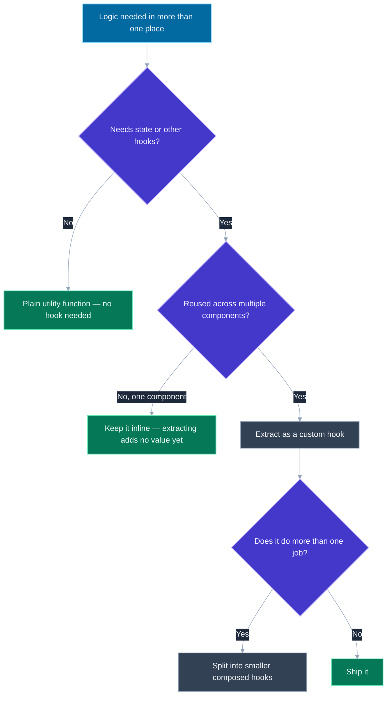
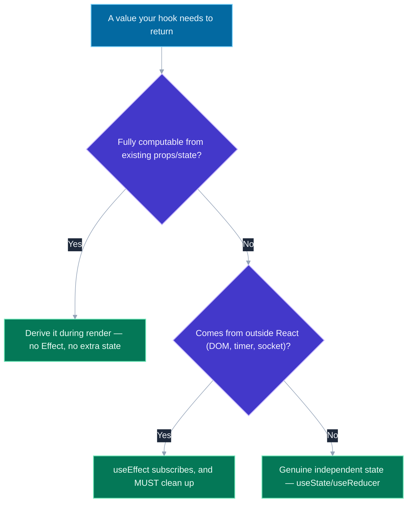

# Custom Hooks — Patterns and Anti-Patterns

## 🎯 Executive Summary

A custom hook is the mechanism hooks introduced for sharing *stateful logic* between components — as distinct from sharing UI, which is what components themselves are for. Before hooks, the same goal (reuse behavior without duplicating it) was chased through higher-order components and render props, both of which solved it by wrapping or restructuring the component tree; a custom hook solves it with a plain function, no tree indirection at all. That simplicity is exactly why it's also easy to do badly — a custom hook is just a JavaScript function with an opinion about naming, and nothing stops it from growing into an unfocused, untestable, leak-prone mega-function.

This is a must-know topic at Lead level because reviewing custom hooks is a routine part of the job — deciding whether a piece of logic deserves its own hook, whether an existing one has grown past a single responsibility, and catching the specific bugs that hide inside them (an uncleaned subscription, a returned object that defeats memoization downstream, state that should have been a plain computed value). A Lead is expected to have opinions about hook API design, not just be able to write one that works.

## 📖 What Is It? (Plain-English Definition)

**In plain terms:** a custom hook is a plain JavaScript function, named starting with `use`, that calls other React hooks inside it — and by doing that, it packages up some stateful behavior (a piece of logic that needs `useState`, `useEffect`, `useContext`, and so on) so any component can reuse it with one line, instead of copy-pasting that logic into every component that needs it.

The `use` prefix isn't a style preference — it's how tooling knows to treat the function specially. ESLint's `eslint-plugin-react-hooks` uses that name to decide whether to enforce the Rules of Hooks (no conditional calls, no calls outside a component or another hook) on a given function; a helper that calls `useState` internally but isn't named `use...` gets none of that protection, and a genuine bug (a hook called inside an `if`) can slip past the linter entirely.

The value proposition, concretely: two components both needing "debounce this value," "track whether the window is focused," or "subscribe to this WebSocket and clean up on unmount" no longer need to duplicate that logic, or reach for a wrapper-heavy HOC — they call `useDebounce(value)`, `useWindowFocus()`, `useSocket(url)`, and get the same behavior, independently, in each component that needs it.

---

## 🧠 Core Technical Deep Dive

### Why hooks replaced HOCs and render props for this

Both older patterns achieved reuse by restructuring the tree: a HOC (`withAuth(Component)`) wraps a component in another component, and a render prop (`<DataProvider render={data => ...}>`) does the same via a function-as-children convention. Both work, but both add a wrapper to the actual rendered tree ("wrapper hell" when several are stacked), and both risk prop name collisions between what the wrapper injects and what the wrapped component already expects. A custom hook adds *zero* extra tree depth and *zero* prop-name coordination — it's just a function call inside the component that needs it, returning exactly the values that component asked for.

### Composition: hooks calling hooks

The clean version of "logic reuse" is a hook built out of other hooks, providing a stable, purpose-built API instead of making every consumer reach into a lower-level primitive directly:

```javascript
function useAuth() {
  const ctx = useContext(AuthContext);
  if (!ctx) throw new Error('useAuth must be used within an AuthProvider');
  return ctx;
}
```

This is a facade, not just indirection for its own sake: every consumer gets a clear error if used outside the provider (instead of a confusing `undefined` read), and the underlying context shape can change without every call site needing to know or care.

### Return shape: array vs. object, and why it matters

`useState` returns a two-element array specifically so consumers can rename freely via destructuring (`const [count, setCount] = useState(0)`) — array destructuring is positional, so the names are entirely up to the caller. That convention makes sense for a hook with exactly one clear "value, setter" pair. For a hook returning three or more values, an object return is almost always the better default: `{ data, isLoading, error }` is self-documenting at the call site, while `const [data, isLoading, error] = useFetch(url)` forces every caller to remember the exact positional order with no names to check it against.

### The specific bug that hides inside a custom hook: an unstable returned reference

```javascript
// Anti-pattern: a new object every render
function useWindowSize() {
  const [size, setSize] = useState({ width: window.innerWidth, height: window.innerHeight });
  useEffect(() => {
    const handler = () => setSize({ width: window.innerWidth, height: window.innerHeight });
    window.addEventListener('resize', handler);
    return () => window.removeEventListener('resize', handler);
  }, []);
  return { ...size }; // a fresh object literal, every single render
}
```

If a component passes this hook's return value straight through as a prop to a `memo`-wrapped child, that child re-renders on every parent render regardless of whether the window actually resized — the exact referential-inequality bug covered in depth in this repo's `react-devtools-profiler.html` resource, just relocated: it's now hiding inside a hook instead of written directly in a component's JSX. The fix is the same fix, applied at the hook's boundary instead of the component's: only construct a new object when the underlying values actually changed (in this case, returning `size` directly rather than spreading it into a fresh object accomplishes that for free).

### Derived state doesn't need an `Effect` — it needs to be computed

```javascript
// Anti-pattern: syncing derived state via an Effect
function useFilteredList(items, query) {
  const [filtered, setFiltered] = useState(items);
  useEffect(() => {
    setFiltered(items.filter(i => i.name.includes(query)));
  }, [items, query]);
  return filtered;
}

// Correct: derive it during render, no Effect, no extra state, no stale-render window
function useFilteredList(items, query) {
  return items.filter(i => i.name.includes(query));
}
```

The Effect-based version introduces a real bug class: for one render after `items` or `query` changes, `filtered` still holds the *previous* value, because the Effect runs *after* the render commits, not during it — an extra, visible stale frame that the derived version simply cannot produce, because there's no separate state to fall out of sync in the first place. This isn't a style preference; it's the React team's own official guidance ("You Might Not Need an Effect"), and a custom hook is not exempt from it just because the derivation is tucked away inside a reusable function.

### Cleanup lives in the hook, and its blast radius is multiplied

Any subscription, timer, or listener a custom hook sets up must be torn down in its effect's cleanup function — the same lesson from `memory-management-gc.md` and the `memory-leak-debugging.html` resource, but with a specific twist here: a leak inside a widely-reused custom hook doesn't cost you one leaked listener, it costs you one leaked listener *per component that calls the hook*, multiplying the blast radius of the exact same bug by however many places the hook is used across the app.

---

## 📊 Visual Architecture & Logic

### Diagram 1: Should This Become a Custom Hook?



### Diagram 2: Where Should This Value Actually Live?



---

## 🏢 Interview Context & FAANG Signals

| Interview Stage | Format |
|---|---|
| **Coding Round** | Extract shared logic from two components into a custom hook, live |
| **Code Review Exercise** | Given a "mega-hook," identify what's wrong and refactor it |
| **System Design (Frontend)** | Designing a shared hooks layer for a component library or design system |

**Lead signals interviewers listen for:**

1. **Naming the actual reuse unit correctly** — "logic," not "UI," and knowing why HOCs/render props were the older answer to the same problem.
2. **Catching the unstable-return-object bug** — recognizing it as the same referential-equality issue that shows up everywhere else in React performance work, not a new, unrelated concept.
3. **Applying "derive, don't sync" inside hooks**, not just in components directly.
4. **Treating a custom hook's cleanup responsibility as multiplied by its call-site count**, when reasoning about the blast radius of a leak.
5. **Choosing array vs. object return shape deliberately**, based on how many values are returned and whether renaming flexibility matters.

## ⚔️ Lead Level vs Senior Level

**Question:** "This `useDashboardData` hook has grown to handle fetching, pagination, filtering, and analytics tracking. What's your read on it?"

**Senior Response:**
> It's a bit long, but it works and it's already being used in five places, so I wouldn't touch it right now.

Correctly avoids unnecessary churn, but doesn't diagnose the actual cost of leaving it as-is.

---

**Staff/Lead Response:**
> The real problem isn't length, it's that it's doing four unrelated jobs behind one API, which means any component that needs *just* filtering still pays for fetching, pagination, and analytics wiring it never asked for — and testing any one concern means mocking all four.
>
> I'd split it into `useFetch`, `usePagination`, `useFilteredData`, and a separate analytics call, then compose them back together in a thin `useDashboardData` for the five existing call sites that genuinely need all four — so nothing breaks today, but new call sites that only need one concern can reach for just that one hook instead of the whole bundle.

The Lead answer diagnoses the actual cost (forced coupling, hard-to-test surface) and proposes a migration that doesn't require rewriting five call sites at once.

## ⚠️ Common Pitfalls & Anti-Patterns

> ### ✕ The Mega-Hook
> **Why it's wrong:** One hook handling fetching, filtering, pagination, and side-effect tracking forces every consumer to depend on all of it, and makes testing any single concern require mocking the rest.
> **✓ Correct Lead Approach:** Compose several small, single-responsibility hooks, and combine them in a higher-level hook only where every combined concern is genuinely always needed together.

---

> ### ✕ Returning a Fresh Object/Array Every Render Without Thought
> **Why it's wrong:** Any consumer that passes the hook's return value to a memoized child, or into a dependency array, gets referential inequality every render — defeating memoization and effect dependency tracking downstream, invisibly, from inside a hook nobody's currently looking at.
> **✓ Correct Lead Approach:** Return primitives or already-stable references where possible; if a genuinely new derived object is unavoidable, `useMemo` it, keyed on its real dependencies.

---

> ### ✕ Syncing Derived State With an Effect
> **Why it's wrong:** Introduces a state variable that can fall out of sync with its source for one render, and adds an unnecessary extra render pass — official React guidance explicitly warns against this pattern.
> **✓ Correct Lead Approach:** If a value can be computed directly from existing props/state, compute it inline during render. Reserve `useEffect` for synchronizing with something *outside* React (the DOM, a subscription, a timer).

---

> ### ✕ A Hook-Shaped Function Not Named `use...`
> **Why it's wrong:** `eslint-plugin-react-hooks` uses the naming convention to decide whether to enforce the Rules of Hooks on a function — a helper that calls `useState` internally but isn't named accordingly gets no linting protection, so a conditional-hook-call bug can ship undetected.
> **✓ Correct Lead Approach:** Always name a function starting with `use` the moment it calls another hook internally, with no exceptions for "it's just a small helper."

---

> ### ✕ Not Cleaning Up Inside a Widely-Reused Hook
> **Why it's wrong:** A missing cleanup function in a hook used across dozens of components doesn't leak once — it leaks once per mounted instance of every component that calls it, multiplying the blast radius of one bug by the hook's entire reuse footprint.
> **✓ Correct Lead Approach:** Treat cleanup correctness in a shared hook as higher-stakes than in a one-off component, precisely because of that multiplier — and verify it the same way described in this repo's memory-leak resources, not just by reading the code.

## 🛠️ Practice Scenarios

### Scenario 1: Extracting a Repeated Pattern

**Problem:** Three components each independently implement "debounce this input value by 300ms" with slightly different bugs (one forgets to clear the previous timer). Propose a fix.

<details>
<summary>Staff-Level Solution</summary>

**Fix:** extract a single `useDebouncedValue(value, delay)` hook:

```javascript
function useDebouncedValue(value, delay) {
  const [debounced, setDebounced] = useState(value);
  useEffect(() => {
    const id = setTimeout(() => setDebounced(value), delay);
    return () => clearTimeout(id); // the exact line the three call sites got wrong, independently
  }, [value, delay]);
  return debounced;
}
```

**Lead framing:** "The bug wasn't three separate bugs, it was one piece of logic copy-pasted three times, each copy getting one detail wrong independently. Extracting it doesn't just remove duplication — it means the cleanup bug only needs to be fixed, and verified, once."

</details>

---

### Scenario 2: A Hook That Breaks Memoization Downstream

**Problem:** A `useModalControls()` hook returns `{ isOpen, open, close }`, and a component passing this object to a memoized `<Modal controls={controls} />` re-renders on every parent render regardless of whether the modal's state changed. Diagnose.

<details>
<summary>Staff-Level Solution</summary>

**Root cause:** `useModalControls` almost certainly returns a fresh `{ isOpen, open, close }` object literal every render, even when `isOpen` and the function identities haven't changed — likely because `open`/`close` are defined inline in the hook's body without `useCallback`, and the object wrapping them is rebuilt every call regardless.

**Fix:**
```javascript
function useModalControls() {
  const [isOpen, setIsOpen] = useState(false);
  const open = useCallback(() => setIsOpen(true), []);
  const close = useCallback(() => setIsOpen(false), []);
  return useMemo(() => ({ isOpen, open, close }), [isOpen, open, close]);
}
```

**Lead framing:** "This is the same referential-equality bug covered in the memoization and profiler topics, just one level removed — it's easy to forget a hook's return value needs the same referential discipline as a component's own props, since it doesn't look like a 'prop' at the call site."

</details>
