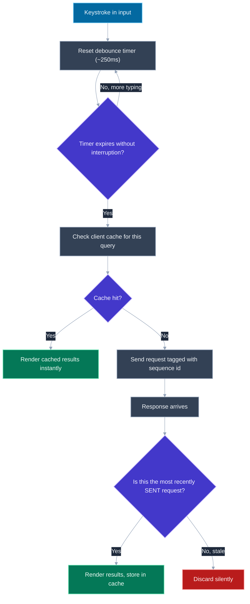
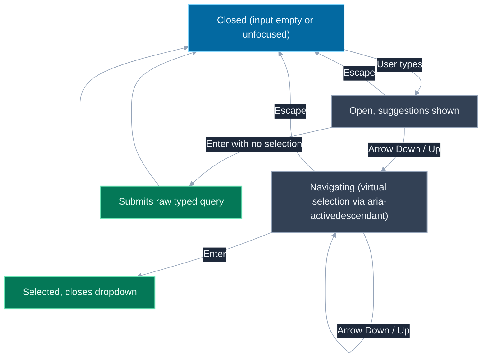

# Design an Autocomplete / Search-as-You-Type Component

## 🎯 Executive Summary

Autocomplete looks like the simplest possible system design prompt — an input box and a dropdown of suggestions — which is exactly why it's a MUST-KNOW at the Lead/Staff level: the surface area is small enough that there's nowhere to hide, and every subsystem (network timing, state consistency, accessibility) has a well-known failure mode that a shallow implementation walks straight into. Interviewers use it as a calibration question early in a Lead loop, because a candidate's handling of a small, bounded problem predicts how they'll handle a large one.

The core tension is that the feature only works if it feels instant, but every suggestion requires a real network round-trip that is neither instant nor guaranteed to return in the order it was sent. Everything in this topic — debouncing, request sequencing, caching — exists to reconcile "the user just typed a character and expects to see something now" with "the network is slow, unordered, and expensive to hit on every keystroke."

This question shows up almost verbatim as "design a search bar," "design Google's search suggestions," or embedded inside a larger prompt (a search-driven product surface) as the component the interviewer drills into once the high-level design is sketched. A Lead-level answer is expected to go past "debounce the input and show a dropdown" and into the specific correctness bugs — out-of-order responses, focus-breaking keyboard navigation — that a production autocomplete actually has to solve.

## 📖 What Is It? (Plain-English Definition)

**In plain terms:** autocomplete is the dropdown of suggestions that appears under a search box as you type, updating with every keystroke, so you can pick a likely result instead of typing the whole thing out and hitting enter.

Think of it like asking a very fast, slightly impatient friend to guess what you're about to say, but only after you pause for a beat — if you interrupt them mid-guess by typing more letters, they throw away the old guess and start over based on what you've typed so far. That "wait for a pause before guessing" behavior is the crux of the whole feature: guessing on every single keystroke would mean firing off (and then discarding) a network request for every partial, transient state of what the user is typing, most of which they never meant to pause on.

The other everyday-life analogy worth holding onto is a race: every keystroke can trigger a new request to the server, and because the network doesn't guarantee anything about delivery order, a request sent a moment ago for "rea" can come back to your browser *after* a request sent for "react" — if you're not careful about which response you trust, you can end up showing stale suggestions for a query the user has already typed past.

Here's how a production implementation actually handles both of those problems, plus the keyboard/screen-reader behavior that a real accessible version needs.

---

## 🧠 Core Technical Deep Dive

### Requirements framing: functional vs. non-functional

The functional requirements are almost too obvious to state: a user types into an input, sees a ranked list of suggestions update as they type, and can select one either by clicking it or navigating to it with the keyboard and pressing Enter. Stating these out loud in an interview is still worth doing quickly — it's the non-functional requirement that actually drives every interesting design decision in this topic.

The non-functional requirement that matters is **perceived instant responsiveness despite real network latency**. The user's mental model is "the suggestions just know what I'm typing," and every technique below — debouncing, caching, race-condition handling — is in service of preserving that illusion without either wasting network requests or occasionally flashing the wrong results. A secondary non-functional requirement worth naming is *resilience to fast typers*: someone who types at 100+ WPM will blow through naive per-keystroke request logic in a way a slow typist won't expose.

> **Key takeaway:** the functional spec for autocomplete is trivial; the entire design problem is a single non-functional requirement — perceived instant responsiveness — and everything else in this topic is a technique for satisfying it cheaply and correctly.

### Debounce vs. throttle, and why this is specifically a debounce problem

Throttle and debounce both rate-limit how often a function runs in response to a rapid stream of events, but they solve different problems. **Throttle** guarantees a function runs at most once per fixed interval *while events keep firing* — useful for something like a scroll handler, where you want continuous, evenly-spaced updates for as long as the user keeps scrolling. **Debounce** waits for a *pause* in events before running the function once — useful when only the final, settled state after a burst of activity matters.

Autocomplete is a debounce problem, not a throttle problem, because every character typed mid-word represents a transient, usually-not-meaningful prefix. If a user types "react" at normal speed, throttling at 250ms would still fire a request for "re" or "rea" — a prefix the user never intended to search for and immediately typed past — wasting a request and a render on results that will be discarded within milliseconds. Debouncing waits until 200-300ms have elapsed with no new keystroke, which in practice means "the user paused, possibly because they're done typing or thinking," and fires exactly one request for the query that's actually still on screen when it fires.

```javascript
function debounce(fn, delayMs) {
  let timeoutId;
  return function debounced(...args) {
    clearTimeout(timeoutId);
    timeoutId = setTimeout(() => fn.apply(this, args), delayMs);
  };
}

const fetchSuggestions = debounce((query) => {
  requestSuggestions(query);
}, 250);

input.addEventListener('input', (e) => fetchSuggestions(e.target.value));
```

The 200-300ms window is itself a trade-off: too short and it degenerates toward firing on nearly every keystroke for anyone typing at a normal pace; too long and the user perceives a lag between stopping typing and suggestions appearing. 250ms is a reasonable default cited across production implementations, but a Lead-level answer should name it as a tunable UX parameter, not a magic constant.

> **Key takeaway:** debounce fires once after a pause; throttle fires repeatedly at a fixed rate during continuous activity — autocomplete wants the former, because intermediate keystrokes mid-word are noise, not requests waiting to happen.

### The race condition: requests can return out of order

Debouncing controls *when* a request is sent, but it does nothing about what happens once multiple requests are already in flight — and with a 250ms debounce window, it's entirely possible for a user to trigger request A for "rea", keep typing, and trigger request B for "react" while A is still pending. The network makes no ordering guarantee between two independent requests: B can be served by a faster edge node, or A can be delayed by retries, and B's response can land in the browser *before* A's.

A naive implementation that just does `renderResults(response)` in every request's callback will render whichever response arrives last — which, in this scenario, is A's stale results for "rea", overwriting the correct, already-rendered results for "react" the user is currently looking at. This is the single most common correctness bug in real autocomplete implementations, and it's the detail interviewers use to separate candidates who've actually built one of these from candidates who are pattern-matching from a tutorial.

There are two standard fixes, and a Lead-level answer should know both and why one is generally preferable:

**1. Sequence numbers.** Tag every outgoing request with a monotonically increasing id. When a response arrives, only render it if its id matches the *most recently sent* request's id — not the most recently *received* one.

```javascript
let latestRequestId = 0;

async function fetchSuggestions(query) {
  const requestId = ++latestRequestId;
  const response = await api.getSuggestions(query);

  // Only render if no newer request has been sent since this one fired.
  if (requestId !== latestRequestId) return; // stale — discard silently
  renderSuggestions(response);
}
```

**2. `AbortController`.** Actually cancel the in-flight stale request when a newer one is about to be sent, rather than letting it complete and discarding its result client-side.

```javascript
let activeController = null;

async function fetchSuggestions(query) {
  activeController?.abort(); // cancel whatever's still in flight
  activeController = new AbortController();

  try {
    const response = await api.getSuggestions(query, { signal: activeController.signal });
    renderSuggestions(response);
  } catch (err) {
    if (err.name !== 'AbortError') throw err; // real error, not a cancellation
  }
}
```

`AbortController` is the generally preferred approach at Lead level because it also saves the wasted server-side work and bandwidth of a response that was always going to be thrown away — the sequence-number approach still lets the stale request complete end-to-end, it just ignores the result. The trade-off is that `AbortController` requires the request layer (fetch, or the HTTP client in use) to actually support cancellation, which isn't universal for every transport.

> **Key takeaway:** the fix for out-of-order responses is rendering based on the most-recently-*sent* request, never the most-recently-*received* one — via a sequence-id guard at minimum, or by actually cancelling stale in-flight requests with `AbortController` for the stronger version of the same fix.

### Client-side response caching

Users frequently backspace and retype, or retype a prefix they already searched moments earlier (typo-and-correct, or reconsidering a query). Without caching, every one of those repeated prefixes re-triggers a full network round-trip for a result the client already has. A simple `Map` keyed by the normalized query string, populated as responses arrive, turns a repeat query into a synchronous cache hit with zero network cost.

```javascript
const cache = new Map();

async function getSuggestions(query) {
  const key = query.trim().toLowerCase();
  if (cache.has(key)) return cache.get(key); // instant, no network

  const results = await api.getSuggestions(key);
  cache.set(key, results);
  return results;
}
```

This is a cheap addition with an outsized payoff for perceived performance — a cache hit returns synchronously, which is the fastest possible response to "the user paused after retyping something." The main design question is eviction: an unbounded `Map` for a long user session can grow, so a simple LRU cap (evict the oldest entry once the cache exceeds N queries) is enough for this use case without needing a heavier caching library.

> **Key takeaway:** memoizing query→results client-side is disproportionately cheap relative to its UX payoff, since backspacing and retyping a previous prefix are common typing patterns that a `Map` lookup satisfies instantly instead of re-hitting the network.

### Accessibility: the ARIA combobox pattern

Autocomplete is one of the clearest cases where a widget that "looks right" visually can be functionally broken for a screen-reader or keyboard-only user, because the interaction model — arrow keys move a *visual* highlight through a list that isn't actually focused — has no native HTML equivalent. The [ARIA combobox pattern](/topic-detail.html?id=accessibility-scale) exists specifically to describe this relationship to assistive technology.

The core structural pieces:

| Attribute/Role | On | Purpose |
|---|---|---|
| `role="combobox"` | The text input | Declares the input as the trigger for an associated popup listbox |
| `aria-expanded` | The text input | Toggled `true`/`false` as the suggestion list opens/closes |
| `aria-controls` | The text input | Points to the id of the listbox element, associating the two |
| `aria-activedescendant` | The text input | Set to the id of the currently-highlighted suggestion — this is the key mechanism |
| `role="listbox"` | The suggestions container | Declares the dropdown as a selectable list |
| `role="option"` | Each suggestion | Declares each row as a selectable item within the listbox |

The mechanism that makes this work without breaking anything is `aria-activedescendant`. Real DOM focus **stays on the text input** the entire time — arrow keys never move focus to a list item, because doing so would close the mobile keyboard, interrupt IME composition for non-Latin scripts, and generally break the "I'm still typing" affordance the user expects. Instead, arrow keys update a piece of local state (which suggestion index is "virtually" active), which is reflected two ways: visually, by applying a highlight class to that row, and to assistive technology, by updating `aria-activedescendant` on the input to point at that row's id. A screen reader announces the referenced option's content even though focus never left the input.

```javascript
function onKeyDown(e) {
  if (e.key === 'ArrowDown') {
    setActiveIndex((i) => Math.min(i + 1, suggestions.length - 1));
    e.preventDefault();
  } else if (e.key === 'ArrowUp') {
    setActiveIndex((i) => Math.max(i - 1, 0));
    e.preventDefault();
  } else if (e.key === 'Enter' && activeIndex >= 0) {
    selectSuggestion(suggestions[activeIndex]);
  } else if (e.key === 'Escape') {
    closeSuggestions();
  }
  // Focus never moves off the input for any of these keys.
}
```

> **Key takeaway:** the accessible version of this widget never moves real DOM focus off the input — `aria-activedescendant` lets arrow keys drive a virtual selection that's exposed to assistive tech via an attribute update, not a focus change, which is precisely the detail most non-accessible implementations get wrong.

### Highlighting matches and virtualizing long result lists

Bolding the portion of each suggestion that matched the typed query is a small but expected UX affordance — it lets users visually confirm why a suggestion is relevant without reading the whole string. This is a pure rendering concern: split each suggestion string on the matched substring's index/length (returned by the API or computed client-side) and wrap that slice in a `<mark>` or styled `<span>`, being careful to escape the surrounding text if it's ever rendered via `innerHTML`.

If the suggestion list can be very long (a broad, low-specificity query returning hundreds of candidates), mounting every row as a DOM node is wasteful the same way it is for any long list — the standard fix is windowing/virtualization, rendering only the rows currently in the visible viewport plus a small buffer. This isn't specific to autocomplete; it's the same technique covered in depth for feed-style lists, and for a typical autocomplete dropdown showing 5-10 suggestions it's usually unnecessary — worth naming as a scaling concern rather than something to implement by default.

> **Key takeaway:** substring highlighting is cheap and expected; virtualization is a real but usually-unneeded technique that only earns its complexity once result lists are long enough to matter, which most autocomplete dropdowns aren't.

### Backend considerations: scope this with the interviewer first

Everything above is squarely a frontend concern, but "design autocomplete" can implicitly pull in backend prefix-matching design (a trie or a dedicated search index/service capable of fast prefix lookups over a large corpus) if the interviewer wants that depth. The right move, per the [general framework for structuring a system design answer](/topic-detail.html?id=frontend-system-design-framework), is to explicitly ask whether the backend suggestion-ranking service is in scope before spending interview time designing a trie, rather than assuming either that it's out of scope or that you're expected to design it unprompted.

If it is in scope, the one-sentence version worth having ready: a trie (prefix tree) gives O(prefix length) lookup for exact-prefix matching and is a reasonable answer for a bounded vocabulary, while a real production search-suggestion service (e.g., an inverted index with fuzzy/typo-tolerant ranking) is what's actually behind large-scale product surfaces like Google's search box, and going deeper than that is usually its own separate system design question.

> **Key takeaway:** naming the trie/search-index option is enough to show backend awareness — treat "how deep do you want me to go on the backend" as a clarifying question to ask, not an assumption to make silently in either direction.

## 📊 Visual Architecture & Logic

### Diagram 1 — Debounced, race-condition-safe request flow



### Diagram 2 — Combobox interaction states



## 🏢 Interview Context & FAANG Signals

| Interview Stage | Format |
|---|---|
| Frontend System Design round | Standalone 45-60min prompt, or a deep-dive component within a larger search-product design |
| Coding round | Live implementation of the debounce + race-condition guard, sometimes with a provided mock API |
| Take-home / pairing | Building the combobox with full keyboard/ARIA support, reviewed for accessibility compliance |

**Lead signals interviewers listen for:**

1. Naming debounce (not throttle) unprompted, and explaining *why* in terms of discarding transient mid-word prefixes rather than just "it's more efficient."
2. Identifying the out-of-order response race condition without being prompted, and knowing both the sequence-id and `AbortController` fixes plus the trade-off between them.
3. Describing `aria-activedescendant` specifically, rather than a vague "make it accessible" — and explaining why focus must stay on the input.
4. Treating client-side caching as a cheap, high-value addition rather than skipping it as an afterthought.
5. Explicitly asking whether backend prefix-search design is in scope, rather than either ignoring the backend entirely or unpromptedly designing a trie no one asked for.

## ⚔️ Lead Level vs Senior Level

**Question: "Walk me through what happens, end to end, when a user types 'react' one letter at a time into your autocomplete."**

> **Senior Response:** "Each keystroke updates the input's state. I'd debounce the API calls so we're not firing a request on every single character — wait maybe 250ms after the user stops typing, then send the request and render whatever suggestions come back in the dropdown."

> **Staff/Lead Response:** "Every keystroke resets a 250ms debounce timer, so a request only fires once the user pauses. But firing one request per pause isn't sufficient by itself — because the user can pause more than once while typing 'react' (say, after 're' and again after 'react'), two requests can end up in flight, and the network doesn't guarantee the second one returns after the first. So every request carries a sequence id, or I use `AbortController` to actually cancel the earlier one, and on response I only render if it's still the most recently *sent* request — never just the most recently received. Before any of that fires, I check a client-side cache in case this exact query string was already answered earlier in the session. And separately from the network path, arrow-key navigation through the results has to update `aria-activedescendant` on the input rather than moving real focus into the list, or a screen-reader user loses the ability to keep typing while navigating suggestions."

What separates them: the Senior answer describes the happy path correctly; the Lead answer names the specific failure mode (out-of-order responses) that the happy path doesn't handle and treats accessibility as a first-class part of "the interaction," not a separate checklist item.

## ⚠️ Common Pitfalls & Anti-Patterns

> ### ✕ Throttling instead of debouncing the input
> **Why it's wrong:** Throttling fires at a fixed interval even while the user is still mid-word, sending requests for transient prefixes ("rea") that were never the intended query and will be discarded within milliseconds — wasted requests and wasted renders.
> **✓ Correct Lead Approach:** Debounce so a request only fires after a pause (~200-300ms) in typing, which in practice means firing for the query the user actually paused on rather than every intermediate keystroke.

---

> ### ✕ Rendering whichever response arrives first, with no ordering guard
> **Why it's wrong:** The network gives no ordering guarantee between two in-flight requests; a stale response for an earlier, shorter query can arrive after the response for the current query and silently overwrite correct, currently-displayed results.
> **✓ Correct Lead Approach:** Tag requests with a sequence id and only render a response if it matches the most-recently-*sent* request, or cancel stale in-flight requests outright with `AbortController`.

---

> ### ✕ Moving real DOM focus to a list item on arrow-key navigation
> **Why it's wrong:** Moving focus off the text input interrupts typing, breaks IME composition for non-Latin input methods, and can dismiss the on-screen keyboard on mobile — none of which match the "I'm still typing" mental model the widget is supposed to preserve.
> **✓ Correct Lead Approach:** Keep real focus on the input at all times; drive the visual and assistive-tech-facing "current selection" via local state plus `aria-activedescendant`, never via `element.focus()` on a list row.

---

> ### ✕ Re-fetching every time the user backspaces to a previously-typed prefix
> **Why it's wrong:** Backspacing and retyping a prefix already queried moments earlier is common typing behavior, and re-hitting the network for a result the client already has wastes a request and adds latency the user will notice, for zero benefit.
> **✓ Correct Lead Approach:** Cache query→results in a simple in-memory `Map`, keyed by normalized query string, so a repeat prefix resolves synchronously from cache instead of round-tripping again.

---

> ### ✕ Designing the entire backend prefix-search architecture unprompted
> **Why it's wrong:** Spending significant interview time on trie construction or search-index internals when the interviewer wanted a frontend-focused answer burns time that should go toward the debounce/race-condition/accessibility depth that's actually being evaluated in a frontend round.
> **✓ Correct Lead Approach:** Name the backend approach in one sentence (a trie or a dedicated prefix-search service) and explicitly ask the interviewer how deep they want you to go before committing more time to it.

## 🛠️ Practice Scenarios

### Scenario 1: Fixing a flashing-wrong-results bug

**Problem:**
```javascript
// Users report that fast typing sometimes briefly shows
// suggestions for an earlier, shorter query before "correcting"
// itself a moment later.
let debounceTimer;

function onInput(e) {
  clearTimeout(debounceTimer);
  debounceTimer = setTimeout(async () => {
    const query = e.target.value;
    const results = await api.getSuggestions(query);
    renderSuggestions(results); // <-- bug is here
  }, 250);
}
```

What's causing the flash, and how would you fix this code?

<details>
<summary>Staff-Level Solution</summary>

The debounce itself is fine — the bug is that nothing guards against out-of-order responses once two debounced requests are both in flight (which happens whenever the user pauses more than once while typing, each pause past the 250ms window firing its own request). `renderSuggestions` runs unconditionally in every callback, so whichever response's promise resolves last wins, regardless of which query is actually still on screen. If the request for an earlier, shorter query happens to take longer to return, its results render *after* the newer, correct results — exactly the flash being reported.

The fix is a sequence-id guard: track the id of the most recently *sent* request, and only render inside a callback if its captured id still matches that value at the time the response arrives.

```javascript
let debounceTimer;
let latestRequestId = 0;

function onInput(e) {
  clearTimeout(debounceTimer);
  debounceTimer = setTimeout(async () => {
    const query = e.target.value;
    const requestId = ++latestRequestId;
    const results = await api.getSuggestions(query);
    if (requestId !== latestRequestId) return; // a newer request has since been sent
    renderSuggestions(results);
  }, 250);
}
```

I'd mention `AbortController` as the stronger version of this same fix in a follow-up — it additionally cancels the stale request's network work instead of just ignoring its result — but the sequence-id guard alone is enough to eliminate the visible bug being reported.
</details>

### Scenario 2: An accessibility audit flags the suggestion dropdown

**Problem:**
```javascript
// Current implementation: arrow keys move actual focus into
// the suggestion list items, which are individually focusable divs.
function onKeyDown(e) {
  if (e.key === 'ArrowDown') {
    const items = document.querySelectorAll('.suggestion-item');
    const next = document.activeElement.nextElementSibling ?? items[0];
    next.focus(); // moves real DOM focus
  }
}
```
```html
<input type="text" id="search-input" />
<div class="suggestions">
  <div class="suggestion-item" tabindex="-1">React</div>
  <div class="suggestion-item" tabindex="-1">Redux</div>
</div>
```

An accessibility audit reports that screen-reader users "lose the ability to keep typing" once they press an arrow key. Diagnose and redesign.

<details>
<summary>Staff-Level Solution</summary>

The audit finding is a direct consequence of moving real DOM focus off the input on `ArrowDown` — once `next.focus()` runs, the text input is no longer focused, so any further typing does nothing to the search query, and depending on the screen reader, the user may now be in a completely different interaction mode than the one they were just in. This is the canonical case the ARIA combobox pattern exists to solve.

The redesign keeps focus on the input for the entire interaction and expresses the "current suggestion" purely through state plus `aria-activedescendant`:

```html
<input
  type="text"
  id="search-input"
  role="combobox"
  aria-expanded="true"
  aria-controls="suggestions-listbox"
  aria-activedescendant="suggestion-0"
/>
<ul id="suggestions-listbox" role="listbox">
  <li id="suggestion-0" role="option" class="active">React</li>
  <li id="suggestion-1" role="option">Redux</li>
</ul>
```

```javascript
let activeIndex = -1;

function onKeyDown(e) {
  const input = document.getElementById('search-input');
  if (e.key === 'ArrowDown') {
    activeIndex = Math.min(activeIndex + 1, suggestions.length - 1);
  } else if (e.key === 'ArrowUp') {
    activeIndex = Math.max(activeIndex - 1, 0);
  } else {
    return;
  }
  e.preventDefault();
  input.setAttribute('aria-activedescendant', `suggestion-${activeIndex}`);
  updateVisualHighlight(activeIndex); // CSS class only, no .focus() call
}
```

Focus never leaves `#search-input`, so the user can keep typing at any point during navigation, and a screen reader announces the currently-referenced option's text via the `aria-activedescendant` update rather than via a focus event — which is exactly what the audit is asking for.
</details>

### Scenario 3: Scaling to a very fast typist

**Problem:**
```javascript
// Product wants suggestions to feel "instant" even for a typist
// hitting 130+ WPM. Current debounce is fixed at 250ms and there's
// no caching, so heavy typists complain the dropdown feels laggy
// and janky, updating a beat behind their cursor.
const fetchSuggestions = debounce((query) => {
  api.getSuggestions(query).then(renderSuggestions);
}, 250);
```

What would you change, and what wouldn't you change, to address this complaint?

<details>
<summary>Staff-Level Solution</summary>

I wouldn't lower the debounce window aggressively to "fix" perceived laziness — a very fast typist produces more transient intermediate states per second, so a shorter debounce window actually increases the number of wasted in-flight requests and, combined with a fast network, increases exposure to the out-of-order race condition rather than reducing it. 250ms is already a reasonable default; I'd validate the complaint is really about latency-to-first-suggestion rather than debounce timing before touching that constant.

What I would add is caching, which directly addresses "feels laggy" for the specific pattern fast typists exhibit — overshooting a word and backspacing, or re-typing a corrected prefix — since a cache hit renders synchronously with no debounce wait at all:

```javascript
const cache = new Map();
const fetchSuggestions = debounce(async (query) => {
  const key = query.trim().toLowerCase();
  if (cache.has(key)) {
    renderSuggestions(cache.get(key)); // instant, skips the network entirely
    return;
  }
  const results = await api.getSuggestions(key);
  cache.set(key, results);
  renderSuggestions(results);
}, 250);
```

I'd also add the sequence-id/`AbortController` guard regardless, since a fast typist is exactly the user profile most likely to have multiple requests in flight simultaneously and most likely to notice a flash of stale results. The actual lever for "feels instant" here is caching and race-safety, not shrinking the debounce window.
</details>
