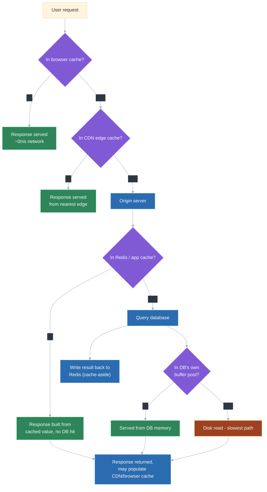
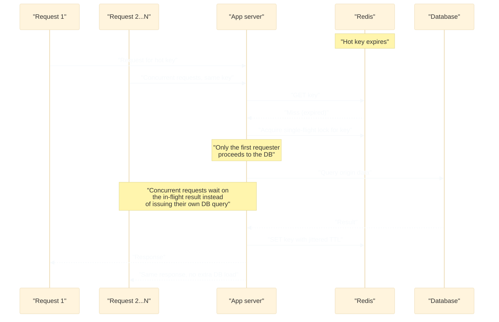

# Design a caching layer (CDN + Redis patterns)

## 🎯 Executive Summary

Caching is not "add Redis in front of the database" — it's a **consistency-vs-latency negotiation** repeated at every layer between the user and the source of truth. Every layer that stores a copy of data closer to where it's consumed (browser, CDN edge, application cache, database buffer pool) buys latency and reduces load on the layer behind it, but simultaneously creates a new copy that can drift from the truth and needs an explicit story for going stale correctly.

This is a must-know topic because it rarely appears as a standalone prompt only — it's a component inside nearly every other system design answer (a URL shortener's redirect cache, a feed's item cache, a search-results cache), and a candidate who says "we'd add a cache" without naming which invalidation strategy, which eviction policy, and which consistency trade-off applies to *this specific* data has not actually answered the question. A Lead-level answer treats cache placement and invalidation as the design, not an implementation detail bolted on afterward.

## 🧠 Core Technical Deep Dive

### The cache placement spectrum

Every cacheable piece of data can live at multiple points between the user and the database, and each point trades proximity (lower latency, higher potential hit rate) against invalidation difficulty (how hard it is to guarantee everyone sees a fresh value once the truth changes). Picking a layer is really picking how stale you're willing to let data get and for how long.

| Layer | What it caches | Typical TTL | Invalidation difficulty | Latency win |
|---|---|---|---|---|
| **Browser cache** | Static assets, sometimes full API responses (`Cache-Control`) | Minutes to years (with versioned URLs) | Easy for versioned assets (new URL = new cache entry); hard for unversioned ones (client must wait out the TTL) | Largest — zero network round trip |
| **CDN edge cache** | Static assets, full-page HTML, API responses | Seconds to days | Moderate — purge APIs exist but propagate across edge nodes with delay | Large — round trip to nearest edge, not origin |
| **Application cache (Redis/Memcached)** | Query results, computed objects, sessions, rate-limit counters | Seconds to hours | Fully controllable — the app owns writes and can invalidate explicitly | Medium — round trip within the data center, no DB query |
| **Database internal cache** (buffer pool, query cache) | Hot pages/rows already in memory | Managed by the DB engine, not app-configurable | Automatic and always consistent — it's the source of truth's own memory | Smallest — still a DB round trip, just no disk I/O |

The pattern across the table is consistent: the closer a cache sits to the user, the bigger the latency win and the less control the application has over exactly when a stale entry gets replaced. Application-level caches sit at the sweet spot for most system design answers because the application retains full control over invalidation while still avoiding a DB round trip.

> **Key takeaway:** there's no single "the cache" — a real design names which layer handles which piece of data, and justifies each choice by how much staleness that specific data can tolerate.

### Read/write strategies: cache-aside, read-through, write-through, write-behind

How the cache gets populated and kept in sync with the database is a separate decision from where the cache lives. These four patterns cover the overwhelming majority of real systems, and interviewers expect the trade-offs named explicitly, not just the pattern picked.

| Strategy | How it works | Consistency | Write latency | Failure mode |
|---|---|---|---|---|
| **Cache-aside** (lazy loading) | App checks cache; on miss, reads DB and writes result back to cache | Cache and DB can drift briefly between a DB write and the next cache refresh | Fast — writes go straight to the DB, cache is untouched | A crash between DB write and cache update leaves a stale cache entry until TTL expiry |
| **Read-through** | Cache itself owns fetching from the DB on a miss, transparent to the app | Same drift risk as cache-aside, but the fetch logic lives in the cache layer, not scattered across app code | Fast — same as cache-aside | Same as cache-aside, centralized in one place |
| **Write-through** | Writes go to cache and DB synchronously as one logical operation | Strong — cache is never stale after a successful write | Slower — every write pays the cost of both writes, and they must be transactionally coordinated | A cache write failure after a successful DB write needs explicit handling (retry or invalidate) |
| **Write-behind (write-back)** | Write goes to cache immediately; DB write is flushed asynchronously | Weak until flush — DB can lag the cache by design | Fastest — write returns after touching only the cache | Cache failure before flush loses the write entirely — real data-loss risk |

Cache-aside is the default for most systems specifically because it's simple, resilient to cache outages (the app just falls back to the DB), and doesn't require coupling every write path to the cache. Write-through and write-behind earn their added complexity only when the workload specifically demands it — write-through for correctness-critical data that's read immediately after write, write-behind for write-heavy workloads (metrics, counters) where losing a few recent writes on a crash is an acceptable trade for write throughput.

> **Key takeaway:** naming cache-aside as "the default" isn't enough at Lead level — the interview signal is explaining *why* a specific workload's read/write ratio and durability requirement pushes toward one of the other three instead.

### The two genuinely hard problems: invalidation and the stampede

The old line "there are only two hard things in computer science: cache invalidation and naming things" undersells how mechanical the actual failure modes are. Invalidation strategy is a spectrum: TTL-based expiry (simplest, but data can be stale for up to the full TTL window), explicit invalidation on write (the app deletes or updates the cache entry the moment the DB write commits, tightest consistency but requires every write path to remember to do it), and versioned/keyed entries (the cache key itself encodes a version, so old entries are never explicitly deleted — they just become unreachable and age out naturally, sidestepping the "did every write path remember to invalidate" problem).

The **cache stampede** (thundering herd) is a distinct, operational problem: a single hot key expires, and hundreds or thousands of concurrent requests all miss the cache simultaneously and hit the database at once, often enough to take it down. This is especially dangerous right after a deploy or cache flush, when many keys expire or get evicted together instead of at staggered times.

| Mitigation | Mechanism |
|---|---|
| **Request coalescing / single-flight** | The first request on a miss triggers the DB fetch; concurrent requests for the same key wait on that in-flight result instead of issuing their own DB query |
| **Jittered TTLs** | Add random variance to each key's TTL so a batch of keys populated together doesn't expire in the same instant |
| **Stale-while-revalidate** | Serve the slightly-stale cached value immediately to every requester while one background request refreshes it, so no one waits on the DB and no stampede occurs |

> **Key takeaway:** naming "TTL-based expiry" as the invalidation strategy without addressing the stampede case is an incomplete answer — the moment a hot key's TTL is the *only* invalidation mechanism, that key's expiry becomes a predictable, recurring load spike on the database.

### CDN-specific patterns

CDNs cache two distinct things — static assets (JS/CSS/images, effectively immutable once versioned) and full-page or API responses (mutable, tied to `Cache-Control`/`ETag` headers) — and the invalidation story differs sharply between them. Static, versioned assets never need active invalidation: a content hash in the filename means a changed file is simply a new URL, and old cached copies harmlessly age out.

Dynamic content invalidation is where CDNs get hard: a purge API call to invalidate a path doesn't take effect instantly everywhere — it has to propagate across potentially hundreds of geographically distributed edge nodes, and that propagation has real, non-zero delay (seconds, sometimes longer depending on provider and scope of the purge). A Lead-level answer to "how do we make sure users see updated content immediately after a publish" has to reckon with this delay explicitly rather than assuming a purge call is synchronous and global.

Stale-while-revalidate is a CDN-native pattern for exactly this trade-off: the edge node serves the cached response immediately (fast, but possibly stale) while asynchronously fetching a fresh copy from origin in the background for the *next* request. This bounds worst-case staleness to roughly one request cycle without ever making a user wait on an origin round trip.

> **Key takeaway:** CDN purges are not instant and not free — a design that depends on "we'll just purge the CDN" for time-sensitive content needs to state the propagation delay and whether that delay is acceptable for the use case.

### Redis-specific patterns: data structures and eviction

Redis is frequently used as a plain key-value store when its native data structures would solve the actual problem more efficiently. Sorted sets (`ZADD`/`ZRANGE`) are the natural fit for leaderboards and sliding-window rate limiting because they maintain order by score with O(log N) inserts. Hashes let a single field of a cached object be updated (`HSET user:123 email new@x.com`) without re-serializing and rewriting the entire blob, which matters when the cached object is large and only small pieces of it change frequently.

Eviction policy determines what Redis discards under memory pressure, and the right default depends on the access pattern of what's stored.

| Policy | Evicts | Best for |
|---|---|---|
| **LRU** (Least Recently Used) | The entry that hasn't been accessed in the longest time | General-purpose caching with roughly uniform, recency-driven access patterns — the safe default |
| **LFU** (Least Frequently Used) | The entry accessed the fewest total times | Workloads with a stable "hot set" that's accessed constantly, where a recently-touched-but-rarely-used entry shouldn't survive over a consistently popular one |
| **TTL-based (volatile-ttl)** | The entry closest to its expiry, among keys that have a TTL set | Workloads where explicit expiry semantics matter more than access pattern — session stores, time-bounded tokens |

`allkeys-lru` is the pragmatic default for a general-purpose cache because it requires no per-key TTL bookkeeping and handles the common case (recently-used data is likely to be reused) well; LFU is worth the extra overhead specifically when the access pattern has a small, very hot subset that recency alone would misjudge.

> **Key takeaway:** reaching for Redis's richer data structures (sorted sets, hashes) instead of stringifying a JSON blob into a plain key is a concrete Lead-level signal — it shows the candidate is designing for the access pattern, not just "storing stuff in Redis."

### Cache key design as a real decision

The cache key is not an implementation detail — it's the boundary of what counts as "the same cached thing," and getting its scope wrong breaks the cache in one of two opposite directions. A key that's too narrow (missing a dimension the response actually varies on — locale, auth state, feature flag) causes **cache poisoning**: one user's cached response gets served to a different user for whom it's wrong or even a security leak. A key that's too broad (embedding something high-cardinality and irrelevant, like a full user-agent string or a request timestamp) drives the hit rate toward zero because almost every request generates a unique key.

Versioning the key scheme itself — for example `user:v2:123` instead of `user:123` — is what lets a schema change ship without a manual, coordinated cache flush: old-format entries under the old prefix simply age out via TTL while new code only ever reads and writes the new prefix, and the two coexist safely during rollout.

> **Key takeaway:** cache key design is where invalidation strategy and hit-rate optimization actually collide in practice — a Lead-level answer treats it as a deliberate schema, not a string concatenation.

## 📊 Visual Architecture & Logic

### Diagram 1 — Cache layer placement and a request's path

### Diagram 2 — Cache stampede: the failure and its mitigation

## 🏢 Interview Context & FAANG Signals

Caching shows up two ways in FAANG Lead/Staff rounds: as its own prompt ("design a caching layer for our API") and, far more often, as a required component buried inside a bigger prompt (a URL shortener needs a redirect cache, a news feed needs an item cache, a search service needs a results cache). Interviewers are listening for whether the candidate treats caching as a real design decision or as a reflexive answer that gets waved at without specifics.

**Lead signals interviewers listen for:**

- Naming the specific invalidation strategy for the data at hand (TTL, explicit invalidation, versioned keys) instead of saying "we'd add a cache" as if that alone solves the problem.
- Explicitly identifying whether a given piece of data can tolerate eventual consistency (cache-aside is fine) or needs strong consistency (write-through, or no caching at all).
- Bringing up the stampede/thundering-herd problem unprompted for any "hot key" scenario, with a named mitigation.
- Discussing CDN purge propagation delay as a real constraint rather than assuming global invalidation is instant.
- Justifying a cache key's scope (what's included, what's deliberately excluded) rather than treating the key as an implementation footnote.

## ⚔️ Lead Level vs Senior Level

**Scenario: "Design a caching strategy for our product page API, which is read-heavy but includes a live inventory count."**

A **Senior** response is directionally correct: put a CDN in front of static product content, add a Redis cache-aside layer in front of the database for the API responses, and set a TTL.

A **Lead/Staff** response covers similar ground but is evaluated on additional dimensions:

- **Splits the response by staleness tolerance instead of caching it as one blob**: caches the product description/images/pricing (changes rarely, tolerates minutes of staleness) separately from the inventory count (changes constantly, needs near-real-time accuracy), rather than applying one TTL to the whole payload.
- **Names the invalidation mechanism per field**: TTL-based expiry with a short window for inventory, explicit invalidation on write for anything with strict correctness requirements like price.
- **Anticipates the stampede case unprompted**: a flash-sale item with sudden traffic is exactly the hot-key-expiry scenario, and proposes jittered TTLs and request coalescing before being asked.
- **States the CDN purge propagation delay explicitly** when discussing how fast a price change reaches every edge node, instead of assuming a purge call is instantaneous globally.
- **Designs the cache key with the schema evolution question in front of them**: a versioned key prefix so a future field addition to the cached payload doesn't require a coordinated manual flush.

The differentiator: a Senior answer produces a cache that works under normal load; a Lead answer produces one with an explicit theory for staleness tolerance per field and for what happens the moment a key goes hot or a schema changes.

## ⚠️ Common Pitfalls & Anti-Patterns

> ### ✕ Caching everything with one uniform TTL regardless of data volatility
> **Why it's wrong:** A single TTL applied to a payload with fields of wildly different volatility (e.g., product description vs. live inventory) either serves stale-critical data too long or evicts stable data far more often than necessary, wasting hit rate for no consistency benefit.
> **✓ Correct Lead Approach:** Split cacheable data by staleness tolerance and assign each its own TTL and invalidation strategy — cache-aside with a long TTL for stable fields, explicit invalidation or a short TTL for volatile ones.

> ### ✕ Relying solely on TTL expiry with no stampede protection on hot keys
> **Why it's wrong:** When a hot key's TTL is the only invalidation mechanism, its expiry becomes a predictable, recurring moment where every concurrent request misses simultaneously and hits the database at once — a self-inflicted, entirely foreseeable load spike.
> **✓ Correct Lead Approach:** Add request coalescing (single-flight on the fetch) and jittered TTLs for any key with meaningfully concurrent traffic, and consider stale-while-revalidate so no requester ever waits on a synchronous DB fetch.

> ### ✕ Assuming a CDN purge is instant and globally consistent
> **Why it's wrong:** Purge/invalidation APIs propagate across distributed edge nodes with real, non-zero delay — a design that assumes "purge the CDN" means every user everywhere sees fresh content immediately will be wrong for time-sensitive content.
> **✓ Correct Lead Approach:** State the propagation delay explicitly as a design constraint, and use stale-while-revalidate or a short TTL for content where that delay matters, rather than depending on purge timing alone.

> ### ✕ Designing a cache key that's too broad or too narrow
> **Why it's wrong:** A key missing a dimension the response actually varies on (locale, auth state) causes cache poisoning — serving one user's cached response to another. A key including high-cardinality, irrelevant data (a full user-agent string, a timestamp) drives the hit rate toward zero.
> **✓ Correct Lead Approach:** Treat the cache key as a deliberate schema — include exactly the dimensions the response varies on, no more and no less — and version the key prefix so schema changes don't require a manual, coordinated flush.

> ### ✕ Using write-behind caching for data that can't tolerate loss
> **Why it's wrong:** Write-behind returns after only the cache write succeeds, deferring the database write asynchronously — if the cache fails before that flush completes, the write is gone permanently, which is unacceptable for anything like financial or order data.
> **✓ Correct Lead Approach:** Reserve write-behind for workloads where losing a small window of recent writes is an acceptable trade for write throughput (metrics, counters, analytics events), and use write-through or synchronous writes for anything with a real durability requirement.

## 🛠️ Practice Scenarios (5-10 Scenarios)

<strong>Scenario 1: Choosing cache-aside vs. write-through for a user profile service</strong>

**Problem statement:** A user profile service is read far more often than written, but profile data (display name, avatar) is shown immediately after a user edits it, and showing stale data right after an edit reads as a visible bug. Choose a caching strategy.

**Staff-Level Solution:**
The read-heavy, low-write-volume profile means cache-aside's usual weakness (a brief drift window between DB write and cache refresh) is the actual problem here, since users expect to see their own edit reflected immediately. Pure cache-aside with a TTL would show the old avatar for up to the TTL window after every edit, which is a bad, visible experience for the exact action a user just took.

I'd use cache-aside for the general read path (cheap, resilient to cache outages) but pair it with explicit invalidation on write: the moment a profile update commits to the DB, the app deletes (not updates) the corresponding cache key, so the next read is a guaranteed cache miss that repopulates from the fresh DB row. Deleting rather than updating the cache avoids a race where a concurrent read repopulates the cache with a stale value between the DB write and a cache update.

<strong>Scenario 2: Diagnosing a cache stampede after a deploy</strong>

**Problem statement:** Immediately after every deploy, the database sees a sharp CPU spike lasting about 90 seconds, then recovers. This doesn't happen at any other time. Diagnose and fix.

**Staff-Level Solution:**
A deploy that restarts application servers (and therefore any in-process cache) or flushes a shared Redis cache as part of the release process would explain a spike isolated to exactly that moment: every hot key is suddenly gone at once, and the full weight of production read traffic hits the database simultaneously until the cache repopulates. I'd confirm by correlating the deploy timestamp against Redis's `keyspace_misses` metric — a sharp spike in misses at deploy time would confirm mass cache invalidation is the trigger.

The fix is to never let a deploy cause a synchronized cache-empty moment: avoid flushing the cache as part of deploy tooling unless the data format actually changed, and if it did change, use a versioned key prefix so old and new entries coexist rather than deleting everything. I'd also add request coalescing so that even in a genuine mass-miss scenario, concurrent requests for the same key collapse into one DB query instead of each issuing its own.

<strong>Scenario 3: Designing CDN purge behavior for a content update</strong>

**Problem statement:** A news site publishes breaking news updates to existing articles roughly every few minutes during a live event, and readers report seeing outdated versions of the article for up to a minute after each edit. Design the CDN caching and purge behavior.

**Staff-Level Solution:**
A short, fixed TTL alone forces a trade-off between staleness (too long) and origin load (too short, effectively no caching), which is a bad fit for content that updates unpredictably during live events. I'd use stale-while-revalidate at the CDN level instead: serve the cached article instantly on every request, while the edge asynchronously fetches a fresh copy from origin in the background, bounding worst-case staleness to roughly one request cycle without ever making a reader wait on an origin round trip.

For the specific moment of a live update, I'd also trigger an explicit purge call on publish rather than relying on TTL alone, but I'd design the system assuming that purge takes measurable time to propagate across edge nodes globally — not instantaneous — and communicate that propagation window as a known limit rather than promising immediate global consistency.

<strong>Scenario 4: Choosing an eviction policy for a memory-constrained Redis instance</strong>

**Problem statement:** A Redis instance backing a product catalog cache is hitting its memory limit. Some products are perennially popular (top sellers, cached constantly), while most products are looked at rarely and sporadically. Choose an eviction policy.

**Staff-Level Solution:**
Plain LRU is vulnerable here: a burst of rare-product lookups (a marketing campaign linking to a normally-obscure item, or a crawler sweeping the catalog) would look "recently used" and could evict genuinely hot, perennially-popular products purely based on recency, even though those products get accessed far more often over any longer window. LFU is the better fit because it tracks access frequency over time rather than recency alone, so a one-time burst of rare lookups doesn't push out the consistently hot set.

I'd configure `allkeys-lfu` and validate the choice with production access-pattern data (Redis's `OBJECT FREQ` for sampled keys) before committing, since LFU adds bookkeeping overhead that's only worth it if the hot/cold split is real and stable — if access patterns turn out to be closer to uniform, plain LRU would be simpler and nearly as effective.

<strong>Scenario 5: Designing a cache key scheme that survives a schema migration</strong>

**Problem statement:** A cached user object is about to gain new fields (a `preferences` object) as part of a schema change. The team is worried about needing a coordinated, manual cache flush at deploy time to avoid serving old-format cached objects to new code that expects the new fields. Design the key scheme to avoid this.

**Staff-Level Solution:**
The root problem is that the current key (`user:123`) doesn't encode schema version, so old and new code are forced to fight over the same cache entries during a rolling deploy — whichever version wrote most recently wins, and the other version reads a shape it doesn't expect. I'd version the key prefix instead: `user:v2:123` for the new schema, so new code only ever reads/writes `v2` keys and old code (mid-rollout) continues reading/writing `v1` keys undisturbed.

Old `v1` entries need no manual cleanup — they simply age out via their existing TTL once no code is reading them anymore, and worst case they sit as a small amount of unused memory until eviction. This pattern generalizes: any time a cached object's shape changes, bumping the version segment of the key is strictly safer than trying to migrate or flush existing entries in place.

<strong>Scenario 6: Debugging stale data served after a write (invalidation bug)</strong>

**Problem statement:** Users report that after changing their email address, the old email still shows in the app for several minutes despite the database being updated immediately. Debug and fix.

**Staff-Level Solution:**
This is a classic cache-aside drift symptom, but the multi-minute duration (rather than an instant flicker) suggests the invalidation-on-write step is either missing or targeting the wrong key, not just normal TTL-window staleness. I'd check the write path first: does the email-update endpoint actually call a cache delete/invalidate after the DB commit, and does the key it invalidates match the key the read path actually uses (a common bug is invalidating `user:123` while the read path caches under a different key shape, like `user:123:profile`).

A second likely culprit given multiple app server instances: if invalidation only clears a local in-process cache rather than the shared Redis layer, other instances keep serving their own stale local copy indefinitely. The fix is ensuring a single shared invalidation point (delete the Redis key on write) that every instance reads through, and adding a regression test that asserts a write is followed by a cache miss on the very next read for that key.

<strong>Scenario 7: Applying stale-while-revalidate to reduce perceived latency</strong>

**Problem statement:** A dashboard's summary API is expensive to compute (a few hundred milliseconds, aggregating several tables) and is requested frequently by an internal tool. The data doesn't need to be perfectly real-time — a few seconds of staleness is acceptable. Reduce perceived latency without overloading the database.

**Staff-Level Solution:**
A plain cache-aside with a short TTL still forces one unlucky requester per TTL window to pay the full few-hundred-millisecond computation cost synchronously, right when the cache expires. Stale-while-revalidate removes that entirely: serve the last computed result immediately from cache on every request (near-zero latency), and if the cached value is older than a freshness threshold, kick off an asynchronous background recomputation that refreshes the cache for the *next* request, without making the current requester wait on it.

This bounds staleness to roughly one refresh interval while guaranteeing every user-facing request returns fast, and it naturally throttles recomputation frequency since only one background refresh needs to be in flight per key at a time — I'd pair it with the same single-flight coalescing used for stampede protection so concurrent stale-triggering requests don't each kick off a redundant recomputation.

<strong>Scenario 8: Reasoning about cache consistency across multiple app server instances</strong>

**Problem statement:** The application runs on 20 horizontally-scaled instances behind a load balancer. Each instance currently keeps a local in-process cache (a simple in-memory map) for frequently-read data, but users occasionally see inconsistent results depending on which instance handles their request. Explain the problem and propose a fix.

**Staff-Level Solution:**
The inconsistency is structural, not a bug: each of the 20 instances has its own independent in-memory cache with its own independent TTL clock and its own independent view of when a given key was last invalidated, so at any moment different instances can legitimately hold different cached values for the same key. A write on one instance that invalidates its own local cache does nothing to the other 19 instances' copies, which keep serving stale data until their own TTLs happen to expire.

The fix is moving the cache to a shared layer (Redis) that every instance reads and writes through, so there's exactly one cached copy of each key and one invalidation event reaches every instance simultaneously. Local in-process caching isn't necessarily wrong to keep as an additional layer in front of Redis for very hot, small data (shaving even the Redis round trip), but if it's kept, it needs a much shorter TTL than the shared layer and an explicit acknowledgment that it reintroduces the same cross-instance drift on a smaller time scale — not a full replacement for shared invalidation.

