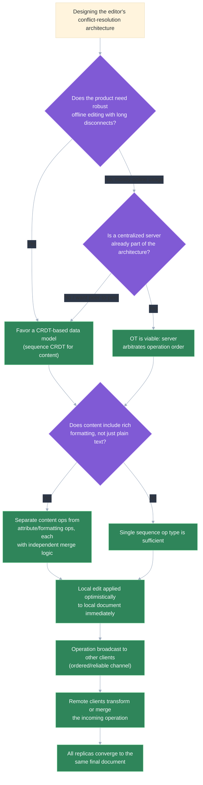

# Design a collaborative document editor (Google Docs-like)

## 🎯 Executive Summary

The central problem in a collaborative editor isn't rendering text — it's that multiple users edit the same document concurrently, over a network with real latency, so edits arrive at each participant out of order and out of sync with what they're currently looking at. The entire design exists to make those concurrent, out-of-order edits **converge** to an identical final document for every participant, without asking any user to manually resolve a conflict the way `git merge` might.

This is a favorite Staff/Lead frontend system design question precisely because it forces distributed-systems reasoning inside a frontend context: consistency models, conflict resolution, and offline reconciliation, all while still needing sub-100ms perceived latency on every keystroke. A candidate who says "it uses some conflict resolution algorithm" and moves on has skipped the one part of the problem the interviewer actually wants to probe — the difference between Operational Transformation and CRDTs, and the concrete trade-offs each one commits you to for offline support, server architecture, and implementation risk.

## 🧠 Core Technical Deep Dive

### Framing the problem precisely

Two users, Alice and Bob, both open the same document with the cursor at the same position. Alice types "X" at position 5; simultaneously, Bob deletes the character at position 3. Each client applies its own edit locally and instantly, then sends it to the others — but by the time Bob's delete arrives at Alice's client, her document has already shifted, so applying his delete "at position 3" against her *current* text would delete the wrong character.

The naive fix — just replaying operations in the order they're received — doesn't work, because "position 3" means something different depending on which edits have already landed at that client. The system needs a way to make an operation's *intent* survive being applied against a document state the sender never saw. That's the actual problem OT and CRDTs each solve, by different means.

> **Key takeaway:** the hard problem isn't transmitting edits, it's making an operation authored against one document state apply correctly — and convergently — against a different, already-mutated state at every other client.

### Operational Transformation vs CRDTs: the two dominant approaches

**Operational Transformation (OT)** keeps operations as the unit of truth (`insert("X", 5)`, `delete(3, 1)`) and defines *transform functions* that rewrite an incoming operation against any concurrent operation it conflicts with, so the rewritten operation preserves the original author's intent when applied to a state that has diverged. This transformation typically has to happen relative to a single, agreed-upon order of operations, which is why OT architectures conventionally route every edit through a central server that assigns that order and performs (or verifies) the transforms.

**CRDTs (Conflict-free Replicated Data Types)** take a different approach: instead of transforming operations after the fact, they design the data structure itself so that operations are commutative and merge deterministically regardless of the order they're applied in. A sequence CRDT gives every character (or block) a globally unique, order-preserving identifier, so "insert after the character with id `Y`" is unambiguous no matter what else has happened concurrently — no central arbiter is required to make two replicas converge.

| Dimension | Operational Transformation | CRDTs |
|---|---|---|
| **Core mechanism** | Transform incoming ops against concurrent local ops to preserve intent | Design the data structure so ops commute and merge deterministically |
| **Server dependency** | Conventionally requires a central server to establish operation order | Can merge peer-to-peer with no central authority, though most products still relay through a server for delivery/persistence |
| **Offline support** | Hard — transform correctness typically assumes access to the operation history in a known order | Natural fit — operations carry enough self-describing metadata to merge whenever and in whatever order they arrive |
| **Implementation complexity** | Transform functions are notoriously difficult to prove correct, especially for rich-text operations (formatting, nested structure) | Upfront data-structure design is complex, but merge logic is simpler and more mechanically verifiable once correct |
| **Metadata overhead** | Low — operations are compact | Higher — tombstones and per-character identifiers grow the document's in-memory/storage footprint over its lifetime |
| **Real products** | Google Docs (historically OT-based), Etherpad | Figma, Yjs- and Automerge-based editors (Linear, many newer collaborative apps) |

Neither approach eliminates the underlying hard problem; they relocate it. OT concentrates the hard part into getting the transform functions provably correct for every pair of concurrent operation types, including rich-text formatting ops. CRDTs concentrate the hard part into designing a data structure that makes correctness a structural property, at the cost of extra metadata that has to be managed (garbage-collected tombstones, compacted identifiers) so documents don't grow unbounded.

> **Key takeaway:** OT optimizes for compact operations at the cost of centralized ordering and famously hard-to-verify transform logic; CRDTs optimize for decentralized, order-independent merging at the cost of data-structure complexity and metadata growth — know which failure mode you're trading for which.

### Presence and cursor broadcasting: a separate, lower-stakes channel

Showing other users' live cursors and selections is a distinct real-time problem from replicating document content, and conflating the two channels is a common design mistake. Document operations must be reliable, ordered, and eventually persisted — losing one silently corrupts the document. Presence data (cursor position, selection range, an avatar's "currently typing" state) can be lossy and best-effort, because the worst case of a dropped presence update is a cursor briefly rendering in a stale position, not data loss.

This distinction has real architectural consequences. Presence can be broadcast over a channel optimized for low latency and low overhead — often UDP-like or a WebSocket message type that's explicitly unacknowledged and unretried — and can be safely throttled or coalesced under load (broadcasting cursor position every 200ms instead of on every mousemove event). Document operations need the opposite: guaranteed delivery, ordering guarantees appropriate to whichever conflict-resolution model is in use, and persistence to a durable log.

> **Key takeaway:** treating presence updates with the same delivery guarantees as document operations wastes bandwidth and server complexity on data that's allowed to be stale; treating document operations with presence-level guarantees risks silent data loss.

### Local-first architecture and offline support

A responsive editor applies every local edit to the document immediately and renders it before any network round-trip completes — the user's own keystroke should never visibly wait on a server acknowledgment. This "optimistic local apply" is table stakes for perceived performance, but it also has a direct implication for offline support: if edits are already being applied locally-first while online, extending that to "apply locally while fully offline, and queue the operation for later transmission" is a comparatively small step rather than a new architecture.

Reconciling that queue on reconnect is where OT and CRDTs diverge sharply. A CRDT-based editor can simply replay the queued local operations against whatever the merged document has become — the data structure's convergence guarantee handles it by construction, whether the user was offline for ten seconds or ten minutes. An OT-based editor has to transform every queued local operation against the entire sequence of remote operations that landed while offline, which becomes expensive and error-prone as the offline duration and the number of concurrent editors both grow.

> **Key takeaway:** optimistic local-first apply is required for both approaches, but offline reconciliation is where CRDTs earn their metadata overhead back — replaying a queue against a CRDT is structurally simpler and safer than transforming it through an OT operation history.

### Undo/redo in a multi-user document

Naive undo — pop the last operation off a local history stack and apply its inverse — is correct in a single-user editor and silently wrong the moment another user's edit has landed in between. If Alice types "hello", Bob inserts a character in the middle of it, and Alice then hits undo expecting to remove her own "hello", a naive inverse-of-last-operation approach may instead corrupt or partially revert Bob's edit, since the document position her original operation targeted no longer means what it meant when she typed it.

Correct collaborative undo needs to track intent per-author, not per-document-position: each user's undo stack holds *their own* operations, and undoing one requires computing its inverse and running that inverse through the same transform/merge machinery used for regular operations, so it correctly threads through whatever changes happened after the original edit. This is effectively "apply a new operation that is the inverse of an old one," not "roll back to a previous state," which is why undo in this context is really a special case of the same conflict-resolution problem rather than a separate mechanism.

> **Key takeaway:** collaborative undo has to be selective (only the acting user's own operations) and has to pass through the same OT/CRDT machinery as any other operation — treating it as a simple state-history rollback breaks the instant another user's edit interleaves.

### Document data model: structured, mergeable rich text

A plain string with naive diffing cannot represent rich text correctly, because formatting and structure are themselves data that can be concurrently edited independently of the characters they apply to. If one user bolds a paragraph while another concurrently deletes a sentence inside that same paragraph, a flat-string model has no principled way to reconcile "this range should be bold" against "this range no longer exists."

The fix is representing the document as a structured, mergeable model rather than a string: a tree (paragraphs, containing formatted runs, containing characters) where structural operations (insert, delete, move a node) and attribute operations (apply bold to a range) are distinct operation types that each have their own merge semantics. A sequence CRDT is a common choice for the character-level content, with a parallel mechanism — often a set of attribute operations scoped to stable position identifiers rather than raw indices — for formatting, so a concurrent bold and a concurrent delete can both be applied without one corrupting the other.

> **Key takeaway:** rich text is structured data with independent content and formatting dimensions, not a string — the data model has to let structural edits and attribute edits merge independently, or concurrent formatting and content changes will conflict in ways string-diffing can't resolve.

## 📊 Visual Architecture & Logic

### Diagram 1 — Choosing and applying a conflict-resolution strategy



### Diagram 2 — Edit lifecycle across an offline/reconnect cycle

```mermaid
%%{init: {"theme": "base", "themeVariables": {"lineColor": "#a0aec0", "edgeLabelBackground": "#2d3748", "textColor": "#f7fafc"}}}%%
sequenceDiagram
    participant Alice as "Alice's client"
    participant Server as "Sync server"
    participant Bob as "Bob's client"

    Alice->>Alice: "Applies edit locally and optimistically (renders instantly)"
    Alice--xServer: "Network drops before operation is sent"
    Alice->>Alice: "Continues editing offline; operations queued locally"
    Bob->>Server: "Sends concurrent edits while Alice is offline"
    Server->>Bob: "Broadcasts merged state to Bob (Alice not reachable)"
    Note over Alice: "10 minutes offline, several queued local operations"
    Alice->>Server: "Reconnects; flushes queued operations"
    Server->>Server: "Merges/transforms queued ops against everything that happened while offline"
    Server-->>Alice: "Sends back reconciled document state"
    Server-->>Bob: "Broadcasts Alice's now-merged operations"
    Alice->>Alice: "Local document converges to match server state"
    Bob->>Bob: "Local document converges to match server state"
    Note over Alice,Bob: "Both clients now hold an identical, converged document"
```

## 🏢 Interview Context & FAANG Signals

This question is a staple of Staff/Lead frontend system design rounds specifically because it tests depth on distributed-systems-adjacent concepts — consistency, convergence, conflict resolution — expressed through a frontend surface most interviewers know well. It's a strong filter question: many candidates can describe the UI (a toolbar, a document canvas, some cursors) but very few can precisely explain *why* the sync layer is hard or name the actual mechanisms that solve it.

**Lead signals interviewers listen for:**

- Naming OT and CRDTs explicitly and explaining the core mechanism of each precisely, rather than saying "conflict resolution" as if it were one undifferentiated technique.
- Articulating the concrete trade-off (server dependency, offline support, implementation risk) rather than declaring one approach universally superior.
- Treating presence/cursor broadcasting as an architecturally distinct, lower-guarantee channel from document operations, unprompted.
- Recognizing that optimistic local apply is required for perceived performance, and connecting it directly to how offline queuing and reconnection reconciliation work.
- Identifying that collaborative undo and rich-text formatting are not incidental UI details but direct consequences of the chosen data model — a flat-string mental model breaks both.

## ⚔️ Lead Level vs Senior Level

**Scenario: "Design a real-time collaborative document editor like Google Docs."**

A **Senior** response is technically reasonable: use WebSockets for real-time sync, apply edits optimistically on the client, broadcast changes through a server, and mention "some conflict resolution" to handle simultaneous edits, plus cursors rendered from a presence payload.

A **Lead/Staff** response covers similar ground but is evaluated on additional dimensions:

- **Names OT vs CRDTs explicitly and picks one with a stated reason**: e.g., choosing a CRDT because the product requirement includes robust offline support, and explaining why that specifically favors CRDTs over OT rather than treating the choice as arbitrary.
- **Separates the presence channel from the document-operation channel architecturally**, with different delivery guarantees for each, rather than one undifferentiated "real-time sync" system.
- **Designs the data model as structured/mergeable rich text** (content operations and formatting operations as distinct, independently-mergeable types), not a flat string.
- **Addresses collaborative undo as a first-class design concern**, explaining why naive last-operation-revert breaks and what per-author, transform-aware undo requires.
- **Reasons about offline reconciliation cost concretely**: describes what happens when a client queues operations for ten minutes and reconnects, and why that cost differs meaningfully between OT and CRDT architectures.

The differentiator: a Senior answer produces a workable real-time editor for the common case; a Lead answer produces one with an explicit, correct theory for *why* it converges under concurrency, offline use, and rich formatting — the exact conditions that break a shallow implementation.

## ⚠️ Common Pitfalls & Anti-Patterns

> ### ✕ Waiting for server acknowledgment before rendering a local edit
> **Why it's wrong:** If the local client waits for a round-trip before showing the user their own keystroke, every character typed incurs visible network latency, making the editor feel broken regardless of how correct the underlying conflict resolution is.
> **✓ Correct Lead Approach:** Apply every local edit optimistically and render it immediately; reconcile with the server/other clients asynchronously in the background, and only surface a correction in the rare case the optimistic apply needs to be adjusted.

> ### ✕ Giving cursor/presence updates the same delivery guarantees as document operations
> **Why it's wrong:** Routing presence data through the same ordered, reliable, persisted channel as document content wastes server capacity and complexity on data that's allowed to be stale or dropped, and couples the scaling characteristics of a cosmetic feature to the scaling of the actual document store.
> **✓ Correct Lead Approach:** Broadcast presence over a separate, best-effort, throttled channel, and reserve the ordered/reliable/persisted guarantees for actual document operations.

> ### ✕ Implementing undo as "revert the last local operation"
> **Why it's wrong:** The moment another user's edit lands between the original operation and the undo, a naive inverse-of-last-operation approach targets document positions that no longer mean what they meant when the edit was made, corrupting either the undo or the interleaved remote edit.
> **✓ Correct Lead Approach:** Track each user's own operations separately, compute the inverse of the specific operation being undone, and run that inverse through the same transform/merge pipeline as any other operation so it correctly threads through everything that happened since.

> ### ✕ Modeling rich text as a flat string and diffing it
> **Why it's wrong:** A flat string has no way to represent formatting as data independent from content, so a concurrent "bold this paragraph" and "delete this sentence inside the paragraph" have no principled way to merge — one operation ends up silently corrupting or dropping the other.
> **✓ Correct Lead Approach:** Model the document as structured, mergeable data (a tree or sequence CRDT for content, with formatting expressed as separate attribute operations scoped to stable position identifiers) so content and formatting can be edited concurrently without conflicting.

> ### ✕ Treating CRDTs as a complexity-free upgrade over OT
> **Why it's wrong:** CRDTs remove the need for a central transform arbiter, but they introduce their own cost — per-character or per-block identifiers and tombstones accumulate over a document's lifetime, and an editor that never garbage-collects or compacts them will see steadily growing memory and payload size.
> **✓ Correct Lead Approach:** Choose CRDTs deliberately for the offline/decentralization benefits they actually provide, and design explicitly for tombstone garbage collection or identifier compaction rather than assuming the data structure's convergence guarantee makes its overhead disappear on its own.

## 🛠️ Practice Scenarios (5-10 Scenarios)

<details>
<summary><strong>Scenario 1: Choosing OT vs CRDT for a brand-new collaborative editor</strong></summary>

**Problem statement:** You're starting a new collaborative document editor from scratch. The product requirements include strong offline support (users on flights or in low-connectivity environments should be able to keep editing) and eventual support for a peer-to-peer "share via local network" mode. Choose OT or CRDT and justify it.

**Staff-Level Solution:**
This is close to the textbook case for CRDTs: the two stated requirements (robust offline support and eventual peer-to-peer sync) are exactly where OT's server-arbitrated ordering becomes a liability rather than an asset. A CRDT-based sequence data structure lets any client merge any set of operations in any order without needing a central authority to have first established a canonical sequence, which is precisely what peer-to-peer sync needs.

I'd accept the trade-offs going in: metadata overhead (tombstones, per-character identifiers) will grow the document's storage footprint over its lifetime, so I'd design garbage collection or periodic compaction into the persistence layer from day one rather than retrofitting it later. I'd still run a relay server for delivery and durability even in the CRDT design — CRDTs remove the need for a server to *arbitrate correctness*, not the need for a server to *reliably deliver and persist* operations to clients that aren't directly reachable peer-to-peer.
</details>

<details>
<summary><strong>Scenario 2: Designing cursor and selection presence broadcasting</strong></summary>

**Problem statement:** Design the system that shows each collaborator's live cursor position and text selection to every other participant in the document, with each user's name/color label following their cursor.

**Staff-Level Solution:**
I'd treat this as an explicitly separate, lower-guarantee real-time channel from document operations. Each client publishes its own cursor position and selection range on a lightweight WebSocket message type, throttled to roughly 5-10 updates per second even if the underlying mouse/selection events fire far more often, since sub-100ms cursor precision has no perceptible value to other users.

Presence messages carry no ordering or delivery guarantee — if one is dropped, the next one a few hundred milliseconds later corrects it, so I wouldn't spend engineering effort retrying or acknowledging them. Cursor *positions* still need to be expressed relative to the document's stable position identifiers (not raw character indices) so a cursor rendered by a remote client stays visually correct as the document mutates underneath it; that's the one place presence and the document data model have to share a concept, even though their transport guarantees differ completely.
</details>

<details>
<summary><strong>Scenario 3: An offline user reconnects after 10 minutes of local edits</strong></summary>

**Problem statement:** A user loses network connectivity, keeps editing locally for 10 minutes (dozens of operations), while three other collaborators continue editing the same document online. Design what happens when the offline user's client regains connectivity.

**Staff-Level Solution:**
While offline, the client keeps applying edits optimistically to its local document and appends each operation to a durable local queue (e.g., IndexedDB, not just in-memory) so a browser crash or tab close during the offline window doesn't lose the user's work. On reconnect, the client doesn't try to resolve anything itself — it flushes the queue to the server, which is the only party with full visibility into everything that happened from the other three collaborators during that window.

If the system is CRDT-based, the server (or the reconnecting client, depending on architecture) merges the queued operations against the current document state using the CRDT's built-in convergence guarantee — correctness doesn't degrade with the length of the offline window, only the size of the merge grows. If it's OT-based, this is meaningfully riskier: the server has to transform each queued operation against the full sequence of operations that landed during the ten-minute gap, and I'd flag this specific scenario as the strongest practical argument for CRDTs in any product where extended offline use is expected.
</details>

<details>
<summary><strong>Scenario 4: Designing collaborative undo/redo</strong></summary>

**Problem statement:** Design undo/redo for the editor such that pressing Ctrl+Z always undoes the current user's own last action, correctly, even when other users have made edits in the interim.

**Staff-Level Solution:**
Each client maintains its own local undo stack containing only operations authored by that user, tagged with enough context (the operation's target position identifiers, not raw indices) to remain meaningful after the document has since mutated. Undo doesn't roll back to a prior document snapshot; it computes the semantic inverse of the specific operation being undone (an insert's inverse is a delete of the same content, a delete's inverse is a re-insert) and submits that inverse as a brand-new operation through the exact same transform/merge pipeline every other edit goes through.

This guarantees the undo interacts correctly with whatever else has happened since — if another user's edit landed inside the range being undone, the transform/merge logic that already handles concurrent edits handles this case too, since it's not actually a special case. Redo is symmetric: it re-applies the original operation (or the inverse-of-the-inverse) the same way, and I'd cap or expire the undo stack per session rather than keeping it unbounded, since indefinitely undoing a very old operation against a heavily-mutated document has diminishing practical value and growing edge-case risk.
</details>

<details>
<summary><strong>Scenario 5: Two users format overlapping text ranges concurrently</strong></summary>

**Problem statement:** Alice selects a paragraph and applies bold. At nearly the same moment, Bob selects a slightly overlapping range within that paragraph and applies italic. Design how this resolves.

**Staff-Level Solution:**
Because the data model treats formatting as attribute operations scoped to stable position ranges — independent from the content operations that would insert or delete characters — this case is actually one of the easier ones to resolve: bold and italic are non-conflicting attributes, so both operations apply and the overlapping range ends up bold-and-italic, exactly matching each user's individual intent. The key design decision that makes this work is not special-casing formatting conflicts at merge time, but ensuring the data model represents each formatting attribute (bold, italic, underline, color) as an independent dimension that can be toggled without contending with other attributes.

The genuinely conflicting case is two *contradictory* attribute operations on the same dimension — e.g., Alice sets a range to bold and Bob simultaneously sets the same exact range to not-bold. I'd resolve that with a deterministic tie-breaker consistent with how the underlying CRDT/OT system already resolves ordering ambiguity (commonly last-writer-wins keyed by a logical timestamp plus a stable per-client id for tie-breaking), applied consistently so every replica converges on the same final value rather than each client guessing independently.
</details>

<details>
<summary><strong>Scenario 6: Scaling a single document to hundreds of concurrent viewers/editors</strong></summary>

**Problem statement:** A document that normally has 2-3 concurrent editors suddenly has 300 people viewing it live (e.g., an all-hands meeting notes doc), with a handful actively editing. Design for this load without redesigning the core sync model.

**Staff-Level Solution:**
The first move is separating "receives live updates" from "can author operations" as distinct concerns, since 300 viewers broadcasting presence and receiving document updates is a very different load profile than 300 people all submitting conflicting operations. I'd fan out document-update broadcasts through a pub/sub layer (rather than the sync server directly holding 300 individual connections doing per-client transform work) so the cost of broadcasting an operation to N viewers is decoupled from the cost of merging that operation into the canonical document.

For presence specifically, I'd aggressively downsample at scale — showing individual cursors for all 300 participants is both visually useless and unnecessarily expensive, so past some threshold I'd collapse to a simpler signal (an avatar list of "N people viewing," full cursors only for the handful of active editors). I'd also reconsider write amplification: if the CRDT/OT merge step is O(document size) or worse per operation, 300 concurrent viewers alone don't stress that path, but I'd make sure viewer count and editor count scale on genuinely separate code paths so a viewership spike can't degrade editing latency for the people actually typing.
</details>

<details>
<summary><strong>Scenario 7: A network partition happens mid-edit</strong></summary>

**Problem statement:** A user is mid-keystroke when their connection to the sync server is silently partitioned (no clean disconnect event, just packets stop arriving). Design how the client detects this and what happens to in-flight and subsequent edits.

**Staff-Level Solution:**
Silent partitions are the harder case precisely because there's no clean "offline" event to key behavior off of — I'd use a heartbeat/ping mechanism (the client expects an ack or a server heartbeat within some interval, e.g., every few seconds) so a missed threshold transitions the client into an explicit "presumed offline" state rather than relying on the browser's online/offline events, which don't reliably fire for this class of failure. Once in that state, behavior is identical to the planned-offline case: edits keep applying optimistically and queue locally, since the user shouldn't be able to tell the difference between a clean disconnect and a silent partition from inside the editing experience.

The one extra risk specific to silent partitions is operations that were sent right as the partition began, where the client doesn't know if they were received. I'd make every operation idempotent via a client-generated unique id, so on reconnect the client can safely resend anything it's not certain was acknowledged, and the server can silently drop duplicates rather than double-applying an operation that actually made it through before the partition.
</details>

<details>
<summary><strong>Scenario 8: A stakeholder insists "just use Operational Transform, it's simpler"</strong></summary>

**Problem statement:** During a design review, a senior stakeholder pushes back on a proposed CRDT-based architecture, arguing OT is a more established, simpler technology and the team should just use it. The product has a stated requirement for strong offline editing support. Respond.

**Staff-Level Solution:**
"I'd separate two different claims here: OT is more established — that's true, Google Docs has run production OT for over a decade — but 'simpler' depends entirely on which part of the system you're looking at. OT's operations are simpler to author and smaller on the wire, but the transform functions that make concurrent operations converge correctly are notoriously hard to get right, especially once we add rich-text formatting on top of plain-text inserts and deletes — that complexity doesn't go away with OT, it just moves into gnarly transform logic that's genuinely difficult to test exhaustively.

The requirement that actually drives this decision is the offline support we've already committed to. OT's correctness model leans on a central server establishing a canonical operation order, which is precisely what's unavailable to a client that's been offline for an extended period — reconciling a long offline queue against OT means transforming it against the entire operation history from that window, and that cost and complexity scales with exactly the scenario we said we need to support well. CRDTs pay for that with more upfront data-structure design and some metadata overhead we'll need to manage with garbage collection, but that cost is bounded and well understood, whereas OT's offline reconciliation risk grows with usage patterns we don't fully control. Given the stated offline requirement, I'd stand behind CRDTs as the better fit here, not because OT is bad technology, but because it's optimized for a different set of constraints than the ones this product actually has."
</details>
