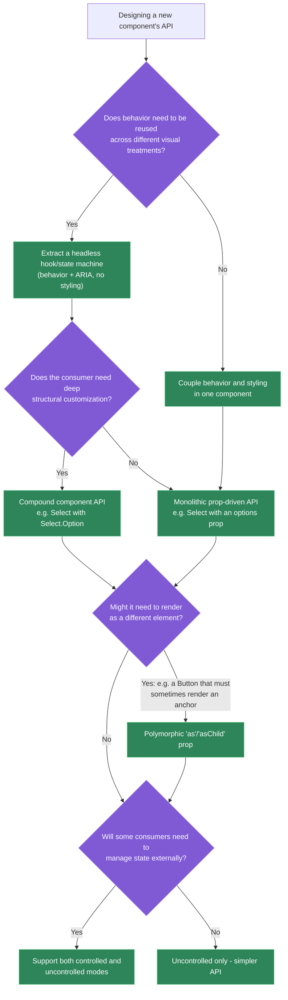
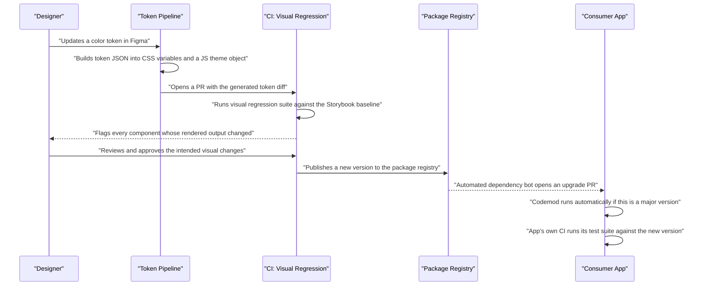

# Design a component library / design system from scratch

## 🎯 Executive Summary

A component library is not a UI-building exercise — it's a **platform and API design problem** wearing a visual costume. The hard parts aren't "how do I build a Button"; they're how a `Select` component's API stays composable without becoming unwieldy, how a breaking change reaches 200 consuming teams without a flag day, how theming supports both light/dark and per-brand variants without duplicating every component, and how accessibility gets baked into behavior instead of relying on every consumer getting ARIA right independently.

This is a must-know topic because it's one of the highest-leverage tests of Staff/Lead judgment available in an interview: it forces trade-offs across API design, styling architecture, governance, and distribution simultaneously, with no single correct answer — exactly the kind of ambiguity a Lead is expected to navigate on the job. A candidate who jumps straight to "I'll use styled-components and Storybook" without addressing versioning, accessibility architecture, or governance has scoped the problem as a tooling choice instead of a platform.

## 🧠 Core Technical Deep Dive

### Component API design: the actual hard problem

The central design decision for every component is whether behavior is coupled to styling or extracted as reusable, unstyled logic. Coupling them (a fully-styled `<Select>` with baked-in visuals) is simple to build and consume, but makes rebranding or deep customization require a fork or a rewrite. Extracting behavior into a "headless" hook or state machine — handling keyboard navigation, focus management, and ARIA wiring, with zero opinions on markup or CSS — lets any team build their own visual layer on top of correct, tested behavior.

| Pattern | Consumer experience | Cost |
|---|---|---|
| **Fully-styled, monolithic** (`<Select options={...} />`) | Fast to adopt, low decision surface | Rebranding or deep customization requires a fork; ARIA correctness is locked to one visual implementation |
| **Headless + styled wrapper** (a `useSelectState` hook, with a default styled component built on top) | Most teams use the default; teams needing customization build on the same tested behavior | More upfront engineering investment; two things to design instead of one |
| **Compound components** (`<Select><Select.Option/></Select>`) | Highly composable structural customization | Larger API surface; less discoverable than a single props object |

**Controlled vs. uncontrolled** is a second, orthogonal axis every stateful component needs an explicit answer for — native HTML elements support both (`<input value={x} onChange={...}>` vs `<input defaultValue={x}>`), and a component library should offer the same flexibility rather than forcing every consumer to lift state they don't need.

**Polymorphism** (an `as` or `asChild` prop) solves a narrower but recurring problem: a design system's `Button` needs to sometimes render as an `<a>` for navigation while keeping identical styling and behavior — without polymorphism, teams either duplicate the button styles on a raw anchor tag (breaking visual consistency) or wrap an anchor around a button (breaking semantics and accessibility).

> **Key takeaway:** the API design axis (headless vs. styled, compound vs. monolithic, controlled vs. uncontrolled, polymorphic vs. fixed element) matters more than any specific styling technology choice — get this wrong and no amount of good CSS architecture saves the library from becoming unmaintainable.

### Styling architecture: runtime cost, theming, and SSR all trade off together

| Approach | Runtime cost | Theming ergonomics | SSR risk |
|---|---|---|---|
| **CSS-in-JS** (styled-components, Emotion) | Real — style computation and injection happen in JS at render time unless using a zero-runtime variant | Excellent — theme values are just JS, fully dynamic | Flash of unstyled content unless styles are extracted server-side and inlined before hydration |
| **CSS Modules** | None — plain CSS, scoped via build-time class hashing | Manual — typically via CSS custom properties layered on top | None — it's just a stylesheet |
| **Utility-first** (Tailwind) | None at runtime; larger authored class lists | Good via config-driven design tokens, less dynamic at runtime | None |
| **CSS custom properties** (design tokens as `--color-primary`) | None — native browser cascading | Excellent — swap values at any DOM scope, no JS re-render needed | None — values are resolved by the browser, not React |

CSS custom properties have become the default recommendation for exactly this reason: theming becomes "set a different value at a higher DOM scope" rather than a JS-driven re-render, which means theme switches (including SSR-rendered dark mode) don't risk a hydration mismatch or a client-side flash while a theme context resolves.

**Design tokens are the actual single source of truth**, not any individual component's stylesheet. A token pipeline (commonly Style Dictionary or a custom equivalent) transforms a canonical token definition — often exported from Figma — into platform-specific outputs: CSS custom properties for web, a JS theme object for CSS-in-JS consumers, and equivalent formats for native mobile if the design system spans platforms.

> **Key takeaway:** styling technology is a secondary decision that should follow from the theming and SSR requirements, not the other way around — picking CSS-in-JS because it's popular, without accounting for its SSR extraction cost, is a common and expensive mistake.

### Accessibility as architecture, not a checklist

The reliable way to get accessibility right across a large component library is to make correct behavior the path of least resistance, not a manual requirement every consumer has to remember. A `Listbox`'s roving-tabindex keyboard navigation, a `Dialog`'s focus trap and return-focus-on-close behavior, and the correct ARIA attribute wiring for each state should live inside the component's own logic — this is precisely what libraries like Radix UI and React Aria exist to centralize, so every consumer gets it correctly by construction rather than by diligence.

This only holds if it's enforced automatically: an axe-core accessibility check wired into the same CI pipeline that runs unit tests catches regressions the moment they're introduced, rather than relying on periodic manual audits that inevitably lag behind the component count.

> **Key takeaway:** accessibility that depends on every consumer remembering to add the right ARIA attributes will regress continuously as the library grows — it has to be structural (baked into shared behavior) and enforced (automated in CI), not aspirational.

### Distribution, versioning, and rollout at scale

A design system's hardest engineering problem isn't building components — it's changing them safely once hundreds of teams depend on them. A breaking API change shipped as a single major version bump with no migration path predictably causes most consuming teams to simply never upgrade, which defeats the entire purpose of a shared system.

| Rollout mechanism | What it solves |
|---|---|
| **Semantic versioning + automated changelogs** (Changesets or similar) | Consumers can distinguish safe upgrades from ones requiring review, without reading source diffs |
| **Codemods for breaking changes** | Automates the mechanical part of a migration (renaming a prop, restructuring a compound component's markup) instead of asking every team to do it by hand |
| **Deprecation warnings with a sunset timeline** | Gives teams a visible, actionable signal well before a breaking change actually lands |
| **Parallel major-version support window** | Lets slower-moving teams stay on the previous major temporarily without blocking the library's own evolution |

Bundle size is a related but distinct concern: a single barrel file (`export * from './components'`) can defeat tree-shaking in some bundler configurations, meaning an app that imports one `Button` pays for the entire library's JS weight. Per-component subpath exports plus an accurate `sideEffects: false` in `package.json` are what actually let bundlers eliminate unused components.

> **Key takeaway:** the value of a design system is proportional to how many teams actually stay current with it — a rollout strategy that makes upgrading painful is a governance failure, not just an engineering inconvenience.

### Governance: who gets to change the system

A fully centralized model (one team owns every component) maximizes consistency but becomes a throughput bottleneck as the consumer base grows; a fully federated model (any team can contribute) maximizes velocity but risks quality and consistency drift without a strong review bar. Most mature systems land on a hybrid: a core team owns the API design bar and the release process, while product teams can propose and often implement new components through an RFC-style process reviewed against that bar.

Visual regression testing (Chromatic, Percy, or an equivalent pinned against a Storybook baseline) is the testing layer unique to this kind of product — unit tests verify behavior, but a design system's core value proposition is visual consistency, and a CSS variable rename or a spacing token change is exactly the class of bug unit tests structurally cannot catch.

> **Key takeaway:** governance model and testing strategy are as much a part of "designing the system" as any component's API — a technically excellent Button with no process for safely evolving it or catching its regressions doesn't scale past the first few consuming teams.

## 📊 Visual Architecture & Logic

### Diagram 1 — Component API design decision tree



### Diagram 2 — Token change to consumer upgrade: the release pipeline



## 🏢 Interview Context & FAANG Signals

This prompt appears constantly in Staff/Lead frontend system design rounds, often phrased as "design a component library" or "design our design system," and is also a common follow-up when a candidate mentions design system experience in a behavioral round. It tests platform-thinking specifically — the interviewer wants to see whether the candidate treats this as a UI problem or an API/distribution problem.

**Lead signals interviewers listen for:**

- Separating the API design conversation (headless vs. styled, compound vs. monolithic, controlled vs. uncontrolled) from the styling technology conversation, rather than conflating them.
- Naming a concrete versioning/rollout strategy for breaking changes unprompted — codemods, deprecation windows, parallel major-version support — not just "we'll use semver."
- Treating accessibility as baked-in behavior enforced by CI, not a manual review step.
- Bringing up visual regression testing specifically, and explaining why unit tests alone are insufficient for this class of product.
- Discussing governance (who can contribute, how the API design bar is maintained) as a real part of the system design, not an afterthought.

## ⚔️ Lead Level vs Senior Level

**Scenario: "Design a component library for our organization's ~50 product teams."**

A **Senior** response is technically reasonable: choose React with TypeScript, pick a styling approach (e.g., CSS Modules or styled-components), design a handful of core components (`Button`, `Input`, `Modal`), set up Storybook for documentation, and publish to an internal npm registry.

A **Lead/Staff** response covers similar ground but is evaluated on additional dimensions:

- **Explicit API philosophy stated upfront**: commits to headless-plus-styled-wrapper as the pattern for interactive components specifically because 50 teams will have varying customization needs, and justifies it against the alternative (fully monolithic) in terms of the fork risk that alternative creates at this scale.
- **A concrete rollout mechanism for breaking changes**: describes codemods and a deprecation window before any breaking change ships, recognizing that at 50 teams, "just read the changelog and update your code" does not scale as an upgrade strategy.
- **Named accessibility enforcement mechanism**: axe-core wired into CI as a merge gate, not "we'll follow WCAG guidelines."
- **Governance model with a stated trade-off**: proposes a hybrid model (core team owns the bar, product teams can propose components via RFC) and explicitly names why a fully centralized model would bottleneck at this scale, and why a fully federated model would fragment visual consistency.
- **Visual regression testing named as a first-class testing layer**, distinct from and complementary to unit/interaction tests, with a specific reason (CSS/token changes are invisible to behavioral tests).

The differentiator: a Senior answer produces a workable design system; a Lead answer produces one with an explicit theory for how it stays healthy and adoptable as the organization and the system itself keep changing.

## ⚠️ Common Pitfalls & Anti-Patterns

> ### ✕ Building fully-styled monolithic components with no headless layer
> **Why it's wrong:** Coupling behavior to one visual implementation means any team needing a different look either forks the component (duplicating and diverging its accessibility logic) or works around the design system entirely, undermining its purpose.
> **✓ Correct Lead Approach:** Extract behavior and ARIA wiring into a headless layer for any component complex enough to need it (menus, comboboxes, dialogs), with a styled default built on top for the common case.

> ### ✕ Shipping breaking changes as a version bump with no migration path
> **Why it's wrong:** Without a codemod, a deprecation window, or a support overlap between versions, consuming teams predictably stay on the old version indefinitely rather than absorb a manual migration — fragmenting the very consistency the system exists to provide.
> **✓ Correct Lead Approach:** Pair every breaking change with an automated codemod where feasible, a deprecation warning shipped ahead of the breaking release, and a defined window where both the old and new major versions are supported.

> ### ✕ Exporting everything through a single barrel file
> **Why it's wrong:** A barrel file (`export * from './components'`) can prevent bundlers from tree-shaking unused components in common configurations, meaning an app importing a single `Button` pays for the entire library's bundle weight.
> **✓ Correct Lead Approach:** Provide per-component subpath exports and an accurate `sideEffects: false` in `package.json`, and verify tree-shaking actually works with a bundle-size CI check rather than assuming it does.

> ### ✕ Treating accessibility as a manual QA checklist
> **Why it's wrong:** Accessibility correctness that depends on every contributor remembering the right ARIA pattern will regress steadily as the component count grows, and manual audits structurally lag behind the rate of change.
> **✓ Correct Lead Approach:** Bake correct keyboard/focus/ARIA behavior into shared headless logic, and enforce it with an automated accessibility check (axe-core) as a CI merge gate, not a periodic review.

> ### ✕ Skipping visual regression testing because "unit tests pass"
> **Why it's wrong:** Unit and interaction tests verify behavior, not appearance — a design token rename or a CSS specificity conflict can silently break the visual output of every consuming app while every test suite stays green.
> **✓ Correct Lead Approach:** Run visual regression testing (Chromatic, Percy, or equivalent) against a Storybook baseline as a required CI check for any change touching styles or tokens.

## 🛠️ Practice Scenarios (5-10 Scenarios)

<details>
<summary><strong>Scenario 1: Designing the Select/Dropdown component's API</strong></summary>

**Problem statement:** Design the public API for a `Select` component that needs to support single-select, multi-select, async-loaded options, and custom option rendering (e.g., an avatar next to a name) across many consuming teams.

**Staff-Level Solution:**
Given the requirement for custom option rendering, a monolithic `options={[...]}` prop-driven API becomes awkward fast — rendering arbitrary JSX per option through a prop function works but degrades in ergonomics as customization needs grow. A compound component API solves this more naturally:

```typescript
<Select value={selected} onChange={setSelected}>
  <Select.Trigger />
  <Select.Content>
    {options.map(o => (
      <Select.Option key={o.id} value={o.id}>
        <Avatar src={o.avatarUrl} /> {o.label}
      </Select.Option>
    ))}
  </Select.Content>
</Select>
```

Underneath, the keyboard navigation, focus management, and ARIA wiring (`role="listbox"`, roving `tabindex`, `aria-selected`) live in a headless `useSelectState`/`useListNavigation` hook shared by both single- and multi-select variants, so behavior correctness isn't duplicated per variant. I'd support both controlled (`value`/`onChange`) and uncontrolled (`defaultValue`) usage, matching native `<select>` ergonomics, and treat async-loaded options as an orthogonal concern (a loading/empty state passed into `Select.Content`) rather than baking async logic into the component itself.
</details>

<details>
<summary><strong>Scenario 2: Rolling out a breaking Button API change to 200 teams</strong></summary>

**Problem statement:** The `Button` component's `type` prop (controlling visual variant: primary/secondary/danger) needs to be renamed to `variant` to avoid colliding with the native HTML `type` attribute (button/submit/reset), which the component also needs to expose. 200 internal teams currently use the old prop. Plan the rollout.

**Staff-Level Solution:**
This is a mechanical, high-volume rename — exactly the case for an automated codemod rather than asking 200 teams to hand-edit call sites. Sequence:

1. Ship a minor version that supports both `type` (deprecated, still visually mapped correctly) and `variant`, with a console warning when the deprecated prop is used, including a link to the migration guide.
2. Publish a codemod (a jscodeshift transform) that mechanically renames `type="primary"` to `variant="primary"` across a codebase, and socialize it actively rather than relying on teams to discover it.
3. Set a concrete sunset date for the deprecated prop, communicated well in advance, with the deprecation warning's visibility increased (e.g., moved from console warning to a lint rule) as the date approaches.
4. Only remove support for the old prop in a major version release, after usage telemetry (if available) or a final audit shows adoption of the codemod is complete or near-complete.

I'd explicitly avoid a "single PR renames it everywhere across the monorepo" approach even if technically feasible, since it removes teams' ability to review and time the change against their own release schedules.
</details>

<details>
<summary><strong>Scenario 3: A single Button import pulls in 400kb</strong></summary>

**Problem statement:** A consuming app reports that importing just the `Button` component from the design system adds 400kb to their bundle. Diagnose and fix.

**Staff-Level Solution:**
The near-certain cause is a barrel file: `import { Button } from '@org/design-system'` resolving through an `index.ts` that re-exports every component, and the bundler being unable to prove the other exports are side-effect-free, so it includes the entire library. Verify by inspecting the bundle analyzer output for unrelated component code.

Fix at the package level, not the consumer's import statement: add per-component subpath exports (`@org/design-system/button`) alongside the barrel for convenience, and set `"sideEffects": false` in `package.json` (or list the specific files with real side effects, like global CSS imports, explicitly) so bundlers can safely tree-shake the barrel import too. I'd add a bundle-size CI check on the library itself — asserting that importing a single component stays under a defined budget — so this regresses loudly instead of silently the next time someone adds an unintentional cross-component import.
</details>

<details>
<summary><strong>Scenario 4: Supporting both light/dark theming and per-brand theming simultaneously</strong></summary>

**Problem statement:** The design system needs to support light/dark mode across the whole organization, and additionally a payments sub-brand needs a distinct color palette while reusing every component unchanged. Design the theming architecture.

**Staff-Level Solution:**
Model this as two independent, orthogonal token layers rather than a combinatorial explosion of theme variants. A base semantic token layer (`--color-surface`, `--color-text-primary`, `--color-accent`) is what components actually consume in their styles — components never reference brand- or mode-specific values directly.

```css
/* Mode: resolved by a data-attribute on a high-level wrapper */
[data-theme="light"] { --color-surface: #ffffff; --color-text-primary: #1a1a1a; }
[data-theme="dark"]  { --color-surface: #1a1a1a; --color-text-primary: #f5f5f5; }

/* Brand: resolved independently, can compose with either mode */
[data-brand="payments"] { --color-accent: #0057ff; }
```

Because both `data-theme` and `data-brand` resolve via native CSS cascading, they compose freely — the payments sub-brand in dark mode is just both attributes present simultaneously, with zero additional component code or JS logic. This avoids the alternative (a theme prop threaded through every component, or a combinatorial set of theme objects) entirely, and it's SSR-safe since the browser resolves the cascade without any hydration-dependent JS.
</details>

<details>
<summary><strong>Scenario 5: A product team wants to contribute a new component upstream</strong></summary>

**Problem statement:** A product team has built a `DatePicker` for their own feature and believes it's generally useful. They want it added to the shared design system. What's the process?

**Staff-Level Solution:**
Treat this as the federated half of a hybrid governance model: encourage the contribution, but route it through the same API design bar every core-team-built component goes through, rather than merging it as-is. Concretely: an RFC describing the proposed API (controlled/uncontrolled support, accessibility behavior, theming integration) reviewed by the core team and other stakeholders before implementation is finalized, since API mistakes are far more expensive to fix after publication than before.

I'd also require the same testing bar as any other component — unit/interaction tests, an axe-core pass, and Storybook stories that visual regression testing can baseline against — as a condition of merging into the shared package, explicitly not a lower bar just because the component originated outside the core team. If the existing implementation was built quickly for one product's specific needs, expect a genuine rewrite of parts of it (especially state management and accessibility wiring) rather than treating the contribution as a copy-paste operation.
</details>

<details>
<summary><strong>Scenario 6: Preventing a visual regression before it reaches production</strong></summary>

**Problem statement:** A design token change (adjusting the default border-radius token) was merged and later found to have subtly broken the appearance of a dozen components in ways nobody caught in code review. Design a system to prevent this going forward.

**Staff-Level Solution:**
Code review is the wrong layer to catch this — a border-radius token change is a one-line diff that looks obviously safe to a human reviewer without rendering every consuming component. The fix is a required, automated visual regression gate: every PR touching tokens or shared styles triggers a Storybook build, and a visual regression tool (Chromatic/Percy) renders every component's stories and diffs them pixel-by-pixel against the last approved baseline.

```yaml
# Simplified CI gate concept
on: pull_request
jobs:
  visual-regression:
    steps:
      - run: build-storybook
      - run: chromatic --exit-once-uploaded
      # Blocks merge until a human explicitly approves any visual diff
```

Critically, this doesn't need to be "no visual changes allowed" — it needs to make every visual change **visible and require explicit approval**, so an unintended twelve-component regression gets caught and reviewed before merge instead of discovered in production. I'd also flag this incident as a reason to audit whether the token pipeline itself needs a lower-friction preview mechanism (e.g., a deployed Storybook preview link on every PR) so reviewers aren't approving diffs blind.
</details>

<details>
<summary><strong>Scenario 7: CSS-in-JS causing a flash of unstyled content on SSR</strong></summary>

**Problem statement:** A marketing page built with server-rendered React and a CSS-in-JS component library shows a visible flash of unstyled content before styles apply, hurting perceived performance and Core Web Vitals. Diagnose and fix.

**Staff-Level Solution:**
CSS-in-JS libraries generate styles at render time; on the server, that means styles are computed during SSR but require an explicit extraction step to be collected and inlined into the HTML response's `<head>` before it's sent — if that extraction step is missing or misconfigured, the client receives HTML with no styles until the CSS-in-JS runtime rehydrates and injects them client-side, producing the flash.

The immediate fix is wiring up the library's SSR style extraction API correctly (e.g., styled-components' `ServerStyleSheet`, collecting the generated `<style>` tags and injecting them into the initial HTML response). The deeper architectural fix, and what I'd actually recommend for a design system specifically: migrate toward CSS custom properties or a zero-runtime CSS-in-JS variant (compiling styles at build time rather than render time) for exactly this class of product, since a design system's styles are known ahead of time and don't need runtime dynamism — the SSR flash risk is a symptom of using a runtime tool for a build-time problem.
</details>

<details>
<summary><strong>Scenario 8: Justifying dedicated headcount for the design system team to a VP</strong></summary>

**Problem statement:** A VP suggests the design system should be "a side project" maintained by whichever team has spare capacity, rather than a dedicated team. Make the case for dedicated headcount.

**Staff-Level Solution:**
"A design system's value comes from consistency and reliability across every team that depends on it — both of those degrade specifically when ownership is diffuse. If maintenance is 'whoever has spare capacity this sprint,' breaking changes ship without migration paths, accessibility regressions go unnoticed because there's no consistent CI ownership, and the API design bar drifts because no one is accountable for saying no to a well-intentioned but inconsistent contribution.

The cost of that isn't abstract — every team building on an inconsistent or unreliable system spends real engineering time working around it, which is strictly more expensive in aggregate than the cost of a small dedicated team maintaining a consistent one. I'd propose measuring this directly: track adoption rate, time-to-upgrade after a release, and the number of accessibility or visual regressions reaching production, and revisit this conversation with those numbers in three months — if a side-project model is actually sufficient, the data will show it, and if it isn't, we'll have a concrete case instead of an opinion."
</details>
