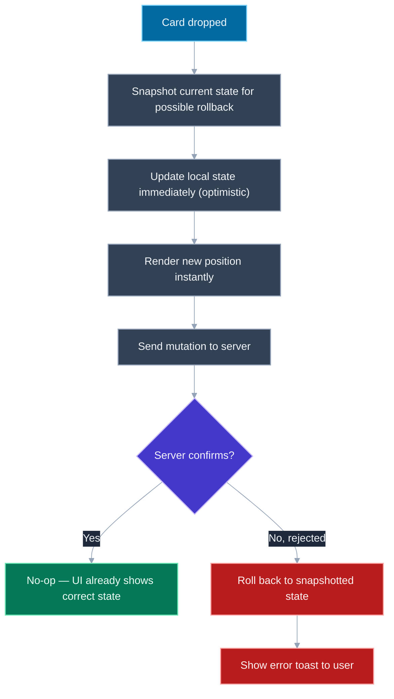
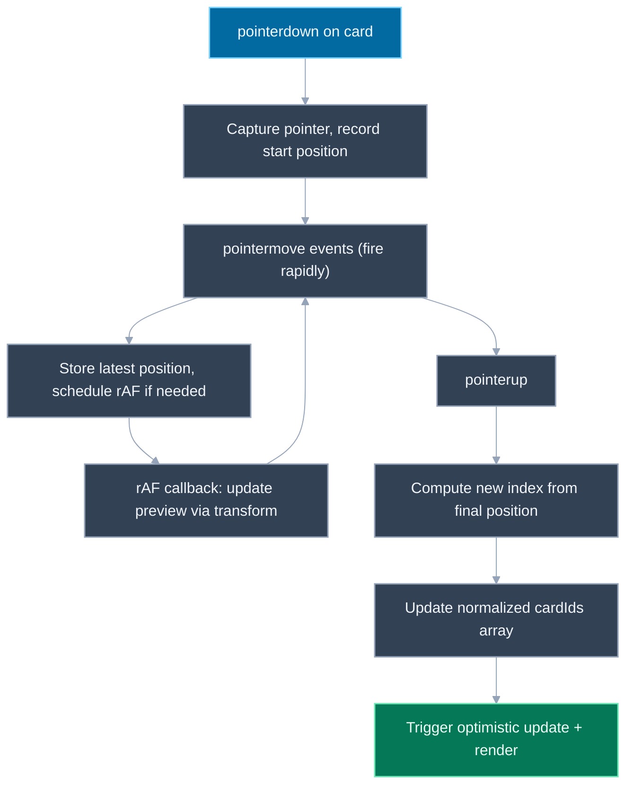

# Design a Drag-and-Drop Kanban Board

## 🎯 Executive Summary

A Kanban board — cards inside columns, draggable between and within columns — reads like a UI exercise, but it's actually a compact test of three separate skills a Lead/Staff frontend engineer is expected to have: state modeling (how do you represent an order that changes constantly, cheaply), interaction engineering (how do you make a drag feel physically responsive at 60fps while the underlying data structure updates underneath it), and correctness under concurrency (what happens when the thing being dragged is also being mutated by a second, real-time user). Very few interview prompts pack all three into a single, visually simple surface.

The reason this is a MUST-KNOW at Lead level specifically is that a shallow implementation — array splicing on every `dragover` event, full-board re-render on every pointer move — technically "works" in a demo and then visibly falls apart under two realistic pressures: a column with a few hundred cards, and a second user reordering the same column at the same time. Interviewers use this prompt to see whether a candidate reaches for the optimized data structure and the render-isolation techniques *before* being told the naive version is slow, not after.

It surfaces as "design a Trello/Jira/Linear board," sometimes narrowed to just "design the drag-and-drop interaction for reordering a list," and often gets extended live into "now two people are editing this board at once — what changes?" as the interviewer's way of probing whether the candidate's mental model was ever more than "some drag-and-drop library handles it."

## 📖 What Is It? (Plain-English Definition)

**In plain terms:** a drag-and-drop Kanban board is a set of vertical lists (columns like "To Do," "In Progress," "Done") each holding a stack of cards, where a user can pick up a card with the mouse or a finger, carry it over another position — same column or a different one — and drop it there, and the board remembers that new arrangement.

The everyday analogy is a corkboard with sticky notes arranged in columns: you physically peel a note off, hold it while you decide where it goes, and stick it back down in a new spot — the board doesn't care *why* you moved it, it just needs to end up showing the note in its new position, in the right column, in the right order relative to its neighbors. The software version has to solve the same problem with none of the physical world's built-in guarantees: no note actually leaves your hand while "being dragged," so the software has to fake that experience with pixels that follow the cursor, while a completely separate, invisible data structure is being recalculated underneath to know where the note will "land."

The part that's easy to underestimate the first time you build one: the visual drag (a card that smoothly tracks the cursor) and the structural reorder (an array of card IDs being spliced into a new position) are two almost entirely separate concerns that happen to be triggered by the same gesture. Treating them as one problem is exactly where naive implementations start janking and dropping frames.

Here's how a production-grade board actually separates those concerns, and handles the reordering, performance, accessibility, and multi-user problems that fall out of it.

---

## 🧠 Core Technical Deep Dive

### Requirements framing

Functionally: cards live inside columns; a user can drag a card to reorder it within its current column, or move it into a different column at any position; the result persists (survives a refresh); optionally, changes make by one user should be visible to other users looking at the same board in near-real-time.

Non-functionally, two things dominate: the drag itself has to feel physically immediate — no visible lag between the pointer moving and the dragged card's preview following it — and reordering has to stay cheap regardless of column size, so a column with 500 cards doesn't make every drag operation janky. A third, frequently under-scoped requirement worth naming out loud to the interviewer: does this need to support touch devices, and does it need to be usable without a pointer at all (keyboard-only, screen-reader users)? Both are easy to silently drop if you design only around mouse `dragstart`/`drop` events.

> **Key takeaway:** the functional spec (cards move between and within columns, the result persists) is simple; the real design problem is keeping the drag interaction smooth regardless of board size and making the same interaction reachable without a pointer.

### Native HTML5 Drag and Drop API vs. pointer-event-based libraries

The browser ships a built-in API for this: mark an element `draggable="true"`, and the browser fires a sequence of events — `dragstart`, `dragover` (which must call `preventDefault()` on the drop target or the drop is rejected), `drop`, `dragend` — with a `DataTransfer` object carrying whatever payload you attach at `dragstart`.

```javascript
// Native HTML5 Drag and Drop — the built-in browser API
cardEl.draggable = true;

cardEl.addEventListener('dragstart', (e) => {
  e.dataTransfer.setData('text/plain', cardId);
  e.dataTransfer.effectAllowed = 'move';
});

columnEl.addEventListener('dragover', (e) => {
  e.preventDefault(); // required, or drop never fires
});

columnEl.addEventListener('drop', (e) => {
  const draggedCardId = e.dataTransfer.getData('text/plain');
  moveCard(draggedCardId, columnEl.dataset.columnId, computeDropIndex(e));
});
```

This looks appealingly simple, and for a one-off "drag this one thing" widget it can be enough. But it has three problems that make it a poor foundation for a real Kanban board:

1. **No native touch support at all.** The HTML5 DnD spec is mouse-only; there is no `touchstart`-equivalent wiring built in, so a mobile user gets nothing without a separate touch implementation layered on top — at which point you're maintaining two interaction systems for one feature.
2. **Inconsistent behavior across browsers**, historically around drag images, `effectAllowed`/`dropEffect` combinations, and Firefox-specific quirks with `dataTransfer` — enough that "works in Chrome" has never reliably meant "works everywhere" for this API.
3. **Very little control over the drag visual and any accessible alternative.** The browser owns the ghost drag image and the exact event timing, which makes it hard to build smooth custom animations, drop-zone previews, or a parallel keyboard-operable interaction that stays in sync with the same underlying state.

The modern alternative, used by libraries like **dnd-kit** (and conceptually by `react-beautiful-dnd`/`@hello-pangea/dnd` before it), abandons the native DnD events entirely and builds the interaction from raw pointer events instead:

```javascript
// Pointer-event-based approach — what dnd-kit does conceptually
let dragState = null;

cardEl.addEventListener('pointerdown', (e) => {
  cardEl.setPointerCapture(e.pointerId);
  dragState = { cardId, startX: e.clientX, startY: e.clientY };
});

cardEl.addEventListener('pointermove', (e) => {
  if (!dragState) return;
  const dx = e.clientX - dragState.startX;
  const dy = e.clientY - dragState.startY;
  // Move the drag preview with a transform — see performance section below.
  dragPreviewEl.style.transform = `translate(${dx}px, ${dy}px)`;
});

cardEl.addEventListener('pointerup', () => {
  const dropIndex = computeDropIndexFromPosition(dragState);
  moveCard(dragState.cardId, dropIndex);
  dragState = null;
});
```

`pointerdown`/`pointermove`/`pointerup` are a single, unified event model that fires identically for mouse, touch, and pen input — there's no separate touch code path to maintain. Because the library owns 100% of the position math (rather than delegating drag-image rendering to the browser), it has full control over animation (smooth spring-back on cancel, drop-zone highlighting, auto-scroll near a column's edge) and can build a keyboard-operable equivalent of the same interaction using the same underlying state updates, which is essentially impossible to retrofit onto native HTML5 DnD. This is why pointer-event-based libraries are the modern recommendation for anything beyond a trivial single-purpose drag widget: one input model for all device types, and full ownership of the interaction's visuals and accessibility story.

> **Key takeaway:** native HTML5 Drag and Drop is mouse-only, cross-browser-inconsistent, and gives you little control over the visual or an accessible fallback; pointer events unify mouse and touch into one model and hand you full control over both, which is why libraries like dnd-kit build on pointer events instead of the native API.

### State modeling: normalized IDs, not nested arrays

The naive data shape for a board is nested arrays: each column object directly contains an array of full card objects. It's intuitive to read, and it's the wrong choice for a board that reorders frequently, for two reasons: reordering a card means finding and splicing a card object (not just an ID) inside a nested structure, and any state library or React re-render logic keyed on referential equality has to consider the entire nested tree changed whenever one card moves.

The standard fix is **normalization**: store cards and columns as flat lookup tables keyed by ID, and represent a column's order as an array of IDs, not an array of card objects.

```javascript
const state = {
  cards: {
    'card-1': { id: 'card-1', content: 'Fix login bug' },
    'card-2': { id: 'card-2', content: 'Write RFC for search v2' },
    'card-3': { id: 'card-3', content: 'Onboard new hire' },
  },
  columns: {
    'col-todo': { id: 'col-todo', title: 'To Do', cardIds: ['card-1', 'card-3'] },
    'col-doing': { id: 'col-doing', title: 'In Progress', cardIds: ['card-2'] },
  },
  columnOrder: ['col-todo', 'col-doing'],
};
```

Reordering within a column, or moving a card to a different column, becomes an operation on a plain array of strings — remove an ID from one `cardIds` array, insert it at an index in another:

```javascript
function moveCard(state, cardId, fromColumnId, toColumnId, toIndex) {
  const fromIds = state.columns[fromColumnId].cardIds.filter((id) => id !== cardId);
  const toIds = fromColumnId === toColumnId ? fromIds : [...state.columns[toColumnId].cardIds];
  toIds.splice(toIndex, 0, cardId);

  return {
    ...state,
    columns: {
      ...state.columns,
      [fromColumnId]: { ...state.columns[fromColumnId], cardIds: fromIds },
      [toColumnId]: { ...state.columns[toColumnId], cardIds: toIds },
    },
  };
}
```

This is cheap in exactly the way that matters during a drag: splicing a string out of an array of IDs is O(column length) at worst and touches no card content at all, versus a nested-array model where every reorder risks deep-cloning card objects just to satisfy immutability. It also means a card's content can be edited (renamed, re-tagged) without touching any column's ordering array, and a column's order can change without touching any card object — the two concerns are decoupled, which matters a lot once optimistic updates and rollbacks (next section) are in play.

> **Key takeaway:** normalize into `cards: {id -> content}` and `columns: {id -> {cardIds: []}}` rather than nesting card objects inside columns — reordering becomes cheap ID-array splicing, and content edits and order changes stop needing to touch each other's data.

### Optimistic UI updates

A drop has to feel instantaneous — waiting on a server round-trip before visually moving the card would make every drag feel broken, even on a fast connection. The standard pattern is **optimistic update**: apply the reorder to local state the instant the drop happens, render that immediately, then fire the mutation to the server in the background. If the server confirms, nothing further happens — the UI already shows the correct state. If the server rejects (a permission check fails, a conflicting concurrent edit is detected), the client rolls the local state back to what it was before the optimistic update and surfaces that to the user.

```javascript
async function handleDrop(cardId, toColumnId, toIndex) {
  const previousState = getState(); // snapshot for rollback
  const optimisticState = moveCard(previousState, cardId, /* ... */);
  setState(optimisticState); // render the move immediately

  try {
    await api.moveCard({ cardId, toColumnId, toIndex });
    // Server agreed — optimistic state is already correct, nothing to do.
  } catch (err) {
    setState(previousState); // roll back
    showToast('Could not move card — reverted.');
  }
}
```

The snapshot-before-mutate approach shown here is the simplest version and is sufficient for a single in-flight drag at a time; a board that allows rapid successive drags before prior ones have confirmed needs a slightly more careful rollback (reverting to "state before this specific optimistic change" rather than "state before the most recent one") to avoid clobbering a second optimistic update that landed after the first.

> **Key takeaway:** update local state synchronously on drop and sync to the server asynchronously in the background — the server round-trip should only ever be visible to the user in the rare case it fails and the UI has to roll back.

### Performance during an active drag

The most common performance bug in a homegrown drag implementation is re-rendering the entire board component tree on every `pointermove` event, which can fire dozens of times per second. At that rate, anything that triggers React reconciliation (or equivalent) across hundreds of card components will drop frames visibly.

Two techniques fix this:

**1. Batch pointer updates with `requestAnimationFrame`.** Instead of reacting to every `pointermove` event synchronously, record the latest pointer position and let a single rAF callback per frame read it and apply the visual update — this caps updates to the display's actual refresh rate instead of the (often higher) rate `pointermove` fires at.

```javascript
let latestPointerPosition = null;
let rafScheduled = false;

function onPointerMove(e) {
  latestPointerPosition = { x: e.clientX, y: e.clientY };
  if (!rafScheduled) {
    rafScheduled = true;
    requestAnimationFrame(() => {
      applyDragPreviewPosition(latestPointerPosition);
      rafScheduled = false;
    });
  }
}
```

**2. Move the drag preview with CSS `transform`, never layout-affecting properties.** Updating `top`/`left` (or inserting the dragged element into a new DOM position on every frame) forces the browser to recompute layout for the whole affected subtree on every update. Updating `transform: translate(...)` instead only touches compositing — the browser can move the element on the GPU without recalculating layout or paint for anything else on the page, which is the difference between a drag that tracks the cursor smoothly and one that visibly stutters once the board has any real number of cards.

> **Key takeaway:** don't let `pointermove` drive synchronous re-renders — batch position updates through `requestAnimationFrame`, and move the dragged preview via `transform` (compositor-only) rather than `top`/`left` (layout-triggering), so drag smoothness doesn't degrade as board size grows.

### Accessibility: a keyboard-operable equivalent

Drag-and-drop as an interaction is inherently pointer-centric — there is no native concept of "drag" for someone who can't use a mouse, trackpad, or touchscreen, which means a board that only implements pointer-based dragging is entirely unusable for keyboard-only and many screen-reader users. This isn't an edge case to patch on later; it needs an equivalent interaction modeled from the start.

The established pattern: a card can be "picked up" with the **Space** key while focused, at which point it enters a "lifted" state; **arrow keys** move it one position at a time (left/right between columns, up/down within a column); **Space** again drops it at its current position; **Escape** cancels and returns it to its original position. Throughout, a visually-hidden **ARIA live region** announces each position change ("Card 'Fix login bug' moved to position 2 of 4 in To Do") so a screen-reader user gets the same positional feedback a sighted user gets by watching the card visually move.

```javascript
function onCardKeyDown(e, card) {
  if (e.key === ' ') {
    toggleLifted(card); // pick up or drop
    e.preventDefault();
  } else if (isLifted(card) && e.key === 'ArrowDown') {
    moveWithinColumn(card, +1);
    announceLiveRegion(`Moved to position ${getPosition(card)}`);
  } else if (isLifted(card) && e.key === 'ArrowRight') {
    moveToAdjacentColumn(card, +1);
    announceLiveRegion(`Moved to ${getColumnTitle(card)}, position ${getPosition(card)}`);
  } else if (isLifted(card) && e.key === 'Escape') {
    cancelLift(card); // revert to original position
  }
}
```

**dnd-kit** specifically ships built-in support for exactly this pattern via its keyboard sensor, which is one of the concrete reasons it's frequently the recommended library over a hand-rolled pointer-events implementation: the accessible interaction doesn't have to be designed and tested from scratch, and it stays driven by the same underlying sortable-list state as the pointer-based drag, rather than being a parallel, easily-neglected code path.

> **Key takeaway:** a keyboard-operable pick-up/move/drop cycle (Space to lift, arrows to move, Space to drop, Escape to cancel) plus a live region announcing position changes is a first-class requirement, not a nice-to-have — and dnd-kit's keyboard sensor implements this pattern out of the box rather than requiring it be built by hand.

### Real-time multi-user sync as an extension

Once a second user can edit the same board concurrently, the interesting failure mode is two users reordering the **same column** at close to the same moment — user A drags card 3 to position 1 while user B, working from a slightly stale view, drags card 5 to position 1 a moment later. Applied naively in whatever order updates arrive at the server, one user's intended order silently overwrites the other's.

The simplest workable answer, and a reasonable one to state as the default for a Kanban board specifically (lower-stakes than concurrent text editing — a card either ends up in approximately the right place or it doesn't, there's no character-level interleaving to get wrong): **last-write-wins**, where the server accepts whichever reorder operation it receives most recently for a given column and the losing user's client reconciles to match on its next state sync, possibly with a brief visual "someone else moved this" indication so the surprise is explained rather than silent.

For a board that needs stronger guarantees — for example, a product requirement that no user's intended reorder should ever be silently discarded — this becomes the same conflict-resolution problem covered in depth for concurrent document editing: representing the column's order as a structure where concurrent operations merge deterministically rather than overwrite each other. Rather than re-deriving that machinery here, see [Design a Collaborative Document Editor](/topic-detail.html?id=design-collaborative-editor) for the CRDT/Operational Transformation approaches — the same techniques used to merge concurrent text edits apply structurally to merging concurrent list-reorder operations.

> **Key takeaway:** last-write-wins is a defensible default for concurrent same-column reordering on a Kanban board given the low stakes of an imperfect order; reach for CRDT/OT-style merge semantics only when a stated requirement demands no reorder is ever silently dropped.

## 📊 Visual Architecture & Logic

### Diagram 1 — Optimistic update flow on drop



### Diagram 2 — Drag interaction pipeline



## 🏢 Interview Context & FAANG Signals

| Interview Stage | Format |
|---|---|
| Frontend System Design round | Standalone 45-60min "design a Trello/Jira board" prompt, often narrowed live to the drag interaction |
| Coding round | Implementing the reorder logic on a normalized state shape, sometimes with a provided drag library already wired up |
| Take-home / pairing | Full board with keyboard accessibility and optimistic updates, reviewed for smoothness under a large card count |

**Lead signals interviewers listen for:**

1. Naming pointer events (not native HTML5 Drag and Drop) as the modern foundation, and explaining specifically why — unified mouse/touch handling and full control over animation/accessibility, not just "it's newer."
2. Proposing a normalized state shape (`columns: {id -> cardIds}`, `cards: {id -> content}`) unprompted, rather than nested arrays of full card objects.
3. Describing optimistic updates with an explicit rollback path, not just "update the UI right away."
4. Naming `transform`-based movement and `requestAnimationFrame`-batched pointer handling as the fix for drag jank, rather than a vague "we'd optimize it later."
5. Treating keyboard operability as a first-class design requirement rather than an accessibility afterthought, and recognizing the concurrent-same-column-edit problem as a real design question when multi-user sync is introduced.

## ⚔️ Lead Level vs Senior Level

**Question: "A user drags a card from the bottom of a 300-card column to the top. Walk me through what happens, end to end, and what would make this feel slow."**

> **Senior Response:** "On drop, I'd update the array to move the card to the new index and re-render the column. I'd use a drag-and-drop library to handle the drag events so I don't have to write the browser event wiring myself."

> **Staff/Lead Response:** "The column's order should already be a flat array of card IDs, not full card objects, so moving the card is just splicing a string out of one index and into another — cheap regardless of column size. During the drag itself, I wouldn't let every `pointermove` trigger a re-render of the column; I'd batch position updates through `requestAnimationFrame` and move the dragged card's preview with a CSS `transform` so the browser only has to recomposite, not re-layout, on every frame — that's what keeps it smooth at 300 cards instead of 30. On drop, I apply the reorder to local state immediately and fire the mutation to the server in the background — optimistic update, with a rollback if the server rejects it. And separately, I'd make sure the same reorder is reachable via keyboard: Space to lift the card, arrow keys to move it, Space to drop, with a live region announcing the new position — a library like dnd-kit gives me that for free instead of it being a bolted-on afterthought."

What separates them: the Senior answer describes correct happy-path behavior but treats "smooth" and "accessible" as implementation details to sort out later; the Lead answer names the specific techniques (normalized state, rAF batching, transform-based movement, optimistic updates with rollback, keyboard parity) that are what actually make the difference between a demo and a production board.

## ⚠️ Common Pitfalls & Anti-Patterns

> ### ✕ Storing columns as nested arrays of full card objects
> **Why it's wrong:** Reordering requires finding and splicing card objects (not just IDs) inside a nested structure, and any diffing/re-render logic keyed on the column tends to treat the entire column as changed on every reorder, even when only order — not content — moved.
> **✓ Correct Lead Approach:** Normalize into `cards: {id -> content}` and `columns: {id -> cardIds: []}` so reordering is cheap ID-array splicing, fully decoupled from card content.

---

> ### ✕ Re-rendering the whole board on every `pointermove`
> **Why it's wrong:** `pointermove` can fire dozens of times per second; triggering full reconciliation on each event visibly drops frames once the board has any real number of cards, even though it looks fine in a small demo.
> **✓ Correct Lead Approach:** Batch pointer position updates through `requestAnimationFrame` so visual updates are capped to the display's actual refresh rate, independent of how often the raw event fires.

---

> ### ✕ Animating the drag preview with `top`/`left` instead of `transform`
> **Why it's wrong:** Changing `top`/`left` forces the browser to recompute layout for the affected subtree on every update; `transform` only affects compositing, so the layout-based approach is measurably jankier at any real board size.
> **✓ Correct Lead Approach:** Move the dragged element's preview with `transform: translate(...)`, keeping the update on the GPU-composited path with no layout recalculation.

---

> ### ✕ Treating drag-and-drop as inherently mouse-only and skipping a keyboard path
> **Why it's wrong:** A board that only supports pointer-based dragging is completely unusable for keyboard-only and many screen-reader users — this isn't a partial-degradation edge case, it's total exclusion from the core interaction.
> **✓ Correct Lead Approach:** Implement a parallel Space-to-lift / arrows-to-move / Space-to-drop keyboard interaction with a live region announcing position changes, driven by the same underlying state as the pointer-based drag — dnd-kit provides this out of the box.

---

> ### ✕ Waiting for server confirmation before visually moving the card
> **Why it's wrong:** Any round-trip delay before the card visually moves makes the drag feel broken or laggy, regardless of how fast the backend actually responds.
> **✓ Correct Lead Approach:** Apply the reorder to local state immediately on drop (optimistic update), sync to the server in the background, and roll back to a snapshotted prior state only in the rare case the server rejects the mutation.

## 🛠️ Practice Scenarios

### Scenario 1: Diagnosing jank on a large column

**Problem:**
```javascript
// Board has grown to ~400 cards in one column. Users report the
// drag feels "sticky" and stutters, especially near the end of the drag.
function onPointerMove(e) {
  const dx = e.clientX - dragStartX;
  const dy = e.clientY - dragStartY;
  dragPreviewEl.style.top = `${dragStartTop + dy}px`;
  dragPreviewEl.style.left = `${dragStartLeft + dx}px`;
  renderBoard(); // re-renders every column and every card
}
```

What two changes would you make to fix this, and why does each one matter?

<details>
<summary>Staff-Level Solution</summary>

Two separate problems are compounding here. First, `style.top`/`style.left` are layout-affecting properties — every `pointermove` forces the browser to recompute layout for the dragged element's subtree, and that cost scales with how much else is on the page, which is exactly why it gets worse as the column grows. Second, `renderBoard()` unconditionally re-renders the entire board — every column, every card — on every single pointer move event, which is unrelated to the drag itself and is pure wasted work.

The fix addresses both:

```javascript
let latestPosition = null;
let rafScheduled = false;

function onPointerMove(e) {
  latestPosition = { dx: e.clientX - dragStartX, dy: e.clientY - dragStartY };
  if (!rafScheduled) {
    rafScheduled = true;
    requestAnimationFrame(() => {
      dragPreviewEl.style.transform = `translate(${latestPosition.dx}px, ${latestPosition.dy}px)`;
      rafScheduled = false;
    });
  }
  // Note: no call to renderBoard() here at all — the rest of the board
  // doesn't need to change until drop actually happens.
}
```

Switching to `transform` keeps the per-frame update on the compositor-only path (no layout recalculation), and batching through `requestAnimationFrame` caps the actual DOM writes to once per display refresh instead of once per raw pointer event. Just as importantly, the full-board re-render is removed entirely from the move handler — the rest of the board's state genuinely doesn't need to update until the drop completes, so there's no reason to pay that cost dozens of times per second during the drag.
</details>

### Scenario 2: Fixing a state shape that makes reorder expensive

**Problem:**
```javascript
// Current state shape: each column holds full card objects directly.
const state = {
  columns: [
    {
      id: 'col-todo',
      cards: [
        { id: 'card-1', content: 'Fix login bug', assignee: 'Alice', tags: ['bug'] },
        { id: 'card-2', content: 'Write RFC', assignee: 'Bob', tags: ['docs'] },
      ],
    },
  ],
};

function moveCard(state, cardId, toColumnIndex, toIndex) {
  // Find the card object in whichever column currently has it...
  let cardObj, fromColumnIndex;
  state.columns.forEach((col, i) => {
    const found = col.cards.find((c) => c.id === cardId);
    if (found) { cardObj = found; fromColumnIndex = i; }
  });
  // ...then deep-clone every column to remove and re-insert it immutably.
  return state.columns.map((col, i) => {
    if (i === fromColumnIndex) return { ...col, cards: col.cards.filter((c) => c.id !== cardId) };
    if (i === toColumnIndex) {
      const newCards = [...col.cards];
      newCards.splice(toIndex, 0, cardObj);
      return { ...col, cards: newCards };
    }
    return col;
  });
}
```

A teammate says this "seems fine" but reorders feel slower than expected as columns grow, and every reorder seems to invalidate more of the UI than it should. What's the underlying issue, and how would you restructure the state?

<details>
<summary>Staff-Level Solution</summary>

The underlying issue is that reordering is entangled with card content — `moveCard` has to search through full card objects (each carrying `assignee`, `tags`, and whatever else) to find the one being moved, and every column touched by the operation gets a brand-new array of full objects, which means anything memoized on column identity (e.g., a `React.memo`'d column component) sees its `cards` prop as changed even though only order — not any card's content — actually changed for the untouched cards.

The fix is normalizing into two flat lookup tables so order and content are decoupled:

```javascript
const state = {
  cards: {
    'card-1': { id: 'card-1', content: 'Fix login bug', assignee: 'Alice', tags: ['bug'] },
    'card-2': { id: 'card-2', content: 'Write RFC', assignee: 'Bob', tags: ['docs'] },
  },
  columns: {
    'col-todo': { id: 'col-todo', cardIds: ['card-1', 'card-2'] },
  },
};

function moveCard(state, cardId, fromColumnId, toColumnId, toIndex) {
  const fromIds = state.columns[fromColumnId].cardIds.filter((id) => id !== cardId);
  const toIds = fromColumnId === toColumnId ? fromIds : [...state.columns[toColumnId].cardIds];
  toIds.splice(toIndex, 0, cardId);
  return {
    ...state,
    columns: {
      ...state.columns,
      [fromColumnId]: { ...state.columns[fromColumnId], cardIds: fromIds },
      [toColumnId]: { ...state.columns[toColumnId], cardIds: toIds },
    },
  };
}
```

Now `moveCard` never touches `state.cards` at all — it's a pure operation over arrays of IDs, with no need to search through or clone card content. The `cards` lookup table stays referentially stable across a reorder, so anything rendering individual cards by ID can memoize correctly and skip re-rendering cards whose content didn't change, even though their position did.
</details>

### Scenario 3: Two users reorder the same column at once

**Problem:**
```javascript
// Server-side handler, applied naively as operations arrive.
function applyReorder(board, { columnId, newCardIds, userId }) {
  board.columns[columnId].cardIds = newCardIds; // last write simply overwrites
  broadcastToAllClients(board);
}

// User A (client) computed newCardIds from a column state that is now
// stale, because User B's reorder landed on the server a moment earlier.
```

Two users are dragging cards in the same column within a second of each other. Diagnose what will go wrong with this handler and describe how you'd address it, referencing what "good enough" looks like for a Kanban board specifically.

<details>
<summary>Staff-Level Solution</summary>

Because each client computes its entire `newCardIds` array locally from whatever state it had at drag time, and the handler simply overwrites the column's order with whatever arrives last, User B's reorder — computed from a view that didn't yet include User A's — will silently discard User A's change the moment it's applied, even though from User A's perspective their drag succeeded and rendered correctly. Neither user is notified anything was lost.

For a Kanban board, I'd treat this as an acceptable last-write-wins situation as the default, since the practical cost of an imperfect merge (a card ends up slightly out of the order one user intended) is low compared to the cost of building full merge semantics — but I'd close the "silent" part of the gap: the server should broadcast the authoritative post-write column state to all connected clients immediately after every write, so the user whose reorder was overwritten sees their board update to reflect what actually landed within a second or two, rather than believing their own view is authoritative when it no longer matches the server.

```javascript
function applyReorder(board, { columnId, newCardIds, userId }) {
  board.columns[columnId].cardIds = newCardIds;
  broadcastToAllClients(board); // every client, including the "losing" one, reconciles
}
```

If the product requirement were stronger — e.g., "no user's reorder should ever be silently dropped" — last-write-wins wouldn't be sufficient, and I'd reach for the same class of solution used for concurrent document editing: representing column order as a structure where concurrent operations merge deterministically rather than overwrite (see [Design a Collaborative Document Editor](/topic-detail.html?id=design-collaborative-editor) for the CRDT/OT mechanics). I'd explicitly flag to the interviewer that this is a meaningfully bigger investment, and ask whether the product actually needs that guarantee before committing to it.
</details>
