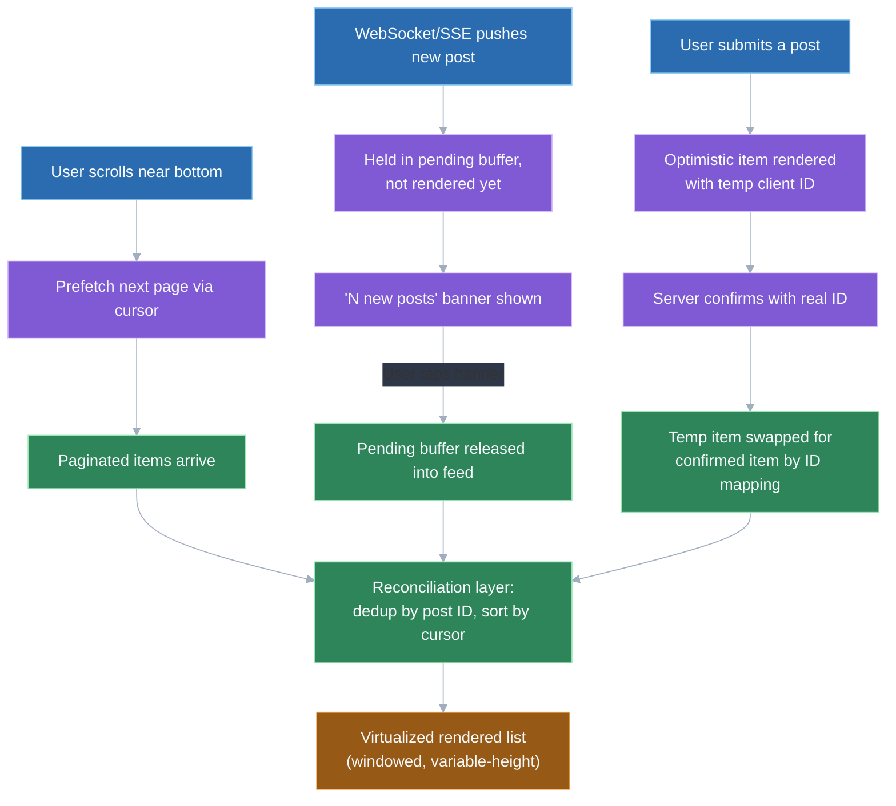
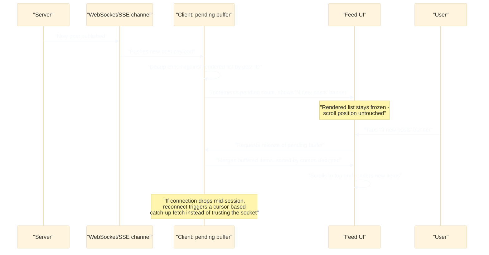

# Design a news feed (infinite scroll, real-time updates)

## 🎯 Executive Summary

A news feed looks like a scrolling list, but the actual design problem is that it has two structural requirements that pull in opposite directions. Infinite scroll wants a stable, append-only sequence the user can page downward through indefinitely without anything shifting under them. Real-time updates want to insert brand-new content at the top, which is precisely the kind of change that disorients a user mid-scroll if handled naively.

This is a recurring FAANG frontend system design prompt precisely because it can't be solved by picking two features off a shelf and bolting them together — cursor pagination, list virtualization, and a WebSocket feed are each individually well-understood, but combining them without breaking each other (duplicated items, lost scroll position, gaps after a reconnect) is the actual engineering problem. A candidate who designs the pagination layer and the real-time layer as independent concerns will produce a feed that behaves correctly in isolation and badly the moment both are exercised at once, which is exactly what an interviewer is listening for.

## 🧠 Core Technical Deep Dive

### The central tension: append-only history vs. prepend-only updates

A feed is conceptually an ordered log, and the two ways a client interacts with that log pull against each other. Scrolling down is a read of older, already-settled data — it should be stable, idempotent, and safe to re-fetch. Real-time delivery is a write of newer data arriving unpredictably at the opposite end of the list the user is currently looking at.

The naive design — treat the feed as one array, unshift new items onto it and push paginated items onto the end — breaks the moment both happen concurrently: a user three screens deep in scrollback gets their position silently shifted by insertions they didn't ask to see. The correct framing treats "what's rendered" and "what's arrived" as two separate buffers reconciled deliberately, not one array mutated from both ends.

> **Key takeaway:** design the pagination path and the real-time path as two producers writing into a reconciliation layer, not as one list mutated from both directions — most of this topic's hard bugs come from skipping that separation.

### Pagination mechanics: cursor-based vs. offset-based

| Approach | Mechanism | Behavior under concurrent writes |
|---|---|---|
| **Offset-based** (`?page=3&limit=20`) | Server returns rows `40–59` by row count | New posts inserted ahead of page 3 shift every row's offset, causing skipped or duplicated items on the next page fetch |
| **Cursor-based** (`?after=ts_1723:id_998&limit=20`) | Server returns the next 20 rows strictly after a stable, unique cursor value | Immune to insertions elsewhere in the feed — the cursor anchors to a specific row, not a row count |

A feed is one of the clearest cases where offset pagination is simply wrong, not just suboptimal, because the underlying data is actively being written to while the user is paging through it. The cursor needs to be a compound key (typically `timestamp + id`) rather than timestamp alone, since two posts can share a timestamp at typical feed insert rates and a non-unique cursor reintroduces the same skip/duplicate failure mode it was meant to fix.

> **Key takeaway:** cursor-based pagination isn't a performance optimization for a feed — it's the only pagination strategy that stays correct while the underlying list is being concurrently written to.

### Rendering thousands of rows: virtualization with variable heights

A feed that's been scrolled for a while can accumulate thousands of DOM nodes if every fetched item stays mounted, which degrades scroll performance and memory well before a user notices anything else is wrong. List virtualization (windowing) fixes this by rendering only the items currently visible plus a small buffer above and below, unmounting everything else while preserving scroll continuity.

Fixed-height virtualization (`react-window`'s basic mode) is straightforward because the list's total scrollable height is `itemCount * itemHeight`, a cheap calculation. Feed items break that assumption immediately — a text-only post, a post with one image, and a post with an embedded video are all different heights, and that height often isn't known until the item's content (especially an image) has actually loaded.

| Strategy | How it handles variable height | Trade-off |
|---|---|---|
| **Estimate-then-measure** (`react-virtual`, `react-window` variable-size) | Renders with an estimated height, measures the actual rendered height post-layout, and corrects the scroll offset | Can cause a visible micro-jump when the estimate is wrong, especially for image-heavy items |
| **Reserve space via known aspect ratio** | If an image's dimensions are returned by the API, reserve the correct height before the image loads | Eliminates layout shift entirely, but requires the backend to include media dimensions in the feed payload |
| **No virtualization, rely on `content-visibility: auto`** | Browser-native skip-rendering for off-screen content | Simpler to implement, but less predictable scroll-height accuracy than explicit virtualization for very long lists |

> **Key takeaway:** variable-height virtualization is a real engineering cost above fixed-height lists, and the highest-leverage mitigation is getting the backend to return media dimensions so height can be reserved correctly on first paint instead of measured after the fact.

### Delivering real-time updates: transport and the UX pattern that matters more

| Transport | Direction | Fit for a feed |
|---|---|---|
| **WebSocket** | Bidirectional, persistent connection | Best fit when updates are frequent and low-latency matters (e.g., live comment counts, a fast-moving feed) |
| **Server-Sent Events (SSE)** | Server-to-client only, over plain HTTP | Simpler infrastructure than WebSocket, auto-reconnects natively; a strong fit since a feed rarely needs the client to push anything over the same channel |
| **Short polling** | Client-initiated on an interval | Simplest to build and debug, but wastes requests when nothing changed and adds up to the interval's worth of latency |

The transport choice is a real decision, but it's not the one that determines whether the feed feels good to use — that's the UX pattern for *surfacing* what arrives. Auto-prepending new items the instant they arrive is the naive approach and it's disorienting: the user's current reading position visibly shifts downward with no action on their part, and if they were mid-read on an item near the top, they can lose their place entirely.

The standard pattern across production feeds (Twitter/X, LinkedIn, Facebook) is instead to hold new items in a pending buffer and surface a "N new posts" banner pinned near the top, which the user explicitly taps to reveal them. This keeps the currently-rendered list frozen — matching the stability infinite scroll depends on — while still surfacing freshness as a lightweight, user-controlled action instead of an involuntary layout shift.

> **Key takeaway:** the transport (WebSocket vs. SSE vs. polling) is a secondary decision; the "new posts" banner pattern, which decouples arrival from rendering, is the actual UX fix for the append/prepend tension and is what interviewers expect a Lead candidate to name unprompted.

### Consistency: dedup, ordering, and optimistic UI

Once both a paginated history and a real-time stream are writing into the same rendered list, three correctness problems show up in combination. First, duplication: a post fetched via a page request can also arrive over the real-time channel (e.g., the user scrolls down through history right as that post streams in), and rendering both copies requires deduping by a stable post ID before merge, not relying on array position. Second, ordering: real-time messages aren't guaranteed to arrive in server-write order over an unreliable network, so the client should sort by the server-assigned cursor/timestamp on merge rather than trusting arrival order.

The third problem is optimistic UI reconciliation: when a user posts their own content, the UI typically renders it instantly with a temporary client-generated ID for perceived performance, before the server has confirmed it. When the server's confirmation (or the next real-time push) delivers the authoritative version with a real ID, the client needs to replace the optimistic placeholder rather than render both — usually by having the client hold a mapping from temp ID to the real ID once returned, and swapping on receipt.

> **Key takeaway:** treat every incoming item — from pagination, real-time push, or an optimistic local render — as needing dedup-by-stable-ID and re-sort-by-cursor on merge; conflating "arrived" with "belongs at the top" is what produces duplicate or out-of-order rows in practice.

### Prefetching and caching for perceived performance

Fetching the next page only once the user hits the literal bottom of the currently rendered content guarantees a visible loading spinner on every page boundary. Prefetching the next page when the user is a fixed distance (e.g., a few screens) from the bottom hides that latency behind normal scroll speed for the common case. This needs a request-dedup guard, since fast scrolling can otherwise trigger the same prefetch trigger multiple times before the first request resolves.

Caching already-fetched pages in an in-memory (or `IndexedDB`-backed, for cross-session persistence) store means scrolling back up after having scrolled far down doesn't re-fetch — and re-fetching is worse than merely wasteful here, since a re-fetch of the same range can return a subtly different result if the feed reordered or new items were inserted in between, undermining the stability the user expects from content they already scrolled past.

> **Key takeaway:** prefetch ahead of the scroll edge and cache pages already seen — the second part matters as much as the first, because re-fetching previously-seen content risks silently reordering rows the user already read.

### Scope note: ranking vs. chronological ordering

Whether the feed is strictly reverse-chronological or algorithmically ranked is largely a backend/ML-relevance concern, and going deep on ranking models is usually scope creep in a frontend design round unless the interviewer steers there explicitly. What's relevant to the client: an algorithmically ranked feed can reorder items the user has already scrolled past when a later page is fetched, since ranking scores can shift between requests.

This breaks the assumption that "page 2" always means the same 20 items across repeated fetches, which is exactly why the cursor should anchor to a stable value the ranking system won't reorder (e.g., insertion time or a rank-snapshot token issued at the start of the session) rather than "position 20–39 in the current ranking."

> **Key takeaway:** name that ranking is primarily a backend concern, but flag the one client-relevant consequence — a reordering feed needs its pagination cursor to be stable across re-ranks, or "page 2" silently becomes a different set of posts on each fetch.

## 📊 Visual Architecture & Logic

### Diagram 1 — Feed data flow: reconciling pagination, real-time, and optimistic writes



### Diagram 2 — Real-time update lifecycle: arrival to visible banner to reveal



## 🏢 Interview Context & FAANG Signals

"Design a news feed" (sometimes phrased as "design Facebook's feed" or "design Twitter's timeline") is one of the most commonly asked frontend system design prompts across FAANG Lead/Staff loops, precisely because it compresses several distinct hard problems — pagination, virtualization, real-time delivery, and state reconciliation — into one deceptively simple-looking UI. Interviewers use it to see whether a candidate can hold multiple interacting constraints in mind simultaneously rather than solving each in isolation.

**Lead signals interviewers listen for:**

- Naming the pagination-vs-real-time tension explicitly and early, rather than presenting infinite scroll and live updates as two independent features to be implemented separately.
- Justifying cursor-based over offset-based pagination with the actual failure mode (skip/duplicate under concurrent writes), not just asserting it as best practice.
- Proposing the "N new posts" banner pattern unprompted, and explaining *why* auto-prepending is wrong (disorients scroll position) rather than just describing what the banner does.
- Addressing variable-height virtualization as a real complication, not assuming a fixed-height windowing library solves the problem out of the box.
- Covering deduplication and out-of-order delivery as a designed reconciliation step, and connecting it to optimistic UI reconciliation for the user's own posts.

## ⚔️ Lead Level vs Senior Level

**Scenario: "Design a news feed like Twitter's home timeline, supporting infinite scroll and real-time updates."**

A **Senior** response is technically reasonable: use cursor-based pagination for infinite scroll, open a WebSocket for real-time updates, virtualize the list for performance, and render new items as they arrive.

A **Lead/Staff** response covers the same components but is evaluated on additional dimensions:

- **States the pagination/real-time tension as the framing problem upfront**, before diving into either mechanism, and explains that the design's success is measured by whether the two interact correctly, not by either working in isolation.
- **Names the specific offset-pagination failure mode** (skipped/duplicated rows under concurrent inserts) as the justification for cursor-based pagination, rather than citing it as a default best practice.
- **Proposes the "new posts" banner pattern and explains the UX reasoning** — that auto-prepending breaks reading position — instead of just wiring real-time pushes directly into the rendered list.
- **Addresses variable-height virtualization concretely**, including the layout-shift risk from unknown image/video heights and a mitigation (reserving space via known media dimensions).
- **Designs an explicit reconciliation layer**: dedup by stable ID, sort by cursor on merge, and optimistic-post-to-confirmed-post swapping — named as a distinct architectural component, not left implicit.
- **Flags reconnect/offline behavior**: a dropped WebSocket connection needs a cursor-based catch-up fetch on reconnect, not blind trust that the socket delivered everything that happened while disconnected.

The differentiator: a Senior answer assembles working parts; a Lead answer explains why those parts don't silently corrupt each other when exercised together, and names the specific failure modes (skip/duplicate, scroll-jump, duplicate optimistic post, missed-update-on-reconnect) that motivate every design choice.

## ⚠️ Common Pitfalls & Anti-Patterns

> ### ✕ Using offset-based pagination (`page`, `limit`) for a feed
> **Why it's wrong:** A feed is written to concurrently by other users; when new posts are inserted ahead of the page the client is currently fetching, every subsequent offset shifts, causing rows to be skipped or duplicated across page boundaries.
> **✓ Correct Lead Approach:** Use cursor-based pagination keyed on a stable, unique compound value (timestamp + id), which anchors to a specific row rather than a row count and stays correct regardless of concurrent writes elsewhere in the feed.

> ### ✕ Auto-prepending real-time updates directly into the rendered list
> **Why it's wrong:** Inserting new items at the top the instant they arrive shifts the scroll position of anyone currently reading further down, and can cause the user to lose their place mid-article — the single most common feed-real-time complaint in production.
> **✓ Correct Lead Approach:** Buffer incoming real-time items and surface a "N new posts" banner; only merge them into the visible list when the user explicitly taps it, keeping the currently-rendered content frozen until then.

> ### ✕ Virtualizing the feed as if every item has a fixed, known height
> **Why it's wrong:** Feed items vary in height (text-only vs. image vs. video), and treating them as uniform either produces visibly wrong scrollbar sizing or a layout jump once the real height is measured post-render.
> **✓ Correct Lead Approach:** Use a variable-size virtualization strategy that measures and corrects post-layout, and where possible reserve the correct height upfront using media dimensions returned by the API, avoiding the jump entirely for image/video-heavy items.

> ### ✕ Merging real-time and paginated items into the list without deduping or re-sorting
> **Why it's wrong:** The same post can arrive via both a page fetch and a real-time push, and real-time messages aren't guaranteed to arrive in server order over an unreliable network — merging without a dedup-by-ID and sort-by-cursor step produces duplicate rows or items rendered out of chronological order.
> **✓ Correct Lead Approach:** Route every incoming item (paginated, real-time, or optimistic) through a single reconciliation step that dedupes by stable post ID and sorts by the server-assigned cursor before it reaches the rendered list.

> ### ✕ Trusting the WebSocket to have delivered everything after a reconnect
> **Why it's wrong:** A dropped connection (device sleep, network switch, tab backgrounding) can silently miss pushes sent during the gap; resuming the socket and assuming the feed is now caught up leaves a permanent gap in the user's timeline with no visible error.
> **✓ Correct Lead Approach:** On reconnect, perform a cursor-based catch-up fetch for anything published since the last known cursor before resuming to rely on the live socket, treating the socket as a freshness signal rather than the source of truth for completeness.

## 🛠️ Practice Scenarios (5-10 Scenarios)

<details>
<summary><strong>Scenario 1: Choosing cursor vs. offset pagination</strong></summary>

**Problem statement:** A teammate proposes `GET /feed?page=2&limit=20` for the feed's pagination API, arguing it's simpler to implement and debug than a cursor. Evaluate the proposal.

**Staff-Level Solution:**
Offset pagination is simpler in isolation, but a feed is exactly the case where that simplicity is misleading: the underlying data is being written to concurrently by other users while the client pages through it. If five new posts are inserted ahead of the current position between page 1 and page 2 requests, `page=2` now returns a window that's shifted by five rows relative to what the client expects, producing either duplicated items (if it re-lands on rows already shown) or skipped items (if it jumps past rows never shown).

I'd propose `GET /feed?after=1723123456_998877&limit=20` instead, where the cursor is a compound value of timestamp and post ID — timestamp alone risks collisions at realistic feed insert rates, so the ID makes it unique. This makes each page request anchor to a specific row rather than a row count, so it stays correct regardless of how many items are inserted elsewhere in the feed between requests. The debugging complexity offset pagination trades for is a one-time cost; the correctness bug cursor pagination avoids would otherwise surface as a confusing, hard-to-reproduce production issue reported as "I keep seeing the same post twice."
</details>

<details>
<summary><strong>Scenario 2: Designing the "new posts" banner UX</strong></summary>

**Problem statement:** Design how new real-time posts should be surfaced to a user who is currently scrolled a few screens down into the feed, reading.

**Staff-Level Solution:**
The failure mode to avoid is disrupting the user's current scroll position or reading flow — auto-prepending would visibly shift content beneath them the instant a new post arrives, which is jarring regardless of how relevant the new content is. Instead, incoming real-time items go into a pending buffer that isn't rendered into the visible list at all; a small, fixed-position banner near the top of the viewport (`"12 new posts"`) reflects the buffer's count, updating as more arrive.

```javascript
// Simplified: buffer accumulates, doesn't touch the rendered list
function onRealtimePost(post) {
  pendingBuffer.push(post);
  setBannerCount(pendingBuffer.length);
}

function onBannerTap() {
  const merged = dedupeAndSort([...renderedItems, ...pendingBuffer]);
  setRenderedItems(merged);
  pendingBuffer = [];
  scrollToTop();
}
```

Tapping the banner is the only action that merges the buffer into the visible list, and I'd pair that with scrolling the user to the top so the newly revealed items are actually visible rather than merged silently off-screen above their current position. If the user is already at the top of the feed when items arrive, I'd consider auto-revealing without the banner tap, since there's no reading position to protect in that specific case — but I'd keep that as a deliberate, scoped exception rather than the default behavior.
</details>

<details>
<summary><strong>Scenario 3: Virtualizing variable-height feed items</strong></summary>

**Problem statement:** The feed renders text-only posts, posts with a single image, and posts with an embedded video, all at different heights. Naive fixed-height virtualization causes visible jumping as the user scrolls. Fix it.

**Staff-Level Solution:**
Fixed-height virtualization assumes `scrollHeight = itemCount * rowHeight`, which is false the moment items vary in height — the jumping happens because the virtualizer initially estimates a height, renders the item, then corrects its position once the real height is measured, and that correction is visible as a jump if the estimate was significantly wrong.

The most effective mitigation is eliminating the guesswork: if the feed API returns media dimensions (`{ width: 1080, height: 720 }`) alongside each image or video attachment, the client can compute the item's final rendered height *before* the media has loaded, reserving the correct space upfront via an aspect-ratio-based placeholder. For items without a computable height (variable-length text), I'd rely on a virtualization library with dynamic measurement (`react-virtual`'s `measureElement`) that corrects the estimate but does so far less often, since most of the layout is now know-ahead-of-time from image/video items specifically. I'd also keep a slightly larger render buffer (items just outside the viewport, not just visible ones) so measurement corrections happen off-screen rather than mid-view.
</details>

<details>
<summary><strong>Scenario 4: Handling an out-of-order real-time update</strong></summary>

**Problem statement:** Two posts are published by the server 200ms apart, but due to network conditions, the client's WebSocket receives them in reverse order. What happens, and how should the client handle it?

**Staff-Level Solution:**
If the client naively appends real-time items to the buffer in arrival order, the feed would render the two posts swapped relative to when they were actually published — a real, if usually minor, correctness bug that gets more visible in comment threads or reply chains where order carries meaning. The fix is to never trust arrival order as rendering order: every real-time item carries the same cursor value (timestamp + id) used for pagination, and the pending buffer is sorted by that cursor before being merged into the rendered list, not by receipt order.

```javascript
function mergeIntoFeed(existing, incoming) {
  const combined = dedupeById([...existing, ...incoming]);
  return combined.sort((a, b) => compareCursor(b.cursor, a.cursor)); // newest first
}
```

This makes the client's rendering order a pure function of server-assigned cursors, which is the only ordering guarantee that actually holds — the transport layer (WebSocket) makes no ordering guarantee itself, so the client has to enforce ordering explicitly rather than assume it.
</details>

<details>
<summary><strong>Scenario 5: Deduplicating a user's optimistic post against the server-confirmed version</strong></summary>

**Problem statement:** A user submits a new post. The UI renders it immediately for perceived performance, before the server responds. When the server confirms it (or it arrives back over the real-time channel), the user sees their post twice in the feed. Fix it.

**Staff-Level Solution:**
The duplication happens because the optimistic item and the server-confirmed item are treated as two unrelated entries — the optimistic one has a client-generated temporary ID, and the confirmed one has the server's real ID, so a naive ID-based dedup doesn't catch the collision. The fix is to track the mapping explicitly at submission time and reconcile on confirmation, rather than trying to dedup by content matching (unreliable — near-identical posts from other reconciliation paths could false-positive).

```javascript
const tempId = `optimistic-${crypto.randomUUID()}`;
renderedItems.unshift({ id: tempId, content, status: 'sending' });

const { id: realId } = await api.submitPost(content);
renderedItems = renderedItems.map(item =>
  item.id === tempId ? { ...item, id: realId, status: 'sent' } : item
);
// If the real-time channel also delivers this post by realId, the
// reconciliation layer's dedup-by-ID now correctly treats it as
// already present, since the temp ID has been swapped for the real one.
```

I'd also handle the failure path explicitly: if `submitPost` rejects, the optimistic item's status flips to `'failed'` with a retry affordance, rather than silently vanishing, since an optimistic UI that fails invisibly erodes trust in the "instant" post appearing at all.
</details>

<details>
<summary><strong>Scenario 6: Preserving scroll position when new items arrive</strong></summary>

**Problem statement:** Even with the "new posts" banner pattern, verify that scroll position genuinely doesn't move when the pending buffer grows, and identify what could break that guarantee.

**Staff-Level Solution:**
Scroll position is preserved by construction as long as the buffer is a true side channel — items sitting in `pendingBuffer` are never spliced into `renderedItems`, so the DOM the user is scrolled against literally doesn't change until the banner is tapped. The place this breaks in practice is the banner itself: if the banner is rendered as part of the normal document flow at the top of the list (rather than `position: fixed`/`sticky` overlaid on top of it), its appearance or count-text re-render can itself shift layout and nudge scroll position, which defeats the whole point.

I'd also watch for a second, subtler break: virtualization libraries sometimes recalculate item positions when the underlying data array's *identity* changes, even if the visible slice is unchanged — so updating `pendingBuffer` should not, itself, cause `renderedItems` (the array the virtualizer is actually keyed on) to be reallocated or reordered. Keeping the two arrays structurally independent, and only ever replacing `renderedItems` on explicit banner-tap, is what makes the "position doesn't move" guarantee hold under both normal reads and re-renders.
</details>

<details>
<summary><strong>Scenario 7: Feed reordering breaking pagination</strong></summary>

**Problem statement:** The feed switches from strictly chronological to an algorithmically ranked ordering. Users report seeing posts they'd already scrolled past reappear near the top after loading more pages. Diagnose and fix.

**Staff-Level Solution:**
This is a direct consequence of pagination that implicitly assumes a stable ordering. If the cursor (or worse, an offset) is interpreted against "the current ranking," and the ranking model re-scores content between the user's first page load and their fifth, page 5's fetch can return items that would now rank *above* items already shown on page 1 — the client has no way to know that without re-rendering already-seen content, which is what users are reporting.

The fix is decoupling the pagination cursor from the live ranking: at the start of a session (or feed load), the server issues a rank-snapshot token, and every subsequent page request within that session is paginated against the ranking as it existed at that snapshot, not the live re-ranked state. New content can still be surfaced through the real-time "new posts" banner path independent of this, since that's a deliberate, explicit reveal rather than a reshuffling of a page the user already scrolled past. I'd explicitly flag to the interviewer that this snapshot needs a bounded lifetime (e.g., expire and offer a fresh session on a pull-to-refresh) so a user's view doesn't drift arbitrarily far from the live ranking over a long session.
</details>

<details>
<summary><strong>Scenario 8: Offline and reconnect behavior for a feed</strong></summary>

**Problem statement:** A mobile user's device loses network for two minutes (elevator, tunnel), during which several new posts were published and pushed to other connected clients. Design the reconnect behavior.

**Staff-Level Solution:**
The core risk is treating the WebSocket/SSE reconnect event as if it guarantees catch-up — most real-time transports reconnect the *channel* but don't replay everything that happened while disconnected, so trusting it silently leaves a gap in the feed with no visible error to the user. On reconnect, the client should perform an explicit cursor-based fetch for everything published after its last known cursor, before resuming live updates, treating this exactly like the initial pagination fetch rather than a special case.

```javascript
socket.on('reconnect', async () => {
  const missed = await api.getFeed({ after: lastKnownCursor });
  mergeIntoFeed(missed); // same dedup + sort path as any other merge
  socket.resume(); // now safe to trust live pushes again
});
```

I'd also surface this to the user proactively rather than merging silently — a brief "You're back online" or the same "N new posts" banner pattern used for live updates works well here too, since from the user's perspective a two-minute gap and a burst of real-time posts are the same experience: content they haven't seen yet, waiting to be revealed on their terms. While offline, I'd also disable pull-to-refresh-style implicit fetches and instead queue any user-initiated actions (likes, replies) for retry on reconnect, so the offline gap doesn't also silently drop the user's own actions.
</details>
