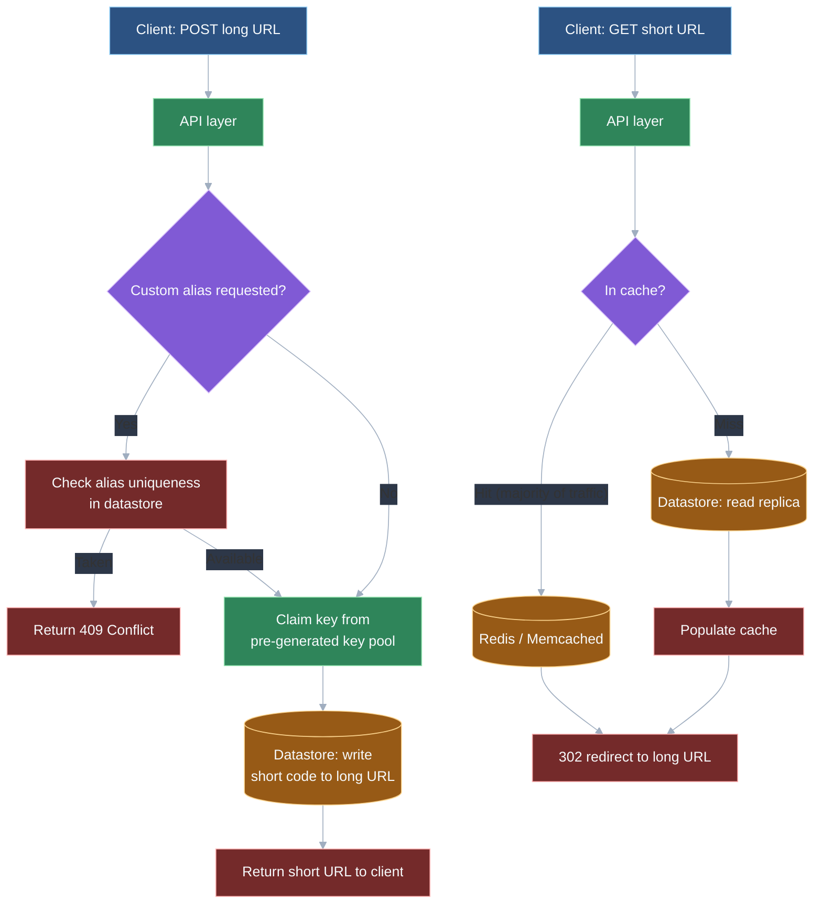
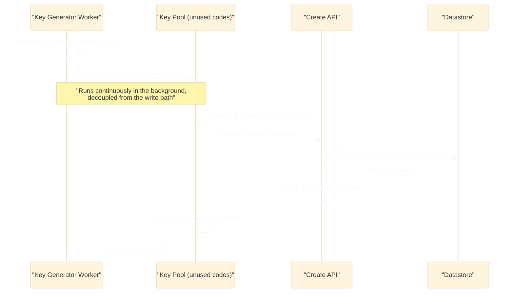

# Design a URL shortener

## 🎯 Executive Summary

A URL shortener is the canonical "warm-up" backend system design question, and it earns that reputation honestly: the problem statement fits in one sentence, but a careful answer touches capacity estimation, ID generation strategy, data modeling, caching, and an HTTP semantics trade-off that most candidates have never consciously thought about. It's included here because Frontend Lead loops increasingly add a backend-aware round, and this is the question most likely to appear in it — approachable enough to finish in 45 minutes, deep enough to separate a hand-wavy answer from a precise one.

The system itself is deceptively simple: map a long URL to a short code, and redirect visitors from the short code back to the long URL. What makes it a real system design exercise is that it's overwhelmingly **read-heavy** (redirects vastly outnumber new-link creation), which cascades into almost every other decision — how aggressively to cache, whether to accept eventual consistency on writes, and even which HTTP status code to redirect with. A Lead-level answer treats this read/write asymmetry as the organizing constraint for the whole design, not just a footnote.

## 🧠 Core Technical Deep Dive

### Requirements framing: functional vs. non-functional

The functional surface is small and worth stating explicitly before designing anything: given a long URL, generate a short code and store the mapping; given a short code, redirect to the original long URL; optionally, let the user supply a custom alias instead of a generated one; optionally, support link expiration and basic click analytics. Nothing here is architecturally hard on its own — the difficulty is entirely in the non-functional requirements.

The non-functional requirements are what actually drive the design: this is a read-heavy system, so redirect latency has to be very low (a slow redirect is a broken product, since it sits in the critical path of every link click). Availability matters more than strict consistency — a redirect serving a link created three seconds ago from a slightly stale replica is a non-issue, but a redirect endpoint that's down is a visible outage. Strong consistency on the write path (never issuing the same short code twice) matters, but strong consistency on the *read* path is explicitly not required.

> **Key takeaway:** state the read-heavy, availability-over-consistency shape of the problem out loud early — it's the single fact that justifies every downstream architectural choice (caching, replication, eventual consistency) and skipping it makes those choices look arbitrary instead of derived.

### Capacity estimation: doing the arithmetic, not just naming the step

Back-of-envelope numbers matter here because they quantify *how* read-heavy the system is, which then justifies specific architecture instead of vague appeals to "scale." A reasonable assumption set: 100 million new short URLs created per month, and a 100:1 read-to-write ratio (a typical assumption for link-shortening products, since a single popular link gets clicked far more than once).

| Metric | Calculation | Result |
|---|---|---|
| Writes/month | given | 100,000,000 |
| Writes/sec (avg) | 100M / (30 × 86,400s) | ≈ 39 writes/sec |
| Reads/month | 100M × 100 | 10,000,000,000 |
| Reads/sec (avg) | 10B / (30 × 86,400s) | ≈ 3,900 reads/sec |
| Peak reads/sec (×3 headroom) | 3,900 × 3 | ≈ 12,000 reads/sec |
| Storage for 5 years | 100M × 12 × 5 × ~500 bytes/record | ≈ 3 TB |

Two things fall out of this immediately. First, ~39 writes/sec is trivial for essentially any datastore — the write path is not the bottleneck and doesn't need heavy optimization. Second, ~12,000 peak reads/sec absolutely does need architectural attention: a single database instance answering every redirect will not hold up, which is the concrete justification for a caching layer and read replicas rather than a stated preference for them.

> **Key takeaway:** naming "we'll cache it" without the arithmetic behind it is a Senior-level answer; showing that the write path is ~40/sec while the read path is ~12,000/sec at peak is what makes caching and read replicas a derived conclusion instead of a reflexive one.

### Short code generation strategies

The short code is the core data structure of the whole system, and there are three real strategies with genuinely different failure modes — this is the part of the interview most likely to reward precision over hand-waving.

| Strategy | How it works | Strengths | Weaknesses |
|---|---|---|---|
| **Base62 of an auto-incrementing counter** | A centralized counter (DB sequence, Redis `INCR`) hands out monotonically increasing IDs; each is base62-encoded (`[a-zA-Z0-9]`) into a short string | Simple, guaranteed unique, no collision handling needed | The counter is a single logical bottleneck at very high write volume; sequential codes leak creation order and approximate total link volume to anyone who notices |
| **Hash of the long URL (MD5/SHA, truncated)** | Hash the input URL, take the first N characters (e.g., first 7 of a base62-encoded MD5) as the short code | Deterministic — the same long URL can map to the same short code without a lookup first; no central counter | Truncation makes collisions inevitable at scale, requiring detection (check-before-insert) and a resolution strategy (append a salt and rehash, or fall back to another scheme) — added latency and complexity on every write |
| **Pre-generated key pool** | A background worker pool continuously generates valid, unused short codes ahead of time and stores them in a "available keys" table/queue; a create request just claims one atomically | No counter contention, no collision handling, creation is a fast atomic claim from a pre-validated pool; workers can be sharded independently of the write path | More moving parts (a key-generation service, a pool that needs replenishing before it empties); codes carry no inherent meaning, which is a non-issue in practice |

At real scale, the pre-generated key pool is usually the preferred approach, precisely because it sidesteps both problems the other two strategies have: no centralized counter that becomes a contention point under high write concurrency, and no collision handling on the hot write path. The trade-off is operational — something has to keep the pool replenished and monitor it from running dry — but that's a well-understood, decoupled background job rather than a correctness risk on every request.

> **Key takeaway:** "we'll hash the URL" is the answer most candidates give and the one that most obviously hasn't been stress-tested against collisions at scale — naming the pre-generated key pool and explaining *why* it avoids both the counter-contention and collision problems is a concrete Lead-level signal.

### Data model and storage choice

The core data model is a single key-value mapping: short code → long URL, plus a handful of metadata fields (creation timestamp, optional expiration, optional owner/user ID, click count if analytics are in scope). There are no joins in this system's critical path — a redirect is a single lookup by primary key, not a query spanning multiple related entities.

| Option | Fit |
|---|---|
| **Key-value store** (DynamoDB, Redis-backed, Cassandra) | Natural fit — the access pattern is exactly "get by key," these stores are built to serve that pattern at very low latency and scale horizontally by design |
| **Simple indexed SQL table** (`short_code` as primary key) | Also works fine at moderate scale — a single indexed column lookup is fast, and SQL's relational features (joins, transactions across tables) simply aren't needed here |

Either choice is defensible; what matters in the interview is naming *why* — this system doesn't need multi-table transactions or relational integrity, so picking a heavyweight relational schema with foreign keys and joins would be over-engineering for an access pattern that's fundamentally a single-key lookup. The choice of key-value store vs. SQL becomes more about the team's existing operational expertise and the sharding story (below) than about a technical requirement of the data itself.

> **Key takeaway:** name the access pattern (single-key lookup, no joins) as the reason the schema is simple — a URL shortener that ends up with a five-table relational schema is a sign the design overcomplicated a problem that a key-value model already fits.

### Caching the read path

Because reads outnumber writes by roughly 100:1 in the capacity estimate above, and because link popularity follows a heavy skew (a small fraction of short links receive the large majority of redirect traffic — the familiar 80/20-style pattern), an in-memory cache (Redis or Memcached) in front of the datastore is one of the highest-leverage pieces of this design. A cache sized to hold the hottest fraction of links can absorb the overwhelming majority of the ~12,000 peak reads/sec estimated earlier, leaving the datastore to handle mostly cache misses on the long tail.

This document keeps the caching discussion intentionally brief — cache invalidation policy, eviction strategy (LRU vs. LFU), and cache-aside vs. write-through patterns are covered in depth in the companion "design a caching layer" topic in this repo. The point specific to *this* system is narrower: cache population should be lazy (cache-aside, populated on first read) rather than pre-warmed for every new link, since most created links never become hot enough to justify a cache slot.

> **Key takeaway:** the case for caching here isn't generic "caching is good practice" — it's the specific combination of a 100:1 read/write ratio and a heavily skewed popularity distribution, both quantifiable from the capacity estimate, that makes it close to mandatory rather than optional.

### The redirect status code trade-off: 301 vs. 302

This is the single most distinctive trade-off in this problem, and naming it precisely is a strong Lead-level signal on its own.

| Status | Meaning | Browser/CDN caching behavior | Consequence |
|---|---|---|---|
| **301 (Moved Permanently)** | Tells the browser this redirect is permanent | Browsers and CDNs cache it aggressively — on repeat visits, the browser redirects locally without ever hitting the shortener's server again | Server load drops sharply for repeat visitors, but the shortener stops seeing those subsequent visits entirely — analytics undercount actual click volume |
| **302 (Found / Temporary)** | Tells the browser this redirect might change | Not cached by the browser — every single visit hits the shortener's server | Server has to handle full read volume on every click, but gets accurate, complete click data for analytics |

Most real-world URL shorteners use 302 despite the extra server load, and the reason is a deliberate trade-off, not an oversight: the whole value proposition of a link-shortening product for many users (marketers, social media managers) is the click analytics, and a 301's aggressive caching silently breaks that by making the server blind to repeat traffic. The "extra load" 302 creates is exactly the read volume the caching layer above already exists to absorb, so the two decisions reinforce each other rather than compound the problem.

> **Key takeaway:** naming this trade-off unprompted, with the specific mechanism (browser caching defeats server-side analytics visibility), is one of the clearest ways to distinguish a Lead answer from "I'd probably use a 301 redirect since it's a redirect" — a common and revealing answer that treats the HTTP status as a formality instead of a product decision.

### Scaling beyond a single node

Once a single datastore instance can't hold the full key space or serve the required throughput, sharding by short code (typically via consistent hashing across nodes) distributes both storage and read/write load, and consistent hashing specifically minimizes redistribution when nodes are added or removed. Read replicas layered under the cache handle cache-miss traffic without funneling every miss back to one primary.

Two more concerns round out the scaling story. Rate-limiting URL creation (per IP or per API key, via a token-bucket or sliding-window limiter) prevents abuse — spam link generation, or an attacker using the service to churn through the short-code space. Custom alias collisions need an explicit resolution path: check-then-insert with a uniqueness constraint on the alias column, returning a clear "alias taken" error to the caller rather than silently overwriting an existing mapping.

> **Key takeaway:** sharding, rate-limiting, and alias-collision handling are three independent scaling concerns that get bundled into a vague "and then we'd scale it horizontally" if not named separately — each has a distinct mechanism and is worth a sentence of its own.

## 📊 Visual Architecture & Logic

### Diagram 1 — Request flow: create and redirect paths

### Diagram 2 — Short code generation: pre-generated key pool lifecycle

## 🏢 Interview Context & FAANG Signals

This is one of the most commonly asked "warm-up" backend system design questions across FAANG and FAANG-adjacent companies, and precisely because it's approachable — most candidates can describe *a* working design in the first five minutes — it's used to see how far past the obvious answer a candidate goes. The problem has several real, nameable trade-offs packed into a small surface area, which makes it efficient for interviewers to calibrate seniority quickly.

The clearest Lead-level signal is precision on the two trade-offs this document spends the most time on: naming the 301-vs-302 decision with its actual mechanism (browser caching defeats analytics visibility), and comparing the three short-code generation strategies with their specific failure modes, rather than defaulting to "we'll use a hash function" and moving on. A candidate who does the capacity estimate arithmetic unprompted, and explicitly connects the read-heavy ratio to the caching and replication decisions that follow, is demonstrating the same reasoning pattern a Lead is expected to bring to any read-heavy production system, not just this one.

**Lead signals interviewers listen for:**

- Doing the back-of-envelope read/write arithmetic rather than asserting "it's read-heavy" without numbers.
- Comparing counter-based, hash-based, and pre-generated-pool short code strategies with their specific trade-offs, not defaulting to one without discussing alternatives.
- Naming the 301-vs-302 trade-off unprompted, with the correct mechanism.
- Justifying the storage choice (key-value vs. SQL) by the access pattern (single-key lookup, no joins) rather than by default familiarity.
- Treating rate-limiting and custom-alias collision handling as first-class design concerns, not afterthoughts mentioned only if asked.

## ⚔️ Lead Level vs Senior Level

**Scenario: "Design a URL shortener that needs to handle 100 million new links per month."**

A **Senior** response is technically workable: use a hash of the long URL truncated to 7 characters as the short code, store the mapping in a SQL table, add a cache in front of it, and redirect with a 301 for simplicity.

A **Lead/Staff** response covers similar ground but is evaluated on additional dimensions:

- **Quantified capacity estimate stated upfront**: derives the ~39 writes/sec vs. ~12,000 peak reads/sec split from the 100M/month and a stated read-multiplier assumption, and uses that split to justify every subsequent architectural choice rather than asserting them independently.
- **Named short-code strategy trade-off, not just a chosen one**: explains why a pre-generated key pool avoids both the counter-contention problem of an auto-incrementing approach and the collision-handling cost of a hash-based approach, rather than picking hashing because it's the first idea that comes to mind.
- **301 vs. 302 named as a deliberate product trade-off**: explicitly connects the choice to analytics visibility, not just "redirect status codes."
- **Rate-limiting and alias-collision handling named unprompted**: treats abuse prevention and custom-alias uniqueness as core requirements of a public-facing creation endpoint, not edge cases raised only under interviewer pressure.
- **Sharding strategy named with a mechanism**: consistent hashing by short code, with an explicit reason (minimizes redistribution on node changes) rather than "we'd shard it."

The differentiator: a Senior answer produces a working URL shortener; a Lead answer produces one where every major decision — caching, redirect code, code generation strategy — is derived from a stated, quantified understanding of the read/write asymmetry, rather than a list of default choices that happen to work.

## ⚠️ Common Pitfalls & Anti-Patterns

> ### ✕ Naming "hash the URL" as the short code strategy without addressing collisions
> **Why it's wrong:** Truncating any hash to a short length (5-8 characters) makes collisions a certainty at high volume, not an edge case — an answer that doesn't mention collision detection or resolution has implicitly assumed a problem away.
> **✓ Correct Lead Approach:** Either pair hashing with an explicit check-before-insert and salted-retry strategy, or prefer a pre-generated key pool that avoids collisions structurally, and state which one and why.

> ### ✕ Defaulting to a 301 redirect "because it's more efficient"
> **Why it's wrong:** A 301 gets cached aggressively by browsers and CDNs, which means the shortener's server stops seeing repeat visits to that link — silently breaking click analytics, which is often the entire value proposition of the product.
> **✓ Correct Lead Approach:** Default to 302 for any link where analytics matter, and name the trade-off explicitly: slightly higher server load in exchange for accurate click visibility on every visit.

> ### ✕ Designing a relational schema with multiple joined tables for the core mapping
> **Why it's wrong:** The core access pattern is a single-key lookup (short code → long URL); a multi-table relational design with joins adds latency and complexity to the one operation (redirect) that most needs to be fast.
> **✓ Correct Lead Approach:** Model the core mapping as a flat key-value structure regardless of whether the underlying store is SQL or NoSQL, and reserve relational modeling for genuinely relational concerns (e.g., a separate user-accounts table), not the redirect path itself.

> ### ✕ Skipping the capacity estimate and jumping straight to architecture
> **Why it's wrong:** Without quantifying the read/write ratio, decisions like "add a cache" or "use read replicas" sound like reflexive best practices instead of conclusions derived from the specific system being designed, which is a weaker signal in an interview.
> **✓ Correct Lead Approach:** Do the arithmetic — even rough numbers — before proposing caching, replication, or sharding, and explicitly tie each architectural decision back to a number from the estimate.

> ### ✕ Treating custom aliases and rate-limiting as out-of-scope edge cases
> **Why it's wrong:** A public creation endpoint without rate-limiting is an abuse vector (spam link generation), and custom aliases without a uniqueness check risk silently overwriting an existing user's link — both are realistic production concerns, not hypothetical extras.
> **✓ Correct Lead Approach:** Include rate-limiting (token-bucket or sliding-window, per IP or API key) and alias uniqueness handling (check-then-insert with a clear conflict error) as part of the base design, not as follow-up items raised only if the interviewer asks.

## 🛠️ Practice Scenarios (5-10 Scenarios)

<strong>Scenario 1: Choosing a short-code generation strategy and defending it</strong>

**Problem statement:** The interviewer asks you to pick one short-code generation strategy for a system expecting 100 million new links per month and defend the choice against the alternatives.

**Staff-Level Solution:**
I'd choose a pre-generated key pool: a background worker pool continuously generates base62 candidate codes, validates them for uniqueness, and stores them in an "available" table or queue; the create endpoint atomically claims one rather than generating on the fly. Against the auto-incrementing counter approach, this avoids a single centralized counter becoming a contention point as write concurrency grows — at 39 writes/sec on average that's not urgent, but the pool approach costs nothing extra and removes the risk entirely as the system scales past this estimate.

Against hashing the long URL, the key pool avoids collision handling on the hot write path altogether — hashing requires a check-before-insert and a resolution strategy (salt-and-rehash) that adds latency and complexity to every creation request, where claiming from a pre-validated pool is a single atomic operation. The cost is operational: the pool needs a replenishment mechanism and monitoring so it never runs dry, but that's a decoupled background job, not a correctness risk on the request path — a trade I'd take at this volume.

<strong>Scenario 2: Doing the capacity estimate live</strong>

**Problem statement:** The interviewer wants you to work through the read/write capacity estimate out loud before designing anything, starting from "100 million new links per month, and assume a 100:1 read-to-write ratio."

**Staff-Level Solution:**
Writes: 100,000,000 links per month divided by roughly 2.6 million seconds in a month (30 × 86,400) gives about 39 writes/sec on average — a trivial write load for essentially any datastore. Reads: at a 100:1 ratio, that's 10 billion redirects per month, or about 3,900 reads/sec on average; applying a conservative 3x peak-to-average multiplier for traffic spikes puts peak load around 12,000 reads/sec.

That split is the whole justification for the rest of the design: the write path doesn't need special optimization, but 12,000 reads/sec sustained through a single database instance is not realistic, so a cache absorbing the bulk of that traffic and read replicas handling the remainder are effectively mandatory, not optional extras. I'd also note storage is modest — even at ~500 bytes per record including metadata, 5 years of links is only a few terabytes, so storage volume isn't a driving constraint here the way read throughput is.

<strong>Scenario 3: Choosing 301 vs. 302 with reasoning</strong>

**Problem statement:** A product stakeholder asks why the redirect doesn't use a 301, since it would reduce server load. Respond with the trade-off.

**Staff-Level Solution:**
A 301 tells browsers and CDNs the redirect is permanent, so they cache it aggressively — after the first visit, a returning user's browser redirects locally without ever hitting our server again. That does reduce load, but it means we stop seeing those subsequent visits entirely, which silently breaks click analytics: a link that's actually clicked a thousand times by repeat visitors might only ever register a handful of hits on our servers.

A 302 tells the browser the redirect isn't guaranteed permanent, so it isn't cached — every single click, including repeat visits, hits our server and gets logged. Given that click analytics is a core value proposition for most users of a link shortener, I'd default to 302 despite the extra server load, and note that the caching layer we already have in front of the datastore is specifically what makes that extra load manageable — the two decisions are meant to work together, not in isolation.

<strong>Scenario 4: Handling a custom-alias collision</strong>

**Problem statement:** A user requests the custom alias `promo2026`, but another user already claimed that exact alias yesterday. Design the handling for this case end-to-end.

**Staff-Level Solution:**
The alias column needs a uniqueness constraint at the datastore level, not just an application-level check, since a purely application-level check is vulnerable to a race condition where two concurrent requests both pass the check before either writes. The creation flow should be check-then-insert with the uniqueness constraint as the actual source of truth: attempt the insert, and if it fails on the constraint, return a clear `409 Conflict` with a message like "alias already taken" rather than a generic 500 error.

I'd explicitly reject any design that silently falls back to overwriting the existing mapping or silently appending a suffix to the requested alias — both surprise the user by giving them something other than what they asked for. If the product wants a "suggest an alternative" UX (e.g., `promo2026-2`), that's a deliberate product decision to layer on top of the conflict response, not a substitute for surfacing the conflict clearly.

<strong>Scenario 5: Designing rate-limiting against abuse</strong>

**Problem statement:** The creation endpoint is public (no login required) and is being used to generate thousands of spam short links per minute from a small number of IP addresses. Design a fix.

**Staff-Level Solution:**
I'd add a rate limiter in front of the create endpoint, keyed by IP address for anonymous traffic and by API key for authenticated traffic, using a token-bucket or sliding-window algorithm implemented in Redis (a shared counter per key with a TTL, incremented per request and rejected once the bucket is exhausted). This needs to live at the API gateway or a shared layer, not per-application-server, since per-server limits are trivially bypassed by a client hitting a load balancer that fans out across many servers.

For longer-term abuse (a spammer rotating through many IPs), I'd add a secondary signal beyond raw request rate — e.g., flagging accounts or IP ranges whose created links get disproportionately reported or blocked by a downstream link-safety check, and layering a CAPTCHA or stricter limit on flagged sources rather than tightening the global limit for all legitimate users. I'd frame this as defense in depth: rate-limiting handles the acute case immediately, and behavioral signals handle sophisticated abuse that spreads across many identities.

<strong>Scenario 6: Scaling the datastore past a single node</strong>

**Problem statement:** The single-node datastore is now the bottleneck at current write volume, and read replicas alone aren't enough headroom. Design the path to a sharded datastore.

**Staff-Level Solution:**
I'd shard by short code using consistent hashing across nodes, which distributes both storage and read/write load roughly evenly and, critically, minimizes the fraction of keys that need to move when a node is added or removed — a plain modulo-based hash would require reshuffling nearly every key on any topology change, which is operationally painful at this scale. Each shard would still have its own read replicas underneath the shared cache layer, so the cache continues absorbing the bulk of hot-key traffic before it ever reaches a specific shard.

I'd call out one wrinkle specific to this system: if using the pre-generated key pool strategy, the pool itself needs to hand out keys in a way that's aware of the shard mapping (or the mapping needs to be computed from the code after the fact via consistent hashing, same as any read), so a newly claimed code lands on a predictable shard rather than requiring a lookup-then-redirect on every write.

<strong>Scenario 7: Adding click analytics without breaking read-path performance</strong>

**Problem statement:** Product wants per-link click counts and a timestamp for every redirect, but the redirect endpoint is latency-critical — the read path we designed can't get slower.

**Staff-Level Solution:**
I'd keep the redirect response completely decoupled from the analytics write: the redirect handler serves the 302 from cache and, in the same request, fires an asynchronous event (a message onto a queue like Kafka or SQS) containing the short code, timestamp, and any request metadata, without waiting for that event to be durably processed before responding to the client. A separate consumer service reads off the queue and aggregates click counts into a datastore optimized for that access pattern (a counter store or an analytics-oriented table), fully isolated from the redirect path's latency budget.

This also means analytics data is eventually consistent by design — a click count might lag actual traffic by seconds — which is an acceptable trade-off given the non-functional requirements established earlier (strong consistency matters far more on writes than on any read, and click analytics isn't a value that needs to be correct in real time). I'd explicitly reject synchronously incrementing a counter in the same database transaction as the redirect lookup, since that couples redirect latency to analytics-write latency for no real product benefit.

<strong>Scenario 8: Handling a specific short link that's gone viral</strong>

**Problem statement:** A single short link has suddenly spiked to 50,000 requests per second, an order of magnitude above the system's normal peak, after being shared on a major platform. Diagnose the risk and describe how the design handles it.

**Staff-Level Solution:**
This is exactly the scenario the caching layer exists for: a single hot key at 50,000 req/sec should be served almost entirely from cache once it's been read once, so the datastore itself shouldn't see meaningful load from this spike — I'd confirm the cache's TTL and eviction policy don't accidentally evict a link this hot, since even an LRU policy under a large working set could theoretically churn it out if the cache is undersized. The bigger risk is at the cache tier itself: a single Redis key at that request rate can become a hot-partition problem if the caching layer is itself sharded and this key's requests all land on one shard/node.

The standard mitigation is client-side or edge-level caching in front of the application's own cache — a CDN or edge cache respecting a short TTL (seconds to low minutes, not the aggressive caching a 301 would trigger) can absorb the bulk of this spike before it ever reaches our infrastructure, while still remaining short enough that analytics visibility isn't meaningfully compromised. If a single logical cache key genuinely can't be served by one node fast enough, request coalescing (collapsing many concurrent identical reads into one origin fetch) or replicating that specific hot key across multiple cache nodes are both viable next steps, but I'd only reach for that complexity once a specific hot-key bottleneck is actually observed, not preemptively for every link.

