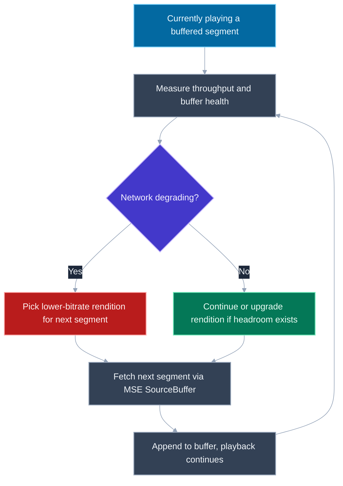
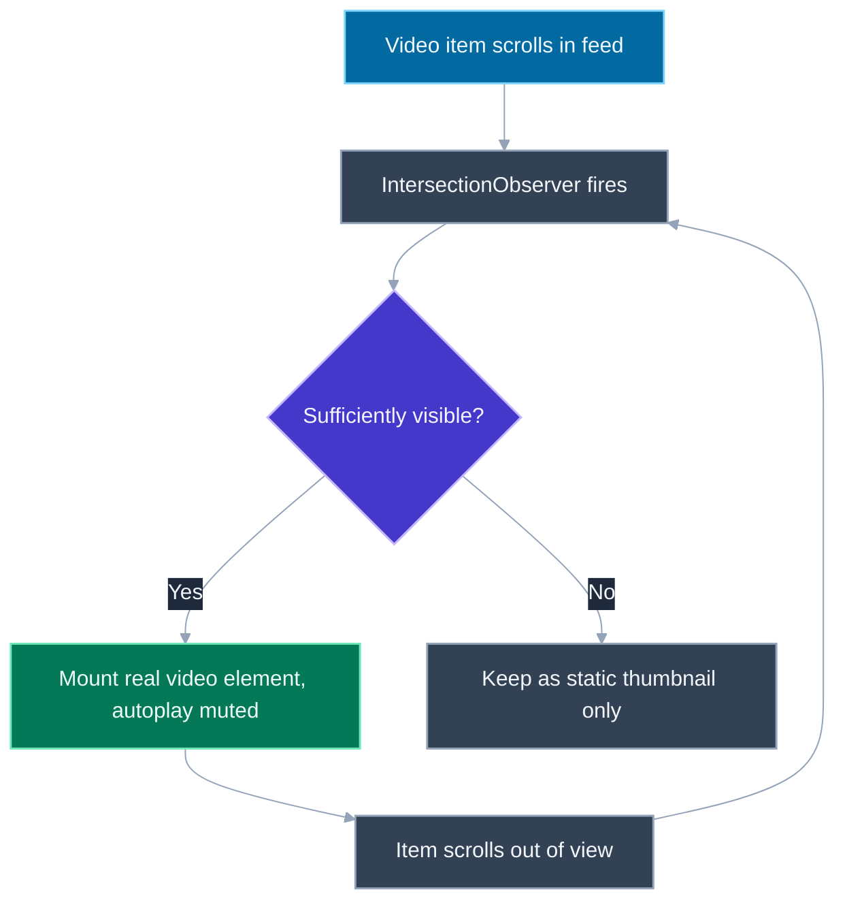

# Design a Video Streaming UI (YouTube-like)

## 🎯 Executive Summary

"Design a video streaming UI" sounds like a system design question about backend infrastructure — encoding pipelines, CDNs, storage tiers — but the frontend-focused version of this prompt is almost entirely about one thing: making a video that is being downloaded in pieces, over a connection of unknown and changing quality, feel like it's simply *playing*. Every technique in this topic exists to hide that the video isn't one file being streamed smoothly, but dozens of small segments being fetched, decoded, and stitched together in real time, sometimes at a different quality than the segment before it.

This is a must-know at Lead/Staff level because it's one of the few system design prompts where getting the mechanism wrong is easy to fake past in casual conversation but impossible to fake past a specific follow-up. Almost every candidate can say "it uses adaptive bitrate streaming so quality adjusts to your connection" — that sentence alone signals nothing. The Lead-level bar is explaining precisely *when* a quality switch can happen (only at a segment boundary, never mid-segment), *why* the browser can't just point a `<video>` tag at the manifest directly, and how a scrollable feed of dozens of videos avoids trying to buffer all of them at once.

This question surfaces as "design YouTube," "design TikTok's feed," or "design a video player for our product," and interviewers reliably drill into the player mechanics (ABR, buffering, seeking) as a deep-dive once the high-level shape is sketched, because that's where genuine depth versus memorized vocabulary becomes visible.

**Scope framing for this topic:** this is a *frontend player and UI* design — the adaptive playback logic, buffering UX, seeking, captions, and the scrollable video feed. Backend concerns (video encoding pipelines, transcoding into multiple renditions, CDN edge distribution) are real and worth naming briefly to show awareness, but are explicitly out of scope for the depth expected here; say so explicitly if an interviewer doesn't narrow it for you.

## 📖 What Is It? (Plain-English Definition)

**In plain terms:** a video streaming UI is a player that downloads a video in small chunks as it plays, instead of downloading the whole file first, and can change how much detail (quality) it downloads per chunk depending on how fast your connection currently is — all while looking, to the viewer, like a single continuous video.

Think of it like a chef plating a multi-course meal one course at a time, watching how quickly the table is eating: if the table is falling behind (a slow kitchen, or a slow network), the chef starts sending smaller, simpler portions to keep the meal moving without a gap between courses; if the table is comfortably ahead, the chef sends richer portions instead. The diner never sees an empty plate for long — they just sometimes get a plainer or fancier version of the same meal, and rarely notice which happened unless they're looking closely.

The everyday moment this explains is the one everyone's seen: a video that was crisp a minute ago suddenly looks soft for a stretch, then sharpens back up, with no pause in between. That's not a bug — it's the player deciding, between one small chunk and the next, that the network can no longer sustain the higher-quality version, downloading a lower-quality chunk instead to keep playback smooth, then upgrading again once conditions improve.

Here's the exact mechanism behind that — segments, renditions, and the algorithm that switches between them — along with what a scrollable feed of many such videos has to do differently from a single full-screen player.

---

## 🧠 Core Technical Deep Dive

### Requirements framing

Functionally: a user should be able to play, pause, seek, scrub through a video, read captions, and scroll through a feed where videos are one of many items on the page. Non-functionally, three things matter more than the functional list and drive every design decision below: **fast start** (low time from tap to first frame), **smooth playback** (no stalls/spinners during normal viewing), and **efficient resource use in a feed context** (not treating every visible video as if it's the only thing on the page).

> **Key takeaway:** the interesting non-functional requirements are fast start, no mid-playback stalls, and scaling gracefully when many videos are on screen at once — everything else in this topic is in service of one of those three.

### Adaptive Bitrate Streaming (ABR): the core mechanism

A video isn't stored or served as one file. During encoding (backend, out of scope here, but worth naming), the source video is split into small time-based **segments** — typically 2-10 seconds each — and each segment is encoded at *multiple renditions*: different resolution/bitrate combinations (e.g., 1080p at 5 Mbps, 720p at 2.5 Mbps, 480p at 1 Mbps, 240p at 0.4 Mbps). A **manifest** file (HLS's `.m3u8` or DASH's `.mpd`) lists every available rendition and the URL of every segment within each one, without containing any actual video data itself.

The player's ABR algorithm runs continuously during playback, monitoring two signals: **measured network throughput** (how fast recent segments actually downloaded) and **buffer health** (how many seconds of already-downloaded video are sitting ahead of the current playback position, ready to play). Based on those two signals, before requesting the *next* segment, the algorithm decides which rendition to request it from — the same segment index, just from a different quality tier.

**The detail that separates a real answer from a rehearsed one:** a rendition switch can only happen *at a segment boundary*, never mid-segment. Segments are independently decodable, self-contained chunks — a player can't splice from the middle of a 1080p segment into the middle of a 480p segment, because they're separately encoded byte streams with their own keyframes. So the actual behavior is: finish playing out whatever segment is already buffered, and make the quality decision for the *next* segment request based on current conditions. This is also why segment length is itself a trade-off — shorter segments (2s) let ABR react faster to changing conditions but add more request overhead and manifest complexity; longer segments (10s) are more efficient per-request but make the player slower to react to a network drop, since it's committed to whatever it already buffered.

```javascript
// Simplified ABR decision logic, run before requesting each next segment
function pickNextRendition(renditions, recentThroughputKbps, bufferSecondsAhead) {
  // Don't chase the absolute ceiling of measured throughput — leave headroom
  // so a brief network dip doesn't immediately force a stall.
  const safeBudgetKbps = recentThroughputKbps * 0.8;

  // Low buffer means "getting risky" — bias toward a safer (lower) rendition
  // regardless of throughput, since a stall is worse than a quality drop.
  if (bufferSecondsAhead < 5) {
    return renditions.filter(r => r.bitrateKbps <= safeBudgetKbps * 0.6)[0]
      ?? renditions[renditions.length - 1]; // lowest available as last resort
  }

  // Healthy buffer: pick the richest rendition the network can sustain.
  const affordable = renditions
    .filter(r => r.bitrateKbps <= safeBudgetKbps)
    .sort((a, b) => b.bitrateKbps - a.bitrateKbps);

  return affordable[0] ?? renditions[renditions.length - 1];
}
```

> **Key takeaway:** ABR switches renditions between segments, never within one, based on throughput and buffer health measured continuously — precision on this exact mechanism (not just the phrase "adaptive bitrate") is the specific thing a Lead-level answer is expected to have that a Senior answer often doesn't.

### Why you need a player library: `<video src="playlist.m3u8">` doesn't just work

A natural assumption is that pointing a native `<video>` element at an HLS or DASH manifest URL should "just work," since the browser already knows how to play video. It doesn't, for most browsers — **Safari is the one exception**, with native HLS support built into its `<video>` element. Chrome, Firefox, and Edge have no built-in ability to parse an `.m3u8`/`.mpd` manifest, fetch the right segments, or manage in-progress rendition switching.

This is what **Media Source Extensions (MSE)** exist to solve: an API that lets JavaScript programmatically feed a stream of downloaded, appended byte buffers into a `MediaSource` object attached to a `<video>` element, rather than the element fetching a single URL itself. A player library — **hls.js**, **dash.js**, or **Shaka Player** — is the code that parses the manifest, runs the ABR algorithm, downloads the right segment from the right rendition, and appends its bytes into the `MediaSource` buffer via `SourceBuffer.appendBuffer()`, all so the `<video>` element can keep playing what looks, from its perspective, like one continuous stream.

```javascript
// Roughly what a player library does under the hood (simplified)
const video = document.querySelector('video');
const mediaSource = new MediaSource();
video.src = URL.createObjectURL(mediaSource);

mediaSource.addEventListener('sourceopen', async () => {
  const sourceBuffer = mediaSource.addSourceBuffer('video/mp4; codecs="avc1.42E01E"');
  const manifest = await fetchAndParseManifest('/video/manifest.mpd');
  const nextSegmentUrl = pickSegmentUrl(manifest, currentSegmentIndex, chosenRendition);
  const segmentBytes = await fetch(nextSegmentUrl).then(r => r.arrayBuffer());
  sourceBuffer.appendBuffer(segmentBytes); // browser now has this chunk to play
});
```

> **Key takeaway:** name MSE specifically, not just "a JS library handles it" — the library's actual job is running ABR and manifest parsing, then pushing downloaded segment bytes into a `MediaSource`'s `SourceBuffer`, because the `<video>` element has no native ability to do any of that itself outside Safari's built-in HLS support.

### Buffering UX: hiding latency without lying to the user

**Pre-buffering** means the player always tries to keep some number of seconds of video downloaded ahead of the current playback position (commonly 10-30 seconds), so a brief network hiccup is absorbed from the buffer rather than immediately surfacing as a stall. The buffer-health signal from the ABR section above is exactly this quantity.

The UX decision that separates a polished player from a janky one is **when to show a loading spinner**. A spinner should appear only once the buffer is genuinely exhausted and playback has to pause and wait — not during a normal user-initiated seek, where a brief "still fetching the new position's segment" moment is expected and shouldn't be dressed up as an error-adjacent state. Showing a spinner on every seek trains users to associate normal scrubbing with something going wrong; reserving it for real stalls keeps it meaningful.

**Preloading the next likely video** — the next item in a feed, or the next episode in a series — reduces perceived start latency for the video the user hasn't tapped yet. This is a genuine trade-off: preloading uses bandwidth and battery for content that might never be watched, so it's usually scoped conservatively (e.g., preload only the manifest and first segment of the *next* feed item, not a full pre-buffer, and only on a fast/unmetered connection where detectable via the Network Information API).

> **Key takeaway:** a spinner belongs only on a genuine buffer-exhaustion stall, never on a normal seek; preloading the next likely video trades bandwidth for perceived latency and should be scoped narrowly, not applied blindly to everything adjacent.

### Seeking: why scrubbing to a random timestamp is fast

Seeking to an arbitrary timestamp doesn't require scanning through the whole video from the start — the manifest indexes every segment's start/end timestamp, so the player does a direct lookup (segment N covers 40-50 seconds, so a seek to 0:44 fetches segment N specifically) rather than a linear scan through prior segments. This indexed lookup is what makes seeking in a multi-hour video roughly as fast as seeking in a two-minute one.

**Thumbnail-preview scrubbing** — the row of small preview images that appears as you drag the seek bar — is a separate system entirely from the video segments themselves. It's backed by a pre-generated **sprite sheet** (a single image tiling many small thumbnails at fixed time intervals) plus a small index (VTT-like cue list) mapping timestamp ranges to a specific tile's coordinates within the sprite. The player fetches this sprite independently of any video segment, and looks up the right tile by timestamp as the user drags — it is never derived from decoding the actual video segments on the fly, which would be far too slow for a smooth drag interaction.

```javascript
// Given a hover/drag timestamp, find which sprite tile to show
function getThumbnailTile(spriteIndex, timestampSeconds) {
  const entry = spriteIndex.find(
    e => timestampSeconds >= e.startTime && timestampSeconds < e.endTime
  );
  if (!entry) return null;
  // entry: { spriteUrl, x, y, width, height } — a crop of the sprite sheet
  return entry;
}
```

> **Key takeaway:** seeking is an indexed segment lookup by timestamp, not a linear scan; scrubbing thumbnails come from a separately fetched sprite sheet, not from decoding video on the fly — conflating the two is a common shallow-answer mistake.

### Feed rendering: not every video on screen should actually be playing

A scrollable feed of videos (a homepage grid, a TikTok-style vertical feed) introduces a resource-management problem entirely separate from single-player playback: naively mounting a real `<video>` element (each with its own decoder, buffer, and potentially its own player-library instance) for every item in a long list is expensive in memory and CPU, and multiplies network usage if more than one starts buffering at once.

The standard approach layers three techniques:

1. **Lazy-loading** thumbnails and video elements as items scroll near the viewport, rather than mounting the entire feed's media eagerly on initial render.
2. **`IntersectionObserver`** (see [Web APIs & Observers](/topic-detail.html?id=web-apis-advanced)) to detect when an item crosses a visibility threshold, driving autoplay/pause purely off of scroll position rather than a scroll-event listener with manual geometry math.
3. **Mounting only the item currently in or near view as a real `<video>` element**, and rendering every other item as a static poster-frame thumbnail image — swapping a thumbnail out for a live video element only once it's the (or nearly the) active item, and swapping back to a static thumbnail once it scrolls back out of view.

```javascript
const observer = new IntersectionObserver((entries) => {
  entries.forEach((entry) => {
    const feedItem = entry.target;
    if (entry.isIntersecting && entry.intersectionRatio > 0.75) {
      mountVideoElement(feedItem); // swap thumbnail -> real <video>, autoplay muted
    } else {
      unmountVideoElement(feedItem); // swap back to a static poster thumbnail
    }
  });
}, { threshold: [0, 0.75] });

document.querySelectorAll('.feed-item').forEach(item => observer.observe(item));
```

> **Key takeaway:** in a feed context, the win isn't optimizing the player — it's not instantiating a player at all for items the user isn't currently looking at, using `IntersectionObserver` to swap a real `<video>` in and out based purely on viewport visibility.

### Accessibility: captions and keyboard-operable controls

Captions belong in the DOM as a `<track kind="captions" src="captions.vtt" srclang="en" label="English">` child of the `<video>` element, using the WebVTT format — this makes captions a first-class, user-toggleable feature exposed to assistive technology and the browser's own UI, rather than captions burned into the video pixels (which can't be toggled, translated, or read by a screen reader) or captions rendered as an unlabeled overlay `<div>`.

If the player uses **custom controls** instead of the browser's native ones (common, for consistent cross-browser styling), every control — play/pause, seek bar, volume, captions toggle, fullscreen — needs to be a real, keyboard-focusable element with the correct ARIA role and label, and standard keyboard shortcuts (space to play/pause, arrow keys to seek/adjust volume) need to be wired up explicitly, since none of that comes for free once the native `<video controls>` UI is hidden.

> **Key takeaway:** captions via a real `<track>` element (not burned-in text) and fully keyboard-operable custom controls are both non-negotiable the moment you replace native video controls with a custom-styled UI.

---

## 📊 Visual Architecture & Logic

### Diagram 1 — The ABR decision loop



### Diagram 2 — Feed visibility mounting flow



## 🏢 Interview Context & FAANG Signals

| Interview Stage | Format |
|---|---|
| Frontend System Design round | "Design YouTube/TikTok/a video player" — standalone 45-60min prompt, or a deep-dive within a larger media-product design |
| Coding round | Implement `IntersectionObserver`-driven feed mounting, or a simplified ABR rendition-picking function |
| Deep-dive follow-up | Interviewer asks specifically "when exactly can quality change" or "why doesn't `<video src="...m3u8">` just work" to probe for memorized vs. real understanding |

**Lead signals interviewers listen for:**

1. Explaining that rendition switches happen only at segment boundaries, never mid-segment, and naming the two signals (throughput, buffer health) that drive the decision.
2. Naming Media Source Extensions specifically as the mechanism a player library uses, and knowing Safari's native HLS support is the one browser exception.
3. Distinguishing a genuine-stall spinner from a normal seek-triggered wait, rather than treating all loading states identically.
4. Knowing that thumbnail-scrubbing previews come from a separate sprite sheet, not from decoding video segments on the fly.
5. Proposing viewport-based mount/unmount of real `<video>` elements in a feed, rather than assuming every visible item can safely be a live player.

## ⚔️ Lead Level vs Senior Level

**Question: "A user is watching a video and their WiFi briefly drops in quality. Walk me through what happens on the frontend."**

> **Senior Response:** "The player uses adaptive bitrate streaming, so it'll detect the slower connection and switch to a lower quality automatically to avoid buffering. Once the connection improves, it'll go back up to a higher quality."

> **Staff/Lead Response:** "The player is continuously measuring recent segment download throughput and how many seconds of buffer it's sitting on. It doesn't change anything about the segment currently playing — that's already downloaded and decoding. The decision only happens right before requesting the *next* segment: if throughput has dropped and buffer health is getting thin, it requests that next segment from a lower-bitrate rendition instead, using the same segment index, just a different quality tier from the manifest. If the buffer's still healthy despite the dip, it might not switch at all yet — it's biased toward avoiding a stall over avoiding a quality drop. None of this is visible as an error state to the user; there's no spinner unless the buffer actually runs out before a new segment arrives, which is a separate, worse case than a quality step-down."

What separates them: the Senior answer names the right vocabulary and the right outcome; the Lead answer explains the actual decision boundary (segment-boundary-only switching, driven by two specific measured signals) and correctly separates a quality adjustment from an actual stall.

## ⚠️ Common Pitfalls & Anti-Patterns

> ### ✕ Assuming `<video src="playlist.m3u8">` works in all browsers
> **Why it's wrong:** Outside Safari's native HLS support, browsers have no built-in ability to parse an HLS/DASH manifest or fetch/switch segments — pointing `<video>` directly at a manifest URL silently fails or does nothing in Chrome/Firefox/Edge.
> **✓ Correct Lead Approach:** Use a player library (hls.js, dash.js, Shaka Player) built on Media Source Extensions, which parses the manifest, runs ABR, and feeds downloaded segment bytes into the video element's buffer programmatically.

---

> ### ✕ Believing quality can switch mid-segment
> **Why it's wrong:** Segments are independently encoded, self-contained chunks with their own keyframes — a player cannot splice from one rendition's segment into a different rendition's segment partway through; this misunderstanding leads to describing ABR as smoother and more granular than it actually is.
> **✓ Correct Lead Approach:** State explicitly that a rendition decision is made once per segment, before that segment's request, based on throughput and buffer health measured up to that point.

---

> ### ✕ Showing a loading spinner on every seek
> **Why it's wrong:** A brief fetch delay after a user-initiated seek is normal and expected, not an error condition — treating it identically to a genuine playback stall trains users to see routine scrubbing as something going wrong, and cheapens the spinner's meaning when a real stall happens.
> **✓ Correct Lead Approach:** Reserve the loading/stall indicator for genuine buffer exhaustion during normal playback; a seek's brief wait can use a lighter, less alarming affordance or none at all.

---

> ### ✕ Mounting a real `<video>` element for every item in a long feed
> **Why it's wrong:** Each mounted video element carries its own decoder, buffer, and potentially its own player-library instance — dozens mounted at once is expensive in memory/CPU and risks multiple simultaneous buffering streams competing for bandwidth.
> **✓ Correct Lead Approach:** Use `IntersectionObserver` to mount a real video element only for the item currently in or near view, rendering every other feed item as a static poster thumbnail.

---

> ### ✕ Generating scrub-thumbnail previews by decoding video on the fly
> **Why it's wrong:** Decoding arbitrary video frames in response to a fast drag-scrub interaction is far too slow to feel responsive, and isn't how any production player implements this feature.
> **✓ Correct Lead Approach:** Pre-generate a sprite sheet of thumbnails at fixed intervals during encoding, fetched and indexed by timestamp independently of the video segments themselves.

## 🛠️ Practice Scenarios

### Scenario 1: Diagnosing a "quality never recovers" bug

**Problem:**
```javascript
// Bug report: once a user's connection dips even briefly, video
// quality stays low for the rest of playback, even after their
// connection is clearly back to normal.
function pickNextRendition(renditions, recentThroughputKbps, bufferSecondsAhead) {
  if (recentThroughputKbps < renditions[0].bitrateKbps) {
    return renditions[renditions.length - 1]; // drop to lowest rendition
  }
  return renditions[0]; // otherwise always request the highest
}
```

Why would quality get "stuck" low, and how would you fix the decision logic?

<details>
<summary>Staff-Level Solution</summary>

The function only measures throughput at the instant of the dip and never re-evaluates whether conditions have improved in a way that would justify upgrading again — worse, `recentThroughputKbps` here appears to be a single stale sample rather than a rolling measurement, so if it was computed once during the dip and never refreshed, every subsequent segment request re-uses that same stale, low value and keeps selecting the lowest rendition forever.

The fix is twofold: recompute `recentThroughputKbps` from a rolling window of the most recent segment downloads (not a one-time sample), and make the rendition decision a genuine two-way comparison against buffer health, not a one-way "drop and never reconsider" branch:

```javascript
function pickNextRendition(renditions, recentThroughputKbps, bufferSecondsAhead) {
  const safeBudgetKbps = recentThroughputKbps * 0.8; // headroom, recomputed each call

  if (bufferSecondsAhead < 5) {
    return renditions.filter(r => r.bitrateKbps <= safeBudgetKbps * 0.6)[0]
      ?? renditions[renditions.length - 1];
  }

  const affordable = renditions
    .filter(r => r.bitrateKbps <= safeBudgetKbps)
    .sort((a, b) => b.bitrateKbps - a.bitrateKbps);

  return affordable[0] ?? renditions[renditions.length - 1]; // upgrades once affordable again
}
```

The key correction: `recentThroughputKbps` has to be a live, continuously-updated measurement (e.g., from the last N segment download times), and the decision has to be re-run before *every* segment request — never a one-shot "downgrade and stop checking" branch, which is what produces a quality level that never recovers.
</details>

### Scenario 2: A feed that stutters on fast scrolling

**Problem:**
```javascript
// Feed implementation: every item gets a real <video> element on
// initial render, and JS toggles .play()/.pause() based on a
// manual scroll-position calculation on every scroll event.
window.addEventListener('scroll', () => {
  document.querySelectorAll('video').forEach((video) => {
    const rect = video.getBoundingClientRect();
    const isVisible = rect.top >= 0 && rect.top < window.innerHeight;
    isVisible ? video.play() : video.pause();
  });
});
```

Users on mid-range phones report the feed stutters badly while scrolling quickly. Diagnose and redesign.

<details>
<summary>Staff-Level Solution</summary>

Two compounding problems: first, every feed item already has a real, decoded `<video>` element mounted from initial render regardless of visibility, so a feed of even 20-30 items means 20-30 live decoders/buffers sitting in memory, most never visible. Second, the visibility check runs `getBoundingClientRect()` for every video on *every* scroll event, which fires at high frequency during a fast scroll and forces synchronous layout recalculation on each call — a classic layout thrashing pattern that gets worse exactly when scrolling is fastest.

The redesign addresses both: render every feed item as a lightweight static thumbnail image by default, and use `IntersectionObserver` (which is layout-thrash-free — the browser computes intersection asynchronously, off the main scroll-event path) to decide when to swap a thumbnail for a real, mounted video element:

```javascript
const observer = new IntersectionObserver((entries) => {
  entries.forEach((entry) => {
    if (entry.isIntersecting && entry.intersectionRatio > 0.75) {
      mountVideoElement(entry.target); // create <video>, attach player, autoplay muted
    } else {
      unmountVideoElement(entry.target); // destroy <video>/player instance, show thumbnail
    }
  });
}, { threshold: [0, 0.75] });

document.querySelectorAll('.feed-item').forEach(item => observer.observe(item));
```

This eliminates both the per-scroll-event layout cost (`IntersectionObserver` doesn't run on the main thread per scroll tick) and the standing memory/decoder cost of dozens of simultaneously-mounted video elements — only the item actually in view carries that cost at any given time.
</details>

### Scenario 3: Justifying a segment-length trade-off

**Problem:**
```javascript
// Two encoding configs under consideration for a new live-adjacent
// product surface (highlight clips, 15-90 seconds each):
const configA = { segmentLengthSeconds: 2 };
const configB = { segmentLengthSeconds: 10 };
```

The team wants "whichever one makes quality switches smoother." Which would you pick, and what are you trading away?

<details>
<summary>Staff-Level Solution</summary>

Shorter segments (config A, 2s) let the ABR algorithm react to a changing network roughly every 2 seconds instead of every 10, which is exactly what "smoother switches" is asking for — a network dip is absorbed within a couple seconds of exposure at the wrong quality, rather than being locked into a bad decision for up to 10 seconds. For short-form clips (15-90 seconds total), this responsiveness matters proportionally more, since a single bad 10-second segment could be a meaningful fraction of the whole clip's runtime.

What's being traded away: shorter segments mean more total requests and more manifest entries per clip, which adds a small amount of per-request overhead (connection reuse mitigates most of this over HTTP/2, but it's not free) and a marginally larger manifest to parse and hold in memory. For a 90-second clip, 2s segments mean ~45 segments versus ~9 at 10s — still a trivial count either way, which is exactly why the trade favors responsiveness here: the overhead cost stays negligible at this content length, while the responsiveness benefit is proportionally larger than it would be for, say, a two-hour film.

I'd pick config A for this specific product surface, but name explicitly that the same choice wouldn't automatically hold for long-form content, where segment-count overhead starts to matter more and a single 10-second quality dip is proportionally far less noticeable in a two-hour runtime.
</details>
