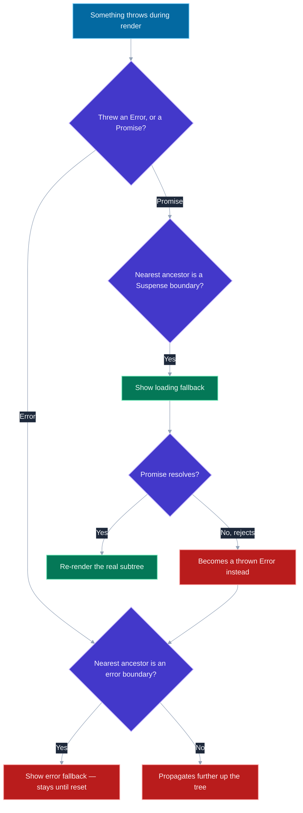
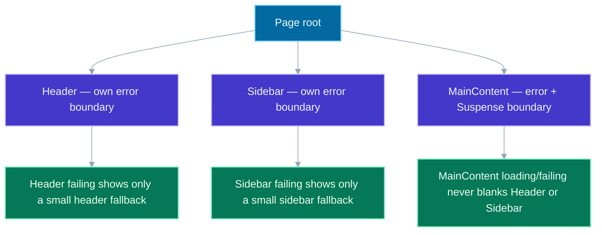

# Error Boundaries and Suspense Boundaries

## 🎯 Executive Summary

Both mechanisms answer the same underlying question — "part of this tree isn't in a normal, renderable state right now; what should the user see instead?" — for two different reasons: an error boundary answers it for a component that *threw*, a Suspense boundary answers it for a component that isn't *ready yet*. They're easy to conflate because they look similar in code (both wrap a subtree, both render a fallback), and easy to underuse because the natural instinct is to put one of each at the app root and call it done — which is exactly the setup that turns one slow API call or one broken widget into a blank page for the entire application.

This is a must-know topic at Lead level because boundary *placement* is an architectural decision about blast radius, not a syntax detail: where you put boundaries determines whether a single failing or slow-loading section takes down a full page or is contained to just itself. It's also one of the few places in React where the underlying mechanism (a component throwing a *Promise*, not an Error, during render, for Suspense to catch) is genuinely worth knowing precisely, because it explains behavior — streaming SSR, why a fallback shows for an entire boundary on any nested suspend — that otherwise looks like unexplainable magic.

## 📖 What Is It? (Plain-English Definition)

**In plain terms:** an error boundary is a component that says "if anything in here throws while rendering, show this fallback UI instead of letting the whole app crash." A Suspense boundary says "if anything in here isn't ready to render yet — like data that's still loading — show this loading UI instead, and swap it out automatically the moment it's ready."

Without either, a single component throwing during render — or a single slow data fetch — would, by default, unmount everything up to the nearest one of these boundaries (or crash the entire app, if there is none at all). Both mechanisms exist specifically to contain that damage to a deliberately-chosen part of the tree, instead of letting one broken or slow piece take the whole page down with it.

They're independent, complementary tools, not two flavors of the same idea: Suspense handles the "still loading" state, an error boundary handles the "failed" state, and the standard pattern is pairing one of each around the same subtree so both outcomes are handled — loading and failure — rather than picking one and hoping the other doesn't happen.

---

## 🧠 Core Technical Deep Dive

### Error boundaries: class-only, and a specific set of blind spots

An error boundary must be a class component — there is still no hook equivalent as of React 18/19, because the two lifecycle methods it needs (`static getDerivedStateFromError` for the fallback state, `componentDidCatch` for side effects like logging) have no functional-component counterpart:

```javascript
class ErrorBoundary extends React.Component {
  state = { hasError: false };

  static getDerivedStateFromError(error) {
    return { hasError: true };
  }

  componentDidCatch(error, info) {
    logErrorToService(error, info.componentStack); // React's own component tree stack, not just the JS stack
  }

  render() {
    if (this.state.hasError) return this.props.fallback;
    return this.props.children;
  }
}
```

**What it catches:** errors thrown during rendering, in lifecycle methods, and in constructors of the tree *below* it. **What it explicitly does not catch** — a genuinely common interview trap: errors inside event handlers (a click handler throwing needs a regular `try/catch`, since it isn't part of React's render cycle at all), errors in asynchronous code not surfaced during render (a raw rejected Promise in a `setTimeout`), and — the one that catches people off guard — **an error boundary cannot catch an error thrown by itself**; that error propagates to the *next* ancestor boundary up the tree, which is exactly why real apps need more than one boundary at different depths rather than relying on a single one to catch everything beneath it, including itself.

### Suspense: the actual mechanism is "throw a Promise"

This is the fact that makes everything else about Suspense make sense: a component "suspends" by throwing a *Promise* during render (not an Error), and React's Suspense boundary catches that thrown promise specifically, shows its `fallback` in place of the subtree, and re-attempts rendering once the promise resolves:

```javascript
<Suspense fallback={<Spinner />}>
  <ProfileDetails /> {/* suspends internally by throwing a pending Promise while data loads */}
</Suspense>
```

`React.lazy(() => import('./Chart'))` is the original, simplest case of this: the dynamic `import()` returns a Promise, and the lazily-loaded component throws it during render until the module finishes downloading. Data-fetching integrations (Relay, frameworks built on React 19's `use()`, Next.js's App Router Server Components) generalize the exact same throw-a-pending-promise mechanism to "this data isn't back from the server yet" — which is *why* Suspense for data fetching didn't require a new React primitive to add; it's the same mechanism `React.lazy` already used, applied to a different kind of "not ready yet."

### Placement is a blast-radius decision, for both

```jsx
// One boundary at the top: any single failure/slow load blanks the whole page
<ErrorBoundary fallback={<PageError />}>
  <Suspense fallback={<PageSpinner />}>
    <Header /><Sidebar /><MainContent />
  </Suspense>
</ErrorBoundary>

// Granular boundaries: each section fails/loads independently
<ErrorBoundary fallback={<HeaderError />}><Header /></ErrorBoundary>
<ErrorBoundary fallback={<SidebarError />}><Sidebar /></ErrorBoundary>
<ErrorBoundary fallback={<MainError />}>
  <Suspense fallback={<MainSpinner />}><MainContent /></Suspense>
</ErrorBoundary>
```

The mechanical detail that makes this more than a style preference: **a Suspense boundary's fallback replaces its *entire* subtree the instant *anything* inside it suspends** — a single slow-loading widget inside an otherwise-ready page-wide boundary blanks the entire page back to its loading state, not just that one widget. The fix is always granular boundaries around genuinely independent sections — the same "isolate what changes from what doesn't" principle already established around memoization and re-renders elsewhere in this topic set, applied here to loading and failure states instead of render performance.

### Why streaming SSR needed this

React 18's streaming server rendering sends HTML for the parts of a page that are ready immediately, and streams in the slower, Suspense-wrapped parts afterward as their data resolves — instead of blocking the entire server response on the single slowest data dependency the page has. This is the concrete mechanical reason granular Suspense boundaries matter even outside a "spinner" framing: on the server, the boundary you draw is literally the unit of what can be sent early versus what has to wait.

### Resetting an error boundary

An error boundary's `hasError` state does not clear itself once the underlying cause is fixed — a `componentDidCatch`'d error stays caught until something explicitly resets that boundary's state. The `react-error-boundary` library's common pattern exposes a `resetKeys` prop (reset when a given dependency array changes, mirroring `useEffect`'s dependency semantics) or a manual `resetErrorBoundary()` call wired to a "Try again" button — without one of these, a transient error (a flaky network request) permanently wedges that section in its fallback state until a full page reload.

---

## 📊 Visual Architecture & Logic

### Diagram 1: What Gets Thrown, and Who Catches It



### Diagram 2: Blast-Radius Placement in a Real Page



---

## 🏢 Interview Context & FAANG Signals

| Interview Stage | Format |
|---|---|
| **Coding Round** | Implement an error boundary from scratch, or wire up Suspense around a lazy-loaded/data-fetching component |
| **System Design** | Designing failure/loading isolation for a page with several independent, third-party, or slow-loading widgets |
| **Debugging Round** | "This error boundary isn't catching an error I expected it to" — usually an event-handler or async-code case |

**Lead signals interviewers listen for:**

1. **Correctly listing what error boundaries don't catch** — event handlers, async code outside render, and their own errors — not just what they do catch.
2. **Explaining Suspense as "throw a Promise," not "a built-in spinner feature"** — the mechanism, not just the visible behavior.
3. **Treating boundary placement as a blast-radius decision**, with a specific example of granular vs. page-wide boundaries.
4. **Knowing an error boundary needs an explicit reset mechanism**, rather than assuming it clears itself.
5. **Pairing Suspense and error boundaries deliberately** around the same subtree, rather than treating them as alternatives to choose between.

## ⚔️ Lead Level vs Senior Level

**Question:** "A third-party widget embedded in our dashboard occasionally throws, and it currently takes down the entire dashboard. How do you fix it?"

**Senior Response:**
> Wrap the whole dashboard in an error boundary so it doesn't crash.

Stops the full crash, but a single boundary around everything means the *entire* dashboard still disappears behind one fallback whenever that one widget fails — the blast radius is only slightly smaller than before.

---

**Staff/Lead Response:**
> I'd put a dedicated error boundary around just that third-party widget, not the whole dashboard — so when it throws, the rest of the dashboard keeps working and only that one card shows a fallback. I'd also add `componentDidCatch` logging scoped to that boundary specifically, since third-party embed failures are exactly the kind of thing we want paged on separately from our own code failing.
>
> If this widget also fetches its own data asynchronously, I'd pair that boundary with its own Suspense boundary too, so a slow load from their side shows a small, local loading state instead of blocking anything else on the page.

The Lead answer treats placement as the actual fix, not just "add a boundary somewhere," and separates this specific failure domain for monitoring purposes too.

## ⚠️ Common Pitfalls & Anti-Patterns

> ### ✕ One Error Boundary at the App Root, and Nowhere Else
> **Why it's wrong:** Any single component failing anywhere in the app replaces the *entire* application with one generic fallback — the blast radius is maximal by construction.
> **✓ Correct Lead Approach:** Add boundaries around independent, meaningful sections (a route, a widget, a third-party embed) in addition to one root-level boundary as a last resort.

---

> ### ✕ Expecting an Error Boundary to Catch an Event Handler's Throw
> **Why it's wrong:** Event handlers run outside React's render cycle entirely; an error boundary only catches errors during rendering, lifecycle methods, and constructors.
> **✓ Correct Lead Approach:** Wrap event handler logic in a regular `try/catch`, and handle/report the error explicitly there.

---

> ### ✕ One Giant Suspense Boundary Around an Entire Page
> **Why it's wrong:** Any single suspended child blanks the fallback for the *whole* boundary — one slow widget makes the entire page revert to a loading state, even though everything else was ready.
> **✓ Correct Lead Approach:** Place Suspense boundaries around independently-loading sections, so a slow section's loading state stays local to it.

---

> ### ✕ No Reset Mechanism on an Error Boundary
> **Why it's wrong:** Once caught, the boundary's error state persists indefinitely — a transient failure (a flaky request) permanently wedges that section until a full page reload, even after the underlying cause resolves.
> **✓ Correct Lead Approach:** Provide an explicit reset path — a "try again" action calling `resetErrorBoundary()`, or a `resetKeys` array tied to whatever should trigger a fresh attempt (e.g., a changed route param).

---

> ### ✕ Treating Suspense and Error Boundaries as Interchangeable
> **Why it's wrong:** They handle two different, non-overlapping situations — loading and failure — and using only one leaves the other case completely unhandled (an unresolved fetch with no error boundary can still throw an uncaught rejection past the render cycle; a Suspense boundary with no paired error boundary has no fallback at all if the data fetch fails).
> **✓ Correct Lead Approach:** Pair them deliberately around the same subtree so both outcomes — not ready yet, and failed — have an explicit, intentional UI.

## 🛠️ Practice Scenarios

### Scenario 1: The Silent Crash

**Problem:** A button's `onClick` handler throws, and the app crashes with an uncaught error in the console — despite an error boundary wrapping the whole page. Explain why the boundary didn't help, and fix it.

<details>
<summary>Staff-Level Solution</summary>

**Root cause:** error boundaries only catch errors during rendering, lifecycle methods, and constructors — an event handler runs later, outside that cycle entirely, so the boundary was never in a position to catch it in the first place.

**Fix:**
```javascript
function handleClick() {
  try {
    riskyOperation();
  } catch (error) {
    reportError(error);
    setLocalErrorState(true); // drive a local fallback UI via regular state, not a boundary
  }
}
```

**Lead framing:** "This is one of the most common misconceptions about error boundaries — they protect the render tree, not arbitrary code. Anything running outside render needs its own explicit error handling; a boundary sitting above it changes nothing."

</details>

---

### Scenario 2: Designing Boundaries for a Product Page

**Problem:** A product page has: a header/nav, a main product details section (fetches data), a reviews section (fetches data separately, often slower), and a "related products" carousel from a different, occasionally-flaky internal service. Design the boundary placement.

<details>
<summary>Staff-Level Solution</summary>

- **Header/nav:** its own lightweight error boundary — should basically never fail, but if it does, the rest of the page should stay usable.
- **Product details:** error boundary + Suspense boundary together, since it's the primary content — a failure here probably does warrant a full-page-ish fallback, but the loading state should be local to it, not blocking header/nav.
- **Reviews:** its own error + Suspense boundary, separate from product details — reviews loading slower than the product info shouldn't hold the whole product section in a loading state.
- **Related products carousel:** its own error boundary specifically because it's sourced from a separate, known-flaky service — the correct fallback here is probably "hide the carousel entirely" rather than a visible error message, since it's a secondary, non-essential section.

**Lead framing:** "The placement follows directly from which sections are independent and which failures are 'this page is broken' versus 'this one secondary section is unavailable, no big deal.' A single boundary can't express that difference — several, deliberately placed, can."

</details>
