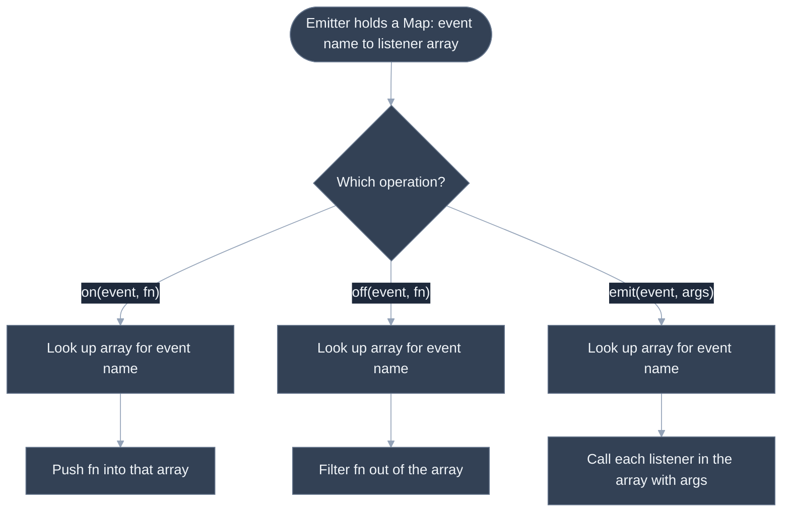
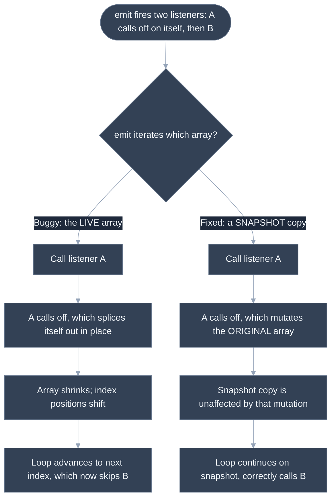

# Build Event Emitter From Scratch

## 🎯 Executive Summary

The event emitter (pub/sub) pattern is one of the most-reused primitives in frontend and Node.js engineering — Node's built-in `EventEmitter`, every DOM element's `addEventListener`, and the internal subscription mechanism inside most state-management libraries all boil down to the same three operations: subscribe, unsubscribe, and notify. Asking a candidate to build one from scratch isn't testing whether they know a library API; it's testing whether they can correctly manage a mutable collection of callbacks that can itself change *while it's being iterated* — which is exactly the scenario that breaks naive implementations in ways that are easy to miss in a quick manual test.

It's must-know at Lead level because this pattern is the load-bearing mechanism underneath a huge amount of frontend architecture: component communication in non-React contexts, decoupling a data layer from its consumers, and the selector-subscription model that libraries like Zustand and Redux build their reactivity on top of. A Lead who understands the mutate-during-iteration failure mode at the emitter level immediately recognizes the same shape of bug anywhere else a live collection is iterated while being modified — cache invalidation loops, DOM NodeList iteration while removing nodes, and so on.

It typically surfaces as a 20-30 minute live-coding round: implement `on`/`off`/`emit`, then `once`, then — often as the pivotal follow-up — "here's a subtle bug in a real implementation, find and fix it," which is specifically designed to see whether the candidate reasons correctly about iteration semantics under mutation rather than just pattern-matching on "add to array, loop over array, remove from array."

---

## 📖 What Is It? (Plain-English Definition)

**In plain terms:** an event emitter is an object that lets one part of your code say "let me know when X happens" (subscribe) and a completely different part of your code say "X just happened" (announce) — without either part needing to know anything about the other.

The everyday analogy is a subscription mailing list: a newsletter doesn't know who its subscribers are individually or what they'll do with each issue — it just maintains a list of subscribers and, when a new issue goes out, sends it to everyone currently on the list. Subscribing means adding your address to the list; unsubscribing means removing it; publishing an issue means walking the current list and delivering to everyone on it *at that moment*.

This decoupling is the entire point: the publisher (the thing calling `emit`) never needs a reference to its subscribers, and subscribers never need a reference to each other — they only ever interact through the shared emitter. This is precisely the mechanism Node's `EventEmitter` and DOM events (`addEventListener`/`dispatchEvent`) implement, and it's the same subscription model that selector-based state libraries like Zustand build internally — a store's `setState` is, underneath, walking a list of subscribed listener functions and calling each one, which is covered from the state-management angle in [Context API Alternatives](/topic-detail.html?id=context-api-alternatives).

---

## 🧠 Core Technical Deep Dive

### Pattern Recognition — How to Spot This Category of Problem

The tell for "this wants a pub/sub implementation" is a requirement built around **decoupled producers and consumers**, phrased as "subscribe to X and get notified later" rather than "call this function directly." Concretely:

- The problem describes registering a callback now, for something that will happen an unknown number of times, at an unknown point in the future ("notify me whenever an order is placed," "run this function every time the value changes").
- There's an explicit need to *stop* listening later, independent of the code that originally subscribed — implying some ongoing registry of active listeners must exist somewhere, rather than a single ad-hoc callback passed once.
- Multiple independent listeners need to react to the same occurrence without knowing about each other.

This is the exact mechanism underneath DOM events, Node's `EventEmitter`, and — one level removed — the subscription list inside libraries like Zustand, where calling a store's setter function is really "iterate the list of subscribed selectors and re-run the ones whose slice of state changed." Recognizing "this is pub/sub" quickly means recognizing that the actual data structure underneath almost every variant is the same: a map from event/topic name to an array of listener functions.

### The Core Data Structure

```javascript
class EventEmitter {
  constructor() {
    this.listeners = new Map(); // event name -> array of listener functions
  }

  on(event, listener) {
    if (!this.listeners.has(event)) {
      this.listeners.set(event, []);
    }
    this.listeners.get(event).push(listener);
    return this;
  }

  off(event, listener) {
    const eventListeners = this.listeners.get(event);
    if (!eventListeners) return this;
    this.listeners.set(event, eventListeners.filter((fn) => fn !== listener));
    return this;
  }

  emit(event, ...args) {
    const eventListeners = this.listeners.get(event);
    if (!eventListeners || eventListeners.length === 0) return false;
    for (const listener of eventListeners) {
      listener.apply(this, args);
    }
    return true;
  }
}
```

Note that `on` deliberately does **not** deduplicate — subscribing the same function twice results in it being called twice per `emit`, which matches real Node.js `EventEmitter` behavior. This is a design decision worth stating explicitly rather than leaving implicit.

### The Mutate-During-Iteration Trap

The implementation above sidesteps a classic bug by having `off` build a *new* filtered array (via `.filter()`) rather than mutating the existing one in place. A more naive `off` implementation that uses `indexOf` + `splice` mutates the *same* array object that `emit` might currently be looping over — and if a listener calls `off` (on itself or another listener) as part of its own execution during `emit`, that in-place mutation shifts every subsequent element's index down by one, causing `emit`'s loop to skip whatever listener now occupies the index the loop is about to visit. This is a well-known, easy-to-miss gotcha covered in full in Problem 3 below.

### Adding `once`

`once` is implemented as a thin wrapper around `on`: the wrapper unsubscribes itself the moment it's invoked, then delegates to the original listener. To let a caller later call `off(event, originalListener)` and have it correctly remove the still-pending wrapper (even though the caller never sees the wrapper itself), the wrapper needs to expose which original listener it wraps, and `off` needs to check for that:

```javascript
once(event, listener) {
  const wrapped = (...args) => {
    this.off(event, wrapped);
    listener.apply(this, args);
  };
  wrapped.originalListener = listener;
  this.on(event, wrapped);
  return this;
}
```

---

## 📊 Visual Architecture & Logic

### Diagram 1: on / off / emit Data Structure



### Diagram 2: Mutate-During-Iteration Bug vs. Snapshot Fix



---

## 🏢 Interview Context & FAANG Signals

| Interview Stage | Format |
|---|---|
| **Phone Screen** | "Implement a basic pub/sub class" as a cold 20-30 minute warm-up |
| **Technical Round** | Implement `on`/`off`/`emit`/`once`, then a live "find the bug" follow-up |
| **System Design** | "How would a state library notify subscribed components of a change?" as a sub-question |

**Lead signals interviewers listen for:**

1. **Choosing a sensible core data structure unprompted** — a `Map` (or plain object) from event name to an array of listeners, rather than something that doesn't scale to multiple event names.
2. **Stating the no-dedupe convention explicitly** — deciding and saying out loud whether subscribing the same function twice should fire it twice, rather than leaving the behavior to be discovered by accident.
3. **Correct `this` handling** — calling listeners with `listener.apply(this, args)` (or an explicitly documented alternative) rather than an ambiguous, undocumented `this` inside listeners.
4. **Recognizing the mutate-during-iteration risk unprompted**, or at minimum immediately once shown a `splice`-based `off` alongside a live-array `emit` loop.
5. **Complexity discussion** — stating that `emit` is O(k) in the number of listeners for that event, and that `off` is O(k) as well (since some form of scan/filter is required to find and remove the matching entry), without being asked.

---

## ⚔️ Lead Level vs Senior Level

**Question:** "Implement an event emitter with `on`, `off`, and `emit`."

> **Senior Response:**
> ```javascript
> class EventEmitter {
>   constructor() {
>     this.events = {};
>   }
>   on(event, listener) {
>     (this.events[event] = this.events[event] || []).push(listener);
>   }
>   off(event, listener) {
>     const arr = this.events[event];
>     if (arr) {
>       const i = arr.indexOf(listener);
>       if (i > -1) arr.splice(i, 1);
>     }
>   }
>   emit(event, ...args) {
>     (this.events[event] || []).forEach((fn) => fn(...args));
>   }
> }
> ```
> This subscribes, unsubscribes, and notifies listeners for named events.

Correct for the straightforward case, but `off`'s in-place `splice` mutates the same array `emit`'s `forEach` is actively iterating — if any listener calls `off` on itself or another listener during `emit`, a subsequent listener in the array gets silently skipped for that emission. It also calls listeners with no explicit `this`, which is fine until a listener happens to rely on it.

> **Staff/Lead Response:**
> "A couple of things I want to nail down up front: should subscribing the same function twice fire it twice, or should `on` dedupe? I'll go with 'fires twice,' matching Node's real `EventEmitter` — dedup adds surprising behavior nobody asked for. More importantly: `emit` needs to iterate a *snapshot* of the listener array, not the live one, because if a listener unsubscribes itself or another listener as its first action — which is a completely reasonable, common pattern — an in-place mutation during iteration will skip whoever's next in line. I'll take a `.slice()` copy at the start of `emit` specifically to guard against that."

The difference: the Lead treats "what happens if a listener mutates the subscriber list during emit" as a scenario to design around from the start, not a bug to discover only after being shown a failing test case.

---

## ⚠️ Common Pitfalls & Anti-Patterns

> ### ✕ Iterating the Live Listener Array During `emit`
> **Why it's wrong:** If `off` mutates the array in place (via `splice`) and a listener calls `off` during its own execution — a very common real pattern, e.g. a one-time setup listener that removes itself — the in-place shift in index positions causes `emit`'s loop to skip whichever listener now occupies the index about to be visited.
> **✓ Correct Lead Approach:** Take a shallow copy (`.slice()`) of the listener array at the start of `emit`, and iterate the copy. Mutations to the original array via `off` during iteration then have no effect on the snapshot already in flight.

---

> ### ✕ Losing `this` Inside Listeners
> **Why it's wrong:** Calling listeners with a bare `fn(...args)` (as in a naive `forEach`) means any listener that's an object method relying on its own `this` silently breaks the moment it's registered as an event listener, since it's now being invoked detached from its original object.
> **✓ Correct Lead Approach:** Invoke listeners with `listener.apply(this, args)` (binding `this` to the emitter instance, matching Node's convention) or, if callers need to bind their own `this`, document that expectation explicitly and have callers pass an already-bound function.

---

> ### ✕ Letting `emit` Throw and Abort Remaining Listeners
> **Why it's wrong:** If one listener throws synchronously and `emit` doesn't guard against it, every listener registered after the throwing one for that emission silently never runs — with no indication to the emitter or other subscribers that anything went wrong.
> **✓ Correct Lead Approach:** Wrap each individual listener invocation in a `try`/`catch` inside the loop (not around the whole loop), so one listener's failure doesn't prevent the rest from running, and surface the error (e.g., via a console warning or a dedicated `'error'` event) rather than swallowing it silently.

---

> ### ✕ Implementing `once` by Checking a Flag Inside the Listener
> **Why it's wrong:** A common but flawed approach has the listener itself track "have I already fired?" with a closure variable and early-return on subsequent calls — but this leaves the listener permanently registered in the emitter's listener array forever, silently leaking memory and still costing a (no-op) function call on every future `emit` of that event.
> **✓ Correct Lead Approach:** Have the `once` wrapper actually call `off` to fully remove itself from the emitter the moment it fires, so the listener array's size accurately reflects active subscriptions rather than growing with dead entries.

---

> ### ✕ Assuming `off` Needs the Exact Wrapper Reference for `once`
> **Why it's wrong:** If `once` wraps the caller's listener in a new function, but `off` only ever compares by strict reference equality, a caller who later calls `off(event, originalListener)` (the only reference they actually have) will find nothing to remove — the wrapper, not the original function, is what's actually stored.
> **✓ Correct Lead Approach:** Have the `once` wrapper record a reference back to the original listener (e.g. `wrapped.originalListener = listener`), and have `off` check for a match against either the stored function directly or its `originalListener` property.

---

## 🛠️ Practice Problems

### Problem 1: Implement a basic EventEmitter

**Problem:**
```javascript
/**
 * A minimal event emitter.
 *  - on(event, listener): subscribe `listener` to `event`
 *  - off(event, listener): unsubscribe `listener` from `event`
 *  - emit(event, ...args): synchronously call every listener subscribed
 *    to `event`, passing `args` through, returning true if any listener
 *    was called, false otherwise
 */
class EventEmitter {
  on(event, listener) {}
  off(event, listener) {}
  emit(event, ...args) {}
}
```

Multiple independent listeners can subscribe to the same event name, and unsubscribing one must never affect the others.

**Examples:**
```
Input:
const emitter = new EventEmitter();
const calls = [];
const listenerA = (msg) => calls.push(['A', msg]);
const listenerB = (msg) => calls.push(['B', msg]);
emitter.on('greet', listenerA);
emitter.on('greet', listenerB);
emitter.emit('greet', 'hello');
Output: calls === [['A', 'hello'], ['B', 'hello']]   (both fire, with the argument)
```
```
Input (continuing from above):
emitter.off('greet', listenerA);
emitter.emit('greet', 'hi again');
Output: calls now also contains [['B', 'hi again']] only — listenerA does not fire again, listenerB still does
```

**Edge cases to handle:**
- Emitting an event with no subscribers at all must not throw, and should simply have no effect.
- Calling `off` with a listener function that was never subscribed (or already removed) must not throw.
- Subscribing the exact same listener function twice to the same event — decide and apply a stated convention (e.g., it fires twice per `emit`, matching real Node.js `EventEmitter` behavior, since `on` doesn't dedupe by default).

<details>
<summary>💡 Hint 1</summary>

Think about what data structure lets you look up, by event name, a growable collection of independent listener functions — and what the three operations (subscribe, unsubscribe, notify) each need to do to that collection.

</details>

<details>
<summary>💡 Hint 2</summary>

Use a `Map` (or plain object) from event name to an array of listener functions. `on` pushes into the array for that event (creating it if it doesn't exist yet). `off` needs to produce an array with the matching listener removed. `emit` looks up the array and calls each function in it.

</details>

<details>
<summary>💡 Hint 3</summary>

For `on`: if there's no array yet for this event name, create an empty one, then push the listener. For `off`: look up the array; if it doesn't exist, do nothing; otherwise replace the stored array with a new one built via `.filter()` that excludes the matching listener (this also naturally handles "listener was never subscribed" as a no-op). For `emit`: look up the array; if it doesn't exist or is empty, return `false`; otherwise call each listener with the emitter as `this` and the passed args, and return `true`.

</details>

<details>
<summary>✅ Reveal Solution</summary>

```javascript
class EventEmitter {
  constructor() {
    this.listeners = new Map();
  }

  on(event, listener) {
    if (!this.listeners.has(event)) {
      this.listeners.set(event, []);
    }
    this.listeners.get(event).push(listener);
    return this;
  }

  off(event, listener) {
    const eventListeners = this.listeners.get(event);
    if (!eventListeners) return this;
    this.listeners.set(event, eventListeners.filter((fn) => fn !== listener));
    return this;
  }

  emit(event, ...args) {
    const eventListeners = this.listeners.get(event);
    if (!eventListeners || eventListeners.length === 0) return false;
    for (const listener of eventListeners) {
      listener.apply(this, args);
    }
    return true;
  }
}
```

**Why it works:** The `Map` from event name to listener array, as the hints built toward, is exactly the structure that lets each of the three operations do its job independently per event name. `off`'s use of `.filter()` (rather than an in-place `splice`) means calling it with a never-subscribed listener is naturally a safe no-op — there's simply nothing matching to filter out — and it also means `off` never mutates an array that might currently be mid-iteration elsewhere. Not deduplicating in `on` is a deliberate choice: pushing the same function twice results in two array entries, so it's called twice per `emit`, exactly matching the stated convention.

**Time complexity:** `on` is O(1) amortized (array push). `off` is O(k) where k is the number of listeners currently subscribed to that event (a full scan via `filter`). `emit` is O(k) to invoke every listener, not counting the cost of the listeners' own bodies.
**Space complexity:** O(k) total across all listeners stored for a given event; `off` allocates a new O(k) array each call.

</details>

---

### Problem 2: Add `once` support

**Problem:**
```javascript
/**
 * Extend EventEmitter with once(event, listener): subscribes `listener`
 * so that it fires on the NEXT emit of `event` and then is automatically
 * unsubscribed, never firing again after that.
 */
class EventEmitter {
  // ...on/off/emit from Problem 1...
  once(event, listener) {}
}
```

A `once` listener behaves like a normal subscription for exactly one emission, then removes itself as if `off` had been called manually.

**Examples:**
```
Input:
const emitter = new EventEmitter();
const calls = [];
emitter.once('ready', () => calls.push('fired'));
emitter.emit('ready');
emitter.emit('ready');
Output: calls === ['fired']   (only the first emit triggers it; the second is a no-op for this listener)
```
```
Input:
const emitter = new EventEmitter();
const calls = [];
function onReady() { calls.push('fired'); }
emitter.once('ready', onReady);
emitter.off('ready', onReady);   // unsubscribe before it ever fires
emitter.emit('ready');
Output: calls === []   (off successfully prevented the once-listener from ever firing)
```

**Edge cases to handle:**
- Calling `off` with the *original* listener reference (not any internal wrapper) on a `once`-registered listener, before it has ever fired, must successfully prevent it from firing at all.
- Registering the same listener function via `once` twice creates two independent one-time subscriptions — each fires once (on the next two emits respectively) and removes only itself, consistent with `on`'s no-dedupe convention.
- A `once` listener that triggers a second, synchronous `emit` of the *same* event from within its own body must not cause itself to fire again during that nested emit — it should already be considered unsubscribed by the time its own body runs.

<details>
<summary>💡 Hint 1</summary>

`once` doesn't need a fundamentally new mechanism — it can be built entirely in terms of `on` and `off` that already exist, by controlling what actually gets registered.

</details>

<details>
<summary>💡 Hint 2</summary>

Register a wrapper function via `on`, not the original listener directly. The wrapper's job, when called, is to first remove itself from the emitter, and then call the original listener with whatever arguments it received.

</details>

<details>
<summary>💡 Hint 3</summary>

Create `wrapped = (...args) => { this.off(event, wrapped); listener.apply(this, args); }` and call `this.on(event, wrapped)`. Unsubscribing *before* invoking the original listener is what guarantees a nested, re-entrant `emit` of the same event from inside the listener's own body won't trigger it again. To satisfy the "off with the original reference before it fires" edge case, also attach `wrapped.originalListener = listener`, and update `off` to treat a match against either `fn === listener` or `fn.originalListener === listener` as a hit to remove.

</details>

<details>
<summary>✅ Reveal Solution</summary>

```javascript
class EventEmitter {
  constructor() {
    this.listeners = new Map();
  }

  on(event, listener) {
    if (!this.listeners.has(event)) {
      this.listeners.set(event, []);
    }
    this.listeners.get(event).push(listener);
    return this;
  }

  off(event, listener) {
    const eventListeners = this.listeners.get(event);
    if (!eventListeners) return this;
    this.listeners.set(
      event,
      eventListeners.filter((fn) => fn !== listener && fn.originalListener !== listener)
    );
    return this;
  }

  emit(event, ...args) {
    const eventListeners = this.listeners.get(event);
    if (!eventListeners || eventListeners.length === 0) return false;
    for (const listener of eventListeners) {
      listener.apply(this, args);
    }
    return true;
  }

  once(event, listener) {
    const wrapped = (...args) => {
      this.off(event, wrapped);
      listener.apply(this, args);
    };
    wrapped.originalListener = listener;
    this.on(event, wrapped);
    return this;
  }
}
```

**Why it works:** `once` is implemented purely in terms of the existing `on`/`off`, exactly as the first hint pointed toward — no new storage mechanism is needed. Calling `this.off(event, wrapped)` as the very first line inside `wrapped`, before `listener.apply(...)` runs, is what makes the re-entrant-emit edge case safe: by the time the original listener's body executes (and could trigger another `emit` of the same event), the wrapper has already been removed from the listener array. Attaching `wrapped.originalListener = listener` and checking it inside the updated `off` is what lets a caller who only ever held a reference to the *original* function still successfully unsubscribe the wrapper before it fires.

**Time complexity:** `once` is O(1) to register (a single `on` call). Its eventual firing costs one `off` call, O(k) in the number of listeners for that event, plus the listener's own execution time.
**Space complexity:** O(1) additional space per `once` registration — one wrapper closure and one extra property on it.

</details>

---

### Problem 3: Fix the mutate-during-iteration bug

**Problem:**
```javascript
/**
 * The EventEmitter below removes a listener by mutating, IN PLACE, the
 * same array that `emit` iterates over with a classic indexed loop. Find
 * the bug this causes when a listener unsubscribes (itself or another
 * listener) during emit, and fix it.
 */
class BuggyEventEmitter {
  constructor() {
    this.listeners = new Map();
  }

  on(event, listener) {
    if (!this.listeners.has(event)) this.listeners.set(event, []);
    this.listeners.get(event).push(listener);
  }

  off(event, listener) {
    const arr = this.listeners.get(event);
    if (!arr) return;
    const index = arr.indexOf(listener);
    if (index !== -1) arr.splice(index, 1); // mutates the array IN PLACE
  }

  emit(event, ...args) {
    const arr = this.listeners.get(event);
    if (!arr) return;
    for (let i = 0; i < arr.length; i++) {
      arr[i].apply(this, args); // iterating the LIVE array
    }
  }
}
```

The bug: when a listener calls `off` on itself (or on another still-pending listener) as part of its own execution during `emit`, the in-place `splice` shifts every later element's index down by one — but the loop's index counter keeps advancing as if nothing moved, silently skipping whichever listener now occupies the index about to be visited.

**Examples:**
```
Input (buggy version):
const emitter = new BuggyEventEmitter();
const calls = [];
function listenerA() { emitter.off('e', listenerA); calls.push('A'); }
function listenerB() { calls.push('B'); }
emitter.on('e', listenerA);
emitter.on('e', listenerB);
emitter.emit('e');
Output: calls === ['A']    (BUG: listenerB is silently skipped)
Explanation: arr starts as [listenerA, listenerB]. At i=0, listenerA runs and splices itself out, so arr becomes [listenerB] (now length 1). The loop advances to i=1, but arr.length is now 1, so the loop condition (1 < 1) is false and it exits — listenerB, now sitting at index 0, is never visited.
```
```
Input (fixed version — same subscriptions and emit call, using the corrected emit below):
Output: calls === ['A', 'B']    (both fire; the snapshot taken at the start of emit is unaffected by the in-place mutation off performs on the live array)
```

**Edge cases to handle:**
- A listener that calls `off` on a *different*, later listener in the array (not itself) during `emit` must not cause that later listener — or any listener after it — to be incorrectly skipped or incorrectly double-invoked.
- Multiple listeners in the same `emit` call each removing themselves must not throw and must not cause any of the *other* listeners in that same emission to be skipped.
- A listener that calls `on` to register a *new* listener during `emit` — state and apply a consistent convention (e.g., since `emit` iterates a snapshot taken at the start, a listener added mid-emit should not fire during the current emission, only on the next one).

<details>
<summary>💡 Hint 1</summary>

The bug isn't in what `off` removes — it correctly finds and removes the right listener. The problem is entirely about *when* that removal happens relative to what `emit` is doing at that exact moment.

</details>

<details>
<summary>💡 Hint 2</summary>

`emit`'s loop and `off`'s `splice` are operating on the exact same array object. Any operation that changes the length or order of an array being iterated by index invalidates the assumption that "index i still refers to the same listener it did when the loop started." The fix has nothing to do with `off` — it's entirely about what `emit` iterates over.

</details>

<details>
<summary>💡 Hint 3</summary>

Change `emit` to take a shallow copy of the listener array — e.g. `arr.slice()` — at the very start, before the loop begins, and iterate over that copy instead of the live array from `this.listeners`. `off`'s `splice` can keep mutating the original array in `this.listeners` exactly as before; because the snapshot is a *different* array object holding the same function references, mutating the original has no effect on the snapshot already being iterated.

</details>

<details>
<summary>✅ Reveal Solution</summary>

```javascript
class FixedEventEmitter {
  constructor() {
    this.listeners = new Map();
  }

  on(event, listener) {
    if (!this.listeners.has(event)) this.listeners.set(event, []);
    this.listeners.get(event).push(listener);
  }

  off(event, listener) {
    const arr = this.listeners.get(event);
    if (!arr) return;
    const index = arr.indexOf(listener);
    if (index !== -1) arr.splice(index, 1);
  }

  emit(event, ...args) {
    const arr = this.listeners.get(event);
    if (!arr) return;
    const snapshot = arr.slice(); // copy taken BEFORE any listener can mutate `arr`
    for (let i = 0; i < snapshot.length; i++) {
      snapshot[i].apply(this, args);
    }
  }
}
```

**Why it works:** Taking `snapshot = arr.slice()` before the loop starts, exactly as the third hint outlined, means `emit`'s loop is iterating over an array object that `off`'s `splice` can never touch — `off` still mutates the original `arr` stored in `this.listeners` (so future `emit` calls correctly reflect the unsubscription), but the *current* emission's iteration is already immune to it. Tracing the example: `snapshot` is `[listenerA, listenerB]`; at `i=0`, `listenerA` runs and splices itself out of the original `arr` (now `[listenerB]`), but `snapshot` still has length 2; at `i=1`, `snapshot[1]` is still `listenerB`, which correctly fires.

**Time complexity:** O(k) for `emit`, same asymptotic class as the buggy version — the `.slice()` copy is itself O(k), not a new complexity tier.
**Space complexity:** O(k) additional space per `emit` call for the snapshot array, where k is the number of listeners subscribed to that event at the moment `emit` is called.

</details>

---
