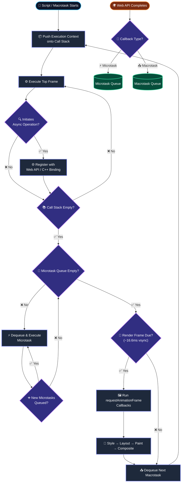

# Event Loop, Call Stack, Microtasks vs Macrotasks

## 🎯 Executive Summary

The event loop is not a JavaScript feature — it's a browser (or Node.js) runtime coordination mechanism. JavaScript itself is single-threaded and has no event loop in the spec. The event loop is defined in the **HTML Living Standard**, not ECMA-262. That distinction alone separates a Lead answer from a Senior one.

Why it's a must-know at Lead level: every performance regression you'll ever debug in a complex frontend system — jank, dropped frames, deferred hydration issues, stale closures in async React effects, microtask flooding in Promise chains — traces back to misunderstanding how the event loop schedules work. You cannot architect a high-performance frontend without internalizing the execution model.

At FAANG, this topic is rarely asked as pure trivia. It's used as a **diagnostic lens**: they want to see how you reason about asynchronous system behavior under pressure, at scale, and in the context of real user impact.

---

## 🧠 Core Technical Deep Dive

### The Runtime Model: What's Actually Happening

V8 (Chrome/Node) and SpiderMonkey (Firefox) implement the JS engine. The **event loop lives outside the engine** — it's owned by libuv (Node) or the browser's compositor thread infrastructure.

The runtime has these components:

| Component | Responsibility |
|---|---|
| **Call Stack** | LIFO execution context stack. One frame per function invocation. |
| **Heap** | Unstructured memory for object allocation. |
| **Web APIs / C++ bindings** | Timer registration, XHR, DOM events, `fetch`, `requestAnimationFrame`. |
| **Microtask Queue** | High-priority, run-to-completion after each task. |
| **Macrotask Queue (Task Queue)** | Lower-priority; one task dequeued per event loop tick. |
| **Render Pipeline** | Style → Layout → Paint → Composite. Runs between macrotasks, gated by vsync (~16.6ms). |

### Call Stack Deep Dive

Each function invocation creates an **Execution Context** pushed onto the call stack. The context includes:

- **Variable Environment** — `var` declarations, function declarations (hoisted)
- **Lexical Environment** — `let`/`const`, outer scope chain
- **`this` binding** — determined at call site

Stack overflow (`Maximum call stack size exceeded`) occurs not from heap exhaustion, but from frame accumulation — the stack is typically capped at ~10,000–15,000 frames in V8.

The call stack is **synchronous and blocking**. Anything sitting in the stack prevents the event loop from processing the next task. This is the root cause of "long tasks" flagged in Chrome's Performance panel.

### Microtask Queue: The Checkpoint After Every Task

Microtasks run after the **current task completes** and before the next **macrotask** is dequeued — but also before the browser renders. This is the critical, often-missed detail.

**Sources of microtasks:**
- `Promise.then` / `.catch` / `.finally` callbacks
- `queueMicrotask()`
- `MutationObserver` callbacks
- `await` (desugars to Promise chains — every `await` is a yield point that schedules a microtask)

**The checkpoint rule:** After every task (including the initial script parse/execution), the event loop drains the microtask queue **completely** before doing anything else — including rendering. This means:

```javascript
// This starves the render pipeline
function floodMicrotasks() {
  Promise.resolve().then(floodMicrotasks); // Infinite microtask recursion
}
floodMicrotasks(); // Page freezes. No paints. No input handling.
```

Contrast with macrotask recursion (`setTimeout(fn, 0)` calling itself), which yields to the event loop between each call and allows renders.

### Macrotask Queue (Task Queue)

One macrotask is dequeued per event loop iteration. After it completes, microtasks drain, then the browser **may** render (only if a frame is due per vsync).

**Sources of macrotasks:**
- `setTimeout` / `setInterval` (minimum 4ms clamp after 5 nested calls in browsers)
- `setImmediate` (Node.js only — runs before I/O callbacks)
- I/O callbacks
- `MessageChannel` (used internally by React's scheduler as a precise macrotask)
- `<script>` tag parsing
- UI events (click, input, etc.)

### Why React Uses `MessageChannel` Instead of `setTimeout`

React's Scheduler package explicitly avoids `setTimeout` for task scheduling because of the 4ms minimum clamp. `MessageChannel.postMessage` dispatches a macrotask with no artificial delay. This is why React's concurrent mode can schedule work at sub-4ms granularity when needed.

```javascript
// React Scheduler (simplified)
const channel = new MessageChannel();
const port = channel.port2;
channel.port1.onmessage = performWorkUntilDeadline;

function scheduleTask(callback) {
  port.postMessage(null); // Zero-delay macrotask
}
```

### `requestAnimationFrame` — Where Does It Fit?

`rAF` callbacks run **after macrotasks, after microtasks drain**, but **before the render step** (style + layout + paint). More precisely, they're part of the "update the rendering" algorithm in the HTML spec.

```
[Macrotask] → [Microtask drain] → [rAF callbacks] → [Style/Layout/Paint] → [Composite]
```

This is why `rAF` is the correct place for DOM mutations that need to be visually coherent — you're guaranteed a read-then-write within one frame. Doing DOM reads and writes intermixed outside `rAF` causes **forced synchronous layouts** (layout thrashing).

### `queueMicrotask` vs `Promise.resolve().then`

They're functionally equivalent for scheduling a microtask, but `queueMicrotask` has no Promise overhead, no error-swallowing risk, and doesn't create a rejected-promise footgun. Prefer it for explicit microtask scheduling in library code.

### Node.js: The Additional Queue Layers

Node adds complexity with its own phases in the libuv event loop:

```
timers → pending callbacks → idle/prepare → poll → check (setImmediate) → close callbacks
```

`process.nextTick` runs before the microtask queue within a phase — making it technically higher priority than `Promise.then` in Node. This is a common source of bugs when porting browser-targeted async code to Node.

```javascript
Promise.resolve().then(() => console.log('Promise'));
process.nextTick(() => console.log('nextTick'));
// Output: nextTick → Promise
```

### `async`/`await` Desugaring and Microtask Timing

```javascript
async function foo() {
  console.log('A');
  await bar();
  console.log('C'); // scheduled as microtask after bar() resolves
}

function bar() {
  return Promise.resolve();
}

console.log('start');
foo();
console.log('B');

// Output: start → A → B → C
```

Each `await` suspends the async function and enqueues a microtask continuation. The number of microtask queue entries created depends on the promise chain depth — deeply nested `await` chains create proportionally deeper microtask scheduling latency.

**V8 optimization note:** As of V8 7.2+, `await` on a native Promise was optimized from 3 microtask ticks to 2. This changed observable ordering in edge cases. Lead-level awareness: engine optimizations can alter async timing — test don't assume.

---

## 📊 Visual Architecture & Logic

### Diagram 1: Event Loop Execution Flow



### Diagram 2: Queue Priority & Render Pipeline Interaction

```mermaid
sequenceDiagram
    autonumber

    participant Script as "🧠 JS Engine<br/>(Call Stack)"
    participant MQ as "⚡ Microtask Queue"
    participant RAF as "🎞️ rAF Queue"
    participant Render as "🎨 Render Pipeline"
    participant TQ as "📥 Macrotask Queue"
    participant WAPI as "🌐 Web APIs"

    %% ===== Sync Execution =====
    Script->>Script: Execute synchronous code
    Script->>WAPI: setTimeout(fn, 0)
    WAPI-->>TQ: Enqueue macrotask after delay

    Script->>MQ: Promise.resolve().then(cb)

    Note over Script: Call Stack drains completely

    %% ===== Microtask Checkpoint =====
    rect rgb(30, 41, 59)
        Note over MQ,Script: ⚡ Microtask Checkpoint

        MQ->>Script: Execute microtask callback
        MQ->>Script: Execute queued microtasks
    end

    %% ===== Render Phase =====
    rect rgb(76, 29, 149)
        Note over RAF,Render: 🎨 Render Phase (if vsync is due)

        RAF->>Script: Execute requestAnimationFrame callbacks
        Script->>Render: Apply batched DOM mutations

        Render->>Render: Style
        Render->>Render: Layout
        Render->>Render: Paint
        Render->>Render: Composite
    end

    %% ===== Next Macrotask =====
    rect rgb(6, 78, 59)
        Note over TQ,Script: 📥 Next Macrotask Cycle

        TQ->>Script: Execute setTimeout callback

        Note over MQ,Script: ⚡ Microtask checkpoint again
    end
```



---

## 🏢 Interview Context & FAANG Signals

### Where This Appears

| Interview Stage | Format |
|---|---|
| **Phone Screen** | "Explain what happens when you call `setTimeout(fn, 0)`" — used to filter |
| **Technical Round** | Code execution ordering puzzles; async debugging scenarios |
| **System Design / Perf Round** | "We're seeing 200ms INP — walk me through your investigation" |
| **Behavioral (Lead)** | "Tell me about a time you diagnosed a performance regression in production" |

### Lead Signals Interviewers Are Looking For

1. **Spec-level precision** — Can you distinguish what's in ECMA-262 vs the HTML Living Standard? Do you know that `Promise` is in the spec but the event loop is not?

2. **Render pipeline integration** — Do you connect async scheduling to frame budget, INP, and CLS? Can you explain why microtask flooding blocks paint?

3. **Framework internals** — Do you know why React Scheduler uses `MessageChannel`? Why Solid.js batches microtask updates differently than React?

4. **Tradeoff articulation** — "When would you deliberately schedule a macrotask over a microtask?" — this distinguishes mechanical knowledge from applied judgment.

5. **Production debugging mindset** — Can you translate abstract event loop knowledge into a real debugging workflow using Chrome DevTools Performance panel, Long Tasks API, `performance.mark`, and LoAF (Long Animation Frames)?

---

## ⚔️ Lead Level vs Senior Level

**Question:** "Why does `setTimeout(fn, 0)` not execute immediately?"

**Senior Response:**
> `setTimeout` with 0ms doesn't execute immediately because it's asynchronous — it goes into the task queue and runs after the current synchronous code finishes. The browser also has a minimum delay of around 1ms or 4ms.

Correct, but surface-level. No connection to rendering, no framework context, no system-level consequence.

---

**Staff/Lead Response:**
> `setTimeout(fn, 0)` is a macrotask. It won't execute until the call stack is empty and the microtask queue is fully drained. More importantly, it yields to the event loop — which means the browser can process a render frame between the current task and the callback. That's architecturally significant.
>
> The 4ms minimum clamp kicks in after 5 nested `setTimeout` calls — a legacy anti-spam mechanism. This matters because it makes `setTimeout` unsuitable for high-frequency scheduling in library code. React's Scheduler uses `MessageChannel.postMessage` precisely to avoid this clamp.
>
> If I'm deciding between `setTimeout(fn, 0)` and `queueMicrotask(fn)`, the question is: do I need to yield to the renderer? If yes, macrotask. If I need to batch state before paint, microtask. Getting that wrong has direct INP implications at scale.

The Lead answer: invokes spec behavior, explains the render relationship, cites framework-level decisions, and closes with a tradeoff.

---

## ⚠️ Common Pitfalls & Anti-Patterns

> ### ✕ Microtask Queue Flooding
> **Why it's wrong:** Recursively scheduling microtasks (`Promise.resolve().then(self)`) creates an infinite drain loop. The event loop never advances to render or process input. Page freezes entirely. This is not hypothetical — poorly written polling logic or recursive retry handlers do this in production.
> **✓ Correct Lead Approach:** For recurring async work, use `setTimeout` or `requestIdleCallback` with explicit yield points. In React, use the Scheduler API (`scheduleCallback`) which manages yielding with a 5ms deadline. If you must poll, always use a macrotask boundary.

---

> ### ✕ Assuming `async/await` Is Non-Blocking
> **Why it's wrong:** `async/await` doesn't offload work off-thread. Synchronous computation inside an `async` function still blocks the call stack. `await` only yields at explicit suspension points. A 500ms loop inside `async function foo()` blocks the main thread for 500ms regardless of `async`.
> **✓ Correct Lead Approach:** Move CPU-intensive work to a Web Worker. Use `await` as a coordination/sequencing tool, not a parallelism tool. If you need incremental main-thread work, use Scheduler's `yieldToMain()` pattern or `scheduler.yield()` (Chrome 115+).

---

> ### ✕ `setTimeout` as a "Yield to Render" Guarantee
> **Why it's wrong:** `setTimeout(fn, 0)` schedules a macrotask but does **not** guarantee a render will happen before `fn` runs. The browser only renders when a frame is due (vsync). Multiple macrotasks may execute within one frame interval.
> **✓ Correct Lead Approach:** Use `requestAnimationFrame` when you need frame-synchronous execution. For post-paint work, `requestIdleCallback`. For "run after current render commit" in React, use `useEffect` (not `useLayoutEffect`) or `flushSync` when you explicitly need synchronous DOM flush.

---

> ### ✕ `useLayoutEffect` as a Default for DOM Reads
> **Why it's wrong:** `useLayoutEffect` runs synchronously after DOM mutations, before paint — it's the React equivalent of the `rAF` + `getBoundingClientRect` read pattern. Overusing it blocks the commit phase and increases Time to First Meaningful Paint. Teams cargo-cult it because "it feels safer."
> **✓ Correct Lead Approach:** Default to `useEffect`. Use `useLayoutEffect` only when you need to measure DOM geometry and mutate back before the user sees an intermediate state (e.g., tooltip positioning, scroll restoration). Document the reason at the call site.

---

> ### ✕ Treating `Promise.all` as Parallel Execution
> **Why it's wrong:** `Promise.all` does not run Promises in parallel. It initiates all the async operations and awaits all their resolution. If those operations are CPU-bound synchronous work wrapped in Promises, they still run serially on the main thread.
> **✓ Correct Lead Approach:** True parallelism requires Web Workers. `Promise.all` is for concurrent I/O (network, disk) where the main thread is idle waiting for external systems. Be precise about this distinction in system design discussions — conflating concurrency and parallelism is a Lead-level red flag.

---

> ### ✕ Ignoring `queueMicrotask` for Library Scheduling
> **Why it's wrong:** Library authors often use `Promise.resolve().then(cb)` to schedule microtasks, creating unnecessary Promise object allocation, potential silent error-swallowing, and implicit dependency on Promise chain semantics.
> **✓ Correct Lead Approach:** Use `queueMicrotask(cb)` directly. It's spec-defined, allocation-efficient, and semantically explicit. Errors thrown inside `queueMicrotask` propagate as uncaught errors (not unhandled rejections), which is often the correct behavior for library internals.

---

## 🛠️ Practice Scenarios

---

### Scenario 1: The Output Prediction

**Problem:**
```javascript
console.log('1');

setTimeout(() => console.log('2'), 0);

Promise.resolve()
  .then(() => console.log('3'))
  .then(() => console.log('4'));

queueMicrotask(() => console.log('5'));

console.log('6');
```

What is the output order and why?

<details>
<summary>Staff-Level Solution</summary>

**Output:** `1 → 6 → 3 → 5 → 4 → 2`

**Reasoning:**
- `1` and `6` are synchronous, run in order on the call stack.
- After the call stack empties, the microtask checkpoint fires.
- Microtask queue at checkpoint: `[then(3), queueMicrotask(5)]`
- `3` runs. During its execution, `.then(() => '4')` is enqueued.
- Microtask queue now: `[queueMicrotask(5), then(4)]`
- `5` runs (it was queued before `4`'s continuation).
- `4` runs.
- Microtask queue empty → macrotask dequeued → `2` runs.

**Lead signal:** Explicitly call out that `queueMicrotask` and `Promise.then` both produce microtasks, that they interleave in FIFO order, and that the `.then(() => 4)` callback is only enqueued after `3` resolves — not before. This demonstrates understanding of Promise resolution timing, not just queue names.

</details>

---

### Scenario 2: The Frozen UI

**Problem:**
A colleague's feature ships this analytics batching code. Users report the UI freezes for 200–400ms intermittently after certain interactions.

```javascript
async function flushAnalyticsQueue(queue) {
  while (queue.length > 0) {
    const batch = queue.splice(0, 50);
    await processAndSend(batch); // Network call + local processing
  }
}
```

`processAndSend` does 30–50ms of JSON serialization inline before the network call. Diagnose and fix.

<details>
<summary>Staff-Level Solution</summary>

**Root Cause:**
`await processAndSend(batch)` does NOT yield the main thread before `processAndSend` begins executing. The 30–50ms synchronous serialization runs on the call stack before the network call is initiated. With a queue of 200 items (4 batches), that's 120–200ms of main thread blocking in tight succession, with microtask-only yields between batches (not render yields).

**Diagnosis approach in DevTools:**
- Performance panel → Long Tasks API → identify tasks > 50ms
- Look for "Long Animation Frame" (LoAF) in Chrome 124+
- `performance.measure()` around `processAndSend` to confirm

**Fix — offload serialization + yield between batches:**
```javascript
async function flushAnalyticsQueue(queue) {
  while (queue.length > 0) {
    const batch = queue.splice(0, 50);

    // Yield to main thread before CPU work
    await scheduler.yield(); // Chrome 115+; fallback: await new Promise(r => setTimeout(r, 0))

    // Move serialization off-main-thread
    const serialized = await serializeInWorker(batch); // Web Worker
    sendBeacon('/analytics', serialized);
  }
}
```

**Lead framing:** "This isn't just an `async` bug — it's an architecture issue. Serialization is CPU work that belongs in a Worker. The `await` boundary gives false confidence that the main thread is free. The fix requires both correctly placing yield points and moving work off-thread. I'd also add a `requestIdleCallback` wrapper around the entire flush to defer it until the browser reports idle time."

</details>

---

### Scenario 3: React Concurrent Mode Ordering Surprise

**Problem:**
A team member refactors a data-fetching hook from class-based `componentDidMount` to a functional component with `useEffect`. They report that a third-party analytics event fires **before** their state update is visible in the DOM in some edge cases. How do you explain and fix this?

<details>
<summary>Staff-Level Solution</summary>

**Explanation:**
`useEffect` fires **asynchronously after paint** — it's a macrotask-deferred callback, by design, to avoid blocking rendering. In concurrent React, multiple renders may be attempted and discarded before a commit. The analytics code likely sits in a `useEffect` that co-fires with a state update effect, but React may have batched the render in a way that the DOM commit and the analytics effect land in different macrotask boundaries.

In concurrent mode with `startTransition`, low-priority state updates are deferred further, creating wider gaps between commit and effect execution.

**If you need guaranteed post-DOM-update timing:**
```typescript
// Option 1: useLayoutEffect — fires synchronously after DOM mutation, before paint
useLayoutEffect(() => {
  if (dataLoaded) {
    analytics.track('data_visible', { timestamp: performance.now() });
  }
}, [dataLoaded]);

// Option 2: flushSync for imperative flush (use sparingly)
flushSync(() => {
  setState(newData);
});
analytics.track('data_visible');
```

**Lead framing:** "The real issue is that the team has an implicit assumption about effect ordering that React's concurrent model doesn't guarantee. I'd push back on the analytics placement entirely — if we need guaranteed ordering, we should use `useLayoutEffect` explicitly and document why, or redesign the analytics call to be data-driven (i.e., fire when the data exists, not when the component mounts)."

</details>

---

### Scenario 4: The Infinite Scroll Jank Audit

**Problem:**
An infinite scroll list renders fine with 50 items. At 500 items, scroll becomes janky (dropped frames). The rendering logic uses virtualization already. Profiling shows long tasks around scroll events. How do you diagnose and fix?

<details>
<summary>Staff-Level Solution</summary>

**Likely causes (in order of investigation):**

1. **Scroll event handler is synchronous and expensive.** Scroll events fire at input rate (up to 1000Hz on some devices), saturating the main thread.

2. **Virtualization library recalculates layout synchronously in the scroll handler**, causing forced layouts.

3. **Intersection Observer is misconfigured** — observing 500 elements with tight thresholds forces layout recalculation on every scroll.

**Fix sequence:**

```javascript
// Step 1: Debounce is wrong here — use passive listener + rAF throttle
let rafPending = false;
listEl.addEventListener('scroll', () => {
  if (!rafPending) {
    rafPending = true;
    requestAnimationFrame(() => {
      handleScroll();
      rafPending = false;
    });
  }
}, { passive: true }); // passive: true = browser can scroll without waiting for handler

// Step 2: Batch DOM reads before writes in handleScroll
function handleScroll() {
  // Read phase (no DOM writes)
  const scrollTop = listEl.scrollTop;
  const containerHeight = listEl.clientHeight;

  // Write phase (all at once, no interleaving reads)
  updateVirtualWindow(scrollTop, containerHeight);
}
```

**Lead framing:** "The `passive: true` flag is non-negotiable — without it, the browser must wait for your handler to complete before scrolling, even if you call `preventDefault` nowhere. That alone can fix 30–40% of scroll jank. The `rAF` throttle ensures we align DOM reads/writes with the frame budget. If this still shows long tasks, I'd add `scheduler.yield()` checkpoints inside `updateVirtualWindow` if it's doing significant work."

</details>

---

### Scenario 5: The Promise Queue Deadlock

**Problem:**
A request deduplication layer is implemented as follows. Under load, some requests never resolve. What's wrong?

```javascript
const inFlight = new Map();

async function deduplicatedFetch(url) {
  if (inFlight.has(url)) {
    return inFlight.get(url);
  }

  const promise = fetch(url).then(r => r.json());
  inFlight.set(url, promise);

  try {
    const result = await promise;
    return result;
  } finally {
    inFlight.delete(url);
  }
}
```

<details>
<summary>Staff-Level Solution</summary>

**The Bug:**
The `finally` block deletes the in-flight entry **before** all awaiting callers have received the resolved value. Here's the sequence:

1. Request A calls `deduplicatedFetch('/api/data')` — promise created, stored.
2. Requests B and C call the same URL — they get the same promise from the map.
3. The promise resolves. Request A's `await promise` resumes, runs `finally`, **deletes the entry**.
4. Requests B and C's `.then` handlers are already chained — they still resolve correctly **this time**.
5. **The real bug:** Under race conditions with concurrent calls arriving between resolve and finally cleanup, a new caller may get a **resolved but already-deleted promise**, then a fresh fetch is initiated, leading to duplicate requests — not deadlock. The "never resolves" scenario occurs if the promise chain has an unhandled rejection that silently swallows the error (e.g., `r.json()` fails on a non-JSON response) and the in-flight entry is never cleaned up.

**Correct implementation:**
```typescript
const inFlight = new Map<string, Promise<unknown>>();

async function deduplicatedFetch<T>(url: string): Promise<T> {
  if (inFlight.has(url)) {
    return inFlight.get(url) as Promise<T>;
  }

  const promise = fetch(url)
    .then(r => {
      if (!r.ok) throw new Error(`HTTP ${r.status}`);
      return r.json() as Promise<T>;
    })
    .finally(() => {
      inFlight.delete(url); // cleanup regardless of success/failure
    });

  inFlight.set(url, promise);
  return promise;
}
```

**Key fix:** Move `finally` cleanup onto the stored promise itself, not inside the `await` consumer. This ensures cleanup always runs exactly once, regardless of how many callers are awaiting.

**Lead framing:** "The structural issue is that the cleanup was tied to one consumer's lifecycle rather than the promise's own lifecycle. In a deduplication pattern, the promise is the canonical source of truth — its cleanup should be self-contained. I'd also add explicit error boundaries here since silently swallowed rejections in shared promises are a production nightmare to debug."

</details>

---

### Scenario 6: Node.js `process.nextTick` Starvation

**Problem:**
A Node.js middleware pipeline using `process.nextTick` for async composition starts dropping I/O callbacks under high traffic. Explain why and redesign.

<details>
<summary>Staff-Level Solution</summary>

**Root Cause:**
`process.nextTick` callbacks execute before the I/O phase of the Node.js event loop and before `Promise` microtasks. If a `nextTick` callback schedules another `nextTick`, they form a recursive queue that drains entirely before Node proceeds to process I/O callbacks (incoming connections, file reads, etc.).

Under high traffic, a middleware chain built on `nextTick` composition can starve the I/O poll phase — connections queue up, requests time out, and throughput collapses.

```javascript
// Anti-pattern: recursive nextTick middleware
function runMiddleware(fns, req, res) {
  let i = 0;
  function next() {
    if (i < fns.length) {
      process.nextTick(() => fns[i++](req, res, next)); // starvation
    }
  }
  next();
}
```

**Redesign using `setImmediate` for I/O-friendly async:**
```javascript
// setImmediate yields to the check phase, after I/O callbacks
function runMiddleware(fns, req, res) {
  let i = 0;
  function next() {
    if (i < fns.length) {
      setImmediate(() => fns[i++](req, res, next));
    }
  }
  next();
}
```

Or, preferably, use `Promise`-based composition which yields correctly within the microtask checkpoint without blocking I/O:

```typescript
async function runMiddleware(fns: Middleware[], req: Request, res: Response) {
  for (const fn of fns) {
    await new Promise<void>((resolve, reject) => fn(req, res, (err?: Error) => err ? reject(err) : resolve()));
  }
}
```

**Lead framing:** "This is a classic Node.js operational failure mode. `nextTick` is designed for 'before I/O' semantics — it's appropriate for error propagation and ensuring consistent async behavior, not for constructing pipelines. I'd make this a hard linting rule in the codebase: `nextTick` usage requires an explicit comment explaining why it can't be `setImmediate` or `Promise`."

</details>

---

### Scenario 7: Measuring Real User Impact

**Problem:**
Your team asks: "How do we know if our async scheduling improvements actually helped users?" You've shipped a change moving several analytics flushes from synchronous-in-effect to `requestIdleCallback`. Design the measurement strategy.

<details>
<summary>Staff-Level Solution</summary>

**Metrics to capture:**

1. **INP (Interaction to Next Paint)** — Core Web Vital directly affected by long tasks. Use `PerformanceObserver` with `event` type.

2. **Long Tasks** — Tasks > 50ms. `PerformanceObserver` with `longtask` type.

3. **Long Animation Frames (LoAF)** — Chrome 124+. More granular than Long Tasks, includes script attribution.

```typescript
// Measure INP
const inpObserver = new PerformanceObserver((list) => {
  for (const entry of list.getEntries()) {
    if (entry.entryType === 'event' && entry.duration > 200) {
      analytics.record('inp_violation', {
        duration: entry.duration,
        startTime: entry.startTime,
        name: entry.name, // 'click', 'keydown', etc.
      });
    }
  }
});
inpObserver.observe({ type: 'event', buffered: true, durationThreshold: 16 });

// Measure Long Tasks with attribution
const ltObserver = new PerformanceObserver((list) => {
  for (const entry of list.getEntries()) {
    analytics.record('long_task', {
      duration: entry.duration,
      attribution: (entry as PerformanceLongTaskTiming).attribution?.map(a => a.name),
    });
  }
});
ltObserver.observe({ type: 'longtask', buffered: true });
```

**Experiment design:**
- A/B test: 50% users get `requestIdleCallback` flush, 50% get previous synchronous flush.
- Primary metric: p75 INP (not mean — tail latency is what users feel).
- Guard rail: task success rate, error rate (ensure `requestIdleCallback` deadline isn't causing analytics drops on page unload — needs `sendBeacon` fallback).
- Segment by device tier: improvements on low-end Android are the meaningful signal.

**Lead framing:** "Shipping a performance change without a measurement plan is a guess, not an engineering decision. The key discipline is defining success criteria before shipping — specifically p75 INP improvement ≥ 15% on mid-tier devices — so we don't rationalize any result as a win."

</details>
