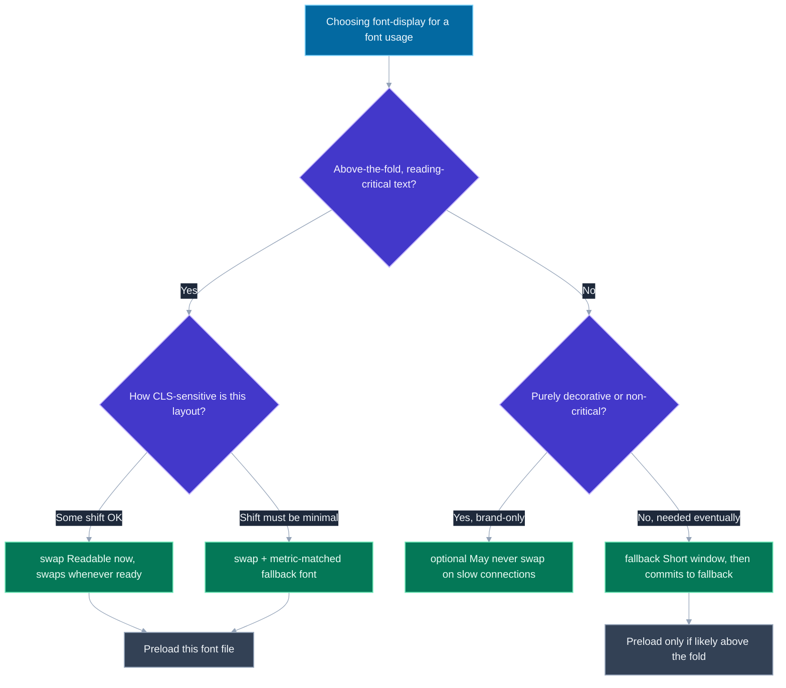
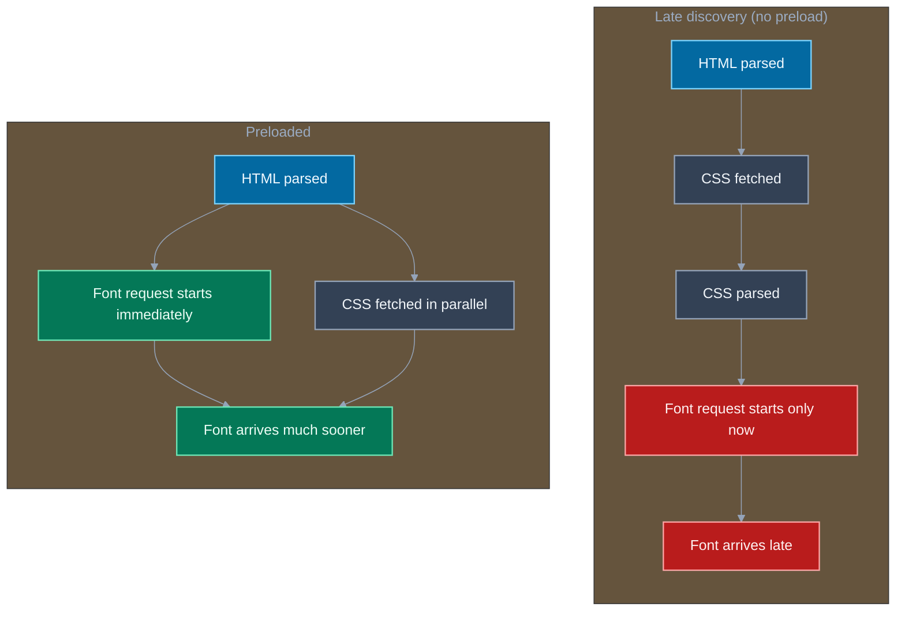

# Font Loading Strategies: font-display, preload, subset

## 🎯 Executive Summary

Custom web fonts sit on the critical path of two things users notice immediately: how fast text becomes readable, and whether the page visually jumps around while it loads. Every decision in this topic — `font-display`, preloading, subsetting, variable fonts, self-hosting — is really one trade-off wearing different clothes: text visibility now (in a fallback font) versus brand fidelity later (in the real font), and how much layout instability you're willing to accept to get there faster.

This is a MUST-KNOW topic at Lead/Staff level because font loading is one of the few performance areas where the "obvious" fix (just preload everything, just use `font-display: swap` everywhere) is wrong often enough that interviewers use it to separate people who've shipped this in production from people reciting MDN. A Lead is expected to reason about *which* fonts are critical enough to preload, *which* `font-display` value fits a given piece of text's above-the-fold/CLS sensitivity, and how the fallback font's metrics interact with the real font to control layout shift — not just to know the API surface exists.

In interviews, this surfaces as a Core Web Vitals follow-up ("LCP looks fine but CLS is bad — what would you check?"), a system-design detail when discussing a marketing or content-heavy page, or a direct "how would you load fonts on this page" question that's really testing whether you understand browser font discovery timing.

## 📖 What Is It? (Plain-English Definition)

**In plain terms:** font loading strategy is the set of decisions that control when a custom font shows up on screen, what the user sees while they wait for it, and how much the page jitters when it finally arrives.

A browser can't render text in a font it doesn't have yet, so every custom (`@font-face`) font has to be downloaded before it can be used — unlike system fonts (Arial, Helvetica), which are already sitting on the device. That download takes time, and different browsers historically made different choices about what to show during that gap: hide the text entirely until the font arrives, or show it immediately in a substitute font and swap it out later. Neither is free — hiding text delays when the user can read anything; showing-then-swapping risks the text visibly reflowing (different fonts measure characters at different widths) right as someone starts reading.

Think of it like ordering food that needs to be plated a specific way for photos: you can make the customer wait at an empty table until the dish is ready and perfectly plated (hide text, wait for font), or hand them a plain bowl of the same food immediately and swap it for the photogenic plate the moment it's ready (show fallback text, swap to webfont) — the second gets food in front of them faster but risks them being mid-bite when the swap happens.

`font-display` is the CSS property that controls which of these behaviors a given `@font-face` uses. Preloading, subsetting, and variable fonts are the techniques that make the font itself arrive faster, so the trade-off window is as short as possible regardless of which `font-display` value you pick.

## 🧠 Core Technical Deep Dive

### FOIT vs FOUT: the two failure modes this whole topic exists to manage

**FOIT (Flash of Invisible Text)**: the browser renders the text box's layout immediately but keeps the text itself invisible until the custom font finishes loading. This was the historical default in most browsers before `font-display` existed. It guarantees the user only ever sees the correct font, but it directly hurts perceived load speed and can hurt LCP if the invisible text is (or contains) the largest contentful element — a slow font load literally delays *when anything appears to happen* on the page.

**FOUT (Flash of Unstyled Text)**: the browser renders text immediately in a fallback font (a system font or another `@font-face` in the stack), then swaps to the custom font once it arrives. Text is readable immediately, which is almost always better for perceived performance — but if the fallback font and the custom font have different character widths/line heights, the swap moves surrounding content, which shows up as a CLS (Cumulative Layout Shift) hit.

> **Key takeaway:** every `font-display` value is a specific policy for how long to tolerate FOIT before falling back to FOUT (or giving up on the webfont altogether). There is no value that eliminates both risks — the job is picking the right risk for the specific piece of text.

### `font-display`: the five values, precisely

```css
@font-face {
  font-family: 'Inter';
  src: url('/fonts/inter-var.woff2') format('woff2');
  font-display: swap; /* the value in question */
}
```

| Value | Invisible (block) period | Swap period | Behavior if font never loads in time |
|---|---|---|---|
| `auto` | Browser default (historically FOIT-like) | Browser-dependent | Browser-dependent |
| `block` | Short (~3s spec-recommended) | Effectively infinite | Swaps in whenever it arrives, even very late |
| `swap` | Near-zero (~100ms) | Effectively infinite | Fallback shown almost immediately, swaps whenever the font arrives |
| `fallback` | Very short (~100ms) | Short (~3s) | Gives up on the webfont for this page view if it doesn't arrive within the swap window — sticks with the fallback |
| `optional` | Near-zero | None — browser may skip the swap entirely | Browser can decide not to use the webfont at all this load, especially on a slow/metered connection |

- **`auto`** delegates the decision to the browser's own default, which historically leans FOIT — treat it as "the value you get if you forget to set one," not a deliberate choice.
- **`swap`** is the common default for body text: readable text immediately, real font whenever it shows up, no matter how late. The risk it accepts is layout shift on swap, with no upper bound on how late that swap can happen.
- **`fallback`** is a middle ground: a brief invisible period (short enough to not hurt perceived load), then a short window to swap in the real font, after which it commits to the fallback for that page load rather than swapping arbitrarily late. Good for text where a late, jarring swap is worse than never getting the custom font at all.
- **`optional`** is the most conservative about layout shift: the browser gets one brief chance to use the font *if it's already cached or arrives essentially instantly*; otherwise it doesn't wait around and may never swap in the custom font for this visit at all. Best where zero layout shift risk matters more than brand fidelity — the font might genuinely never render for a user on a slow connection, and that's the accepted trade-off.

> **Key takeaway:** `swap` is not a universally correct default — it's correct for *readability-critical* text where you're willing to accept unlimited-timing layout shift. For decorative headline fonts where a late shift is jarring and unnecessary, `optional` or `fallback` are frequently the better Lead-level answer.

### Preloading: skipping late discovery

Fonts are referenced from inside CSS (`@font-face { src: url(...) }`), which means the browser only discovers a font is needed *after* it has fetched and parsed the CSS that references it. For a render-blocking stylesheet, that's: parse HTML → fetch CSS → parse CSS → discover the font → start fetching the font. Each arrow there is sequential, and the font request doesn't even start until the third step.

```html
<link
  rel="preload"
  href="/fonts/inter-var.woff2"
  as="font"
  type="font/woff2"
  crossorigin
>
```

`rel="preload"` tells the browser about a critical resource up front, in the `<head>`, so the fetch kicks off in parallel with CSS fetching/parsing instead of waiting for CSS to reveal it. For a font that's used for above-the-fold text, this can shave a meaningful chunk off when the real font becomes available, directly reducing how long a `swap`-configured font spends showing the fallback (and, for a `block`-configured font, how long text stays invisible).

The `crossorigin` attribute is required **even for a same-origin font file** — this is a specific, easy-to-miss spec quirk: the Fonts spec mandates that font fetches always happen in anonymous-CORS mode, regardless of origin. Omit `crossorigin` and the browser fetches the font *again* when the CSS actually references it, because the preloaded resource (fetched without CORS mode) doesn't match the mode the actual font request needs — silently defeating the whole point of preloading.

> **Key takeaway:** preload only the fonts that are genuinely critical for above-the-fold content — usually one, maybe two weights. Preloading every font weight/style in a family front-loads bandwidth contention onto the critical rendering path and can make LCP worse, not better.

### Subsetting: shipping only the glyphs you use

A full webfont file often ships glyphs for every character the type designer supports — Latin, Cyrillic, Greek, extended punctuation, ligatures — most of which a given page never uses. Subsetting strips the font down to only the glyphs actually referenced by the page's content, which can cut file size dramatically (often 60-90% for a Latin-only subset of a large font family).

Two common approaches: a build-time tool like `glyphhanger` that scans your actual rendered HTML/text and generates a subset containing only those characters, or Google Fonts' `&text=` query parameter, which generates an on-the-fly subset containing only the characters you pass in (useful for a fixed string like a logo wordmark, not for arbitrary user-generated content).

> **Key takeaway:** subsetting trades flexibility for size — a subset built for English UI text will render as tofu/missing glyphs the moment the page needs a character outside that subset (an accented name, a non-Latin script). Know what content the subset needs to cover before shipping it.

### Variable fonts: one file, a whole axis of weights

A traditional font family ships one static file per weight/style combination — Regular, Medium, SemiBold, Bold, Italic each as separate files. A **variable font** encodes an entire axis (e.g., weight from 100 to 900) in a single file, letting CSS pick any point on that axis with `font-variation-settings` or, increasingly, directly via `font-weight: 350`.

```css
@font-face {
  font-family: 'Inter var';
  src: url('/fonts/inter-variable.woff2') format('woff2-variations');
  font-weight: 100 900; /* declares the supported range */
  font-display: swap;
}
```

The trade-off: a variable font file is larger than any single static weight, but usually smaller than the sum of 3+ static weights combined — so it's often a net download-size win once a page uses three or more weights of the same family, and it eliminates the request-count overhead of multiple separate font files. The cost lands differently, though: because it's one file, *nothing* in that family renders until that one (larger) file loads — there's no way to get the Regular weight rendering early while Bold is still in flight, the way separate static files would allow.

> **Key takeaway:** variable fonts are a consolidation trade, not a strictly free win — evaluate total-weights-used and whether "all weights ready at once" or "lightest weight ready first" better matches the page's needs.

### Self-hosting vs a third-party CDN (Google Fonts)

Serving fonts from a third-party origin (Google Fonts' CDN) used to carry a well-known cross-site caching benefit: if any site the user visited had already pulled `Roboto` from Google Fonts, every other site using it got a free cache hit. **Browser cache partitioning** (double-keyed caching, shipped across major browsers) eliminated that benefit — the cache is now keyed by both the resource URL and the top-level site, so a font cached for `site-a.com` isn't reused for `site-b.com` even from the identical CDN URL. That removes the historical strongest argument for using a shared public CDN over self-hosting.

What self-hosting gains instead: no extra DNS lookup + TCP + TLS handshake to a third-party origin (`fonts.googleapis.com` for the CSS, then `fonts.gstatic.com` for the actual files — two separate connections), and full control over caching headers, preload timing, and subsetting, none of which you can tune on someone else's CDN response.

> **Key takeaway:** with cache partitioning in place, self-hosting is close to strictly better for performance in most cases — the connection-overhead savings are real and the cross-site cache-sharing argument for a public CDN no longer holds.

### Fallback-font metric matching: `size-adjust`, `ascent-override`, `descent-override`

Even with `font-display: swap`, the layout-shift risk of the swap itself can be reduced — sometimes almost eliminated — by making the *fallback* font's box metrics match the *real* font's metrics as closely as possible, so that when the swap happens, text doesn't reflow even though the glyphs themselves change.

```css
@font-face {
  font-family: 'Inter fallback';
  src: local('Arial');
  size-adjust: 107%;
  ascent-override: 90%;
  descent-override: 22%;
}

body {
  font-family: 'Inter', 'Inter fallback', sans-serif;
}
```

`size-adjust` scales the fallback font's overall metrics; `ascent-override`/`descent-override` tune its vertical metrics (how far characters extend above/below the baseline) to match the real font's line-height contribution. Tools like Fontaine or the `next/font` metric-matching feature in Next.js compute these values automatically by comparing the two fonts' metadata. Getting this right means the swap changes glyph shapes but not surrounding layout — directly reducing CLS attributable to font swapping, independent of which `font-display` value is in play.

> **Key takeaway:** `font-display: swap` controls *when* the swap happens; metric-matching descriptors control *how disruptive* the swap is when it does. A Lead-level answer to "how do we reduce CLS from web fonts" should mention both, not just `font-display`.

## 📊 Visual Architecture & Logic

### Diagram 1 — Choosing a `font-display` value



### Diagram 2 — Late discovery vs preloaded font timeline



## 🏢 Interview Context & FAANG Signals

| Interview Stage | Format |
|---|---|
| Core Web Vitals deep dive | Follow-up: "LCP is fine, CLS is bad — what would you check on this page?" |
| Live debugging / code review | Given a page with visible text-flash or jump, diagnose and fix the `@font-face`/`font-display` setup |
| System design (content/marketing page) | Asked to justify font-loading choices as part of a broader performance budget |
| Trivia/knowledge check | Direct: "explain FOIT vs FOUT" or "what does `font-display: optional` do" |

**Lead signals interviewers listen for:**

1. Naming FOIT and FOUT unprompted and correctly attributing which `font-display` values lean toward each.
2. Picking a *different* `font-display` value for different text on the same page (body text vs decorative headline) instead of one blanket setting.
3. Knowing `crossorigin` is required on font preloads even for same-origin fonts, and being able to explain *why* (always-anonymous CORS mode for font fetches).
4. Bringing up fallback-font metric overrides (`size-adjust`/`ascent-override`/`descent-override`) as a CLS mitigation independent of `font-display`.
5. Correctly noting that cache partitioning removed the cross-site caching benefit of third-party font CDNs, and reasoning about self-hosting from first principles rather than reciting outdated advice.

## ⚔️ Lead Level vs Senior Level

**Question: "Our LCP looks good, but Cumulative Layout Shift is high, and a custom heading font is the suspect. What would you do?"**

> **Senior Response:** "I'd add `font-display: swap` so the text isn't invisible while the font loads, and preload the font file so it arrives faster. That should fix the CLS issue since the font will swap in quicker."

> **Staff/Lead Response:** "`swap` and preload both reduce *how long* the fallback is shown, but they don't reduce *how much* the layout moves when the swap happens — that's a separate problem, governed by how different the fallback and real font's box metrics are. I'd first check whether the fallback font stack has metric-matching descriptors (`size-adjust`, `ascent-override`, `descent-override`) tuned to the real font; if not, I'd generate those so the swap becomes visually and geometrically near-invisible rather than just faster. I'd also ask whether this heading really needs `swap` at all — if it's decorative and the brand cost of occasionally missing the custom font is lower than the CLS cost of swapping, `font-display: optional` might be the better fit for this specific element, even while body text elsewhere uses `swap`. Preloading only makes sense if this font is actually needed above the fold; if it's below the fold, preloading it is bandwidth taken away from something on the actual critical path."

The differentiator: a Senior reaches for the two most commonly cited fixes; a Lead separates "time spent in fallback" from "visual cost of the swap" as two different problems with two different solutions, and picks per-element trade-offs rather than one global setting.

## ⚠️ Common Pitfalls & Anti-Patterns

> ### ✕ Using `font-display: swap` everywhere as a default
> **Why it's wrong:** `swap` optimizes for "text visible fast" at the cost of an unbounded-timing layout shift whenever the real font arrives, however late. Applied blindly to decorative or non-critical text, it introduces CLS risk for a font whose late arrival didn't need to visibly interrupt the user at all.
> **✓ Correct Lead Approach:** Choose `font-display` per use case — `swap` for reading-critical body text, `optional` or `fallback` for decorative/non-essential text where a late, jarring swap is worse than sticking with the fallback.

---

> ### ✕ Preloading every font weight and style in a family
> **Why it's wrong:** Preloading tells the browser "fetch this immediately, ahead of other things" — doing that for every weight/style front-loads bandwidth contention onto the critical rendering path, competing with genuinely critical resources (hero image, main bundle) and potentially making LCP worse.
> **✓ Correct Lead Approach:** Preload only the one or two font files actually needed for above-the-fold, render-critical text. Non-critical weights load lazily via normal CSS discovery.

---

> ### ✕ Forgetting `crossorigin` on a same-origin font preload
> **Why it's wrong:** The Fonts spec requires all font fetches to use anonymous-CORS mode regardless of origin. A preload without `crossorigin` fetches in a different mode than the actual font request will use, so the browser treats them as different requests and fetches the font twice — silently defeating the preload's entire purpose.
> **✓ Correct Lead Approach:** Always include `crossorigin` on `<link rel="preload" as="font">`, even for fonts served from the same origin as the page.

---

> ### ✕ Treating a variable font as a strictly free upgrade
> **Why it's wrong:** A variable font file is typically larger than any single static weight. If a page only ever uses one or two weights, switching to a variable font can increase total bytes transferred and delay when that first weight is usable, compared to just shipping the one or two static files actually needed.
> **✓ Correct Lead Approach:** Compare total bytes for the actual weights in use — variable fonts pay off once three or more weights of a family are genuinely needed; below that, static files are often lighter.

---

> ### ✕ Subsetting to a fixed character set without accounting for real content
> **Why it's wrong:** A Latin-only subset (or a `&text=`-generated subset for a specific string) renders correctly only for the characters it contains — any accented name, non-Latin script, or unexpected character in user-generated content falls back to tofu/missing-glyph boxes or a fallback font, invisibly, until someone notices.
> **✓ Correct Lead Approach:** Base subsets on the actual range of content the font needs to render (including internationalized user content, not just the design mockup's sample text), and verify the subset against real production data before shipping it broadly.

## 🛠️ Practice Scenarios

### Scenario 1: A hero heading flashes unstyled text right before layout jumps

**Problem:**
```css
@font-face {
  font-family: 'Brand Display';
  src: url('/fonts/brand-display.woff2') format('woff2');
  font-display: swap;
}

.hero-heading {
  font-family: 'Brand Display', Georgia, serif;
  font-size: 4rem;
  line-height: 1.1;
}
```
```html
<h1 class="hero-heading">Build products people love</h1>
```
Users report the hero heading visibly jumps down and to the left a moment after the page loads. What's happening, and what would you change?

<details>
<summary>Staff-Level Solution</summary>

`font-display: swap` is doing exactly what it's specified to do: render immediately in the fallback (`Georgia`) and swap to `Brand Display` whenever it arrives. The jump is a metrics mismatch — `Georgia` and `Brand Display` measure characters at different widths and have different line-height contributions at `4rem`, so swapping between them reflows the heading and anything below it.

Two independent fixes, both worth doing: generate a metric-matched fallback (`size-adjust`, `ascent-override`, `descent-override`) so the fallback box dimensions closely approximate `Brand Display`'s, minimizing the visual jump when the swap happens; and preload `brand-display.woff2` with `crossorigin` since this is clearly above-the-fold, reading-critical content, so the window during which the (less-close) fallback is shown is as short as possible. I'd also verify with the CLS entry in a Performance trace or `web-vitals` library output that the layout-shift score actually drops after both changes, rather than assuming it worked.
</details>

---

### Scenario 2: Google Fonts vs self-hosting, for a checkout page

**Problem:**
```html
<link rel="preconnect" href="https://fonts.googleapis.com">
<link rel="preconnect" href="https://fonts.gstatic.com" crossorigin>
<link href="https://fonts.googleapis.com/css2?family=Inter:wght@400;600&display=swap" rel="stylesheet">
```
A teammate argues this is the fastest option because Google's CDN is "probably already cached from some other site the user visited." Evaluate that claim and recommend an approach for a checkout page where every millisecond of LCP matters.

<details>
<summary>Staff-Level Solution</summary>

The cross-site cache-sharing argument no longer holds: browser cache partitioning (double-keyed caching) means a font cached while visiting another site isn't reused for this site even from the identical Google Fonts URL — every user effectively pays a cold-cache cost here regardless of their browsing history. What this snippet *does* cost: a connection to `fonts.googleapis.com` for the CSS, then a second connection to `fonts.gstatic.com` for the actual font file — two separate DNS/TCP/TLS negotiations before the font bytes even start arriving, partially masked but not eliminated by the `preconnect` hints.

For a checkout page specifically, I'd self-host: download the two weights actually used, subset them to the Latin character set checkout forms need, serve them from the same origin with long-lived immutable cache headers, and preload the 400-weight file (the one used for body/label text) with `crossorigin`. That removes the extra-origin connection overhead entirely and gives full control over subsetting and cache headers — for a page this conversion-sensitive, the self-hosted path removes variables the team can't control on someone else's CDN.
</details>

---

### Scenario 3: Choosing `font-display` differently across one page

**Problem:**
```css
@font-face {
  font-family: 'Article Body';
  src: url('/fonts/article-body.woff2') format('woff2');
  font-display: auto;
}

@font-face {
  font-family: 'Decorative Script';
  src: url('/fonts/decorative-script.woff2') format('woff2');
  font-display: auto;
}
```
```html
<article>
  <p class="body-text">Long-form article content the user is here to read...</p>
  <span class="pull-quote-flourish">— a stylized decorative flourish, non-essential</span>
</article>
```
Both fonts currently use the browser's `auto` default. A teammate wants to set both to `swap` for consistency. What would you recommend instead, and why?

<details>
<summary>Staff-Level Solution</summary>

`auto` is never a deliberate choice — it's whatever the browser defaults to, historically FOIT-leaning, which is actively bad here: it can delay the article's main readable text (the thing this page exists to deliver) behind an invisible-text wait. Setting both to `swap` uniformly is better than `auto` but still not the precise answer — the two fonts have very different failure-mode costs.

For `.body-text`, `swap` is correct: this is the reading-critical content, showing it immediately in a fallback font is clearly better than any invisible-text delay, and the reader is scanning body text anyway so a later swap is low-cost. For `.pull-quote-flourish`, I'd use `optional` instead: it's explicitly decorative and non-essential to reading the article, so there's no value in showing a fallback and then jarringly swapping it to a stylized script font later — better to let the browser skip the swap entirely if the font isn't fast/cached, and show a clean fallback the whole time. This is the general pattern: `font-display` decisions should be made per text role on the page, not applied as one blanket value for "consistency."
</details>
