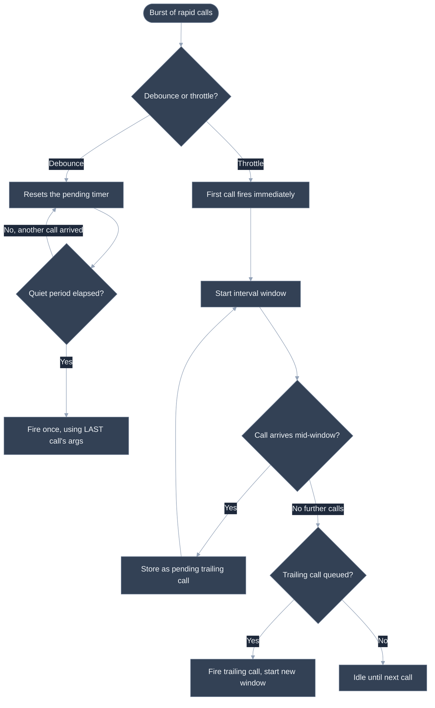
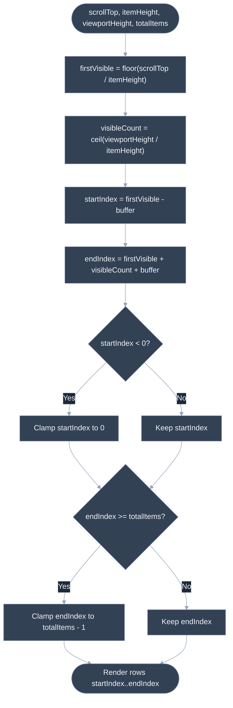

# Frontend Coding: Autocomplete, Debounce/Throttle, Virtual List

## 🎯 Executive Summary

This category is the frontend-specific flavor of the coding round: instead of inverting a binary tree, you're asked to build a small, self-contained piece of infrastructure that real frontend codebases actually ship — a debounced search input, a throttled scroll handler, a virtualized list renderer. The data structures involved are trivial (closures, timers, arithmetic on scroll offsets). The difficulty is entirely in the edge cases: what happens when the function is called again mid-delay, what happens when `this` is lost because the function got detached from its object, what happens when the timer fires after the component that scheduled it has already unmounted.

It's must-know at Lead level because these aren't academic exercises — they're distilled versions of bugs that actually ship to production and actually get escalated. A junior engineer's debounce implementation that doesn't handle `cancel()` correctly means a stale network request race in the search bar. A throttle that doesn't define its leading/trailing behavior precisely means inconsistent scroll-tracking analytics. A virtual list that doesn't clamp its index range means a crash rendering `undefined` past the end of the array. Interviewers use this category specifically because a "senior-looking" solution that only handles the happy path is easy to spot as shallow once you ask two or three pointed follow-up questions.

It typically surfaces as a 30-45 minute live coding round, sometimes framed as "implement X" cold, sometimes framed as "here's a naive implementation, what's wrong with it and how would you productionize it" — the latter framing is common at the Staff/Lead bar specifically because it skips straight to the edge-case discussion instead of spending the whole round on a happy-path implementation.

---

## 📖 What Is It? (Plain-English Definition)

**In plain terms:** these are three different ways of controlling *how often* and *how much* work your code does in response to something happening a lot — the user typing quickly, the user scrolling continuously, or the user having ten thousand items in a list but only ten pixels' worth of screen to look at any of them.

Debounce is the "wait until they're done" pattern: if someone is typing into a search box, you don't want to fire a network request on every keystroke — you want to wait until they've paused, then fire once. Think of an elevator door: it doesn't close the instant the last person's foot touched the sensor, it waits a beat in case one more person is still approaching, and resets that wait every time someone new arrives.

Throttle is the "keep me updated, but not *that* updated" pattern: if someone is scrolling continuously, you often still want periodic updates *during* the scroll — not just one at the very end — but you don't need an update on every single pixel of movement. Think of a security camera that only saves one frame per second instead of all 30 — you still get a sense of continuous motion, just at a capped rate.

Virtual list (list virtualization) solves a completely different problem: rendering a list of ten thousand items would create ten thousand DOM nodes, most of which are scrolled off-screen and invisible. A virtual list only ever renders the handful of rows that are actually visible in the viewport (plus a small buffer), and recalculates which rows those are as the user scrolls — like reading a very long scroll of paper through a small window cut into a piece of cardboard, where you only ever draw the part of the scroll currently behind the window.

---

## 🧠 Core Technical Deep Dive

### Pattern Recognition — How to Spot This Category of Problem

A Lead should be able to bucket an unfamiliar problem statement into one of these three techniques within seconds, from the shape of the requirement alone:

- **Debounce tells:** the problem cares about the *final* state after a burst of activity stops, not about anything that happens during the burst. "Only fire the search request after the user stops typing for 300ms." "Recalculate the layout after the user stops resizing the window." "Save the draft after the user pauses typing." The giveaway phrase is almost always some variant of "after activity stops" or "the last call wins."

- **Throttle tells:** the problem needs periodic updates *during* continuous activity, and would actively break or feel laggy if you waited for activity to stop. "Update the scroll-position indicator as the user scrolls." "Fire an analytics ping every second while the user drags an element." "Rate-limit a button so it can't be clicked more than once per second." The giveaway phrase is "at most once every N ms" or "sample the rate," where waiting until the activity fully stops would defeat the purpose (a scroll indicator that only updates once scrolling stops is useless).

- **Virtualization tells:** the problem involves rendering a very long or unbounded list/grid/table where only a small, fixed-size window of it is ever visible on screen at once — "render 100,000 rows without freezing the browser," "the list has an unknown/growing number of items," "scroll performance degrades as the dataset grows." The deeper rendering-cost mechanics of *why* this matters (DOM node cost, layout thrashing, reconciliation cost) are covered in full in [React Runtime Performance](/topic-detail.html?id=react-runtime-performance) — the pattern-recognition tell here is just: unbounded list + fixed viewport = virtualize.

A classic trap: a candidate hears "user typing in a search box" and reflexively reaches for debounce, when the actual requirement is "show a live character counter as they type" — that's neither debounce nor throttle, it should just run on every keystroke. Not every rapid-event scenario needs rate-limiting; the pattern only applies when the *cost* of reacting to every event (a network call, a layout recalculation, a DOM write) is itself the problem being solved.

### Debounce: Mechanics

A debounced function clears and resets a single pending timer on every call, so only the last call in a burst actually survives long enough to fire:

```javascript
function debounce(fn, delay) {
  let timeoutId = null;

  function debounced(...args) {
    const context = this;
    if (timeoutId !== null) {
      clearTimeout(timeoutId);
    }
    timeoutId = setTimeout(() => {
      timeoutId = null;
      fn.apply(context, args);
    }, delay);
  }

  debounced.cancel = function () {
    if (timeoutId !== null) {
      clearTimeout(timeoutId);
      timeoutId = null;
    }
  };

  return debounced;
}
```

The two details that separate this from a toy implementation: capturing `this` and `args` at call time (not at timer-fire time, since by then the call site context is gone), and exposing `cancel()` so callers — most commonly a `useEffect` cleanup function in React — can prevent a stale call from firing after the component that scheduled it no longer cares about the result.

A live, interactive version of this exact question (including a leading-edge/`immediate` variant) is worked through in [resources/frontend-staff-coding-questions.html](resources/frontend-staff-coding-questions.html) — worth doing as a timed drill after working through the version below.

### Throttle: Mechanics

Throttle needs to decide what happens to calls that arrive *during* the throttle window. The most common convention — and the one used below — is **leading + trailing edge**: the first call in a burst fires immediately (leading edge), and if any further calls arrive before the window closes, the most recent of them fires exactly once more when the window ends (trailing edge):

```javascript
function throttle(fn, interval) {
  let lastCallTime = -Infinity;
  let timeoutId = null;
  let lastArgs = null;
  let lastContext = null;

  function invoke() {
    lastCallTime = Date.now();
    timeoutId = null;
    fn.apply(lastContext, lastArgs);
    lastArgs = lastContext = null;
  }

  function throttled(...args) {
    const now = Date.now();
    const remaining = interval - (now - lastCallTime);
    lastArgs = args;
    lastContext = this;

    if (remaining <= 0) {
      if (timeoutId !== null) {
        clearTimeout(timeoutId);
        timeoutId = null;
      }
      invoke();
    } else if (timeoutId === null) {
      timeoutId = setTimeout(invoke, remaining);
    }
  }

  return throttled;
}
```

`lastCallTime` starts at `-Infinity` specifically so the very first call always computes a `remaining` well below zero, guaranteeing the leading-edge fire regardless of how large `interval` is. This is the kind of detail that's easy to get "accidentally right" with `0` in a quick manual test and then discover is wrong only when `interval` is unusually large.

### Debounce vs. Throttle: Same Input, Different Output

For the identical burst of calls, the two techniques produce a different number of invocations at different times — this contrast is the single most common follow-up question in this category, and being able to state it precisely (not just "debounce waits, throttle doesn't") is a strong signal.

### Virtual List: Mechanics

The core of a virtual list is pure arithmetic: given a fixed row height, you can compute which index is at the top of the viewport with a single division, without ever measuring the DOM:

```javascript
function getVisibleRange(totalItems, itemHeight, viewportHeight, scrollTop, buffer = 3) {
  if (totalItems <= 0) return { startIndex: 0, endIndex: -1 };

  const firstVisible = Math.floor(scrollTop / itemHeight);
  const visibleCount = Math.ceil(viewportHeight / itemHeight);

  let startIndex = firstVisible - buffer;
  let endIndex = firstVisible + visibleCount + buffer;

  startIndex = Math.max(0, startIndex);
  endIndex = Math.min(totalItems - 1, endIndex);

  return { startIndex, endIndex };
}
```

The buffer (also called "overscan") exists so that a fast scroll doesn't show a flash of blank space before new rows have a chance to render — a few extra rows above and below the strictly-visible window absorb that latency. Rendering only relies on `startIndex`/`endIndex` plus a spacer element (or `transform: translateY`) sized to `startIndex * itemHeight` so the scrollbar still reflects the full, un-rendered list length. The deeper trade-offs of fixed- vs. variable-height virtualization, and how this interacts with React's rendering cost model, are covered in [React Runtime Performance](/topic-detail.html?id=react-runtime-performance).

---

## 📊 Visual Architecture & Logic

### Diagram 1: Debounce vs. Throttle Scheduling Behavior



### Diagram 2: Virtual List Visible-Range Calculation



---

## 🏢 Interview Context & FAANG Signals

| Interview Stage | Format |
|---|---|
| **Phone Screen** | "Implement debounce" as a cold 20-30 minute live-coding warm-up |
| **Technical Round** | "Here's a naive throttle — what's wrong with it under load?" |
| **System Design / Perf Round** | "This list has 50k rows and scroll is janky — how would you fix it?" as a follow-up to a broader performance question |
| **Take-Home / Pairing** | Implement all three as small utilities with unit tests, reviewed live |

**Lead signals interviewers listen for:**

1. **Clarifying questions asked up front** — "Leading edge, trailing edge, or both?" for throttle; "Fixed or variable item height?" for virtualization; "Does `cancel()` need to exist?" for debounce. Diving straight into code without settling these is a signal the candidate hasn't hit this problem in production.
2. **Correct `this`/argument handling** — using `fn.apply(context, args)` rather than assuming `fn` is always called with no meaningful receiver or arguments.
3. **Explicit statement of the chosen convention** — for throttle in particular, there is no single "correct" trailing-edge behavior; a Lead states which one they're implementing and why, rather than leaving it implicit.
4. **Unprompted complexity discussion** — stating that debounce/throttle are O(1) time and space per call, and that virtual list range calculation is O(1) regardless of `totalItems`, without being asked.
5. **Cleanup awareness** — mentioning that a pending timer must be cleared on unmount/teardown to avoid calling a stale closure or setting state on an unmounted component.

---

## ⚔️ Lead Level vs Senior Level

**Question:** "Implement a throttle function for a scroll handler."

> **Senior Response:**
> ```javascript
> function throttle(fn, interval) {
>   let waiting = false;
>   return function (...args) {
>     if (!waiting) {
>       fn.apply(this, args);
>       waiting = true;
>       setTimeout(() => { waiting = false; }, interval);
>     }
>   };
> }
> ```
> This fires on the leading edge and then ignores calls until the interval passes.

Correct for the happy path, but it silently drops every call that arrives during the window — including the very last one, which means the throttled function can end up "stuck" showing stale state until another event happens to arrive after the window reopens.

> **Staff/Lead Response:**
> "Before I write this, I need to know: do we want leading-edge-only, or leading-and-trailing? For a scroll position indicator, I'd want trailing-edge too — otherwise the indicator visibly freezes on the last on-window value until the user scrolls again, which reads as a bug. I'll implement leading+trailing, track the most recent args so the trailing call reflects the true final scroll position rather than a stale mid-window one, and make sure the timer gets cleared if the component unmounts mid-window so we don't call into a torn-down instance."

The difference: the Lead treats "what should the trailing behavior be" as a design decision to surface and defend, not an implementation detail to guess at silently — and connects the choice back to observable user-facing correctness.

---

## ⚠️ Common Pitfalls & Anti-Patterns

> ### ✕ Losing `this` or Arguments Across the Timer Boundary
> **Why it's wrong:** `setTimeout(fn, delay)` calls `fn` with no meaningful `this` (or the global object in sloppy mode) and no arguments unless they're explicitly captured. A debounce/throttle implementation that just does `setTimeout(fn, delay)` silently breaks any `fn` that relies on `this` (e.g., an object method) or expects the original call's arguments.
> **✓ Correct Lead Approach:** Capture `this` and `arguments`/rest-args at the moment the wrapper is called, and invoke the original function with `fn.apply(context, args)` inside the timer callback.

---

> ### ✕ Not Exposing (or Not Implementing) `cancel()`
> **Why it's wrong:** Without a way to cancel a pending debounce/throttle call, a component that unmounts (or navigates away) mid-delay leaves a timer that fires anyway — potentially calling `setState` on an unmounted component or firing a network request nobody wants anymore.
> **✓ Correct Lead Approach:** Always expose `cancel()` on the returned function, and wire it into cleanup (e.g., a React `useEffect` cleanup function) as a matter of course, not as an afterthought only added when asked.

---

> ### ✕ Assuming Throttle Behavior Without Stating a Convention
> **Why it's wrong:** "Throttle" alone is underspecified — leading-only, trailing-only, and leading+trailing are all valid, commonly-implemented conventions with genuinely different observable behavior. Writing code without picking and stating one leaves the interviewer unsure whether an edge case was missed or deliberately scoped out.
> **✓ Correct Lead Approach:** State the convention explicitly before or while coding ("I'm implementing leading+trailing, so the last call in a burst still gets its effect applied at the end of the window") and justify it against the use case.

---

> ### ✕ Rendering the Entire List "Just in Case" Instead of Virtualizing
> **Why it's wrong:** Rendering 10,000 DOM nodes because "the list probably won't get that big" is a common way real production lists degrade over time as data grows — the app works fine in every demo and QA pass with 200 items, then falls over for the one customer with 40,000.
> **✓ Correct Lead Approach:** Treat any list whose length is driven by user data (not a fixed, small, app-defined set) as a virtualization candidate from the start, and size the buffer/overscan based on realistic scroll velocity rather than guessing.

---

> ### ✕ Forgetting to Clamp the Virtual List Index Range
> **Why it's wrong:** Computing `startIndex`/`endIndex` from raw arithmetic without clamping produces negative indices near the top of the list and out-of-bounds indices near the bottom (or when the viewport is taller than the total content) — both of which crash or silently render `undefined` rows.
> **✓ Correct Lead Approach:** Always clamp `startIndex` to `0` and `endIndex` to `totalItems - 1` as the last step, and explicitly test the near-top, near-bottom, and viewport-taller-than-content cases rather than only the middle-of-the-list happy path.

---

## 🛠️ Practice Problems

### Problem 1: Implement debounce

**Problem:**
```javascript
/**
 * Returns a debounced version of `fn` that only invokes `fn` after `delay`
 * milliseconds have passed since the LAST time the debounced function was
 * called. The returned function must:
 *  - preserve `this` and all arguments from the triggering call
 *  - expose a `.cancel()` method that cancels any pending invocation
 * @param {Function} fn
 * @param {number} delay
 * @returns {Function & { cancel: () => void }}
 */
function debounce(fn, delay) {
  // your implementation
}
```

Every call to the debounced function resets the delay; only the final call in a burst of activity actually reaches `fn`, and only after the burst has gone quiet for `delay` ms.

**Examples:**
```
Input (delay = 300ms):
t=0ms:   debounced('a')
t=100ms: debounced('b')
t=150ms: debounced('c')
Output: fn('c') fires once, at t=450ms
Explanation: each call resets the timer. The final call ('c' at t=150ms) is the one whose 300ms window is allowed to elapse uninterrupted, so it fires at t=150+300=450ms.
```
```
Input:
const d = debounce(fn, 300);
t=0ms:   d('x')
t=100ms: d.cancel()
Output: fn is never called
Explanation: cancel() clears the pending timer before it has a chance to fire.
```

**Edge cases to handle:**
- Calling `cancel()` before the delay elapses — the pending call must not fire at all.
- Calling the debounced function again during the delay window — this must reset the timer, not queue a second invocation.
- Preserving `this` and all arguments correctly when `fn` is finally invoked, including when the debounced function is called as a detached callback (e.g., passed directly to `addEventListener`).

<details>
<summary>💡 Hint 1</summary>

Think about what state needs to persist *between* calls to the debounced function — something has to remember whether a call is already "in flight" so a new call can interrupt it.

</details>

<details>
<summary>💡 Hint 2</summary>

Use a closure to hold a single `timeoutId` variable. Every call to the debounced function should first check if there's a pending timer and clear it with `clearTimeout` before scheduling a new one with `setTimeout`.

</details>

<details>
<summary>💡 Hint 3</summary>

On each call: capture `this` into a local variable and collect the arguments with a rest parameter. Clear any existing `timeoutId`. Schedule a new `setTimeout` that calls `fn.apply(capturedThis, capturedArgs)` after `delay` ms, and reset `timeoutId` to `null` once it fires (so a later `cancel()` call after firing is a safe no-op). For `cancel()`, close over the same `timeoutId` variable and clear it if set.

</details>

<details>
<summary>✅ Reveal Solution</summary>

```javascript
function debounce(fn, delay) {
  let timeoutId = null;

  function debounced(...args) {
    const context = this;
    if (timeoutId !== null) {
      clearTimeout(timeoutId);
    }
    timeoutId = setTimeout(() => {
      timeoutId = null;
      fn.apply(context, args);
    }, delay);
  }

  debounced.cancel = function () {
    if (timeoutId !== null) {
      clearTimeout(timeoutId);
      timeoutId = null;
    }
  };

  return debounced;
}
```

**Why it works:** The closure over `timeoutId` is what lets every call "see" and clear whichever timer the previous call scheduled, which is exactly the reset behavior the first hint pointed at. Capturing `context` and `args` at call time (not at fire time) is what keeps `this` and arguments correct even though the actual invocation happens later, inside an arrow function that would otherwise have no meaningful `this` of its own.

**Time complexity:** O(1) per call — each invocation does a constant amount of work (clear one timer, schedule one timer), independent of how many times the debounced function has been called before.
**Space complexity:** O(1) — only a single `timeoutId` and one set of pending arguments are ever held in memory at a time, regardless of call volume.

</details>

---

### Problem 2: Implement throttle

**Problem:**
```javascript
/**
 * Returns a throttled version of `fn` that invokes `fn` at most once every
 * `interval` milliseconds, using a leading+trailing edge convention:
 *  - the first call in a burst fires immediately (leading edge)
 *  - if further calls arrive before the interval elapses, the LATEST one
 *    fires exactly once more when the interval ends (trailing edge)
 * @param {Function} fn
 * @param {number} interval
 * @returns {Function}
 */
function throttle(fn, interval) {
  // your implementation
}
```

Unlike debounce, throttle guarantees `fn` runs periodically *during* sustained activity, not only after it stops.

**Examples:**
```
Input — the SAME burst of calls used in the debounce example, with interval = 300ms:
t=0ms:   throttled('a')
t=100ms: throttled('b')
t=150ms: throttled('c')
Output: fn('a') fires immediately at t=0ms (leading edge); fn('c') fires once more at t=300ms (trailing edge, using the latest args seen during the window)
Explanation: contrast with debounce on the identical input — debounce fires ONCE, at t=450ms, with 'c'. Throttle fires TWICE: immediately with 'a', then again at the end of the window with the latest queued args, 'c'.
```
```
Input (interval = 300ms):
t=0ms: throttled('x')   (no further calls)
Output: fn('x') fires immediately at t=0ms; there is no trailing call, since no further calls arrived during the window
```

**Edge cases to handle:**
- A trailing call arriving just before the window closes must still fire once, exactly at the end of the interval, using its (the most recent call's) arguments — not the leading call's stale arguments.
- Calling the throttled function only once must still fire `fn` immediately — it must not wait for an interval that never gets a second call.
- Two calls arriving back-to-back well outside any existing window (i.e., after a previous window has already fully closed) must each independently trigger their own fresh leading-edge fire.

<details>
<summary>💡 Hint 1</summary>

Think in terms of a "cooldown window" that opens the instant `fn` runs. Any call that arrives while the cooldown is active can't fire immediately — but you still don't want to just drop it silently.

</details>

<details>
<summary>💡 Hint 2</summary>

Track the timestamp of the last invocation. On each call, compute how much time is left in the current window (`interval - (now - lastCallTime)`). If that's zero or negative, fire immediately. Otherwise, use a single pending `setTimeout` (only schedule one — don't stack multiple) to fire once the window ends, always updating it to use the most recent call's arguments.

</details>

<details>
<summary>💡 Hint 3</summary>

Keep four closure variables: `lastCallTime` (start it at `-Infinity` so the very first call always fires immediately), `timeoutId`, and the most recently seen `args`/`this`. On every call, update the stored args/`this` unconditionally. If the remaining window time is `<= 0`, clear any pending trailing timer and invoke `fn` right away, updating `lastCallTime`. Otherwise, if no trailing timer is already scheduled, schedule one for the remaining time that — when it fires — invokes `fn` with whatever args/`this` were most recently stored, and updates `lastCallTime`.

</details>

<details>
<summary>✅ Reveal Solution</summary>

```javascript
function throttle(fn, interval) {
  let lastCallTime = -Infinity;
  let timeoutId = null;
  let lastArgs = null;
  let lastContext = null;

  function invoke() {
    lastCallTime = Date.now();
    timeoutId = null;
    fn.apply(lastContext, lastArgs);
    lastArgs = lastContext = null;
  }

  function throttled(...args) {
    const now = Date.now();
    const remaining = interval - (now - lastCallTime);
    lastArgs = args;
    lastContext = this;

    if (remaining <= 0) {
      if (timeoutId !== null) {
        clearTimeout(timeoutId);
        timeoutId = null;
      }
      invoke();
    } else if (timeoutId === null) {
      timeoutId = setTimeout(invoke, remaining);
    }
  }

  return throttled;
}
```

**Why it works:** `lastCallTime` starting at `-Infinity` guarantees `remaining` is negative on the very first call no matter how large `interval` is, satisfying the "fires immediately on a single call" edge case. Storing `lastArgs`/`lastContext` on *every* call (not just when scheduling a timer) is what ensures the trailing fire always uses the freshest arguments, even though the timer itself was scheduled earlier. Only ever having one live `timeoutId` at a time — checked with `timeoutId === null` before scheduling — is what prevents multiple trailing calls from stacking up during a single window.

**Time complexity:** O(1) per call — constant work regardless of call frequency.
**Space complexity:** O(1) — a fixed number of closure variables hold the pending state, independent of how many calls arrive.

</details>

---

### Problem 3: Implement a Simple Virtual List renderer

**Problem:**
```javascript
/**
 * Given the total number of items, a fixed item height, the viewport
 * height, and the current scroll position, return the range of item
 * indices that should currently be rendered — including a small buffer
 * of extra items above and below the strictly-visible window.
 * @param {number} totalItems
 * @param {number} itemHeight
 * @param {number} viewportHeight
 * @param {number} scrollTop
 * @param {number} [buffer=3]
 * @returns {{ startIndex: number, endIndex: number }}
 */
function getVisibleRange(totalItems, itemHeight, viewportHeight, scrollTop, buffer = 3) {
  // your implementation
}
```

All items have the same fixed height, so the visible range can be computed with arithmetic alone — no DOM measurement needed.

**Examples:**
```
Input: totalItems=10000, itemHeight=50, viewportHeight=500, scrollTop=1000, buffer=3
Output: { startIndex: 17, endIndex: 33 }
Explanation: firstVisible = floor(1000/50) = 20. visibleCount = ceil(500/50) = 10. startIndex = 20-3 = 17. endIndex = 20+10+3 = 33. Both are within [0, 9999], so no clamping is needed.
```
```
Input: totalItems=5, itemHeight=50, viewportHeight=500, scrollTop=0, buffer=3
Output: { startIndex: 0, endIndex: 4 }
Explanation: the viewport (500px) is taller than the entire list's content (5 * 50 = 250px). The raw calculation would suggest an endIndex well past the array's end, so it gets clamped down to totalItems - 1 = 4 — i.e., render everything.
```

**Edge cases to handle:**
- `scrollTop` at or near `0` (top of the list) — the raw `startIndex - buffer` calculation goes negative and must be clamped to `0`.
- `scrollTop` at or near the maximum scroll offset (bottom of the list) — the raw `endIndex` calculation can exceed `totalItems - 1` and must be clamped.
- `viewportHeight` greater than the total content height (`totalItems * itemHeight`), and separately, `itemHeight` greater than `viewportHeight` (each visible "page" contains less than one full item) — both must still return a valid, non-negative range without dividing by zero or producing `startIndex > endIndex`.

<details>
<summary>💡 Hint 1</summary>

You don't need to track scroll state in a loop or measure any DOM elements — because every row is exactly the same height, the index of any given pixel offset is just a division.

</details>

<details>
<summary>💡 Hint 2</summary>

Compute `firstVisible` as `Math.floor(scrollTop / itemHeight)` and `visibleCount` as `Math.ceil(viewportHeight / itemHeight)`. Extend that raw range outward by `buffer` on each side before you do anything else.

</details>

<details>
<summary>💡 Hint 3</summary>

After computing `startIndex = firstVisible - buffer` and `endIndex = firstVisible + visibleCount + buffer`, the very last step — always — is to clamp: `startIndex = Math.max(0, startIndex)` and `endIndex = Math.min(totalItems - 1, endIndex)`. Do the clamping after the buffer math, not before, so the buffer itself is still allowed to push the range toward (and get stopped at) the true boundaries.

</details>

<details>
<summary>✅ Reveal Solution</summary>

```javascript
function getVisibleRange(totalItems, itemHeight, viewportHeight, scrollTop, buffer = 3) {
  if (totalItems <= 0) return { startIndex: 0, endIndex: -1 };

  const firstVisible = Math.floor(scrollTop / itemHeight);
  const visibleCount = Math.ceil(viewportHeight / itemHeight);

  let startIndex = firstVisible - buffer;
  let endIndex = firstVisible + visibleCount + buffer;

  startIndex = Math.max(0, startIndex);
  endIndex = Math.min(totalItems - 1, endIndex);

  return { startIndex, endIndex };
}
```

**Why it works:** `firstVisible` and `visibleCount` derive the strictly-necessary window from pure arithmetic, as the first hint pointed at — no measurement, no iteration. Extending by `buffer` before clamping (rather than after) means the buffer still does useful work right up against the boundaries — e.g. near the top of the list, the buffer "uses up" as much room as exists before being clamped to `0`, rather than being wasted. The final clamp is what makes the viewport-taller-than-content and near-boundary edge cases safe.

**Time complexity:** O(1) — a fixed number of arithmetic operations regardless of `totalItems`, which is exactly what makes virtualization scale to arbitrarily large lists.
**Space complexity:** O(1) — only two numbers are returned; no intermediate collections are built.

</details>

---
