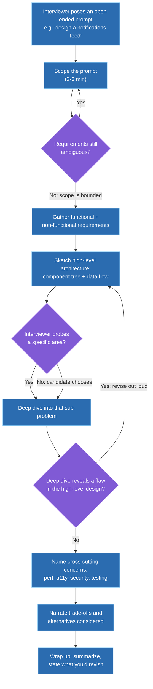
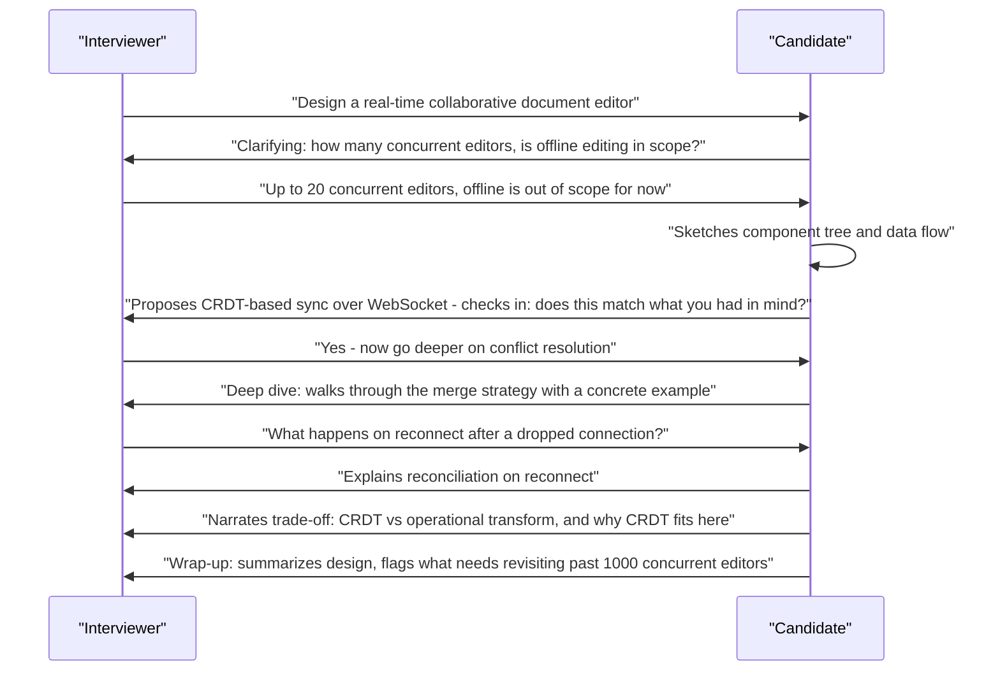

# How to structure a frontend system design answer (framework)

## 🎯 Executive Summary

Frontend system design interviews are evaluated on a different axis than backend ones — not "can you shard a database," but "can you architect a maintainable, performant, accessible client application under real browser constraints (main thread, memory, network variability, device capability)." A candidate with strong technical knowledge who answers in an unstructured stream-of-consciousness will consistently score lower than a candidate with a repeatable framework, because the interviewer is scoring the *process* — clarify, architect, deep-dive, trade off, wrap up — as much as the content.

This is a must-know topic for Leads because system design rounds are where "can this person operate at Staff scope" gets tested directly. A Senior candidate gives a correct answer to the question asked; a Lead candidate demonstrates the judgment to scope the problem correctly, narrate trade-offs instead of just decisions, and manage a 45-minute conversation like a collaborative design review rather than a monologue. The framework isn't a script to recite — it's a forcing function that makes those behaviors happen under time pressure.

## 🧠 Core Technical Deep Dive

### Why frontend system design is a distinct discipline, not scaled-down backend design

Backend system design interviews probe distributed-systems reasoning: partitioning, replication, consistency models, load balancing. Frontend system design interviews probe a genuinely different set of concerns, and treating it as "backend design, but smaller" is the single most common way strong backend-leaning engineers underperform in this round.

| Backend system design tests | Frontend system design tests |
|---|---|
| Data partitioning, replication, consistency | Component architecture and state ownership |
| Load balancing, horizontal scaling | Rendering strategy (CSR/SSR/SSG/ISR) and its trade-offs |
| Database schema, indexing | Client-side data fetching, caching, and cache invalidation |
| Service-to-service communication | Network resilience — retries, offline queuing, optimistic updates |
| Throughput, latency at the server | Perceived performance — Core Web Vitals, bundle size, critical rendering path |
| — | Accessibility, i18n/l10n, device/browser support matrix |

> **Key takeaway:** if your answer to a frontend system design prompt would be identical to your answer for the backend service behind it, you've scoped the problem wrong. The interviewer wants to see how you think about the browser as the runtime, not just the API as the boundary.

### The framework: a repeatable structure, not a script

A widely-used skeleton in the industry (often called RADIO — Requirements, Architecture, Data model, Interface, Optimizations) is a reasonable starting point, but a Staff-level answer needs more explicit time management and an explicit trade-off-narration habit layered on top. The structure below extends it into seven stages with a time budget for a typical 45-minute round.

| Stage | Time budget | What you're doing | Common failure at this stage |
|---|---|---|---|
| **0. Scope the prompt** | 2-3 min | Restate the problem, name what's explicitly out of scope, identify the primary user flow to anchor the design | Accepting an intentionally vague prompt at face value and designing the wrong thing |
| **1. Requirements** | 3-5 min | Functional (features) and non-functional (scale, performance targets, accessibility, offline, device support) requirements, gathered by asking, not assuming | Treating this as a formality instead of using it to bound scope |
| **2. High-level architecture** | 10-15 min | Component tree, state ownership per region, data flow direction — the shape of the system before any deep detail | Diving into implementation detail before the shape is agreed on |
| **3. Data model & API** | 5-10 min | What shape of data the frontend needs, critique/design the API contract, pagination and over/under-fetching | Accepting whatever API shape is handed to you without questioning it |
| **4. Deep dive** | 15-20 min | One or two hard sub-problems, interviewer-directed or candidate-chosen, with real technical depth | Staying at a shallow, breadth-only level for the entire interview — no depth signal at all |
| **5. Cross-cutting concerns** | 5 min | Performance budget, accessibility, security, testing, observability — named explicitly, not left implicit | Forgetting these exist until the interviewer has to ask |
| **6. Trade-offs & wrap-up** | 3-5 min | Narrate alternatives considered and rejected, state what you'd revisit given more time/information | Presenting only the chosen solution with no acknowledgment that alternatives existed |

> **Key takeaway:** the stages aren't strictly linear — a deep dive that reveals a flaw in the high-level architecture should send you back to stage 2, out loud, not silently. The framework is a checklist to make sure nothing gets skipped, not a script that forbids revision.

### Communication is the actual skill being evaluated

The technical content of a system design answer is necessary but not sufficient — the interviewer is also scoring whether you run the room like someone who could lead a real design review. Three concrete, evaluable behaviors separate strong answers from weak ones regardless of the specific architecture proposed:

- **Narrate trade-offs, not just decisions.** "I'll use optimistic updates" is a decision. "I'll use optimistic updates because the failure rate on this endpoint is low and the UX cost of waiting is high — if this were a payment action instead, I'd default to pessimistic" is a trade-off, and it's the difference between Senior and Lead framing of the identical technical choice.
- **Check in periodically, don't monologue.** Pausing after the high-level architecture to ask "does this match the shape you had in mind, or would you like me to go deeper somewhere specific" turns a 45-minute presentation into a 45-minute collaborative conversation — which is a more accurate simulation of the actual job.
- **Recover visibly from your own mistakes.** If a deep dive surfaces a flaw in something you proposed ten minutes earlier, saying so explicitly and revising is a stronger signal than either not noticing or quietly hoping the interviewer didn't either.

> **Key takeaway:** two candidates can propose the identical architecture and receive different scores based entirely on whether one of them narrated trade-offs and checked in, and the other delivered a technically correct monologue.

### Frontend-specific cross-cutting concerns candidates habitually forget

Stage 5 above is where most otherwise-strong answers lose points, because these concerns don't come up naturally while sketching a component tree — they have to be raised deliberately.

| Concern | What to actually say |
|---|---|
| **Performance budget** | Name a concrete target (e.g., LCP under 2.5s, JS bundle under some threshold), and connect it to a specific decision (code splitting by route, lazy-loading below-the-fold content) |
| **Accessibility** | Keyboard navigation, focus management on dynamic content changes, ARIA live regions for real-time updates — not just "use semantic HTML" |
| **Offline / poor network resilience** | What happens on a dropped WebSocket, a failed mutation, a slow 3G connection — not just the happy path |
| **Security at the frontend boundary** | XSS from user-generated content, CSRF on state-changing requests, what the frontend does and doesn't trust from the API |
| **i18n/l10n** | Text expansion in translated UI, RTL layout, locale-aware formatting — relevant the moment the product is described as global |
| **Testing & observability** | What you'd unit test vs. integration test vs. E2E, and what you'd want in production RUM/error tracking to know the design is actually working |

> **Key takeaway:** naming these unprompted, even briefly, is a stronger signal than a technically deeper architecture that never mentions them — omission reads as "doesn't know these exist," not "chose not to discuss them."

## 📊 Visual Architecture & Logic

### Diagram 1 — The framework as a flow, with revision loops

### Diagram 2 — A well-run interview is a conversation, not a monologue

## 🏢 Interview Context & FAANG Signals

Frontend system design rounds are typically a dedicated 45-60 minute loop stage at Staff/Lead level, distinct from coding rounds — the prompt is deliberately open-ended ("design a photo-sharing feed," "design a form builder," "design a video player") and there is no single correct answer. Some companies also embed a lighter version of this inside a "tell me how you'd architect X" behavioral-adjacent question.

**Lead signals interviewers listen for:**

- Asking clarifying questions before proposing anything — an immediate signal the candidate scopes problems rather than pattern-matching to a memorized design.
- Explicit time-awareness — visibly managing the conversation ("I want to make sure we get to a deep dive, let's move to architecture") rather than getting stuck in requirements or over-elaborating the high-level shape.
- Narrating trade-offs unprompted, including naming a real alternative and a concrete reason it was rejected — not just "there are trade-offs" as a throwaway line.
- Raising frontend-specific cross-cutting concerns (performance budget, accessibility, offline resilience) without being asked.
- Treating interviewer interruptions and pivots as normal collaborative signal, not as a derailment — adapting smoothly is itself the signal, not a distraction from it.

## ⚔️ Lead Level vs Senior Level

**Scenario: "Design the frontend architecture for an infinite-scrolling social feed."**

A **Senior** response is technically sound and follows a reasonable structure: clarify a few requirements, propose a component tree (Feed, Post, PostList), mention virtualization for performance, describe pagination via a cursor-based API, and land on a working design.

A **Lead/Staff** response covers the same ground but differs in three specific ways:

- **Explicit trade-off narration at each major decision**: "I'll virtualize the list — the alternative is rendering everything and relying on the browser, which is simpler but won't hold up past a few hundred items; I'm assuming this feed can grow unbounded based on the scope we agreed on." The Senior version states the decision; the Lead version states the decision, the alternative, and the reasoning tied back to the agreed requirements.
- **Proactive cross-cutting coverage**: names the accessibility implication of virtualization specifically (virtualized lists can break screen-reader navigation and browser find-in-page unless handled deliberately — not a generic "we'll add ARIA labels"), and names a performance budget for the initial paint versus subsequent page loads, not just "it'll be fast."
- **Time and conversation management**: checks in after the high-level architecture before diving deeper, and if the interviewer redirects toward, say, optimistic like/comment updates, transitions smoothly rather than trying to finish the originally planned deep dive first.

The differentiator: a Senior answer would pass most bars on technical correctness alone; a Lead answer is evaluated as much on demonstrating the operating model of someone who could run this conversation as a real design review with peers, not just produce a correct diagram.

## ⚠️ Common Pitfalls & Anti-Patterns

> ### ✕ Diving into a technical solution before clarifying requirements
> **Why it's wrong:** Proposing a specific architecture (e.g., "I'll use a CRDT for this") before knowing scale, scope, or constraints signals pattern-matching to a memorized design rather than problem-solving. It also risks designing the wrong thing entirely if the assumed constraints turn out to be incorrect.
> **✓ Correct Lead Approach:** Spend the first few minutes deliberately scoping the prompt and gathering requirements before proposing any architecture, even when a familiar-looking pattern seems obvious early.

> ### ✕ Treating the interview as a monologue instead of a conversation
> **Why it's wrong:** Presenting a fully-formed design without checking in denies the interviewer the chance to redirect toward what they actually want to evaluate, and reads as an inability to collaborate — a core part of the Lead role in real design reviews.
> **✓ Correct Lead Approach:** Pause at natural checkpoints (after requirements, after high-level architecture) to confirm direction and invite the interviewer to steer toward a specific area.

> ### ✕ Spending too long on high-level architecture and running out of time for depth
> **Why it's wrong:** A beautifully complete component tree with no deep dive gives the interviewer no signal about the candidate's actual technical depth — breadth without depth is indistinguishable from a well-memorized outline.
> **✓ Correct Lead Approach:** Time-box the high-level architecture explicitly and move to a deep dive even if the high-level design feels slightly underdeveloped — depth in one or two areas is worth more than a fully polished shape with no substance underneath.

> ### ✕ Presenting only the chosen solution with no acknowledgment of alternatives
> **Why it's wrong:** A single confidently-stated solution with no mention of what else was considered reads as either inexperience (not knowing alternatives exist) or overconfidence (not questioning the first idea) — neither is a Lead signal.
> **✓ Correct Lead Approach:** For each major decision, name at least one real alternative and the specific reason it was rejected, tied to the requirements gathered earlier — not a generic "there are other ways to do this."

> ### ✕ Treating frontend system design as a scaled-down backend design
> **Why it's wrong:** An answer that's entirely about API design, caching layers, and data consistency without ever discussing component architecture, rendering strategy, or client-side performance has scoped the problem as a backend question, missing what the round is actually meant to evaluate.
> **✓ Correct Lead Approach:** Anchor the design explicitly in the browser as the runtime — component boundaries, state ownership, rendering strategy, and perceived performance — treating the API as one input to that design, not the whole design.

## 🛠️ Practice Scenarios (5-10 Scenarios)

<strong>Scenario 1: Design a real-time collaborative document editor</strong>

**Problem statement:** Design the frontend architecture for a Google-Docs-style collaborative text editor supporting up to 20 concurrent editors per document. Apply the framework explicitly, narrating each stage.

**Staff-Level Solution:**
**Scope:** confirm offline editing is out of scope, confirm the primary flow is real-time text editing (not rich media embedding), and confirm 20 concurrent editors is the target scale to design against.

**Requirements:** functional — real-time text sync, cursor/selection presence for other editors, undo/redo. Non-functional — sub-200ms perceived sync latency, graceful degradation on connection loss, accessible editing (screen-reader compatible content model).

**High-level architecture:** a local document model (a CRDT-based structure) as the source of truth for the editor's own view, a WebSocket connection streaming operations to/from other editors, and a reconciliation layer that merges incoming remote operations into the local CRDT without disrupting the local user's in-progress edit or cursor position.

**Deep dive (conflict resolution):** walk through why a CRDT (e.g., a sequence CRDT for text) is chosen over operational transformation — CRDTs merge deterministically without a central sequencing server, which simplifies the reconnect-after-disconnect case, at the cost of somewhat higher memory overhead per character for tombstones/metadata. Explain what happens on reconnect: the client resyncs its CRDT state against the server's authoritative log and replays any local pending operations against it.

**Cross-cutting:** ARIA live regions for announcing remote cursor presence without spamming screen readers, a performance budget for time-to-first-keystroke-responsive (should be near-instant since local edits never wait on the network), and a security note that the WebSocket channel must be authenticated per-document, not just per-user.

**Trade-off narration:** explicitly state CRDT vs. OT was considered, and that OT would have been preferred if requirements included a stronger need for a central authoritative order (e.g., strict undo/redo semantics across all editors) — naming the rejected alternative and the condition under which it would have won is exactly the Lead signal this framework is designed to produce.

<strong>Scenario 2: Design an infinite-scrolling news feed</strong>

**Problem statement:** Design the frontend for a feed similar to Instagram or Twitter's home timeline, supporting infinite scroll and real-time new-post notifications.

**Staff-Level Solution:**
Apply the framework: scope to the primary read flow (scrolling and viewing posts) with a secondary flow (posting/liking) explicitly acknowledged but deferred until the high-level shape is agreed. Requirements should surface the scale question directly — is this thousands or millions of posts per user session — since that determines whether virtualization is a nice-to-have or a hard requirement.

High-level architecture: a virtualized list component (rendering only visible + a buffer of off-screen items), a cursor-based pagination API rather than offset-based (offset pagination breaks under concurrent inserts, which a live feed guarantees), and a separate lightweight "new posts available" banner mechanism rather than silently prepending new content while the user is mid-scroll.

Deep dive candidates: optimistic like/comment updates with rollback on failure, or the virtualization implementation itself (windowing math, maintaining scroll position when new items are prepended above the viewport). Cross-cutting: virtualized lists breaking screen-reader "read from here" navigation and browser find-in-page unless deliberately mitigated (e.g., rendering a certain buffer beyond viewport, or providing a non-virtualized fallback path) — a detail most candidates miss entirely.

<strong>Scenario 3: Design a WYSIWYG rich text editor</strong>

**Problem statement:** Design the frontend architecture for an embeddable rich text editor supporting bold/italic/lists/links and basic extensibility for future plugin authors.

**Staff-Level Solution:**
The central architectural decision to surface early: `contentEditable` with direct DOM manipulation versus a custom document model (a structured JSON representation rendered to DOM, with all edits going through model mutations rather than direct DOM writes) — this is the natural deep-dive candidate and should be flagged as such during high-level architecture rather than resolved silently.

Recommend the custom document model for anything beyond a trivial editor: `contentEditable`'s DOM-is-the-source-of-truth model makes serialization, undo/redo, and collaborative editing significantly harder because the DOM is a lossy, browser-inconsistent representation of intent. A structured model gives a canonical serialization format, makes undo/redo a matter of snapshotting/diffing the model rather than the DOM, and gives plugin authors a stable schema to extend rather than raw DOM access.

Trade-off to narrate explicitly: the custom-model approach is significantly more implementation effort upfront and requires reimplementing behaviors browsers give `contentEditable` for free (IME composition, spellcheck integration) — worth it here because extensibility and collaborative editing were named as requirements, but would be over-engineering for a comment box.

<strong>Scenario 4: Design an e-commerce checkout flow</strong>

**Problem statement:** Design the frontend for a multi-step checkout flow (cart review, shipping, payment, confirmation) for a high-traffic e-commerce site.

**Staff-Level Solution:**
Requirements should surface payment-provider constraints early (PCI compliance strongly favors an iframe/hosted-fields approach for card input, meaning the frontend never directly handles raw card data) — this shapes the whole payment step's architecture, not a detail to defer to the deep dive.

High-level architecture: a step-based flow with persisted form state (surviving page refresh and back/forward navigation, likely via URL-driven step state plus a client-side draft store), explicit validation boundaries per step rather than one giant form validated at the end, and a clear distinction between client-side validation (fast feedback) and server-side validation (source of truth, since prices/inventory/shipping rules can change between page load and submission).

Deep dive candidate: error recovery — what happens when payment succeeds but the confirmation call fails, or when inventory changes mid-checkout. Cross-cutting: this is a case where security (PCI scope, never logging card data client-side even in error states) and reliability (idempotent submission to avoid double-charging on retry) are not optional footnotes — they're central to the design and should be raised without prompting.

<strong>Scenario 5: Design a notification system (in-app and push)</strong>

**Problem statement:** Design the frontend architecture for a notification system supporting in-app real-time notifications and browser push notifications, with read/unread state synchronized across multiple open tabs.

**Staff-Level Solution:**
High-level architecture: a single WebSocket (or SSE) connection per browser session — not per tab — coordinated through a shared mechanism (a `BroadcastChannel` or a shared worker) so notification delivery and read/unread state stay consistent across tabs without each tab independently opening a redundant connection.

Deep dive candidate: what happens when the WebSocket disconnects — polling fallback strategy, reconnect-and-resync logic to fetch any notifications missed during the gap, and how read/unread state reconciles between an optimistic local update (user clicks "mark as read" in tab A) and the eventual server-confirmed state (which must also propagate to tab B).

Cross-cutting: browser push notification permission UX (never prompt on page load — request permission contextually, tied to a user action, or opt-in rates collapse), and accessibility for the in-app notification UI (an ARIA live region for new notifications, careful not to interrupt a screen-reader user's current task with an assertive announcement for a low-priority notification).

<strong>Scenario 6: The interviewer interrupts mid-deep-dive and pivots</strong>

**Problem statement:** You're 20 minutes into designing a video streaming player, deep in a walkthrough of adaptive bitrate switching, when the interviewer says "let's set that aside — how would you handle closed captions and accessibility instead?" How do you respond?

**Staff-Level Solution:**
Treat this as normal, expected interview signal, not a derailment: "Sure — I'll park the bitrate-switching detail there and we can return to it if there's time. For captions and accessibility..." and pivot cleanly, briefly noting the parked thread so it's clear it wasn't abandoned, just deferred.

This is worth explicitly practicing because the instinct under pressure is often to finish the current thought first, which reads as inflexibility. A Lead-level response treats an interviewer redirect as exactly the kind of steering a real design review would involve, and demonstrates the ability to context-switch cleanly — which is itself part of what's being evaluated, independent of the accessibility content that follows.

<strong>Scenario 7: Recovering from a flaw discovered late in the interview</strong>

**Problem statement:** You're 30 minutes into a 45-minute interview designing a form builder tool. While deep-diving into conditional field logic, you realize your earlier high-level architecture — storing the entire form schema as deeply nested component props — won't support the conditional logic requirement cleanly. How do you handle this?

**Staff-Level Solution:**
Name it explicitly rather than quietly working around it: "Actually, walking through this conditional logic case is showing me a gap in the architecture I proposed earlier — nesting the schema in props makes it hard for a field to react to a sibling's value. I'd revise that to a flat, normalized schema with an explicit dependency graph between fields instead." Then briefly sketch the revision and continue.

**Lead insight to surface in interview:** this is a higher-signal moment than if the flaw had never surfaced at all — it demonstrates the ability to catch and correct an architectural mistake under time pressure, which is a realistic and valuable on-the-job skill. Silently patching around the flaw without naming it, or defending the original design past the point it's clearly insufficient, are both weaker signals than an explicit, confident revision.

<strong>Scenario 8: An interviewer keeps asking narrow, tactical questions</strong>

**Problem statement:** During a system design round for a dashboard application, the interviewer repeatedly asks very tactical, low-altitude questions ("what CSS would you use for this card layout," "what's the exact prop signature for this component") instead of engaging with the architecture. How do you steer the conversation back to the appropriate level without being dismissive of the interviewer's questions?

**Staff-Level Solution:**
Answer the tactical question briefly and directly — dismissing it outright reads poorly regardless of intent — then explicitly bridge back up: "That component would take a `data` and an `onSelect` prop, roughly — stepping back up a level, the reason I'm structuring it that way is [architectural reason], which connects to [the broader design decision it supports]." This respects the question while using it as a hook to re-engage at the intended altitude.

**Lead insight to surface in interview:** interviewers vary in style, and some genuinely probe tactically to test whether a candidate can zoom between altitudes fluidly — treating every tactical question as an unwelcome distraction from "the real design" misses that this fluidity is itself part of what's being tested. The correct response demonstrates comfort at both levels rather than a rigid insistence on staying only at the architecture level.

