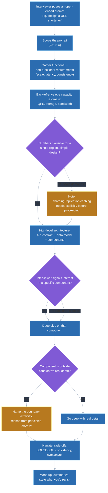
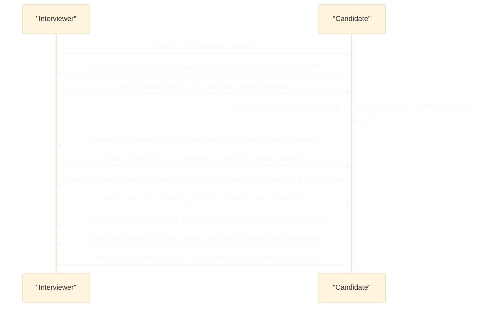

# How to structure a general system design answer (framework)

## 🎯 Executive Summary

General ("backend-aware") system design rounds show up in an increasing share of Staff/Lead frontend loops, and they evaluate a different skill set than the frontend system design round: capacity estimation, data modeling, and explicit reasoning about consistency and availability trade-offs. A Frontend Lead who treats this like a frontend system design question — component trees, rendering strategy, bundle size — will scope the problem wrong immediately, because the interviewer is asking about the service behind the UI, not the UI itself.

The bar here is not backend infrastructure expertise — nobody expects a Frontend Lead to out-design a Staff backend engineer on sharding strategy. The bar is structured, honest reasoning under a discipline that isn't the candidate's primary specialty: asking the right clarifying questions, doing real arithmetic instead of hand-waving at "capacity estimation" as a step, and being explicit about what's a confident opinion versus an educated guess. A candidate who says "this part is outside my day-to-day depth, but here's how I'd reason about it" reads as more Staff-ready than one who bluffs a plausible-sounding answer and gets it wrong under a follow-up.

## 🧠 Core Technical Deep Dive

### Why this is a different discipline than frontend system design

Frontend system design questions are evaluated on component architecture, rendering strategy, and client-side data flow — scale numbers matter, but they're rarely interrogated with real arithmetic. Backend-aware system design questions invert that: scale numbers *are* the interrogation, and the interviewer expects you to show your work, not just name the concern.

| Frontend system design tests | General/backend-aware system design tests |
|---|---|
| Component architecture, state ownership | Data modeling and schema design |
| Rendering strategy (CSR/SSR/SSG) | Storage choice (SQL vs. NoSQL) and why, for this specific access pattern |
| Client-side caching and invalidation | Capacity estimation with real numbers — QPS, storage, bandwidth |
| Perceived performance, Core Web Vitals | Consistency vs. availability trade-offs (CAP-theorem-style reasoning) |
| Network resilience from the client's view | Synchronous vs. asynchronous processing, queuing, and backpressure |
| API contract as an input to the design | API contract as one output of the design, alongside the data model |

> **Key takeaway:** if your answer to a backend-aware prompt is a component tree with a data-fetching hook bolted on, you've answered the frontend question instead of the one that was asked. The interviewer wants to see you reason about the system that produces the data, not just consume it.

### The framework: requirements, estimate, architecture, then depth

The same discipline that makes a frontend system design answer strong — a repeatable structure with an explicit trade-off-narration habit — applies here, but the stages carry different weight. Capacity estimation and data modeling get real time; UI concerns get a brief, honest mention near the end rather than the centerpiece.

| Stage | Time budget | What you're doing | Common failure at this stage |
|---|---|---|---|
| **0. Scope the prompt** | 2-3 min | Restate the problem, name what's explicitly out of scope, pick the primary flow to anchor the design | Accepting a vague prompt ("design Twitter") without narrowing it to a specific flow first |
| **1. Requirements** | 5-7 min | Functional requirements plus non-functional ones asked explicitly — read/write ratio, latency targets, consistency needs, expected scale | Assuming scale numbers instead of asking, then discovering mid-design they were wrong |
| **2. Capacity estimate** | 5-8 min | Back-of-envelope QPS, storage, and bandwidth math, done live with actual numbers | Naming "I'd do capacity estimation" as a step without ever doing the arithmetic |
| **3. High-level architecture** | 10-15 min | API contract, data model, and major components — the shape of the system before any deep detail | Jumping to a deep dive on one component before the overall shape is agreed on |
| **4. Deep dive** | 10-15 min | One or two components the interviewer signals interest in, with real depth | Trying to cover every component shallowly instead of going deep anywhere |
| **5. Cross-cutting concerns** | 3-5 min | Consistency model, failure modes, and — for a Frontend Lead specifically — how this design constrains the client | Forgetting the frontend-relevant implications entirely, since the round doesn't prompt for them |
| **6. Trade-offs & wrap-up** | 3-5 min | Summarize the design, name alternatives rejected and why, state what you'd revisit with more time | Running out of time mid-deep-dive with no summary at all |

> **Key takeaway:** stages 1 and 2 deserve more time here than in a frontend round, because "did you ask for the numbers, and did you actually compute with them" is one of the most direct, easy-to-score signals available to the interviewer in a 45-minute conversation.

### Capacity estimation is a practiced skill, not a step you name

Saying "I'd estimate capacity" and moving on is a surface-level answer that reads as memorized structure without substance. The signal comes from doing the arithmetic out loud, with numbers the interviewer can follow and sanity-check in real time.

**Worked example — a URL shortener service:**

- **Assume:** 100 million new short URLs created per month, a 100:1 read-to-write ratio (redirects vastly outnumber creations), and a 5-year data retention requirement.
- **Write QPS:** 100,000,000 / 30 days / 86,400 seconds ≈ 38 writes/sec average. Assume peak traffic runs at 3x average → roughly 115 writes/sec at peak.
- **Read QPS:** 100:1 ratio → roughly 3,800 reads/sec average, ~11,500 reads/sec at peak.
- **Storage:** 100M URLs/month × 60 months = 6 billion records. At roughly 500 bytes per record (short code, long URL, metadata, timestamps), that's about 3 TB of raw data over 5 years — small enough that a single well-indexed datastore, or a modestly sharded one, is plausible without exotic infrastructure.
- **Bandwidth:** at ~500 bytes per record and 11,500 peak reads/sec, that's roughly 5.75 MB/sec at peak — trivial for a single region, worth mentioning CDN/edge caching once multi-region is in scope.

The exact numbers matter far less than the fact that they were computed rather than asserted — an interviewer will often perturb one assumption ("what if it's 10x that volume") specifically to check whether the candidate can redo the math live rather than having memorized a fixed answer.

> **Key takeaway:** a capacity estimate that's off by 2x but was actually computed live scores higher than a suspiciously round, unshown number — the interviewer is scoring the process of estimation, not the precision of the result.

### Trade-off communication is the actual skill being evaluated

As in the frontend framework, the content of the answer is necessary but not sufficient — the interviewer is scoring whether each major decision is presented as a deliberate choice with a stated reason, not an unstated default. This matters more here because backend trade-offs have well-known named axes that interviewers expect to hear invoked correctly.

- **SQL vs. NoSQL, tied to the actual data shape.** "I'll use a relational store because the data has strong referential structure (users, orders, order items) and I need multi-row transactional consistency at checkout" is a trade-off. "I'll use Postgres" with no reasoning is a default, and a weaker signal even if it's the right choice.
- **Strong vs. eventual consistency, named explicitly.** "Reads of your own writes need to be strongly consistent for the account-balance view, but the activity feed can tolerate eventual consistency because staleness of a few seconds doesn't harm the user" ties the choice to a specific field or flow, not the whole system uniformly.
- **Synchronous vs. asynchronous processing.** "The write path stays synchronous up through persistence, but I'd push notification fan-out to a queue so a slow downstream consumer doesn't add latency to the user-facing request" names both the boundary and the reason for placing it there.

| Axis | Lean toward option A when | Lean toward option B when |
|---|---|---|
| SQL vs. NoSQL | Data has relational structure, needs multi-row transactions, access patterns are query-flexible | Data is largely key-value or document-shaped, needs to scale horizontally past what a single relational primary can do, schema is fluid |
| Strong vs. eventual consistency | Correctness failures are visible and costly (payments, inventory counts) | Staleness is invisible or low-cost to the user (feeds, view counts, presence) |
| Sync vs. async processing | The result must be confirmed before the response is useful (payment authorization) | The work can safely lag the response (email/push notification, analytics event) |

> **Key takeaway:** the differentiator isn't which side of each trade-off you land on — it's whether you named the axis, stated a reason tied to the requirements gathered earlier, and could defend the choice if pushed. A confidently wrong answer with real reasoning behind it scores better than a right answer with no reasoning shown.

### Frontend-Lead-specific cross-cutting concerns that get forgotten

A Frontend Lead answering a backend-flavored question can add a signal a pure backend candidate wouldn't naturally surface: how the backend design decisions ripple into client complexity. This should be a brief, deliberate addition near the end of the answer, not the focus of the whole design.

| Backend decision | Client-side consequence worth naming |
|---|---|
| API shape: REST vs. GraphQL vs. tRPC | Over/under-fetching, client-side type safety, request waterfalls — the same trade-offs covered in this repo's API-design topic apply here as a downstream consequence of the backend choice |
| Pagination style (offset vs. cursor) | Offset pagination breaks under concurrent inserts, which the client will observe as duplicated or skipped items in an infinite-scroll UI |
| Real-time delivery mechanism (polling, WebSocket, SSE) | Determines client connection-management complexity, reconnect/backoff logic, and whether the client needs to reconcile optimistic state against server pushes |
| Consistency model | A strongly-consistent write path lets the client trust an immediate re-read; an eventually-consistent one means the client UI needs to tolerate or mask staleness |

> **Key takeaway:** naming one or two of these briefly is a genuine differentiator for a Frontend Lead in this round — it demonstrates the design wasn't produced in a vacuum, but it should stay brief; spending the deep-dive budget here instead of on the backend component the interviewer asked about is scoping the answer wrong in the other direction.

### Knowing when to say "this is outside my depth" — and how

The single most common way this round goes badly for a Frontend Lead isn't getting a trade-off wrong — it's bluffing confidently on an infrastructure specific (exact replication protocol internals, precise sharding rebalancing mechanics) that's genuinely outside daily practice, and getting caught by a follow-up. The stronger move is naming the boundary explicitly and reasoning from principles anyway.

A concrete pattern: "I haven't operated a sharded cluster's rebalancing directly, so I won't claim precision on the exact mechanism — but reasoning from what I know about consistent hashing, I'd expect adding a shard to require redistributing a bounded fraction of keys rather than a full reshuffle, and I'd want to verify that assumption with someone who owns that system." This names the boundary, then still produces a reasoned, falsifiable answer instead of silence or a guess presented as fact.

> **Key takeaway:** an interviewer scoring for Lead-level judgment is explicitly listening for calibrated confidence — knowing the edge of your own knowledge and reasoning carefully from what you do know is a stronger signal than false fluency, because it's what actually happens in a real cross-functional design review.

## 📊 Visual Architecture & Logic

### Diagram 1 — The framework as a flow, with an estimation gate

### Diagram 2 — A backend-aware answer is a conversation with explicit numbers

## 🏢 Interview Context & FAANG Signals

Backend-aware or "general" system design rounds show up increasingly often in Staff+ loops even for frontend-titled roles, either as a dedicated 45-60 minute stage distinct from the frontend-specific round, or occasionally as the only system design round when a loop doesn't separate the two. The prompt is typically a well-known "design X" exercise (URL shortener, rate limiter, notification service, chat system) chosen precisely because it has enough public reference material that the interviewer can calibrate depth of reasoning against a known shape.

**Lead signals interviewers listen for:**

- Asking for concrete scale/latency/consistency numbers before proposing anything, rather than assuming and hoping the assumption holds.
- Doing the capacity-estimate arithmetic out loud with real numbers, not just naming "capacity estimation" as a step and skipping past it.
- Naming trade-off axes explicitly (SQL vs. NoSQL, strong vs. eventual consistency, sync vs. async) and tying the choice to the requirements gathered earlier, not a memorized default.
- Recognizing and stating the edge of personal depth on infrastructure specifics, then reasoning from principles anyway rather than bluffing or going silent.
- Briefly connecting backend decisions back to client-side consequences — a differentiator specific to a Frontend Lead candidate, not something a backend-only candidate would naturally surface, but only as a brief addition, not the center of the answer.

The Lead-level signal here is explicitly **not** backend infrastructure expertise — nobody expects a Frontend Lead to match a backend Staff engineer's depth on replication internals. It's structured, honest reasoning under a discipline outside the candidate's primary specialty, which is itself a preview of how the candidate would operate in a real cross-functional design review.

## ⚔️ Lead Level vs Senior Level

**Scenario: "Design a rate limiter service used across multiple internal APIs."**

A **Senior** response is technically sound: clarifies a few requirements, proposes a token-bucket or sliding-window algorithm, mentions Redis for shared state across instances, and lands on a working design.

A **Lead/Staff** response covers the same ground but differs in three specific ways:

- **Capacity estimation done live, not skipped:** "Assume 500 internal services each capable of bursting to 1,000 requests/sec against the limiter — that's up to 500,000 checks/sec at peak, so the limiter's own datastore needs to handle that read/write volume with sub-millisecond latency, which rules out anything not in-memory." The Senior version says "this needs to be fast"; the Lead version computes why and what that number rules in or out.
- **Explicit trade-off narration on the algorithm and consistency model**: "Sliding window is more accurate than fixed window but costs more memory per key — I'd pick token bucket as the middle ground since it's cheap to compute and its burst behavior is easy to reason about for API consumers; I'm also accepting slightly relaxed consistency across limiter replicas because a rate limiter being briefly too permissive is a much lower-cost failure than one being briefly too strict and rejecting legitimate traffic." The Senior version picks an algorithm; the Lead version names the alternative, the cost, and the specific failure-mode reasoning behind accepting relaxed consistency.
- **Calibrated honesty about depth**: if pushed on the exact consensus protocol a distributed Redis cluster would use to stay consistent under partition, a Lead answer names that this is outside daily depth and reasons from CAP-theorem principles about what trade-off is likely being made, rather than fabricating protocol specifics.

The differentiator: a Senior answer would pass on technical correctness alone; a Lead answer is evaluated as much on showing calibrated, honest reasoning under a discipline that isn't the candidate's home turf as on the specific algorithm chosen.

## ⚠️ Common Pitfalls & Anti-Patterns

> ### ✕ Naming "capacity estimation" as a step without doing the arithmetic
> **Why it's wrong:** Saying "I'd estimate QPS and storage here" and moving straight to architecture signals a memorized checklist rather than a practiced skill — the interviewer has no evidence the candidate can actually produce and sanity-check numbers under pressure.
> **✓ Correct Lead Approach:** Do the arithmetic live, with the actual numbers gathered in the requirements stage, even if the estimate is rough — a computed, slightly-off number is a stronger signal than a named-but-unperformed step.

> ### ✕ Answering a backend-flavored prompt with frontend-system-design content
> **Why it's wrong:** Defaulting to component architecture and rendering strategy when asked to design a backend service scopes the problem as the wrong question entirely, and reads as an inability to reason about the system beyond the client boundary.
> **✓ Correct Lead Approach:** Anchor the design in data model, API contract, and capacity/consistency trade-offs first — client-side implications belong as a brief, deliberate addition near the end, not the substance of the answer.

> ### ✕ Bluffing infrastructure specifics that are genuinely outside daily depth
> **Why it's wrong:** Fabricating precise details about a system the candidate hasn't actually operated (exact replication protocol behavior, precise sharding rebalancing mechanics) risks a confident, detectable wrong answer under a follow-up question, which damages credibility more than admitting the boundary would have.
> **✓ Correct Lead Approach:** Name the edge of real depth explicitly, then reason from first principles anyway — calibrated honesty combined with structured reasoning is a stronger Lead signal than false fluency.

> ### ✕ Presenting a single consistency model for the entire system uniformly
> **Why it's wrong:** Applying "eventually consistent" or "strongly consistent" as a blanket label for the whole design ignores that different flows within the same system usually have different correctness requirements, and reads as not having thought about the trade-off per-flow.
> **✓ Correct Lead Approach:** Name the consistency requirement per flow or data type explicitly — e.g., strong consistency for account balance, eventual consistency for a view counter — tied to the actual cost of staleness or inconsistency for that specific piece of data.

> ### ✕ Trying to go deep on every component instead of one or two
> **Why it's wrong:** Spreading the deep-dive time thin across the API layer, the database, the caching layer, and the queueing system produces uniform shallowness — no single area gets enough depth to demonstrate real technical judgment.
> **✓ Correct Lead Approach:** Let the interviewer's signal (or, absent one, a candidate-chosen area with real stakes) drive one or two deep dives, and explicitly defer the rest: "I'll assume a standard read-through cache here unless you'd like me to go deeper on that specifically."

## 🛠️ Practice Scenarios (5-10 Scenarios)

<strong>Scenario 1: Structuring a cold "design a service that does X" prompt</strong>

**Problem statement:** The interviewer opens with "design a service that shortens long URLs into short, shareable links." No further detail is given. Apply the framework explicitly, narrating each stage from a cold start.

**Staff-Level Solution:**
**Scope:** restate the primary flow — create a short URL, redirect on visit — and explicitly set custom aliases and analytics dashboards as out of scope unless time allows, rather than silently deciding this and hoping it's right.

**Requirements:** ask directly for expected creates/month, read-to-write ratio, whether short codes need to be unguessable (security-relevant) or just short, and retention period — don't assume any of these, since each one changes the design materially.

**Capacity estimate:** given, say, 100M creates/month and a 100:1 read ratio, compute live: roughly 38 writes/sec and 3,800 reads/sec on average, and total storage over the retention period at an assumed bytes-per-record estimate — showing the arithmetic, not just the conclusion.

**High-level architecture:** a key-value store keyed by short code (chosen over a relational store since there's no need for joins or multi-row transactions on this data shape), a stateless application layer generating and validating short codes, and a straightforward `POST /urls` / `GET /:code` API contract.

**Trade-off narration:** counter-based ID generation (simple, sequential, but reveals creation order and total volume) versus random-with-collision-check (avoids leaking volume, small collision-retry cost) — name both, pick one, state the reason tied to whether the requirements mentioned needing unguessable codes.

<strong>Scenario 2: Doing a capacity estimate live under time pressure</strong>

**Problem statement:** Ten minutes into designing a notification service, the interviewer says "before we go further, walk me through your capacity estimate — assume 50 million daily active users, each receiving an average of 5 notifications per day." Do the estimate live.

**Staff-Level Solution:**
Write count: 50M users × 5 notifications/day = 250M notifications/day. Divide by 86,400 seconds → roughly 2,900 writes/sec average; assuming a 4x peak multiplier for events clustering around specific times (e.g., breaking news, daily digest sends) → roughly 11,600 writes/sec at peak.

Storage: at an assumed ~300 bytes per notification record (user id, message, timestamp, read state), 250M/day × 300 bytes ≈ 75 GB/day, or roughly 27 TB/year before any retention policy trims older data — worth flagging that indefinite retention at this volume would need a deliberate archival/expiry policy, not an afterthought.

Explicitly state the assumptions made (peak multiplier, bytes-per-record) since the interviewer can and often will challenge one of them — being ready to redo a piece of the math on the fly, rather than treating the first pass as final, is itself part of the signal being evaluated.

<strong>Scenario 3: Being pushed to go deep on a database choice outside comfort zone</strong>

**Problem statement:** After proposing a NoSQL document store for a product catalog service, the interviewer asks: "walk me through exactly how that database handles replication and what happens during a network partition." This is deeper than the candidate's actual operational experience.

**Staff-Level Solution:**
Don't fabricate protocol-level specifics. Instead: "I haven't operated this database's replication internals directly, so I won't claim precision there — but reasoning from CAP-theorem principles, most document stores in this category default to prioritizing availability during a partition, meaning a client could read stale data from a replica that hasn't caught up yet."

Follow with what that implies for the design: "for this catalog data, that's an acceptable trade-off since a product description being briefly stale is low-cost — if this were inventory-count data instead, I'd want to understand whether the specific database offers a strongly-consistent read mode, and I'd flag that as something to verify with whoever owns that infrastructure before committing to it."

**Lead insight to surface in interview:** naming the boundary and still producing a reasoned, falsifiable answer is the signal — the interviewer isn't testing whether the candidate has memorized this database's internals, they're testing whether the candidate can reason soundly at the edge of their knowledge instead of either bluffing or freezing.

<strong>Scenario 4: Explicitly scoping "this is outside my depth" without stalling the interview</strong>

**Problem statement:** Mid-deep-dive on a distributed rate limiter, the interviewer asks how the candidate would handle clock skew across data centers for a sliding-window algorithm. The candidate has no real operational experience with distributed clock synchronization.

**Staff-Level Solution:**
Name the boundary quickly and move to reasoning rather than pausing awkwardly: "Clock skew across data centers isn't something I've had to solve directly, so take this as reasoning rather than field experience — I'd expect a sliding window to be vulnerable to skew causing inconsistent limit enforcement across regions, and I'd look at either using a logical/monotonic clock local to each limiter instance instead of wall-clock time, or accepting per-region rate limiting as independent budgets rather than trying to keep a single global window perfectly synchronized."

**Lead insight to surface in interview:** the honest framing ("take this as reasoning rather than field experience") followed immediately by a real attempt at reasoning is the pattern to practice — the failure mode to avoid is either skipping the caveat (sounds like false expertise) or over-apologizing and stalling instead of still producing an answer.

<strong>Scenario 5: Being pushed hard on a consistency trade-off</strong>

**Problem statement:** The candidate proposed eventual consistency for a "likes" counter on a social post. The interviewer pushes back: "what if two users like the exact same post at the exact same instant — could the count be wrong, and is that actually okay?"

**Staff-Level Solution:**
Don't retreat to strong consistency reflexively just because it's being challenged — defend the original reasoning if it still holds: "Yes, under eventual consistency there's a brief window where the count could undercount or show a stale value across replicas before converging — but the correctness bar for a like count is 'eventually accurate and never wildly wrong,' not 'always exactly right at every millisecond,' since no user is making a decision based on the exact count in that window."

Then name where the line would move: "if this were a limited-inventory 'only 10 available' counter instead of a like count, that same brief inconsistency could cause overselling, which is a real cost — that's the case where I'd pay for strong consistency, likely via a single-writer or transactional increment, even at higher latency."

**Lead insight to surface in interview:** being pushed on a trade-off is an invitation to demonstrate the reasoning holds up, not a signal that the answer was wrong — reversing position only when the underlying reasoning actually changes, not merely because of pushback, is itself the Lead-level behavior being tested.

<strong>Scenario 6: The interviewer redirects mid-answer to a different component</strong>

**Problem statement:** Fifteen minutes into a deep dive on the data model for a ride-sharing dispatch service, the interviewer interrupts: "let's set the data model aside — I want to hear how you'd match a rider to a nearby driver in real time." How do you respond?

**Staff-Level Solution:**
Transition cleanly without finishing the original thread first: "Sure — I'll park the data model detail there, happy to return to it if there's time. For real-time matching, the core question is how to efficiently query 'drivers within N km' at scale..." and proceed directly into the new component.

Treat the redirect as normal interviewer-driven signal about what they actually want evaluated, not a derailment — the same behavior expected in the frontend framework's equivalent scenario applies identically here, since this is a communication skill independent of which discipline the content sits in.

**Lead insight to surface in interview:** briefly naming that the parked thread wasn't abandoned ("happy to return to it") costs one sentence and avoids the redirect reading as the candidate simply dropping a topic they couldn't finish.

<strong>Scenario 7: Closing out an answer with a clear summary under time pressure</strong>

**Problem statement:** Two minutes remain in a 45-minute interview designing a chat/messaging backend. The candidate is mid-deep-dive on message ordering guarantees. How should the remaining time be used?

**Staff-Level Solution:**
Cut the deep dive short explicitly rather than letting it run out the clock silently: "I'm going to pause the ordering-guarantee detail here in the interest of time and summarize." Then, in under two minutes: restate the chosen architecture in one or two sentences, name the one or two trade-offs made most deliberately (e.g., eventual consistency on read receipts, synchronous delivery confirmation on the send path), and name explicitly what would be revisited with more time (e.g., multi-region failover behavior wasn't covered).

**Lead insight to surface in interview:** an answer that ends mid-thought because time ran out reads as poor time management regardless of how strong the content up to that point was — deliberately trading a few minutes of depth for a clean, complete summary is a better trade at the very end of the interview, and visibly making that trade-off call is itself a signal.

<strong>Scenario 8: A prompt that's ambiguously frontend-or-backend in scope</strong>

**Problem statement:** The interviewer says "design a live sports score-update feature" with no further framing about which round this is meant to be — it could reasonably be treated as a frontend system design question or a backend-aware one, and the loop this candidate is in includes both types of rounds elsewhere.

**Staff-Level Solution:**
Ask directly rather than guessing: "Before I start — would you like me to focus more on the backend delivery mechanism and data model, or on the client architecture consuming it? I can cover both but want to make sure I spend the time where you want the depth." This single question avoids 15 minutes of effort landing in the wrong register.

If the interviewer says "your call," pick the framing that matches the round's apparent intent (check the loop context — a round explicitly labeled "system design" without "frontend" in the title likely wants backend-aware framing) and state the choice out loud: "I'll frame this as a backend-aware design with a brief note on client implications, since that seems to match this round — flag me if you wanted more frontend depth."

**Lead insight to surface in interview:** in an ambiguous prompt, asking which register is wanted is itself evidence of the same "clarify before assuming" discipline the framework teaches for functional requirements — treating the discipline's applicability as scoped only to the design content, and not to the meta-question of which kind of design is wanted, is a subtle but real miss.

