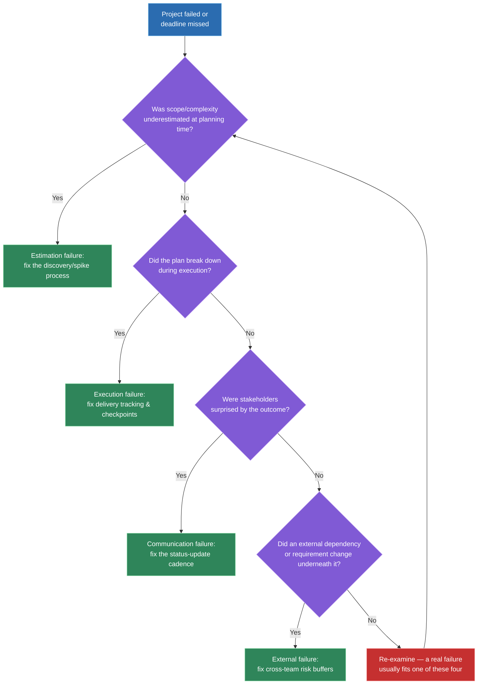
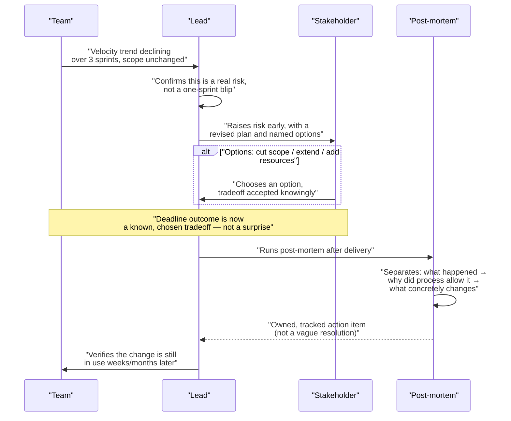

# Handling failed projects or missed deadlines

## 🎯 Executive Summary

"Tell me about a project that failed" is one of the highest-signal questions in a Lead-level loop, precisely because it's hard to fake well. Interviewers are listening for two specific things: does the candidate take real ownership, or do they quietly redirect blame onto "the requirements" or "the team"? And did the failure actually change anything — a new habit, a new check, a new default — or is it just a well-rehearsed war story that happens to end with "and I learned a lot"?

Most candidates answer this badly in one of two ways: either the failure is subtly reframed as someone else's fault, or it's told as a compelling story with no durable fix at the end. The goal of this topic is a repeatable structure — diagnosing why a project actually failed, catching a slip early enough to act, communicating it honestly, running a real post-mortem, and closing the loop with a concrete change — so the answer holds up under follow-up questions instead of collapsing.

## 🧠 Core Technical Deep Dive

### 1. Diagnosing why a project actually failed

Not all failures are the same failure, and the honest post-mortem response is different for each category. The first job — before you can tell this story well, and before you can fix anything — is naming which category you're actually in.

| Category | What actually happened | Whose judgment was wrong | Honest post-mortem response |
|---|---|---|---|
| **Estimation failure** | Scope or technical complexity was underestimated at planning time | The planner's (often yours) | Fix the estimation process — better spike/discovery step, wider padding on unknowns |
| **Execution failure** | The plan was sound, but delivery went wrong — a bug, a bad call mid-build, a dropped task | The team's, during execution | Fix the delivery process — better tracking, earlier checkpoints, clearer ownership |
| **Communication failure** | The outcome itself wasn't necessarily worse, but stakeholders were surprised by it | The reporting cadence, not the work | Fix the update cadence — status reporting that surfaces risk before it's unavoidable |
| **External/unforeseeable failure** | A dependency team missed their date, a requirement changed underneath the project | Genuinely outside your control | Fix the dependency-risk process — buffer, earlier cross-team check-ins, contingency planning |

These aren't mutually exclusive — a real failure is often two of these stacked (an estimation miss that also wasn't communicated early). But naming the dominant category first is what keeps the rest of the answer honest instead of vague.

> **Key takeaway:** "why did it fail" isn't one question — it's four different questions with four different fixes, and conflating them is how candidates end up with a post-mortem that identifies the wrong root cause.

### 2. Catching a slip early enough to act

By the time a deadline is missed and announced, the useful window for action has already closed — the real Lead-level skill is catching the slip weeks earlier, when there's still time to do something about it. This means tracking a different signal than "are we on the burndown chart."

The signal that actually predicts a miss is **velocity trend against remaining scope**, not point-in-time status. A team that's 60% done at the halfway mark looks fine on a status report; a team whose velocity has been declining for three straight sprints while scope hasn't shrunk is heading for a miss, even if this week's number still looks okay in isolation.

| Leading indicator | What it catches |
|---|---|
| Velocity trend over the last 3+ cycles, not the latest one | A slow-motion slip that a single snapshot hides |
| Scope growth rate vs. burn-down rate | Scope creep quietly outpacing delivery |
| Time-to-resolve for blocking dependencies | A cross-team dependency drifting from "on track" to "silent" |
| Confidence check-ins with the actual engineers doing the work, not just the tracker | The gap between what the board says and what people privately know |

The discipline that matters here is raising a risk the moment it becomes a *real* risk — not waiting for certainty, and not waiting until it's unavoidable. Raising it early costs a slightly uncomfortable conversation; raising it late costs trust.

> **Key takeaway:** the leading indicator that predicts a miss is a velocity trend against remaining scope, not a snapshot status — and the discipline is raising it the moment it's a real risk, not sitting on it until it's certain.

### 3. Communicating a miss once it's real

Once a deadline genuinely can't be hit, how you communicate it matters almost as much as the miss itself. The difference between a status update that damages trust and one that doesn't is almost entirely about timing and content, not tone.

| Bad status update | Good status update |
|---|---|
| Delivered at or after the deadline | Delivered as soon as the risk is confirmed, well before the deadline |
| "We're behind" with no further detail | A concrete revised plan with named options |
| One option presented as the only path | Multiple options, each with an explicit tradeoff |
| Framed to minimize how bad it looks | Framed to be accurate, even when that's uncomfortable |

The options themselves should be genuinely differentiated, not one real option and two straw men:

- **Cut scope** — ship the core on time, defer a named set of features, with the tradeoff stated (what value is delayed, for whom).
- **Extend the timeline** — hit full scope later, with a stated new date and what makes that date more trustworthy than the last one.
- **Add resources** — bring in more people, with the tradeoff stated (ramp-up cost, Brooks's-law risk on a project already in trouble).

A status update that just says "we're behind" outsources the decision to the stakeholder with no information to decide well. A status update with named, tradeoff-explicit options is doing the stakeholder's risk analysis for them, which is exactly what a Lead is expected to do.

> **Key takeaway:** the update that preserves trust is early, specific, and comes with real options and real tradeoffs — "we're behind" is not a status update, it's a confession with no plan attached.

### 4. Running a real blameless post-mortem

A post-mortem that's actually useful separates three distinct questions, and running them together is the most common way post-mortems fail to produce lasting change.

| Question | What it captures | Common mistake |
|---|---|---|
| **What happened?** | Facts and timeline, no interpretation yet | Skipping straight to blame before the facts are agreed on |
| **Why did the process allow it?** | Systemic gaps — what should have caught this and didn't | Stopping at "X person made a mistake" instead of asking why the process let that mistake reach production/deadline |
| **What changes so it can't happen the same way again?** | Concrete, owned, tracked action items | Vague resolutions ("we'll communicate better") with no owner or follow-up |

The middle question is the one people skip under social pressure, because it's more comfortable to land on an individual than to interrogate the process. But an individual mistake in a healthy system gets caught before it costs a deadline — if it didn't get caught, the process has a real gap worth naming, separate from whoever made the original mistake.

The third question is where most post-mortems quietly die. "We'll communicate better" isn't an action item — it has no owner, no due date, and nothing to check three months later. A real action item looks like "add a mandatory risk-flag checkbox to the weekly status template, owned by the Lead, reviewed at the next retro" — the same accountability-loop discipline that makes any retro action item durable rather than decorative.

> **Key takeaway:** a post-mortem that blends facts, blame, and fixes into one conversation produces a story; separating "what happened" from "why did the process allow it" from "what concretely changes" is what produces a fix that survives past the meeting where it was proposed.

### 5. What genuine ownership sounds like in the interview room

Everything above is the diagnostic framework — this section is how it actually gets said out loud, because a technically correct framework delivered defensively still fails the interview.

Ownership needs to be specific and personal, not diffused into "the team" or "the requirements changed on us." The interviewer is listening for a real, named misjudgment: a call you made, an assumption you didn't validate, a risk you saw and didn't escalate fast enough. This is uncomfortable by design — that discomfort is what makes it read as genuine rather than rehearsed.

At the same time, genuine ownership isn't the same as owning things that weren't yours. If a dependency team genuinely missed a date, say that plainly — the honest answer often has both a real personal misjudgment *and* a real external factor, and naming both without inflating or minimizing either is what reads as credible. Pretending an external failure was entirely your fault is its own kind of dishonesty, and experienced interviewers can usually tell.

The answer has to close with the concrete, lasting change — not "I learned to communicate better" in the abstract, but the specific process, checklist, or habit that exists now because of this failure, and evidence it's actually still in use.

> **Key takeaway:** the interview-room version of ownership names a specific personal misjudgment (not "the team," not "requirements"), is honest about genuinely external factors without hiding behind them, and ends with a concrete change that's still in place — not a moral of the story.

## 📊 Visual Architecture & Logic

### Diagram 1 — Diagnosing a failure and routing to the right fix

### Diagram 2 — From leading indicator to durable fix

## 🏢 Interview Context & FAANG Signals

"Tell me about a project that failed" and "tell me about a time you missed a deadline" are among the most-asked Lead-level behavioral prompts across FAANG loops — nearly every Lead/Staff behavioral round includes some variant of it, because it's one of the few questions that reliably separates genuine seniority from a well-rehearsed story.

**Lead signals interviewers listen for:**

- A specific, personal misjudgment named plainly — not "the team," not "requirements changed on us."
- A clear diagnosis of *why* it failed (estimation / execution / communication / external), not a vague "things went wrong."
- Evidence the slip was caught and escalated before it became unavoidable, or an honest account of why it wasn't.
- A revised plan communicated with real options and real tradeoffs, not just "we're behind."
- A post-mortem that produced a concrete, still-in-use process change — not a moral of the story.
- Honesty about genuinely external factors, without hiding behind them.

A **Senior** answer is often a genuinely well-told story: clear narrative, honest about the failure, ends with "and I learned a lot." A **Lead** answer has all of that *plus* a durable process change that outlived the meeting where it was decided — the difference isn't how well the story is told, it's whether anything is different today because of it.

## ⚔️ Lead Level vs Senior Level

A **Senior** response typically narrates the failure clearly and honestly, names what went wrong, and closes with a general lesson: "I learned to communicate risk earlier" or "I learned to pad estimates more."

A **Staff/Lead** response goes further in three specific ways. First, the diagnosis is structural, not just descriptive — they can name *which category* of failure it was (estimation, execution, communication, external) and why that category, not just what happened. Second, the ownership is specific and uncomfortable — a named personal misjudgment, not a diffused "the team" or "requirements changed," while still being honest about what was genuinely external. Third, and most tellingly under follow-up questions, they can describe the *concrete, still-in-use* change that resulted — a specific checklist item, a specific status-report field, a specific escalation threshold — and, if pushed, evidence it actually stuck rather than quietly lapsing after a few weeks.

## ⚠️ Common Pitfalls & Anti-Patterns

> ### ✕ Answering with "the requirements changed" or "the team missed it" as the root cause
> **Why it's wrong:** Diffusing the failure onto an external party or the collective team, with no personal misjudgment named, reads as blame-deflection even when some of it is genuinely true — interviewers are specifically listening for whether the candidate takes real ownership.
> **✓ Correct Lead Approach:** Name a specific personal misjudgment first — an assumption not validated, a risk not escalated fast enough — and only then add genuinely external factors, stated honestly rather than as the headline excuse.

> ### ✕ Telling a compelling story with a vague "I learned a lot" close
> **Why it's wrong:** A story with no concrete, lasting change is a retelling, not evidence of growth — it signals the failure was processed emotionally but never structurally, which is exactly what separates Senior from Lead on this question.
> **✓ Correct Lead Approach:** Close with a specific, still-in-use process change — a checklist item, a status-report field, an escalation threshold — and be ready to describe evidence it's still followed.

> ### ✕ Announcing the miss only at or after the deadline
> **Why it's wrong:** By the time a miss is announced at the deadline, the window to act on it has already closed, and it reads as either poor tracking or a deliberate delay in surfacing bad news — both erode trust badly.
> **✓ Correct Lead Approach:** Track velocity trend against remaining scope continuously, and raise the risk the moment it's real, not once it's certain and unavoidable.

> ### ✕ Running a post-mortem that lands on an individual instead of the process
> **Why it's wrong:** Landing on "person X made a mistake" stops the analysis one level too shallow — a healthy process should catch an individual mistake before it costs a deadline, and skipping that question means the same failure mode is still live.
> **✓ Correct Lead Approach:** Explicitly separate what happened, why the process allowed it, and what concretely changes — and treat the middle question as mandatory, not optional.

> ### ✕ Presenting a stakeholder update with only one option, framed as the only path
> **Why it's wrong:** A single "here's the new date" update outsources no real decision to the stakeholder and hides the tradeoffs that a Lead is specifically expected to have already thought through.
> **✓ Correct Lead Approach:** Present cut-scope / extend-timeline / add-resources as named options, each with an explicit tradeoff, so the stakeholder is making an informed choice rather than absorbing a fait accompli.

## 🛠️ Practice Scenarios

### Scenario 1 — A Launch Date Was Missed Because Complexity Was Underestimated

A feature launch slipped by six weeks because the technical complexity of a migration was significantly underestimated during planning.

Staff-Level Solution

Diagnose this explicitly as an estimation failure, not an execution one — the plan was followed reasonably well, but the plan itself was built on a wrong estimate. Name the specific personal misjudgment: not doing a technical spike before committing to the date, or trusting a surface-level scope read over a deeper investigation.

Close with the concrete fix: a mandatory discovery spike before any date commitment above a certain complexity threshold, still in use, with a specific example of a later project where it caught a similar risk before a date was ever promised.

### Scenario 2 — A Project Was Cancelled After Months of Work

After four months of development, leadership cancelled a project due to a shifted business priority — the work itself was on track.

Staff-Level Solution

Separate the outcome from the failure category honestly: this is closer to an external/unforeseeable factor if the priority shift was genuinely outside the team's visibility, but probe whether there were earlier signals of shifting priority that weren't escalated — that's the personal-ownership thread even in an externally-driven cancellation.

Name what changed afterward: a lighter-weight checkpoint with the business sponsor at a fixed cadence, specifically to surface a priority shift while there's still time to pivot scope rather than absorb a full write-off — and be candid that this doesn't fully prevent cancellations, it just shrinks the sunk cost when one happens.

### Scenario 3 — A Deadline Was Missed Because a Dependency Team Didn't Deliver

The project's own work was on schedule, but a dependency team's API wasn't ready, and that missed the shared deadline.

Staff-Level Solution

Classify this as an external failure, but resist the temptation to stop there — ask what warning signs about the dependency's progress existed before the deadline and whether they were tracked. If there was a leading indicator that was missed or under-escalated, name that specifically as the personal misjudgment, distinct from the dependency team's own delivery failure.

Describe the resulting change: cross-team dependencies now get their own tracked check-in cadence with an explicit buffer in the plan, not an assumed on-time handoff — and that this buffer is sized based on the dependency's own track record, not optimism.

### Scenario 4 — A Project Shipped on Time but Was a Quiet Failure in Outcome

The feature launched on schedule, hit every planning milestone, but adoption numbers after release were far below what justified the investment.

Staff-Level Solution

Name this explicitly as a different failure than a deadline miss — this is a failure of validating the problem, not the delivery process, and conflating the two would misdiagnose the fix. Own the specific misjudgment: insufficient upfront validation that the feature solved a real, sized problem before committing months of build time to it.

Close with the concrete change: a lightweight validation gate (a smaller prototype, a direct customer signal check) required before a project of a certain size gets greenlit, and a specific later project where that gate caused a scope change or a kill decision before significant investment was sunk.

### Scenario 5 — Communicating a Slip to an Executive With Minimal Notice

Two days before a date leadership has already communicated externally, it becomes clear the team won't hit it.

Staff-Level Solution

Acknowledge the bad situation honestly rather than softening it — this is a case where the slip should have been visible earlier, and saying so directly is part of the ownership, not a detail to skip past. Bring the executive a revised plan immediately, not just the bad news: named options (ship a reduced scope on the original date / take a short, defined extension / pull in support), each with the real tradeoff stated plainly.

Afterward, name the process gap that let this surface only two days out — likely a missing leading-indicator check earlier in the cycle — and the specific tracking change made so a slip of this size gets caught with real runway next time, not just goodwill on how the news was delivered this time.

### Scenario 6 — Running a Post-Mortem Where a Well-Liked Teammate Made the Actual Mistake

The root cause traces to a specific, well-regarded engineer's decision, and the team is visibly reluctant to name it directly in the retro.

Staff-Level Solution

Keep the post-mortem structure disciplined specifically because of the social pressure — separate "what happened" (the factual decision and its consequence, stated neutrally) from "why did the process allow it" (was there a review or check that should have caught this and didn't) from "what changes." The individual's name doesn't need to be a focus of blame; the process gap does need to be named plainly.

As the Lead, model this directly by owning your own share first — did you set up a review step that would have caught this, and if not, that's your gap to name before anyone else's. This is usually what unlocks the room being honest about the rest, and the action item that comes out should target the process (an added review step, a changed default) rather than "be more careful," which isn't a fix.

### Scenario 7 — A Personal Misjudgment Directly Caused the Failure

The candidate made a specific technical or planning call, in hindsight clearly wrong, that was the direct cause of the missed deadline.

Staff-Level Solution

This is the cleanest version of the ownership answer, and the temptation to soften it should be resisted — state the misjudgment plainly and specifically (the actual call made, why it seemed reasonable at the time, and what information would have changed it), without qualifying it into vagueness.

Close with the concrete change that came directly from this specific misjudgment — not a generic lesson, but the exact check or habit now in place that would have caught this same call before it was made, and ideally a specific later instance where that check actually fired.

### Scenario 8 — Inheriting the Fallout of a Failure That Happened Under a Previous Manager

The candidate joined a team after a project had already failed under the prior lead, and had to handle the fallout — a frustrated stakeholder, a demoralized team, and no post-mortem had been run.

Staff-Level Solution

Be precise about scope of ownership here — claiming personal responsibility for decisions made before joining isn't honest, but taking ownership of *how the fallout was handled* from the point of arrival is exactly the right scope, and stating that distinction clearly avoids both overclaiming and dodging.

Describe running the missing post-mortem retroactively — facts and timeline first, even reconstructed after the fact, then the systemic "why did the process allow it," then a concrete forward-looking change — framed as fixing the team's process going forward rather than assigning blame to a manager who isn't in the room to respond. Close with the specific trust-rebuilding step taken with the stakeholder: an honest accounting of what happened plus a credible new commitment, not a promise wrapped in vague reassurance.

