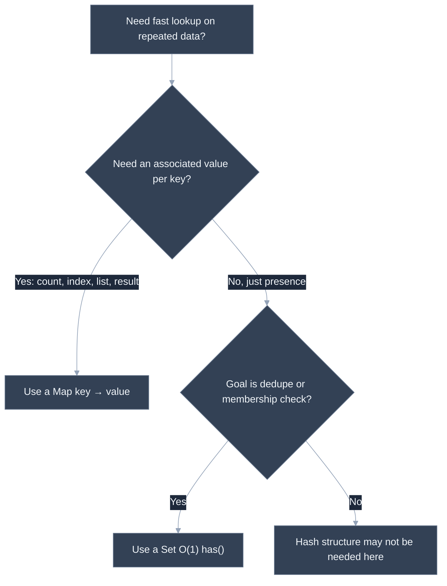
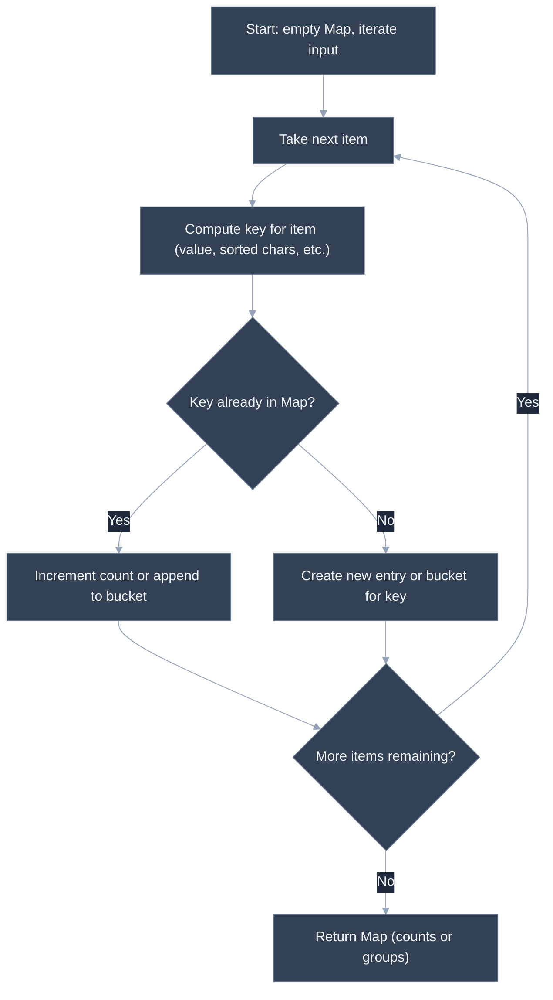

# Hash Maps and Sets: Frequency Counts, Grouping

---

## 🎯 Executive Summary

Hash maps and sets are the single most reached-for data structures in coding interviews, precisely because so many "obviously O(n²)" problems collapse to O(n) the moment you trade repeated linear scans for O(1) average-case lookups. Two Sum, Group Anagrams, Longest Consecutive Sequence, and a huge fraction of "have I seen this before" problems all reduce to the same underlying move: build a structure that lets you ask "does this exist, and what's associated with it" in constant time, instead of scanning the rest of the array every time you need to know.

This topic is rated "Easy" in most prep plans, and that's accurate for *using* a hash map or set once you know to reach for one — the syntax is trivial. But the actual interview signal isn't syntax, it's **judgment**: knowing precisely when a Map's key-to-value association is needed versus when a Set's plain existence check is enough, understanding what "average-case O(1)" actually depends on (a well-distributed hash function, and amortized resizing), and being fluent enough with derived keys (sorted strings, character-count signatures, coordinate tuples) to apply grouping problems that don't hand you an obvious key.

**Why this is a must-know for Leads:** hash maps and sets are the connective tissue underneath sliding window (frequency maps for "contains all characters"), prefix sums (running-sum-to-count maps), and graph problems (visited sets, adjacency maps) — a Lead who's fluent here moves faster through every other DSA topic, and can spot "this smells like a hash map problem" as an instinct rather than a memorized checklist.

---

## 📖 What Is It? (Plain-English Definition)

**In plain terms:** a hash map is a lookup table that lets you store a value under a key and retrieve it later in roughly constant time, no matter how many keys are stored. A set is the same idea stripped down to just "is this thing in here or not," with no associated value.

Think of a hash map like a coat check: you hand over your coat (the value) and get a ticket number (the key); later, showing that ticket retrieves your exact coat instantly, without the attendant checking every coat on the rack. A set is like a guest list at the door — the bouncer only needs to answer "is this name on the list," never "what seat does this person have."

Under the hood, both are built on the same mechanism: a **hash function** converts a key into an array index, so a "search" becomes "compute the index, then look there directly" instead of "walk the whole structure comparing keys one by one." That's what makes lookups, insertions, and deletions average O(1) instead of O(n) — you're trading a linear scan for a computed jump straight to (approximately) the right place.

JavaScript gives you both natively: `Map` for key-value association (preserves insertion order, allows any value as a key), and `Set` for existence/uniqueness (also insertion-ordered, stores only values). A plain object (`{}`) can sometimes stand in for a `Map` but comes with gotchas — string-only keys, inherited prototype properties — that `Map` avoids cleanly, which is why `Map`/`Set` are almost always the better default in interview code.

---

## 🧠 Core Technical Deep Dive

### Pattern Recognition — How to Spot This Category of Problem

The core decision is Map vs. Set vs. neither, and the tells are concrete:

**Reach for a hash map (`Map`) when:**
- You need O(1) average lookup **and** an associated value — a count, an index, a list of items, a computed result.
- The problem phrase is some version of "have I seen this before, and if so, what was it / where was it / how many times" — Two Sum ("have I seen the complement, and at what index"), frequency counting ("how many times has this character appeared"), or grouping ("which bucket does this belong to, and what else is in that bucket").
- You need a **complement lookup** — given the current element, compute what other value would combine with it to satisfy some condition (a target sum, a matching bracket, an anagram signature), and check for that computed value's presence *and* associated data.
- You're memoizing — caching a computed result keyed by its input, to avoid recomputation (classic in recursion/DP problems).

**Reach for a set (`Set`) when:**
- You only need existence-checking, with **no associated value** — "has this element appeared already," "is this coordinate already visited," "is this word in the dictionary."
- **Deduplication** is the whole task — removing duplicates from a collection, or checking whether a collection has any duplicates at all.
- You need fast **membership testing** against a fixed collection that you'll query repeatedly (e.g., "is this character a vowel," checked against a small fixed `Set` of vowels, though for very small fixed sets this is more about readability than raw performance).

**A concrete discriminator when unsure:** ask "if I find this key, do I need to know anything about it beyond the fact that it exists?" If yes — a value, a count, an index — it's a `Map`. If the answer is purely "yes/no, it's there" — it's a `Set`.

### Two Sum — the canonical complement lookup

The brute-force approach checks every pair: for each element, scan the rest of the array for a partner summing to the target — O(n²). A hash map inverts the question: instead of asking "does some later element complete this one," track what you've *already seen* and ask "does the current element complete something I saw earlier."

```javascript
function twoSum(nums, target) {
  const seen = new Map(); // value -> index
  for (let i = 0; i < nums.length; i++) {
    const complement = target - nums[i];
    if (seen.has(complement)) return [seen.get(complement), i];
    seen.set(nums[i], i);
  }
  return [];
}
```

The insight worth stating out loud in an interview: this only requires **one pass**, because by the time you reach index `i`, every index `j < i` is already in the map — so checking "has the complement of `nums[i]` already occurred" is equivalent to checking every earlier pair, without actually looping over them again.

### Grouping by a derived key

Not every grouping problem hands you an obvious key — sometimes you have to compute one. The pattern is always: iterate the input, derive a key from each item that's identical for items that belong together, then bucket by that key in a `Map`.

```javascript
function groupAnagrams(strs) {
  const groups = new Map();
  for (const str of strs) {
    const key = str.split('').sort().join(''); // canonical form: sorted characters
    if (!groups.has(key)) groups.set(key, []);
    groups.get(key).push(str);
  }
  return Array.from(groups.values());
}
```

Two anagrams sort to the identical string, so the sorted string is a canonical key that's the same for every member of a group and different across groups. The `O(k log k)` sort per string (where `k` is string length) is a deliberate trade — a character-count signature (a 26-length array or a string like `a2b1c0...`) achieves the same grouping in O(k) per string instead, which is worth mentioning as an optimization for long strings even if you implement the simpler sorted-key version first.

### Sets for O(n) existence-heavy problems

The signature move: converting an array to a `Set` up front turns "does this value exist in the collection" from an O(n) scan into an O(1) average lookup, which is what makes an otherwise-quadratic "check every element against every other element" problem collapse to linear.

```javascript
function hasDuplicate(nums) {
  return new Set(nums).size !== nums.length;
}
```

This is deceptively simple but the reasoning matters: a `Set` built from an array automatically discards duplicates, so comparing its `size` against the original array's length is a constant-time proxy for "did any duplicates exist" — no explicit duplicate-finding loop needed at all.

### Why average O(1), not worst-case O(1)

Worth being precise about in a Lead-level answer: hash map/set operations are **average-case** O(1), not guaranteed O(1). Every key hashes to a bucket; if many keys collide into the same bucket (a pathological hash function, or an adversarially constructed input), operations in that bucket degrade toward O(n) in the worst case. JavaScript engines mitigate this with good default hash functions and dynamic resizing (rehashing into more buckets as load factor grows), which is why in practice — and in every interview-scale input — Map/Set behave as O(1), but stating "average case, assuming a reasonable hash distribution" instead of an unqualified "O(1)" is the kind of precision that separates Lead-level answers.

---

## 📊 Visual Architecture & Logic

### Diagram 1 — Which Structure Do I Need?



### Diagram 2 — Frequency Counting / Grouping Mechanism



---

## 🏢 Interview Context & FAANG Signals

| Interview Stage | Format |
| --- | --- |
| Coding Round 1 (warmup) | Two Sum or a frequency-counting variant, expected to be solved in under 10 minutes with the optimal approach, not the brute force |
| Coding Round 2 | Grouping or "longest run" problems that require deriving a non-obvious key, or combining a Set with another technique (e.g., sliding window with a frequency map) |
| Live pairing / whiteboard follow-up | "What if the input were a stream you couldn't hold in memory all at once?" — probes whether the candidate understands the memory trade-off hash structures make |

**Lead signals interviewers listen for:**

1. **Immediate pattern recognition** — reaching for a hash map/set as the *first* idea for a "have I seen this" problem, rather than arriving at it after proposing brute force and being asked to optimize.
2. **Unprompted complexity statement** — stating that the optimized approach is O(n) time / O(n) space, and explicitly contrasting it against the O(n²) or O(n log n) brute-force alternative.
3. **Map vs. Set judgment** — correctly choosing the leaner structure (a `Set` when no value is needed) rather than defaulting to a `Map` for everything, which signals precise thinking rather than pattern-matching to "hashmaps are the answer."
4. **Precision about average vs. worst case** — volunteering that hash structure operations are average-case O(1), dependent on hash distribution, not an unconditional guarantee.
5. **Proactive edge-case handling** — empty input, no valid answer existing, and duplicate values in the input addressed before the interviewer has to point them out.

---

## ⚔️ Lead Level vs Senior Level

**Question:** "Given an unsorted array of integers, find the length of the longest sequence of consecutive integers (e.g., in `[100, 4, 200, 1, 3, 2]`, the answer is 4, for the sequence `1, 2, 3, 4`). What's your approach?"

> **Senior Response:** "I'd sort the array first, then walk through it once and count how long each run of consecutive numbers is, tracking the longest. Sorting is O(n log n), and the walk is O(n), so overall O(n log n)."

This is correct and passes, but it's not the optimal approach, and it wasn't compared against one — an interviewer probing for Lead-level depth will ask "can you do better than O(n log n)?"

> **Staff/Lead Response:** "I can do this in O(n) instead of O(n log n) by avoiding the sort entirely. I'll put every number into a `Set` for O(1) membership checks. Then, for each number, I only start counting a sequence if `number - 1` is *not* in the set — that means this number is the start of a run, not the middle of one. From a valid start, I walk forward checking `number + 1`, `number + 2`, and so on, as long as they're in the set, tracking the run length. Because I only ever start counting from a true sequence start, every number gets visited at most twice across the whole algorithm — once as a candidate check, and once more only if it's actually part of the run being walked — so the total work stays O(n) even though there's a nested-looking while loop, and space is O(n) for the set. I'd only fall back to the sort-based approach if there were a hard memory constraint that ruled out the extra O(n) space."

The Lead response identifies and eliminates the unnecessary O(n log n) sort, gives the precise amortized-cost argument for why the nested loop is still linear overall, and states the one condition (a memory constraint) under which the simpler sort-based approach would actually be the right trade-off instead.

---

## ⚠️ Common Pitfalls & Anti-Patterns

> ### ✕ Defaulting to a Plain Object Instead of `Map`
>
> **Why it's wrong:** Plain objects coerce all keys to strings (so numeric and object keys silently collide or behave unexpectedly), carry inherited prototype properties that can produce false positives on `in` or unguarded property checks, and don't track size directly or preserve insertion order as reliably across all engines/operations as `Map` does.
>
> **✓ Correct Lead Approach:** Default to `Map` for key-value association and `Set` for existence checks in interview code — both offer cleaner semantics, `.size`/`.has()` built in, and no prototype-pollution surprises, and naming this as the reason (not just habit) signals awareness of a real, if subtle, JavaScript gotcha.

---

> ### ✕ Using a Map When a Set Would Do
>
> **Why it's wrong:** Reaching for `Map` with a throwaway value (`map.set(key, true)`) when all that's actually needed is existence-checking adds unnecessary conceptual overhead and signals pattern-matching ("hashmaps solve everything") rather than precise structure selection.
>
> **✓ Correct Lead Approach:** Ask "do I need an associated value, or just presence?" before choosing — if the answer is purely presence, use a `Set`, which communicates intent more clearly to anyone reading the code and avoids a meaningless placeholder value.

---

> ### ✕ Forgetting That Object/Array Keys Don't Work as Expected in a Plain Object
>
> **Why it's wrong:** Using an object or array as a key in a plain `{}` silently stringifies it (typically to `"[object Object]"`), so distinct objects used as keys collide into the same string key — a bug that produces wrong-but-plausible results instead of an error.
>
> **✓ Correct Lead Approach:** Use `Map`, which supports arbitrary values (including objects) as keys by reference, not by stringified value — each distinct object reference is a distinct key, which is almost always the intended behavior when keying by something other than a primitive.

---

> ### ✕ Assuming Insertion Order Doesn't Matter, Then Being Surprised by Iteration Order
>
> **Why it's wrong:** Iterating a `Map` or `Set` in JavaScript always visits entries in insertion order — relying on some other order (like numeric or sorted order) without explicitly sorting first produces bugs that only show up with certain input orderings, making them hard to reproduce.
>
> **✓ Correct Lead Approach:** If a problem's output must be in sorted or otherwise-derived order (not insertion order), explicitly sort before returning — don't assume the map's natural iteration order happens to match what's needed, even though it may coincidentally work for some test inputs.

---

> ### ✕ Not Accounting for the Extra O(n) Space When Claiming an "Optimal" Solution
>
> **Why it's wrong:** Converting a time complexity from O(n log n) or O(n²) down to O(n) using a hash map/set is a real win, but it isn't free — it trades time for O(n) auxiliary space. Presenting the hash-based solution as strictly superior without naming that trade-off omits a dimension the interviewer is explicitly listening for.
>
> **✓ Correct Lead Approach:** State both complexities together as a trade-off — "O(n) time, O(n) space, versus the O(n log n) time, O(1) extra space alternative" — and, if asked, be ready to discuss when the space cost would actually matter (very large inputs, memory-constrained environments).

---

## 🛠️ Practice Problems

### Problem 1: Two Sum

**Problem:**
```javascript
/**
 * Given an array of integers `nums` and an integer `target`, return the
 * indices of the two numbers that add up to `target`. Assume exactly one
 * valid answer exists, and the same element may not be used twice.
 * @param {number[]} nums
 * @param {number} target
 * @returns {number[]} a two-element array of indices, e.g. [i, j]
 */
function twoSum(nums, target) {
  // your implementation
}
```

Return the indices in the order they're found (the earlier-seen element's index first), as `[i, j]` with `i < j`.

**Examples:**
```
Input: nums = [2, 7, 11, 15], target = 9
Output: [0, 1]
Explanation: nums[0] + nums[1] = 2 + 7 = 9.
```
```
Input: nums = [3, 2, 4], target = 6
Output: [1, 2]
Explanation: nums[1] + nums[2] = 2 + 4 = 6 (index 0's value, 3, is not part of the answer).
```

**Edge cases to handle:**
- No pair sums to `target` (define a sensible return, e.g. an empty array)
- Multiple pairs could sum to the target, but only one valid answer is expected/returned
- Duplicate values in the array (e.g. `nums = [3, 3]`, `target = 6` should still return `[0, 1]`)

<details>
<summary>💡 Hint 1</summary>

The brute-force approach checks every pair — O(n²). Think about what you'd need to remember about the elements you've already looked at, so that for each new element you can immediately tell whether some *earlier* element would complete the pair.

</details>

<details>
<summary>💡 Hint 2</summary>

A hash map keyed by value, storing each value's index, lets you check "have I already seen the number that would complete this pair" in O(1), instead of scanning backward through everything you've seen so far.

</details>

<details>
<summary>💡 Hint 3</summary>

Walk the array once. For each element, compute its complement (`target - currentValue`). Check the map for that complement *before* inserting the current element — if it's there, you've found your answer (the stored index, plus the current index). If not, insert the current value and its index into the map and continue.

</details>

<details>
<summary>✅ Reveal Solution</summary>

```javascript
function twoSum(nums, target) {
  const seen = new Map(); // value -> index
  for (let i = 0; i < nums.length; i++) {
    const complement = target - nums[i];
    if (seen.has(complement)) {
      return [seen.get(complement), i];
    }
    seen.set(nums[i], i);
  }
  return [];
}
```

**Why it works:** checking the map *before* inserting the current value guarantees the returned pair uses two distinct indices — the complement, if found, was necessarily seen at an earlier index. This directly implements the Hint 3 approach: one pass, checking for the complement first, inserting second.

**Time complexity:** O(n) — a single pass over the array with O(1) average-case map lookups and insertions per element.
**Space complexity:** O(n) — in the worst case (no early match), every element gets inserted into the map before a match is found.

</details>

---

### Problem 2: Group Anagrams

**Problem:**
```javascript
/**
 * Given an array of strings `strs`, group the anagrams together. Two strings
 * are anagrams if one can be rearranged into the other using all the same
 * characters. Return the groups as an array of arrays; order of groups and
 * order of strings within a group does not matter.
 * @param {string[]} strs
 * @returns {string[][]} groups of anagrams
 */
function groupAnagrams(strs) {
  // your implementation
}
```

Assume all strings consist of lowercase English letters.

**Examples:**
```
Input: strs = ["eat", "tea", "tan", "ate", "nat", "bat"]
Output: [["eat","tea","ate"], ["tan","nat"], ["bat"]]
Explanation: "eat", "tea", and "ate" are all rearrangements of each other; order within/between groups may vary.
```
```
Input: strs = [""]
Output: [[""]]
Explanation: A single empty string forms its own group of one.
```

**Edge cases to handle:**
- Empty string(s) in the input array
- A string with no anagram partner (forms a group of one, by itself)
- All strings in the input being anagrams of each other (result is a single group)

<details>
<summary>💡 Hint 1</summary>

Anagrams share something in common that isn't the string itself — think about what property of a string stays identical no matter how its characters are rearranged.

</details>

<details>
<summary>💡 Hint 2</summary>

Two strings are anagrams exactly when they contain the same characters with the same frequencies. A canonical form — like the string's characters sorted alphabetically — is identical for every anagram of a given word and different for non-anagrams, making it a natural map key.

</details>

<details>
<summary>💡 Hint 3</summary>

Walk the input array once. For each string, compute its sorted-character form as a key. Use a hash map from key to a list of original strings; if the key isn't in the map yet, start a new list, then push the current string onto the list for its key. At the end, the map's values are exactly the anagram groups.

</details>

<details>
<summary>✅ Reveal Solution</summary>

```javascript
function groupAnagrams(strs) {
  const groups = new Map();
  for (const str of strs) {
    const key = str.split('').sort().join('');
    if (!groups.has(key)) {
      groups.set(key, []);
    }
    groups.get(key).push(str);
  }
  return Array.from(groups.values());
}
```

**Why it works:** sorting a string's characters produces a canonical representation that's identical for all of its anagrams and different from any non-anagram — exactly the key described in Hint 2. Grouping by that key in a map (Hint 3) collects every anagram of a given word into the same bucket in a single pass.

**Time complexity:** O(n · k log k) — for `n` strings of maximum length `k`, each string requires an O(k log k) sort to compute its key.
**Space complexity:** O(n · k) — the map stores every input string (across all buckets combined), plus the computed keys.

</details>

---

### Problem 3: Longest Consecutive Sequence

**Problem:**
```javascript
/**
 * Given an unsorted array of integers `nums`, return the length of the
 * longest run of consecutive integers (the integers do not need to appear
 * contiguously in the array itself, only be numerically consecutive).
 * Must run in O(n) time.
 * @param {number[]} nums
 * @returns {number} length of the longest consecutive sequence
 */
function longestConsecutive(nums) {
  // your implementation
}
```

A naive approach — sort the array, then scan for runs — works but is O(n log n); this problem specifically asks for an O(n) solution.

**Examples:**
```
Input: nums = [100, 4, 200, 1, 3, 2]
Output: 4
Explanation: The longest run is 1, 2, 3, 4 (order in the array doesn't matter — 4 and 100 and 200 are scattered elsewhere).
```
```
Input: nums = [0, 3, 7, 2, 5, 8, 4, 6, 0, 1]
Output: 9
Explanation: The run 0,1,2,3,4,5,6,7,8 has length 9; the duplicate 0 doesn't add to it.
```

**Edge cases to handle:**
- Empty array (no sequence exists — return `0`)
- All elements identical (longest run is length 1, since there's no actual consecutive neighbor)
- The array is already fully consecutive (the whole array is one run)

<details>
<summary>💡 Hint 1</summary>

Sorting gets you to O(n log n) easily, but the problem wants O(n). Think about how you could check "is `n - 1` present" or "is `n + 1` present" without scanning the array each time.

</details>

<details>
<summary>💡 Hint 2</summary>

Put every number into a `Set` for O(1) membership checks. The key trick for staying O(n) overall: only start counting a sequence from a number that is genuinely the *start* of a run — that is, a number `n` where `n - 1` is not in the set.

</details>

<details>
<summary>💡 Hint 3</summary>

Build the set of all numbers. For each number in the set, skip it unless `number - 1` is absent from the set (which means it's a sequence start). From each valid start, repeatedly check for `number + 1`, `number + 2`, and so on, counting how far the run extends, and track the longest run seen. Because you only ever walk forward from true starts, no number gets walked past more than once across the whole algorithm.

</details>

<details>
<summary>✅ Reveal Solution</summary>

```javascript
function longestConsecutive(nums) {
  const numSet = new Set(nums);
  let longest = 0;

  for (const num of numSet) {
    if (!numSet.has(num - 1)) { // only start counting from a true sequence start
      let current = num;
      let length = 1;
      while (numSet.has(current + 1)) {
        current++;
        length++;
      }
      longest = Math.max(longest, length);
    }
  }
  return longest;
}
```

**Why it works:** the `numSet.has(num - 1)` check (Hint 2) guarantees the inner `while` loop only ever runs starting from the true beginning of a sequence — every number that isn't a sequence start is skipped in O(1) instead of triggering its own walk. Because of that, every number in the set is visited by an inner-loop walk at most once across the entire outer loop, which is what keeps the total work linear despite the nested-looking loop (Hint 3).

**Time complexity:** O(n) — building the set is O(n), and although there's a `while` loop nested inside a `for` loop, each number is only ever extended-from once in total (not once per outer iteration), so the combined work across all iterations is O(n), not O(n²).
**Space complexity:** O(n) — the `Set` stores every distinct number from the input.

</details>

---

*Document version: September 2026 | Audience: Staff/Principal Frontend Engineer candidates | Topic ID: hashmaps-sets*
