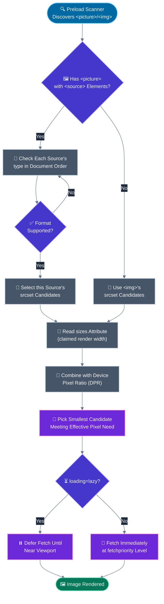
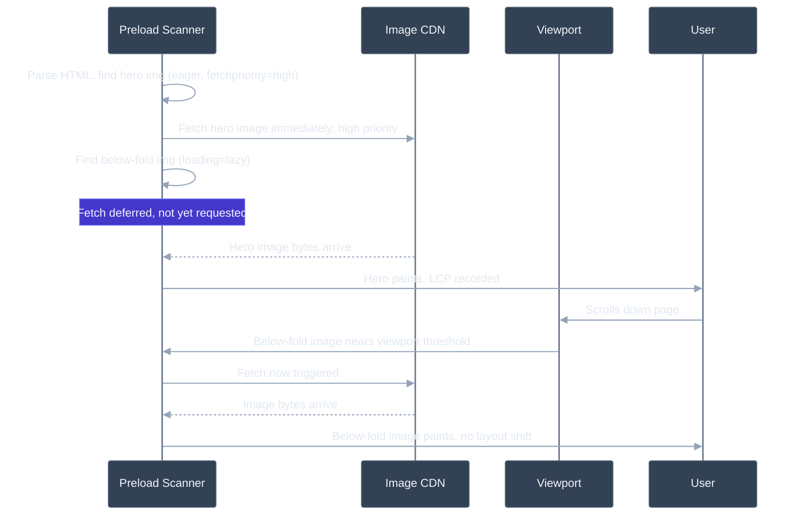

# Image optimisation: formats (WebP, AVIF), lazy loading, srcset

## 🎯 Executive Summary

Images are typically the single largest byte contributor to a page's weight, and on most content-heavy sites the LCP element is an image — which means image optimization isn't a peripheral performance task, it's usually *the* performance task. The lever set is well-documented (modern formats, responsive sizing, lazy loading) but each lever has a failure mode that actively regresses performance when misapplied, which is why this topic separates people who've read the MDN docs from people who've shipped it.

The single highest-stakes mistake in this space is applying a below-the-fold optimization (lazy loading) to an above-the-fold resource (the LCP image) — a one-line markup difference that can add hundreds of milliseconds to your most important metric. A Lead is expected to know not just the techniques, but the specific conditions under which each one helps versus hurts.

Why it's a must-know for Leads: this is one of the few performance areas where the "right" default differs *per image on the same page* — the hero image and the tenth image in an infinite feed need opposite loading strategies, opposite priority hints, and the decision has to be made correctly by every engineer adding an `` tag, not just the person who set up the image pipeline.

---

## 🧠 Core Technical Deep Dive

### Format landscape: what you're actually trading off

| Format | Compression | Alpha | Animation | Encode cost | Best for |
|---|---|---|---|---|---|
| **JPEG** | Lossy, DCT-based | No | No | Low | Universal fallback, photos |
| **PNG** | Lossless | Yes | No | Low | Screenshots, graphics with sharp edges/text |
| **WebP** | Lossy or lossless | Yes | Yes | Moderate | ~25-35% smaller than JPEG at comparable quality; safe modern default |
| **AVIF** | Lossy (AV1-based) or lossless | Yes | Yes | High (slow encode) | Best compression available (often 30-50% smaller than JPEG, frequently beats WebP too); best for static, build-time-generated assets |
| **SVG** | N/A (vector) | Yes | Yes (CSS/SMIL) | N/A | Icons, logos, illustrations — never for photos |

AVIF's encode cost is the detail most people miss: it's expensive enough that generating it on-the-fly per-request (rather than at build time or via a CDN with aggressive caching) can introduce meaningful latency on a cache miss. Decode cost on low-end devices is the mirror-image concern — very large AVIF images can be slower to decode than an equivalent WebP on weak CPUs, which matters for large hero images specifically, less so for small thumbnails.

> **Key takeaway:** AVIF is usually the best choice for static, pre-generated assets where encode cost is paid once at build time; WebP remains the safer default for anything generated or transformed on demand.

### `<picture>` and content negotiation

```html
<picture>
  <source srcset="hero.avif" type="image/avif">
  <source srcset="hero.webp" type="image/webp">
  
</picture>
```

The browser evaluates `<source>` elements in order and uses the first one whose `type` it supports, falling back to the `` if none match — this is client-driven negotiation, resolved without any server involvement. The alternative, server-side content negotiation via the `Accept` header, requires careful cache-key handling (`Vary: Accept`) to avoid serving the wrong format to users behind a shared cache or CDN edge that doesn't vary by that header correctly.

> **Key takeaway:** prefer `<picture>` with explicit `type` sources over relying purely on server-side `Accept`-header sniffing — it's correct by construction and doesn't depend on your CDN's cache-key configuration being right.

### Resolution switching vs. art direction: not the same problem

These are the two distinct reasons to use responsive image markup, and conflating them leads to overcomplicated or broken markup:

| | Resolution switching | Art direction |
|---|---|---|
| **Problem solved** | Same image, different pixel density/rendered size needed | Genuinely different crop/composition needed per viewport |
| **Mechanism** | `srcset` + `sizes` on a plain `` | `<picture>` with `media` queries per `<source>` |
| **Example** | Serving a 2x-density image to a Retina display | Serving a tight portrait crop on mobile vs. a wide landscape crop on desktop |

```html
<!-- Resolution switching: same image, browser picks best-fit size -->


<!-- Art direction: genuinely different images per breakpoint -->
<picture>
  <source media="(max-width: 600px)" srcset="hero-portrait.jpg">
  <source media="(min-width: 601px)" srcset="hero-landscape.jpg">
  
</picture>
```

> **Key takeaway:** if it's the same photo just at a different size, use `srcset`/`sizes` on a plain ``; only reach for `<picture>` with `media` queries when the actual visual content needs to differ.

### How the browser picks a `srcset` candidate

The `sizes` attribute tells the browser the image's rendered CSS width *before* layout and CSS are fully resolved — this has to be knowable early because resource selection happens during the preload scanner's pass, well before the render tree exists. The browser combines that claimed width with the device's pixel ratio (DPR) to pick the smallest `srcset` candidate that satisfies the effective pixel requirement.

`w` descriptors (`800w`) describe each candidate's intrinsic width and require a `sizes` attribute to be meaningful across a responsive layout. `x` descriptors (`2x`) describe a fixed density multiplier and implicitly assume the image renders at one constant CSS size regardless of viewport — using `x` descriptors on an image whose rendered width actually changes with viewport (e.g., full-width on mobile, one-third width on desktop) causes the browser to pick the wrong candidate at some breakpoints.

> **Key takeaway:** if your image's rendered size is responsive (changes with viewport), you need `w` descriptors + `sizes`, not `x` descriptors — `x` only works for images at a fixed CSS size.

### Lazy loading: correct by default, catastrophic when misapplied

`loading="lazy"` tells the browser to defer the image's fetch until it's within a heuristic distance of the viewport — the exact margin isn't spec-fixed and varies by browser and effective connection speed. This is unambiguously good for below-the-fold images: less initial bandwidth, faster initial page weight.

It is unambiguously bad on the LCP candidate. The preload scanner still discovers a `loading="lazy"` image early, but deliberately declines to prioritize its fetch — by design, since the entire point of the attribute is "don't fetch this until we know it's needed." An LCP image, by definition, needs to be fetched as early as possible; lazy-loading it directly works against the metric it's supposed to help.

```html
<!-- Correct: LCP candidate, eager + high priority -->


<!-- Correct: below-the-fold, lazy -->

```

`loading` and `fetchpriority` are orthogonal controls: `loading` decides *whether/when* the browser starts the fetch relative to viewport proximity; `fetchpriority` adjusts the resource's priority *within* the browser's network priority queue once the fetch is eligible to start. For the LCP image, you generally want both defaults changed — `loading="eager"` (or simply omitted, since eager is the default) and `fetchpriority="high"`.

> **Key takeaway:** exactly one image on a typical page — the LCP candidate — should never be lazy-loaded; every other below-the-fold image should almost always be lazy-loaded by default.

### Image decoding and the main thread

`decoding="async"` hints that the browser can decode the image off the critical path, without blocking presentation of other content while a large image finishes decoding. This matters most for large images decoded well after initial load (e.g., a big image swapped in via JS) — decoding a multi-megapixel image synchronously can produce a visible stutter.

> **Key takeaway:** `decoding="async"` is low-risk and broadly beneficial for any non-trivial image; there's rarely a reason to omit it.

---

## 📊 Visual Architecture & Logic

### Diagram 1 — Browser Resource Selection for a Responsive Image



### Diagram 2 — Hero Image vs. Below-Fold Image on Page Load



---

## 🏢 Interview Context & FAANG Signals

### Where This Appears

| Interview Stage | Format |
|---|---|
| **Coding Round** | "Add responsive images to this component" — tests `srcset`/`sizes` correctness, not just format knowledge |
| **Performance Round** | "LCP regressed after we added lazy loading site-wide — why?" |
| **System Design** | "Design the image pipeline for a marketplace with millions of user-uploaded photos" |
| **Debugging Round** | Given a Lighthouse report flagging "properly size images" and "serve images in next-gen formats" — prioritize the fixes |

### Lead Signals Interviewers Are Looking For

1. **The lazy-loading/LCP exception, stated unprompted** — this is the single most common trap, and Leads flag it before being asked.
2. **Format trade-off precision** — knowing AVIF's encode cost implications for a dynamic pipeline, not just "AVIF is smaller."
3. **Resolution switching vs. art direction distinction** — using the right mechanism for the right problem, not defaulting to `<picture>` everywhere.
4. **CLS awareness in the same breath as format/loading** — image optimization and layout stability are adjacent problems that get solved together (explicit dimensions), and conflating or forgetting one is a signal.
5. **Pipeline thinking** — do you talk about an image CDN / build-time pipeline generating these variants automatically, versus hand-authoring markup per image?

---

## ⚔️ Lead Level vs Senior Level

### Scenario: "Our LCP regressed from 2.1s to 3.4s after a recent refactor. What do you check first?"

**Senior Response:**
> "I'd check if we're serving next-gen formats and whether the image is properly sized for the viewport — maybe add `srcset` if it's missing."

Reasonable checklist items, but doesn't lead with the highest-probability cause for a *regression specifically after a refactor*.

---

**Staff/Lead Response:**
> "A sudden regression after a refactor points me first at something that changed, not at a pre-existing gap like missing `srcset` — those wouldn't explain a *new* regression. My first check is whether the refactor touched the image component and accidentally applied a new default, most commonly a shared `<Image>` wrapper that now applies `loading="lazy"` unconditionally, including to the hero image that used to be eager.
>
> I'd confirm via the Performance panel by checking the LCP image's request start time relative to navigation start — if it's now starting meaningfully later than before, that's consistent with a lazy-loading regression rather than a format or sizing issue, which would show up as slower download/decode time, not a delayed start.
>
> Once confirmed, the fix is narrow — an explicit `priority`/`fetchpriority="high"` override or an eager-loading escape hatch on the shared component for known LCP candidates — but the broader fix is making sure the component's API makes 'this is the LCP image' an explicit, hard-to-miss prop, not an easy-to-forget override of a lazy-by-default component."

The Lead answer reasons from "this is a regression" to prioritize the most likely recently-changed cause, uses the Performance panel to confirm a specific hypothesis rather than guessing, and closes with a systemic fix to the component API, not just a one-off patch.

---

## ⚠️ Common Pitfalls & Anti-Patterns

> ### ✕ Lazy-Loading the LCP Image
> **Why it's wrong:** `loading="lazy"` deliberately delays the fetch until the browser confirms viewport proximity — directly opposed to the LCP image's need to start fetching as early as possible. This is often introduced accidentally via a shared image component that defaults to lazy loading for every image, including the one above the fold.
> **✓ Correct Lead Approach:** Make the LCP image's loading strategy an explicit, required decision in your image component's API (e.g., a `priority` prop), not an easy-to-miss override of a lazy-by-default component.

---

> ### ✕ Using `x` Descriptors for a Responsively-Sized Image
> **Why it's wrong:** `x` descriptors assume the image renders at one fixed CSS width across all viewports. On a layout where the image's rendered width actually changes (full-width on mobile, partial-width on desktop), the browser picks the wrong candidate at some breakpoints — often serving an oversized image on mobile or an undersized, blurry one on desktop.
> **✓ Correct Lead Approach:** Use `w` descriptors paired with an accurate `sizes` attribute for any image whose rendered size varies with viewport — reserve `x` descriptors for images at a genuinely fixed display size (e.g., a fixed-size avatar).

---

> ### ✕ Omitting `width`/`height` Even With Next-Gen Formats
> **Why it's wrong:** Serving AVIF/WebP has no bearing on layout stability — CLS is caused by the browser not knowing an image's aspect ratio before it loads, regardless of format. Teams sometimes treat "we modernized our image formats" as covering performance broadly, missing that the CLS risk is untouched.
> **✓ Correct Lead Approach:** Always set explicit `width`/`height` attributes (or CSS `aspect-ratio`) independent of format choice — the browser uses the intrinsic ratio from these to reserve layout space immediately, before any bytes arrive.

---

> ### ✕ Generating AVIF On-Demand for Every Request Without Caching
> **Why it's wrong:** AVIF's encode cost is high relative to JPEG/WebP. An image CDN or transformation service generating AVIF per-request on a cache miss can introduce hundreds of milliseconds of latency for that request — acceptable if cached aggressively afterward, a real problem if cache hit rates are low (e.g., highly parameterized URLs, low-traffic long-tail images).
> **✓ Correct Lead Approach:** Pre-generate AVIF at build time for static, high-traffic assets; for dynamic/on-demand transformation, ensure aggressive edge caching of generated variants, and consider falling back to WebP for low-cache-hit-probability requests where encode latency would otherwise dominate.

---

> ### ✕ Using `<picture>` with `media` Queries for Pure Resolution Switching
> **Why it's wrong:** Reaching for `<picture>` with breakpoint-based `media` queries when the actual need is "same image, different size" produces more markup to maintain, more images to generate and manage, and doesn't get you anything `srcset`/`sizes` on a plain `` wouldn't already handle more simply — the browser's own resolution-matching algorithm in `srcset` already accounts for viewport and DPR.
> **✓ Correct Lead Approach:** Reserve `<picture>` with `media` queries strictly for genuine art direction (different crop/composition per breakpoint); use `srcset`/`sizes` on a plain `` for resolution switching.

---

## 🛠️ Practice Scenarios

---

### Scenario 1 — The Shared Component Regression

**Problem:**
A team introduces a shared `<ResponsiveImage>` component that applies `loading="lazy"` by default "for consistency and to improve performance everywhere." Two weeks later, LCP across the site has regressed by ~600ms. Diagnose.

<details>
<summary>Staff-Level Solution</summary>

**Root cause:** The shared component's lazy-by-default behavior was applied uniformly, including to hero/LCP images on every page that adopted it — exactly the one case where lazy loading actively hurts the metric it's meant to help.

**Fix:** Add an explicit `priority` (or equivalent) prop to the component that forces `loading="eager"` and `fetchpriority="high"`, and require it to be set for any image identified as a page's likely LCP candidate. Audit existing usages to add the prop retroactively on hero images.

**Lead framing:** "This is exactly the failure mode I'd design the component API to prevent from the start — 'lazy by default' is the right default for a component covering dozens of use cases, but the API needs to make the LCP exception impossible to overlook, not just documented in a README nobody reads before shipping."

</details>

---

### Scenario 2 — The Blurry Desktop Hero

**Problem:**
```html

```
This image is full-width on mobile but only 40% width on desktop. Desktop users on Retina displays report the image looks soft/blurry. Diagnose and fix.

<details>
<summary>Staff-Level Solution</summary>

**Root cause:** `x` descriptors assume a fixed rendered CSS size. The browser can't know the image renders at 40% width on desktop from `x` descriptors alone — it picks based on DPR only, and since `hero-2x.jpg` was likely sized assuming full mobile width, it's undersized once scaled for a Retina desktop viewport where the effective pixel need (based on the smaller 40%-width box, but still at 2x density) exceeds what a naively-sized 2x asset provides.

**Fix:**
```html

```
This gives the browser both real width candidates and an accurate `sizes` hint, letting it correctly account for both viewport-relative rendered width and DPR at every breakpoint.

**Lead framing:** "`x` descriptors are the right tool exactly once — a fixed-size element like an avatar or icon. Anywhere the rendered size is layout-dependent, `w` + `sizes` is the only correct mechanism, and I'd flag `x`-descriptor usage on non-fixed-size images in code review as a default check."

</details>

---

### Scenario 3 — CLS Despite Explicit Dimensions

**Problem:**
```html
<picture>
  <source media="(max-width: 600px)" srcset="hero-portrait.jpg" width="400" height="600">
  <source media="(min-width: 601px)" srcset="hero-landscape.jpg" width="1200" height="500">
  
</picture>
```
CLS is still measurably non-zero on mobile. Diagnose.

<details>
<summary>Staff-Level Solution</summary>

**Root cause:** `width`/`height` attributes on `<source>` elements aren't used by the browser for aspect-ratio reservation — only the final ``'s attributes are. Since the `` here is hardcoded to the landscape dimensions (1200×500, a 2.4:1 ratio) but the actual rendered image on mobile is the portrait crop (400×600, a 0.67:1 ratio), the browser reserves the wrong aspect ratio for mobile viewports, causing a shift once the portrait image's real dimensions are known.

**Fix:** Since `` attributes are what matters, and a single `` can't have two different aspect ratios for two different sources, use CSS `aspect-ratio` controlled by the same media queries instead, or ensure the fallback `` reflects whichever source is more likely to load first for the primary breakpoint, paired with CSS that reserves space per breakpoint:
```css
img { aspect-ratio: 1200 / 500; }
@media (max-width: 600px) {
  img { aspect-ratio: 400 / 600; }
}
```

**Lead framing:** "This is a subtle spec detail — `<source>` sizing hints exist for `srcset`/`sizes` resolution purposes, not for layout reservation, and it's easy to assume they'd 'just work' for CLS the same way `` attributes do. I'd treat art-directed `<picture>` elements with meaningfully different aspect ratios per breakpoint as needing explicit CSS-driven space reservation, not attribute-driven."

</details>

---

### Scenario 4 — AVIF Jank on Low-End Devices

**Problem:**
After migrating all images to AVIF, a full-bleed 4K-intrinsic-resolution hero image causes a visible stutter on mid-range Android devices right as it appears, even though the file size is smaller than the previous JPEG. Diagnose.

<details>
<summary>Staff-Level Solution</summary>

**Root cause:** AVIF's smaller file size doesn't imply cheaper decode — AV1-based decoding can be more CPU-intensive than JPEG's simpler DCT-based decode, especially for very large intrinsic resolutions on weaker mobile CPUs. A smaller download completing faster, followed by an expensive synchronous decode blocking the main thread, can net out worse for perceived smoothness than a larger file with a cheaper decode.

**Fix:** Ensure `decoding="async"` is set so decode work doesn't block other main-thread work, and — more importantly — verify the served intrinsic resolution actually matches the rendered size via proper `srcset`; a 4K intrinsic image serving into a 1200px-wide box is wasting both bytes and decode cost regardless of format. Profile decode time specifically (not just download time) on representative low-end hardware before assuming a format migration is a pure win.

**Lead framing:** "This is a good example of a single-metric optimization (file size) not capturing the full cost. I'd want decode time as a tracked metric alongside transfer size when evaluating format migrations, particularly for large hero images where decode cost is most likely to be visible."

</details>

---

### Scenario 5 — The Cache Poisoning Near-Miss

**Problem:**
An image CDN serves AVIF/WebP/JPEG based on the request's `Accept` header, using a single cached URL per image (no format in the URL path). Some users behind a corporate proxy report broken/wrong-looking images. Diagnose.

<details>
<summary>Staff-Level Solution</summary>

**Root cause:** If the CDN's cache key doesn't include the `Accept` header (missing or incorrect `Vary: Accept` response header), the first request to reach an under-cached edge node "wins" and its resolved format gets cached and served to *all* subsequent requests for that URL, regardless of their own `Accept` header — a user without AVIF support can receive a cached AVIF response if an AVIF-capable user's request populated the cache first, and their browser fails to decode it.

**Fix:** Ensure the CDN's cache key correctly varies by the negotiated format (either via a proper `Vary: Accept` implementation with correctly bucketed Accept-header values, or more robustly, by encoding the format directly in the cache key/URL — e.g., `/image.jpg?fm=avif` — which avoids the fragility of header-based cache-key variation entirely).

**Lead framing:** "This is why I generally prefer explicit format-in-URL negotiation (via `<picture>` sources with distinct URLs) over server-side `Accept`-header sniffing wherever I control the markup — it sidesteps an entire class of CDN cache-key correctness bugs that are hard to catch in testing and show up only for specific client/proxy combinations in production."

</details>

---

### Scenario 6 — Missing `priority` After a Framework Migration

**Problem:**
A team migrates from plain `` tags to Next.js's `<Image>` component across the site. LCP regresses on several pages. Diagnose.

<details>
<summary>Staff-Level Solution</summary>

**Root cause:** Next.js's `<Image>` component lazy-loads by default, mirroring the platform's general "lazy is the safe default" philosophy — but the previous plain `` tags had no such default and were fetched eagerly. Pages where the migrated image was the LCP candidate silently picked up lazy loading as a regression, since the migration was treated as a drop-in syntax change rather than a behavior change requiring the same LCP-image audit as any other lazy-loading rollout.

**Fix:** Add the `priority` prop (Next.js's equivalent of eager + high fetch priority) to every migrated `<Image>` that's a page's LCP candidate, identified via the same audit process as Scenario 1.

**Lead framing:** "Any migration to a component with different defaults than what it replaces needs to be treated as a behavior change, not a syntax change — I'd want 'audit LCP images for the priority prop' as an explicit checklist item in the migration plan itself, not discovered after the fact via a Core Web Vitals dashboard regression."

</details>
