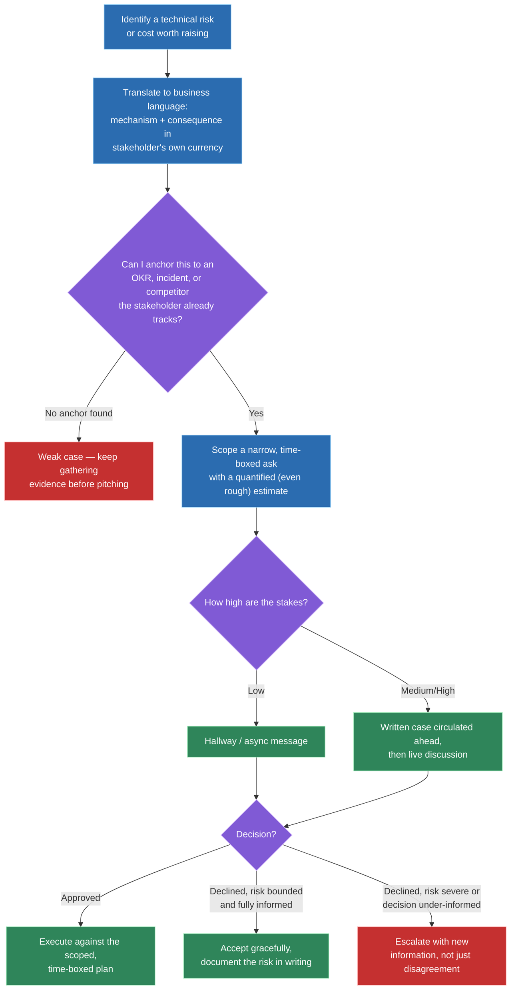
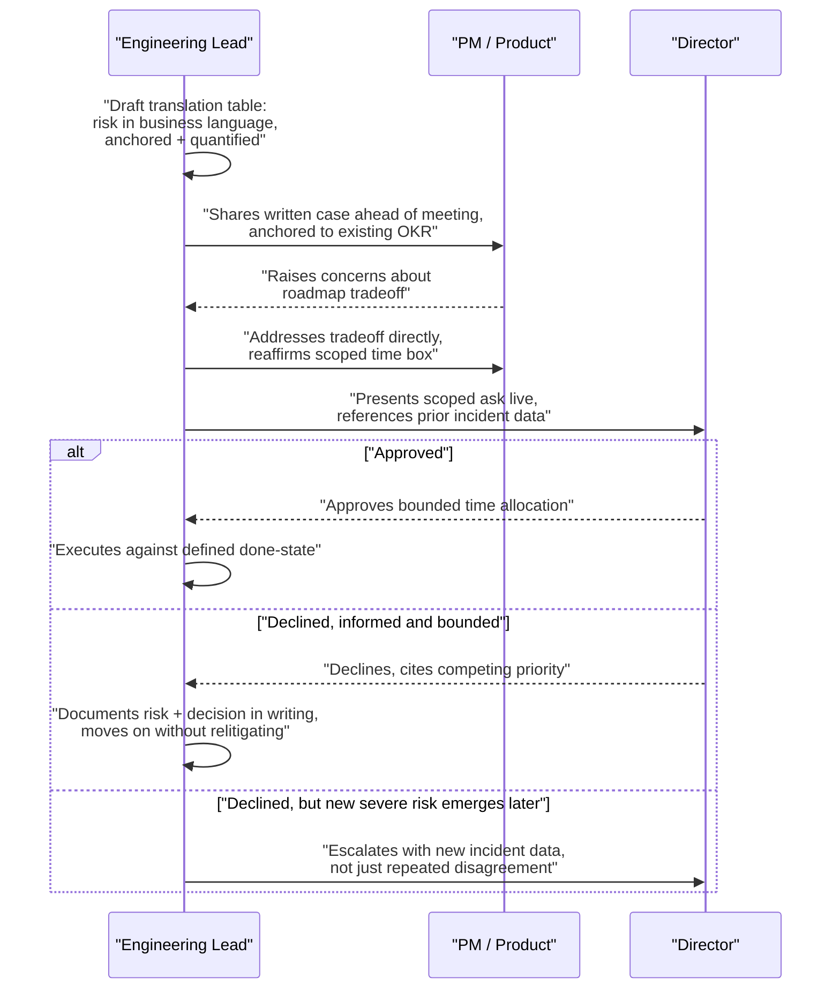

# Influencing upward: presenting tech debt as business case

## 🎯 Executive Summary

Being technically correct is not the same as being persuasive, and most engineers learn this the expensive way — by watching a well-reasoned, obviously-true argument get quietly deprioritized for the third quarter in a row. A director isn't optimizing for "is this true," they're optimizing for revenue commitments, roadmap promises they've already made upward, and their own credibility in front of their boss. If an argument doesn't speak to those incentives, it doesn't matter how correct it is.

This is a distinct, learnable skill: translating an engineering concern into the vocabulary the audience already uses to make decisions. This topic is the companion to tech-debt-management's 70/30 allocation model — that topic covers *how much* time to protect for quality work, this one covers *how to actually get that time approved* by someone who doesn't share your technical context. The Staff/Lead signal here isn't persistence or technical depth; it's a repeatable translation framework plus real judgment about audience, timing, and format.

## 🧠 Core Technical Deep Dive

### 1. Why technical correctness doesn't self-execute

An engineer's instinct is to treat a tech-debt argument like a code review comment: state the problem precisely, cite the risk, expect agreement to follow from the facts. That instinct is wrong in this context because a director isn't evaluating the argument on technical merit — they're evaluating it against a different scorecard entirely: their own OKRs, the roadmap commitments they've already made to *their* boss, and the finite budget of political capital they're willing to spend reprioritizing something.

This means an unpersuasive pitch is usually not a *knowledge* gap on the director's side — they don't disbelieve the technical claim, they just can't see why it should outrank the three other things competing for the same budget. Treating this as "they don't understand" and re-explaining the technical detail louder makes the pitch worse, not better, because it answers a question nobody asked.

> **Key takeaway:** a rejected tech-debt pitch is almost never a disagreement about facts — it's a failure to connect those facts to something the audience is already accountable for, which makes this a translation problem, not a debate to win on technical merit.

### 2. The translation framework: engineering language to business language

The centerpiece skill is converting a technical risk or cost into terms a non-engineer can act on without needing to trust your technical judgment blindly. The pattern is consistent: name the mechanism briefly, then state the business consequence in the same units the stakeholder already uses to make tradeoffs — dollars, hours, customer trust, competitive position.

| Engineering language | Business language |
|---|---|
| "This API has no test coverage." | "A single bad deploy here has a real, estimable chance of a customer-facing outage — based on our last two incidents in similar code, that's roughly $X in support load and an SLA-credit exposure, plus a trust hit with our top accounts." |
| "This service is on a deprecated framework version." | "We're on a version losing vendor support in Q2 — after that, any security patch becomes a custom backport we build and maintain ourselves, which is slower and riskier than staying current now." |
| "Our build pipeline takes 40 minutes." | "Every engineer loses roughly 45 minutes a day context-switching around this — at our headcount, that's the equivalent of two full-time engineers' worth of throughput, every week, doing nothing but waiting." |
| "This module has no monitoring." | "If this breaks, we won't know until a customer tells us — our mean-time-to-detect for unmonitored services has historically been 6x worse than monitored ones, which directly extends the outage window customers experience." |
| "We're accumulating shortcuts to hit deadlines." | "At the current pace, feature velocity on this surface will measurably slow within two quarters — this isn't a hypothetical, it's the same curve we saw on [prior project] before we invested in cleanup." |

Every row does the same three things: names the mechanism in one clause, states a consequence in the stakeholder's currency, and grounds the estimate in something real rather than pure alarm. A rough, honestly-labeled number ("roughly," "based on our last two incidents") is more credible than either a fake-precise figure or a vague appeal to risk.

> **Key takeaway:** the translation table is the actual deliverable of this skill — practice converting *your own* current backlog of technical concerns into this format, because the business-language column is what actually gets read in a planning meeting.

### 3. Building the business case: quantify, anchor, and scope the ask

A pitch that only names a risk is half a pitch — the other half is a concrete, boundable ask. Three things separate a business case that lands from one that doesn't.

**Quantify wherever possible, even roughly.** "This could be bad" persuades no one; "based on our last two incidents in similar code, this has roughly a 1-in-4 chance of a customer-facing incident this year" gives a stakeholder something to weigh against other risks they're already tracking. Label estimates honestly as estimates — a stakeholder who catches you overstating precision stops trusting your numbers on the next ask, which is a worse outcome than admitting the number is rough.

**Anchor to something the stakeholder already cares about.** Don't introduce a new priority; attach the ask to an existing one — a stated OKR, a recent incident still fresh in leadership's memory, a competitor's outage or launch, an upcoming compliance deadline. An ask that rides on an existing priority requires no new political capital from the stakeholder; a freestanding ask requires them to spend capital creating one.

**Scope the ask narrowly and put a time box on it.** "We need to fix tech debt" is unfundable because it's unbounded and never definitively finishes. "We need three weeks of focused time on the payments retry logic before the Q3 launch, because it's the single highest-traffic path with the lowest test coverage" is a decision a director can actually say yes to, because they can see exactly what they're approving and when it ends.

> **Key takeaway:** a fundable ask is quantified (even roughly), anchored to a priority the stakeholder already owns, and scoped with a clear time box — remove any one of these three and the ask becomes easy to defer indefinitely.

### 4. Reading the room: matching forum and format to the stakes

The same argument lands differently depending on the channel it travels through, and picking the wrong one undermines an otherwise sound pitch before anyone even evaluates the content.

| Forum | Best for | Risk if misused |
|---|---|---|
| Hallway/Slack ask | Low-stakes, quick asks; testing initial reaction before investing in a formal pitch | Feels dismissible for anything with real budget attached — a stakeholder can forget a Slack message without consequence |
| Written doc circulated before a meeting | Medium-to-high stakes asks needing careful reasoning; audiences who think better in writing or need time to prepare questions | Written alone, with no live discussion, lets objections go unaddressed and the doc quietly dies unread |
| Live pitch in a planning/roadmap meeting | High-stakes asks competing directly against other roadmap items for the same budget | Live-only, with no pre-read, means the stakeholder is evaluating your numbers for the first time in real time — a bad forum for a complex, data-heavy case |
| Escalation to a skip-level or exec review | Only after a direct ask has genuinely failed and the risk is high enough to justify going over someone's head | Used prematurely, it reads as going around your manager rather than through the process — burns trust even when the underlying concern is valid |

The general pattern for anything with real stakes: circulate a short written case beforehand so the stakeholder isn't seeing the numbers cold, then use the live meeting to answer questions and make the ask concrete — not to present the numbers for the first time. Also match the format to the individual: some stakeholders decide in the room and want the live discussion to be the real event; others need to sit with a doc before they'll commit to anything.

> **Key takeaway:** the forum is not a logistics detail — a technically sound pitch delivered in the wrong format (a complex, data-heavy ask sprung live with no pre-read, or a genuinely urgent risk buried in a Slack message) can fail for reasons that have nothing to do with the argument's quality.

### 5. When the answer is still no

A well-built case can still get a no — budget genuinely is finite, and a director declining doesn't automatically mean they're wrong. What happens next is itself a Lead-level signal, and it splits into two different moves depending on the actual stakes.

**Accept and document, when the risk is real but bounded.** Acknowledge the decision without relitigating it in the same conversation, and follow up in writing — a short note or ticket stating the risk, the decision made, and who made it. This isn't a passive-aggressive paper trail; it's an honest record so that if the risk materializes later, the team can respond to it as a known, accepted tradeoff instead of scrambling to explain why nobody flagged it. It also protects the stakeholder as much as the team — they made an informed call, not an uninformed one.

**Escalate further, only when the stakes genuinely warrant it.** This is the right move when the risk is severe (data loss, security exposure, compliance violation) and new information exists that the original decision-maker didn't have — not simply because you disagree with a reasonable call made with full information. Escalating a normal prioritization disagreement burns trust fast and marks you as someone who goes around decisions instead of through them; escalating a genuinely dangerous, under-informed decision is exactly what a Lead is expected to do.

> **Key takeaway:** the difference between graceful acceptance and legitimate escalation is whether the decision-maker had the full picture and the stakes are proportionate — document quietly when both are true, escalate only when either one clearly isn't.

### 6. A worked example: pitching a quarter of migration time

This is what a scoped, anchored, quantified business case looks like written out, using the framework above end to end.

> **The ask:** One quarter of dedicated engineering time (2 engineers, ~12 weeks) to migrate the checkout service off the deprecated payment SDK.
>
> **The anchor:** The vendor sunsets support for the current SDK version in Q1 next year — after that, any security patch is a custom backport we build and maintain ourselves. This also directly supports the "reduce checkout error rate" OKR already on the roadmap, since 30% of our current checkout errors trace back to known SDK bugs already fixed upstream in the version we'd migrate to.
>
> **The quantified risk of not acting:** Based on the two SDK-related incidents in the last twelve months, continuing on the current version carries a realistic chance of another customer-facing checkout failure before the vendor's sunset date — each prior incident cost roughly 40 engineering-hours in incident response plus measurable checkout abandonment during the outage window.
>
> **The scoped ask:** Two engineers, one quarter, migration only — no accompanying feature work bundled in, and a defined done-state (SDK fully removed, checkout error rate re-measured against the OKR).
>
> **The close:** "This is a bounded, one-time cost that removes a recurring risk and directly moves an OKR you're already accountable for. If we don't do it this quarter, the ask gets more expensive after the vendor sunset forces a rushed, unplanned migration instead of a scoped one."

> **Key takeaway:** notice what this pitch does *not* do — it doesn't say "the codebase is a mess" or "we need to modernize," it names one system, one deadline, one existing OKR, and one bounded cost, which is what makes it something a director can actually approve in a single meeting.

## 📊 Visual Architecture & Logic

### Diagram 1 — The translation-and-pitch decision framework

### Diagram 2 — A pitch moving through stakeholder review

## 🏢 Interview Context & FAANG Signals

This shows up almost verbatim in behavioral rounds — "tell me about a time you had to convince leadership to do something they initially resisted" and "how do you get buy-in for unglamorous engineering work" are close to stock prompts at the Staff/Lead bar. It also appears folded into system-design or architecture rounds when a candidate proposes a large refactor or migration and the interviewer probes "how would you actually get this approved and staffed."

**Lead signals interviewers listen for:**

- A structured translation from technical risk to business consequence, not a restated technical explanation said more emphatically.
- Real numbers, even rough ones, over vague appeals to risk or quality.
- An ask that's scoped and time-boxed, not an open-ended "we should fix tech debt."
- Evidence of reading the audience — choosing the right forum and format, not just having the right content.
- A believable account of what happened when the answer was no — most candidates only prepare the success story.
- Emotional intelligence about the stakeholder's incentives, not frustration that they "don't get it."

## ⚔️ Lead Level vs Senior Level

A **Senior** response typically centers on the technical argument itself: "I explained why the test coverage gap was risky and why we needed to fix it." It's usually correct, and usually under-persuasive, because it treats the audience as if they'll do the translation work themselves.

A **Staff/Lead** response centers on the translation and the audience. What specific business language did they use to reframe the risk? What did they anchor the ask to — an OKR, an incident, a competitor move — that the stakeholder already cared about? How did they scope the ask so it was actually approvable in one meeting, rather than open-ended? And critically: can they describe a time the answer was no, and what they did next — documented and moved on, or escalated with new information — because the follow-through after rejection is exactly what separates persistence-as-nagging from persistence-as-judgment.

## ⚠️ Common Pitfalls & Anti-Patterns

> ### ✕ Re-explaining the technical detail louder after an initial no
> **Why it's wrong:** A rejection is rarely a comprehension gap — repeating the same technical argument with more depth or urgency answers a question the stakeholder never asked, and reads as not listening to their actual objection.
> **✓ Correct Lead Approach:** Ask directly what's driving the no — competing priority, unclear ROI, timing — and address that specific concern, which usually requires new information (a translation, an anchor, a smaller scope), not more of the same information.

> ### ✕ Pitching an open-ended "we need to fix our tech debt" ask
> **Why it's wrong:** An unbounded ask has no clear approval criteria and no defined end state, so it's trivially easy to defer indefinitely — there's never an obviously right moment to say yes to something with no boundaries.
> **✓ Correct Lead Approach:** Scope the ask to a specific system, a specific time box, and a specific done-state that a stakeholder can approve in one sitting and later verify was delivered.

> ### ✕ Using fake-precise numbers to sound more credible
> **Why it's wrong:** A confidently stated "$47,320 in projected losses" built on soft assumptions collapses the moment a sharp stakeholder asks how it was calculated — and once one number is caught as overstated, every future number from that person gets discounted.
> **✓ Correct Lead Approach:** State estimates as estimates, openly — "roughly," "based on our last two incidents" — a rough honest number is more persuasive over time than a precise dishonest one.

> ### ✕ Sending a high-stakes, data-heavy ask cold in a live meeting
> **Why it's wrong:** Asking a stakeholder to evaluate numbers and reasoning for the first time in real time, live, sets the pitch up to be judged on how well it's improvised rather than on the actual merits — and gives no room for them to prepare informed questions.
> **✓ Correct Lead Approach:** Circulate a short written case ahead of any high-stakes discussion, and use the live meeting to resolve questions and finalize the ask, not to present the core content for the first time.

> ### ✕ Escalating immediately after a single no
> **Why it's wrong:** Escalating a normal, fully-informed prioritization decision because it didn't go your way reads as going around your manager rather than through the process, and burns trust that's hard to rebuild — even when the underlying concern was valid.
> **✓ Correct Lead Approach:** Reserve escalation for cases where the stakes are genuinely severe and new information exists that the original decision-maker didn't have; otherwise, document the risk and the decision, and move on.

## 🛠️ Practice Scenarios

### Scenario 1 — Pitching a Migration to a Skeptical VP

You need six weeks of engineering time to migrate off a deprecated internal framework. The VP has already pushed back once, saying "the current thing works fine."

Staff-Level Solution

Reframe "works fine" using the translation table: the framework works fine *today*, but the vendor/maintainer support window closes on a specific date, after which any bug or security patch becomes a custom backport the team builds and maintains alone — that's a cost the VP is implicitly signing up for by declining, not a cost that's avoided by declining. Quantify it: cite how long a comparable backport took the last time it happened, and what it cost in engineer-hours.

Anchor the ask to something the VP already tracks — if there's a security or compliance OKR, tie the sunset date to it directly. Scope the ask to exactly six weeks with a defined done-state, and offer a phased version (start with the highest-risk module) if the full ask still doesn't land, so the VP has an approvable smaller yes available rather than only a binary choice.

### Scenario 2 — Getting Budget for a Security Fix With No Visible User Impact

A vulnerability needs remediation, but nothing is visibly broken and the roadmap is already full for the quarter.

Staff-Level Solution

Translate the vulnerability into a quantified exposure statement rather than a severity label: what's the realistic likelihood of exploitation given what's known, what would a breach cost in incident response, regulatory exposure, and customer trust, and how does that compare to the visible cost of the fix. "No visible user impact today" is exactly the framing that makes this dangerous to defer silently — say that explicitly.

Anchor to whatever the org already tracks on security posture — a compliance requirement, a past incident, an industry benchmark — and scope the ask as narrowly as the fix allows, ideally with a hard deadline tied to something external (a compliance renewal date, a disclosure timeline) so it isn't competing purely on the roadmap's own terms.

### Scenario 3 — Reviving a Stalled Ask After Being Told No Once

You pitched a code-quality initiative last quarter, got a soft no due to competing priorities, and believe the risk has since gotten worse.

Staff-Level Solution

Don't re-pitch the same case — that repeats the exact ask that already failed. Lead with what's changed since the last no: new incident data, a metric that's moved in the wrong direction, a comparable team's experience, or a shift in the stakeholder's own priorities that creates a new anchor point.

Explicitly acknowledge the prior decision was reasonable given what was known then, which signals you're not relitigating a settled call — you're bringing new information that changes the calculus. Keep the ask itself scoped and concrete, ideally smaller or more targeted than the original version, so reconsidering it costs the stakeholder less this time.

### Scenario 4 — Presenting a Technical Risk to a Board/Exec Audience in 5 Minutes

You have five minutes on an exec agenda to raise a serious infrastructure risk to an audience with no engineering background.

Staff-Level Solution

Compress to the absolute core of the translation framework: one sentence naming the risk in business terms (not the mechanism), one number quantifying the exposure, one sentence on what's being asked for, and one sentence on the cost of inaction with a timeframe attached. Skip the technical mechanism almost entirely — an exec audience needs the consequence and the ask, not the "why" in engineering terms, and if they want the mechanism they'll ask.

Have the detailed written case ready to hand off afterward for anyone who wants to go deeper, but don't try to deliver it live — five minutes is a trigger for a decision or a follow-up meeting, not a full technical briefing, and trying to cram the full argument in guarantees the ask itself gets lost.

### Scenario 5 — Disagreeing Diplomatically With a Decision Made Above You

Leadership has decided to deprioritize a fix you believe is genuinely important, and you need to voice disagreement without undermining the decision publicly.

Staff-Level Solution

Raise the disagreement privately with the decision-maker first, framed as new information or a risk they may not have fully weighed, not as a public relitigation in a team meeting — undermining a decision in front of others erodes trust even if you turn out to be right later. If after that conversation the decision stands and the risk is genuinely bounded, support the decision publicly and document the risk in writing for the record.

Reserve visible, escalated disagreement for cases where the stakes clearly justify it — this is the section 5 distinction in practice: accept-and-document is the default, escalation is the exception, and diplomacy here specifically means not skipping straight to the exception.

### Scenario 6 — Winning Over a PM Who Sees Quality Work as Pure Velocity Tax

A PM consistently pushes back on any quality-focused work as "not shipping features," treating it as pure cost with no offsetting benefit.

Staff-Level Solution

Reframe the tradeoff using the PM's own metric: velocity. Show, with real data if available, how the current debt is already taxing velocity — slower PR cycles, more regression bugs eating sprint capacity, a specific recent feature that took longer than estimated because of the exact area in question. The pitch isn't "quality vs. velocity," it's "velocity now vs. velocity later," which is a tradeoff a PM is equipped to evaluate.

Propose a small, scoped pilot rather than a philosophy debate — one sprint with a defined quality investment, measured against the next sprint's cycle time or bug count. A PM skeptical of quality work in the abstract is often persuadable by one concrete, measured example in a way no argument alone will achieve.

### Scenario 7 — A Written Doc Gets No Response Before the Meeting

You circulated a well-built written business case three days before a planning meeting, and nobody engaged with it — no comments, no questions, no signal anyone read it.

Staff-Level Solution

Don't assume silence means agreement or disagreement — it usually means the doc got buried under everything else competing for attention that week. Send a short, direct follow-up naming the one decision you need from the meeting and the one number that matters most, rather than re-sending the full doc or assuming it will get read by osmosis before the meeting starts.

Going into the meeting itself, open by restating the ask and the single most important number in under thirty seconds, treating the room as if nobody pre-read it — because functionally, nobody did — rather than assuming shared context that doesn't exist.

### Scenario 8 — A Rushed Hallway Ask Backfires on a High-Stakes Item

You raised a significant infrastructure risk in a two-minute hallway conversation, got a quick "sounds fine, let's talk later," and it never resurfaced or got funded.

Staff-Level Solution

Recognize the forum mismatch after the fact: a high-stakes ask given in a low-commitment channel produces a low-commitment response, and "let's talk later" in a hallway conversation has no natural follow-up mechanism attached to it. The fix isn't a better hallway pitch — it's picking a forum where a real decision can actually be made and tracked.

Follow up by converting it into a written case and requesting explicit meeting time, referencing the hallway conversation as context rather than as the pitch itself. Treat this as a lesson about calibrating forum to stakes going forward — reserve hallway asks for genuinely low-stakes items, and put anything with real budget or risk attached into a channel with an actual decision point.

</content>
