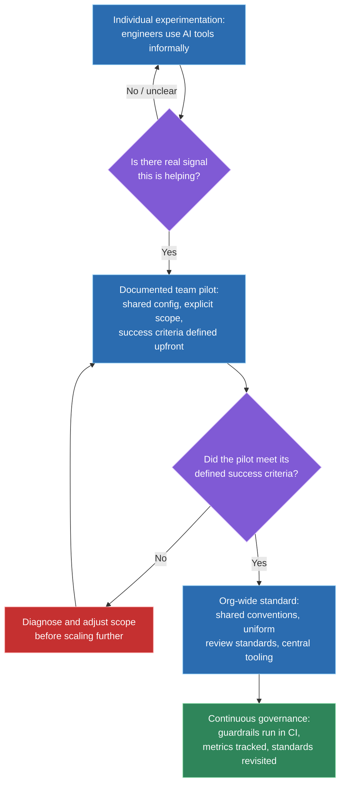
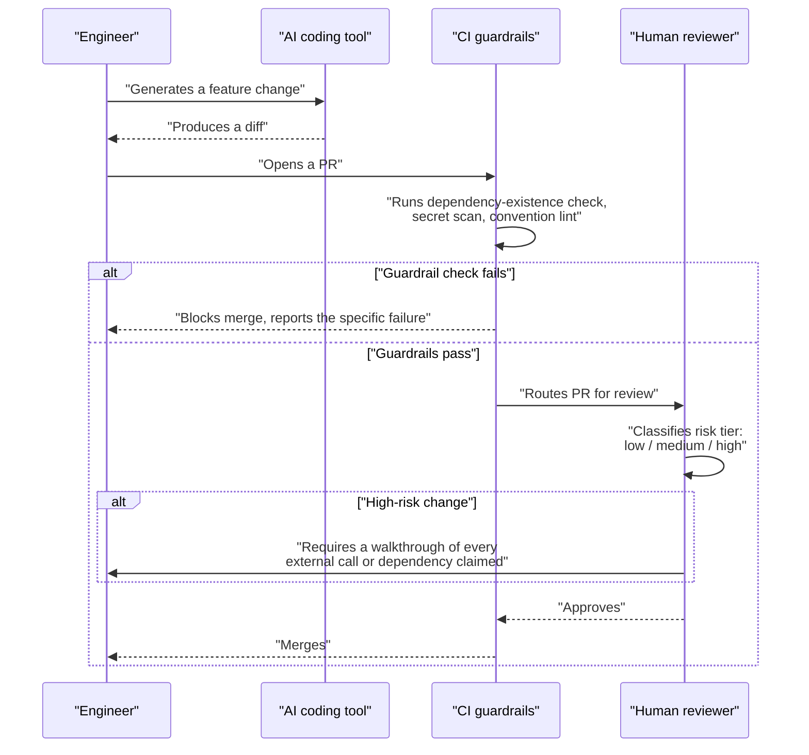

# Leading AI-tool adoption: rolling out Copilot/Claude Code, setting review standards and guardrails for AI-generated code

## 🎯 Executive Summary

"Do you use AI tools" is no longer a differentiating interview question — almost every candidate says yes. The actual Staff/Lead signal is one level up: can you describe rolling out AI-assisted development responsibly across a team, with explicit config conventions, risk-tiered review standards, and guardrails against the specific new failure modes AI-generated code introduces? That's a leadership and systems-design question wearing an "AI" label, not a tooling-trivia question.

This is a must-know topic because it's now a standard portfolio/behavioral opener, and most candidates answer it badly in one of two directions: either a vague "I use Copilot sometimes" with no structure, or an overclaimed "I led our org's AI transformation" that collapses under one follow-up question. The goal of this topic is a repeatable, honest structure — something you can actually whiteboard — for answering it well.

## 🧠 Core Technical Deep Dive

### 1. The adoption maturity model

Rolling out AI-assisted development isn't a single decision — it's a staged progression, and each stage has its own job for leadership and its own way to fail. This is the first thing worth being able to sketch as four boxes in a row:

| Stage | What's actually true | Leadership's job | Common failure mode |
|---|---|---|---|
| **1. Individual experimentation** | A few engineers use AI tools informally, no team policy exists | Notice it's happening, don't reflexively ban it, ask what's actually working | Ignoring it until a security or IP incident forces a reactive, panicked policy |
| **2. Documented team pilot** | A small group formalizes usage — a shared config, an explicit scope of which repos and tasks | Pick the pilot repo, define success criteria *before* starting, set a review-standard baseline | Picking a pilot repo that's too easy (a green-field toy project) so results don't generalize |
| **3. Org-wide standard** | Conventions are shared across teams, review standards apply uniformly, tooling is provisioned centrally | Turn what worked in the pilot into a documented, versioned standard; handle teams that resist adopting it | Copy-pasting one team's config everywhere without adapting it to a different codebase's real constraints |
| **4. Continuous governance** | Guardrails run in CI, standards get revisited as tools change, adoption is measured, not assumed | Own the metrics, own guardrail maintenance, sunset what stops working | Treating the rollout as a finished project instead of an ongoing operational responsibility |

> **Key takeaway:** adoption is a staged rollout with a distinct failure mode at each stage, not a single yes/no decision — knowing which stage a team is actually in, and what specifically breaks if you skip one, is the concrete Staff-level signal here.

### 2. Configuring the environment: what actually belongs in a project's AI config

There isn't one "AI config file" — there are several distinct surfaces with different scopes, and the most common adoption mistake is collapsing them into one undifferentiated pile of instructions.

| Config surface | Scope | What belongs there | What doesn't |
|---|---|---|---|
| Project-level conventions file (e.g. `CLAUDE.md`) | Whole team, checked into version control | Non-obvious project facts and conventions a human would otherwise ask about during onboarding | Personal preferences (verbosity, communication style) |
| Personal settings | Individual engineer | Permission modes, personal workflow preferences | Anything the rest of the team needs to see or agree on |
| Slash commands / reusable skills | Team or org, versioned alongside the code | Repeatable multi-step workflows — a release checklist, a migration script | One-off tasks that won't recur |
| Long-term memory | Individual, persists across sessions | Durable facts about ongoing work, preferences confirmed over time | Ephemeral task state — that belongs in the current conversation |

A genuinely good project-conventions file reads like institutional memory, not a style guide: it documents the specific, non-obvious facts a new contributor — human or AI — would otherwise waste an afternoon rediscovering. "There are two unrelated dark-mode systems on this site, don't mix them up" or "this filename has an intentional typo, don't fix it without updating the code that reads it" are the kind of entries that actually earn their place; generic advice like "write clean code" doesn't.

> **Key takeaway:** the single biggest mistake at the config layer is treating a project-conventions file as documentation for the AI tool specifically — it's institutional memory for anyone joining the codebase cold, and it should be judged by that bar, not by how much it sounds like a prompt.

### 3. Setting review standards for AI-generated code

Two things change about code review once a meaningful fraction of PRs are AI-assisted, and both matter more than "review it like normal, just more of it."

First, volume goes up — more code gets proposed per engineer-hour, so review capacity becomes the actual bottleneck if the process doesn't adapt. Second, and more importantly, the *failure mode shifts*. A junior engineer's incomplete PR usually looks incomplete. AI-generated code tends to look confident and idiomatic even when it's subtly wrong — a hallucinated API that doesn't exist, a dropped edge case, an unnecessarily elaborate abstraction nobody asked for. Catching "this looks right but isn't" is a different reviewing skill than catching "this is obviously unfinished."

The fix is calibrating review depth to risk, not applying one review bar to everything:

| Risk tier | Example | Review depth required |
|---|---|---|
| **Low-risk** | Boilerplate, test scaffolding, formatting/lint fixes | Standard review, spot-check |
| **Medium-risk** | Feature code, refactors touching shared code paths | Full review, plus an explicit "did you verify this against the real API/behavior" check |
| **High-risk** | Auth, payments, data mutations, security-sensitive logic | Full review, plus mandatory manual verification of every external call or dependency the AI claimed exists — no AI-authored change ships here without a human who actually understands it signing off |

> **Key takeaway:** the review standard that matters isn't "review AI code more carefully" in the abstract — it's a risk-tiered policy that says explicitly how much scrutiny each category of change requires, decided in advance, not improvised per PR.

### 4. Guardrails: preventing the failure modes specific to AI-assisted coding

Guardrails are the mechanisms — tooling, policy, or process — that catch the specific new failure modes AI-assisted coding introduces, before they reach production or a teammate's afternoon:

| Failure mode | Guardrail | Enforcement mechanism |
|---|---|---|
| Hallucinated dependency or API that doesn't actually exist | CI dependency-existence check, lockfile diff review | Automated (CI) |
| Secrets or proprietary code pasted into an external AI tool | Pre-commit secret scanning, explicit policy on what can leave the org's boundary | Tooling + written policy |
| Style/pattern drift as conventions get reinvented per session | Conventions file kept current, linting against it | Config + CI |
| Unnecessary or over-engineered abstraction | Explicit review criterion — "would you have written it this way yourself?" | Review culture |
| A PR merged without the author actually understanding the diff | Policy requiring the author explain the change in review, not just approve it | Review policy |

> **Key takeaway:** guardrails aren't a generic "be careful with AI" reminder — each one maps to a specific, nameable failure mode, and the strongest ones are enforced by tooling rather than relying on everyone remembering to be vigilant.

### 5. The rollout playbook

This is the structure to reach for when asked directly "how would you roll this out to a team" — it's the same shape as any staged change-management effort, applied here.

Pick a real pilot, not a toy repo — something with actual production stakes, so the results generalize. Define success criteria *before* starting, and be deliberate about what counts as a good metric: "lines of code generated" or "% of PRs touched by AI" are vanity metrics that measure activity, not value. Cycle time, defect-escape rate, and review time are harder to game and actually reflect whether adoption is working. Set the review standard from section 3 as policy from day one — retrofitting review discipline after a team has already gotten used to rubber-stamping AI-generated PRs is much harder than starting with it. Decide the escalation path up front for when a guardrail actually catches something, and revisit the whole standard on a fixed cadence as the tools themselves change.

> **Key takeaway:** the rollout playbook is standard change management — pilot, measure the right thing, set policy before scale, revisit — the "AI" part changes what the guardrails and metrics need to be, not the shape of the rollout itself.

### 6. Answering "what have you done with AI" — a structure, not a script

This is the actual behavioral-round answer, and it holds together best in four parts, in this order:

1. **A concrete artifact.** Not "I use Copilot" — a real, specific thing you built: a project-conventions file you wrote and iterated on, a slash command that automates a recurring workflow, a config you can describe in enough detail that a follow-up question doesn't expose it as vague.
2. **A measurable before/after.** Something you can point to changing — review turnaround time, a class of bug that stopped recurring, time-to-onboard a new contributor to a codebase. Vague "it made me faster" claims are the first thing a good interviewer probes.
3. **The judgment call or guardrail you added.** This is what separates "I used the tool" from "I led its adoption" — a review standard you set, a failure mode you caught and fixed, a boundary you drew on what shouldn't be AI-generated without extra scrutiny.
4. **How you'd scale it.** Tie it back to section 1's maturity model — what would it take to go from "this is how I personally work" to "this is how the team works," and what would you expect to break along the way.

> **Key takeaway:** the answer that reads as credible isn't the one with the most impressive-sounding scope — it's the one with a real artifact, a real measurement, and a real judgment call, told in that order, with the scaling question answered honestly rather than skipped.

## 📊 Visual Architecture & Logic

### Diagram 1 — The adoption maturity model

### Diagram 2 — An AI-generated change moving through review gates

## 🏢 Interview Context & FAANG Signals

This surfaces almost entirely in **behavioral/portfolio rounds** ("walk me through how you use AI in your work," "how would you roll this out to your team") and **leadership/architecture discussions** (setting engineering standards, managing a change that affects how the whole team works). It occasionally shows up as a **system-design-adjacent** question when framed as "design the review/guardrail process for AI-generated code at scale."

**Lead signals interviewers listen for:**

- A concrete, specific artifact (a real config, a real workflow) instead of a vague description of tool usage.
- A measurable before/after rather than an unfalsifiable "it made me faster."
- Explicit review-standard design — naming what changes about review for AI-generated code, not just "we review it like everything else."
- Naming specific failure modes (hallucinated APIs, secret leakage, style drift) and their guardrails, not a generic "be careful" stance.
- Honest scope: distinguishing what they personally built from what an org-wide rollout would actually require.
- Treating "AI adoption %" skeptically as a metric, and naming what a better one looks like.

## ⚔️ Lead Level vs Senior Level

A **Senior** response typically describes personal tool usage well and stops there: "I use Claude Code for most of my day-to-day work, I've got a few custom commands set up, and it's made me noticeably faster."

A **Staff/Lead** response treats that as the first quarter of the answer. What's the concrete artifact — a real conventions file, a real workflow — that someone else could pick up and use? What changed measurably, not just subjectively? What judgment call or guardrail did they add that a less experienced engineer wouldn't have thought to add — a review standard, a boundary on what shouldn't be AI-generated without scrutiny, a fix for a failure mode they actually hit? And critically: can they describe, specifically, what it would take to go from "this works for me" to "this is how a twenty-person team works," including what predictably breaks along the way — resistance from engineers who don't trust the tooling, a pilot that doesn't generalize, a guardrail that turns out to be too strict and gets silently bypassed.

## ⚠️ Common Pitfalls & Anti-Patterns

> ### ✕ Answering "what have you done with AI" with tool usage instead of an artifact
> **Why it's wrong:** "I use Copilot/Claude Code" describes behavior, not a contribution — it gives an interviewer nothing specific to follow up on, and reads as generic because almost every candidate can say the same sentence.
> **✓ Correct Lead Approach:** Lead with a specific, describable artifact — a conventions file, a workflow, a guardrail — that demonstrates judgment, not just adoption.

> ### ✕ Treating "AI adoption %" or "lines of AI-generated code" as the success metric
> **Why it's wrong:** Both measure activity, not value, and are trivially inflated by generating more code without it being better code — a rollout optimizing for this metric can look successful while producing worse outcomes.
> **✓ Correct Lead Approach:** Define success criteria before the pilot starts, and prefer metrics that are hard to game — cycle time, defect-escape rate, review turnaround — over raw usage volume.

> ### ✕ Applying one review bar to all AI-generated code regardless of risk
> **Why it's wrong:** Reviewing boilerplate and reviewing a payments-flow change with the same depth either wastes reviewer time on the low-risk case or under-scrutinizes the high-risk one — a single bar is calibrated wrong for one end of the spectrum no matter where it's set.
> **✓ Correct Lead Approach:** Set a risk-tiered review policy explicitly, in advance, so the depth of scrutiny is a deliberate decision tied to what's actually at stake in the change.

> ### ✕ Rolling out AI tooling org-wide straight from one engineer's personal experiment
> **Why it's wrong:** What works for one engineer on one codebase doesn't automatically generalize — skipping the documented pilot stage means the org-wide standard is really just one person's untested preferences, applied at scale.
> **✓ Correct Lead Approach:** Run a real, scoped pilot with defined success criteria first, and only formalize what actually held up under it.

> ### ✕ Writing a project-conventions file that reads like generic advice
> **Why it's wrong:** Entries like "write clean code" or "follow best practices" carry no information a new contributor didn't already have — the file ends up ignored, because nothing in it is actionable or specific to this codebase.
> **✓ Correct Lead Approach:** Fill it with the non-obvious, project-specific facts a human would otherwise ask about during onboarding — the deliberate typo, the two unrelated theming systems, the file that looks safe to delete but isn't.

## 🛠️ Practice Scenarios

### Scenario 1 — Answering "Walk Me Through How You Use AI Day to Day"

An interviewer opens with this exact question, expecting a specific answer, not a general one.

Staff-Level Solution

Use the four-part structure directly: name a concrete artifact (a specific conventions file or workflow, described precisely enough to survive a follow-up question), a measurable before/after (a concrete number or a specific recurring problem that stopped happening), the judgment call or guardrail added on top of just using the tool, and a candid answer to how it would scale to a team — including what would predictably need to change.

Avoid the two failure modes explicitly: don't describe tool usage without an artifact ("I use Copilot" is not an answer), and don't overclaim organizational impact that didn't happen — if the honest answer is "I've done this for myself, not rolled it out to a team yet," say that and pivot immediately into how you'd do it, which is itself a strong answer.

### Scenario 2 — Rolling Out Claude Code to a 20-Person Team

Leadership asks for a plan to introduce AI-assisted development across a team that currently has no policy on it at all.

Staff-Level Solution

Start at stage 1 of the maturity model honestly — assume informal experimentation is probably already happening, and the first job is finding out what's working rather than starting from zero. Pick one real, production-stakes repo for a documented pilot with a small group, define success criteria before it starts (cycle time and defect-escape rate, not lines generated), and set the review-standard policy from day one rather than retrofitting it later.

Only formalize into an org-wide standard once the pilot's results actually held up, and expect resistance from engineers skeptical of the tooling — treat that as a real signal to investigate, not an obstacle to override. Build the guardrails (dependency-existence checks, secret scanning, convention linting) into CI before scaling past the pilot, not after an incident forces the issue.

### Scenario 3 — A PR Full of AI-Generated Code Has Subtle Bugs

Reviewers keep approving AI-assisted PRs that look clean but contain a hallucinated API call or a dropped edge case, discovered only after merge.

Staff-Level Solution

This is the "plausible but wrong" failure mode directly — AI-generated code tends to look confident and idiomatic even when subtly incorrect, which is a different reviewing skill than catching obviously incomplete work, and the existing review process wasn't calibrated for it. Introduce a risk-tiered review policy: for anything above low-risk, require an explicit "verify this API/behavior actually exists as claimed" step, not just a read-through.

Add the dependency-existence check to CI as a guardrail so hallucinated imports/APIs get caught mechanically before a human ever has to notice them, and require the PR author to explain the change in review rather than just approve it — a rule that specifically catches the case where nobody, including the author, actually understood what shipped.

### Scenario 4 — An Engineer Pastes Proprietary Code Into a Public AI Tool

A security review discovers an engineer has been pasting internal source code into a consumer-facing AI chat tool with no data-handling guarantees.

Staff-Level Solution

Treat this as a governance gap, not an individual failure — if there's no explicit policy on what can leave the org's boundary, the engineer had no way to know they'd crossed a line. Fix the immediate exposure first (rotate any credentials that may have been included, assess what was actually shared), then write the policy that should have existed: which tools are approved for use with proprietary code, and why (data retention terms, whether it's used for further model training).

Pair the written policy with a pre-commit or IDE-level guardrail that flags likely secrets or proprietary markers before they can be pasted into an external tool, since a policy nobody's tooling enforces is exactly the kind of guardrail that gets silently ignored under deadline pressure.

### Scenario 5 — Diagnosing a Team That's Over-Relying on AI Suggestions

Code quality has been quietly degrading; review reveals engineers are accepting AI-generated suggestions without meaningfully evaluating them, and are gradually losing familiarity with the codebase they own.

Staff-Level Solution

This is a guardrail-culture gap, not a tooling problem — nothing in the review process currently requires an engineer to demonstrate they understood a change before it merges, so rubber-stamping AI output became the path of least resistance. Introduce the "author must explain the change in review" policy explicitly, which makes shallow acceptance visible rather than invisible.

Reframe the review-depth expectations by risk tier so engineers aren't implicitly told every change deserves the same low-effort scrutiny, and consider deliberately routing some code review pairing or design discussion back through the humans who own that code, specifically to rebuild the familiarity that's eroding — treating this as a skill-maintenance problem worth investing in directly, not something that fixes itself.

### Scenario 6 — Setting Up a Project-Conventions File for a New Repo From Scratch

A team is starting a new codebase and wants to establish good AI-tooling conventions from day one rather than retrofitting them later.

Staff-Level Solution

Resist the urge to write generic advice ("write clean code," "follow best practices") — none of it is actionable, and a new contributor already assumes it. Fill the file with the specific, non-obvious facts a human would otherwise ask about during onboarding: unusual architectural decisions, deliberate inconsistencies that look like bugs but aren't, where the real source of truth lives when multiple things look like candidates.

Keep it living, not a one-time artifact — treat outdated entries as actively harmful (worse than no entry, since they actively mislead), and add a lightweight habit of updating it whenever a question comes up twice, whether asked by a human or discovered by the AI tool getting something wrong.

### Scenario 7 — Measuring Whether an AI Adoption Rollout Is Actually Working

Leadership wants a dashboard showing the rollout is succeeding, and the first draft metric proposed is "percentage of code generated by AI."

Staff-Level Solution

Push back on that metric specifically — it measures activity, not value, and is trivially inflated by generating more code without any corresponding improvement in outcomes, which can actively reward the wrong behavior (verbose AI-generated code over a smaller, cleaner AI-assisted change). Propose metrics defined before further rollout, not retrofitted to make current numbers look good: cycle time from PR open to merge, defect-escape rate for AI-assisted vs. non-AI-assisted changes, and review turnaround time.

Be explicit that some of this needs a baseline captured *before* wider rollout to mean anything — a percentage improvement claim with no pre-rollout baseline is unfalsifiable, and that's worth flagging to leadership directly rather than producing a number that looks good but doesn't hold up under scrutiny.

### Scenario 8 — Reporting AI Adoption Progress to an Executive

An executive wants a concise update on how AI-tool adoption is going across the org, expecting more than "it's going well."

Staff-Level Solution

Structure the update around the maturity model rather than a vague status: name which teams are at which stage (individual experimentation vs. documented pilot vs. org-wide standard), what the defined success criteria were for any team that's progressed a stage, and what the actual measured numbers were against those criteria — not activity counts.

Be honest about what hasn't worked, framed as diagnosed and being addressed rather than omitted — a pilot that didn't generalize, resistance from a specific team and why, a guardrail that turned out too strict and got quietly bypassed. An executive update that only reports success and no friction reads as either incomplete visibility or a filtered narrative, and a Staff/Lead's credibility on this topic comes specifically from being trusted to report the real picture.

