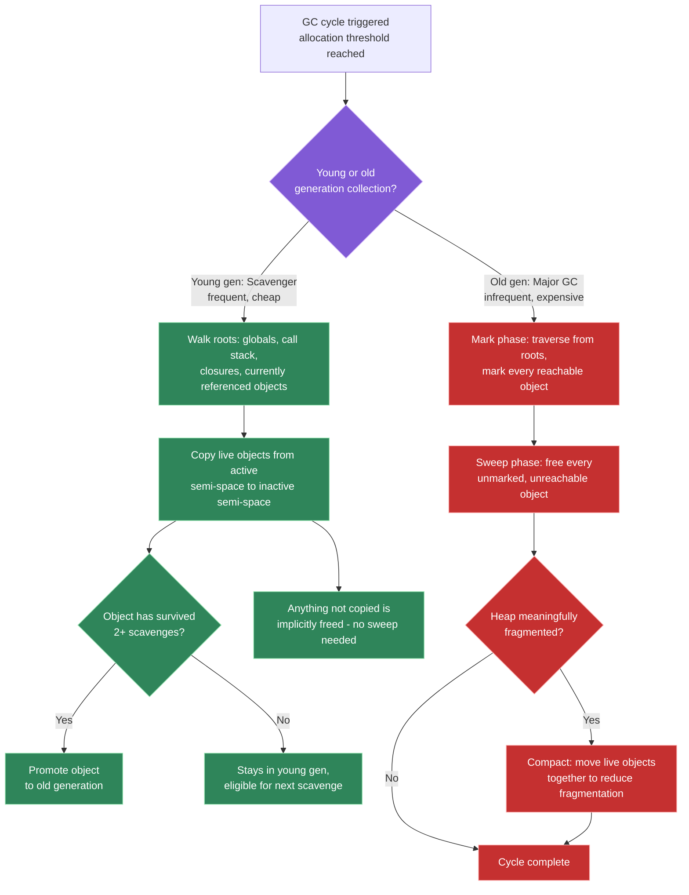
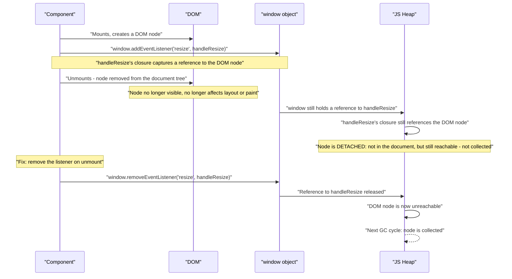

# Memory management, garbage collection, and leak detection/prevention

## 🎯 Executive Summary

JavaScript's garbage collector doesn't free "unused" objects — it frees **unreachable** ones. That single distinction is the root of almost every memory leak a frontend engineer will debug: the object is logically done being useful, but something — a forgotten listener, a stale closure, a detached DOM reference — still points to it, so the collector correctly leaves it alone. A Lead is expected to reason precisely about reachability, not vaguely about "cleanup."

This is a must-know topic because long-lived single-page applications make memory management a frontend concern, not just a backend/Node.js one — a dashboard left open for a work day, a chat app that never navigates away, an admin tool with dozens of open tabs, all accumulate leaked memory the same way a long-running server process does. Interviewers use this topic to test whether a candidate can go from "the app feels sluggish after a while" to a specific, tooling-verified root cause, rather than guessing and patching symptoms.

## 🧠 Core Technical Deep Dive

### Reachability, not usefulness: the mental model that matters

An object is garbage-collectible only when it's unreachable from the **roots** — the global object, the current call stack, and any closures still referenced by live code. "Reachable" is a graph traversal question, not a judgment about whether your program logic still needs the object. A cache entry, a detached DOM node held by a stray variable, or a closure over a large dataset are all perfectly reachable and will never be collected, no matter how "done" they are.

```javascript
let largeBuffer = new ArrayBuffer(100 * 1024 * 1024); // 100MB, reachable via `largeBuffer`
function process() { return largeBuffer.byteLength; }
// largeBuffer is still fully reachable here, even though `process` never runs again -
// nothing has broken the reference, so nothing makes it collectible
```

> **Key takeaway:** debugging a leak is finding the reference you didn't know still existed — not finding "code that should have cleaned up." The fix is almost always breaking a reference, not adding cleanup logic in the abstract.

### V8's generational heap: why most collections are cheap

V8 splits the heap into a **young generation** (new, small objects) and an **old generation** (long-lived or large objects), based on the generational hypothesis: most objects die young. This split lets the engine run frequent, cheap collections on the young generation and reserve expensive full collections for the old generation, which changes far less often.

| Generation | Algorithm | Frequency | Cost |
|---|---|---|---|
| **Young (Scavenger)** | Cheney's semi-space copying: live objects are copied from an active semi-space to an inactive one; anything not copied is implicitly freed | Frequent — runs on a small, fast-filling space | Cheap — no explicit sweep, and the space is small |
| **Old (Major GC)** | Mark-sweep-compact: mark every reachable object from the roots, sweep everything unmarked, optionally compact to reduce fragmentation | Infrequent | Expensive — the old generation is large and long-lived |

An object surviving two scavenge cycles gets **promoted** to the old generation, on the assumption that anything living that long is likely to keep living. This promotion threshold is exactly why short-lived allocations in a hot loop are cheap (they die in young gen and never touch the more expensive collector) while accidentally retained objects are costly (they get promoted and then require a full mark-sweep-compact cycle to reclaim).

> **Key takeaway:** the generational split isn't an implementation curiosity — it's why allocation *patterns* matter for performance, not just allocation *volume*. Short-lived garbage in a render loop is nearly free; long-lived accidental retention is not.

### Incremental and concurrent marking: memory management is a jank problem too

A naive mark-sweep collector is "stop-the-world" — the main thread halts entirely until the full mark and sweep pass completes, which for a large old generation can take long enough to drop frames. V8's Orinoco project broke this into **incremental marking** (small marking steps interleaved with normal JS execution) and **concurrent marking** (marking work moved to background threads), specifically to keep the main thread free for rendering and input handling.

This doesn't eliminate GC-related jank — there's still a final, brief atomic pause to finish marking and begin sweeping — but it converts what used to be one large, visible pause into many small, mostly invisible ones. A Lead should connect this directly to INP and dropped frames: a profiler showing time attributed to "GC" during an interaction is a legitimate root cause of jank, not an unrelated background concern.

> **Key takeaway:** garbage collection is not "someone else's problem" in a frontend performance investigation — an app that allocates aggressively in hot paths (render loops, scroll handlers) is directly trading away frame budget to a collector that has to work harder and more often.

### The canonical leak patterns, and what actually breaks the reference

| Pattern | Why it leaks | Fix |
|---|---|---|
| **Forgotten timers/intervals** | The timer's closure keeps everything it references alive for as long as the timer is pending or repeating | Clear the timer explicitly on cleanup (`clearTimeout`/`clearInterval`), tied to the same lifecycle that created it |
| **Uncleaned event listeners** | A listener registered on a long-lived target (`window`, `document`) keeps its closure — and everything that closure captured — alive for the target's entire lifetime | Remove the listener in the same cleanup path that undoes whatever registered it (`useEffect` return, `componentWillUnmount`) |
| **Detached DOM nodes** | Removing a node from the document does not make it collectible if any JS reference (a variable, a closure, a listener, a cached lookup) still points to it — the node becomes "detached" but stays fully reachable | Break every reference to the node when it's removed — don't just remove it from the DOM, remove it from whatever JS structure is still holding it |
| **Unbounded caches** | A `Map`/object used as a cache with no eviction strategy grows for the life of the page, and using object references as keys in a *regular* `Map` keeps those objects reachable forever | Use `WeakMap` when keys are objects that shouldn't be kept alive by the cache; use explicit TTL/LRU eviction when keys are primitives (strings/numbers can't be `WeakMap` keys at all) |
| **Stale closures over large scope** | A closure retains its entire Lexical Environment, not just the variables it uses — a large object referenced anywhere in that scope stays alive as long as the closure does | Narrow what the closure captures, or explicitly null large references once they're no longer needed |

> **Key takeaway:** every one of these is the same root cause wearing a different disguise — something reachable is holding a reference longer than the object is actually needed. The fix is always "find and break that reference," never a generic "add more cleanup."

### Detached DOM nodes: a leak that spans both the DOM and the JS heap

This category deserves separate treatment because it's genuinely two-part: the node is removed from the visible **document tree** (so it's invisible to the user and doesn't affect layout/paint), but it still exists in the **JS heap** as long as anything references it — a variable, a `Map` keyed by node, or most commonly, an event listener that was never removed before the node was detached. Chrome DevTools' heap snapshot tool has a dedicated "Detached" filter specifically because this is common and specifically hard to notice without tooling — the app looks and behaves correctly, and only memory graphs over time reveal the problem.

```javascript
let cachedHeader; // module-level reference

function renderHeader() {
  const header = document.querySelector('#header');
  cachedHeader = header; // stray reference, easy to forget exists
  header.addEventListener('click', () => console.log('clicked'));
}

function removeHeader() {
  document.querySelector('#header').remove(); // removed from the document...
  // ...but `cachedHeader` still references it, so it's detached, not collected
}
```

> **Key takeaway:** "I removed it from the DOM" and "it's eligible for garbage collection" are two different claims — the second only follows from the first if you've also verified nothing in JS still points to it.

### WeakMap, WeakSet, WeakRef, and FinalizationRegistry: precisely what each guarantees

| API | What it holds weakly | Correct use case | What it does NOT guarantee |
|---|---|---|---|
| **`WeakMap`** | Its keys (must be objects) — values are held normally | Attaching metadata to an object without keeping that object alive because of the cache itself | Cannot be iterated (`.keys()`/`.entries()` don't exist) — by design, since the contents can change at any GC-determined moment |
| **`WeakSet`** | Its members (must be objects) | Tracking "has this object been seen/processed" without retaining it | Same non-iterability, for the same reason |
| **`WeakRef`** | A single reference to an object | Holding an optional cache of an expensive object that's fine to recompute if collected | `.deref()` can return `undefined` at any point — never assume the referenced object is still alive |
| **`FinalizationRegistry`** | Registers a callback that *may* run after an object is collected | Debugging/diagnostic hooks, non-critical resource cleanup as a backstop | Callback timing is explicitly unspecified — it may run late, or not at all (e.g., at process exit) — never rely on it for correctness-critical cleanup |

> **Key takeaway:** `WeakMap` solves "don't let my cache keep this object alive," which is a narrower problem than "bound my cache's size" — a cache keyed by strings or with a size limit still needs explicit eviction logic; `WeakMap` doesn't replace that.

## 📊 Visual Architecture & Logic

### Diagram 1 — Generational garbage collection flow



### Diagram 2 — How a detached DOM node happens, and how cleanup prevents it



### Debugging walkthrough: the three-snapshot technique, precisely

This is the one workflow worth being able to execute without hesitation in an interview or on the job — not just describe. Chrome DevTools' Memory panel:

1. **Memory tab → Heap snapshot → Take snapshot.** This is the baseline, taken before performing any suspected-leaking action.
2. **Perform the suspected action several times** — mount/unmount a component, open/close a modal, navigate between two views — enough repetitions that a real leak's growth is distinguishable from noise.
3. **Force garbage collection** using the "Collect garbage" control in the Memory panel's toolbar, then **take a second snapshot.** Forcing GC here matters — without it, you can't distinguish "this is garbage waiting to be swept" from "this is genuinely still reachable."
4. **Repeat the action again**, force GC again, **take a third snapshot.**
5. **Select the third snapshot**, switch its view from **Summary** to **Comparison**, and set the comparison baseline to the **second** snapshot. This specifically isolates objects that grew across *both* intervals — filtering out normal, one-time retained state (initial data loads, mounted-and-staying-mounted components) that would otherwise show up as a false positive if compared only against the very first baseline.
6. **Sort by Size Delta or `# New`**, and for detached-node leaks specifically, type `Detached` into the class filter — this surfaces detached DOM trees directly rather than requiring you to recognize them by class name.
7. **Select a growing entry and inspect its Retainers panel** — the reference chain keeping it alive. This is usually the fastest path to the actual root cause (a specific listener, a specific closure, a specific cache), rather than guessing from the object type alone.

> **Key takeaway:** step 5 is the part most people skip, comparing only against the very first snapshot — which conflates normal retained state with genuine leaks. Comparing snapshot 3 against snapshot 2, not snapshot 1, is what makes this technique reliable rather than noisy.

**→ Try it hands-on:** [`resources/memory-leak-debugging.html`](resources/memory-leak-debugging.html) has three real, verifiable leaks matching the scenarios above — a forgotten `setInterval`, a detached DOM node from an uncleaned listener, and an unbounded `Map` cache versus a `WeakMap` fix — each with a toggle between buggy and fixed behavior, so you can run the exact workflow above against genuine leaking memory in your own browser's real DevTools instead of a static image of someone else's.

**→ Visualize the mechanics:** [`resources/js-memory-visualizer.html`](resources/js-memory-visualizer.html) is a step-through visualizer of the call stack, heap, and garbage collector — not a leak to hunt, but the underlying machinery itself. It walks the creation-phase/execution-phase split, primitives-on-stack vs. objects-on-heap, exactly how a closure's Lexical Environment survives its creating function's stack frame, the classic `var`-in-a-loop-plus-`setTimeout` bug against its `let` fix, and a concrete mark-and-sweep pass over named objects (including one deliberately unreachable "orphan").

## 🏢 Interview Context & FAANG Signals

This topic appears as a **debugging round** ("this SPA's memory grows over a long session, find and fix it"), a **coding round** ("implement a bounded cache" or "implement a DOM-metadata store that doesn't leak"), and a **behavioral round** ("tell me about a memory leak you found and fixed in production"). It occasionally surfaces in system design as a constraint on long-lived dashboard/admin-tool architecture.

**Lead signals interviewers listen for:**

- Correctly framing garbage collection around reachability, not "unused" — and being able to say precisely what reference is keeping a suspected leak alive.
- Naming the generational hypothesis and connecting allocation patterns (not just volume) to GC cost, especially in hot render/animation loops.
- Describing the **three-snapshot heap comparison technique** by name and mechanism, not just "I'd open DevTools and look at memory."
- Precisely stating what `WeakMap` guarantees (weak keys, not weak values, not automatic size bounding) rather than treating it as a universal leak fix.
- Distinguishing detached DOM nodes as a category spanning both the document tree and the JS heap, not conflating "removed from the DOM" with "collectible."

## ⚔️ Lead Level vs Senior Level

**Scenario: "Our SPA's memory usage grows steadily over a long session. How do you find and fix it?"**

A **Senior** response is a reasonable starting workflow: "I'd open Chrome DevTools, take a heap snapshot, look for detached DOM nodes, and check for event listeners or timers that aren't cleaned up in `useEffect`."

A **Lead/Staff** response covers the same tools but with more precision and a systemic follow-through:

- **Uses the three-snapshot comparison technique specifically**: take a baseline snapshot, perform the suspected-leaking action several times, force GC, take a second snapshot; repeat the action, force GC, take a third. Comparing snapshot 2 to snapshot 3 isolates objects that grew across *both* intervals — filtering out normal, expected retained state and surfacing genuinely accumulating leaks, rather than eyeballing a single snapshot and guessing.
- **Categorizes the leak before fixing it** — a timer, a listener, a detached node, or an unbounded cache each point to a different fix and a different systemic prevention, so identifying the category precisely (via the heap snapshot's retainer tree, not just "it's growing") matters before writing a fix.
- **Proposes a systemic guardrail**, not just the one fix: an ESLint rule enforcing cleanup functions on effects that register listeners/timers, or a custom hook (`useEventListener`, `useInterval`) that ties registration and cleanup together so the mistake becomes structurally harder to make again.
- **Verifies under realistic conditions**: confirms the fix by re-running the same three-snapshot comparison after the change, rather than assuming the fix worked because the obvious reference was removed.

The differentiator: a Senior finds *a* leak with the right tools; a Lead treats the investigation as evidence of a systemic gap and closes the gap, not just the instance.

## ⚠️ Common Pitfalls & Anti-Patterns

> ### ✕ Confusing "Unused" With "Unreachable"
> **Why it's wrong:** Assuming an object will be collected once your program logic is done with it ignores that the collector only cares about reachability. An object can be entirely irrelevant to your program's current behavior and still be strongly reachable via a forgotten reference, keeping it alive indefinitely.
> **✓ Correct Lead Approach:** When debugging a suspected leak, ask "what reference is still pointing to this," not "why wasn't this cleaned up" — the former leads directly to the retainer tree in a heap snapshot; the latter leads to vague, unproductive cleanup passes.

> ### ✕ Diagnosing Leaks From a Single Heap Snapshot
> **Why it's wrong:** A single snapshot can't distinguish normal, expected retained state (caches, loaded data, mounted components) from a genuinely growing leak — everything in a snapshot looks "retained" regardless of whether it's a problem.
> **✓ Correct Lead Approach:** Use the three-snapshot comparison technique — baseline, perform the action and force GC, snapshot; repeat and snapshot again — and focus specifically on objects that grew across both intervals, which isolates real leaks from incidental retained state.

> ### ✕ Assuming `WeakMap` Solves Any Caching Memory Problem
> **Why it's wrong:** `WeakMap` only solves "don't let my cache keep an object alive" — it requires object keys, so it's not usable at all for caches keyed by strings or numbers, and it doesn't bound cache size or provide eviction on its own.
> **✓ Correct Lead Approach:** Reach for `WeakMap` specifically when keys are objects and the concern is the cache extending those objects' lifetime. For primitive-keyed or size-bounded caching needs, implement explicit TTL or LRU eviction — `WeakMap` isn't a substitute for that logic.

> ### ✕ Relying on `FinalizationRegistry` for Correctness-Critical Cleanup
> **Why it's wrong:** The spec explicitly does not guarantee when — or whether — a `FinalizationRegistry` callback runs; it may run long after the object becomes unreachable, or not at all (for instance, if the process exits first). Treating it as a reliable cleanup mechanism introduces a real, hard-to-reproduce class of bug.
> **✓ Correct Lead Approach:** Use explicit, deterministic cleanup (effect cleanup functions, `dispose()` methods, lifecycle hooks) for anything correctness-critical, and reserve `FinalizationRegistry` for genuinely optional diagnostics or backstop cleanup where late or missing execution is acceptable.

> ### ✕ Assuming `element.remove()` Frees the Node's Memory
> **Why it's wrong:** Removing a node from the document only affects the document tree — it does nothing to the node's reachability in the JS heap. If any variable, closure, cached lookup, or un-removed event listener still references the node, it becomes detached rather than collectible.
> **✓ Correct Lead Approach:** Treat DOM removal and reference cleanup as two separate steps that both need to happen — audit for stray references (module-level variables, caches keyed by node, listeners) whenever a node is programmatically removed, especially in long-lived SPA views.

## 🛠️ Practice Scenarios (5-10 Scenarios)

<details>
<summary><strong>Scenario 1: Diagnosing steadily growing memory in a long-lived SPA</strong></summary>

**Problem statement:** Users report a dashboard app becomes sluggish after being left open for a few hours. Walk through exactly how you'd confirm and locate the leak.

**Staff-Level Solution:**
Confirm first with the Memory tab's allocation timeline while performing the suspected action repeatedly, watching for a sawtooth pattern that trends upward over time rather than returning to baseline after each GC — a healthy app's memory usage should oscillate, not climb.

To locate the specific leak, use the three-snapshot technique: take a baseline snapshot, perform the suspected action (e.g., switching between two dashboard views) several times, force a manual GC, take snapshot 2; repeat the action, force GC again, take snapshot 3. Filtering snapshot 3 by "Objects allocated between Snapshot 2 and Snapshot 3" surfaces exactly what's accumulating across repeated cycles of the same action, with normal retained state from the first snapshot already excluded.

From there, select a growing object type and inspect its **retainer tree** — the path of references keeping it alive — which almost always reveals the category (a listener on `window`, a timer, a detached node, an unbounded cache) directly, rather than requiring guesswork.
</details>

<details>
<summary><strong>Scenario 2: Implementing a DOM-node metadata cache that doesn't leak</strong></summary>

**Problem statement:** Implement a cache that associates arbitrary metadata with DOM nodes (e.g., "has this element already been measured for a tooltip position") without preventing those nodes from being garbage collected once removed from the document.

**Staff-Level Solution:**
```typescript
const nodeMetadata = new WeakMap<HTMLElement, { measured: boolean; width: number }>();

function cacheMeasurement(el: HTMLElement, width: number) {
  nodeMetadata.set(el, { measured: true, width });
}

function getMeasurement(el: HTMLElement) {
  return nodeMetadata.get(el);
}
```
Using `WeakMap` instead of a plain `Map` means the cache holds a *weak* reference to each key — once an element is removed from the DOM and no other code references it, it becomes eligible for collection, and its `WeakMap` entry is cleaned up automatically as a side effect, with no manual eviction required. A regular `Map` keyed by the same elements would keep every measured node alive for the life of the page, regardless of whether it's still in the document.
</details>

<details>
<summary><strong>Scenario 3: A real-time dashboard freezes periodically, and profiling shows GC time</strong></summary>

**Problem statement:** A dashboard rendering live-updating charts freezes for roughly 200ms every few seconds. The Performance panel attributes a meaningful chunk of that time to garbage collection. Diagnose and fix.

**Staff-Level Solution:**
This points to a high allocation rate in the render/update loop — likely creating new objects (new arrays for chart data, new style objects, new closures) on every update tick rather than reusing existing ones. Even though young-generation collection is individually cheap, a high enough allocation rate can still cause visible pauses, especially if objects are surviving long enough to be promoted to the old generation and triggering more expensive major GC cycles.

Fix direction: reduce allocations in the hot path specifically — reuse array/object references across updates instead of recreating them, avoid creating new closures inside the render loop (hoist them outside if their captured values don't need to change per-tick), and consider object pooling for frequently created/destroyed short-lived objects if profiling confirms allocation rate is the actual bottleneck. I'd verify with the allocation instrumentation timeline before restructuring, to confirm the hypothesis rather than optimizing blind.
</details>

<details>
<summary><strong>Scenario 4: Explaining a detached DOM node to a non-technical stakeholder</strong></summary>

**Problem statement:** A PM asks why a bug report says "detached DOM nodes" are causing a slowdown, when the affected UI element isn't even visible anymore. Explain it in plain terms.

**Staff-Level Solution:**
"When we remove something from the page, there are actually two separate things that need to happen: it needs to disappear visually, and the browser needs to be able to reclaim the memory it was using. Normally both happen together automatically. A 'detached' element means only the first part happened — it's invisible, but some other piece of our code still has a reference to it, like a sticky note pointing at it, so the browser can't tell it's actually safe to throw away.

Over time, if this keeps happening, we end up with an invisible pile of removed-but-still-remembered elements sitting in memory, which is exactly what makes the page slow down the longer someone uses it without refreshing. The fix isn't visual — it's finding and removing that leftover 'sticky note' reference in our code so the browser's cleanup process can actually do its job."
</details>

<details>
<summary><strong>Scenario 5: A repeatedly-mounted component leaks memory via an uncleaned interval</strong></summary>

**Problem statement:** A component sets up a `setInterval` inside `useEffect` with an empty dependency array and no cleanup function. After a user navigates to and away from this component 20 times, memory has grown noticeably. Fix the immediate bug, then propose a systemic fix.

**Staff-Level Solution:**
Immediate fix — return a cleanup function from the effect:
```typescript
useEffect(() => {
  const interval = setInterval(() => fetchLatestData(), 5000);
  return () => clearInterval(interval);
}, []);
```
Without this, every mount creates a new interval that's never cleared, and each interval's closure keeps whatever it references alive — 20 mounts leave 20 permanently-running intervals, each retaining its own captured scope.

**Systemic fix:** this exact bug shape (missing cleanup on an effect that registers something) is common enough to warrant a structural guardrail rather than relying on every engineer remembering it — either enforce `eslint-plugin-react-hooks`'s exhaustive-deps-adjacent cleanup checks at error level, or provide a shared `useInterval(callback, delay)` hook that owns the clear-on-unmount logic internally, so individual feature code can't get this wrong even by omission.
</details>

<details>
<summary><strong>Scenario 6: The trade-off of manually forcing garbage collection</strong></summary>

**Problem statement:** An engineer suggests calling `window.gc()` (with the appropriate DevTools flag) periodically in production to "keep memory usage low." Evaluate this proposal.

**Staff-Level Solution:**
Forcing GC is a legitimate and important *debugging* technique — it's exactly what makes the three-snapshot comparison technique reliable, since forcing collection before each snapshot ensures you're comparing genuinely-reachable state rather than objects that just haven't been swept yet. It has no place in production code.

Manually forcing GC in production doesn't reduce total memory pressure — it just changes *when* collection happens, typically to a worse time than the engine's own heuristics would choose, since V8's incremental/concurrent collector is already tuned to minimize main-thread impact. A manually triggered full GC is far more likely to introduce a visible pause than to prevent one. If memory usage genuinely needs to be lower, the fix is reducing what's reachable (closing the actual leaks), not forcing more frequent collection of a heap that's accurately reflecting real, reachable state.
</details>

<details>
<summary><strong>Scenario 7: A string-keyed cache can't use WeakMap — design a bounded alternative</strong></summary>

**Problem statement:** An admin dashboard caches per-user summary data in a `Map<string, UserSummary>` keyed by user ID, across a multi-day session with no page reload. Memory grows unbounded as more users are viewed. `WeakMap` isn't usable here since the keys are strings, not objects. Design a fix.

**Staff-Level Solution:**
`WeakMap` requires object keys specifically because its weak-reference mechanism is tied to object identity — a string can't be weakly referenced the same way, since primitive values are interned/compared by value, not identity. This case needs explicit bounding instead:

```typescript
class LRUCache<K, V> {
  private map = new Map<K, V>();
  constructor(private maxSize: number) {}

  get(key: K): V | undefined {
    if (!this.map.has(key)) return undefined;
    const value = this.map.get(key)!;
    this.map.delete(key);
    this.map.set(key, value); // move to most-recently-used position
    return value;
  }

  set(key: K, value: V) {
    if (this.map.has(key)) this.map.delete(key);
    else if (this.map.size >= this.maxSize) {
      const oldest = this.map.keys().next().value; // Map preserves insertion order
      this.map.delete(oldest);
    }
    this.map.set(key, value);
  }
}
```
This bounds memory explicitly by evicting the least-recently-used entry once the cache hits its size limit, using `Map`'s insertion-order iteration guarantee rather than any weak-reference mechanism. I'd flag this scenario specifically as the reason `WeakMap` isn't a universal caching answer — the correct tool depends on whether keys are objects (weak references apply) or primitives (only explicit eviction works).
</details>

<details>
<summary><strong>Scenario 8: Debunking the "always null out variables" habit</strong></summary>

**Problem statement:** A junior engineer adds `largeObject = null;` at the end of every function that uses a large local variable, citing "old advice" about helping garbage collection. Explain whether this is necessary in modern JS.

**Staff-Level Solution:**
"For a plain local variable that goes out of scope when the function returns, this is unnecessary — once the function returns and nothing else references that variable, it's already unreachable, and nulling it out doesn't change when or whether it gets collected. The engine doesn't need a hint that a local variable is done; it can already see that from the scope ending.

This advice made more sense in much older engines with weaker collectors, or still applies in narrower cases today — specifically, when a large value is captured by a closure that *outlives* the function and keeps running long after the large value is no longer needed. In that case, explicitly nulling out the reference the closure holds can genuinely help, because the closure's Lexical Environment is what's keeping it reachable, and that environment doesn't end when the outer function returns.

So the rule isn't 'always null things out' — it's 'null out a reference specifically when it's part of a long-lived closure or object that would otherwise keep something large alive longer than necessary.' Applying it to every local variable is cargo-culting a fix for a problem that doesn't exist in that context."
</details>
