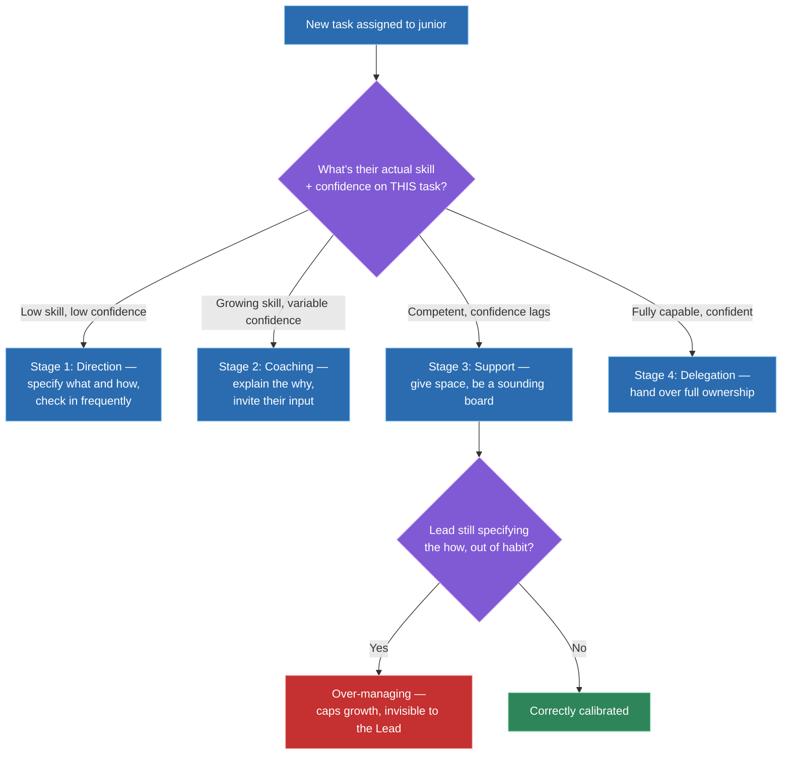
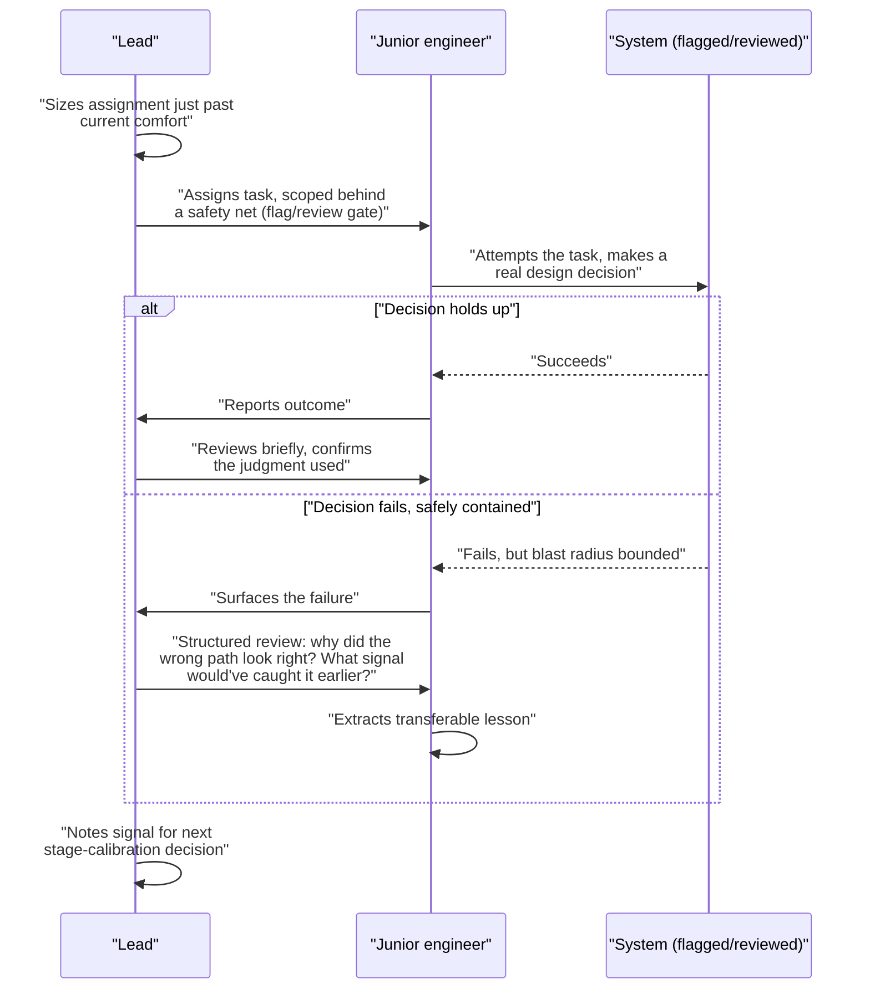

# Mentoring and growing junior developers

## 🎯 Executive Summary

"Are you a good mentor?" is a question almost every candidate answers "yes" to, because almost everyone believes they're approachable and happy to help. That's not the signal a FAANG interviewer is listening for. The actual Lead-level question is whether you can describe a deliberate framework for turning a junior's dependency on you into independent judgment — with a way to calibrate intervention, a structure for practice, and a way to measure whether it's working.

This is a must-know topic because "tell me about someone you developed" is one of the most common behavioral prompts at Staff/Lead level, and most candidates answer it with a warm anecdote instead of a repeatable method. The goal of this topic is a structure you can actually whiteboard: how to calibrate how much to intervene, how to structure stretch and safety net, how to use code review as a teaching surface, how to measure growth, and what to do when it stalls.

## 🧠 Core Technical Deep Dive

### 1. What mentoring is actually optimizing for

"Mentoring" as a vague good-intentions activity — being friendly, answering questions when asked, doing a few extra 1:1s — fails because it has no target. Without a target, a mentor can be well-liked and still be failing at the job.

The correct target is independent judgment, not availability. A mentor who's still the answer to every non-trivial decision two years in has not grown that junior — they've built a dependency, and that dependency is invisible to the mentor because it feels like being helpful. The test isn't "do they still come to me," it's "when they come to me, is the question getting harder, and are they arriving with a proposed answer rather than a blank one."

This reframes the whole topic. Every practice below — the autonomy calibration, the stretch assignments, the review style — is in service of one outcome: the junior making harder decisions correctly, without you, over time.

> **Key takeaway:** the target of mentoring is a junior's independent judgment, not their reliance on you — a mentor who's still needed for every decision two years in has failed at the actual job, no matter how well-liked they are.

### 2. Calibrating intervention: a situational-leadership model

Not every junior needs the same thing, and the same junior doesn't need the same thing on every task — someone confident designing a UI component may be a complete novice at debugging a production incident. The unit of calibration is the *task*, not the person, which is the detail most candidates miss when they describe mentoring as a fixed style.

| Stage | Junior's state on this task | Lead's job | What over- or under-shooting looks like |
|---|---|---|---|
| **1. Direction** | Low skill, low confidence — doesn't know what "good" looks like yet | Specify the what and the how explicitly; check in frequently | Under-specifying here reads as abandonment, not empowerment — they flounder and lose confidence |
| **2. Coaching** | Growing skill, variable confidence — has some working knowledge but gaps | Explain the *why* behind decisions, invite their input, still set the direction | Staying in stage 1 here starts to feel like micromanagement; they've earned a say in the "how" |
| **3. Support** | Competent, but confidence lags the skill — can do the work, still second-guesses | Give space, be available as a sounding board, resist the urge to jump in | Continuing to specify the "how" here is where over-managing out of habit shows up — it caps their growth |
| **4. Delegation** | Fully capable and confident on this class of task | Hand over full ownership, including the decisions about tradeoffs | Any residual check-ins here read as a trust problem, not support |

The failure mode at stages 3 and 4 is more common and more damaging than the failure mode at stage 1, because it's invisible to the mentor — it feels like "just staying close to the work," not like holding someone back. A Lead who defaults to stage-1 behavior on every task, out of habit or anxiety, is the single most common way well-intentioned mentoring caps growth.

> **Key takeaway:** intervention should be calibrated per task against the junior's actual skill and confidence on that task, not applied as one fixed personal style — and the costliest miscalibration is staying in "direction" mode on a task where someone has already earned "support" or "delegation."

### 3. The deliberate-practice structure: stretch, safety net, structured review

Growth doesn't come from doing more of what someone already knows how to do — it comes from a specific structure repeated deliberately: a stretch assignment, a safety net, and a structured review of what happened.

**Stretch assignments** need to be sized just past current comfort. Too small and it's busywork that teaches nothing; too large and it risks a failure severe enough to damage confidence or the system, rather than one that teaches. The sizing judgment — not the assignment itself — is the actual Lead skill here.

**Safety net** means the task is scoped so a failure is real but contained: a feature behind a flag, a change reviewed before merge, an on-call shadow shift rather than solo primary. The junior needs to feel the assignment is genuinely theirs — not secretly guaranteed to succeed — while the Lead has quietly bounded the blast radius.

**Structured review of the failure** is what converts a mistake into learning. Correcting the output alone teaches nothing; walking through *why* the wrong path looked right at the time, and what signal would have caught it earlier, builds the judgment that transfers to the next unfamiliar situation.

> **Key takeaway:** growth comes from a repeated structure — a stretch just past current comfort, a safety net that bounds the blast radius of failure, and a structured review that extracts the transferable lesson — not from throwing someone at hard problems and hoping.

### 4. Code review as a mentoring surface

Code review happens on every PR, which makes it the highest-frequency mentoring surface a Lead has — and also the easiest one to get wrong by accident, because fixing the code is faster than teaching.

| Review style | What it does | What it teaches |
|---|---|---|
| Fixing it directly ("change this to X") | Gets the PR merged fast | Nothing — the junior learns the reviewer will catch it, not how to catch it themselves |
| Asking the right question ("what happens here if the list is empty?") | Takes a bit longer, may need a follow-up round | Builds the judgment to ask that question unprompted next time |

Concretely: "this will throw on an empty array, add a guard" fixes one bug. "What happens here if the list comes back empty — have you traced that path?" fixes the same bug *and* installs a habit the junior will apply to code you never see. The second form costs a little more review time up front and pays it back every PR after.

This isn't a rule to apply to every single comment — a genuine typo or a one-line style nit doesn't need Socratic treatment, and over-applying it turns review into an exhausting puzzle. The judgment call is reserving the question-based style for comments that touch actual design or correctness judgment, where the "why" is the thing worth transferring.

> **Key takeaway:** review comments that fix the code teach nothing and create dependency; review comments that ask the question that leads to the fix build the judgment that transfers — reserve the latter for comments where the underlying "why" is worth transferring, not every nit.

### 5. Measuring whether it's working

"They seem to be doing well" is not a signal an interviewer — or a performance review — will accept, because it's unfalsifiable. The Lead-level version names concrete, observable signals tracked over time.

| Signal | What it indicates | How to observe it |
|---|---|---|
| Decision complexity is rising | Judgment is transferring, not just skill | Compare the kind of decision they escalate to you now vs. 3-6 months ago |
| Escalation frequency is dropping on a *specific* class of problem | That class of problem has moved from stage 1/2 to stage 3/4 | Track what they used to need direction on and no longer do |
| PR review turnaround and quality improving as a *reviewer*, not just an author | They've internalized the standard well enough to apply it to others' code | Look at the questions they ask in review, not just the code they submit |
| They've started mentoring someone more junior, or answering questions in team channels | Judgment is now legible enough to teach | Observe unprompted, don't assign it as a task first |

None of these require a formal survey — they're observable in the normal course of work if you're deliberately watching for them, which is the actual discipline: most Leads don't fail to see these signals because they're hidden, they fail because nobody's tracking them.

> **Key takeaway:** measure mentoring by concrete, observable trend lines — decision complexity, escalation frequency on specific problem classes, review quality as a reviewer, and whether they've started mentoring others — not by a subjective impression of how things are going.

### 6. When mentoring isn't working

Not every mentoring relationship progresses smoothly, and the Lead-level response is diagnosis, not more of the same effort.

| Symptom | Likely cause | Lead response |
|---|---|---|
| Growth has visibly plateaued | Stretch assignments have stopped being genuinely stretchy, or feedback has gone generic | Audit the last few assignments against section 3's sizing; ask directly what they wish they were being trusted with |
| Mentee and Lead have mismatched expectations | Never explicitly discussed what "growth" means for this person's goals | Have the explicit conversation — their career goals may not be the trajectory the Lead assumed |
| Mentee needs a different kind of support | The Lead is naturally directive but the mentee needs space, or vice versa — the Lead is applying their own preferred style regardless of fit | Ask, don't assume; adjust stage-calibration in section 2 to the actual person, not the Lead's default |
| Mentee reacts badly to critical feedback | Feedback delivery, timing, or trust hasn't been established, or the stakes felt higher than intended | Separate the content of the feedback from the delivery; check whether psychological safety, not the feedback itself, is the actual problem |

A stalled mentoring relationship is diagnostic information, not evidence that mentoring "doesn't work" for this person — treating it as a fixed trait rather than a fixable mismatch is itself a common Lead-level mistake.

> **Key takeaway:** when mentoring stalls, diagnose before re-applying more of the same effort — a plateau, a mismatch in expectations, and a style mismatch each have a different, specific fix, and none of them are solved by simply trying harder at the same approach.

## 📊 Visual Architecture & Logic

### Diagram 1 — Calibrating intervention per task

### Diagram 2 — A stretch assignment moving through the deliberate-practice loop

## 🏢 Interview Context & FAANG Signals

This surfaces almost entirely in **behavioral rounds**, most directly as "tell me about someone you grew or developed" and "how do you approach mentoring." It also shows up as a follow-up inside broader leadership questions — "how do you scale yourself" or "tell me about a time you delegated something that mattered" often expect the same framework applied to a specific person.

**Lead signals interviewers listen for:**

- A deliberate framework — some version of calibrating intervention to skill/confidence per task — rather than "I answer their questions and I'm approachable."
- A concrete stretch assignment with a real safety net, not just "I gave them hard work."
- Structured review of a failure that extracted a transferable lesson, not just a story where the mentee eventually succeeded.
- Concrete review-comment phrasing that shows question-based, not fix-based, code review.
- Measurable signals of growth — decision complexity, review quality, whether the mentee now mentors others — instead of a vague positive impression.
- Honest handling of a mentoring relationship that stalled or was mismatched, with a diagnosis, not just a success story.

## ⚔️ Lead Level vs Senior Level

A **Senior** response usually describes being a good, available mentor: "I make time for questions, I try to be patient, and people tell me I'm easy to learn from."

A **Staff/Lead** response treats that as table stakes and goes further. What was the actual calibration — how did they decide when to specify the "how" versus hand over full ownership, and did that judgment change over the relationship? What was a specific stretch assignment, how was the blast radius bounded, and what did the structured review after a failure actually surface? What's the concrete evidence the mentee's judgment grew — a harder decision they now make alone, a PR review they now catch that they wouldn't have caught a year ago, someone *they've* started mentoring? And can they describe honestly a case where mentoring didn't work as expected, and what they diagnosed rather than just powered through?

## ⚠️ Common Pitfalls & Anti-Patterns

> ### ✕ Answering "how do you mentor" with availability instead of a framework
> **Why it's wrong:** "I'm approachable and answer questions" describes a personality trait, not a method — it gives an interviewer nothing to follow up on and is indistinguishable from what every other candidate says.
> **✓ Correct Lead Approach:** Describe the calibration framework directly — how intervention is matched to a junior's skill and confidence on a specific task, and how that's changed over the relationship.

> ### ✕ Fixing the junior's code in review instead of asking the question that leads there
> **Why it's wrong:** A direct fix gets the PR merged but teaches nothing — the junior learns the reviewer will catch the issue, which builds dependency on the reviewer rather than the judgment to catch it themselves.
> **✓ Correct Lead Approach:** For comments that touch real design or correctness judgment, ask the question that leads to the fix ("what happens if this list is empty?") rather than supplying the fix directly.

> ### ✕ Staying in "direction" mode on a task the junior has already outgrown
> **Why it's wrong:** This is the most common and most invisible miscalibration — it feels like diligence to the Lead, but from the junior's side it reads as a lack of trust, and it caps growth on exactly the tasks where they were ready for more ownership.
> **✓ Correct Lead Approach:** Recalibrate per task, not by habit — actively check whether someone has moved from "coaching" to "support" or "delegation" on a given class of task, and hand over ownership when they have.

> ### ✕ Sizing a stretch assignment without a safety net
> **Why it's wrong:** A stretch assignment with no bounded blast radius turns a learning opportunity into a real production or confidence-damaging failure, which teaches avoidance rather than judgment.
> **✓ Correct Lead Approach:** Scope the assignment so failure is real but contained — a flag, a review gate, a shadow shift — so the lesson lands without the cost being too high.

> ### ✕ Treating "they seem to be doing well" as sufficient evidence mentoring is working
> **Why it's wrong:** It's an unfalsifiable impression, not evidence — it can't be defended in a performance review and doesn't tell the Lead whether independent judgment is actually growing or whether the junior has just gotten better at looking fine.
> **✓ Correct Lead Approach:** Track concrete signals over time — the complexity of decisions they now make alone, changes in what they escalate, their quality as a reviewer, whether they've begun mentoring others.

## 🛠️ Practice Scenarios

### Scenario 1 — A Junior's Growth Has Visibly Plateaued

Someone who grew quickly for their first year has been doing the same level of work for the last two quarters, with no clear next step.

Staff-Level Solution

Audit the last several assignments against the sizing judgment from section 3 — plateaus are often caused by assignments quietly drifting back to comfortable, not genuinely stretchy, work, sometimes because it's easier for the Lead to hand out familiar tasks than to size a new stretch. Check specifically whether the feedback they've been getting has gone generic ("good job") instead of pointing at anything.

Have the direct conversation from section 6 rather than guessing — ask what they wish they were being trusted with, and compare that against the Lead's own assumption of their trajectory. Recalibrate the next assignment deliberately against the stage-2/3 boundary in section 2, and set a specific stretch with a bounded safety net rather than "more of the same, but harder."

### Scenario 2 — Over-Managing a Junior Out of Habit

A junior has been ready for full ownership of a task category for months, but the Lead is still reviewing every decision the way they did a year ago.

Staff-Level Solution

Name this as the section-2 failure mode directly — staying in "direction" or "coaching" mode past the point it's earned is the most common and most invisible miscalibration, because it feels like diligence rather than a limiter. The fix starts with honestly re-assessing this specific task category against the stage table, not the person's skill in general.

Move deliberately to "support" or "delegation" for that category: stop specifying the "how," make it explicit that the ownership has shifted, and resist the urge to check in at the old cadence. Treat any lingering discomfort as the Lead's own habit to manage, not a signal the junior isn't ready.

### Scenario 3 — A Stretch Assignment Turned Out Too Big and Had to Be Caught Mid-Failure

A junior was given a task that seemed appropriately stretchy, but partway through it became clear it was beyond them, at real risk to a deadline or system.

Staff-Level Solution

Intervene on the containment, not the assignment itself — this is exactly what the safety net in section 3 exists for, and the correct response is to tighten the blast radius (extend the flag's rollout gate, pair on the remaining piece, extend the timeline) rather than either abandoning them or letting the failure land at full cost.

Afterward, run the structured review honestly: was the sizing miscalibrated, or did something about the task change mid-flight that couldn't have been predicted? Use the answer to recalibrate the next assignment's size, and be explicit with the junior that catching this mid-flight is normal risk management, not evidence they failed.

### Scenario 4 — A Junior Reacts Badly to Critical Feedback

Direct, well-intentioned feedback on a PR or a decision is met with visible defensiveness or discouragement, and future feedback starts getting a similar reaction.

Staff-Level Solution

Separate delivery from content before assuming the feedback itself was wrong — check whether the framing was fix-oriented ("this is wrong, change it") rather than question-oriented ("what happens if X — have you considered it"), since the latter lands as curiosity rather than correction even when the underlying point is identical.

If the pattern persists across well-delivered feedback too, treat it as a psychological-safety or trust problem, not a feedback-calibration problem — check whether stakes have felt higher than intended, or whether enough positive-signal feedback exists in contrast so critical feedback doesn't read as the only kind they get from this Lead.

### Scenario 5 — Mentoring Someone More Senior Than Expected Who Resents Being "Mentored"

A newly-promoted Lead is assigned to mentor someone with more tenure or deeper domain expertise in one area, who visibly resents the framing.

Staff-Level Solution

Reframe immediately, out loud — the relationship isn't "I know more than you," it's calibrated per task from section 2, and on this person's area of deep expertise the correct stage is likely "support" or "delegation" from day one, not "direction." Naming that explicitly defuses the resentment because it's accurate, not diplomatic.

Find the specific areas — not the person's whole scope — where genuine coaching value exists (organizational context, a skill genuinely outside their prior experience, career navigation) and focus there, rather than manufacturing mentoring opportunities where none are needed. The goal is still their independent judgment growing on real gaps, not performing a mentor role uniformly.

### Scenario 6 — Measuring Mentoring Impact for a Performance Review

A Lead needs to write a performance-review section describing their impact developing a specific junior, and "they've grown a lot" isn't going to hold up.

Staff-Level Solution

Pull the concrete signals from section 5 directly: name a specific decision they now make independently that they used to escalate, with a before/after example; cite a change in their PR review quality as a reviewer, not just as an author; note if they've started mentoring someone more junior or answering questions in team channels unprompted.

Tie each signal to a specific intervention where possible — a stretch assignment and what it taught, a structured review after a contained failure — so the review reads as a causal account of deliberate development, not a coincidence of the junior having a good year on their own.

### Scenario 7 — A Remote/Async Mentoring Relationship

The mentee is in a different timezone with minimal real-time overlap, and the usual mechanisms — pairing, quick check-ins, hallway questions — don't work the same way.

Staff-Level Solution

Shift the calibration signal from section 2 to what's observable async — PR descriptions, review comments, written design docs — since real-time observation of hesitation or confidence is mostly unavailable. Make code review carry more of the coaching load deliberately, since it's inherently async-friendly, and be more explicit in writing about the "why," since it won't get filled in through a quick verbal aside later.

Structure the deliberate-practice loop from section 3 around written artifacts — a stretch assignment with an explicit written safety net and an async structured-review document after a failure, rather than assuming a live conversation will happen. Protect a fixed, recurring overlap window specifically for this relationship rather than letting it erode to whatever's left over.

### Scenario 8 — A Mentee Wants to Leave the Team or Company

Mid-relationship, the mentee reveals they're considering leaving — for another team, another company, or a different track entirely.

Staff-Level Solution

Treat this as consistent with, not opposed to, the actual goal from section 1 — the goal was always their independent judgment and growth, not their retention on this specific team, and reacting defensively signals the opposite was true all along. Ask genuinely what's driving it, since a mismatch in section 6's terms (stalled growth, wrong kind of support) is sometimes fixable and sometimes isn't.

If the move is genuinely right for them, support it concretely — a strong reference, help navigating the transition, an honest read on the new opportunity — since how a Lead handles this is itself observed by the rest of the team and shapes whether anyone trusts them with this conversation again. If it's a fixable mismatch, name the specific fix directly rather than making a vague case for staying.

</content>
