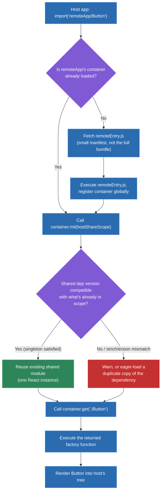
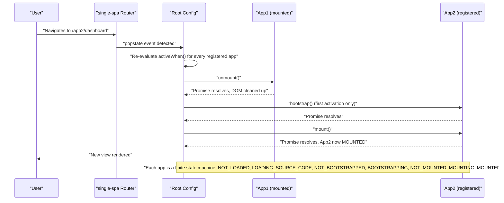

# Micro-frontend architecture: Module Federation, single-spa, iframes

## 🎯 Executive Summary

Micro-frontend architecture decomposes a frontend application into independently developed, independently deployed units owned by separate teams, composed together into a single user-facing experience — the frontend analogue of microservices. The three dominant integration mechanisms — **iframes** (browser-level realm isolation), **single-spa** (client-side routing orchestration with a lifecycle contract), and **Module Federation** (runtime JS module sharing with dependency negotiation) — sit at very different points on the isolation-vs-integration spectrum, and picking the wrong one for the wrong reason is a common, expensive mistake.

This is a must-know topic for a Lead because organizations at FAANG scale structure frontend ownership around team boundaries (Conway's Law made explicit), and a Lead is expected to reason about the *organizational* trade-offs — deployment independence vs. version governance, team autonomy vs. shared runtime consistency, blast-radius containment — not just wire up a bundler plugin. The deeper signal interviewers probe for is judgment: knowing when micro-frontends solve a real organizational problem versus when they add coordination tax without corresponding benefit.

## 🧠 Core Technical Deep Dive

The mechanics here only really click in the order a real team runs into them, so this section is told as one continuous story — a fictional but realistic team, "Meridian," building and then living with a federated frontend. Every technical claim below is doing double duty: it's advancing the story, and it's the thing you'd say out loud in an interview.

### Act 1 — The problem that predates any of these tools

Meridian's storefront started as one React app, one repo, one deploy pipeline. Three teams now touch it — Search, Cart, and Checkout — and every deploy requires all three to coordinate a merge window, because they all ship from the same build. Search wants to ship twice a day; Checkout, understandably, wants a slower, more deliberate cadence with more review. One pipeline can't satisfy both.

The instinctive first fix — route-based code-splitting with `React.lazy` — doesn't touch the actual problem. Splitting `/checkout` into its own chunk changes *what* gets downloaded, not *who* can deploy it; it's still one repo, one build, one release train. The problem Meridian actually has is an **organizational** one wearing a technical costume: three teams need three independently deployable artifacts that still compose into one page. That's the entire reason this category of tooling exists.

> **Key takeaway:** micro-frontend tooling answers a deployment-ownership question, not a code-splitting question — if the real problem is bundle size, none of what follows is the right fix.

### Act 2 — Three prototypes, and why two get ruled out fast

Meridian's platform team spikes all three approaches against the same slice: pulling Cart out of the monolith first, since it's the most self-contained.

**The iframe spike.** Wrapping Cart in an `<iframe src="https://cart.meridian.internal">` works within an afternoon — and immediately exposes what that isolation actually costs. The iframe gets its own JS realm: its own global object, its own task queue, and because it's cross-origin, Chrome's Site Isolation puts it in a separate OS process entirely. That's genuinely strong isolation — the host literally cannot reach into Cart's DOM or read its variables — but it means Cart's copy of React boots from scratch, parsed and executed independently of the host's own React, with no way to share a reconciler across that boundary.

The only channel between host and iframe is `postMessage`, and payloads there go through the structured clone algorithm: no functions, no DOM references, only serializable data. Cart doesn't auto-size to its content either, so the host needs a `ResizeObserver` inside the iframe posting height changes back out, and the host resizing the `<iframe>` element in response — a small, permanent tax on every layout change.

For Cart, which needs to share checkout-session state fluidly with the rest of the page, this is the wrong trade: real isolation, bought at a price Cart doesn't need to pay.

**The single-spa spike.** Next they try single-spa, which turns out to solve a different problem than they expected — it's not a code-sharing mechanism at all, it's a **router and lifecycle orchestrator**. Each micro-frontend has to conform to a contract: `bootstrap()`, `mount()`, `unmount()`, optionally `update()`, usually wrapped by a framework adapter like `single-spa-react` so React's own root creation and teardown maps onto single-spa's state machine. A root config registers Cart like this:

```javascript
registerApplication({
  name: 'cart',
  app: () => System.import('cart'),
  activeWhen: (location) => location.pathname.startsWith('/cart'),
});
```

Under the hood, single-spa historically leans on SystemJS and import maps for runtime module loading — a JSON file mapping bare specifiers to actual URLs:

```json
{
  "imports": {
    "cart": "https://cdn.meridian.com/cart/2.4.1/main.js",
    "react": "https://cdn.meridian.com/shared/react@18.2.0.js"
  }
}
```

That's genuinely powerful — the platform team can repoint `cart` to a new deployed version by editing one JSON file, no host rebuild required. But it exposes single-spa's real gap for Meridian's case: there's no *enforced* dependency sharing. If Cart's import map entry for `react` drifts from Checkout's, both quietly get their own React instance, and nothing in the toolchain catches it — it's a convention, not a guarantee. (single-spa does offer **parcels** — a lighter-weight API for mounting a single component without registering a whole application — which is worth knowing about for embedding one widget rather than an entire route, but it doesn't change the dependency-sharing story.)

**Where Module Federation wins the spike.** Module Federation is the one option built specifically around *enforced, runtime-negotiated* dependency sharing, which is exactly Meridian's actual requirement: Cart needs to share React Context (a persisted checkout session) with the rest of the page, not just sit next to it. The team writes this up as a comparison for the architecture RFC:

| Approach | Isolation | Shared deps | Deploy independence | Runtime overhead | Typical use case |
|---|---|---|---|---|---|
| **iframe** | Full — separate JS realm, separate global object, often separate renderer process (Site Isolation) | None — each iframe loads its own copy of everything | Full | High — duplicate framework/runtime per iframe, manual resize/postMessage coordination | Untrusted third-party content, hard security boundaries (payments, ads) |
| **single-spa** | None — shared JS realm, shared DOM | Manual, convention-based (import maps) | Full — apps registered independently, fetched from CDN URLs | Low, but duplicate framework instances are possible if teams don't align import maps | Incremental legacy migration (e.g. AngularJS → React), route-owned apps |
| **Module Federation** | None — shared JS realm | Automatic, semver-aware, runtime-negotiated singleton sharing | Full — remotes fetched at runtime via `remoteEntry.js` | Low-medium — network cost for remote manifest/chunk fetch, but deduped shared deps | Page- or component-level federation with enforced dependency governance |

They also keep single-spa around, deliberately — not for Cart, but for the separate problem of an old AngularJS admin tool that needs a slow, incremental React migration. That's a routing/lifecycle problem, single-spa's actual specialty, and it runs alongside the Module Federation work rather than competing with it.

> **Key takeaway:** the three approaches trade isolation for integration in opposite directions, and the right choice follows directly from which one Meridian actually needed here — enforced dependency sharing, not a trust boundary and not just a mount/unmount contract.

### Act 3 — Following one page load through Module Federation

Here's what actually happens, step by step, the first time a browser requests Meridian's checkout page after Cart goes federated.

The host's webpack config exposes the pieces each side needs:

```javascript
// cart/webpack.config.js (the remote)
new ModuleFederationPlugin({
  name: 'cart',
  filename: 'remoteEntry.js',
  exposes: { './CartSummary': './src/CartSummary' },
  shared: { react: { singleton: true, requiredVersion: '^18.0.0' } },
});

// checkout/webpack.config.js (the host)
new ModuleFederationPlugin({
  name: 'checkout',
  remotes: { cart: 'cart@https://cdn.meridian.com/cart/remoteEntry.js' },
  shared: { react: { singleton: true, requiredVersion: '^18.0.0' } },
});
```

The host's bundle loads first and executes normally — up until it hits `import('cart/CartSummary')`. At that exact point, the webpack runtime fetches `remoteEntry.js`. This file is deliberately tiny: it is *not* Cart's application code, it's a small manifest that, when executed, registers a global container object exposing exactly two functions — `get(moduleName)`, which resolves to a factory for a requested exposed module, and `init(shareScope)`, which registers Cart's shared dependencies into a shared scope object the host also participates in.

The runtime calls `init()` first. This is the actual negotiation: both sides declared `react` as `singleton: true` with an overlapping `requiredVersion` range, so the shared scope resolves to a single React instance — whichever copy satisfies both ranges, reused by both host and remote. Only *then* does the runtime call `get('./CartSummary')`, which resolves to a factory function; executing that factory returns the real component, which finally gets rendered into the host's tree using the one shared React instance.

Notice the two-phase fetch this creates: `remoteEntry.js` (a manifest) first, then Cart's actual code chunk only once `get()` is called and webpack knows precisely which module is needed. That's deliberate lazy-loading — and it's also exactly the mechanism that causes the waterfall problem in Act 5.

One more detail worth knowing cold: federation is **symmetric**. Cart is a remote to Checkout here, but nothing stops Cart from also consuming a remote of its own — any app can be host and remote simultaneously, a genuinely different shape from single-spa's single-root-config-orchestrates-children model.

> **Key takeaway:** version negotiation happens the moment `init()` runs, at *runtime*, in a real user's browser — a host and a remote can be built independently, days apart, and the very first time incompatibility surfaces is in production, not in CI.

### Act 4 — Six months later, the Friday-afternoon incident

Checkout's team upgrades to React 18.3 for a concurrent-rendering feature. Cart is still on 18.1. Someone bumps Checkout's `requiredVersion` to `^18.3.0` but forgets Cart declared `^18.0.0` — the ranges no longer overlap — and it ships on a Friday.

Here's exactly what breaks, tying straight back to Act 3's mechanics: at `init()` time, the shared scope can no longer satisfy both singleton requirements from one React copy, so it falls back to an eager duplicate load — Cart gets its own second React instance rather than reusing Checkout's.

Because `CartSummary` is mounted inside Checkout's component tree but now runs against a *different* React internals object, its Context reads come back empty — the checkout-session Context, provided by an ancestor from the *other* React instance, is invisible to it. Its hooks throw "Invalid Hook Call: Hooks can only be called inside the body of a function component," a genuinely confusing error for whoever's on call, because the code they're looking at is completely ordinary.

The fix that actually resolves it: realign both `requiredVersion` ranges so they overlap again. The fix that prevents a repeat: this is exactly the shared-dependency governance table from the RFC come to life —

| Strategy | How duplicate instances are prevented | Failure mode when misconfigured |
|---|---|---|
| Module Federation singleton sharing | Runtime negotiation via shared scope, semver range matching (`shared: { react: { singleton: true, requiredVersion: '^18.0.0' } }`) | Version-mismatch warning/error, or an eager duplicate load silently bloating the bundle |
| single-spa + import maps | Convention — every app's import map entry points at the same CDN URL/version | Silent duplicate load if one team's import map entry drifts; nothing catches it at build time |
| iframe | N/A — duplication is inherent and intentional | N/A — it's the isolation you're paying for, not a defect |

Meridian's platform team turns the postmortem into process. They add contract tests in CI that check a remote's exposed shape *and* its `shared` ranges against the currently-deployed host, not just against the remote's own local build. They also pin each host release to a specific `remoteEntry.js` version instead of always floating to "latest," so a bad Cart deploy can't silently reach Checkout's production traffic at all.

> **Key takeaway:** this incident is the single most interview-relevant scenario in the whole topic — it's where "I know Module Federation exists" and "I've actually reasoned about how federated systems fail in production" visibly diverge.

### Act 5 — The Tuesday-morning performance regression

A month after Cart's federation launch, RUM dashboards show Time to Interactive regressed by roughly 800ms on checkout — with no corresponding growth in any individual bundle's size. The investigation lands exactly where Act 3 predicted it would: the network panel shows a sequential chain, not a parallel one — host bundle finishes, *then* discovers it needs `remoteEntry.js`, *then* fetches it, *then* discovers the actual `CartSummary` chunk, *then* fetches that. Every arrow in that chain is a full round trip a single-bundle app never had to pay.

The fix is to stop treating Cart as a surprise: since Checkout's team already knows Cart is needed on this route, they add `<link rel="modulepreload">` for Cart's `remoteEntry.js` (or an eager import at the top of the route module) so that fetch starts in parallel with the host's own bundle instead of after it. They also confirm CORS and preconnect headers are set correctly on the CDN serving `remoteEntry.js`, since a cross-origin remote otherwise adds avoidable DNS/TLS setup time to every cold load on top of the fetch itself.

This also exposes a structural monitoring gap: a traditional bundle analyzer assumes one build produces one deployable artifact, but in a federated system the actual bytes a real user downloads depend on which remote versions happen to be live that day — only knowable at runtime. Meridian ends up tracking real delivered bytes per session via RUM, not just a static CI budget per repo.

They also add an Error Boundary around every federated mount point, so Cart's failure can never crash the Checkout shell. It's the same per-boundary isolation single-spa gets for free from its lifecycle state machine, which quarantines a broken app into a `SKIP_BECAUSE_BROKEN`-style state instead of taking down the root config.

> **Key takeaway:** federation trades a knowable, single-build performance profile for a dynamically composed one, and that trade needs its own runtime monitoring strategy — a CI bundle-size gate alone can't see the problem Meridian just had.

## 📊 Visual Architecture & Logic

### Diagram 1 — Module Federation runtime resolution flow



### Diagram 2 — single-spa route-driven mount/unmount lifecycle



## 🏢 Interview Context & FAANG Signals

Micro-frontend architecture surfaces in **system design rounds** (composing a product surface owned by three or four separate teams — search, checkout, recommendations — into one page), **technical deep-dive/pairing rounds** (implement a federated mount point with an error boundary, or debug a "two React instances" bug), **architecture review discussions**, and occasionally **behavioral rounds** ("tell me about a platform decision you owned that other teams had to build on top of").

**Lead signals interviewers listen for:**

- Reasoning about *why* micro-frontends at all — team autonomy and independent deploy cadence as the actual driver, not novelty.
- Explicit shared-dependency governance strategy: singleton enforcement, semver policy, what happens on a version conflict.
- Failure-isolation design: error boundaries per mount point, fallback/skeleton states, circuit-breaker-style handling of a remote that's down or repeatedly erroring.
- Rollout/rollback strategy for independently deployed remotes — pinned vs. floating remote versions, canary exposure, contract testing between host and remote.
- Organizational awareness (Conway's Law) — technical boundaries should mirror team boundaries, and proposing MFEs across a boundary with no real ownership split is a red flag.
- Explicit judgment about when *not* to adopt this pattern — the honest "this adds coordination tax with no matching organizational benefit here" answer is a strong signal, not a weak one.

## ⚔️ Lead Level vs Senior Level

A **Senior** answer is usually mechanically correct and stops there: "I'd use Module Federation to share components between the two apps, and set `shared: { react: { singleton: true } }` so we don't end up with two copies of React."

A **Staff/Lead** answer keeps going into the parts that only show up once something has gone wrong in production: how do you prevent a remote's breaking change from reaching a host that never rebuilt against it (contract testing, staged/canary remote rollout, pinning `remoteEntry` URLs per host release instead of always resolving "latest")? What's the circuit-breaker behavior when a remote is down — does the host degrade to a cached last-known-good version, a skeleton, or a hard error? How do you keep bundle-size regressions from being invisible when any of five teams can independently ship a heavier remote (per-remote CI budget gates, aggregate RUM dashboards, not just a single build-time check)? And critically: is this the right problem to solve with micro-frontends at all, or is the team small enough that a monorepo with good ownership conventions gets the same autonomy without the runtime cost — the same premature-adoption trap microservices fell into a decade earlier, now showing up on the frontend.

## ⚠️ Common Pitfalls & Anti-Patterns

> ### ✕ Skipping `singleton: true` (or letting import map entries drift)
> **Why it's wrong:** Each app silently gets its own React instance. Context stops propagating across MFE boundaries, and mixing components across the boundary throws "Invalid Hook Call" errors that look like a totally unrelated bug.
> **✓ Correct Lead Approach:** Treat shared framework dependencies as a governed contract, not a convention — enforce `singleton: true` with a `requiredVersion` range in Module Federation, or add CI tooling that diffs import map entries across all registered single-spa apps and fails the build on drift.

> ### ✕ Over-federating down to individual components
> **Why it's wrong:** Federating every button and icon multiplies `remoteEntry.js` round trips and manifest-resolution overhead, turning a page load into a request waterfall — the frontend equivalent of the microservices "nanoservices" anti-pattern.
> **✓ Correct Lead Approach:** Federate at team-ownership boundaries (a page, a well-defined feature surface), and distribute genuinely shared low-level components through a versioned package/design-system, not through federation.

> ### ✕ No contract testing between host and remote
> **Why it's wrong:** Because resolution happens at runtime, a remote can change its exposed module's shape and the host won't find out until a real user's browser breaks — there's no build-time compiler catching the mismatch.
> **✓ Correct Lead Approach:** Treat the exposed module surface as a versioned API. Run contract tests (or TypeScript-shared type packages) in CI against the *deployed* remote, not just the remote's local build.

> ### ✕ Letting CSS bleed across MFE boundaries
> **Why it's wrong:** Outside an iframe, all MFEs share one DOM and one CSSOM. An unscoped global class name in one team's MFE can silently override another team's styles, and the failure often only shows up for real users on a specific route combination.
> **✓ Correct Lead Approach:** Enforce CSS Modules, scoped CSS-in-JS, or per-MFE Shadow DOM wrapping as a platform-level requirement, not a per-team choice.

> ### ✕ Choosing iframes for developer convenience rather than a real trust boundary
> **Why it's wrong:** Iframes solve a security-isolation problem at a steep UX cost — janky manual resizing, broken deep-linking, degraded accessibility/focus management, and a fully duplicated framework runtime per iframe. None of that is worth paying if the actual goal was just "let this team deploy independently."
> **✓ Correct Lead Approach:** Reach for iframes only when there's a genuine trust boundary (untrusted third-party content, payment processors). For organizational isolation with a shared trust level, single-spa or Module Federation solve the actual problem without the isolation tax.

## 🛠️ Practice Scenarios

### Scenario 1 — Composing a Checkout Flow Owned by Three Teams

The cart, payment, and order-confirmation steps of checkout are each owned by a different team, each wanting to deploy independently. Design the integration architecture.

<details>
<summary>Staff-Level Solution</summary>

Module Federation over iframes here — this is an organizational boundary (three teams), not a trust boundary; iframes would impose unnecessary isolation cost (triplicated framework runtime, broken cross-step state) for no security benefit. Use single-spa or a thin custom root config as the orchestrator to mount cart → payment → confirmation based on step state, with each step federated as a remote exposing a well-typed module surface (shared TypeScript types package, versioned).

Enforce `singleton: true` for React and any shared state-management library so cart/payment/confirmation can share checkout-session context across the boundary without prop-drilling through the host. Put an Error Boundary around each mounted step with a fallback that doesn't lose the user's cart state (host owns the persisted checkout-session state, not the individual remotes, so a broken remote doesn't wipe user progress). Pin each remote's `remoteEntry.js` URL to a specific deployed version per host release rather than always resolving "latest," and require contract tests against the actual deployed remote in each team's CI before promoting to production — a checkout flow is exactly the surface where a silent runtime mismatch is most expensive.

</details>

### Scenario 2 — Debugging "Invalid Hook Call" After Adding a Federated Remote

A team wires up a new Module Federation remote. Everything builds fine, but in production, mounting the remote's component inside the host throws "Invalid Hook Call: Hooks can only be called inside the body of a function component."

<details>
<summary>Staff-Level Solution</summary>

This is almost always two React instances in the shared scope — the remote isn't actually resolving React from the host's shared scope, so its hooks run against a different React internals object than the tree it's mounted into. Check the `shared` config on both host and remote: `react`/`react-dom` need `singleton: true` on *both* sides, not just the host, and the `requiredVersion` ranges need to actually overlap. A common root cause is one side omitting `eager: false` handling correctly, or a remote pinning an exact React version outside the host's declared range, silently triggering the "eager duplicate load" fallback instead of reuse.

Verify by inspecting the browser's module registry at runtime (or a quick `console.log` of `React.version` from both the host bundle and the federated component) rather than assuming from the config alone — version negotiation failures are a runtime phenomenon and the build succeeding proves nothing about it.

</details>

### Scenario 3 — Embedding a Third-Party Partner Widget

Product wants to embed a partner company's interactive widget (their code, their deploys) directly into a checkout page.

<details>
<summary>Staff-Level Solution</summary>

This is a genuine trust boundary — the partner's code is untrusted from a security standpoint even if functionally trustworthy — so an iframe is the correct choice here, not Module Federation. Federating in an external company's remote would mean giving their JavaScript full access to your page's DOM, cookies, and any tokens in scope; that's not a risk worth taking for a widget.

Design the integration around `postMessage` with a strict, versioned message schema, validate `event.origin` on every received message, and set `sandbox` attributes on the iframe scoped to only the capabilities actually needed. Handle the resize/height-communication problem explicitly (`ResizeObserver` inside the iframe → `postMessage` height → parent resizes the `<iframe>` element) since it won't happen automatically, and budget real UX cost for the duplicated framework runtime the partner's bundle brings with it.

</details>

### Scenario 4 — A Remote Deploy Breaks Production; Design the Rollback Path

A federated remote's team ships a change that breaks the host page for a subset of users. Design how this gets detected and rolled back.

<details>
<summary>Staff-Level Solution</summary>

Detection first: this requires real-user monitoring on federated mount points specifically (error boundary triggers reported with the remote's version tag), not just aggregate JS-error monitoring, since the failure is scoped to one remote's version, not the whole app. Canary the remote's rollout — a small percentage of traffic resolves the new `remoteEntry.js` version first — so the blast radius is bounded before full rollout.

Rollback needs to be independent of a host redeploy: if hosts pin remote versions via an explicit manifest/config (rather than always resolving "latest" from a mutable URL), rollback is just reverting that manifest entry, deployable in minutes without touching the host's own build. If hosts instead always float to "latest," the remote team needs the ability to instantly repoint the mutable URL back to the last-known-good build — but that's a weaker design specifically because it removes the host's ability to opt out of a bad remote release, which is the deeper architectural fix worth raising in the design discussion itself.

</details>

### Scenario 5 — Distributing a Shared Design System Across Federated Apps

Five federated teams each need the same button, input, and modal components, styled consistently, but each team ships on its own cadence.

<details>
<summary>Staff-Level Solution</summary>

Don't federate individual design-system components — that's the over-federation anti-pattern, creating a remote round trip for something as small as a button. Distribute the design system as a versioned npm package instead, consumed as a normal build-time dependency by each federated app. Reserve Module Federation's `shared` scope specifically for framework-level singletons (React, a state management library) where a single runtime instance is a correctness requirement, not for UI leaf components where independent versioning per team is actually fine.

If visual consistency across independently-versioned design-system consumers becomes a real operational problem (teams drifting onto old major versions), that's solved with a deprecation/upgrade policy and CI linting against the design system's version range — a process fix, not a federation-architecture fix.

</details>

### Scenario 6 — Migrating a Legacy AngularJS App to React Incrementally

A large, actively-used AngularJS application needs to move to React without a multi-quarter rewrite freeze.

<details>
<summary>Staff-Level Solution</summary>

This is the canonical single-spa use case, not Module Federation's — the goal is route-by-route or feature-by-feature replacement with both frameworks mounted simultaneously during the transition, which is exactly single-spa's lifecycle-orchestration model. Wrap the existing AngularJS app with `single-spa-angularjs` as one registered application; build new features as separate React applications wrapped with `single-spa-react`, registered against the routes being migrated.

Sequence the migration by route/feature ownership boundary, not by component — trying to interleave AngularJS and React within a single view multiplies coordination complexity for no benefit. Keep both frameworks' bundles from bloating the page during the transition by ensuring `activeWhen` boundaries are route-scoped so users only ever download the framework bundle for the route they're actually on, not both frameworks on every page. Set an explicit sunset milestone for the AngularJS registration — an indefinite two-framework steady state is a cost, not a stable end state.

</details>

### Scenario 7 — Diagnosing a Federation-Caused Waterfall Regression

After migrating a page to Module Federation, Time to Interactive regresses by 800ms in RUM data, even though individual bundle sizes didn't grow.

<details>
<summary>Staff-Level Solution</summary>

This is very likely a request waterfall, not a bundle-size problem — check the network panel for a sequential chain: host bundle loads, *then* discovers it needs `remoteEntry.js`, *then* fetches it, *then* discovers the actual chunk it needs, *then* fetches that. Each hop is a full round trip that a single-bundle app never paid.

Fix by eagerly loading `remoteEntry.js` for remotes known to be needed on this route (`<link rel="modulepreload">` or an eager import at the top of the host's route module, rather than only on-demand at the point of use), and check whether shared-dependency negotiation is triggering extra fetches for dependencies that should have deduped. If the remote is fetched from a different origin, also verify CORS/preconnect headers aren't adding avoidable DNS/TLS setup time to every cold load.

</details>

### Scenario 8 — Deciding Whether to Adopt Micro-Frontends At All

A 12-person frontend team, one codebase, is asking whether to split into micro-frontends "to move faster."

<details>
<summary>Staff-Level Solution</summary>

The honest Staff-level answer is usually no, not yet — micro-frontends solve a coordination problem between teams that don't want to share a deploy pipeline or a release cadence. A single 12-person team sharing one codebase doesn't have that problem; it has, at most, a build-time or module-boundary problem, which a well-organized monorepo with clear ownership directories and lint-enforced boundaries solves without paying any of the runtime cost (shared-dependency governance overhead, request waterfalls, federation debugging complexity).

The right trigger for adopting this pattern is organizational, not technical: multiple teams needing genuinely independent deploy cadences, or a large enough surface that a single CI pipeline becomes the bottleneck. Recommending premature adoption here repeats the microservices-for-a-five-person-startup mistake one layer up the stack — and being willing to say so, even though the interviewer asked a micro-frontend question, is itself part of the signal a Staff/Lead answer is expected to send.

</details>
