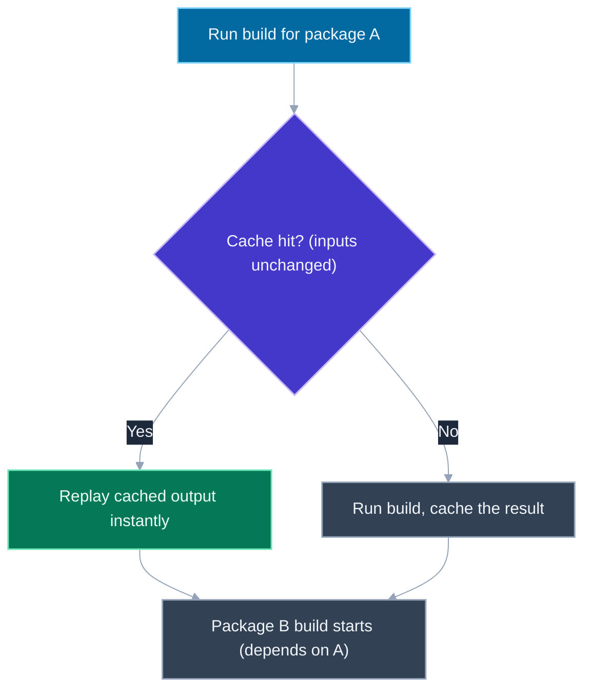
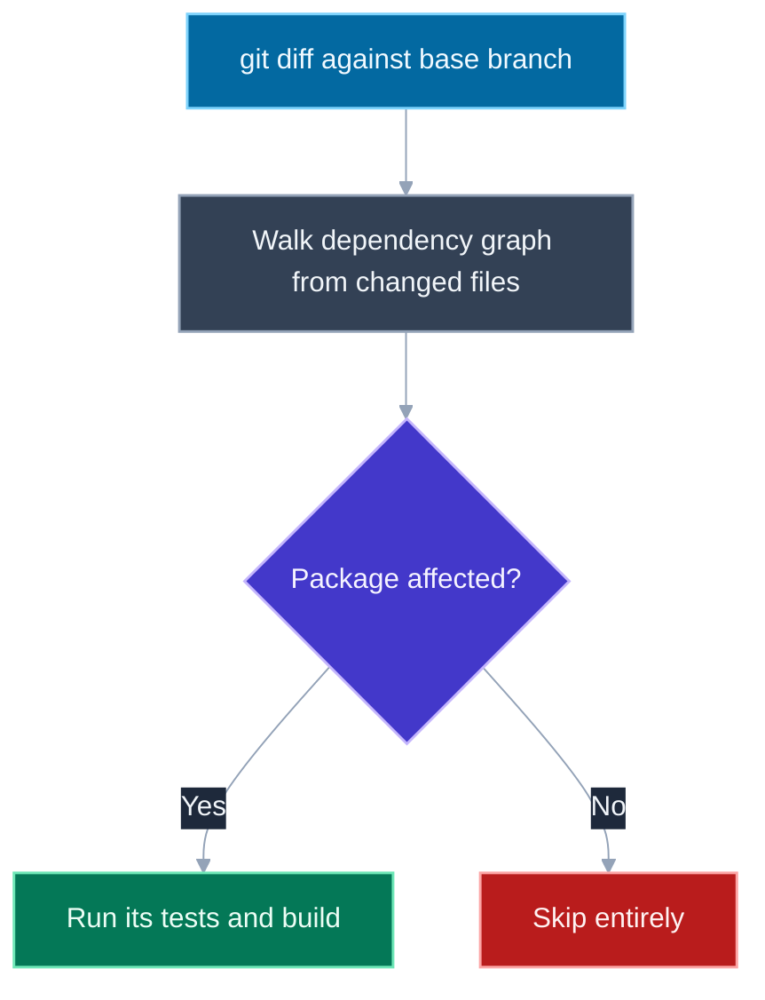

# Monorepo Architecture: Turborepo, Nx, pnpm Workspaces

## 🎯 Executive Summary

A monorepo is one repository holding multiple packages or apps, but that one-sentence description is also exactly why the topic gets tested at Lead/Staff level and routinely misunderstood below it: "putting files in the same repo" is a trivial `git init`, while the actual engineering problem a monorepo raises — orchestrating builds and tests across dozens or hundreds of interdependent packages without CI time exploding — is a real tooling problem with a real, well-known solution shape. Interviewers use this topic to check whether a candidate understands that distinction, because "we use a monorepo" said without knowing what task orchestration and caching are is a strong signal of surface-level exposure rather than hands-on ownership.

This shows up in frontend system design and architecture rounds as "how would you structure the codebase for a design system consumed by multiple product teams," "how do you keep CI fast as the number of packages grows," or a direct "walk me through Turborepo vs Nx and when you'd pick one." It's also a common follow-up once a candidate proposes sharing code between a design system and multiple consuming apps in an unrelated system design answer — the interviewer pulls the thread to see if the candidate actually understands what makes that sharing practical at scale, versus just naming it as a nice idea.

The through-line for a Lead-level answer: workspaces (pnpm/yarn/npm) give you dependency *linking* between local packages, and that's it — the caching, task-graph orchestration, and affected-based CI that make a monorepo scale to hundreds of packages come from a layer on top (Turborepo or Nx), and conflating the two layers is the single most common gap in a shallow answer.

## 📖 What Is It? (Plain-English Definition)

**In plain terms:** a monorepo is a single Git repository that contains multiple separate packages or applications — for example, a shared UI component library, a design-tokens package, and three product apps that all consume them — living side by side instead of each getting published to a registry from its own separate repository.

A useful distinction to hold onto: a monorepo is not the same thing as a **monolith**. A monolith describes an application's internal architecture — one large, usually tightly-coupled codebase with poorly-separated concerns. A monorepo describes where code *lives* — one repository — and says nothing by itself about how coupled the code inside it is. You can have a monorepo with cleanly separated, independently-versioned packages that happen to share a repository for convenience, and you can equally have a monolith split across many repositories that are still a tangled mess to work with. The two axes — "how many repos" and "how coupled is the code" — are independent.

The analogy worth keeping: think of a monorepo like several separate shops sharing one building. Each shop (package) can still have its own storefront, staff, and inventory — meaning its own `package.json`, its own versioning if desired, its own team ownership — but they share the building's plumbing and electrical (the tooling, CI config, dependency resolution), so upgrading the building's wiring once upgrades it for every shop at the same time, instead of each shop needing its own separate renovation project.

That shared-infrastructure benefit is real, but it only pays off if the building also has a working system for figuring out which shops need to be inspected after a change to the wiring — which is what the rest of this topic is actually about.

---

## 🧠 Core Technical Deep Dive

### Why teams adopt a monorepo

Three benefits recur across teams that move to a monorepo, and a Lead-level answer should be able to name all three, not just "code sharing":

**Atomic cross-package changes.** If a shared UI library and three apps that consume it live in separate repositories, a breaking change to the library requires a PR in the library's repo, a publish, then separate PRs in each consuming app to bump the dependency version and adapt to the change — a multi-repo, multi-PR process where it's easy for a consumer to lag behind or for CI in the library's repo to pass while CI in a consumer's repo silently breaks later. In a monorepo, one PR can change the shared library *and* update all its consumers in the same commit, and CI for that single PR can verify nothing downstream broke, all in one atomic unit.

**Code sharing without registry friction.** Sharing an internal utility or component between two apps in separate repos means publishing it as a versioned package to a registry (public or private), and every consumer has to bump and re-install that version to pick up a change. In a monorepo, workspace linking (below) makes an internal package resolve like any other dependency without an actual publish step, so iterating on shared code and immediately using the result elsewhere in the repo is instant.

**Unified tooling and CI configuration.** Linting rules, TypeScript configuration, CI pipeline definitions, and dependency versions can be defined once and apply consistently across every package, instead of drifting independently across N separate repositories that each maintain their own copies of this configuration.

> **Key takeaway:** the three real benefits are atomic cross-package changes, registry-free internal code sharing, and unified tooling/CI — "it's more convenient to have one repo" understates what's actually being gained.

### The problem monorepo *tools* solve — not just "files in one repo"

Putting multiple packages in one Git repository is trivial and solves none of the interesting problems by itself. The actual technical challenge that monorepo tooling exists to solve is **build/task orchestration with caching** at scale: if a repository holds 200 packages and a developer changes one small shared utility, naively running "build everything" or "test everything" on every change becomes prohibitively slow as the package count grows, even though the overwhelming majority of those 200 packages weren't touched by the change and don't need to be rebuilt or re-tested at all.

This is the crux of the whole topic, and it's the detail that separates "I've heard of Nx" from "I understand why Nx exists." A monorepo without task-orchestration tooling is just a repository that happens to contain more than one package — genuinely useful for atomic changes and code sharing, but with none of the build-time or CI-time scaling story that makes monorepos viable at hundreds of packages.

> **Key takeaway:** the hard technical problem isn't "how do multiple packages coexist in one repo" — that's free — it's "how do we avoid rebuilding and retesting everything, every time, as the package count grows," and that's what Turborepo/Nx actually solve.

### Workspaces: the foundational layer (pnpm, yarn, npm)

**Workspaces** — a feature of pnpm, yarn, and npm — are the layer that makes a monorepo structurally possible in the first place. A workspace configuration declares which directories in the repo are packages, and the package manager symlinks each local package into the others' `node_modules` so that, for example, an app package can `import` from a local shared UI package exactly the way it would import any published npm dependency, with no publish step involved.

```json
// pnpm-workspace.yaml
packages:
  - "apps/*"
  - "packages/*"
```

```json
// apps/web/package.json
{
  "dependencies": {
    "@myorg/ui-components": "workspace:*"
  }
}
```

The `workspace:*` protocol tells the package manager "resolve this from the local workspace package, not the registry" — the app's import of `@myorg/ui-components` now points at the actual source in `packages/ui-components` via a symlink, so a change to that package is immediately visible to every consumer without any build or publish step in between.

It's critical to be precise about what workspaces do and don't provide: they solve **dependency linking** — making local packages resolve like installed dependencies — and nothing else. Workspaces have no concept of a task graph, no caching, and no notion of "only run this task for packages actually affected by a change." Running `pnpm -r build` (recursive, across every workspace package) with plain workspaces just runs the build script in every package, every time, in whatever order the package manager decides, with no skip-if-unchanged logic at all. That orchestration and caching layer is what Turborepo and Nx add on top.

> **Key takeaway:** workspaces are the foundation — they make local packages resolvable as dependencies via symlinking — but they provide zero task orchestration or caching by themselves; treating "we use pnpm workspaces" as equivalent to "we have monorepo tooling" is the single most common gap in a surface-level answer.

### Turborepo and Nx: task graphs and content-based caching

On top of a workspace-linked repository, Turborepo and Nx add the two capabilities that actually make a monorepo scale: a **task graph** and **content-based caching**.

**Task graph.** Tasks across packages have dependencies on each other that mirror the packages' own dependency relationships — if package B depends on package A, then B's build should wait for A's build to complete (and use A's freshly-built output), and running `build` at the repo root should figure this ordering out automatically rather than requiring a developer to manually sequence it.

```json
// turbo.json
{
  "tasks": {
    "build": {
      "dependsOn": ["^build"],
      "outputs": ["dist/**"]
    },
    "test": {
      "dependsOn": ["build"],
      "outputs": []
    }
  }
}
```

The `^build` syntax means "the build task of this package's dependencies" — Turborepo reads the workspace's dependency graph (the same one workspaces established) and topologically orders task execution so a package's build never runs before the builds of the packages it depends on.

**Content-based caching.** Before running a task, Turborepo/Nx compute a hash of that task's actual inputs — the package's source files, its dependencies' relevant outputs, the task's configuration — and check whether a task with that exact hash has been run before. If so, the previous output is replayed instantly from cache instead of re-running the task at all. Critically, this cache can be **remote**: shared across CI machines and teammates' laptops via a shared cache backend, so if one CI run (or one teammate) has already built a given package at a given content hash, every other machine that later needs the same task at the same hash gets an instant cache hit instead of redoing the work.

```bash
# First run: cache miss, actually builds
turbo run build
# ... 45s later, done, output cached against a content hash

# Second run, no source changes: cache hit
turbo run build
# ... instant replay of cached output, no rebuild
```

This is the mechanism that makes "only rebuild what changed" actually work in practice — not by cleverly detecting *which* files changed and guessing what to skip, but by hashing a task's full input surface and treating an identical hash as proof the output would be identical too.

> **Key takeaway:** the task graph orders execution to respect real inter-package dependencies (a package's build waits for its dependencies' builds), and content-based caching skips a task entirely — and can share that skip across CI machines and teammates via remote caching — whenever its exact inputs haven't changed since the last run.

### Nx vs. Turborepo: where they diverge

Both tools solve the same core problem (task graph plus caching) and are frequently interchangeable at a basic level, but they diverge in scope and philosophy:

| Dimension | Turborepo | Nx |
|---|---|---|
| **Core focus** | Lean task runner: task graph + caching, minimal additional surface | Same core capability, plus a broader ecosystem of tooling |
| **Dependency graph visualization** | Not a built-in feature | Built-in interactive graph visualizer (`nx graph`) showing package relationships |
| **Enforced project boundaries** | Not enforced by the tool itself | Can enforce lint rules restricting which packages are allowed to import which (e.g., a "feature" package can't import from another unrelated "feature" package) |
| **Configuration surface** | Deliberately minimal — a single `turbo.json` covers most setups | Broader and more powerful, with a correspondingly steeper learning curve |
| **Typical fit** | Teams that want caching/orchestration without much additional process | Teams that want the same, plus enforced architectural boundaries and generators/scaffolding as the codebase and team count grow |

Neither is unconditionally "better" — Turborepo's leanness is an advantage when a team doesn't need enforced boundaries or a visualizer and would rather keep configuration minimal; Nx's larger surface earns its complexity back for larger organizations that specifically need to prevent teams from creating undisciplined cross-package coupling as the repo scales past what a handful of engineers can informally police.

> **Key takeaway:** both give you the task graph and caching that actually make a monorepo scale; Nx additionally offers a dependency visualizer and enforceable project-boundary rules at the cost of a larger configuration surface, while Turborepo stays deliberately leaner.

### Affected-based CI: the payoff at scale

Caching alone speeds up re-running *identical* tasks, but a CI pipeline still needs to decide which packages' tests and builds to even attempt to run for a given pull request. **Affected-based CI** answers this by combining the dependency graph with a `git diff`: given the set of files changed in a PR, walk the dependency graph to determine the full set of packages either directly changed or depending (transitively) on something that changed, and run tasks only for that "affected" set — skipping everything else in the repository entirely, not just serving it from cache.

```bash
# Only builds/tests packages affected by what changed since main
turbo run build test --filter=...[origin/main]
# Nx equivalent
nx affected --target=build,test --base=origin/main
```

This is the mechanism that lets a monorepo hold hundreds of packages without CI time growing linearly with repository size: a PR touching one leaf package in a 300-package repo triggers builds/tests for that package and whatever (if anything) depends on it — typically a small fraction of the repo — rather than the whole 300. Without affected-based CI, a monorepo's CI time is a function of total repo size; with it, CI time is a function of the size of the actually-changed neighborhood in the dependency graph, which is what makes the "hundreds of packages" scale claim actually true rather than aspirational.

> **Key takeaway:** affected-based CI (dependency graph plus `git diff`) is the mechanism that decouples CI time from total repository size — it's the specific payoff that lets monorepos scale to hundreds of packages, and naming it unprompted is a strong signal of real production experience with one.

### Trade-offs: a monorepo is a tooling investment, not a free lunch

A monorepo makes it *easier* to import across package boundaries — every package's source is right there in the same repo, with no publish step in the way — and that same ease is exactly what makes it easy to create tight, undisciplined coupling if nothing enforces boundaries. A team can end up with packages that were meant to be independent silently depending on each other's internals, because nothing stopped an engineer from reaching across a boundary that only existed by convention. This is precisely what Nx's project-boundary lint rules (and equivalent conventions layered onto Turborepo, such as ESLint import restrictions) exist to prevent — but only if a team actually adopts and enforces them.

The broader point worth making explicitly in an interview: a monorepo is a bet that requires real tooling investment — workspace configuration, a task-graph tool, CI wired for affected-based execution, ideally enforced boundaries — to pay off at scale. Simply moving code into one repository without that investment gets you easier code sharing and atomic commits, but none of the caching or CI-scaling benefits, and arguably a worse experience than well-organized separate repos once the package count grows large enough that naive "build/test everything" CI becomes the norm.

> **Key takeaway:** a monorepo's benefits at scale come from deliberate tooling investment (workspaces plus a task-graph/caching layer plus affected-based CI, ideally plus enforced boundaries), not from the act of using one repository — without that investment, a monorepo can be an easier way to accidentally couple everything together.

## 📊 Visual Architecture & Logic

### Diagram 1 — Task graph with content-based caching



### Diagram 2 — Affected-based CI



## 🏢 Interview Context & FAANG Signals

| Interview Stage | Format |
|---|---|
| Frontend System Design round | "How would you structure a shared design system across multiple product teams," often folded into a larger architecture question |
| Architecture / technical leadership round | Direct comparison question: "Turborepo vs Nx, and when would you pick one" |
| Behavioral / project deep-dive round | "Tell me about a time you scaled CI or build tooling" — a monorepo migration is a common real answer |

**Lead signals interviewers listen for:**

1. Distinguishing workspaces (dependency linking) from Turborepo/Nx (task orchestration and caching) unprompted, rather than treating "we use pnpm workspaces" as the whole story.
2. Naming content-based caching specifically — hashing a task's inputs to decide whether to skip it — rather than a vague "it caches builds."
3. Naming affected-based CI as the mechanism that decouples CI time from total repo size, and explaining why that specifically matters as package count grows.
4. Giving a real, reasoned comparison between Turborepo and Nx (graph visualization, enforced boundaries, configuration surface) rather than a generic "they're both good" non-answer.
5. Naming the coupling/governance trade-off unprompted — that easier cross-package imports can produce undisciplined coupling without enforced boundaries.

## ⚔️ Lead Level vs Senior Level

**Question: "Your org is moving five separate repos — a design system and four consuming apps — into a single monorepo. What does that actually buy you, and what do you need to set up to get it?"**

> **Senior Response:** "We'd move everything into one repo so the apps can just import the design system directly instead of installing it as a package, and one PR can update both the design system and the apps that use it. We'd probably use Turborepo or Nx to run the builds."

> **Staff/Lead Response:** "Moving the code into one repo mainly buys us two things directly: atomic PRs that change the design system and its consumers together with CI verifying nothing broke, and code sharing without a publish step, via workspace linking — pnpm or yarn workspaces symlink the design system package into each app's node_modules so it resolves like a normal dependency. But workspaces alone don't give us anything for build or CI performance — they have no concept of caching or task ordering. That's what Turborepo or Nx adds on top: a task graph that runs each package's build in dependency order, and content-based caching so a task whose inputs haven't changed gets replayed from cache instead of re-run, ideally with a remote cache shared across CI runners and the team. And critically, once we have four consuming apps, we need CI wired for affected-based execution — only building and testing the apps actually impacted by a given change, via the dependency graph plus `git diff` — or CI time grows with total repo size instead of with the size of what actually changed. I'd also want some enforced project-boundary rule, since easier imports across the design system and the apps is exactly what makes it easy for someone to accidentally reach into internals that were meant to stay private."

What separates them: the Senior answer correctly identifies the surface-level goal (shared code, atomic changes, "use Turborepo") but treats the tooling as an interchangeable checkbox; the Lead answer explains what each specific layer — workspaces, task graph, caching, affected-based CI, enforced boundaries — actually contributes, and why skipping any one of them leaves a real gap rather than a minor inconvenience.

## ⚠️ Common Pitfalls & Anti-Patterns

> ### ✕ Treating "we use pnpm/yarn workspaces" as equivalent to having monorepo tooling
> **Why it's wrong:** Workspaces only provide dependency linking (local packages resolve like installed dependencies); they have no task graph and no caching, so `pnpm -r build` with plain workspaces re-runs every package's build every time, with no skip-if-unchanged logic at all.
> **✓ Correct Lead Approach:** Name workspaces and a task-orchestration layer (Turborepo or Nx) as two distinct, stacked pieces — workspaces for linking, the orchestration layer for the task graph and caching that actually make builds/CI scale.

---

> ### ✕ Assuming "one repo" by itself solves CI scaling
> **Why it's wrong:** Without a task graph and content-based caching, moving N packages into one repository just means CI now has to build/test all N of them together in one pipeline — combining the repos didn't reduce the total work, and can make it worse if the pipeline naively runs everything on every change.
> **✓ Correct Lead Approach:** Pair the monorepo with content-based caching and affected-based CI from the start, so the actual amount of work CI does scales with what changed, not with total repository size.

---

> ### ✕ Conflating a monorepo with a monolith
> **Why it's wrong:** "One repository" and "tightly coupled architecture" are independent properties; assuming a monorepo necessarily means less modular code (or that a monolith is fixed by splitting repos) misdiagnoses which axis is actually the problem.
> **✓ Correct Lead Approach:** Evaluate package boundaries and coupling on their own terms — a monorepo can have clean, independently-owned package boundaries, and a multi-repo setup can still be a tangled monolith split across repo lines.

---

> ### ✕ Skipping affected-based CI and running the full test/build suite on every PR
> **Why it's wrong:** As package count grows, full-suite CI on every change makes pipeline time scale with total repo size rather than with the size of an individual change, which is the specific failure mode that makes large monorepos feel unusably slow to work in.
> **✓ Correct Lead Approach:** Wire CI to use the dependency graph plus `git diff` to run tasks only for packages actually affected by the change (`turbo run build --filter=...[origin/main]` or `nx affected`), keeping CI time proportional to the change, not the repo.

---

> ### ✕ Adopting a monorepo without any enforced package-boundary rules
> **Why it's wrong:** The ease of importing across packages in a monorepo — no publish step in the way — is exactly what makes it easy for teams to create undisciplined coupling between packages that were meant to stay independent, with nothing structurally preventing it.
> **✓ Correct Lead Approach:** Pair the monorepo with enforced boundary rules (Nx's project-boundary lint rules, or equivalent ESLint import restrictions on Turborepo) so architectural intent is actually enforced rather than relying on convention.

## 🛠️ Practice Scenarios

### Scenario 1: Diagnosing a slow monorepo CI pipeline

**Problem:**
```yaml
# .github/workflows/ci.yml — a monorepo with 120 packages
jobs:
  build-and-test:
    steps:
      - run: pnpm install
      - run: pnpm -r build   # recursive: runs build in every package
      - run: pnpm -r test    # recursive: runs tests in every package
```

The team recently migrated from four separate repos into this monorepo. CI now takes 25 minutes per PR, even for a one-line change to a single small package, and the team is starting to complain the monorepo was a mistake. Diagnose the actual problem and propose a fix.

<details>
<summary>Staff-Level Solution</summary>

The monorepo migration itself isn't the problem — this CI configuration is. `pnpm -r build` and `pnpm -r test` are plain workspace-recursive commands: they run the build and test script in every one of the 120 packages, every single time, regardless of what actually changed in the PR. Workspaces give dependency linking, not task orchestration or caching, so nothing here is checking whether a given package's build inputs are unchanged since the last run, and nothing is limiting execution to packages actually affected by the PR's diff.

The fix is introducing a task-graph/caching layer and wiring CI to use it in affected mode, not reverting the monorepo migration:

```yaml
jobs:
  build-and-test:
    steps:
      - run: pnpm install
      - run: turbo run build test --filter=...[origin/main]
```

`--filter=...[origin/main]` restricts execution to packages affected by what changed relative to the base branch (walking the dependency graph from the diff), and Turborepo's content-based caching means any task whose inputs are unchanged — including tasks for packages technically "affected" transitively but whose actual relevant inputs didn't change — gets replayed from cache instead of re-run. For a one-line change to a single small package, this should collapse a 25-minute full-suite run down to seconds or low single-digit minutes, since the vast majority of the 120 packages are neither affected by the change nor need to be rebuilt from scratch. I'd also set up a remote cache so this benefit is shared across CI runners and teammates' machines, not just within a single CI run.
</details>

### Scenario 2: Choosing between Turborepo and Nx

**Problem:**
```text
Team context: 15 frontend engineers across 3 product teams, ~40 packages
in a shared monorepo (a design system, several shared utility packages,
and 3 product apps). Recurring problem: engineers on Product Team A have
started importing internal utility functions directly from Product Team
B's app package, creating dependencies nobody explicitly approved, which
has caused several unrelated production incidents when Team B refactored
internals it assumed were private.
```

Given this specific recurring problem, would you recommend Turborepo or Nx, and why?

<details>
<summary>Staff-Level Solution</summary>

Both tools would solve the task-graph/caching problem equally well at this scale — 40 packages isn't large enough that one tool's caching or orchestration would meaningfully outperform the other. The deciding factor here is the specific problem stated: teams reaching across package boundaries into internals nobody agreed should be shared, causing production incidents. That's a governance problem, not a build-performance problem, and it's exactly what Nx's project-boundary lint rules are built to prevent — Nx lets you tag packages (e.g., by team ownership or by "public API" vs. "internal") and enforce at lint time that a package can only import from packages it's explicitly allowed to depend on, turning "nobody approved this dependency" into a CI-failing lint error instead of a silent runtime coupling.

I'd recommend Nx here specifically because of that stated recurring problem, not as a general default — if this team's pain point were purely "our CI is slow" with no cross-team coupling issue, I'd lean toward Turborepo's leaner configuration surface instead, since the extra governance tooling Nx offers wouldn't be solving a problem this team actually has. The lesson I'd want to convey: the choice between the two isn't about raw capability, since both share the same core task-graph-plus-caching foundation — it's about whether the team's actual pain point is build performance alone or also includes enforced architectural boundaries.
</details>

### Scenario 3: A new engineer questions why a small repo needs any of this

**Problem:**
```text
A new hire on a 6-package monorepo (a small internal admin tool split
into a couple of shared packages and 2 small apps) asks: "Why do we
have Turborepo configured here? We could just run `npm run build` in
each package with a shell script — this feels like a lot of tooling
for 6 packages."
```

How would you respond, and would you actually agree with simplifying it?

<details>
<summary>Staff-Level Solution</summary>

I'd take the question seriously rather than defend the tooling by default — the entire premise of this topic is that Turborepo/Nx-style orchestration earns its complexity back at scale, via caching and affected-based CI that matter once rebuild/retest cost across the whole repo becomes expensive. At 6 packages, a full "rebuild everything" plainly takes seconds, and the task graph, caching, and affected-based filtering aren't providing much real value yet — the new hire's instinct that this might be over-tooled for the current size isn't wrong on its face.

That said, I wouldn't rip it out, for a specific reason: the cost of having Turborepo configured at 6 packages is low — it's a `turbo.json` and a build script, not an ongoing tax — while the cost of *not* having it already in place if this repo doubles or triples in package count (which internal tools built by growing teams often do) is a migration project nobody's currently planning for. I'd frame it as: keep the lightweight configuration since removing it doesn't meaningfully simplify anything today, but don't invest further in it (remote caching, affected-based CI wiring, boundary rules) until the package count or CI time actually justifies it — right-sizing the *investment* in the tooling to the repo's actual scale, rather than treating "use it or remove it" as the only two options.
</details>
