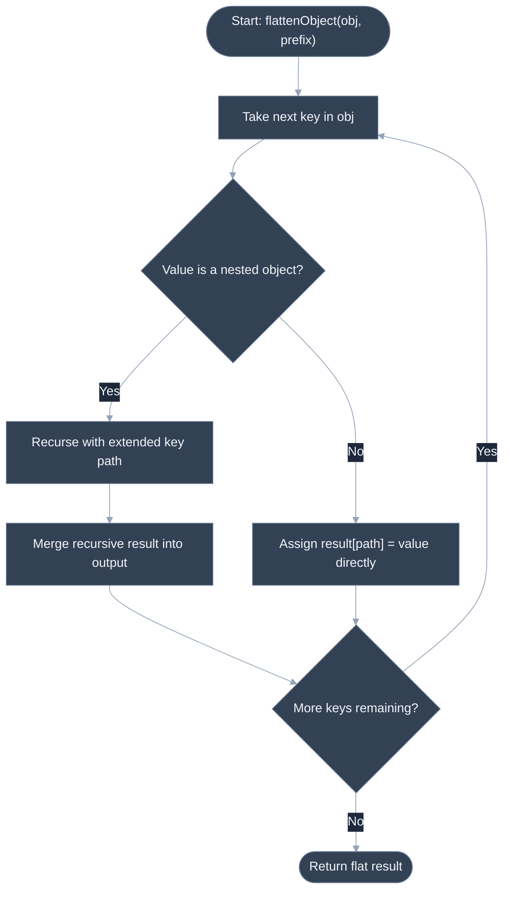
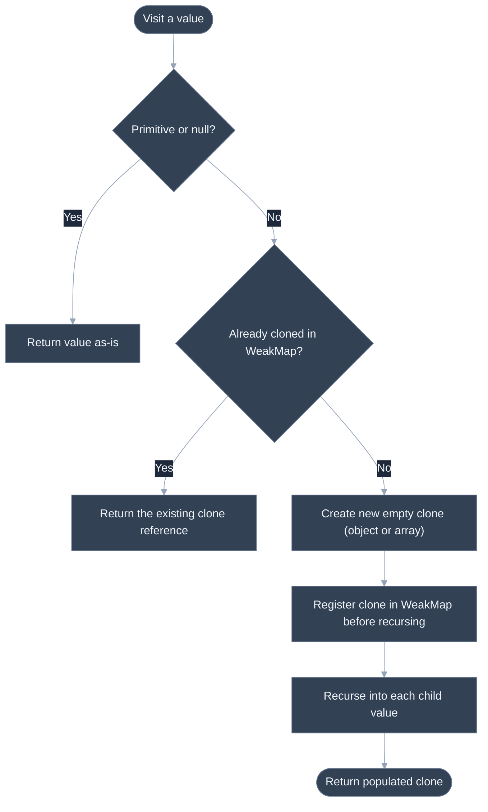

# Implement Flatten Nested Object, Deep Clone

## 🎯 Executive Summary

This category tests whether a candidate can write correct recursive code over an arbitrarily-shaped object graph — not "can you write recursion" in the abstract, but "can you write recursion that doesn't fall over the moment the input isn't a clean, shallow, acyclic object." Flattening, cloning, and comparing nested objects are three variations on the same underlying skill: correctly walking a tree of unknown depth and shape while handling the specific things that make real-world objects messier than the textbook example — arrays mixed with objects, `Date` instances, and the possibility of a value that circularly references itself.

It's must-know at Lead level because these primitives show up constantly in real frontend code — flattening for form-state libraries and analytics payloads, deep cloning for Redux-style immutable updates and undo/redo history, deep equality for memoization and `shouldComponentUpdate`-style checks — and because the naive one-liner "solution" almost everyone reaches for first (`JSON.parse(JSON.stringify(x))` for cloning, `===` for equality) is well-known to be subtly wrong in ways that only surface in production edge cases. Interviewers use this category specifically to see whether a candidate reaches for the naive shortcut and stops there, or names its failure modes unprompted.

It typically surfaces as a 20-30 minute live coding question, often starting with "write a function that does X" and then escalating with a follow-up like "what if the object references itself?" or "what if there's a `Date` in there?" — the escalation is where the Lead-vs-Senior gap actually shows up, since the initial happy-path implementation is often nearly identical between the two levels.

---

## 📖 What Is It? (Plain-English Definition)

**In plain terms:** these are three different operations for working with objects that have other objects nested inside them — flattening turns a nested structure into a single flat layer with descriptive keys, cloning makes a truly independent copy (not just a copy of the outer shell), and deep equality checks whether two separately-built objects represent "the same data," value by value, all the way down.

Flattening an object means taking something like `{a: {b: 1}}` and turning it into `{'a.b': 1}` — collapsing every level of nesting into one level, where the key itself records the path you'd have had to walk to find that value. It's the same idea as a file system: a deeply nested folder structure can always be described as a flat list of full paths, like `/a/b/c.txt`, without losing any information about where things were.

Deep cloning means making a copy of an object where changing the copy can never, ever affect the original — including for anything nested inside it. A shallow copy (like `{...obj}` or `Object.assign({}, obj)`) only copies the outer layer; any nested object inside is still the *same* nested object shared between the original and the "copy," so mutating it through the copy silently corrupts the original too. A deep clone recursively copies every layer down to the primitives, so the two structures are completely independent from top to bottom.

Deep equality means comparing two values not by reference (are they literally the same object in memory — what `===` checks) but by content (do they represent the same data). Two different array literals `[1, 2]` and `[1, 2]` are never `===` equal, because they're two different objects in memory, but they should be considered deeply equal because their contents match.

---

## 🧠 Core Technical Deep Dive

### Pattern Recognition — How to Spot This Category of Problem

- **The recursion tell:** the problem statement mentions the input "can be nested," "arbitrarily deep," or gives an example with more than one level of `{...}` inside `{...}`. Any operation over such a structure — flatten, clone, compare, search, transform — needs a recursive (or explicit-stack-based iterative) walk, because you cannot know the depth ahead of time and a fixed number of nested loops won't generalize.
- **The circular-reference tell:** this is the subtler, more Lead-specific one. It's rarely stated explicitly in the prompt — a Lead should proactively raise it themselves the moment a problem involves deep-copying or fully traversing an *object graph* (as opposed to a guaranteed tree, like JSON parsed fresh from an API response). Any time objects are built up programmatically and could plausibly hold references to other live objects (DOM nodes, class instances, anything constructed by application code rather than freshly deserialized), asking "can this contain a cycle?" up front is exactly the kind of clarifying question that separates a Lead answer from a Senior one — because a naive recursive implementation that doesn't check for cycles doesn't just produce a wrong answer on circular input, it infinite-loops and crashes the tab.

### Flatten: The Path-Accumulation Pattern

The recursive call carries an accumulated key path as it descends, and only writes into the result object once it reaches a primitive (or an empty object/array) leaf:

```javascript
function flattenObject(obj, prefix = '') {
  const result = {};

  for (const key of Object.keys(obj)) {
    const value = obj[key];
    const path = prefix ? `${prefix}.${key}` : key;

    const isPlainObject =
      value !== null && typeof value === 'object' &&
      !Array.isArray(value) && !(value instanceof Date);

    if (isPlainObject && Object.keys(value).length > 0) {
      Object.assign(result, flattenObject(value, path));
    } else if (Array.isArray(value)) {
      value.forEach((item, index) => {
        const itemPath = `${path}.${index}`;
        if (item !== null && typeof item === 'object' && !Array.isArray(item)) {
          Object.assign(result, flattenObject(item, itemPath));
        } else {
          result[itemPath] = item;
        }
      });
    } else {
      result[path] = value;
    }
  }

  return result;
}
```

The array-handling convention here — treating numeric indices as path segments, exactly like object keys — is a design decision, not the only valid one; some implementations instead leave arrays intact as leaf values. Either is defensible, but a Lead states which one they're implementing.

### Deep Clone: WeakMap as a "Seen" Registry

The naive quick answer — `JSON.parse(JSON.stringify(obj))` — is worth naming explicitly as wrong, not just avoiding: it throws on circular references (`TypeError: Converting circular structure to JSON`), silently drops `function` values and `undefined` properties, and turns `Date` objects into plain ISO strings, permanently losing the fact that they were ever `Date` instances.

A correct deep clone tracks every object it has already started cloning in a `WeakMap`, keyed by the *original* object, mapping to the clone created for it — and critically, registers that mapping **before** recursing into the object's children:

```javascript
function deepClone(value, seen = new WeakMap()) {
  if (value === null || typeof value !== 'object') {
    return value;
  }

  if (value instanceof Date) {
    return new Date(value.getTime());
  }

  if (seen.has(value)) {
    return seen.get(value);
  }

  const clone = Array.isArray(value) ? [] : {};
  seen.set(value, clone);

  for (const key of Object.keys(value)) {
    clone[key] = deepClone(value[key], seen);
  }

  return clone;
}
```

`WeakMap` (rather than `Map`) is the correct choice specifically because its keys don't prevent garbage collection — once the original object and its clone are no longer referenced anywhere else, the `WeakMap` entry doesn't keep either alive.

### Deep Equal: Structural Comparison, Not Reference Comparison

Deep equality recurses in parallel over both values, and needs two special cases beyond plain recursive key-by-key comparison: treating `NaN` as equal to itself (unlike `===`, where `NaN !== NaN`), and remaining type-sensitive so an array is never considered equal to a plain object even if their enumerable numeric keys line up:

```javascript
function deepEqual(a, b) {
  if (a === b) return true;
  if (Number.isNaN(a) && Number.isNaN(b)) return true;

  if (typeof a !== 'object' || a === null || typeof b !== 'object' || b === null) {
    return false;
  }

  if (Array.isArray(a) !== Array.isArray(b)) return false;

  const keysA = Object.keys(a);
  const keysB = Object.keys(b);
  if (keysA.length !== keysB.length) return false;

  return keysA.every((key) =>
    Object.prototype.hasOwnProperty.call(b, key) && deepEqual(a[key], b[key])
  );
}
```

Comparing `Object.keys(a).length` to `Object.keys(b).length` before recursing is an important short-circuit: without it, an object with an extra key that happens to come after all matching keys could be missed by a naive "every key in `a` matches in `b`" check that never verifies `b` doesn't have additional keys of its own.

---

## 📊 Visual Architecture & Logic

### Diagram 1: Recursive Flatten Mechanism



### Diagram 2: Deep Clone with Circular Reference Handling



---

## 🏢 Interview Context & FAANG Signals

| Interview Stage | Format |
|---|---|
| **Phone Screen** | "Write a function to flatten a nested object" as a cold 20-25 minute warm-up |
| **Technical Round** | Implement deep clone, then a live follow-up: "what if it's circular?" |
| **Take-Home** | A small utility library (flatten/clone/equal) with unit tests, reviewed live |

**Lead signals interviewers listen for:**

1. **Proactively raising circular references** — before being asked, for any problem involving copying or traversing an object graph, not just when the prompt explicitly mentions it.
2. **Naming the `JSON.parse(JSON.stringify(x))` shortcut and its failure modes** — circular references throwing, functions/`undefined` being dropped, `Date` objects degrading to strings — rather than reaching for it as if it were a complete solution.
3. **Stating array-handling conventions explicitly** — for flatten in particular, since there's no single universally "correct" convention for how arrays should be represented in a flattened path.
4. **Distinguishing reference equality from structural equality** — explaining *why* `===` is wrong for comparing two structurally-identical-but-separately-created objects, unprompted.
5. **Complexity discussion** — stating that all three operations are O(n) in the total number of properties/elements, without being asked, and noting the O(d) recursion-depth cost for very deeply nested structures.

---

## ⚔️ Lead Level vs Senior Level

**Question:** "Write a function to deep clone an object."

> **Senior Response:**
> ```javascript
> function deepClone(obj) {
>   if (obj === null || typeof obj !== 'object') return obj;
>   const clone = Array.isArray(obj) ? [] : {};
>   for (const key in obj) {
>     clone[key] = deepClone(obj[key]);
>   }
>   return clone;
> }
> ```
> This recursively copies objects and arrays, handling nested structures correctly.

Correct for a clean, acyclic tree with only plain values — but it infinite-loops and crashes on a circular reference, and silently produces a plain `{}` for a `Date` (since `for...in` walks a `Date`'s own enumerable properties, which is typically none, losing the timestamp entirely).

> **Staff/Lead Response:**
> "Before writing this, a couple of things I want to confirm: can this object ever be circular — does it hold references to other live application objects, or is it guaranteed to be freshly-deserialized data? And do we need to preserve special types like `Date`, or just plain objects/arrays/primitives? I'll assume yes to both, since that's the more general and more commonly-needed version. I'll use a `WeakMap` to track objects I've already started cloning, registering each clone *before* recursing into its children — that ordering is what makes circular references resolve correctly instead of infinite-looping. I'll also special-case `Date` explicitly, since naive property-walking loses it."

The difference: the Lead treats "what kinds of input does this actually need to handle" as a question to ask and design around, rather than assuming the cleanest possible input and only patching in circular-reference handling when explicitly prompted.

---

## ⚠️ Common Pitfalls & Anti-Patterns

> ### ✕ Using `JSON.parse(JSON.stringify(x))` as "Deep Clone"
> **Why it's wrong:** It throws on circular references, silently drops `function` values and `undefined` properties, converts `Date` instances into plain strings, and mishandles `Map`/`Set`/`RegExp` entirely. It happens to work for plain JSON-shaped data, which is exactly why it survives in codebases until it hits real application objects.
> **✓ Correct Lead Approach:** Write (or use a library implementing) a proper recursive deep clone with a `WeakMap`-based seen-registry for cycles and explicit type-checks for `Date` and other non-plain-object types that need special handling.

---

> ### ✕ Registering a Clone in the Seen-Map *After* Recursing Into Its Children
> **Why it's wrong:** If a circular reference is encountered before the parent has registered itself in the `WeakMap`, the recursive call re-enters cloning the same object from scratch — infinite recursion, stack overflow.
> **✓ Correct Lead Approach:** Create the empty clone shell and register it in the `WeakMap` *immediately*, before iterating over and recursing into its properties — so a child that circularly points back to the parent finds the (still-being-populated) clone already registered.

---

> ### ✕ Comparing Objects with `===` and Calling It "Equality"
> **Why it's wrong:** `===` on objects checks reference identity, not content — `{a: 1} === {a: 1}` is always `false`, even though the two objects hold identical data. Using this as a memoization or `shouldComponentUpdate` check either always reports "changed" (breaking memoization entirely) or requires callers to manually guarantee referential stability everywhere, which is fragile.
> **✓ Correct Lead Approach:** Use a proper deep-equality check when comparing structurally, and reserve `===` for cases where referential stability is genuinely guaranteed by design (e.g., immutable state updates that only create new references when data actually changes).

---

> ### ✕ Ignoring `NaN` in Deep Equality
> **Why it's wrong:** `NaN === NaN` is `false` by IEEE 754 definition, so a deep-equal implementation built purely on `===` comparisons will report two otherwise-identical objects containing `NaN` in the same position as unequal — a surprising, hard-to-debug false negative.
> **✓ Correct Lead Approach:** Special-case `Number.isNaN(a) && Number.isNaN(b)` as equal before falling through to `===`, matching the intuitive (and `Object.is`-aligned) notion of equality rather than the IEEE 754 comparison semantics.

---

> ### ✕ Treating Dot-Path Flattening as Fully Reversible
> **Why it's wrong:** If any original key itself contains a literal `.` character, the flattened key becomes indistinguishable from a genuinely nested path — `{'a.b': 1}` and `{a: {b: 1}}` both flatten to the exact same output, `{'a.b': 1}`, making the operation lossy and non-reversible for that input shape.
> **✓ Correct Lead Approach:** Call this out explicitly as a known limitation when discussing the design, rather than presenting the flattened output as if it always round-trips — and if reversibility matters, use an escaping scheme or an array-of-segments representation instead of string-concatenated dot paths.

---

## 🛠️ Practice Problems

### Problem 1: Flatten a Nested Object

**Problem:**
```javascript
/**
 * Recursively flattens a nested object into a single-level object whose
 * keys are dot-separated paths to each leaf value.
 * @param {object} obj
 * @param {string} [prefix='']
 * @returns {object}
 */
function flattenObject(obj, prefix = '') {
  // your implementation
}
```

Nested plain objects become dot-separated key paths; the function should not mutate the input.

**Examples:**
```
Input: { a: { b: 1, c: { d: 2 } } }
Output: { 'a.b': 1, 'a.c.d': 2 }
```
```
Input: { user: { name: 'Ana', tags: ['admin', 'beta'] } }
Output: { 'user.name': 'Ana', 'user.tags.0': 'admin', 'user.tags.1': 'beta' }
Explanation: array elements are flattened using their numeric index as a path segment, following the same dot-path convention used for object keys.
```

**Edge cases to handle:**
- An empty object (`{}`) input should return `{}`.
- A nested array value — decide and apply a stated convention (e.g., numeric indices become path segments, as shown above).
- A key that itself contains a literal `.` character (e.g. `{'a.b': 1}`) is a known ambiguity — flattening it produces output indistinguishable from a genuinely nested `{a: {b: 1}}`; worth explicitly flagging to the interviewer as a limitation rather than silently producing an unreversible result.

<details>
<summary>💡 Hint 1</summary>

You need to track, as you descend into the object, the "path so far" that led you to the current value — think about what extra piece of information a recursive call needs beyond just the current sub-object.

</details>

<details>
<summary>💡 Hint 2</summary>

Pass an accumulated `prefix` string as a second argument to each recursive call. For each key, build the full path as `prefix ? prefix + '.' + key : key`. Only write into the result object once you reach a value that isn't itself a nested plain object.

</details>

<details>
<summary>💡 Hint 3</summary>

For each key/value pair: build the `path` using the accumulated prefix. If the value is a plain, non-empty object, recursively call `flattenObject(value, path)` and merge the returned object into your result with `Object.assign`. If the value is an array, iterate it with the index appended to the path, recursing into any object elements the same way. Otherwise, assign `result[path] = value` directly.

</details>

<details>
<summary>✅ Reveal Solution</summary>

```javascript
function flattenObject(obj, prefix = '') {
  const result = {};

  for (const key of Object.keys(obj)) {
    const value = obj[key];
    const path = prefix ? `${prefix}.${key}` : key;

    const isPlainObject =
      value !== null && typeof value === 'object' &&
      !Array.isArray(value) && !(value instanceof Date);

    if (isPlainObject && Object.keys(value).length > 0) {
      Object.assign(result, flattenObject(value, path));
    } else if (Array.isArray(value)) {
      value.forEach((item, index) => {
        const itemPath = `${path}.${index}`;
        if (item !== null && typeof item === 'object' && !Array.isArray(item)) {
          Object.assign(result, flattenObject(item, itemPath));
        } else {
          result[itemPath] = item;
        }
      });
    } else {
      result[path] = value;
    }
  }

  return result;
}
```

**Why it works:** The accumulated `prefix` parameter, as the hints built up to, is what lets each recursive call know the full path leading to it without any global or shared mutable state. Branching on whether a value is a non-empty plain object, an array, or a leaf value is what determines whether to recurse-and-merge or assign directly — an empty object correctly falls through to being treated as a leaf (since `Object.keys(value).length > 0` is false), matching the "empty object returns `{}`" edge case at the top level and avoiding writing an orphan key for an empty nested object.

**Time complexity:** O(n) where n is the total number of primitive leaf values (plus intermediate object/array nodes visited) in the input — each is visited exactly once.
**Space complexity:** O(n) for the flattened output object, plus O(d) additional stack space for the recursion, where d is the maximum nesting depth.

</details>

---

### Problem 2: Deep Clone an Object

**Problem:**
```javascript
/**
 * Recursively deep-clones a value, correctly handling nested objects and
 * arrays, Date instances, and circular references (a value that directly
 * or indirectly references itself).
 * @param {*} value
 * @returns {*}
 */
function deepClone(value) {
  // your implementation
}
```

The clone must be fully independent of the original — mutating any nested part of the clone must never affect the original, and vice versa.

**Examples:**
```
Input:
const original = {
  name: 'config',
  nested: { count: 1, list: [1, 2, 3] },
  created: new Date('2024-01-01T00:00:00Z')
};
const clone = deepClone(original);
clone.nested.count = 99;

Output:
original.nested.count === 1        // unaffected by mutating the clone
clone.created instanceof Date      // true — Date is preserved, not stringified
clone.created.getTime() === original.created.getTime()   // true
clone !== original && clone.nested !== original.nested   // true — fully independent references
```
```
Input:
const node = { name: 'root' };
node.self = node;   // circular reference
const clone = deepClone(node);

Output:
clone.self === clone   // true — points to the CLONE's own self-reference, not the original
clone !== node          // true
```

**Edge cases to handle:**
- A circular reference (an object that references itself, directly or through another object) must not cause infinite recursion or a stack overflow.
- A `Date` instance must be cloned into a new, independent `Date` with the same timestamp — not turned into a plain object or a string.
- `null`, `undefined`, and primitive values (numbers, strings, booleans) passed directly should be returned as-is, without error.

<details>
<summary>💡 Hint 1</summary>

Think about what has to be true for a recursive clone to ever revisit the same object twice without looping forever — the function needs some way to remember "I've already started cloning this exact object."

</details>

<details>
<summary>💡 Hint 2</summary>

Use a `WeakMap` to map each original object to the clone already created for it. Before recursing into an object's children, check the `WeakMap` first — if it's already there, return the existing clone instead of creating a new one.

</details>

<details>
<summary>💡 Hint 3</summary>

Thread the `WeakMap` through recursive calls as a second parameter (defaulting to `new WeakMap()` on the outermost call). For each value: if it's a primitive or `null`, return it directly. If it's a `Date`, return `new Date(value.getTime())`. Otherwise, check the `WeakMap` for an existing clone and return it if found. If not found, create an empty object or array, **register it in the `WeakMap` immediately** (before recursing into any properties), then loop over the original's keys assigning `deepClone(value[key], seenMap)` into the new clone.

</details>

<details>
<summary>✅ Reveal Solution</summary>

```javascript
function deepClone(value, seen = new WeakMap()) {
  if (value === null || typeof value !== 'object') {
    return value;
  }

  if (value instanceof Date) {
    return new Date(value.getTime());
  }

  if (seen.has(value)) {
    return seen.get(value);
  }

  const clone = Array.isArray(value) ? [] : {};
  seen.set(value, clone);

  for (const key of Object.keys(value)) {
    clone[key] = deepClone(value[key], seen);
  }

  return clone;
}
```

**Why it works:** Registering `clone` in `seen` immediately after creating it — and crucially before the loop that recurses into its properties — is exactly the ordering the third hint called for: when the recursive call reaches the circular property (`node.self`, pointing back to `node`), `seen.has(node)` is already `true`, so it returns the in-progress `clone` object instead of recursing infinitely. The `Date` special-case runs before the generic object-cloning path, so timestamps survive instead of being walked property-by-property (which would produce `{}`, since a `Date`'s time value isn't stored as an enumerable own property).

**Time complexity:** O(n) where n is the total number of properties/elements across the entire object graph — each distinct object is cloned exactly once, thanks to the `WeakMap` check.
**Space complexity:** O(n) for the cloned structure itself, plus O(n) for the `WeakMap` entries (one per distinct object encountered) and O(d) recursion-stack space for the deepest chain of nesting.

</details>

---

### Problem 3: Deep Equal

**Problem:**
```javascript
/**
 * Recursively compares two values for deep structural equality.
 * NaN is considered equal to NaN. Comparison is type-sensitive: values of
 * different types (e.g. an array vs. a plain object) are never equal.
 * @param {*} a
 * @param {*} b
 * @returns {boolean}
 */
function deepEqual(a, b) {
  // your implementation
}
```

Two values are deeply equal if they have the same structure and the same values at every position, regardless of whether they're the same object in memory.

**Examples:**
```
Input: deepEqual({ a: [1, 2] }, { a: [1, 2] })
Output: true
Explanation: different object/array instances in memory, but identical structure and values throughout.
```
```
Input: deepEqual({ a: 1 }, { a: '1' })
Output: false
Explanation: type-sensitive comparison — the number 1 and the string '1' are not deeply equal even though they'd be == equal.
```

**Edge cases to handle:**
- `deepEqual(NaN, NaN)` should be `true`, even though `NaN === NaN` is `false`.
- Two objects with the same keys and values but in a different insertion order (e.g. `{a: 1, b: 2}` vs `{b: 2, a: 1}`) should still be considered equal.
- Comparing an array to a plain object with matching numeric keys (e.g. `[1, 2]` vs `{0: 1, 1: 2}`) should return `false` — they are structurally different types, not equal.

<details>
<summary>💡 Hint 1</summary>

Start with the cases that terminate the recursion immediately — some pairs of values can be judged equal or unequal without looking at anything nested inside them at all.

</details>

<details>
<summary>💡 Hint 2</summary>

Handle `===` equality (covers primitives and identical references) and the `NaN` special case up front. Then, for anything that isn't a non-null object on both sides, they can't be equal — return `false`. For two objects, check `Array.isArray` matches on both before comparing keys, since an array and a plain object should never be considered equal even with matching contents.

</details>

<details>
<summary>💡 Hint 3</summary>

After the early-exit checks: get `Object.keys` for both values and compare their lengths first (a cheap way to reject "extra key present in only one side" without extra bookkeeping). Then, for every key in `a`, confirm `b` actually has that key as its own property (not inherited) and that `deepEqual(a[key], b[key])` is `true` — using `Array.prototype.every` lets the whole check short-circuit the moment one key fails.

</details>

<details>
<summary>✅ Reveal Solution</summary>

```javascript
function deepEqual(a, b) {
  if (a === b) return true;
  if (Number.isNaN(a) && Number.isNaN(b)) return true;

  if (typeof a !== 'object' || a === null || typeof b !== 'object' || b === null) {
    return false;
  }

  if (Array.isArray(a) !== Array.isArray(b)) return false;

  const keysA = Object.keys(a);
  const keysB = Object.keys(b);
  if (keysA.length !== keysB.length) return false;

  return keysA.every((key) =>
    Object.prototype.hasOwnProperty.call(b, key) && deepEqual(a[key], b[key])
  );
}
```

**Why it works:** The `Number.isNaN` check runs right after the `===` check, exactly per the first hint's "terminate immediately" cases, and correctly reclassifies the one case where `===` gives the "wrong" (non-intuitive) answer. Comparing `Array.isArray(a) !== Array.isArray(b)` before ever touching keys is what makes an array vs. object-with-numeric-keys comparison correctly return `false`, per the second hint. Comparing key-count before the `every` check is what catches "b has an extra key a doesn't" — without it, `every` over `a`'s keys alone would never notice a key that exists only in `b`. Because key comparison uses `hasOwnProperty` rather than array order, insertion order never affects the result.

**Time complexity:** O(n) where n is the total number of properties compared across both structures in the worst case (fully equal, deeply nested inputs) — each shared key is visited once; a mismatch anywhere short-circuits early.
**Space complexity:** O(d) for the recursion stack, where d is the maximum nesting depth — no additional data structures are built beyond the small, per-call `Object.keys` arrays.

</details>

---
