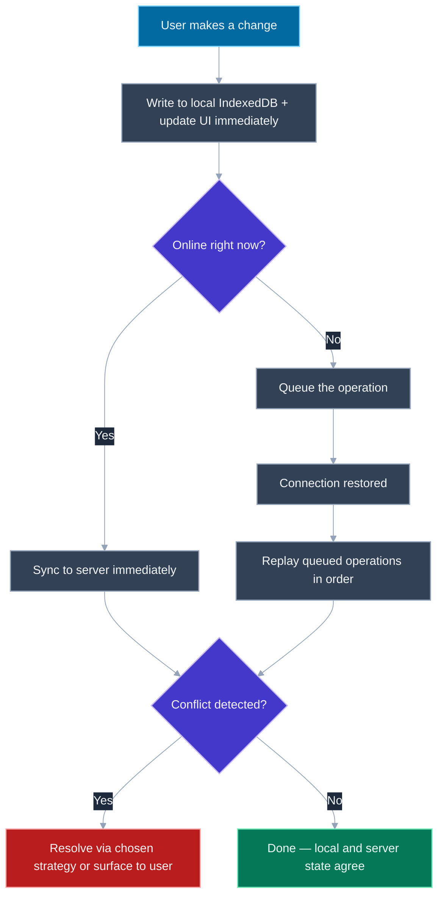
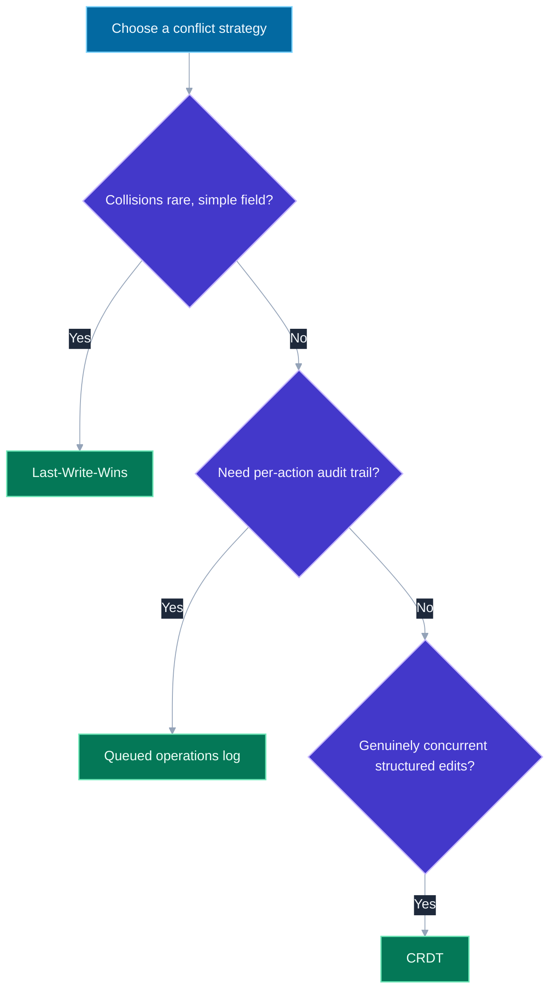

# Offline-First Architecture and Sync Strategies

## 🎯 Executive Summary

Most apps are built "online-first": every action assumes a network round-trip, and offline is an error state — a red banner, a disabled button, a failed request the user has to notice and retry themselves. Offline-first inverts that assumption entirely: the app is designed to work fully against local data by default, treating a live connection as an enhancement that syncs local state with the server when it's available, not a prerequisite for the app doing anything at all. That inversion sounds like a UI decision, but it's really a data-consistency problem — the moment you let a user *write* data while offline, you've created two potentially divergent copies of the truth that have to be reconciled later, and reconciliation is where this topic actually lives.

This is a must-know at Lead/Staff level because it's one of the few frontend topics that's fundamentally a distributed-systems problem wearing a frontend costume: once writes can happen locally and independently of the server, you inherit the same conflict-resolution and ordering questions that show up in distributed databases, just scoped to a single user's device versus their own backend. A Lead is expected to reason about which conflict strategy fits which kind of data, not reach for one default and apply it everywhere.

This surfaces as "design an offline-capable note-taking/task app," a follow-up to a service-worker or caching discussion ("okay, but what happens when they try to *edit* something offline"), or a debugging scenario about a sync bug that only reproduces on the reconnect path. Interviewers use it to check whether a candidate treats "offline support" as a checkbox (cache some data, show a banner) or as the harder problem it actually is once writes are involved.

## 📖 What Is It? (Plain-English Definition)

**In plain terms:** offline-first means an app is built to keep working — reading and even writing data — with no network connection at all, syncing up with the server automatically once one becomes available, rather than treating no-connection as a broken state the app has to apologize for.

Think of it like a field notebook versus calling in a report by phone: a phone-only reporting process breaks the moment you lose signal, because the report doesn't exist anywhere until it's been called in. A notebook works regardless of signal — you write the observation down the moment it happens, and you call it in whenever you next get reception, updating whoever's on the other end with everything you've recorded since you last checked in. The notebook is the local, offline-first source of truth; the phone call is the sync step, and it's designed to be resilient to happening late, out of order relative to other reporters, or not at all for a while.

The subtlety worth sitting with is what happens when *two* field reporters both write down conflicting observations about the same thing while both are out of signal range — whoever calls in first doesn't automatically have the "right" answer, and deciding how to reconcile that is the actual hard problem this topic is about, not the notebook-keeping itself.

The foundational browser mechanisms — how data gets cached and read offline, and how the browser defers work until connectivity returns — are covered elsewhere in this repo; this topic picks up specifically where those leave off: what happens to a *write* made while offline, and how it gets reconciled with the server once the app is back online.

---

## 🧠 Core Technical Deep Dive

### Foundational pieces (link out, don't re-derive)

Offline-first architecture is built on top of a few browser primitives that are covered in depth elsewhere in this repo — this topic assumes familiarity with them and focuses on what sits on top:

- **Service Worker + Cache API**, for intercepting network requests and serving cached responses/assets when offline — see [Service Workers and PWA Fundamentals](/topic-detail.html?id=service-workers-pwa).
- **Background Sync**, for deferring a task until connectivity returns even if the tab is closed — also covered in [Service Workers and PWA Fundamentals](/topic-detail.html?id=service-workers-pwa).
- **IndexedDB**, for structured, queryable local storage capable of holding real application data (as opposed to `localStorage`'s string-only, synchronous, size-limited model) — see the storage comparison in [CORS, Storage, and Cookies](/topic-detail.html?id=cors-storage-cookies).

None of those three solve the problem this topic is actually about: once a user is allowed to *change* data while offline, what happens to that change, and how does it get reconciled with a server that may have a different, also-valid view of the same data by the time connectivity returns?

> **Key takeaway:** treat Service Worker/Cache API, Background Sync, and IndexedDB as prerequisites to name and link to, not re-explain — this topic's real content starts at "now the user has made an offline write, what happens next."

### Local-first writes: optimistic UI against local storage

The core pattern: when a user makes a change, the UI updates **immediately** against a local IndexedDB copy of the data, and the corresponding mutation is placed into a durable queue for later sync — the user never waits on a network round-trip to see their own change reflected, whether they're online or not.

```javascript
async function updateTaskTitle(taskId, newTitle) {
  // 1. Write to local IndexedDB immediately — this is the source of truth
  //    the UI reads from, online or offline.
  await localDb.tasks.update(taskId, { title: newTitle, updatedAt: Date.now() });

  // 2. Update the UI from that same local write — no network wait.
  renderTask(await localDb.tasks.get(taskId));

  // 3. Queue the mutation for sync, regardless of current connectivity.
  await syncQueue.enqueue({
    type: 'UPDATE_TASK_TITLE',
    taskId,
    newTitle,
    clientTimestamp: Date.now(),
  });

  // 4. Kick the sync process — it decides for itself whether to send now
  //    or wait for connectivity.
  trySync();
}
```

This is the same "optimistic update" pattern used in plenty of online-only apps, but offline-first makes it load-bearing rather than a nice-to-have: since there's no server round-trip to eventually fall back to on failure in a reasonable timeframe, the local write *is* the UI's only source of truth until sync happens, and that's true whether sync happens in 50 milliseconds or three hours.

> **Key takeaway:** the write path is always local-first — IndexedDB write plus UI update happen unconditionally and immediately, with network sync treated as a separate, decoupled step that happens whenever connectivity allows.

### Conflict resolution: three strategies, three different shapes of data

Once writes can happen independently on a client while offline and on a server (or from another client) at the same time, reconciling them requires a deliberate strategy — there is no one-size-fits-all default, and naming the trade-off between strategies is exactly what a Lead-level answer is expected to do.

**1. Last-Write-Wins (LWW).** Every write carries a timestamp; when two conflicting writes to the same field are reconciled, whichever has the later timestamp simply overwrites the other. This is the simplest strategy to implement and reason about, and it's a fine fit for low-collision data — a single user's own settings, a document field unlikely to be edited by two sources at once. Its failure mode is exactly what it sounds like: a genuinely earlier-but-more-correct write can be silently discarded if its timestamp loses, with no record that a conflict even happened.

```javascript
function resolveLWW(localWrite, serverWrite) {
  return localWrite.clientTimestamp > serverWrite.serverTimestamp
    ? localWrite
    : serverWrite; // the "loser" is discarded entirely, silently
}
```

**2. A queued-operations log.** Rather than storing only the latest *value*, store every offline action as a discrete, ordered operation (`{ type: 'INCREMENT_COUNT', by: 1 }`, not `{ count: 42 }`), and replay that log against the server in order once back online, letting the server validate or reject each operation individually. This preserves *intent* rather than just a final state, which matters when operations are things like "add item to cart" or "increment a shared counter" — operations that are meaningful individually and where collapsing them down to a single last-value would lose information a plain LWW field-overwrite would silently destroy.

```javascript
async function replayQueue(queue) {
  for (const operation of queue.getOrderedOperations()) {
    const result = await api.applyOperation(operation); // server validates each one
    if (result.status === 'rejected') {
      handleRejectedOperation(operation, result.reason); // surface to the user, don't discard silently
    }
    queue.markProcessed(operation.id);
  }
}
```

**3. CRDTs (Conflict-free Replicated Data Types)** for genuinely concurrent, structured, merge-friendly edits — data structures specifically designed so that two divergent copies can always be merged back into a single consistent result without a central authority deciding a winner, which is the right tool when the conflicts aren't just "two values disagree" but "two people concurrently edited overlapping parts of the same rich structure" (collaborative text, for instance). This mechanism is covered in depth in [Design a Collaborative Editor](/topic-detail.html?id=design-collaborative-editor) — link there rather than re-deriving CRDT internals here; the point for this topic is knowing *when* CRDTs are the right answer relative to LWW and a queued-operations log, not re-explaining how they work.

> **Key takeaway:** pick LWW for simple, low-collision fields; a queued-operations log when preserving intent and letting the server validate individually matters; CRDTs when edits are genuinely concurrent and structural — and be able to say which is appropriate for a given kind of data, not just name all three.

### Detecting online/offline reliably

The obvious approach — `navigator.onLine` and the `online`/`offline` window events — is unreliable in practice: `navigator.onLine` reports whether the device has *a* network connection, not whether that connection can actually reach your backend. A device connected to a WiFi network sitting behind a captive portal (an airport, a hotel, a coffee shop login page) reports `navigator.onLine === true` while every real request to your API fails outright.

```javascript
// Unreliable on its own — only tells you the device has *some* interface up
window.addEventListener('online', () => console.log('Browser thinks we\'re online'));
```

The robust approach treats an actual network operation's success or failure as the real signal, not the browser's self-reported state: a periodic, lightweight ping to your own backend (a small `HEAD` or tiny JSON endpoint, not a heavy payload), or simply the success/failure of whatever request the app was already about to make.

```javascript
async function isActuallyOnline() {
  try {
    const response = await fetch('/api/ping', { method: 'HEAD', cache: 'no-store' });
    return response.ok;
  } catch {
    return false; // a real failed fetch is the trustworthy signal
  }
}

// Poll periodically, and treat any real API call's own failure as
// an additional, immediate signal rather than waiting for the next poll.
setInterval(async () => {
  const online = await isActuallyOnline();
  updateConnectivityState(online);
  if (online) trySync();
}, 15000);
```

> **Key takeaway:** `navigator.onLine`/`online`/`offline` events report interface state, not reachability — treat a real, periodic ping to your own backend (or the outcome of an actual request) as the trustworthy signal, since a captive portal or DNS failure can leave a device "online" with zero real connectivity.

### UX patterns for offline and syncing state

A few UI conventions consistently separate a well-built offline-first app from a technically-correct-but-confusing one:

- **A persistent-but-unobtrusive offline indicator** — a small, always-visible badge or bar, not a blocking modal that interrupts the user every time connectivity drops. The app is supposed to keep working offline; a modal that stops the user in their tracks undercuts the entire premise of the feature.
- **Visually distinguishing unsynced items** — a small "syncing…" badge or subtle styling on rows/items that exist locally but haven't yet been confirmed by the server, so the user has an honest signal about what's provisional versus confirmed, without it being alarming.
- **Surfacing real conflicts explicitly when automatic resolution isn't safe** — if a queued operation is rejected by the server, or a conflict can't be resolved by the chosen strategy without risking real data loss, show the user both versions and let them choose, rather than silently picking one (which is exactly the failure mode LWW risks if applied to data where it isn't actually safe).

> **Key takeaway:** the UX goal is an honest but calm signal about connectivity and sync state — visible enough that the user isn't confused about what's provisional, unobtrusive enough that it doesn't undermine the "this just works offline" premise.

### Testing offline behavior — especially the reconnect path

Chrome DevTools' Network tab has an "Offline" throttling preset that simulates a fully disconnected network without physically disabling WiFi, making it easy to exercise the offline write path repeatedly during development.

The detail worth calling out explicitly: **the reconnection transition is the least-exercised, most bug-prone path**, precisely because it's easy to test "does it work offline" and easy to test "does it work online," but testing "what happens in the moments right as connectivity comes back, with a non-trivial queue of pending operations" requires deliberately simulating that transition — going offline, making several changes, then flipping back online and watching the replay happen, including forcing a rejected operation to verify it's surfaced rather than silently dropped. Real offline-sync bugs disproportionately live in this transition rather than in either steady state.

> **Key takeaway:** don't just verify offline mode works and online mode works — deliberately test the reconnect moment itself, with a non-empty operation queue and at least one operation designed to be rejected by the server, since that transition is where real bugs concentrate.

---

## 📊 Visual Architecture & Logic

### Diagram 1 — Optimistic local write and background sync flow



### Diagram 2 — Choosing a conflict-resolution strategy



## 🏢 Interview Context & FAANG Signals

| Interview Stage | Format |
|---|---|
| Frontend System Design round | "Design an offline-capable note-taking/task/field-work app" — sync strategy is the deep-dive interviewers steer toward |
| Follow-up to a caching/PWA question | "Okay, but what happens when they *edit* something while offline?" once basic offline reading is established |
| Debugging round | A sync bug report that only reproduces on reconnect, with a non-trivial pending-operation queue |

**Lead signals interviewers listen for:**

1. Framing offline-first as inverting the default assumption (works with no network by default), not just "add a service worker and cache some data."
2. Naming the right conflict-resolution strategy for a given kind of data — LWW for simple low-collision fields, a queued-operations log for preserving intent, CRDTs for genuinely concurrent structural edits — rather than defaulting to one strategy everywhere.
3. Knowing `navigator.onLine` is unreliable and proposing an actual reachability check (a real ping/request outcome) instead.
4. Treating the reconnect transition as the highest-risk path to test, not an afterthought once offline mode itself works.
5. Proposing honest, calm UX for provisional/unsynced state rather than either hiding sync status entirely or interrupting the user with blocking offline modals.

## ⚔️ Lead Level vs Senior Level

**Question: "A user edits the same task's title on their phone while offline, and on their laptop while online, before their phone reconnects. What happens?"**

> **Senior Response:** "When the phone comes back online, it'll sync its change up to the server. Whichever one has the later timestamp wins, and that becomes the final title."

> **Staff/Lead Response:** "That's Last-Write-Wins, and it's a reasonable default for a simple field like a title — but I'd want to know the timestamp basis before committing to it: if it's the client's local clock, clock skew between the two devices can make a genuinely earlier edit look 'later' and win incorrectly, so I'd want the server to assign the authoritative ordering on receipt, not trust each client's own clock blindly. I'd also ask whether silently discarding one edit is actually acceptable for this data — for a task title, probably fine; for something a user would be upset to lose without warning, I'd rather queue both edits as discrete operations, let the server flag the collision, and surface both versions to the user to pick from rather than silently dropping one. The failure mode to avoid is presenting LWW as risk-free when it always means one legitimate edit disappears without a trace."

What separates them: the Senior answer describes LWW correctly as a mechanism; the Lead answer interrogates whether LWW is even the right choice for this specific data, flags the clock-skew risk in naive client-timestamp LWW, and treats "silently discarding a user's edit" as a real cost to weigh, not a footnote.

## ⚠️ Common Pitfalls & Anti-Patterns

> ### ✕ Trusting `navigator.onLine` as the sync trigger
> **Why it's wrong:** `navigator.onLine` reflects whether a network interface is up, not whether the backend is actually reachable — a captive portal or DNS issue can leave a device reporting "online" while every real API call fails, causing sync attempts to fail silently or repeatedly.
> **✓ Correct Lead Approach:** Treat a real, periodic ping to your own backend (or the outcome of an actual request) as the trustworthy connectivity signal, not the browser's self-reported interface state.

---

> ### ✕ Using client-device timestamps as the sole ordering signal for Last-Write-Wins
> **Why it's wrong:** Clock skew between devices means an objectively earlier edit can carry a later client-side timestamp and incorrectly "win," silently discarding the actually-later edit with no record it happened.
> **✓ Correct Lead Approach:** Have the server assign authoritative ordering on receipt (or use a logical/vector clock scheme) rather than trusting each client's local clock as ground truth for conflict resolution.

---

> ### ✕ Applying Last-Write-Wins uniformly to every field and data type
> **Why it's wrong:** LWW is only safe for low-collision, simple-value data — applying it to data where preserving intent matters (a shopping cart, a shared counter) or where edits are genuinely concurrent and structural (collaborative text) silently destroys information a queued-operations log or a CRDT would have preserved.
> **✓ Correct Lead Approach:** Choose the conflict strategy per data shape: LWW for simple fields, a queued-operations log when intent and an audit trail matter, CRDTs for genuinely concurrent structured edits.

---

> ### ✕ Interrupting the user with a blocking "you are offline" modal
> **Why it's wrong:** A blocking modal contradicts the entire premise of offline-first — that the app keeps working without a connection — and trains users to see offline mode as a broken state rather than a supported one.
> **✓ Correct Lead Approach:** Use a persistent-but-unobtrusive indicator (a small badge or bar) and visually distinguish unsynced items with a subtle "syncing…" treatment instead of interrupting the flow.

---

> ### ✕ Only testing the steady-state offline and online cases
> **Why it's wrong:** The reconnection transition — replaying a non-trivial queue of pending operations, some of which may be rejected — is the least-exercised path in development and where real sync bugs concentrate, precisely because it's easy to forget to test deliberately.
> **✓ Correct Lead Approach:** Explicitly simulate going offline, making several changes, then reconnecting and verifying the replay-and-conflict-resolution path, including at least one operation engineered to be rejected by the server.

## 🛠️ Practice Scenarios

### Scenario 1: A silently vanishing edit

**Problem:**
```javascript
// Users occasionally report that an edit they made "just disappeared"
// with no error shown. Current conflict resolution:
function resolveConflict(localWrite, serverWrite) {
  return localWrite.clientTimestamp > serverWrite.serverTimestamp
    ? localWrite
    : serverWrite;
}
```
```javascript
// localWrite.clientTimestamp is set via `Date.now()` on the user's device
// at the moment they make the edit.
```

A user with a laptop clock set several minutes behind reports their edits keep getting silently overwritten by older-seeming server data. Diagnose and fix.

<details>
<summary>Staff-Level Solution</summary>

This is exactly the clock-skew failure mode of naive client-timestamp LWW: if the user's laptop clock is running several minutes behind real time, every edit they make gets stamped with a `clientTimestamp` that looks *earlier* than it actually is relative to the server's clock — so a genuinely later edit from this user loses the comparison against a server write that's actually older in wall-clock time, and gets silently discarded. From the user's perspective, their edit simply vanishes with no error, because the resolution function has no concept of "this comparison might be unreliable" — it just picks a winner.

The fix is to stop trusting client-supplied timestamps as the ordering authority. Two reasonable approaches: have the server assign the authoritative timestamp/sequence number at the moment it *receives* the write (not when the client made it), or switch this field to a queued-operations model where the server processes operations in receipt order and can flag true collisions rather than silently picking a winner based on an untrustworthy clock:

```javascript
// Server-assigned ordering instead of trusting client clocks
async function submitEdit(localWrite) {
  const response = await api.submitEdit({
    taskId: localWrite.taskId,
    newTitle: localWrite.newTitle,
    // no client timestamp sent as the ordering authority
  });
  // Server returns its own authoritative sequence/timestamp and the
  // resulting value; client reconciles local state against that.
  await localDb.tasks.update(localWrite.taskId, response.resolvedTask);
}
```

I'd also add a lightweight conflict-detected UI path for this field going forward — if the server's authoritative order disagrees with what the client optimistically showed, surface that briefly rather than resolving it invisibly, so "silently disappearing" edits become visible, explainable sync events instead of a mystery bug report.
</details>

### Scenario 2: Designing sync for three different features in one app

**Problem:**
```javascript
// A field-inspection app has three kinds of offline-editable data:
// 1. `inspector.notes` — free-text notes, single inspector, rarely edited by anyone else
// 2. `siteVisitCount` — a shared counter incremented by any inspector visiting a site
// 3. `floorPlanAnnotations` — shapes/labels multiple inspectors can draw on the same shared floor plan concurrently
```

Propose a conflict-resolution strategy for each of the three, and justify why they shouldn't all use the same one.

<details>
<summary>Staff-Level Solution</summary>

- **`inspector.notes`**: Last-Write-Wins. This is single-inspector, low-collision data — the same person editing their own notes from two devices is a rare edge case, and if it happens, losing the earlier of their own two edits is a low-cost outcome. Adding queued-operations or CRDT complexity here would be solving a collision risk that's negligible for this data shape.

- **`siteVisitCount`**: a queued-operations log, not LWW. If two inspectors each increment the count once while offline and LWW is applied to the raw number, one increment is silently lost — the server sees only the "winning" final value, not that two separate increments happened. Storing each visit as a discrete `{ type: 'INCREMENT_VISIT', by: 1 }` operation and replaying all of them against the server preserves both increments and lets the server apply them additively, which is the correct semantics for a counter fed by independent concurrent actions.

- **`floorPlanAnnotations`**: CRDTs. Multiple inspectors drawing/labeling concurrently on a shared structure is precisely the case neither LWW (would silently discard one inspector's entire set of shapes) nor a simple operations log (ordering alone doesn't resolve genuinely overlapping structural edits, like two people annotating the same region) handles well. This is the same class of problem covered for concurrent structured editing in [Design a Collaborative Editor](/topic-detail.html?id=design-collaborative-editor) — I'd reuse that mechanism rather than inventing a bespoke merge algorithm for floor-plan shapes.

**Lead framing:** "The interview signal here isn't picking one strategy and applying it everywhere — it's recognizing that these three data shapes have fundamentally different collision profiles, and that using LWW on the counter or the floor plan would silently lose real user work in a way that using CRDTs on the free-text notes would be needless complexity for."
</details>
