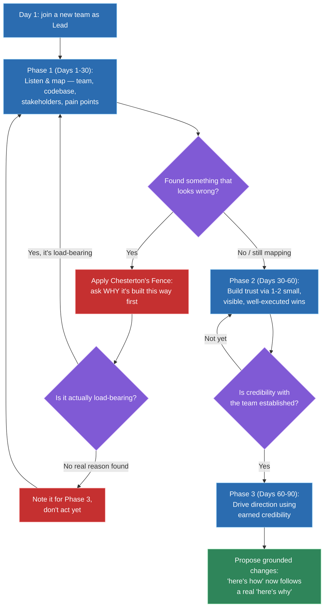
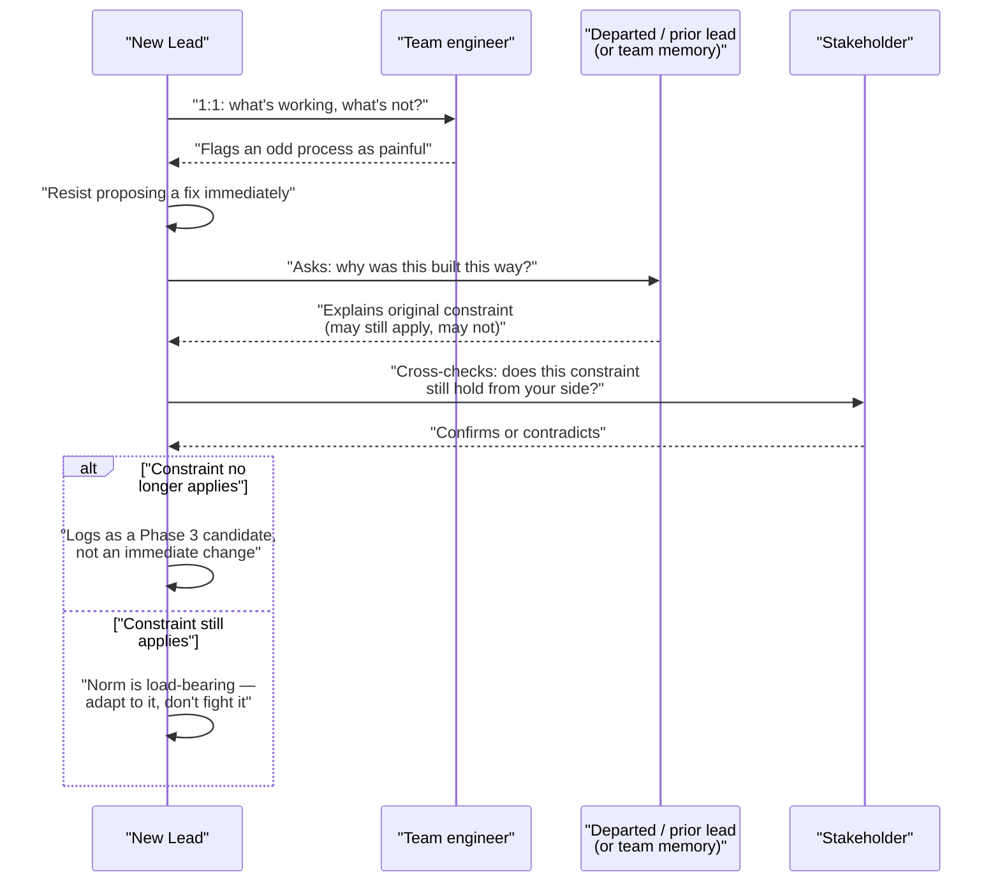

# Onboarding into a new team as a lead

## 🎯 Executive Summary

"Tell me about your first 90 days in a new role" sounds like a warm-up question, but it's testing something specific: does this candidate know that onboarding as a Lead is a different exercise than onboarding as an IC, or will they give the IC answer with a leadership title attached? An IC onboarding into a codebase can afford to move fast — reading code, shipping a small fix, asking questions freely, because nobody's trust is on the line yet. A Lead is onboarding into a codebase *and* a team's existing trust dynamics, unwritten norms, and political landscape simultaneously, and is expected to earn credibility fast with no established track record to draw on.

This is a must-know topic because nearly every experienced candidate has changed teams or companies at least once, and the question is asked precisely because it's easy to answer badly. The bad answer is generic ("I'd get to know the team and the codebase") or overconfident ("I'd assess what's broken and start fixing it"). The good answer is a deliberate, phased plan that explicitly distinguishes listening from acting — that's the actual signal, and it's the structure this topic builds.

## 🧠 Core Technical Deep Dive

### 1. Why Lead onboarding is a categorically different problem than IC onboarding

An IC's onboarding failure mode is technical: misunderstanding the codebase, shipping a bug, needing a few extra code reviews. It's low-stakes and self-correcting — the team expects a ramp-up period and adjusts accordingly. A Lead's onboarding failure mode is relational and reputational: misreading the team's trust dynamics, undermining a norm that existed for a good reason, or losing credibility with a stakeholder in the first month, in ways that are much harder to walk back than a bad code review.

The core asymmetry is that an IC's credibility comes largely from demonstrated technical output over time, while a Lead is expected to start *making calls that affect other people* — on priorities, on process, on who owns what — often before they've built the track record that would normally earn the right to make those calls. That gap between "authority granted by title" and "credibility earned with this specific team" is the whole problem this topic is about closing, deliberately and in order.

| Dimension | IC onboarding | Lead onboarding |
|---|---|---|
| Primary unknown | The codebase | The codebase, the team's trust dynamics, the political landscape |
| Failure mode | A bug, an awkward PR | A burned relationship, an undermined norm |
| Authority on day one | None assumed, none needed | Formal authority exists, but isn't yet backed by credibility |
| Recovery cost of a misstep | Low — usually one bad review cycle | High — trust, once spent, is slow to rebuild |
| What "moving fast" looks like | Shipping a small fix in week one | Often the wrong move — see Chesterton's Fence, below |

> **Key takeaway:** the interview signal here isn't "does the candidate know onboarding matters" — everyone says that — it's whether they can name the *specific* extra dimension a Lead has to onboard into beyond the codebase, and treat it as the harder half of the problem.

### 2. The 90-day framework: listen, build trust, then drive

The whiteboard-able structure is three roughly-30-day phases, each with a distinct primary goal, and each phase's most common failure is trying to do the next phase's job too early.

| Phase | Days | Primary goal | Common mistake |
|---|---|---|---|
| **1. Listen & map** | 1–30 | Understand the team, the codebase, the stakeholder landscape, and the existing pain points — without making structural changes | Proposing fixes before understanding why things are the way they are (see Chesterton's Fence) |
| **2. Build trust** | 30–60 | Earn credibility through a couple of small, visible, well-executed wins | Picking a win that's visible to the Lead's manager but invisible or irrelevant to the team itself |
| **3. Drive direction** | 60–90 | Use the credibility built in phase 2 to propose and lead actual change | Starting phase 3 work in phase 1, before there's any credibility to spend |

The phases aren't rigid calendar boundaries — a team in genuine crisis compresses the timeline (see Scenario 8), and a very small, low-stakes change can happen in phase 1 if it's uncontroversial and clearly beneficial. What doesn't compress is the *order*: mapping has to come before trust-building, and trust-building has to come before spending that trust on bigger asks. Skipping straight to phase 3 is the single most common way new Leads fail this transition, even when their eventual proposal turns out to be technically correct.

> **Key takeaway:** the three phases aren't about being slow — they're about sequencing correctly, and the interview answer that scores well names the phase, the goal, and the failure mode for skipping it, not just "I'd take it slow at first."

### 3. Chesterton's Fence: why proposing changes too early burns trust even when you're right

Chesterton's Fence is the principle that if you find a fence in a field and don't understand why it's there, the correct first move is to find out why before deciding to tear it down — the fact that its purpose isn't obvious to you doesn't mean it doesn't have one. Applied to onboarding, it's the single most useful discipline against the "add value fast" trap: a new Lead who proposes sweeping changes in week two reads as arrogant and burns trust, *even when the changes are technically correct*, because "technically correct" was never the thing being evaluated.

The reason this matters more for a Lead than an IC is that a Lead's proposals carry implicit weight — "here's how it should be" from someone with formal authority lands differently than the same suggestion from a peer, and a team that feels steamrolled once will route around the Lead quietly rather than push back openly. The fix isn't "never propose changes" — it's sequencing the question correctly: ask "why is it built this way" and get a real answer *before* proposing "here's how it should be," every time, no exceptions for ideas that feel obviously right.

This connects directly to phase 1 above: the mapping phase's actual job is collecting enough "why" answers that later proposals in phase 3 are grounded in the team's real constraints, not just imported from wherever the Lead worked before.

> **Key takeaway:** naming "Chesterton's Fence" and applying it specifically — ask why before proposing how, even when the fix seems obvious — is a stronger signal than generic "I'd be humble," because it gives the interviewer a concrete mechanism, not just a stated value.

### 4. Deliberate relationship-building: structured 1:1s as data collection, not introductions

Relationships with a new team don't happen by osmosis in daily standup — they have to be built deliberately, and the mechanism is structured 1:1s with every team member and every key cross-functional stakeholder in the first few weeks. The purpose of these 1:1s is explicitly *not* "hi, I'm the new Lead" — it's learning each person's honest view of what's working, what isn't, and what they'd change if they could, while the new Lead still has the credible excuse of being new enough to ask basic questions without it looking like second-guessing.

| Who | What to specifically learn |
|---|---|
| Each direct/team member | Their view of team health, what's genuinely working, what's quietly broken, how they like to be managed |
| The departed or existing lead (if reachable) | Context on decisions that look strange from the outside — a direct source of "why is it built this way" |
| Key cross-functional stakeholders (PM, design, adjacent eng teams) | Their view of the team's reliability, communication gaps, and where past friction came from |
| Skip-level / manager | What "success" is actually being measured against for this Lead, explicitly, not assumed |

The output of this phase isn't a set of new friends — it's a map: who trusts whom, where the real (not org-chart) decision-making happens, which pain points multiple people independently mention (a strong signal), and which are one person's pet complaint. That map is what phase 3's proposals get grounded in.

> **Key takeaway:** the interview-strong version of "I'd meet with the team" specifies the purpose (extracting honest signal on what's working, not making introductions), the scope (team plus cross-functional stakeholders, not just direct reports), and what's done with the output (a map that later decisions are grounded in).

### 5. Reading team culture before changing it

Every team has norms that look odd from the outside — an unusual review process, a testing convention, a meeting cadence that seems excessive or sparse. The Lead's job in the first 30-60 days is triage, not reform: distinguishing "this is actively harmful and should change soon" from "this is just different from what I'm used to, and my job is to understand it before I touch it."

| Signal | Likely category | What to do |
|---|---|---|
| Multiple people independently name it as a pain point, unprompted | Likely actively harmful | Worth investigating for a real fix, once credibility exists |
| It differs from what worked at the Lead's last company, but nobody on this team complains about it | Likely just different, not wrong | Understand the reason first — it may be load-bearing (see Scenario 5) |
| It visibly slows delivery or causes recurring incidents | Likely actively harmful | Candidate for an early, well-scoped fix |
| It's uncomfortable for the Lead personally but functional for the team | Likely just different | Adapt to it; changing it serves the Lead's comfort, not the team |

The trap to avoid explicitly is pattern-matching "different from what I'm used to" onto "wrong" — that's importing a previous team's culture wholesale rather than actually evaluating this one, and it's one of the fastest ways to alienate a team that was, by most measures, functioning fine before the new Lead arrived.

> **Key takeaway:** "harmful and should change" versus "just different and my job is to understand it" is a real distinction, not a rhetorical hedge — a Lead who can't articulate which category a given norm falls into, and why, hasn't actually evaluated it yet.

### 6. Establishing early technical credibility — without overreaching

A Lead doesn't need to out-code the team, and trying to prove technical superiority in week one usually backfires. What does need to happen is one or two visible, concrete, well-executed contributions early on — a real code review that catches something genuine, a small but cleanly-shipped fix — specifically because they earn the benefit of the doubt before the bigger leadership asks land in phase 3.

The selection criteria for these early contributions matter: they should be small enough to execute cleanly without disruption, visible to the people whose trust actually matters (not just upward-visible to the Lead's own manager), and genuinely useful rather than performative. A code review comment that catches a real edge case signals "this person understands our system" far more effectively than a large, flashy contribution that takes weeks and risks not landing well.

> **Key takeaway:** early technical credibility is a targeted, small-scope move — one or two well-chosen, genuinely useful contributions that are visible to the team, not a demonstration of raw coding output, and not a substitute for the listening phase that has to happen alongside it.

## 📊 Visual Architecture & Logic

### Diagram 1 — The 90-day phased framework

### Diagram 2 — Week 2: discovering a problem, resisting the urge to fix it immediately

## 🏢 Interview Context & FAANG Signals

This surfaces specifically for candidates who are **changing companies or teams** — "how would you approach your first 90 days in a new role" or "tell me about a time you joined a team that was already established" are the direct prompts, and it's a near-guaranteed question for anyone interviewing for a Lead role from outside the current org.

**Lead signals interviewers listen for:**

- A deliberate, phased plan that explicitly distinguishes *listening* from *acting* — not a generic "I'd get to know the team and codebase."
- Naming Chesterton's Fence, or the underlying principle, unprompted — asking "why" before proposing "how."
- Structured relationship-building with a stated purpose (extracting honest signal), not just "I'd have coffee chats."
- The ability to distinguish a norm worth changing from a norm worth adapting to, with a real example.
- A credible small-scope early win, not an implausible "I turned the team around in week one" story.
- Awareness that authority (from the title) and credibility (earned with this specific team) are different things that arrive on different timelines.

## ⚔️ Lead Level vs Senior Level

A **Senior** response usually describes the mechanics fine but generically: "I'd spend the first few weeks getting to know the team and the codebase, meet with people 1:1, and then start contributing." It's not wrong, but it's the same answer any competent IC would give, with no acknowledgment that a Lead is onboarding into anything beyond the technical surface.

A **Staff/Lead** response names the phases explicitly, with time-boxes and goals attached to each. It names Chesterton's Fence, or the equivalent discipline, as the reason sweeping week-two proposals fail even when they're technically right. It describes 1:1s by their *purpose* — collecting honest signal — not just their existence, and names cross-functional stakeholders, not only direct reports. Critically, it can distinguish a norm that's actively harmful from one that's just unfamiliar, with a real example of getting that call right (or wrong, and what was learned). And it's honest that formal authority and earned credibility arrive on different timelines, and that spending the first one before earning the second is the core failure mode of this whole transition.

## ⚠️ Common Pitfalls & Anti-Patterns

> ### ✕ Proposing sweeping changes in the first two weeks, even when technically correct
> **Why it's wrong:** Being right isn't what's being evaluated in week two — trust is. A team that feels steamrolled by an outsider's "here's how it should be" before that outsider has demonstrated any understanding of "why it currently is" will resist the change regardless of its merit, and the Lead's credibility takes the larger hit.
> **✓ Correct Lead Approach:** Apply Chesterton's Fence explicitly — ask why before proposing how — and hold real proposals until Phase 3, once credibility from Phase 2 exists to spend.

> ### ✕ Treating 1:1s as introductions instead of information-gathering
> **Why it's wrong:** "Getting to know people" without a specific purpose wastes the narrow window where a new Lead can ask basic, honest questions without it reading as scrutiny — that window closes once the Lead is seen as established.
> **✓ Correct Lead Approach:** Run structured 1:1s with a specific goal — each team member's and stakeholder's honest view of what's working and what isn't — and treat the output as a map to ground later decisions in.

> ### ✕ Importing what worked at the last company wholesale
> **Why it's wrong:** A norm that looks wrong because it's unfamiliar is not the same as a norm that's actually harmful, and replacing a functioning-but-different process with "what I'm used to" optimizes for the Lead's comfort, not the team's outcomes — and it signals the Lead hasn't actually evaluated the new context on its own terms.
> **✓ Correct Lead Approach:** Explicitly triage each unfamiliar norm into "load-bearing, adapt to it" versus "genuinely harmful, worth fixing once credible" before acting on either.

> ### ✕ Trying to prove technical superiority to earn the team's respect
> **Why it's wrong:** A Lead competing with the team's own engineers on raw coding output either loses (the team knows the codebase better) or wins in a way that reads as insecure and unnecessary — neither builds the kind of credibility a Lead actually needs.
> **✓ Correct Lead Approach:** Choose one or two small, genuinely useful, team-visible contributions — a sharp code review catch, a clean small fix — that demonstrate competence without competing for it.

> ### ✕ Letting "prove yourself fast" pressure from above compress the whole timeline
> **Why it's wrong:** A manager wanting quick visible impact is a real pressure, but collapsing straight to Phase 3 activity to satisfy it produces exactly the ungrounded, trust-burning proposals the framework exists to prevent — solving the manager's impatience by creating a team-trust problem is a bad trade.
> **✓ Correct Lead Approach:** Manage the pressure explicitly — communicate the phased plan and its rationale upward, and if an early visible win is needed, pull it from the legitimate Phase 2 category (a real, well-scoped fix) rather than skipping ahead.

## 🛠️ Practice Scenarios

### Scenario 1 — Inheriting a Team From a Departed, Well-Liked Previous Lead

The prior lead left on good terms and is remembered fondly; the team is still comparing the new Lead to them, sometimes out loud.

Staff-Level Solution

Don't compete with the memory or try to differentiate immediately — that reads as insecure and invites more comparison, not less. Use Phase 1 deliberately: if the prior lead is reachable, a direct 1:1 with them is one of the highest-value "why is it built this way" sources available, since they carry context nobody else has.

Let the team's comparisons happen without over-reacting to them; they fade naturally once the new Lead demonstrates competence and genuine understanding of the team, which is exactly what Phases 1 and 2 are built to produce. Trying to rush past the comparison with a big early move is the more common failure than the comparison itself.

### Scenario 2 — Discovering a Major Technical or Process Problem in Week 2

A clearly serious issue turns up almost immediately — a fragile deploy process, a testing gap, something that looks urgent.

Staff-Level Solution

Apply Chesterton's Fence before acting: find out why it's this way, whether it's a known and accepted risk, an active point of pain the team already wants fixed, or something nobody's had bandwidth to address. That answer changes what "acting" should look like.

If it's genuinely urgent and actively causing damage (not just suboptimal), a scoped, minimal fix in Phase 1 is defensible — the phases aren't a rule against ever acting early, they're a rule against acting *without understanding first*. If it's serious but not on fire, log it as a strong Phase 3 candidate, and use the fact that it's already understood as a credibility-building talking point during Phase 2's trust-building conversations.

### Scenario 3 — A Team Member Skeptical of the New Lead's Authority

One engineer visibly pushes back on direction, questions decisions in front of others, or otherwise signals they don't accept the new Lead's authority yet.

Staff-Level Solution

Resist responding with a formal-authority move ("I'm the lead, so—") — that escalates a credibility problem into a power struggle, which is a worse position. Address it directly and privately: a 1:1 focused on understanding their concerns specifically, which might be legitimate (they know something about the team's history the Lead doesn't yet) or might be a general skepticism of new leadership that needs to be earned down over time.

Either way, this individual is exactly the kind of relationship Phase 2's small, visible wins are meant to address — a genuinely useful contribution that this specific person can observe firsthand does more to shift their view than any conversation about authority would.

### Scenario 4 — A Stakeholder Tries to Bypass the New Lead and Go Straight to the Team

A PM or cross-functional stakeholder, used to working directly with the team under the prior structure, starts routing requests around the new Lead.

Staff-Level Solution

Don't treat this as a territorial affront to react to publicly — it's often just habit from before the Lead existed in this role, not a deliberate undermining. Address it in a direct 1:1 with the stakeholder, framed around making their own requests more effective (a single point of coordination reduces duplicate or conflicting asks to the team), not around asserting turf.

If it continues after that conversation, it becomes a Phase 2/3 signal worth raising with a manager or skip-level, since a persistent bypass pattern is a structural problem, not a one-off, and structural problems are appropriate to escalate once the Lead has tried the direct route first.

### Scenario 5 — An Existing Norm That Seemed Wrong Turns Out to Be Load-Bearing

A process the new Lead initially assumed was an obvious inefficiency turns out, on closer inspection, to be compensating for a real constraint (a flaky third-party dependency, a compliance requirement, a past incident).

Staff-Level Solution

This is Chesterton's Fence working exactly as intended — the "why" investigation surfaced a real reason before any change was proposed, which is the entire point of asking first. Update the mental map from Phase 1 and move on; no correction or announcement is needed since nothing was actually proposed or changed.

The value here is more subtle: having gone through this once, the Lead now has a concrete, specific example to reference later — with the team or with a skip-level — that demonstrates genuinely doing the diligence, not just claiming to.

### Scenario 6 — Balancing "Prove Yourself Fast" Pressure From Above Against Not Moving Too Fast With the Team

A manager wants to see visible impact within the first month; the team needs more time before big changes will land well.

Staff-Level Solution

Make the phased plan visible to the manager early and explicitly, rather than silently absorbing the pressure — most of this tension resolves once a manager understands that Phase 2's small, well-executed wins *are* the visible-impact story for month one, just scoped appropriately rather than sweeping.

If the manager still wants something bigger sooner, negotiate for a Phase-1-safe move: something uncontroversial, low-risk, and genuinely useful that doesn't require spending credibility the Lead hasn't built yet. What shouldn't happen is quietly compressing the whole framework to satisfy upward pressure at the team's expense — that trades a manageable problem (a manager wanting a status update) for a harder one (a team that doesn't trust its new Lead).

### Scenario 7 — Onboarding Remotely With Limited Face Time

The new Lead is joining a distributed or remote-first team with little synchronous overlap, making the usual informal information-gathering harder.

Staff-Level Solution

Replace informal osmosis with more deliberate structure, since remote onboarding removes the hallway conversations a Lead might otherwise lean on. Schedule the Phase 1 structured 1:1s even more explicitly than usual, and supplement them by reading artifacts asynchronously — past incident postmortems, design docs, Slack/chat history around key decisions — as a way of gathering "why is it built this way" context without needing live conversation for all of it.

Be more conservative than usual about Phase 3 timing in a low-context remote setup — misreading a team's dynamics is easier with less signal, so if anything, extend rather than compress the listening phase, and say so explicitly rather than letting silence be interpreted as disengagement.

### Scenario 8 — Handed a Team That's Already in Crisis on Day One

The new Lead's very first day coincides with an active incident, a missed deadline crisis, or a team in acute distress — there's no calm on-ramp available.

Staff-Level Solution

Acknowledge explicitly that the framework compresses under real crisis — Phase 1's normal 30-day pace isn't available when the team needs decisive action now, and pretending otherwise would be its own mistake. Act on the immediate crisis using the team's existing expertise and judgment rather than the Lead's own untested opinions, which functions as an accelerated, high-stakes version of "listen first": lean on the people who understand the system, don't override them.

Once the immediate fire is out, explicitly return to the framework rather than treating crisis-mode as the new normal — run the 1:1s, do the mapping, and be honest with the team that the first days were necessarily reactive and the deliberate onboarding is happening now. Skipping this reset, and continuing to lead in crisis-mode indefinitely, is a common way teams end up with a Lead who never actually builds the trust-based footing the rest of their tenure depends on.

