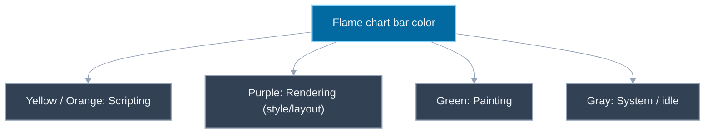
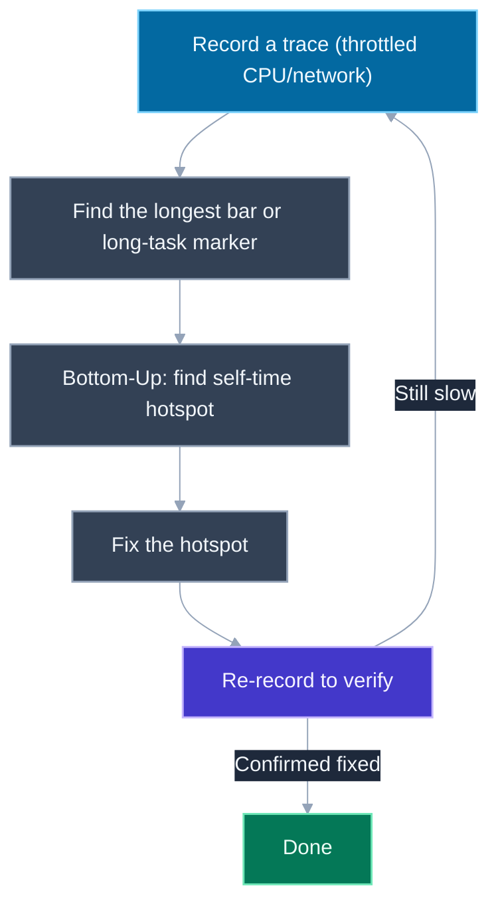

# Performance Profiling with Chrome DevTools: CPU Profiles, Flame Charts, Long Tasks, Memory Profiling

## 🎯 Executive Summary

Every framework-specific profiler — React's Profiler tab included — ultimately sits on top of the same underlying browser mechanics: JavaScript execution, style/layout recalculation, and paint, all competing for time on one main thread. Chrome's **Performance** panel is the framework-agnostic tool that shows all of that directly, regardless of whether the app is React, Vue, vanilla JS, or a mix — which makes it the tool you reach for when the question isn't "why did this component re-render" but "why does this page feel slow, period."

This is a MUST-KNOW topic at Lead/Staff level because it's the one profiling skill that transfers across every stack a candidate might work in next, and because interviewers use it to check whether a candidate can read a flame chart under pressure rather than just knowing the tool exists. Being able to say "the wide yellow bar under this interaction is a synchronous script call, here's the function at the top of its self-time in Bottom-Up" is a materially different signal than "I'd open the Performance tab and look around."

In interviews this surfaces as a live debugging exercise (a recorded trace or a live page with visible jank), a direct question about diagnosing slow input response or long tasks, or a follow-up to a Core Web Vitals discussion asking how you'd actually go find *what's* causing a poor INP score rather than just naming the metric.

## 📖 What Is It? (Plain-English Definition)

**In plain terms:** the Performance panel is a stopwatch-plus-recorder for the browser's main thread — you hit record, interact with the page the way a user would, hit stop, and get a detailed, second-by-second timeline of everything the browser did during that window.

Unlike a framework profiler that only knows about that framework's own concepts (components, renders, hooks), the Performance panel sees everything the browser thread actually does: every function call, every style recalculation, every layout pass, every paint, every garbage collection pause, laid out on one shared timeline. That makes it strictly lower-level and more verbose than a React Profiler trace, but also the only tool that can answer "is the problem even in my JavaScript, or is it layout thrashing, or is it something the browser itself is doing" — a question a framework-specific tool structurally can't answer because it doesn't see outside its own framework.

A useful mental model: if a framework profiler is like a restaurant's order-tracking system (which dish, which table, how long it sat in the queue), the Performance panel is a security camera pointed at the entire kitchen — it doesn't know what a "dish" is, but it shows literally every person, tool, and motion during the recorded window, and you have to interpret what you're looking at rather than have it pre-labeled for you.

This topic covers Chrome's general-purpose timeline recorder specifically. For React's own component-level view of render behavior, see [`react-devtools-profiler`](/topic-detail.html?id=react-devtools-profiler) — the two tools are complementary, not competing: the React Profiler tells you *which component* re-rendered and *why*; the Performance panel tells you what that render actually cost the main thread in absolute terms, alongside everything else running at the same time.

## 🧠 Core Technical Deep Dive

### Performance tab vs. Performance Monitor — two different, easily confused tools

Chrome ships two separate things that share a name and sit near each other in DevTools, and mixing them up is a real, documented source of confusion:

- **Performance panel** (the subject of this topic): a **recorder**. You explicitly click record, perform an interaction, and stop — it then presents a detailed, static trace of exactly that window, with a flame chart, call trees, and every other view described below.
- **Performance Monitor**: a separate panel (`Cmd/Ctrl+Shift+P` → "Show Performance Monitor") that is **always live** — a set of continuously updating dashboard gauges (CPU usage, JS heap size, DOM node count, JS event listener count, layout/style recalc rate) with **no record button and no detailed timeline**. It's useful for a quick, at-a-glance "is something climbing unboundedly right now" check (e.g., watching DOM node count creep up as a sign of a leak), but it gives you none of the causal detail — no call stacks, no flame chart, no way to see *which function* caused a spike.

> **Key takeaway:** if you need to know *what caused* a slowdown, you want the Performance panel's recorded trace. If you just want a live pulse-check on a running page (memory climbing, CPU pegged), the Performance Monitor is faster to open but tells you nothing about cause.

### Reading the flame chart

After recording, the **Main** thread track shows a flame chart: each JavaScript call frame is a horizontal bar, stacked so a function's callees appear as narrower bars directly beneath it. Two dimensions carry the information:

- **Width = time spent.** A wide bar took a long time; a razor-thin sliver took almost none. Scanning for the widest bars is the fastest way to spot expensive work visually before reading any numbers.
- **Depth = call stack nesting.** The further down (deeper) a bar sits, the more nested calls it took to reach it — a tall stack of narrow bars under one wide bar usually means one expensive top-level call fanned out into many smaller sub-calls.

**Color is not decorative — it triages the *kind* of work before you dig into *which* function:**

| Color | Category | What it means |
|---|---|---|
| Yellow / orange | Scripting | JavaScript execution — your code, library code, event handlers |
| Purple | Rendering | Style recalculation and layout (reflow) |
| Green | Painting | Actually painting pixels / compositing |
| Gray | System / idle | Browser-internal bookkeeping, or genuinely idle time |

Glancing at the color mix in a busy stretch of the timeline tells you *what kind* of problem you're chasing before you've read a single function name: a wide band of purple means layout thrashing (likely repeated forced reflows from reading layout properties in a loop), a wide band of yellow means a scripting bottleneck (worth diving into with Bottom-Up), a wide band of green out of proportion to visible content change means an expensive paint (large repaint area, expensive CSS effects). Jumping straight to function names without first reading the color mix means potentially spending time optimizing JavaScript when the actual cost is layout, or vice versa.

> **Key takeaway:** read color before you read function names. It tells you which of "my code," "the browser's layout engine," or "the browser's paint pipeline" to investigate, which determines whether the fix is in your JS at all.

### Long Tasks: the 50ms threshold

Any task on the main thread longer than **50ms** is flagged directly in the flame chart with a small **red triangle** in the top-right corner of that task's bar. This isn't an arbitrary DevTools styling choice — 50ms is the threshold established by the Long Tasks API and web performance research as the point past which a task starts to feel like it's blocking user input: below it, the browser can generally still respond to a click or keystroke without a perceptible delay; above it, input has to queue behind the task, and the user notices.

This threshold is the mechanical reason behind poor **INP** (Interaction to Next Paint) scores — see [`core-web-vitals`](/topic-detail.html?id=core-web-vitals) for the metric itself. A single long task doesn't have to be the entire cause of a bad INP number, but a pattern of long tasks clustered around when users are actually interacting (clicking, typing) is exactly the kind of thing a Performance trace surfaces that a Core Web Vitals field-data dashboard can't — the dashboard tells you INP is bad in aggregate; the trace shows you the actual task that blocked a specific interaction.

> **Key takeaway:** when hunting for a poor INP score, look for the red-triangle-marked tasks that overlap with interaction timestamps in the trace — not just the single longest task in the recording overall, which might not even coincide with user input.

### Three views of the same underlying data

Below the flame chart, DevTools offers the same captured call data through three different lenses, each suited to a different question:

- **Bottom-Up**: sorts by **self time** — time spent inside a function's *own* code, excluding time spent in functions it called. This is almost always the right first stop, because it directly answers "which single function is the actual hotspot" without you having to manually walk down through wrapper functions and dispatchers that show large *total* time only because of what they call, not because of what they themselves do.
- **Call Tree**: shows the call hierarchy top-down, starting from root callers (event handlers, timers, rAF callbacks) and expanding into what each one called. Better for answering "what triggered this work" or "what's the full path from user interaction to this expensive function" than for finding the hotspot itself.
- **Event Log**: a flat, chronological list of every recorded event in the trace, in the order it happened, with no aggregation. Useful for reconstructing a precise sequence of events (e.g., "did the resize handler fire before or after the layout thrash") when the aggregated views above lose that ordering information.

> **Key takeaway:** Bottom-Up first to find *what's* slow by self time; Call Tree next if you need to understand *what's calling it and why*; Event Log only when you need exact chronological ordering the other two views collapse away.

### CPU and network throttling

Profiling on a fast development machine over a fast connection systematically hides the performance experience of a meaningful share of real users. DevTools' Performance panel has built-in throttling controls (a CPU slider — e.g., 4x or 6x slowdown — and network presets like "Slow 4G"/"Fast 3G") specifically so you can record a trace that's representative of a mid-tier mobile device on a real-world network instead of your development laptop on office Wi-Fi.

A task that takes 8ms unthrottled — comfortably under the 50ms long-task threshold — can easily become a 40-50ms task under 4x-6x CPU throttling, crossing into long-task territory and materially changing the diagnosis. Always profile with both CPU and network throttling enabled (matched to the actual target device/network profile for the product, where known) before concluding something is fast enough; a trace recorded at native machine speed routinely understates real-world cost by several multiples.

> **Key takeaway:** an unthrottled trace on a fast dev machine tells you almost nothing about whether real users experience jank — throttle both CPU and network before drawing conclusions about "is this fast enough."

### Memory profiling: a related but separate investigation

The Performance panel can show a memory *overview* track (heap size over time) alongside the CPU trace, which is useful for spotting a heap that climbs and never comes back down across repeated interactions — a classic leak signature. But diagnosing *why* memory is leaking — which objects are being retained, by what reference chain, across which snapshots — is the job of the separate **Memory** panel (heap snapshots, allocation timelines, comparison views), not the Performance panel.

This topic intentionally doesn't re-cover that ground: for the mechanics of taking and comparing heap snapshots, retainer trees, and the GC/memory-lifecycle concepts underneath all of it, see [`memory-management-gc`](/topic-detail.html?id=memory-management-gc), [`resources/memory-leak-debugging.html`](resources/memory-leak-debugging.html), and [`resources/js-memory-visualizer.html`](resources/js-memory-visualizer.html).

> **Key takeaway:** a performance investigation (is the main thread doing too much work, is it responsive) and a memory-leak investigation (is something being retained that shouldn't be) are related — a leak can eventually cause performance symptoms as GC pressure rises — but they're different panels, different workflows, and usually different root causes. Don't try to diagnose a leak from a CPU flame chart, or a scripting bottleneck from a heap snapshot.

### The investigative loop

Parallel to the "capture, read, fix" loops used elsewhere in this repo's profiling material (the React Profiler's re-render loop, the memory-leak snapshot-comparison loop), the Performance panel has its own version:

**Record → find the longest bar/task → drop into Bottom-Up to find the self-time hotspot → fix the hotspot → re-record to verify.**

Skipping the last step and assuming a fix worked is the same mistake here as anywhere else in performance work — a change that looks obviously correct can fail to move the needle (or even regress something else) if the actual bottleneck was misdiagnosed, and the only way to know is a fresh trace under the same conditions (same throttling, same interaction) as the original.

## 📊 Visual Architecture & Logic

### Diagram 1 — Flame chart color legend



### Diagram 2 — The investigative loop



## 🏢 Interview Context & FAANG Signals

| Interview Stage | Format |
|---|---|
| Live debugging | Given a laggy page or a pre-recorded trace, asked to find and explain the bottleneck |
| Core Web Vitals follow-up | "INP is poor in the field — how would you go find what's causing it?" |
| System design | Asked how the team would identify and prevent main-thread jank at scale |
| Trivia/knowledge check | "What's the difference between the Performance panel and Performance Monitor?" |

**Lead signals interviewers listen for:**

1. Correctly distinguishing the Performance panel (recorded trace) from Performance Monitor (live gauges, no record) without being prompted.
2. Reading flame chart color to triage scripting vs. rendering vs. painting before diving into specific function names.
3. Naming the 50ms Long Task threshold and connecting it directly to INP/input responsiveness.
4. Going to Bottom-Up first (self time) rather than manually eyeballing the flame chart or Call Tree to find a hotspot.
5. Mentioning CPU/network throttling unprompted when asked to evaluate whether something is "fast enough."
6. Correctly treating memory-leak diagnosis as a separate panel/workflow rather than conflating it with CPU profiling.

## ⚔️ Lead Level vs Senior Level

**Question: "Field data shows this page has a poor INP score. Walk me through how you'd investigate."**

> **Senior Response:** "I'd open Chrome DevTools, go to the Performance tab, record while clicking around the page, and look for long tasks. Then I'd find the slow function and optimize it."

> **Staff/Lead Response:** "First I'd throttle CPU (4x-6x) and network to a representative mobile/3G profile, since INP is a field metric and our dev machines are almost certainly faster than a meaningful share of real users' devices — an unthrottled trace can hide a task that's actually long task territory for real users. I'd record while performing the specific interaction the field data flags as slow, rather than clicking around generally, since INP is about a specific interaction's responsiveness, not aggregate page activity. In the trace, I'd look for red-triangle-marked long tasks that overlap with the interaction's timestamp specifically, then use Bottom-Up on that window to find the actual self-time hotspot rather than assuming the widest bar in the Call Tree is the root cause — often it's a deeply nested function doing real work under a dispatcher that just looks expensive because of what it calls. I'd also check the color mix before assuming it's a scripting problem — if there's a wide purple band, it's layout thrashing from something reading layout properties in a loop, which is a different fix (batch the reads/writes) than a slow synchronous function (which might mean deferring with `requestIdleCallback`/`scheduler.postTask`, or, in a React app, `startTransition`). Once I have a fix, I'd re-record under the same throttled conditions to confirm the long task is actually gone before calling it done."

The differentiator: a Senior treats "find the long task, fix the function" as the whole investigation; a Lead throttles to representative conditions first, ties the investigation to the specific flagged interaction, uses color to triage the category of work before hunting for a function, and closes the loop with a verifying re-record.

## ⚠️ Common Pitfalls & Anti-Patterns

> ### ✕ Profiling on a fast dev machine with no throttling
> **Why it's wrong:** A task that's comfortably under the 50ms long-task threshold at native machine speed can easily cross it under realistic mobile CPU throttling — an unthrottled trace can miss the exact problem the field data (measured on real, often slower, devices) is reporting.
> **✓ Correct Lead Approach:** Always enable CPU and network throttling matched to a representative device/network profile before drawing conclusions from a trace.

---

> ### ✕ Confusing the Performance panel with Performance Monitor
> **Why it's wrong:** Performance Monitor has no record button and no call-stack detail — it's a live dashboard of gauges. Trying to diagnose *what caused* a slowdown from it is impossible by design; it can only tell you *that* something (CPU, heap, node count) is currently elevated, not why.
> **✓ Correct Lead Approach:** Use Performance Monitor only for a quick live pulse-check; use the Performance panel's recorded trace whenever the question is "what caused this."

---

> ### ✕ Jumping straight to function names without reading flame chart color
> **Why it's wrong:** Without checking the color mix first, it's easy to sink time investigating "why is my JavaScript slow" when the actual bottleneck is purple (layout thrashing) or green (expensive paint) — categories no amount of JS optimization will fix.
> **✓ Correct Lead Approach:** Scan the color distribution in the slow region first to determine whether the problem is scripting, rendering, or painting, then dig into specific functions only within the category the colors point to.

---

> ### ✕ Reading Call Tree (or eyeballing the flame chart) instead of Bottom-Up to find a hotspot
> **Why it's wrong:** Call Tree and the raw flame chart show *total* time including everything a function called, so a dispatcher or wrapper function can look like the biggest offender purely because of what's nested under it, obscuring which function is actually doing the expensive work itself.
> **✓ Correct Lead Approach:** Start in Bottom-Up, sorted by self time, to identify the actual hotspot function directly, then use Call Tree afterward if you need to understand the calling context.

---

> ### ✕ Diagnosing a memory leak from a CPU trace, or a scripting bottleneck from a heap snapshot
> **Why it's wrong:** The Performance panel's memory overview track can show a symptom (heap climbing over time) but not a cause (which objects, retained by what reference chain) — that requires the separate Memory panel's snapshot/comparison workflow. Conversely, a heap snapshot has no timeline information about main-thread scripting cost.
> **✓ Correct Lead Approach:** Treat performance investigation (Performance panel) and memory-leak investigation (Memory panel) as related but distinct workflows, and switch panels deliberately based on which question is being asked — see [`memory-management-gc`](/topic-detail.html?id=memory-management-gc) and [`resources/memory-leak-debugging.html`](resources/memory-leak-debugging.html) for the memory-specific workflow.

## 🛠️ Practice Scenarios

### Scenario 1: A button click feels sluggish, and the trace looks like this

**Problem:**
```javascript
function handleFilterClick(items, filterText) {
  // Called synchronously on every click of the "Apply Filter" button
  const results = items.filter(item =>
    item.description.toLowerCase().includes(filterText.toLowerCase())
  );

  results.forEach(item => {
    const el = document.getElementById(item.id);
    el.style.display = 'block';       // write
    const height = el.offsetHeight;   // read — forces layout if a write is pending
    el.dataset.measuredHeight = height;
  });

  renderResultsCount(results.length);
}
```
You record a trace of a click on "Apply Filter" for a 5,000-item dataset. The flame chart shows a wide bar with a red triangle, and a notable purple band inside it in addition to yellow. What does the color mix tell you, and what would you check next in the trace views?

<details>
<summary>Staff-Level Solution</summary>

The yellow portion is the `.filter()`/`.toLowerCase()` work — plain scripting. The purple band alongside it, inside the same long task, points to forced synchronous layout: writing `el.style.display` and then immediately reading `el.offsetHeight` inside the same loop forces the browser to flush pending layout on every iteration instead of batching all writes and then all reads, turning an O(1)-layout-flush operation into an O(n) one across 5,000 items. The red triangle confirms this crossed the 50ms long-task threshold, which is exactly the kind of task that would show up as poor INP if this button press is a tracked interaction.

Next I'd check Bottom-Up to confirm self-time is concentrated in the layout-forcing code path rather than in `.filter()` itself, to make sure I'm fixing the actual majority cost and not just the one I noticed visually. The fix: separate the loop into a read phase and a write phase (read all needed values first, or avoid reading `offsetHeight` back at all if it's not truly needed after the fact), so all style writes batch together and the browser does one layout pass instead of 5,000. I'd re-record the same click afterward and confirm both the purple band and the red triangle are gone.
</details>

---

### Scenario 2: Performance looks fine locally, field data says otherwise

**Problem:**
```javascript
// package.json dev script — team always tests here
// "dev": "vite --host"
// Recorded on: M-series laptop, dev build, office Wi-Fi, DevTools Performance tab, no throttling applied
```
A team consistently profiles this way and concludes "no long tasks, we're fine," but the product's real-user INP metrics (from field data / CrUX) are poor. What's the gap, and how would you close it?

<details>
<summary>Staff-Level Solution</summary>

The gap is representativeness: an unthrottled trace on a fast laptop, on fast Wi-Fi, is measuring a best-case device/network combination that a meaningful share of real users don't have. A task that takes, say, 12ms locally can easily run 3-6x slower on a mid-tier mobile CPU, pushing it past the 50ms long-task threshold and directly harming a real user's INP even though the local trace showed nothing — this is exactly why field metrics (measuring real users) and local unthrottled profiling (measuring the best case) can disagree.

I'd have the team re-profile with the Performance panel's CPU throttling set to 4x-6x slowdown and network throttling set to a representative mobile preset (e.g., "Slow 4G"), ideally matched to whatever device/network mix the field data or analytics show real users are actually on, and re-run the same interactions. I'd expect this to surface long tasks the unthrottled trace hid, and I'd treat the throttled trace — not the unthrottled one — as the one that determines whether a fix is actually needed and whether it worked.
</details>

---

### Scenario 3: A slow interaction, and the flame chart points somewhere unexpected

**Problem:**
```javascript
function onSearchInput(event) {
  updateSearchState(event.target.value);   // cheap — just setState-equivalent
  logAnalyticsEvent('search_input', {       // looks innocuous
    value: event.target.value,
    timestamp: Date.now(),
    context: buildFullPageContext(),        // expensive: walks the whole DOM tree
  });
}
```
The Call Tree shows `onSearchInput` as the top-level long task, which isn't surprising — but a teammate assumes `updateSearchState` (the "real" app logic) must be the slow part and starts optimizing it. The Bottom-Up view tells a different story. What would it show, and what's the actual fix?

<details>
<summary>Staff-Level Solution</summary>

Call Tree shows `onSearchInput` as the top-level entry because it's the root of the call — that's expected and uninformative about which *specific* call inside it is expensive. Bottom-Up, sorted by self time, would show `buildFullPageContext` (or whatever DOM-walking function it calls) as the actual hotspot, with `updateSearchState` contributing comparatively little self time — the teammate's assumption was based on which function looked most "important" to the feature, not on where time was actually measured to be spent.

The real fix has nothing to do with `updateSearchState`: `logAnalyticsEvent`'s `buildFullPageContext()` call is doing expensive, synchronous DOM traversal on every keystroke as a side effect of logging, which is both unnecessary at that frequency and not something the user is waiting on. I'd move the analytics call off the critical interaction path — debounce/throttle it so it doesn't run on every keystroke, and/or defer it with `requestIdleCallback` or `queueMicrotask`-style scheduling so it doesn't block the input's own responsiveness — rather than spending time optimizing `updateSearchState`, which Bottom-Up shows was never the actual cost.
</details>
